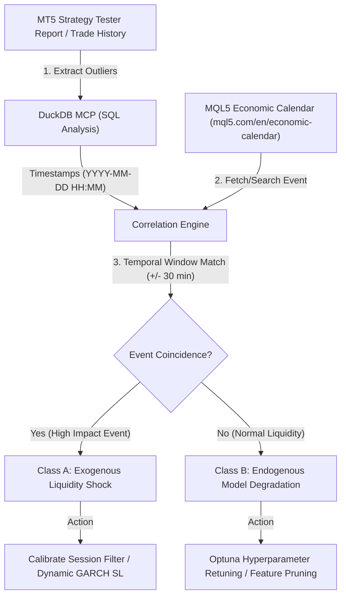

# Economic Calendar & Macroeconomic Backtest Auditor Runbook

Use this skill when auditing MetaTrader 5 Strategy Tester backtest results, analyzing drawdowns, evaluating clusters of Stop Loss closures, or diagnosing execution slippage anomalies.

---

## 1. Authoritative Calendar Benchmark: MQL5 Economic Calendar

The institutional benchmark for all Forex macroeconomic event analysis in this pipeline is the **[MQL5 Economic Calendar](https://www.mql5.com/en/economic-calendar)**. It covers over 900 macroeconomic indicators across major global currency jurisdictions (USD, EUR, GBP, JPY, AUD, CAD, CHF, NZD) with millisecond-accurate timestamps, actual figures, consensus forecasts, and historical revisions.

---

## 2. High-Performance MCP Tooling Architecture

To cross-reference backtest trade telemetry with economic news without token bloat or external API keys, the agent utilizes three specialized MCP servers:

1. **`duckdb` MCP (`mcp-server-duckdb`)**:
   - **Role**: Fast analytical OLAP queries directly over Strategy Tester CSV exports or deal logs.
   - **Command**: Filters trade closures where $\text{NetProfit} < 0$, identifying clusters of loss transactions, maximum drawdown timestamps, and slippage outliers ($> 3\times$ typical spread).
2. **`fetch` MCP (`@modelcontextprotocol/server-fetch`)**:
   - **Role**: Live HTTP extraction from `https://www.mql5.com/en/economic-calendar`.
   - **Command**: Fetches real-time releases, scheduled high-impact events, and consensus forecasts directly into structured markdown format.
3. **`duckduckgo-search` MCP (`duckduckgo-mcp-server`)**:
   - **Role**: Historical release lookup for backtest periods.
   - **Command**: Queries past catalyst releases matching backtest dates (e.g., `site:mql5.com/en/economic-calendar "USD" "Non-Farm Payrolls" 2024-06-07`).
4. **`economic-calendar` Native MCP Server (`src.tools.macro_calendar --mcp`)**:
   - **Role**: Dedicated zero-dependency project MCP server providing native JSON-RPC 2.0 tools: `get_mql5_economic_calendar`, `get_economic_news`, `get_high_impact_catalysts`, and `audit_backtest_anomaly`.

---

## 3. Four-Stage Diagnostic Protocol

### Stage 1: Quant Outlier Identification (via DuckDB)
- Query backtest transactions to extract timestamps (`YYYY-MM-DD HH:MM`) of:
  - Consecutive Stop Loss clusters ($\ge 3$ consecutive losses).
  - Maximum equity drawdown inflection points.
  - Deals with abnormal execution slippage.

### Stage 2: Temporal Cross-Referencing (via Fetch & DuckDuckGo)
- Query the MQL5 Economic Calendar (`https://www.mql5.com/en/economic-calendar`) or search historical news around the target timestamps ($\pm 30$ minutes):
  - **USD**: Non-Farm Payrolls (NFP - 1st Friday 12:30/13:30 UTC), FOMC Rate Decisions & Press Conferences, CPI, Jackson Hole, Core PCE.
  - **EUR**: ECB Rate Decisions & Monetary Policy Statements, German Prelim CPI, Eurozone Flash GDP.
  - **GBP**: BOE Official Bank Rate, Monetary Policy Summary, CPI y/y, GDP m/m.
  - **JPY**: BOJ Policy Rate Decisions, Core CPI, Ministry of Finance intervention commentary.
  - **AUD / NZD / CAD / CHF**: RBA, RBNZ, BOC, SNB Rate Decisions and Employment Changes.

### Stage 3: Root-Cause Attribution

| Diagnostic Class | Characteristics | Quantitative Attribution | Corrective Strategy |
| :--- | :--- | :--- | :--- |
| **Class A: Exogenous Macro Shock** *(Red Folder Event)* | Drawdown coincides with a scheduled high-impact release; spread widened $5\times - 10\times$; large price gap or severe slippage candle. | **EA logic is sound.** The trading system was impacted by an exogenous market microstructure liquidity vacuum rather than a machine learning defect. | 1. Enable session-based trading restrictions (`USE_OPEN_MARKETS=1`). 2. Avoid opening new positions within $\pm 30$ minutes of high-impact releases. 3. Adjust GARCH multiplier $K_{\text{SL}}$ for elevated volatility regimes. |
| **Class B: Endogenous Model Degradation** *(Algorithmic Defect)* | Losses occurred during calm, normal market liquidity without any macroeconomic announcements. | **Model logic or risk sizing failure.** Indicates feature noise, regime shift, overfitted decision trees, or under-calibrated probability threshold. | 1. Retrain dual XGBoost classifiers with Bayesian Optuna optimization. 2. Strengthen tree regularization (`XGB_MAX_DEPTH <= 4`, `XGB_LAMBDA >= 1.0`). 3. Recalibrate `InpMinimalLevelAccepted` threshold. |

### Stage 4: Execution Recommendations & Reporting
- Generate an audit summary documenting each drawdown cluster, its associated MQL5 Economic Calendar event (if any), and the exact quantitative remedy recommended to the user.
