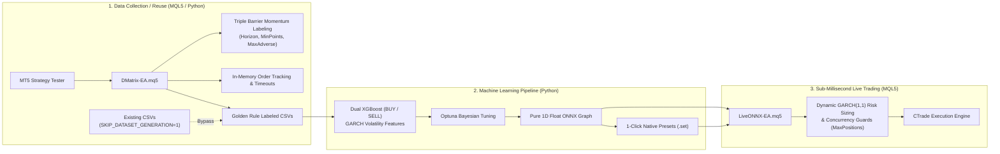

# MetaTrader 5 (MT5) Machine Learning Forex Trading

An industrial-grade, end-to-end quantitative trading pipeline that unifies **Python MLOps** with **MetaTrader 5 (MQL5)** for high-frequency algorithmic execution.

---

## 🏛️ System Architecture



---

## 📂 Repository Structure

```
mt5-fx-countdown/
├── .env.example                               # Full environment configuration template
├── .env                                       # Local environment configuration
├── requirements.txt                           # Python dependencies
├── run_pipeline.py                            # End-to-end MLOps pipeline orchestrator
├── MQL5/
│   ├── Include/
│   │   ├── ConsecutiveManager.mqh             # Consecutive signals, swap amortization & opposing regime defense
│   │   ├── FeatureExtractor.mqh               # 14 feature groups (incl. GARCH) & lookback flattener
│   │   ├── GarchEngine.mqh                    # GARCH(1,1) volatility & risk calculator
│   │   └── OrderTracker.mqh                   # In-memory ticket tracker, timeouts & Golden Rule labeling
│   └── Experts/
│       ├── DMatrix-EA.mq5                     # Historical dataset collector EA (Triple Barrier)
│       └── LiveONNX-EA.mq5                    # Live trading EA with native ONNX, consecutive signals & opposing defense
├── src/
│   ├── cleaner.py                             # Atomic scoped cleaner for symbol/timeframe artifacts
│   ├── config.py                              # Strictly typed dataclass configuration loader (DirectionalXGBConfig & AppConfig)
│   ├── dataset_manager.py                     # Dataset discovery, validation, and metadata management
│   ├── mt5_client.py                          # MT5 API client, compiler, and tester runner
│   ├── onnx_exporter.py                       # Pure 1D float ONNX exporter (No ZipMap) & deployer
│   ├── preset_generator.py                    # Native MT5 .set preset file generator
│   ├── template_generator.py                  # MT5 chart template (.tpl) generator
│   ├── trainer.py                             # Dual XGBoost trainer with Optuna, directional decoupling & sensitivity grid
│   └── tools/
│       └── macro_calendar.py                  # Macroeconomic calendar diagnostic utility
├── docs/
│   ├── ARCHITECTURE.md                        # Technical specifications & mathematical modeling
│   ├── FLOWCHART.md                           # Comprehensive lifecycle flowchart maps
│   └── MLOPS_PIPELINE_GUIDE.md                # Operational guide & configuration reference
├── knowledge_base/
│   ├── README.md                              # Knowledge base directory index
│   ├── INPUT_TAXONOMY_AND_IMPACT_MATRIX.md    # Exhaustive parameter taxonomy, sensitivity matrix & codebase audit
│   ├── OUTPUT_TAXONOMY_AND_EXECUTION_SIGNALS.md# Complete ecosystem output taxonomy and causal order routing protocol
│   ├── SYSTEM_ONTOLOGY_AND_DATA_FLOW.md       # Full ontology, data contracts, and class lifecycle architecture
│   ├── FOREX_MARKET_DYNAMICS_AND_TIMEFRAMES.md# Publication-grade market dynamics & timeframe scaling analysis
│   ├── TRAIN_SERVING_SKEW_AND_PARITY_AUDIT.md # Mathematical zero-skew proof, 26-feature parity & drift governance
│   ├── FMEA_AND_RESILIENCE_ENGINEERING.md     # Failure Mode & Effects Analysis (IEC 60812), FTA & fault tolerance
│   ├── CODE_COMPLEXITY_AND_ARCHITECTURAL_METRICS.md # McCabe, Halstead, MI, and coupling metrics across MQL5 and Python
│   └── FORMAL_VERIFICATION_AND_STATE_SPACE.md # Formal FSM models, Hoare safety proofs, and 111-parameter BVA matrix
└── tests/                                     # Automated test suite (168 unit & integration tests)
```

---

## 🚀 Quick Start

### 1. Setup Environment
```powershell
# Create and activate virtual environment
python -m venv .venv
.venv\Scripts\activate

# Install dependencies
pip install -r requirements.txt
```

### 2. Configure Environment (`.env`)
Copy the template and adjust paths to your local MT5 terminal:
```powershell
copy .env.example .env
```

### 3. Run Pipeline (Three Execution Modes)

#### Mode A: Full End-to-End Automated Pipeline
Runs cleanup, synchronizes MQL5 code, compiles `DMatrix-EA.mq5`, executes backtest to collect data, trains dual XGBoost models with Optuna, exports 1D float ONNX graphs, deploys presets, and compiles `LiveONNX-EA.mq5`:
```powershell
python run_pipeline.py
```

#### Mode B: Reuse Existing Datasets (Skip Strategy Tester)
Skips Strategy Tester execution and reuses existing datasets if available, directly proceeding to XGBoost training, Optuna optimization, ONNX export, and `LiveONNX-EA.mq5` compilation:
```powershell
python run_pipeline.py --skip-dataset
```

#### Mode C: Compile-Only Mode
Synchronizes workspace MQL5 files to the terminal directory, updates native presets and chart templates, and compiles both EAs via MetaEditor CLI.
> **Note**: This mode **strictly preserves** all existing `.onnx` models and historical `.csv` datasets (they will **not** be deleted or overwritten):
```powershell
python run_pipeline.py --compile-only
```

### 4. Run Test Suite
```powershell
pytest tests/ -v
```

---

## 📚 In-Depth Documentation

Detailed technical and operational documentation is available in `docs/`:

- 📖 **[Architecture & Technical Specifications](docs/ARCHITECTURE.md)**: GARCH(1,1) Bollerslev (1986) volatility formulation, Golden Rule labeling invariant, 13 feature extraction groups, chronological time-series split, and ONNX tensor graph contracts.
- 🗺️ **[System Flowcharts & Lifecycle Maps](docs/FLOWCHART.md)**: Exhaustive Mermaid diagrams mapping the Python Orchestrator, `DMatrix-EA.mq5`, and `LiveONNX-EA.mq5` execution lifecycles.
- 🚀 **[MLOps Pipeline Operational Guide](docs/MLOPS_PIPELINE_GUIDE.md)**: Full 68-parameter configuration reference table, MT5 chart attachment, and troubleshooting FAQ.
- 📖 **[Input Taxonomy & Impact Matrix](knowledge_base/INPUT_TAXONOMY_AND_IMPACT_MATRIX.md)**: Exhaustive quantitative parameter dictionary, 3-tier sensitivity matrix across all 89 `.env`/`AppConfig` parameters, 67 `DMatrix-EA` inputs, and 82 `LiveONNX-EA` inputs, cross-network tensor propagation, and codebase audit.
- 📑 **[Output Taxonomy & Execution Signals](knowledge_base/OUTPUT_TAXONOMY_AND_EXECUTION_SIGNALS.md)**: Exhaustive taxonomy of all datasets, models, artifacts, macro DB signals, and live market orders, featuring causal flowcharts and quantitative systems audit.
- 🏛️ **[System Ontology & Data Flow](knowledge_base/SYSTEM_ONTOLOGY_AND_DATA_FLOW.md)**: Publication-grade domain ontology, class architectures, data flow contracts, and lifecycle state machines across Python and MQL5.
- 📊 **[Forex Market Dynamics & Timeframes](knowledge_base/FOREX_MARKET_DYNAMICS_AND_TIMEFRAMES.md)**: Exhaustive econometric analysis of the 5-day continuous FX market cycle, cross-timeframe volatility scaling ($M1$ to $D1$), noise-to-signal implications for XGBoost, Triple Barrier adaptation, major currency pairs microstructure, and codebase architectural audit.
- ⚖️ **[Train-Serving Skew & Parity Audit](knowledge_base/TRAIN_SERVING_SKEW_AND_PARITY_AUDIT.md)**: Mathematical zero-skew proof, 26-feature verification matrix across 5 lags ($D=130$), closed-bar GARCH recurrence theorem, Triple Barrier vs live risk reconciliation, and covariate shift governance.
- 🛡️ **[FMEA & Resilience Engineering](knowledge_base/FMEA_AND_RESILIENCE_ENGINEERING.md)**: Full Failure Mode & Effects Analysis (IEC 60812 / SAE J1739), Fault Tree Analysis with Minimal Cut Sets, and defensive state machines across all five pipeline subsystems.
- 🔬 **[Code Complexity & Architectural Metrics](knowledge_base/CODE_COMPLEXITY_AND_ARCHITECTURAL_METRICS.md)**: Exhaustive McCabe Cyclomatic Complexity, Halstead Software Science, Maintainability Index, and Robert C. Martin Coupling & Modularity audit across MQL5 and Python.
- 📐 **[Formal Verification & State Space](knowledge_base/FORMAL_VERIFICATION_AND_STATE_SPACE.md)**: Formal Finite State Machine (FSM) models, Hoare logic assertions, safety/risk/liveness/deadlock proofs, and exhaustive Boundary Value Analysis (BVA) of all 111 parameters.

---

## 📄 License
This project is open-source and released under the MIT License.
