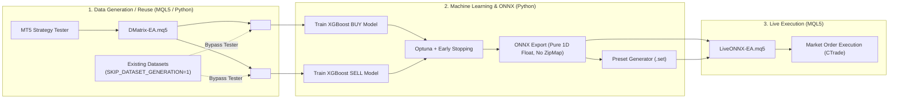
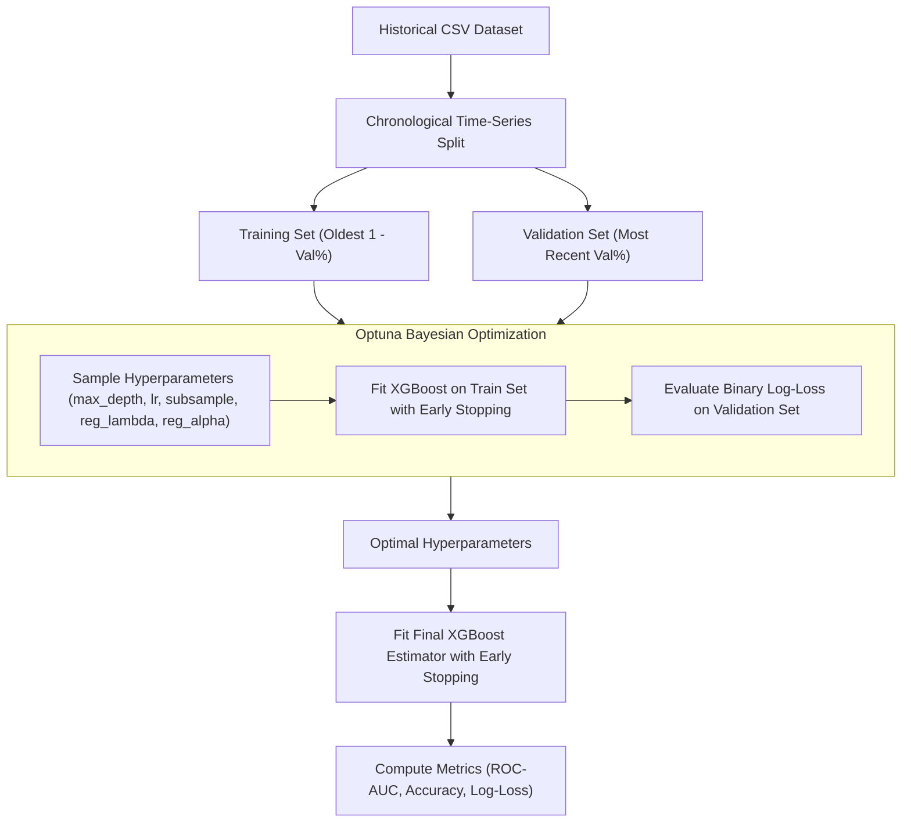

# System Architecture & Technical Specifications

This document provides the exhaustive technical specifications, mathematical foundations, data contracts, and architectural design patterns of the **MetaTrader 5 (MT5) Machine Learning Forex Trading Pipeline**.

---

## 1. Executive System Architecture

The pipeline combines econometric risk modeling, high-dimensional feature engineering, gradient boosting machine learning, and low-latency native MQL5 execution:



---

## 2. Econometric Modeling: GARCH(1,1) Multi-Step Volatility Engine

Static pip-based stop loss and take profit levels are fundamentally flawed in financial markets due to **heteroskedasticity** (time-varying variance) and **volatility clustering** (Mandelbrot, 1963). The pipeline implements the **Bollerslev (1986) GARCH(1,1)** model natively inside MQL5 (`CGarchEngine` in `GarchEngine.mqh`).

### 2.1 Mathematical Formulation

#### 1. Continuously Compounded Log Returns
Given closing prices $P_t$ across a historical lookback window $N = \text{PRICE\_SIZE}$:
$$r_t = \ln\left(\frac{P_t}{P_{t-1}}\right), \quad t = 1, 2, \dots, N$$

Sample mean return $\mu$ and unconditional sample variance $s^2$:
$$\mu = \frac{1}{N}\sum_{t=1}^N r_t$$
$$s^2 = \frac{1}{N-1}\sum_{t=1}^N (r_t - \mu)^2$$

#### 2. Conditional Variance Recurrence
The GARCH(1,1) process models the conditional variance $\sigma_t^2$ as:
$$\sigma_t^2 = \omega + \alpha \varepsilon_{t-1}^2 + \beta \sigma_{t-1}^2$$
where:
- $\varepsilon_t = r_t - \mu$ is the mean-adjusted market shock (innovation).
- $\alpha > 0$ (`GARCH_ALPHA`) measures the sensitivity to recent market shocks (ARCH parameter).
- $\beta > 0$ (`GARCH_BETA`) measures the persistence of conditional variance (GARCH parameter).
- $\gamma = \alpha + \beta$ defines the **volatility persistence**.

#### 3. Covariance Stationarity Condition
For the process to be weakly stationary, the persistence must satisfy:
$$\alpha + \beta < 1.0$$
Under this condition, the long-run unconditional variance $V_L$ is:
$$V_L = \mathbb{E}[\sigma_t^2] = \frac{\omega}{1 - \alpha - \beta} \implies \omega = s^2 (1 - (\alpha + \beta))$$

#### 4. Historical Variance Recursion
The engine initializes $\sigma_0^2 = s^2$ and iterates forward through the sample window $t = 1, \dots, N$:
$$\sigma_t^2 = \omega + \alpha (r_t - \mu)^2 + \beta \sigma_{t-1}^2$$

#### 5. Multi-Step Analytical Horizon Forecast
For a forward forecasting horizon of $H = \text{GARCH\_HORIZON}$ bars ($h = 1, 2, \dots, H$):
$$\mathbb{E}[\sigma_{t+h}^2 \mid \mathcal{F}_t] = V_L + (\alpha + \beta)^h (\sigma_t^2 - V_L)$$

The **aggregated cumulative variance** across the entire forward horizon $H$ is:
$$\sigma_{\text{agg}}^2 = \sum_{h=1}^H \mathbb{E}[\sigma_{t+h}^2 \mid \mathcal{F}_t]$$
$$\sigma_{\text{agg}} = \sqrt{\sigma_{\text{agg}}^2}$$

#### 6. Dynamic Price Risk & Stop-Level Mapping
The aggregated volatility is converted to currency price units and broker points:
$$\text{PriceRisk} = P_{\text{current}} \cdot \sigma_{\text{agg}}$$
$$\text{RiskPoints} = \frac{\text{PriceRisk}}{\text{\_Point}}$$
$$\text{TP}_{\text{points}} = k_{\text{TP}} \cdot \text{RiskPoints}, \quad \text{SL}_{\text{points}} = k_{\text{SL}} \cdot \text{RiskPoints}$$
where $k_{\text{TP}}$ (`InpKTP`) and $k_{\text{SL}}$ (`InpKSL`) are native execution risk multipliers in `LiveONNX-EA` (defaulting to 1.5).

#### 7. Broker Constraint Clamping
To prevent order rejections by the broker's matching engine, stops are strictly clamped:
$$\text{MinStopPoints} = \max(\text{SYMBOL\_TRADE\_STOPS\_LEVEL}, 2 \times \text{SYMBOL\_SPREAD}, 10.0)$$
$$\text{TP}_{\text{points}} \leftarrow \max(\text{TP}_{\text{points}}, \text{MinStopPoints})$$
$$\text{SL}_{\text{points}} \leftarrow \max(\text{SL}_{\text{points}}, \text{MinStopPoints})$$

#### 8. Support & Resistance (S&R) Structural Level Execution & Risk Envelope Clamping
To eliminate premature Stop Loss triggers from liquidity sweeps (false breakout whipsaws) and anchor Take Profit directly to real market structure:
1. **Local Structural Extrema**: Over $N$ closed bars (`InpSRLookbackBars = 12`):
   - Confirmed Swing Lows (Support) and Swing Highs (Resistance) are identified using pivot strength $K$ (`InpSRPivotStrength = 2`).
2. **Protective Point Buffer Padding**:
   $$\Delta_{\text{offset}} = \text{InpSROffsetPoints} \cdot \text{\_Point}$$
3. **Execution Levels & Strict Risk Clamping**:
   - **BUY**: Structural support candidate $S - \Delta_{\text{offset}}$ is strictly clamped so it **never breaches** the dynamic GARCH Stop Loss envelope ($S_{\text{candidate}} \ge \text{garchSL}$).
   - **SELL**: Structural resistance candidate $R + \Delta_{\text{offset}}$ is strictly clamped so it **never breaches** the dynamic GARCH Stop Loss envelope ($R_{\text{candidate}} \le \text{garchSL}$).
   - This ensures structural adjustments refine order placement without expanding risk beyond econometric volatility limits.
4. **Detailed Reference**: Consult [`docs/LIVE_ONNX_EA_GUIDE.md`](LIVE_ONNX_EA_GUIDE.md) for complete input ranges, quantitative impact, and Strategy Tester optimization benchmarks.

#### 9. Daily Schedule & Session Temporal Invariants (Zero Skew Filter)
To eliminate model exposure to illiquid market regimes, low-probability sessions, or weekend risk:
1. **Identical Dual Filter**: Both `DMatrix-EA` and `LiveONNX-EA` evaluate `IsTradeScheduleAllowed(barTime)` in MT5 Server Time.
2. **Day-Level Gating**: For day of week $d \in \{\text{Mon}, \text{Tue}, \text{Wed}, \text{Thu}, \text{Fri}\}$, if $d$ is disabled, candidate bar evaluation terminates immediately. Weekends (Saturday and Sunday) are strictly blocked at runtime.
3. **Intraday Window**: For active days, evaluation requires $s_{\text{bar}} \in [S_{\text{start}}, S_{\text{end}})$. Setting $S_{\text{end}} = \text{"00:00:00"}$ enables all 24 hours.
4. **Zero Train-Serving Skew Guarantee**: Dataset generation (`DMatrix-EA`) and live execution (`LiveONNX-EA`) operate on identical temporal domain boundaries.

---

## 3. Feature Engineering & Lookback Flattening Schema

All feature extraction is handled by `CFeatureExtractor` (`FeatureExtractor.mqh`), shared between both EAs to guarantee **zero train-serving skew**.

### 3.1 The 14 Toggleable Feature Groups

| # | Group Name | Config Flag | Base Feature Names | Dimensions | Mathematical / Encoding Specification |
|---|---|---|---|---|---|
| 1 | **ADX** | `USE_ADX` | `adx_main`, `adx_pdi`, `adx_ndi` | 3 | Welles Wilder Directional Movement Index (Main trend strength, $+DI$, $-DI$) |
| 2 | **ATR** | `USE_ATR` | `atr` | 1 | Average True Range divided by `_Point` (Normalized point volatility) |
| 3 | **Bollinger Bands** | `USE_BANDS` | `bands_diff_mid`, `bands_bandwidth` | 2 | $\frac{Close - MiddleBand}{\_Point}$ and $\frac{UpperBand - LowerBand}{\_Point}$ |
| 4 | **MACD** | `USE_MACD` | `macd_main`, `macd_signal` | 2 | MACD Main Line and Signal Line divided by `_Point` |
| 5 | **Fast MA** | `USE_FAST_MA` | `ma_fast_diff` | 1 | $\frac{Close - FastMA}{\_Point}$ (Distance from fast moving average) |
| 6 | **Slow MA** | `USE_SLOW_MA` | `ma_slow_diff` | 1 | $\frac{Close - SlowMA}{\_Point}$ (Distance from slow moving average) |
| 7 | **RSI** | `USE_RSI` | `rsi` | 1 | Relative Strength Index (0.0 to 100.0) |
| 8 | **Stochastic** | `USE_STOCHASTIC` | `stoch_k`, `stoch_d` | 2 | Stochastic Oscillator $\%K$ and $\%D$ lines (0.0 to 100.0) |
| 9 | **Candlestick** | `USE_CANDLESTICK` | `candle_type`, `candle_body`, `candle_upper_shadow`, `candle_lower_shadow` | 4 | `candle_type`: $0.0f$ (Doji), $1.0f$ ($C > O$), $2.0f$ ($C < O$); Body & Shadows in points |
| 10 | **Weekday** | `USE_TIMESTAMP_WEEK` | `timestamp_week` | 1 | Day of week: $0.0f$ (Mon), $1.0f$ (Tue), $2.0f$ (Wed), $3.0f$ (Thu), $4.0f$ (Fri) |
| 11 | **Day Quarter** | `USE_TIMESTAMP_DAY` | `timestamp_day` | 1 | Quarter of day: $0.0f$ (00-06h), $1.0f$ (06-12h), $2.0f$ (12-18h), $3.0f$ (18-24h) |
| 12 | **Market Sessions** | `USE_OPEN_MARKETS` | `open_markets` | 1 | Forex Session Code ($0.0f$..$7.0f$ representing Sydney, Tokyo, London, NY regimes mapped strictly in EET/EEST MT5 Server Time) |
| 13 | **Spread** | `USE_SPREAD` | `spread` | 1 | Current bid-ask spread in broker points |
| 14 | **GARCH Volatility** | `USE_GARCH_FEATURES` | `garch_omega`, `garch_vol_ratio`, `garch_vol_trend`, `garch_sigma_cond`, `garch_sigma_agg` | 5 | Baseline $\omega$, Volatility Ratio $\frac{\sigma_{\text{cond}}}{\sqrt{s^2}}$, Term Structure Slope $\frac{\sigma_{\text{agg}}}{\sqrt{H}\sigma_{\text{cond}}}$, Conditional Volatility $\sigma_{\text{cond}}$, and Aggregated Standard Deviation $\sigma_{\text{agg}}$ |

**Total Base Features per Single Bar**: $21 \text{ (Indicators)} + 5 \text{ (GARCH)} = 26$ features.

### 3.2 Sequential Horizon Lookback Flattening
For a lookback lag parameter $H = \text{FEATURE\_LOOKBACK}$ (e.g., $H = 4$):
$$\mathbf{x}_t = \Big[ \mathbf{f}(t)^\top, \; \mathbf{f}(t-1)^\top, \; \mathbf{f}(t-2)^\top, \; \dots, \; \mathbf{f}(t-H)^\top \Big]^\top$$

Total feature vector dimensionality $D$:
$$D = K_{\text{base}} \times (H + 1)$$
With all 14 groups active ($K_{\text{base}} = 26$) and $H = 4$:
$$D = 26 \times (4 + 1) = 130 \text{ dimensions}$$

Column naming convention:
- Current bar ($h=0$): `<feature_name>_t`
- Lagged bars ($h > 0$): `<feature_name>_t_minus_<h>`

---

## 4. Order Tracking, Labeling & Deinitialization Rules

In MT5 Strategy Tester, orders are tracked by `COrderTracker` (`OrderTracker.mqh`).

### 4.1 In-Memory Ticket Mapping
MetaTrader 5 enforces a strict **31-character limit** on order comment strings. To associate high-dimensional feature vectors (e.g., 105 float values $\approx 1000$ characters) with orders:
1. `DMatrix-EA.mq5` opens simultaneous BUY and SELL positions on every new bar.
2. The position ticket returned by `CTrade` is mapped to an in-memory struct in RAM:
   ```cpp
   struct SActivePosition {
       ulong ticket;
       ENUM_POSITION_TYPE posType;
       datetime baseTimestamp;
       double openPrice, tpPrice, slPrice;
       float features[];
       int featureCount;
       bool isActive;
   };
   ```

### 4.2 Triple Barrier Momentum & Outcome Labeling (`OnTick` & `OnTradeTransaction`)
Dataset labeling follows Marcos López de Prado's **Triple Barrier Method** to decouple entry momentum prediction from live execution risk sizing:
1. **Upper Barrier (Take Profit)**: $P_{\text{open}} + \text{InpLabelMinPoints} \cdot \text{\_Point}$ (for BUY) or $P_{\text{open}} - \text{InpLabelMinPoints} \cdot \text{\_Point}$ (for SELL).
2. **Lower Barrier (Stop Loss / Adverse Excursion)**: $P_{\text{open}} - \text{InpLabelMaxAdversePoints} \cdot \text{\_Point}$ (for BUY) or $P_{\text{open}} + \text{InpLabelMaxAdversePoints} \cdot \text{\_Point}$ (for SELL).
3. **Vertical Barrier (Holding Horizon Timeout)**: Checked on every new bar via `COrderTracker::CheckTimeouts(InpLabelHorizonBars, g_trade)`. Any active trade reaching `InpLabelHorizonBars` bars without touching the Upper Barrier is closed at market and strictly labeled $0.0f$ (`NOT_OPEN`).

When a position is closed, its final financial outcome is evaluated through the **Golden Rule of Net Liquid Profit**:
$$\text{NetLiquidProfit} = \text{DEAL\_PROFIT} + \text{DEAL\_SWAP} + \text{DEAL\_COMMISSION}$$

**Label Assignment**:
$$\text{Label } y = \begin{cases} 1.0f \; (\text{OPEN}), & \text{if } (\text{DEAL\_REASON\_TP} \lor \text{Upper Barrier Reached}) \land \text{NetLiquidProfit} > 0.0 \\ 0.0f \; (\text{NOT\_OPEN}), & \text{if } \text{Lower Barrier Reached} \lor \text{Vertical Timeout} \lor \text{NetLiquidProfit} \le 0.0 \end{cases}$$

- **Golden Rule Invariant**: If a trade nominally reaches the upper barrier but transaction fees, negative overnight swap, or spread slippage cause the final net financial outcome to be zero or negative ($\text{NetLiquidProfit} \le 0.0$), it is **strictly classified as $0.0f$ (`NOT_OPEN`)**. This ensures XGBoost never learns false-positive unprofitable patterns.
- **Proximity Fallback**: If broker execution reports deal reason `DEAL_REASON_CLIENT` or `DEAL_REASON_EXPERT`, the closure price is compared against $TP$ within a tolerance of $2 \times \text{\_Point}$ subject to $\text{NetLiquidProfit} > 0.0$.

### 4.3 Unresolved Position Evaluation at Deinitialization (`OnDeinit`)
When Strategy Tester backtest completes, any remaining active positions in memory that were not closed are classified conservatively:
$$\text{Label} = 0.0f \; (\text{NOT\_OPEN})$$
This ensures complete determinism and prevents lookahead bias on incomplete time horizons.

### 4.4 Strict Directional Partition Isolation (Zero Cross-Contamination)
`COrderTracker` strictly partitions recorded trades by `posType`:
- All BUY position outcomes are written **exclusively** to `<Symbol>_<TF>_buy.csv`.
- All SELL position outcomes are written **exclusively** to `<Symbol>_<TF>_sell.csv`.
- **Zero Cross-Contamination**: Under no circumstance can a BUY trade appear in the SELL dataset or vice-versa. This preserves pure directional conditionality for the respective gradient boosting models.

### 4.5 Chronological Ordering by Bar Opening Timestamp
Before exporting to CSV, all recorded samples within each partition are sorted chronologically by `baseTimestamp` (the exact bar opening time when the trade decision was executed) using an in-place QuickSort algorithm:
$$\text{Sample}_i \le \text{Sample}_{i+1} \iff \text{baseTimestamp}_i \le \text{baseTimestamp}_{i+1}$$
- **Timestamp Stripping**: The `baseTimestamp` column is used strictly for sorting and is stripped upon CSV generation. This ensures XGBoost learns invariant structural and technical patterns rather than spurious chronological index correlations.

### 4.6 Dataset Dimensionality & Feature Parity Verification
Every exported CSV file must strictly respect the exact feature dimension formula:
$$N_{\text{columns}} = N_{\text{active\_base\_features}} \times (\text{FEATURE\_LOOKBACK} + 1) + 1 \text{ (label column)}$$
- **Automated Validation Invariants**: This mathematical parity is continuously enforced in the automated test suite ([`tests/test_feature_schema.py`](../tests/test_feature_schema.py) and [`tests/test_dataset_manager.py`](../tests/test_dataset_manager.py)), ensuring that the CSV column count, header names, and active feature flags match 100% with `AppConfig.active_feature_count`.

### 4.7 Anomaly & Pandemic Blackout Period Filter (`DMatrix-EA`)
Extended multi-year historical simulations (e.g. 2012–2026) inevitably encompass major exogenous macroeconomic disruptions (such as the 2020–2021 COVID-19 pandemic shock, circuit breakers, and emergency stimulus regimes). To prevent gradient boosting models from fitting non-stationary extreme noise:
1. **Configurable Blackout Window (EET/EEST Server Time)**: Controlled by `AVOID_PANDEMICTIME` (boolean), `PANDEMIC_START_DATE` (inclusive, e.g. `2020.01.01 00:00:00`), and `PANDEMIC_END_DATE` (exclusive, e.g. `2021.06.01 00:00:00`). All date-time thresholds operate strictly in MT5 Server Time (EET: UTC+2 winter / EEST: UTC+3 summer), matching chart bar clocks without artificial conversions.
2. **Order Suppression Without Position Disruption**: On each new bar open, active trades opened prior to the window continue to be monitored and closed via `CheckTimeouts` and broker stops. However, no new simultaneous BUY/SELL orders are opened, and no feature vectors or training samples are recorded during $[T_{\text{start}}, T_{\text{end}})$.
3. **Strict DMatrix-EA Scope**: The filter resides exclusively in `DMatrix-EA.mq5` and `tester.ini` generation, maintaining a clean live inference footprint in `LiveONNX-EA.mq5`.

---

## 5. Machine Learning Subsystem: Dual XGBoost Architecture

The Python trainer (`DualXGBoostTrainer` in `src/trainer.py`) fits two separate, independent gradient boosted decision tree classifiers:
1. **BUY Classifier**: Models $P(\text{BUY is Profitable} \mid \mathbf{x}_t)$.
2. **SELL Classifier**: Models $P(\text{SELL is Profitable} \mid \mathbf{x}_t)$.

### 5.1 Quantitative Rationale for Dual Independent Classifiers
Instead of a single multi-class model ($[-1, 0, 1]$), the architecture enforces two independent binary classification models for fundamental quantitative reasons:
1. **Market Microstructure Asymmetry**: Upward and downward price dynamics in currency pairs exhibit distinct volatility and liquidity regimes. Bullish expansions often display steady drift while bearish contractions display sharp liquidity cascades.
2. **Independent Conditional Probabilities**: Evaluating $P(\text{OPEN}_{\text{buy}} \mid \mathbf{x}_t)$ and $P(\text{OPEN}_{\text{sell}} \mid \mathbf{x}_t)$ separately allows independent decision thresholding ($\tau_{\text{buy}}$ vs $\tau_{\text{sell}}$) via `InpMinimalLevelAcceptedBuy` and `InpMinimalLevelAcceptedSell`.
3. **Simultaneous Signal Rejection**: If both models output high probability during choppy periods, the system can detect ambiguity or apply directional filters (`DIRECTION_ONLY_BUY`, `DIRECTION_ONLY_SELL`).



### 5.1 Chronological Time-Series Validation Split
To prevent **lookahead bias and data leakage**:
$$N_{\text{val}} = \lfloor N_{\text{total}} \times \text{VALIDATION\_PERCENTAGE} \rfloor$$
$$N_{\text{train}} = N_{\text{total}} - N_{\text{val}}$$
$$\mathcal{D}_{\text{train}} = \{(\mathbf{x}_i, y_i)\}_{i=1}^{N_{\text{train}}}, \quad \mathcal{D}_{\text{val}} = \{(\mathbf{x}_i, y_i)\}_{i=N_{\text{train}}+1}^{N_{\text{total}}}$$

### 5.2 Optuna Bayesian Optimization Objective
The objective function minimizes binary cross-entropy (logarithmic loss) on the out-of-sample validation fold:
$$\mathcal{L}_{\text{logloss}}(\mathcal{D}_{\text{val}}) = -\frac{1}{N_{\text{val}}}\sum_{i=1}^{N_{\text{val}}} \Big[ y_i \ln(\hat{p}_i) + (1 - y_i) \ln(1 - \hat{p}_i) \Big]$$

### 5.3 Early Stopping Regularization
To prevent overfitting on noisy financial regimes:
- `eval_metric = "logloss"`
- `early_stopping_rounds = XGB_EARLY_STOPPING_ROUNDS`
- Training halts when validation log-loss fails to improve for $E$ consecutive boosting iterations, preserving the optimal tree count `best_iteration`.

### 5.4 Training Execution Logging & Telemetry
To ensure transparency and operational monitoring during long-running model fits and Bayesian optimization routines:
- **Start Timestamping**: Emits local system timestamp (`[YYYY-MM-DD HH:MM:SS]`) at the onset of dataset loading and Optuna trial initialization.
- **Completion Timestamping & Wall-Clock Duration**: Tracks end-to-end training time via `(end_time - start_time).total_seconds()`, formatted as `(Elapsed: HH:MM:SS)`.
- **Validation Metric Summaries**: Evaluates and outputs test-set `ROC-AUC`, `Accuracy`, `LogLoss`, and `best_iteration` prior to returning model handles to the pipeline orchestrator.

---

## 6. ONNX Model Contract & Zero-Copy Execution

The ONNX export engine (`ONNXExporter` in `src/onnx_exporter.py`) converts trained XGBoost models to strictly formatted ONNX graphs compatible with MetaTrader 5's native ONNX runtime.

### 6.1 Input & Output Tensor Specifications

```
Input Tensor:
- Name: "float_input"
- Data Type: FloatTensorType (32-bit IEEE float)
- Shape: [None, num_features] (Dynamic batch dimension)

Output Tensor:
- Name: "probabilities"
- Data Type: FloatTensorType (32-bit IEEE float)
- Shape: [None, 2]
  - Index 0: P(NOT_OPEN) [SL Hit Probability]
  - Index 1: P(OPEN)     [TP Hit Probability]
```

### 6.2 Elimination of ZipMap Operator
Standard tree converters produce `ZipMap` operators returning `Sequence<Map<int64, float>>`. MQL5's native ONNX runtime cannot parse non-tensor sequences.

The pipeline prunes the graph to retain exclusively the 2D float tensor `probabilities`:
```python
prob_output = [o for o in raw_onnx.graph.output if o.name == "probabilities"][0]
pruned_model = onnx.ModelProto()
pruned_model.CopyFrom(raw_onnx)
del pruned_model.graph.output[:]
pruned_model.graph.output.append(prob_output)
```

### 6.3 Zero-Copy Execution in MQL5 (`LiveONNX-EA.mq5`)
During `OnInit()`, explicit static tensor shapes are configured:
```cpp
const ulong inputShape[]  = {1, (ulong)g_featureCount};
const ulong outputShape[] = {1, 2};
OnnxSetInputShape(g_hModelBuy, 0, inputShape);
OnnxSetOutputShape(g_hModelBuy, 0, outputShape);
```
During `OnTick()`, inference executes without dynamic memory allocations:
```cpp
vectorf inputVector;
g_featureExtractor.ExtractFlattenedVector(0, inputVector);

vectorf outBuy(2);
OnnxRun(g_hModelBuy, ONNX_NO_CONVERSION, inputVector, outBuy);
float probBuy = outBuy[1];
```

---

## 7. Native Preset (.set) Architecture & Deployment

The preset generator (`PresetGenerator` in `src/preset_generator.py`) produces native MT5 `.set` configuration files:
- `LiveONNX-EA_<Symbol>_<TF>.set`
- `DMatrix-EA_<Symbol>_<TF>.set`

### 7.1 Benefits of Native Presets
1. **Zero Train-Serving Skew**: Exactly aligns indicator periods, shifts, smoothing methods, applied prices, and GARCH parameters between Python training and live trading.
2. **1-Click Loading**: Algorithmic traders load presets via the native MT5 EA settings interface (`Load` button).
3. **Zero Parsing Overhead**: Eliminates runtime string/JSON deserialization in live trading.

### 7.2 Multi-Directory Deployment Matrix
Artifacts are automatically synchronized across all required MT5 folders:

| Artifact Type | Target Path 1 (Terminal Data Path) | Target Path 2 (Common Shared Path) |
|---|---|---|
| **ONNX Models** | `MT5_DATA_PATH/MQL5/Files/Models/*.onnx` | `MT5_COMMON_PATH/Files/Models/*.onnx` |
| **Native Presets** | `MT5_DATA_PATH/MQL5/Presets/*.set` | `MT5_COMMON_PATH/Files/Presets/*.set` |
| **Metadata** | `MT5_DATA_PATH/MQL5/Files/*_metadata.json` | `MT5_COMMON_PATH/Files/*_metadata.json` |
| **Compiled EAs** | `MT5_DATA_PATH/MQL5/Experts/*.ex5` | — |
