# Comprehensive End-to-End System Flowchart & Lifecycle Map

This document provides exhaustive, step-by-step technical flowcharts and execution lifecycle maps for the **MetaTrader 5 (MQL5) Machine Learning Forex Trading Pipeline**.

---

## 🗺️ 1. Master End-to-End Architecture Flowchart

```mermaid
flowchart TD
    %% Global Styling
    classDef config fill:#1e293b,stroke:#38bdf8,stroke-width:2px,color:#f8fafc;
    classDef mql5 fill:#0f172a,stroke:#3b82f6,stroke-width:2px,color:#f8fafc;
    classDef python fill:#111827,stroke:#10b981,stroke-width:2px,color:#f8fafc;
    classDef ml fill:#311042,stroke:#a855f7,stroke-width:2px,color:#f8fafc;
    classDef onnx fill:#1c1917,stroke:#f59e0b,stroke-width:2px,color:#f8fafc;
    classDef live fill:#064e3b,stroke:#34d399,stroke-width:2px,color:#f8fafc;

    %% -------------------------------------------------------------------------
    %% 1. Initialization & Configuration
    %% -------------------------------------------------------------------------
    subgraph STAGE_1 ["Stage 1: Initialization & Environment Configuration"]
        ENV[".env Configuration File<br/>(Symbol, Timeframe, Dates, Features, GARCH, XGBoost)"]:::config
        CLEAN["ScopedCleaner::clean()<br/>(Atomically purge pre-existing symbol/TF artifacts)"]:::python
        INIT_PY["MT5Client::initialize()<br/>(Connect MT5 API, verify symbol & query terminal paths)"]:::python
        SYNC_MQL["MT5Client::sync_mql5()<br/>(Sync Include/*.mqh & Experts/*.mq5 to Terminal Data Path)"]:::python
        COMP_DMAT["MT5Client::compile_ea('DMatrix-EA.mq5')<br/>(MetaEditor CLI: 0 errors validation)"]:::mql5
        
        ENV --> CLEAN
        CLEAN --> INIT_PY
        INIT_PY --> SYNC_MQL
        SYNC_MQL --> COMP_DMAT
    end

    %% -------------------------------------------------------------------------
    %% 2. Data Collection (DMatrix-EA)
    %% -------------------------------------------------------------------------
    subgraph STAGE_2 ["Stage 2: Strategy Tester Backtest & Data Collection (DMatrix-EA.mq5)"]
        GEN_INI["MT5Client::generate_tester_ini()<br/>(Write tester_<Symbol>_<TF>.ini with [Tester] & [TesterInputs])"]:::python
        RUN_TESTER["MT5Client::run_strategy_tester()<br/>(Launch terminal64.exe /config:tester_...ini)"]:::python
        WATCHDOG["Watchdog Process Monitor<br/>(Poll every WATCHDOG_POLL_INTERVAL sec, monitor PID)"]:::python
        
        subgraph DMATRIX_EA ["DMatrix-EA.mq5 Execution Lifecycle"]
            DMAT_INIT["OnInit(): Init GarchEngine, FeatureExtractor & OrderTracker"]:::mql5
            NEW_BAR{"IsNewBar()?"}:::mql5
            FEAT_EXT["CFeatureExtractor::ExtractFlattenedVector()<br/>Extract 13 feature groups flattened across [t..t-H]"]:::mql5
            GARCH_CALC["CGarchEngine::CalculateDynamicRisk()<br/>Compute GARCH(1,1) multi-step aggregated risk sigma_agg"]:::mql5
            OPEN_POS["Simultaneous Position Open<br/>BUY & SELL with GARCH dynamic TP/SL & adaptive filling"]:::mql5
            MEM_MAP["COrderTracker::RegisterPosition()<br/>Map ticket -> feature vector in RAM (bypasses 31-char limit)"]:::mql5
            
            TRANS_EVENT["OnTradeTransaction()<br/>DEAL_REASON_TP => Label 1.0f<br/>DEAL_REASON_SL => Label 0.0f"]:::mql5
            DEINIT_EVENT["OnDeinit()<br/>Evaluate unresolved positions, QuickSort chronologically, export CSVs"]:::mql5
            
            DMAT_INIT --> NEW_BAR
            NEW_BAR -- Yes --> FEAT_EXT
            FEAT_EXT --> GARCH_CALC
            GARCH_CALC --> OPEN_POS
            OPEN_POS --> MEM_MAP
            MEM_MAP -. Position Open .-> TRANS_EVENT
            TRANS_EVENT -. Position Closed .-> DEINIT_EVENT
        end
        
        COMP_DMAT --> GEN_INI
        GEN_INI --> RUN_TESTER
        RUN_TESTER --> WATCHDOG
        WATCHDOG --> DMATRIX_EA
    end

    %% -------------------------------------------------------------------------
    %% 3. Dataset Discovery & Validation
    %% -------------------------------------------------------------------------
    subgraph STAGE_3 ["Stage 3: Dataset Discovery & Time-Series Splitting"]
        DISCOVER["DatasetManager::find_and_validate_datasets()<br/>(Search Terminal Files, Common Files, Agent Sandboxes)"]:::python
        VALIDATE_CSV["Dataset Structure & Label Validation<br/>(Ensure non-empty and 'label' column exists)"]:::python
        TS_SPLIT["Chronological Time-Series Split<br/>Train: Oldest (1 - Val%) | Val: Most Recent Val%<br/>(Zero random shuffling / zero data leakage)"]:::python
        
        DMATRIX_EA --> DISCOVER
        DISCOVER --> VALIDATE_CSV
        VALIDATE_CSV --> TS_SPLIT
    end

    %% -------------------------------------------------------------------------
    %% 4. Dual XGBoost Training & Optuna
    %% -------------------------------------------------------------------------
    subgraph STAGE_4 ["Stage 4: Dual XGBoost Training with Early Stopping & Optuna"]
        OPTUNA_STUDY["Optuna Bayesian Optimization<br/>(Minimize validation binary log-loss)"]:::ml
        EARLY_STOP["Early Stopping Evaluation<br/>(Patience: XGB_EARLY_STOPPING_ROUNDS)"]:::ml
        TRAIN_FINAL["Train Final Estimators<br/>1. BUY Classifier<br/>2. SELL Classifier"]:::ml
        CALC_METRICS["Compute Validation Metrics<br/>(ROC-AUC, Accuracy, Log-Loss, Best Iteration)"]:::ml
        LOG_TELEMETRY["Log Execution Telemetry<br/>(Start & Completion Timestamps, Elapsed Duration)"]:::ml
        
        TS_SPLIT --> OPTUNA_STUDY
        OPTUNA_STUDY --> EARLY_STOP
        EARLY_STOP --> TRAIN_FINAL
        TRAIN_FINAL --> CALC_METRICS
        CALC_METRICS --> LOG_TELEMETRY
    end

    %% -------------------------------------------------------------------------
    %% 5. Strict ONNX Conversion
    %% -------------------------------------------------------------------------
    subgraph STAGE_5 ["Stage 5: Pure 1D Float ONNX Graph Export"]
        ONNX_CONVERT["ONNXExporter::export_and_validate()<br/>onnxmltools.convert_xgboost(clf, FloatTensorType)"]:::onnx
        PRUNE_ZIPMAP["Graph Pruning: Remove ZipMap & Sequence<Map><br/>Expose strictly 2D Float Tensor: 'probabilities' [None, 2]"]:::onnx
        VALIDATE_SESSION["onnxruntime.InferenceSession Validation<br/>(Shape [1, 2], Probabilities Sum == 1.0)"]:::onnx
        
        CALC_METRICS --> ONNX_CONVERT
        ONNX_CONVERT --> PRUNE_ZIPMAP
        PRUNE_ZIPMAP --> VALIDATE_SESSION
    end

    %% -------------------------------------------------------------------------
    %% 6. Deployment & Native Presets
    %% -------------------------------------------------------------------------
    subgraph STAGE_6 ["Stage 6: Artifact Deployment & Preset Generation"]
        DEPLOY_ONNX["ONNXExporter::deploy()<br/>Deploy .onnx & metadata to Terminal and Common folders"]:::python
        GEN_PRESETS["PresetGenerator::generate_all()<br/>Generate LiveONNX-EA_<Symbol>_<TF>.set & DMatrix-EA_<Symbol>_<TF>.set"]:::python
        COMP_LIVE["MT5Client::compile_ea('LiveONNX-EA.mq5')<br/>(MetaEditor CLI: 0 errors validation)"]:::mql5
        
        VALIDATE_SESSION --> DEPLOY_ONNX
        DEPLOY_ONNX --> GEN_PRESETS
        GEN_PRESETS --> COMP_LIVE
    end

    %% -------------------------------------------------------------------------
    %% 7. Live Microsecond Inference (LiveONNX-EA)
    %% -------------------------------------------------------------------------
    subgraph STAGE_7 ["Stage 7: Live Trading Engine (LiveONNX-EA.mq5)"]
        LIVE_ON_INIT["LiveONNX-EA OnInit()<br/>- Load .set Preset with Typed Inputs<br/>- Load ONNX models via LoadModelWithFallback()<br/>- Set OnnxSetInputShape [1, N] & OnnxSetOutputShape [1, 2]"]:::live
        
        subgraph LIVE_TICK_LOOP ["Live OnTick Execution Loop"]
            LIVE_NEW_BAR{"IsNewBar()?"}:::live
            EXTRACT_LIVE["CFeatureExtractor::ExtractFlattenedVector()<br/>Extract real-time vector into native vectorf"]:::live
            RUN_ONNX["OnnxRun(hModel, ONNX_NO_CONVERSION, vectorf, outProb)<br/>Microsecond sub-millisecond inference"]:::live
            FILTER_DIR{"InpTradeDirection Filter<br/>(BOTH / ONLY_BUY / ONLY_SELL)"}:::live
            CHECK_PROB{"Probability >= MinimalLevelAccepted?"}:::live
            CALC_RISK["CGarchEngine::CalculateDynamicRisk()<br/>Dynamic GARCH(1,1) TP/SL Risk"]:::live
            EXEC_ORDER["CTrade Execution<br/>Open Position with Adaptive Filling"]:::live
            
            LIVE_NEW_BAR -- Yes --> EXTRACT_LIVE
            EXTRACT_LIVE --> RUN_ONNX
            RUN_ONNX --> FILTER_DIR
            FILTER_DIR --> CHECK_PROB
            CHECK_PROB -- Yes --> CALC_RISK
            CALC_RISK --> EXEC_ORDER
            CHECK_PROB -- No --> WAIT_BAR["Wait for Next Bar"]:::live
        end
        
        COMP_LIVE --> LIVE_ON_INIT
        LIVE_ON_INIT --> LIVE_TICK_LOOP
    end
```

---

## 🐍 2. Python MLOps Orchestrator Lifecycle Flowchart

The following flowchart maps the exact execution lifecycle of `../run_pipeline.py`, detailing state transitions, error handling, and subprocess monitoring:

```mermaid
flowchart TD
    START(["CLI Entrypoint (run_pipeline.py)"]) --> PARSE_ARGS{"Parse CLI Arguments"}
    PARSE_ARGS -- "--compile-only" --> RUN_COMPILE["run_compile_only(config, workspace_root)"]
    PARSE_ARGS -- "--skip-dataset" or Default --> RUN_FULL["run_full_pipeline(config, workspace_root, skip_dataset_override)"]

    subgraph COMPILE_MODE ["Compile-Only Workflow"]
        C_INIT["MT5Client::initialize()"] --> C_SYNC["MT5Client::sync_mql5()"]
        C_SYNC --> C_PRESETS["PresetGenerator::generate_all()<br/>TemplateGenerator::generate_all()"]
        C_PRESETS --> C_COMP1["Compile DMatrix-EA.mq5"]
        C_COMP1 --> C_COMP2["Compile LiveONNX-EA.mq5"]
        C_COMP2 --> C_SHUTDOWN["MT5Client::shutdown()"]
    end
    RUN_COMPILE --> COMPILE_MODE
    C_SHUTDOWN --> EXIT_COMPILE(["Exit Status (0 / 1)"])

    subgraph FULL_MODE ["Full Automated MLOps Pipeline Workflow"]
        F_CLEAN["1. ScopedCleaner::clean()<br/>Purge *.ini, *.json, *.onnx, *.set for Symbol_TF<br/>(Selectively preserves CSVs if SKIP_DATASET enabled)"]
        F_INIT["2. MT5Client::initialize()<br/>Connect MT5 Python API & Verify Symbol"]
        F_CHECK_SKIP{"SKIP_DATASET enabled &<br/>Datasets Exist for Symbol_TF?"}
        
        subgraph TESTER_COLLECTION ["Data Collection Branch (Default / Missing Datasets)"]
            F_SYNC["3a. MT5Client::sync_mql5()<br/>Synchronize Include/ & Experts/ into Terminal Data Path"]
            F_COMP_DMAT["4a. MT5Client::compile_ea('DMatrix-EA.mq5')<br/>Invoke MetaEditor CLI, Check 0 Errors"]
            F_GEN_PRESET_PRE["5a. PresetGenerator::generate_all()<br/>Generate pre-test configuration presets"]
            F_GEN_INI["6a. MT5Client::generate_tester_ini()<br/>Write tester_<Symbol>_<TF>.ini with [TesterInputs]"]
            F_RUN_TEST["7a. MT5Client::run_strategy_tester()<br/>Launch terminal64.exe /config:tester_...ini with Watchdog"]
            
            F_SYNC --> F_COMP_DMAT
            F_COMP_DMAT --> F_GEN_PRESET_PRE
            F_GEN_PRESET_PRE --> F_GEN_INI
            F_GEN_INI --> F_RUN_TEST
        end

        subgraph SKIP_TESTER ["Dataset Reuse Branch (SKIP_DATASET_GENERATION=1 / --skip-dataset)"]
            F_SYNC_SKIP["3b. MT5Client::sync_mql5()<br/>Synchronize Include/ & Experts/"]
            F_PRESET_SKIP["4b. PresetGenerator::generate_all()<br/>Generate configuration presets"]
            
            F_SYNC_SKIP --> F_PRESET_SKIP
        end

        F_FIND_DATA["8. DatasetManager::find_and_validate_datasets()<br/>Locate & Validate <Symbol>_<TF>_buy.csv & sell.csv"]
        F_TRAIN_BUY["9. DualXGBoostTrainer::train(buy_csv, 'buy')<br/>Optuna + Early Stopping -> Buy Classifier<br/>(Telemetry: Timestamps & Elapsed Duration)"]
        F_TRAIN_SELL["10. DualXGBoostTrainer::train(sell_csv, 'sell')<br/>Optuna + Early Stopping -> Sell Classifier<br/>(Telemetry: Timestamps & Elapsed Duration)"]
        F_EXP_BUY["11. ONNXExporter::export_and_validate(buy_clf, 'buy')<br/>Pure 1D Float ONNX Graph"]
        F_EXP_SELL["12. ONNXExporter::export_and_validate(sell_clf, 'sell')<br/>Pure 1D Float ONNX Graph"]
        F_DEPLOY["13. ONNXExporter::deploy()<br/>Deploy models & metadata to Terminal & Common Paths"]
        F_GEN_SET["14. PresetGenerator & TemplateGenerator<br/>Generate LiveONNX-EA_<Symbol>_<TF>.set & .tpl"]
        F_COMP_LIVE["15. MT5Client::compile_ea('LiveONNX-EA.mq5')<br/>Invoke MetaEditor CLI, Check 0 Errors"]
        F_SHUTDOWN["16. MT5Client::shutdown()<br/>Disconnect MT5 Python API"]

        F_CLEAN --> F_INIT
        F_INIT --> F_CHECK_SKIP
        F_CHECK_SKIP -- "No / Missing (Fallback)" --> F_SYNC
        F_CHECK_SKIP -- "Yes (Reuse Existing)" --> F_SYNC_SKIP
        F_RUN_TEST --> F_FIND_DATA
        F_PRESET_SKIP --> F_FIND_DATA
        F_FIND_DATA --> F_TRAIN_BUY
        F_TRAIN_BUY --> F_TRAIN_SELL
        F_TRAIN_SELL --> F_EXP_BUY
        F_EXP_BUY --> F_EXP_SELL
        F_EXP_SELL --> F_DEPLOY
        F_DEPLOY --> F_GEN_SET
        F_GEN_SET --> F_COMP_LIVE
        F_COMP_LIVE --> F_SHUTDOWN
    end
    RUN_FULL --> FULL_MODE
    F_SHUTDOWN --> EXIT_FULL(["Exit Status (0 / 1)"])
```

---

## 📊 3. MQL5 Data Collector EA (`DMatrix-EA.mq5`) Lifecycle

The following flowchart maps the event-driven lifecycle of the historical dataset collector inside the MT5 Strategy Tester:

```mermaid
flowchart TD
    %% MQL5 Event Handlers
    subgraph DMAT_ON_INIT ["1. OnInit() Handler"]
        INIT_START(["OnInit Entry"]) --> CFG_INDICATORS["Configure SFeatureConfig from Inputs<br/>(13 Feature Groups + Periods/Shifts/Methods)"]
        CFG_INDICATORS --> INIT_GARCH["CGarchEngine::SetParameters(PriceSize, Horizon, Alpha, Beta)"]
        INIT_GARCH --> INIT_EXTRACTOR["CFeatureExtractor::Init(_Symbol, _Period, config)<br/>Create Indicator Handles & Compute Schema Dimensions"]
        INIT_EXTRACTOR --> INIT_TRACKER["COrderTracker::Init(_Symbol, _Period)"]
        INIT_TRACKER --> INIT_TRADE["CTrade::SetExpertMagicNumber(111100)<br/>Set Adaptive Filling (FOK / IOC / RETURN)"]
        INIT_TRADE --> INIT_OK(["Return INIT_SUCCEEDED"])
    end

    subgraph DMAT_ON_TICK ["2. OnTick() Handler (New Bar Triggered)"]
        TICK_START(["OnTick Entry"]) --> CHECK_NEW_BAR{"IsNewBar()?"}
        CHECK_NEW_BAR -- No --> TICK_EXIT(["Exit OnTick"])
        CHECK_NEW_BAR -- Yes --> EXTRACT_VECTOR["CFeatureExtractor::ExtractFlattenedVector(0, featureVector)<br/>Flatten all 13 active feature groups over lookback [t..t-H]"]
        EXTRACT_VECTOR --> CALC_GARCH_RISK["CGarchEngine::CalculateDynamicRisk()<br/>1. Log Returns: r_t = ln(P_t / P_{t-1})<br/>2. Sample Variance s^2 & omega<br/>3. Multi-Step Forecast: E[sigma_{t+h}^2]<br/>4. PriceRisk = Price * sigma_agg<br/>5. Dynamic TP/SL in Broker Points"]
        CALC_GARCH_RISK --> OPEN_BUY["CTrade::Buy(LotSize, Ask, buySL, buyTP)<br/>Open BUY Order with GARCH Stops"]
        OPEN_BUY --> REG_BUY["COrderTracker::RegisterPosition(buyTicket, BUY, baseTimestamp, vector)<br/>Store Ticket -> Feature Vector in RAM"]
        REG_BUY --> OPEN_SELL["CTrade::Sell(LotSize, Bid, sellSL, sellTP)<br/>Open SELL Order with GARCH Stops"]
        OPEN_SELL --> REG_SELL["COrderTracker::RegisterPosition(sellTicket, SELL, baseTimestamp, vector)<br/>Store Ticket -> Feature Vector in RAM"]
        REG_SELL --> TICK_EXIT
    end

    subgraph DMAT_ON_TRADE ["3. OnTradeTransaction() Handler (Deal Closure)"]
        TRADE_START(["OnTradeTransaction Entry"]) --> CHECK_DEAL{"trans.type == TRADE_TRANSACTION_DEAL_ADD?"}
        CHECK_DEAL -- No --> TRADE_EXIT(["Exit Handler"])
        CHECK_DEAL -- Yes --> SELECT_DEAL["HistoryDealSelect(trans.deal)"]
        SELECT_DEAL --> CHECK_ENTRY{"DEAL_ENTRY == OUT or OUT_BY?"}
        CHECK_ENTRY -- No --> TRADE_EXIT
        CHECK_ENTRY -- Yes --> FIND_POS["COrderTracker::FindActivePosition(positionId)"]
        FIND_POS --> CHECK_REASON{"DEAL_REASON"}
        CHECK_REASON -- "DEAL_REASON_TP" --> LABEL_TP["Label = 1.0f (OPEN / TP Hit)"]
        CHECK_REASON -- "DEAL_REASON_SL" --> LABEL_SL["Label = 0.0f (NOT_OPEN / SL Hit)"]
        CHECK_REASON -- Other / Proximity --> PROX_CHECK{"ClosePrice within 2 points of TP?"}
        PROX_CHECK -- Yes --> LABEL_TP
        PROX_CHECK -- No --> LABEL_SL
        LABEL_TP --> SAVE_SAMPLE["COrderTracker::AddSample(baseTimestamp, posType, label, features)"]
        LABEL_SL --> SAVE_SAMPLE
        SAVE_SAMPLE --> DEACTIVATE_POS["m_activePositions[idx].isActive = false"]
        DEACTIVATE_POS --> TRADE_EXIT
    end

    subgraph DMAT_ON_DEINIT ["4. OnDeinit() Handler (Test Completion & Export)"]
        DEINIT_START(["OnDeinit Entry"]) --> PROCESS_UNRESOLVED["COrderTracker::ProcessUnresolvedPositions()<br/>Triple Barrier vertical horizon assigns Label = 0.0f (NOT_OPEN)"]
        PROCESS_UNRESOLVED --> QUICKSORT["COrderTracker::SortChronologically()<br/>Optimized index-based QuickSort by baseTimestamp (Oldest to Newest)"]
        QUICKSORT --> EXPORT_CSVS["COrderTracker::ExportDatasets()<br/>Write CSV header + rows (timestamp column stripped)<br/>Export directly to: <Symbol>_<TF>_buy.csv & sell.csv"]
        EXPORT_CSVS --> RELEASE_HANDLES["CFeatureExtractor::ReleaseHandles()"]
        RELEASE_HANDLES --> DEINIT_EXIT(["Deinitialization Complete"])
    end
```

---

## ⚡ 4. MQL5 Live Trading EA (`LiveONNX-EA.mq5`) Lifecycle

The following flowchart maps the real-time inference loop, trade direction filtering, probability evaluation, and dual risk execution in `LiveONNX-EA.mq5`:

```mermaid
flowchart TD
    %% Live EA Lifecycle
    subgraph LIVE_ON_INIT ["1. OnInit() Handler"]
        L_INIT_START(["OnInit Entry"]) --> L_CFG["Configure SFeatureConfig from Native Inputs"]
        L_CFG --> L_GARCH_INIT["CGarchEngine::SetParameters(PriceSize, RiskGarchHorizon, Alpha, Beta)"]
        L_GARCH_INIT --> L_EXTRACT_INIT["CFeatureExtractor::Init(_Symbol, _Period, config)"]
        L_EXTRACT_INIT --> L_CHECK_DIR{"InpTradeDirection"}
        
        L_CHECK_DIR -- "BOTH or ONLY_BUY" --> L_LOAD_BUY["LoadModelWithFallback(InpModelBuyPath, 'buy')<br/>Load <Symbol>_<TF>_model_buy.onnx via OnnxCreate()"]
        L_CHECK_DIR -- "BOTH or ONLY_SELL" --> L_LOAD_SELL["LoadModelWithFallback(InpModelSellPath, 'sell')<br/>Load <Symbol>_<TF>_model_sell.onnx via OnnxCreate()"]
        
        L_LOAD_BUY --> L_SET_SHAPE["Explicit Tensor Shape Definition<br/>OnnxSetInputShape(hModel, 0, [1, num_features])<br/>OnnxSetOutputShape(hModel, 0, [1, 2])"]
        L_LOAD_SELL --> L_SET_SHAPE
        L_SET_SHAPE --> L_INIT_TRADE["CTrade::SetExpertMagicNumber(InpMagicNumber)<br/>Set Adaptive Filling Mode"]
        L_INIT_TRADE --> L_INIT_OK(["Return INIT_SUCCEEDED"])
    end

    subgraph LIVE_ON_TICK ["2. OnTick() Handler (Bar Open Inference Loop)"]
        L_TICK_START(["OnTick Entry"]) --> L_NEW_BAR{"IsNewBar()?"}
        L_NEW_BAR -- No --> L_TICK_EXIT(["Exit OnTick"])
        L_NEW_BAR -- Yes --> L_EXTRACT["CFeatureExtractor::ExtractFlattenedVector(0, inputVector)<br/>Extract real-time feature vector into native vectorf"]
        
        L_EXTRACT --> L_RUN_BUY{"BUY Model Active?"}
        L_RUN_BUY -- Yes --> L_EXEC_ONNX_BUY["OnnxRun(g_hModelBuy, ONNX_NO_CONVERSION, inputVector, outBuy)<br/>probBuy = outBuy[1]"]
        L_RUN_BUY -- No --> L_RUN_SELL
        L_EXEC_ONNX_BUY --> L_RUN_SELL{"SELL Model Active?"}
        L_RUN_SELL -- Yes --> L_EXEC_ONNX_SELL["OnnxRun(g_hModelSell, ONNX_NO_CONVERSION, inputVector, outSell)<br/>probSell = outSell[1]"]
        L_RUN_SELL -- No --> L_CALC_GARCH
        L_EXEC_ONNX_SELL --> L_CALC_GARCH["CGarchEngine::CalculateDynamicRisk()<br/>Forecast sigma_agg -> Compute dynamic TP/SL points"]
        
        L_CALC_GARCH --> L_EVAL_BUY_SIGNAL{"Evaluate BUY Execution:<br/>1. Direction allows BUY<br/>2. probBuy >= InpMinimalLevelAcceptedBuy<br/>3. (Direction == ONLY_BUY or probBuy > probSell)"}
        
        L_EVAL_BUY_SIGNAL -- True --> L_EXEC_BUY_ORDER["CTrade::Buy(InpLotSize, _Symbol, Ask, buySL, buyTP)<br/>Open BUY Position"]
        L_EVAL_BUY_SIGNAL -- False --> L_EVAL_SELL_SIGNAL{"Evaluate SELL Execution:<br/>1. Direction allows SELL<br/>2. probSell >= InpMinimalLevelAcceptedSell<br/>3. (Direction == ONLY_SELL or probSell > probBuy)"}
        L_EXEC_BUY_ORDER --> L_EVAL_SELL_SIGNAL
        
        L_EVAL_SELL_SIGNAL -- True --> L_EXEC_SELL_ORDER["CTrade::Sell(InpLotSize, _Symbol, Bid, sellSL, sellTP)<br/>Open SELL Position"]
        L_EVAL_SELL_SIGNAL -- False --> L_TICK_EXIT
        L_EXEC_SELL_ORDER --> L_TICK_EXIT
    end

    subgraph LIVE_ON_DEINIT ["3. OnDeinit() Handler"]
        L_DEINIT_START(["OnDeinit Entry"]) --> L_REL_ONNX["Release ONNX Handles via OnnxRelease()"]
        L_REL_ONNX --> L_REL_IND["CFeatureExtractor::ReleaseHandles()"]
        L_REL_IND --> L_DEINIT_EXIT(["Deinitialization Complete"])
    end
```

---

## 🔬 5. Comprehensive Technical Walkthrough

### 1. Scoped Cleanup & Isolation
Before executing any compilation or backtest, `ScopedCleaner` inspects the project workspace, terminal data directory (`MQL5/Files`, `MQL5/Presets`, `Tester/Agent*/MQL5/Files`), and shared common directory (`Common/Files`). It specifically purges pre-existing artifacts matching the pattern:
- `tester_<Symbol>_<TF>.ini`
- `<Symbol>_<TF>_*.csv`
- `<Symbol>_<TF>_*.json`
- `<Symbol>_<TF>_*.onnx`
- `*<Symbol>_<TF>*.set`
- `compile_*<Symbol>_<TF>*.log`

This guarantees that historical artifacts from different symbols or previous runs never contaminate the active training cycle.

### 2. Zero Train-Serving Skew Architecture
A core engineering tenet of the pipeline is **mathematical and feature extraction parity**:
- Both `DMatrix-EA.mq5` (training data collector) and `LiveONNX-EA.mq5` (live execution engine) include and instantiate the identical `CFeatureExtractor` (`FeatureExtractor.mqh`) and `CGarchEngine` (`GarchEngine.mqh`) classes.
- Feature definitions, indicator buffer copies, applied prices, smoothing methods, candlestick geometry formulas, temporal encodings, and lookback lag flattening are executed by the exact same compiled MQL5 routines.

### 3. Chronological Time-Series Partitioning
Financial time-series data exhibits autocorrelation, volatility clustering, and regime shifts. Standard $K$-fold cross-validation with random shuffling introduces catastrophic **data leakage (lookahead bias)**. The pipeline enforces a strict chronological split:
- **Training Partition**: Oldest $(1 - \text{VALIDATION\_PERCENTAGE}) \times 100\%$ samples.
- **Validation Partition**: Most recent $\text{VALIDATION\_PERCENTAGE} \times 100\%$ samples.
- Optuna tunes hyperparameters and XGBoost evaluates early stopping exclusively on this out-of-sample validation partition.

### 4. Zero-Copy ONNX Live Execution
- XGBoost models are exported via `onnxmltools` with a pure 2D float tensor input (`[None, num_features]`) and pruned output (`[None, 2]`).
- The `ZipMap` operator (which produces complex `Sequence<Map>` structures) is completely stripped.
- In `LiveONNX-EA.mq5`, the input tensor is passed directly as native MQL5 `vectorf` using `ONNX_NO_CONVERSION`, executing with sub-millisecond inference latency without dynamic memory allocations on every tick.
