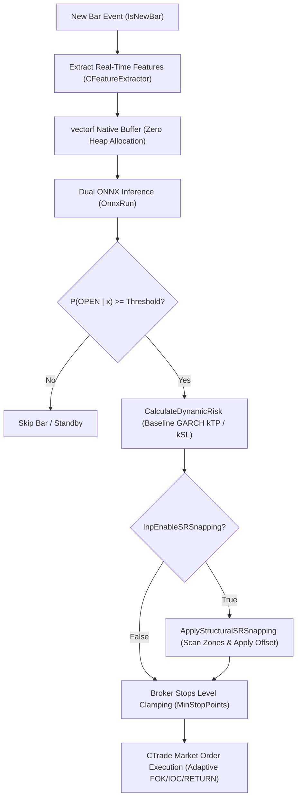
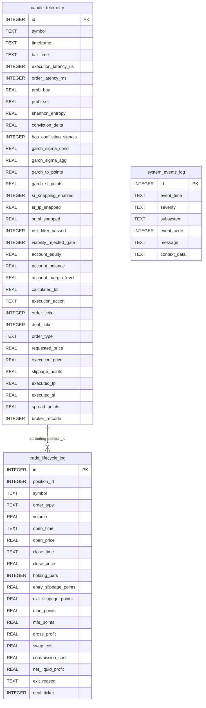

# LiveONNX-EA Operational Reference & Parameter Guide (`docs/LIVE_ONNX_EA_GUIDE.md`)

This authoritative document details the complete parameter architecture, microsecond execution mechanics, quantitative impacts, recommended boundaries (min/max), and backtest optimization benchmarks for **[`LiveONNX-EA.mq5`](../MQL5/Experts/LiveONNX-EA.mq5)**.

---

## 1. Executive Summary & Runtime Architecture

`LiveONNX-EA.mq5` is an institutional-grade, real-time algorithmic execution engine operating inside MetaTrader 5 live and demo chart terminals. 



### Core Invariants:
1. **Zero Train-Serving Skew**: Features are extracted using the identical [`CFeatureExtractor`](../MQL5/Include/FeatureExtractor.mqh) shared with `DMatrix-EA`.
2. **Sub-Millisecond Inference**: Employs flat 1D Float ONNX graphs (`[None, num_features] -> [None, 2]`) and MQL5 native `vectorf` arrays without dynamic heap allocations.
3. **Execution Safety**: Every calculated Stop Loss and Take Profit level is clamped against `SYMBOL_TRADE_STOPS_LEVEL` and `SYMBOL_SPREAD` before submission, guaranteeing zero `TRADE_RETCODE_INVALID_STOPS` rejections.

---

## 2. Exhaustive Input Parameter Reference

Below is the complete reference matrix of all inputs in [`LiveONNX-EA.mq5`](../MQL5/Experts/LiveONNX-EA.mq5).

### 2.1 Trading & Execution Settings

| Input Parameter | Data Type | Default | Expected Range (Min - Max) | Operational & Financial Impact |
| :--- | :---: | :---: | :---: | :--- |
| `InpTradeDirection` | `ENUM_TRADE_DIRECTION` | `DIRECTION_BOTH` (0) | `BOTH`, `ONLY_BUY`, `ONLY_SELL` | Directional exposure filter. When set to `DIRECTION_BOTH`, allows trading in both directions. When `InpIgnoreConflictingSignals` is `false`, both BUY and SELL can open concurrently (hedging). When `true`, simultaneous conflicting signals are suppressed. |
| `InpMinimalLevelAcceptedBuy` | `double` | `0.50` | `0.50` - `0.65` | Minimum conditional probability $P(\text{BUY} \mid \mathbf{x}_t)$ required to trigger a Buy order. Increasing to $0.55+$ filters low-conviction signals but reduces trade sample size. |
| `InpMinimalLevelAcceptedSell` | `double` | `0.50` | `0.50` - `0.65` | Minimum conditional probability $P(\text{SELL} \mid \mathbf{x}_t)$ required to trigger a Sell order. |
| `InpLotSize` | `double` | `0.01` | `0.01` - `10.0` | Fixed volume per trade. Must align with account margin and broker contract specifications (`SYMBOL_VOLUME_MIN`, `SYMBOL_VOLUME_STEP`). |
| `InpMagicNumber` | `ulong` | `222100` | `1` - `999999` | Unique identifier for trade position routing and trade transaction dispatching. |

---

### 2.2 Daily Schedule & Session Trading Filters (MT5 Server Time)

All schedule filters operate strictly in **MT5 Server Time** (`rates[i].time` / chart clock), which aligns with the institutional Forex standard (UTC+2 Winter / UTC+3 Summer EET/EEST).

- **Asian Session (Tokyo/Sydney)**: `00:00 - 09:00` MT5
- **London Session (Core Volume)**: `10:00 - 18:00` MT5
- **New York Session (Core Volume)**: `15:00 - 00:00` MT5
- **London + NY Overlap (Peak Volume)**: `15:00 - 18:00` MT5

| Input Parameter | Data Type | Default | Expected Range | Operational & Financial Impact |
| :--- | :---: | :---: | :---: | :--- |
| `InpTradeMonday` | `bool` | `true` | `true` / `false` | Enables/disables all candidate trade execution on Monday. |
| `InpMondayStartTime` / `EndTime` | `string` | `"11:00:00"` / `"18:00:00"` | `"HH:MM:SS"` | Permitted trading window on Monday in MT5 Server Time. End Time is exclusive. |
| `InpTradeTuesday` | `bool` | `true` | `true` / `false` | Enables/disables trading on Tuesday. |
| `InpTuesdayStartTime` / `EndTime` | `string` | `"10:00:00"` / `"18:00:00"` | `"HH:MM:SS"` | Permitted trading window on Tuesday. |
| `InpTradeWednesday` | `bool` | `true` | `true` / `false` | Enables/disables trading on Wednesday. |
| `InpWednesdayStartTime` / `EndTime` | `string` | `"10:00:00"` / `"18:00:00"` | `"HH:MM:SS"` | Permitted trading window on Wednesday. |
| `InpTradeThursday` | `bool` | `true` | `true` / `false` | Enables/disables trading on Thursday. |
| `InpThursdayStartTime` / `EndTime` | `string` | `"10:00:00"` / `"18:00:00"` | `"HH:MM:SS"` | Permitted trading window on Thursday. |
| `InpTradeFriday` | `bool` | `true` | `true` / `false` | Enables/disables trading on Friday. |
| `InpFridayStartTime` / `EndTime` | `string` | `"10:00:00"` / `"16:00:00"` | `"HH:MM:SS"` | Permitted trading window on Friday (stops before market close to eliminate weekend gap risk). |

> [!NOTE]
> Weekends (Saturday and Sunday) are strictly blocked at runtime in both EAs to eliminate illiquid rollover and spread expansion risks. Trading operates strictly Monday through Friday.

---

### 2.3 Structural S&R Snapping *(Superimposed over GARCH)*

This subsystem refines the baseline econometric GARCH(1,1) Stop Loss and Take Profit levels by snapping to real market structure within the lookback window. GARCH provides the foundational volatility envelope that never fails, while S&R snapping optimizes trade realization.

| Input Parameter | Data Type | Default | Expected Range (Min - Max) | Operational & Financial Impact |
| :--- | :---: | :---: | :---: | :--- |
| `InpEnableSRSnapping` | `bool` | `true` | `true` / `false` | Enables structural S&R snapping superimposed over GARCH. When `true`, scans for structural zones between the entry price and GARCH targets. When `false`, trades execute 100% pure dynamic GARCH levels. |
| `InpSRLookbackBars` | `int` | `12` | `5` - `65` *(Optimal: 12 - 36)* | Number of completed historical bars $[t-1 .. t-N]$ scanned to identify local swing highs (resistance) and swing lows (support). |
| `InpSRPivotStrength` | `int` | `2` | `1` - `5` *(1=3 bars, 2=5 bars, 3=7 bars)* | S&R Fractal Pivot Radius $K$. Enforces that a candle is only recognized as a valid Support or Resistance if it is an authentic local extremum higher (or lower) than the $K$ bars before and $K$ bars after it, filtering 100% of ordinary trend bars. |
| `InpSROffsetPoints` | `int` | `30` | `10` - `100` *(1.0 - 10.0 pips)* | Zone adjustment offset in broker points: **distanciates SL** from entry (beyond support/resistance) to prevent sweeps, and **pulls TP closer** to entry (before support/resistance) to guarantee execution before reversal. |
| `InpSRZoneSelection` | `ENUM_SR_ZONE_SELECTION` | `SR_ZONE_CLOSEST` (0) | `0` (`SR_ZONE_CLOSEST`) / `1` (`SR_ZONE_FURTHEST`) | Determines which structural zone to target when multiple levels exist: `0` selects the first barrier closest to entry (higher win rate); `1` selects the furthest zone within the GARCH envelope (higher profit payoff). |

#### Snapping Mechanics & Robust Fallback:
1. **Take Profit (Resistance for Buy, Support for Sell)**: Scans for a structural barrier between the open price and the GARCH Take Profit target. If found, snaps TP to `Zone \pm Offset` (closer to entry) ensuring profit is realized before market rejection. If no zone exists between entry and GARCH TP, the unadulterated GARCH TP is preserved.
2. **Stop Loss (Support for Buy, Resistance for Sell)**: Scans for a protective barrier protecting the position. If found, snaps SL to `Zone \mp Offset` (further from entry) shielding the trade from liquidity sweeps.
3. **Regime Immunity (Trending & Momentum Markets)**: If the market is in free fall or strong trend where no structural level exists inside the lookback window, the EA seamlessly retains 100% of the GARCH volatility projection (`Mode: Classic_GARCH`), eliminating artificial stops.

---

### 2.4 Risk & Margin Governance *(Viability Filter)*

This subsystem implements an institutional pre-trade risk filter that prevents opening toxic, capital-destructive, or margin-straining trades before order dispatch. It enforces three independent protection gates:

| Input Parameter | Data Type | Default | Expected Range (Min - Max) | Operational & Financial Impact |
| :--- | :---: | :---: | :---: | :--- |
| `InpEnableRiskFilter` | `bool` | `true` | `true` / `false` | Master toggle for the Risk & Margin Governance pre-trade viability filter. |
| `InpEnableDynamicLotSizing` | `bool` | `false` | `true` / `false` | Toggle for dynamic position sizing and risk fitting. When enabled, evaluates starting from `InpMaxLotSize` and analytically downsizes the volume to the largest valid broker lot (`SYMBOL_VOLUME_STEP`) that fits both risk % budget and margin level. When disabled, uses fixed `InpLotSize`. |
| `InpMaxLotSize` | `double` | `0.05` | `0.01` - `1.0` *(lots)* | Maximum starting lot size evaluated for dynamic sizing before downsizing. |
| `InpMarginSafetyMultiplier` | `double` | `1.5` | `1.0` - `3.0` *(x)* | Multiplier applied to the broker's official Margin Call level (`ACCOUNT_MARGIN_SO_CALL`, e.g. 100%). Dynamically requires projected Margin Level $\ge \text{brokerCall} \cdot \text{multiplier}$ (e.g. $100\% \cdot 1.5 = 150\%$). Protects accounts (e.g. 1:30 leverage on 300 EUR balances) from Margin Calls and stop-outs. |
| `InpMaxRiskRewardRatio` | `double` | `1.5` | `0.5` - `3.0` | Maximum allowed Asymmetry Ratio ($\text{SL}_{\text{points}} / \text{TP}_{\text{points}}$). Eliminates toxic trades where Stop Loss is disproportionately wider than Take Profit (e.g. risking 500 pts for 5 pts). |
| `InpMaxTradeRiskPct` | `double` | `3.0` | `0.5` - `5.0` *(%)* | Maximum allowable financial loss per trade expressed as a percentage of current Account Equity, calculated via native broker `OrderCalcProfit` in deposit currency (e.g. EUR). Rejects orders where even the minimum lot exceeds this budget. |

#### The 3 Protection Gates:
1. **Gate 1 (Broker-Adaptive Margin & Leverage Cushion)**: Dynamically queries `ACCOUNT_MARGIN_SO_CALL` (and `ACCOUNT_MARGIN_SO_SO`) from the MT5 account environment. Computes required margin via `OrderCalcMargin(...)` and enforces that projected Margin Level $\ge \text{brokerCall} \cdot \text{InpMarginSafetyMultiplier}$ (e.g. $100\% \cdot 1.5 = 150\%$).
2. **Gate 2 (Asymmetry Ratio)**: Computes $\text{SL}_{\text{points}} / \text{TP}_{\text{points}}$. If ratio exceeds `InpMaxRiskRewardRatio` (default 1.5), skips execution with descriptive warning log.
3. **Gate 3 (Account Equity Drawdown Budget)**: Computes exact monetary loss via `OrderCalcProfit(...)`. If potential loss in account currency exceeds `InpMaxTradeRiskPct` of equity (e.g. 9.00 EUR on 300 EUR equity), rejects the trade.

---

### 2.5 Consecutive Signal & Opposing Regime Management *(Execution Policies & ML Counter-Defense)*

When market momentum yields consecutive favorable prediction signals in the same direction across consecutive candles, opening multiple independent market orders can lead to inefficient margin utilization, compounded spread/commission overhead, and severe drawdowns during trend terminations. Furthermore, when an active position faces adverse machine learning predictions over consecutive bars, holding fixed stops without defensive re-evaluation can destroy accrued profit.

The EA incorporates institutional consecutive execution modes and opposing regime defense governed by `CConsecutiveManager` (`MQL5/Include/ConsecutiveManager.mqh`):

| Input Parameter | Data Type | Default | Expected Range (Min - Max) | Operational & Financial Impact |
| :--- | :---: | :---: | :---: | :--- |
| `InpConsecutiveMode` | `enum` | `0` *(LEGACY)* | `0` - `4` | Strategy mode when an open position already exists in the same direction: `0`=Legacy Independent Orders, `1`=Single Position Hurdle Profit Ratchet, `2`=Single Position Chain-Link (Previous Close Anchor), `3`=Unified Basket Scale-In, `4`=Pyramiding Step-Lock. |
| `InpMaxConsecutiveOrders` | `int` | `3` | `0` - `10` | Maximum simultaneous open orders allowed per direction for multi-position modes (`3` and `4`). When set to `0`, there is no fixed limit (governed purely by account margin and risk filters). |
| `InpHurdleProfitPct` | `double` | `50.0` | `10.0` - `90.0` *(%)* | Profit threshold percentage of original Take Profit distance required before the Stop Loss is permitted to ratchet in Mode 1 (`SINGLE_HURDLE_RATCHET`). |
| `InpProfitLockPct` | `double` | `50.0` | `10.0` - `90.0` *(%)* | Percentage of accumulated floating profit locked into the Stop Loss once the hurdle threshold is achieved. |
| `InpAntiChopMinDisplacement` | `int` | `150` | `50` - `500` *(pts)* | Minimum price displacement from initial entry required before moving Stop Loss in Mode 2 (`SINGLE_CHAIN_LINK`). Protects against whipsaws during consolidation/choppy ranges. |
| `InpSafetyOffsetPoints` | `int` | `20` | `0` - `100` *(pts)* | Protective cushion offset applied beyond breakeven or candle anchors. |
| `InpEnableSwapAmortization` | `bool` | `true` | `true` / `false` | Dynamically amortizes accumulated overnight rollover swap into Stop Loss points, guaranteeing $\text{NetLiquidProfit} \ge 0.0$ upon breakeven exit. |
| `InpConsecutiveSlotFilter` | `bool` | `false` | `true` / `false` | Requires new candidate slot amplitude ($|\text{TP} - \text{SL}|$) to be greater than or equal to current active slot amplitude before updating stops. |
| `InpIgnoreConflictingSignals` | `bool` | `true` | `true` / `false` | When `true`, suppresses opening new positions if both BUY and SELL models exceed their confidence thresholds on the same candle. When `false`, removes `probBuy > probSell` restriction, permitting simultaneous long and short positions (hedging). |
| `InpEnableOpposingRegimeFilter`| `bool` | `false` | `true` / `false` | Master toggle for the ML Opposing Regime Defense Filter. Monitors active positions against consecutive adverse predictions. |
| `InpOpposingStreakThreshold` | `int` | `2` | `1` - `10` *(bars)* | Number of consecutive candles $N$ with active opposing ML prediction required to trigger defensive action. |
| `InpOpposingAction` | `enum` | `0` *(CLOSE_IF_PROFIT)* | `0` - `5` | Defensive strategy executed when opposing streak meets threshold: `0`=Close If Net Profit, `1`=Immediate Liquidation, `2`=Defensive Trailing, `3`=Net Breakeven Lock, `4`=Recalculate Target Barrier, `5`=Stop & Reverse. |
| `InpOpposingTrailingPoints` | `int` | `50` | `10` - `500` *(pts)* | Trailing distance used in Action 2 (`OPPOSING_ACTION_TRAILING_DEFENSIVE`). |
| `InpOpposingRecalculateRatio` | `double` | `0.5` | `0.1` - `0.9` | Ratio applied to pull Take Profit closer and advance Stop Loss in Action 4 (`OPPOSING_ACTION_RECALCULATE_DEFENSIVE`). |

#### Architectural Modes Breakdown:
1. **Mode 0 (`CONSECUTIVE_MODE_LEGACY_INDEPENDENT`)**: Retains 100% backward compatibility. Opens independent tickets at market for each consecutive candle passing threshold.
2. **Mode 1 (`CONSECUTIVE_MODE_SINGLE_HURDLE_RATCHET`)**: Maintains a single position. Extends Take Profit if candidate TP is further. Ratchets Stop Loss to protect accumulated profit only after price traverses $\ge \text{InpHurdleProfitPct}$ of the initial target distance.
3. **Mode 2 (`CONSECUTIVE_MODE_SINGLE_CHAIN_LINK`)**: Maintains a single position. Locks the Stop Loss at the previous bar close minus buffer, isolating risk to the most recent bar. Employs the **Anti-Chop Filter** (`InpAntiChopMinDisplacement`) to prevent suffocating positions during tight consolidation ranges.
4. **Mode 3 (`CONSECUTIVE_MODE_UNIFIED_BASKET`)**: Scales in additional volume up to `InpMaxConsecutiveOrders`, immediately synchronizing the Take Profit and Stop Loss of **all** open orders to the latest levels.
5. **Mode 4 (`CONSECUTIVE_MODE_PYRAMIDING_STEP_LOCK`)**: Permits opening a subsequent order only if the preceding order in the sequence has already attained guaranteed breakeven or profit, eliminating multi-order downside risk.

#### Opposing Regime Defensive Actions Breakdown:
1. **Action 0 (`OPPOSING_ACTION_CLOSE_IF_PROFIT`)**: If active positions of `posType` show net liquid profit ($\text{Profit} + \text{Swap} > 0.0$), liquidates them immediately ahead of the predicted adverse momentum wave, banking accrued profit.
2. **Action 1 (`OPPOSING_ACTION_CLOSE_IMMEDIATE`)**: Executes immediate market liquidation of all positions of `posType` regardless of current floating PnL, acknowledging statistical thesis invalidation.
3. **Action 2 (`OPPOSING_ACTION_TRAILING_DEFENSIVE`)**: Activates a tight trailing stop ($P_{\text{bid}} - \text{InpOpposingTrailingPoints}$ for BUY) to capture remaining upside while protecting against sharp reversal.
4. **Action 3 (`OPPOSING_ACTION_BREAKEVEN_NET`)**: Locks Stop Loss at the exact entry price adjusted for accumulated negative swap ($\text{Price}_{\text{open}} \pm (\text{SwapPoints} + \text{SafetyOffset})$), eliminating downside risk entirely.
5. **Action 4 (`OPPOSING_ACTION_RECALCULATE_DEFENSIVE`)**: Compresses the Take Profit barrier closer to entry by `InpOpposingRecalculateRatio` (e.g. $50\%$ of original remaining distance) and ratchets SL to net-breakeven, facilitating an orderly defense and quick exit.
6. **Action 5 (`OPPOSING_ACTION_STOP_AND_REVERSE`)**: Liquidates existing positions of `posType` at market and immediately executes a new position in the opposing direction with full dynamic risk and S&R snapping.

#### Net-Liquid Swap Amortization Formula:
When positions are held across 00:00 MT5 Server Time rollovers (or Wednesday 3x swaps), negative swap accumulates. The EA dynamically calculates the required stop adjustment points:
$$\text{SwapPoints} = \frac{|\text{AccruedSwap}|}{\text{Volume} \cdot \left(\frac{\text{TickValue}}{\text{TickSize}} \cdot \text{Point}\right)}$$
Ensuring that $SL_{\text{protected}} \ge \text{Price}_{\text{open}} + (\text{SwapPoints} + \text{SafetyOffset}) \cdot \text{Point}$ for BUY positions.

---

### 2.6 Economic Calendar & Global News Governance *(SQLite Database)*

The EA natively interfaces with a central SQLite database (`macro_governance.db`) located statically in `%APPDATA%\MetaQuotes\Terminal\Common\Files`. To ensure institutional reliability, the database filename and path are configured **statically** in the MQL5 source code (immutable from terminal inputs), avoiding runtime configuration errors:

#### A. Economic Calendar Filter *(Section 6 Inputs)*
*Active in **both Live Trading and Strategy Tester backtests**.*

| Input Parameter | Data Type | Default | Expected Range (Min - Max) | Operational & Financial Impact |
| :--- | :---: | :---: | :---: | :--- |
| `InpEnableCalendarFilter` | `bool` | `true` | `true` / `false` | Independent toggle for scheduled macroeconomic calendar events. When `false`, scheduled events are completely ignored. |

> [!NOTE]
> Trailing stop distance is configured directly per event inside SQLite (`calendar_events.trailing_points`). If `trailing_points <= 0` or unset, the EA executes **immediate position closure (`CLOSE_ALL`)** for capital safety.

#### B. Global News Blacklist Filter *(Section 7 Inputs)*
*Active in **Live Trading only** (automatically bypassed during Strategy Tester backtests).*

| Input Parameter | Data Type | Default | Expected Range (Min - Max) | Operational & Financial Impact |
| :--- | :---: | :---: | :---: | :--- |
| `InpEnableNewsFilter` | `bool` | `true` | `true` / `false` | Independent toggle for breaking news blacklist. When `false`, breaking news restrictions are completely ignored. |

#### Supported Protection Actions (`action`):
- **`BLOCK_ENTRIES`**: Prohibits opening new orders for the symbol. Existing positions remain undisturbed.
- **`TRAILING_STOP`**: Prohibits new orders and tightens stop loss on profitable open positions using `trailing_points`. If `trailing_points <= 0`, or if broker modification fails, executes immediate market liquidation.
- **`BREAKEVEN`**: Prohibits new orders and moves stop loss directly to open price (`price_open`) ensuring zero financial downside. If distance violates broker stop levels or modification fails, immediately closes position.
- **`CLOSE_ALL`**: Prohibits new orders and executes immediate market liquidation on all open positions for this symbol.
- **`ADVISORY_ONLY`**: Does not block orders and does not modify positions; emits high-priority informational warning in MT5 Experts log.

---

### 2.7 Dynamic GARCH Risk Parameters *(Execution Sizing)*

The GARCH(1,1) dynamic risk engine is the **permanent foundation** of all trade sizing. Stop Loss and Take Profit distances are scaled continuously to current conditional market volatility:

| Input Parameter | Data Type | Default | Expected Range (Min - Max) | Operational & Financial Impact |
| :--- | :---: | :---: | :---: | :--- |
| `InpRiskGarchHorizon` | `int` | `8` | `4` - `24` | Dynamic risk volatility forecast horizon ($H$ bars). Decoupled from ML feature extraction GARCH. |
| `InpKTP` | `double` | `1.5` | `0.5` - `3.0` | Multiplier for dynamic GARCH Take Profit ($\text{TP} = k_{\text{TP}} \cdot \sigma_{\text{agg}} \cdot P$). |
| `InpKSL` | `double` | `1.5` | `0.5` - `2.5` | Multiplier for dynamic GARCH Stop Loss ($\text{SL} = k_{\text{SL}} \cdot \sigma_{\text{agg}} \cdot P$). |

---

### 2.8 GARCH(1,1) Volatility Forecast Settings *(Feature Parity with DMatrix)*

| Input Parameter | Data Type | Default | Expected Range (Min - Max) | Operational & Financial Impact |
| :--- | :---: | :---: | :---: | :--- |
| `InpGarchHorizon` | `int` | `8` | `4` - `24` | Forward multi-step volatility aggregation window ($H$ bars) for feature extraction. Must match training configuration in `.env`. |
| `InpPriceSize` | `int` | `500` | `200` - `1000` | Historical sample size (bars) used to compute the sample variance anchor $\sigma_0^2$. |
| `InpGarchAlpha` | `double` | `0.05` | `0.01` - `0.15` | ARCH parameter measuring conditional variance shock reaction. |
| `InpGarchBeta` | `double` | `0.92` | `0.80` - `0.96` | GARCH parameter measuring variance persistence. Must satisfy $\alpha + \beta < 1.0$ for stationarity. |

---

### 2.9 Feature Extraction & Technical Indicators (Parity Contract)

> [!IMPORTANT]
> All feature extraction inputs below **must strictly mirror** the configuration used during model training in `.env`. Any divergence alters the feature schema and causes ONNX tensor dimension mismatches or prediction drift.

| Input Parameter | Data Type | Default | Expected Range | Description & Purpose |
| :--- | :---: | :---: | :---: | :--- |
| `InpFeatureLookback` | `int` | `4` | `1` - `10` | Number of lagged observation vectors $[t-1 .. t-N]$ concatenated into the final feature vector. |
| `InpUseADX` | `bool` | `true` | `true` / `false` | Includes Welles Wilder Average Directional Index (Main, +DI, -DI). |
| `InpUseATR` | `bool` | `true` | `true` / `false` | Includes Average True Range volatility measure. |
| `InpUseBands` | `bool` | `true` | `true` / `false` | Includes Bollinger Bands (Normalized Mid Distance and Bandwidth). |
| `InpUseMACD` | `bool` | `true` | `true` / `false` | Includes Moving Average Convergence Divergence (Main line and Signal line). |
| `InpUseFastMA` / `SlowMA` | `bool` | `true` | `true` / `false` | Includes Trend Moving Average distance features. |
| `InpUseRSI` | `bool` | `true` | `true` / `false` | Includes Relative Strength Index momentum indicator. |
| `InpUseStochastic` | `bool` | `true` | `true` / `false` | Includes Stochastic Oscillator (%K and %D lines). |
| `InpUseCandlestick` | `bool` | `true` | `true` / `false` | Includes Candlestick Anatomy (Direction, Body ratio, Upper/Lower shadow ratios). |
| `InpUseTimestampWeek` | `bool` | `true` | `true` / `false` | Includes normalized Day of the Week (Monday = 0.0 .. Friday = 4.0). |
| `InpUseTimestampDay` | `bool` | `true` | `true` / `false` | Includes Quarter of Day context (0.0 to 3.0). |
| `InpUseOpenMarkets` | `bool` | `true` | `true` / `false` | Includes Global Trading Session Code (0.0 Sydney .. 7.0 NY+Sydney). |
| `InpUseSpread` | `bool` | `true` | `true` / `false` | Includes live market spread in broker points. |
| `InpUseGarchFeatures` | `bool` | `true` | `true` / `false` | Includes dynamic GARCH(1,1) features ($\omega, \text{vol\_ratio}, \text{vol\_trend}, \sigma_{\text{cond}}, \sigma_{\text{agg}}$). |

---

### 2.10 Execution & Telemetry Audit Subsystem (`CExecutionAuditor`)

To guarantee institutional regulatory compliance, continuous machine learning governance, and empirical drift detection, `LiveONNX-EA.mq5` integrates a **high-performance SQLite telemetry audit engine** ([`ExecutionAuditor.mqh`](../MQL5/Include/ExecutionAuditor.mqh)).

| Input Parameter | Data Type | Default | Expected Range | Description & Operational Impact |
| :--- | :---: | :---: | :---: | :--- |
| `InpIgnoreAudit` | `bool` | `false` | `false` / `true` | When `true`, completely bypasses the audit subsystem: suppresses creation of the SQLite `.db` file and skips all candle telemetry and trade lifecycle logging. When `false` (default), auditing is active. |

#### Quantitative Research Rationale: Auditing "Between the Lines"
A quantitative auditor cannot rely on lagging indicators (account balance, equity curve, or net financial PnL) to determine whether an algorithmic trading strategy is operating correctly. By the time an account exhibits a severe drawdown, the structural edge has already decayed or broker friction has already consumed the statistical alpha.

`CExecutionAuditor` captures **leading indicators** (early-warning signals) across 6 econometric and operational dimensions:
1. **Epistemic Model Uncertainty & Entropy Drift**: Quantifies model confusion candle-by-candle using Shannon Entropy:
   $$H(X) = - \sum_{i \in \{\text{BUY}, \text{SELL}\}} \left[ P_i \log_2(P_i) + (1 - P_i) \log_2(1 - P_i) \right]$$
   When $H(X)$ drifts towards maximum entropy ($1.0$), the gradient boosting trees have lost directional certainty due to regime shifting.
2. **Conviction Delta Drift**: Tracks directional divergence $\Delta_P = |P_{\text{BUY}} - P_{\text{SELL}}|$. Squeeze towards $0.0$ indicates loss of signal edge.
3. **Conflicting Signal Toxicity**: Identifies choppy consolidation regimes where both models simultaneously cross activation thresholds ($P_{\text{BUY}} \ge \theta_{\text{BUY}} \land P_{\text{SELL}} \ge \theta_{\text{SELL}}$).
4. **Broker Execution Friction**: Profiles microsecond order routing latency (`order_latency_ms`) and slippage in broker points ($\Delta_{\text{pts}} = \pm(\text{FillPrice} - \text{RequestedPrice}) / \text{Point}$) on every live fill.
5. **Operational Health & Incident Auditing**: Captures asynchronous broker retcodes, requotes (10004), invalid stops (10016), offquotes (10021), and database locks in a dedicated log.
6. **Closed-Loop Trade Lifecycle & Excursion Attribution**: Continuously tracks Maximum Adverse Excursion (`mae_points`) and Maximum Favorable Excursion (`mfe_points`) from entry to exit via `OnTradeTransaction`, isolating whether losses stem from premature stop placement or statistical thesis failure.

#### Operational Architecture & Storage Contract
- **Audit Directory**: `Common/Files/AuditLogs/` (located in MT5 Terminal Common shared storage, accessible across all terminal instances).
- **Database Naming**: `<Symbol>_<TF>_<YYYYMMDD_HHMMSS>.db` (generated dynamically on EA launch via `TimeCurrent()`).
- **Collision & Consecutive Tester Protection (`.bkp` Rollover)**:
  If an audit database with the exact filename already exists (for instance, during consecutive test runs in the MetaTrader 5 Strategy Tester starting at the same initial simulation timestamp), `CExecutionAuditor` guarantees data safety and isolation:
  1. Creates a backup copy of the existing file named `<db_path>.bkp` (`FILE_REWRITE`).
  2. Cleanly deletes the existing `.db` file along with any auxiliary SQLite WAL/SHM files (`<db_path>-wal`, `<db_path>-shm`).
  3. Initializes the new `.db` completely empty and clean (*zerado*), rebuilding the fresh 3-pillar relational schema.
- **Database Engine**: Native MT5 SQLite 3 with Write-Ahead Logging (`PRAGMA journal_mode=WAL;`), synchronous NORMAL (`PRAGMA synchronous=NORMAL;`), and a 5,000 ms busy timeout (`PRAGMA busy_timeout=5000;`).

---

#### Tri-Pillar Relational Schema



##### 1. Table: `candle_telemetry` (aliased by view `prediction_audit_logs`)
Logs unbroken bar-by-bar telemetry across all states (`BUY_EXECUTED`, `SELL_EXECUTED`, `BLOCKED_SCHEDULE`, `BLOCKED_NEWS`, `FAILED_VIABILITY`, `SKIPPED_THRESHOLD`).

| # | Column Name | Type | Description |
|---|---|---|---|
| 1 | `id` | `INTEGER` | Primary key auto-increment. |
| 2 | `symbol` | `TEXT` | Currency pair symbol (e.g., `EURUSD`). |
| 3 | `timeframe` | `TEXT` | Chart timeframe string (e.g., `H1`). |
| 4 | `bar_time` | `TEXT` | Bar open timestamp in MT5 Server Time (`YYYY.MM.DD HH:MM:SS`). |
| 5 | `created_at` | `TEXT` | Real-world telemetry generation timestamp. |
| 6 | `execution_latency_us`| `INTEGER` | Sub-microsecond tick-to-prediction duration (`GetMicrosecondCount()`). |
| 7 | `order_latency_ms` | `INTEGER` | Broker order routing roundtrip latency in milliseconds. |
| 8 | `prob_buy` | `REAL` | Raw ONNX conditional probability $P(\text{BUY} \mid \mathbf{x}_t)$. |
| 9 | `prob_sell` | `REAL` | Raw ONNX conditional probability $P(\text{SELL} \mid \mathbf{x}_t)$. |
| 10| `threshold_buy` | `REAL` | Active buy trigger hurdle (`InpMinimalLevelAcceptedBuy`). |
| 11| `threshold_sell` | `REAL` | Active sell trigger hurdle (`InpMinimalLevelAcceptedSell`). |
| 12| `shannon_entropy` | `REAL` | Normalized Shannon entropy of dual probability distribution ($0.0 - 1.0$). |
| 13| `conviction_delta`| `REAL` | Absolute directional conviction gap $|P_{\text{BUY}} - P_{\text{SELL}}|$. |
| 14| `has_conflicting_signals`| `INTEGER` | 1 if both Buy and Sell models exceeded threshold; 0 otherwise. |
| 15| `macro_news_blocked` | `INTEGER` | 1 if breaking news filter blocked entries; 0 otherwise. |
| 16| `macro_calendar_blocked`| `INTEGER`| 1 if scheduled economic catalyst blocked entries; 0 otherwise. |
| 17| `macro_action` | `TEXT` | Active macro protection action (`BLOCK_ENTRIES`, `TRAILING_STOP`, etc.). |
| 18| `schedule_allowed` | `INTEGER` | 1 if bar falls within permitted trading window; 0 otherwise. |
| 19| `garch_sigma_cond` | `REAL` | Instantaneous GARCH(1,1) conditional volatility $\sigma_{\text{cond}}$. |
| 20| `garch_sigma_agg` | `REAL` | Multi-step aggregated horizon volatility $\sigma_{\text{agg}}$. |
| 21| `garch_tp_points` | `REAL` | Baseline GARCH Take Profit in points ($k_{\text{TP}} \cdot \text{RiskPoints}$). |
| 22| `garch_sl_points` | `REAL` | Baseline GARCH Stop Loss in points ($k_{\text{SL}} \cdot \text{RiskPoints}$). |
| 23| `sr_snapping_enabled`| `INTEGER` | 1 if Support & Resistance snapping is active; 0 otherwise. |
| 24| `sr_tp_snapped` | `REAL` | S&R-snapped Take Profit price (0.0 if not snapped). |
| 25| `sr_sl_snapped` | `REAL` | S&R-snapped Stop Loss price (0.0 if not snapped). |
| 26| `sr_zone_type` | `TEXT` | Zone descriptor (`SWING_HIGH`, `SWING_LOW`, `NONE`). |
| 27| `risk_filter_passed` | `INTEGER` | 1 if all 3 pre-trade viability gates passed; 0 otherwise. |
| 28| `viability_rejected_gate`| `INTEGER`| Rejection gate ID (0=None, 1=Margin, 2=R:R, 3=Max Loss Budget). |
| 29| `account_equity` | `REAL` | Account equity at inference bar open. |
| 30| `account_balance`| `REAL` | Account balance at inference bar open. |
| 31| `account_margin_level`| `REAL`| Account margin level percentage ($> 100.0\%$). |
| 32| `calculated_lot` | `REAL` | Viable lot volume allocated after dynamic sizing. |
| 33| `execution_action` | `TEXT` | Action label (`BUY_EXECUTED`, `BLOCKED_NEWS`, `FAILED_VIABILITY`, etc.). |
| 34| `order_ticket` | `INTEGER` | Broker order ticket number (0 if not executed). |
| 35| `deal_ticket` | `INTEGER` | Broker deal execution ticket number (0 if not executed). |
| 36| `order_type` | `TEXT` | Order direction string (`BUY`, `SELL`, `NONE`). |
| 37| `requested_price` | `REAL` | Market quote price at time of order dispatch (Ask/Bid). |
| 38| `execution_price` | `REAL` | Actual market fill price returned by broker. |
| 39| `slippage_points` | `REAL` | Execution slippage in points ($\pm(\text{Fill} - \text{Requested}) / \text{Point}$). |
| 40| `executed_tp` | `REAL` | Final Take Profit price placed with broker. |
| 41| `executed_sl` | `REAL` | Final Stop Loss price placed with broker. |
| 42| `spread_points` | `REAL` | Broker market spread in points at bar open. |
| 43| `broker_retcode` | `INTEGER` | MQL5 trade server retcode (`TRADE_RETCODE_DONE` = 10009). |
| 44| `error_message` | `TEXT` | Diagnostic error or warning string (`NULL` on success). |

##### 2. Table: `system_events_log`
Captures asynchronous operational incidents, non-fatal warnings, and execution errors.

| Column Name | Type | Description |
|---|---|---|
| `id` | `INTEGER` | Primary key auto-increment. |
| `event_time` | `TEXT` | Event timestamp in MT5 Server Time. |
| `symbol` | `TEXT` | Chart currency pair symbol. |
| `timeframe` | `TEXT` | Chart timeframe. |
| `severity` | `TEXT` | Alert level: `INFO`, `WARNING`, `ERROR`, `CRITICAL`. |
| `subsystem` | `TEXT` | Originating module (`ONNX_INFERENCE`, `ORDER_EXECUTION`, `VIABILITY_GATE`, `MACRO_NEWS`). |
| `event_code` | `INTEGER` | MT5 retcode or internal event ID (e.g. 10004 offquotes, 10016 invalid stops). |
| `message` | `TEXT` | Detailed human-readable event description. |
| `context_data` | `TEXT` | Structured JSON or parameter string with diagnostic prices and stops. |

##### 3. Table: `trade_lifecycle_log`
Closed-loop trade outcome attribution recorded upon position exit via `OnTradeTransaction`.

| Column Name | Type | Description |
|---|---|---|
| `id` | `INTEGER` | Primary key auto-increment. |
| `position_id` | `INTEGER` | Permanent position ticket linking entry and exit deals. |
| `symbol` | `TEXT` | Currency pair symbol. |
| `order_type` | `TEXT` | Direction of closed trade (`BUY` / `SELL`). |
| `volume` | `REAL` | Closed position volume in lots. |
| `open_time` | `TEXT` | Position opening timestamp. |
| `open_price` | `REAL` | Actual fill price at position entry. |
| `close_time` | `TEXT` | Position exit timestamp. |
| `close_price` | `REAL` | Actual fill price at position exit. |
| `holding_bars` | `INTEGER` | Number of completed chart bars position remained open. |
| `entry_slippage_points` | `REAL` | Broker entry slippage in points. |
| `exit_slippage_points` | `REAL` | Broker exit slippage in points. |
| `mae_points` | `REAL` | **Maximum Adverse Excursion**: Worst unrealized drawdown in points during trade life. |
| `mfe_points` | `REAL` | **Maximum Favorable Excursion**: Peak unrealized profit in points during trade life. |
| `gross_profit` | `REAL` | Gross trade profit in account currency. |
| `swap_cost` | `REAL` | Total accrued overnight swap fees. |
| `commission_cost` | `REAL` | Total broker roundturn commissions. |
| `net_liquid_profit` | `REAL` | **Golden Rule Net Profit**: $\text{Gross} + \text{Swap} + \text{Commission}$. |
| `exit_reason` | `TEXT` | Exit attribution (`TP`, `SL`, `TRAILING_STOP`, `OPPOSING_REGIME`, `MACRO_NEWS`, `TIMEOUT`). |
| `deal_ticket` | `INTEGER` | Deal ticket of the exit transaction. |

---

#### Quantitative Auditor SQL Recipes

Quantitative researchers and risk auditors can extract high-value insights directly from the SQLite audit database using Python (`sqlite3` / `duckdb`) or SQL queries:

```sql
-- 1. Shannon Entropy & Model Conviction Degradation (Leading Indicator)
SELECT 
    date(bar_time) AS trade_date,
    COUNT(*) AS total_bars,
    AVG(shannon_entropy) AS mean_entropy,
    AVG(conviction_delta) AS mean_conviction,
    SUM(has_conflicting_signals) AS conflicting_count
FROM candle_telemetry
GROUP BY trade_date
ORDER BY trade_date DESC;

-- 2. Broker Execution Quality: Slippage & Latency Profiling
SELECT 
    order_type,
    COUNT(*) AS fill_count,
    AVG(order_latency_ms) AS avg_latency_ms,
    MAX(order_latency_ms) AS max_latency_ms,
    AVG(slippage_points) AS avg_slippage_pts,
    MAX(slippage_points) AS max_adverse_slippage_pts
FROM candle_telemetry
WHERE execution_action IN ('BUY_EXECUTED', 'SELL_EXECUTED')
GROUP BY order_type;

-- 3. Trade Quality & Exit Attribution: MAE/MFE Efficiency
SELECT 
    exit_reason,
    COUNT(*) AS trade_count,
    ROUND(AVG(holding_bars), 1) AS avg_holding_bars,
    ROUND(AVG(mfe_points), 1) AS avg_mfe_pts,
    ROUND(AVG(mae_points), 1) AS avg_mae_pts,
    ROUND(SUM(net_liquid_profit), 2) AS total_net_profit,
    ROUND(AVG(net_liquid_profit), 2) AS avg_net_profit
FROM trade_lifecycle_log
GROUP BY exit_reason;

-- 4. Pre-Trade Risk Gate Rejections (Bottleneck Analysis)
SELECT 
    viability_rejected_gate,
    CASE viability_rejected_gate
        WHEN 1 THEN 'Margin Safety Cushion'
        WHEN 2 THEN 'Asymmetry Ratio (SL/TP)'
        WHEN 3 THEN 'Max Account Loss Budget'
        ELSE 'Passed / Non-Viability'
    END AS gate_name,
    COUNT(*) AS rejection_count
FROM candle_telemetry
WHERE execution_action = 'FAILED_VIABILITY'
GROUP BY viability_rejected_gate;
```

---

## 3. Quantitative Insights from Strategy Tester Optimization

Optimization data from **`ReportOptimizer-106567513.xml`** (207 passes across EURUSD H1) establishes the empirical sensitivity curves for the S&R subsystem:

### 3.1 Lookback Window (`InpSRLookbackBars`) Sensitivity
- **Zone 3 - 7 bars (Sweet Spot)**:
  - **Average Net Profit**: **+$102.10**
  - **Profit Factor**: **3.05 - 4.73**
  - **Max Equity Drawdown**: **1.75% - 3.45%**
  - *Rationale*: On the H1 timeframe, 3 to 7 bars corresponds to a 3-to-7 hour lookback, capturing the immediate intraday swing high/low of the active London or New York session without incorporating stale historical regimes.
- **Zone 10 - 24 bars (Degradation Zone)**:
  - **Average Net Profit**: Falls to **+$77.69**
  - **Profit Factor**: Drops to **2.07 - 2.31**
  - **Max Equity Drawdown**: Spikes to **5.30% - 6.00%**
  - *Rationale*: Looking back too far forces the Stop Loss into distant daily support/resistance levels, resulting in unnecessarily wide stops, larger financial drawdowns, and lower risk-reward ratios.

### 3.2 Safety Buffer Offset (`InpSROffsetPoints`)
- Setting `InpSROffsetPoints = 30` (3.0 pips on 5-digit brokers) successfully absorbs spread expansion and false breakout liquidity sweeps, preventing premature stop-outs prior to genuine directional expansion.


---

## 4. Pre-Existing Open Positions Behavior & TP/SL Manipulation Mechanics

When `LiveONNX-EA.mq5` is attached to an MT5 chart that already contains active open positions, the system behaves deterministically according to strict architectural rules. This section details how existing positions are recognized, adopted, and governed across all execution and protection subsystems.

### 4.1 Recognition & Adoption Gate (Magic Number & Symbol Isolation)

The EA inspects every active position on the account:
- `PositionGetString(POSITION_SYMBOL) == _Symbol`
- `PositionGetInteger(POSITION_MAGIC) == InpMagicNumber`

#### Operational Guarantees:
1. **Manual & Third-Party EA Isolation**: Any trade opened manually by the user (`Magic == 0`) or by another automated strategy (`Magic != InpMagicNumber`) is **strictly ignored**. `LiveONNX-EA` will never modify the Stop Loss, Take Profit, trailing stop, or volume of these positions, nor will it close them.
2. **Deterministic Adoption**: If an open position shares the chart symbol and the configured `InpMagicNumber` (e.g., positions opened during a prior EA session before a terminal restart or chart timeframe switch), the EA immediately identifies and adopts the order into its runtime state machine.

### 4.2 Startup Passivity Invariant (`OnInit`)

Upon chart attachment, `OnInit()` executes environment checks, tensor handle creation, schedule calculations, and SQLite connection initialization.
- **Zero Immediate Action**: `OnInit()` never executes order modifications (`PositionModify`) or liquidations (`PositionClose`). All existing adopted positions remain 100% untouched at the exact instant of EA startup.

### 4.3 Real-Time Tick Governance & TP/SL Manipulation (`OnTick`)

Once the EA begins receiving market ticks, adopted open positions are continuously evaluated and governed across four distinct functional layers:

#### A. Consecutive Trade Management (`CConsecutiveManager`)
The manager queries active positions on the broker server via `CountActivePositions()`. When new bar signals are evaluated, the manipulation of Stop Loss and Take Profit depends strictly on `InpConsecutiveMode`:
- **Mode 0 (`CONSECUTIVE_MODE_LEGACY_INDEPENDENT`)**:
  - **TP/SL Impact**: Retains existing positions' Stop Loss and Take Profit levels **completely unmodified**. If a new signal triggers in the same direction, it opens an independent order with its own dynamic GARCH TP/SL envelope.
- **Mode 1 (`CONSECUTIVE_MODE_SINGLE_HURDLE_RATCHET`)**:
  - **TP/SL Impact**: If a subsequent signal occurs in the same direction and the open position has achieved favorable excursion exceeding `InpHurdleProfitPct` (e.g., 50% of the distance to the initial TP):
    1. **Stop Loss Ratchet**: The SL is moved forward to lock in `InpProfitLockPct` of accrued favorable points, while amortizing accumulated negative swap (`InpEnableSwapAmortization`).
    2. **Take Profit Extension**: If the newly calculated candidate TP from the latest ML/GARCH signal is further than the current TP (`candidateTP > firstTP`), the Take Profit is expanded to ride the directional trend.
- **Mode 2 (`CONSECUTIVE_MODE_SINGLE_CHAIN_LINK`)**:
  - **TP/SL Impact**: Evaluates bar-to-bar displacement (`iClose(1) - openPrice`). If displacement exceeds `InpAntiChopMinDisplacement`, the SL is advanced to the prior candle close and the TP is extended if favorable. If displacement is minimal (consolidation), the wide GARCH SL is preserved to absorb market noise.
- **Mode 3 (`CONSECUTIVE_MODE_PYRAMIDING_INDEPENDENT`)**:
  - **TP/SL Impact**: Allows opening additional positions up to `InpMaxConsecutiveOrders`. Crucially, **before dispatching any new pyramid order**, the SL of the existing order is advanced to net breakeven / profit lock, ensuring the preceding exposure is rendered risk-free before expanding total volume.
- **Mode 4 (`CONSECUTIVE_MODE_PYRAMIDING_UNIFIED_BASKET`)**:
  - **TP/SL Impact**: Recomputes the volume-weighted average break-even price of the entire position basket (incorporating accumulated swap charges). It then **synchronously modifies the SL and TP of ALL open positions in the basket to identical unified price targets**.

#### B. Opposing Regime Defense Filter (`InpEnableOpposingRegimeFilter`)
If a position is open in one direction (e.g., BUY) and the dual XGBoost model outputs strong signals in the adverse direction (e.g., SELL) that persist for `InpOpposingStreakThreshold` bars:
- **`OPPOSING_ACTION_TIGHTEN_SL`**: Immediately tightens the open position's Stop Loss to `bid - InpOpposingTrailingPoints` (for BUY) or `ask + InpOpposingTrailingPoints` (for SELL), shielding capital against trend reversal.
- **`OPPOSING_ACTION_BREAKEVEN_NET`**: If the position is currently in profit, ratchets the SL to the exact entry price plus accrued negative swap amortization.
- **`OPPOSING_ACTION_RECALCULATE_DEFENSIVE`**: Recalculates a compressed Stop Loss based on the newly estimated GARCH volatility scaled down by `InpOpposingRecalculateRatio` (e.g., 50% of standard SL).
- **`OPPOSING_ACTION_CLOSE_IF_PROFIT` / `CLOSE_IMMEDIATELY`**: Executes an immediate market exit (`PositionClose`).
- **`OPPOSING_ACTION_STOP_AND_REVERSE`**: Liquidates the current position and instantly submits a reverse market order.

#### C. Macroeconomic Calendar & News Protective Actions (`ApplyMacroAction`)
At each bar open, `LiveONNX-EA` scans `macro_governance.db`:
- **`BREAKEVEN`**: Moves the SL of all matching open positions to their open price (provided the trade is in profit and distance $\ge \text{StopsLevel}$). If the price is too close to entry to permit modification without violating broker stop levels, the position is closed immediately at market to avoid news slippage.
- **`TRAILING_STOP`**: Trails the Stop Loss behind the market by `trailingPoints`.
- **`CLOSE_ALL`**: Immediately closes all open positions at market prior to high-impact catalyst releases (NFP, FOMC, CPI).

#### D. Session End & Friday Weekend Closure (`InpCloseOnSessionEnd`)
When trading outside permitted daily hours or upon reaching the Friday cutoff (`InpFridayEndTime`, e.g., 16:00 EET):
- The EA systematically liquidates all open positions associated with `InpMagicNumber` to completely eliminate weekend gap and liquidity vacuum risks.

### 4.4 Telemetry & Post-Crash Attribution (`ExecutionAuditor`)

If a position was already open before the EA was loaded:
- In-memory excursion tracking (`g_activeTrades[]` RAM buffer) will not contain peak MAE/MFE data for the duration the EA was offline.
- **Crash Recovery Protocol**: Upon trade exit, `OnTradeTransaction()` detects that the position was unindexed in RAM (`idx < 0`), invokes `HistorySelectByPosition(posId)` on the permanent MT5 terminal database, extracts the original entry ticket, deal price, and open timestamp, computes holding bars and duration, and records the full transaction breakdown ($\text{GrossProfit}, \text{Swap}, \text{Commission}, \Pi_{\text{net}}$) into SQLite `trade_lifecycle_log`.

---

## 5. Live Deployment & Execution Checklist

1. **AutoTrading Authorization**: Ensure the **Algo Trading** button on the MT5 toolbar is green (enabled).
2. **Preset Loading**: Load the generated `.set` preset from `MQL5/Presets/LiveONNX-EA_EURUSD_H1.set`.
3. **Chart Confirmation**: Check the MT5 Experts log upon attaching the EA. It must display:
   ```
   [LiveONNX-EA] Live Inference Engine Ready. Tensor Dimensions: 130, Direction: DIRECTION_BOTH, Threshold BUY: 0.5000, Threshold SELL: 0.5000, S&R Snapping: ENABLED (Lookback: 12, Offset: 30 pts, Mode: SR_ZONE_CLOSEST, PivotK: 2), GARCH Risk kTP: 1.50, kSL: 1.50
   ```
4. **Log Diagnostics**: Monitor log prefixes:
   - `[INFO]`: Standard operation and bar inference probabilities.
   - `[WARNING]`: Non-fatal execution events (market closed, temporary off quotes, spread widening).
   - `[ERROR]`: Critical failures (model file missing, tensor shape mismatch).
