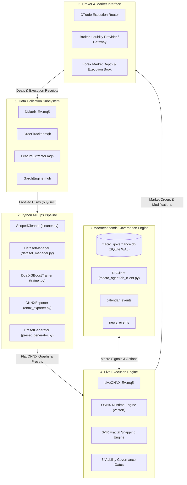
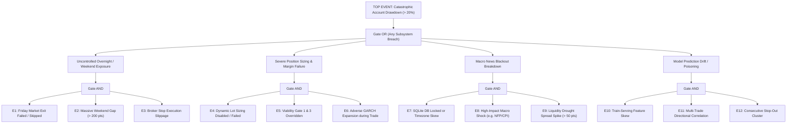
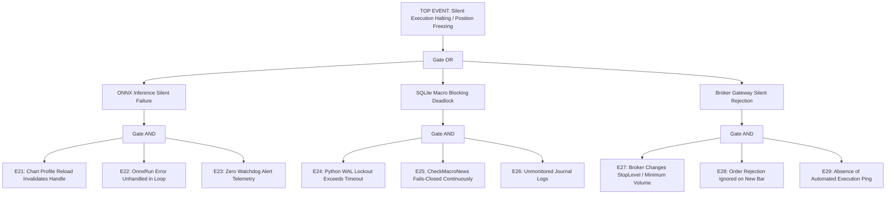
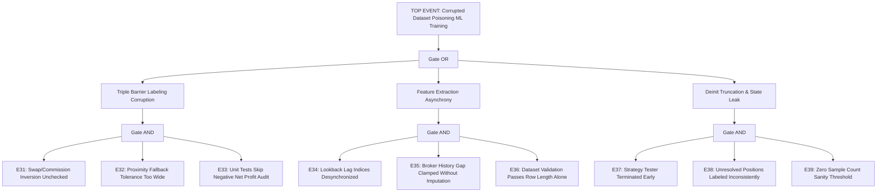
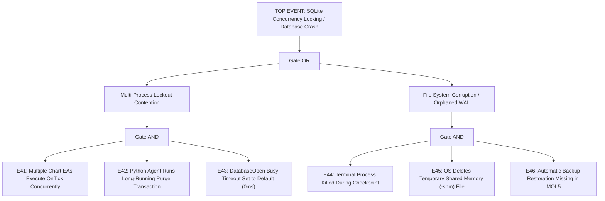
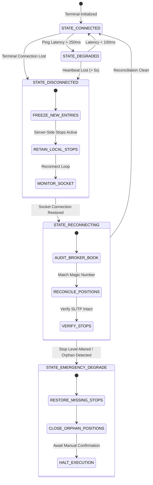
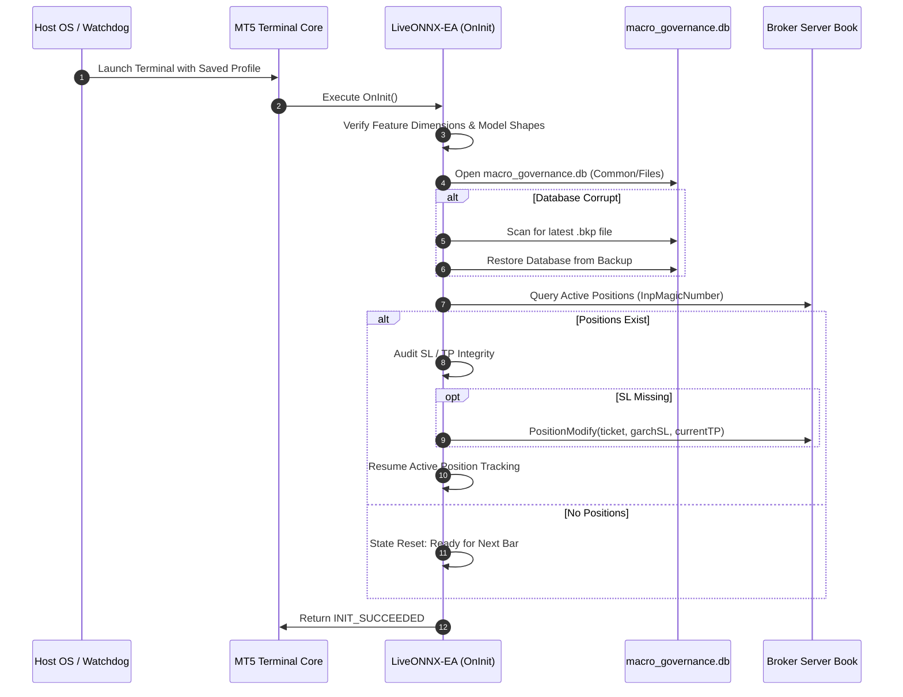

# Failure Mode and Effects Analysis (FMEA), Fault Tree Analysis (FTA), and Resilience Engineering Architecture
**Authoritative Reliability Specification, Quantitative Risk Matrix, and Institutional Fault-Tolerant State Protocols**  
**Classification**: Institutional Quantitative Software Reliability Engineering & Mission-Critical Algorithmic Trading  
**Standards Compliance**: [IEC 60812:2018](https://webstore.iec.ch/publication/30740) (Failure Modes and Effects Analysis), [SAE J1739:2021](https://www.sae.org/standards/content/j1739_202104/) (Design/Process FMEA), [IEEE 352-2016](https://standards.ieee.org/ieee/352/5697/) (Reliability Analysis of Systems), [IEEE 1012-2016](https://standards.ieee.org/ieee/1012/5759/) (System Verification and Validation)  
**Universal Timezone Standard**: Eastern European Time / Eastern European Summer Time (EET/EEST, MT5 Server Time: UTC+2 winter / UTC+3 summer)

---

## 1. Executive Summary & Reliability Engineering Framework

In automated quantitative currency trading, the barrier between theoretical mathematical expectancy and real-world capital survival is determined by **systemic resilience**, **fault isolation**, and **fail-safe operational governance**. Algorithmic trading systems operate in an environment characterized by extreme stochasticity, regime shifts, structural non-stationarity ([Mandelbrot, 1963](https://doi.org/10.1086/294632); [Bollerslev, 1986](https://doi.org/10.1016/0304-4076(86)90063-1)), endogenously generated liquidity shocks ([Kyle, 1985](https://doi.org/10.2307/1913210); [Brunnermeier & Pedersen, 2009](https://doi.org/10.1093/rfs/hhn098)), and microsecond execution latency decay ([López de Prado, 2018](https://www.wiley.com/en-us/Advances+in+Financial+Machine+Learning-p-9781119482086)).

Unlike conventional enterprise software where transient failures incur minor performance degradation or recoverable HTTP retries, failure modes in automated trading pipelines interact directly with leveraged financial market liquidity. A single undetected flaw—such as an inverted sign in stop-loss calculations, an unhandled broker requote cascade, an asynchronous database lock, or train-serving feature drift—can precipitate a fatal capital drawdown within seconds.

This document establishes the formal, institutional-grade **Failure Mode and Effects Analysis (FMEA)**, **Fault Tree Analysis (FTA)**, and **Resilience Engineering Architecture** for the complete MetaTrader 5 (MQL5) and Python MLOps ecosystem. Grounded in the authoritative standards [IEC 60812:2018](https://webstore.iec.ch/publication/30740) and [SAE J1739:2021](https://www.sae.org/standards/content/j1739_202104/), this specification systematically audits all five functional subsystems, establishes minimal cut sets for catastrophic failure top-events, defines defensive recovery state machines, and provides concrete mitigation roadmaps.



---

## 2. FMEA Mathematical Mechanics & Quantitative Scoring Taxonomy

In accordance with [IEC 60812:2018](https://webstore.iec.ch/publication/30740), Failure Mode and Effects Analysis evaluates systems by decomposing components into functional failure modes and quantifying risk via three orthogonal dimensions:
1. **Severity ($S$)**: The magnitude of financial, operational, or legal impact if the failure mode occurs.
2. **Occurrence ($O$)**: The probability or historical frequency with which the root cause is expected to materialize.
3. **Detection ($D$)**: The probability that current automated monitoring, unit testing, or defensive assertions fail to detect the fault before it impacts production capital.

The composite metric, the **Risk Priority Number (RPN)**, is defined analytically as:
$$\text{RPN} = S \times O \times D$$
where $S, O, D \in \{1, 2, \dots, 10\}$ and $\text{RPN} \in [1, 1000]$.

### 2.1 Severity ($S$) Classification Scale
| Severity Rating | Classification | Operational & Financial Description in Quantitative Trading |
| :---: | :--- | :--- |
| **10** | **Catastrophic** | Fatal account liquidation, margin stop-out cascade, uncontrolled position runaway, or total unhedged capital loss ($> 20\%$ equity wipeout). |
| **9** | **Critical** | Severe equity drawdown ($10\% - 20\%$), unintended multi-lot order submission, or silent execution halting during active directional market shock. |
| **8** | **High** | Material capital loss ($5\% - 10\%$), inverted trade direction (BUY opened instead of SELL), or complete corruption of trained ONNX model graphs. |
| **7** | **Major** | Moderate capital loss ($2\% - 5\%$), train-serving feature distribution skew, or broken stop-loss placement reverting to wide fallback horizons. |
| **6** | **Moderate** | Minor capital drag ($0.5\% - 2\%$), persistent order rejection cascades (`TRADE_RETCODE_OFFQUOTES`), or missed high-probability trading sessions. |
| **5** | **Low** | Nominal slippage expansion, suboptimal exit timing, or temporary SQLite read timeout causing a single bar inference bypass. |
| **4** | **Minor** | Inconvenience requiring manual parameter reset, delayed batch report generation, or benign log spamming. |
| **3** | **Marginal** | Visual chart template artifact distortion, harmless warning logs in MT5 journal, or minor metric formatting discrepancies. |
| **2** | **Negligible** | Cosmetic discrepancies in diagnostic print statements without functional or numerical consequences. |
| **1** | **Insignificant** | Undetectable variation within numerical rounding precision ($\epsilon < 10^{-7}$). |

### 2.2 Occurrence ($O$) Probability Scale
| Occurrence Rating | Probability of Occurrence | Mean Time Between Failures (MTBF) / Sample Frequency |
| :---: | :--- | :--- |
| **10** | **Inevitable** ($\ge 50\%$) | Occurs continuously or on every multi-hour trading session without defensive guards. |
| **9** | **Extremely High** ($\approx 30\%$) | Expected once per trading day under standard volatility conditions. |
| **8** | **High** ($\approx 10\%$) | Expected once per trading week during regular session rollovers or London/NY overlaps. |
| **7** | **Moderately High** ($\approx 3\%$) | Expected once per month, correlated with monthly macroeconomic releases (e.g. US NFP). |
| **6** | **Moderate** ($\approx 1\%$) | Occurs intermittently during abnormal market volatility or spread spikes. |
| **5** | **Low-Moderate** ($\approx 0.3\%$) | Occurs several times per operating year under unexpected broker gateway delays. |
| **4** | **Low** ($\approx 10^{-3}$) | Rare operational occurrence, observed only during exceptional broker maintenance cycles. |
| **3** | **Very Low** ($\approx 10^{-4}$) | Highly improbable, requiring multiple simultaneous infrastructure degradations. |
| **2** | **Remote** ($\approx 10^{-5}$) | Theoretical edge case, observed only under synthetic boundary test injection. |
| **1** | **Nearly Impossible** ($< 10^{-6}$) | Physically or architecturally prevented by strict hardware, OS, or compiler invariants. |

### 2.3 Detection ($D$) Control Scale
| Detection Rating | Detection Probability | Automated Diagnostic Mechanism & Time to Detection |
| :---: | :--- | :--- |
| **10** | **Undetectable** | Silent fault with zero diagnostic telemetry; undetected until cumulative capital loss occurs. |
| **9** | **Extremely Poor** | No automated runtime assertion; detected only via post-mortem trade ledger forensic audit. |
| **8** | **Poor** | Detected indirectly via downstream symptoms after substantial latency ($> 1$ hour). |
| **7** | **Low** | Detected at end-of-day reconciliation or batch pipeline termination scripts. |
| **6** | **Moderate** | Logged as warning in terminal journal but requires manual human inspection to notice. |
| **5** | **Moderately High** | Caught by automated pipeline sanity check prior to deployment, but misses runtime edge cases. |
| **4** | **High** | Real-time diagnostic log emitted with error code and immediate defensive order skip. |
| **3** | **Very High** | Formal assertion failure triggers graceful degradation or fails-closed before order dispatch. |
| **2** | **Excellent** | Compile-time static analysis, schema typing, or pre-flight unit test completely intercepts fault. |
| **1** | **Guaranteed** | Hard mathematical invariant check or hardware trap aborts execution instantly with zero state change. |

### 2.4 Quantitative Governance & Action Thresholds
- **High Risk ($\text{RPN} \ge 120$ or $S \ge 9$)**: Mandatory immediate mitigation. System execution must be gated until formal defensive controls and unit tests are deployed.
- **Medium Risk ($60 \le \text{RPN} < 120$)**: Requires planned engineering remediation, enhanced telemetry, and defensive state machine handling.
- **Low Risk ($\text{RPN} < 60$)**: Acceptable operational residual risk, monitored via standard observability dashboards.

---

## 3. Exhaustive FMEA Matrix Across All Five Subsystems

The following comprehensive matrix systematically analyzes the failure modes across the entire quantitative pipeline.

### 3.1 Subsystem 1: Data Collection & Historical Sampling
**Scope**: [`DMatrix-EA.mq5`](file:///C:/Users/allan/IdeaProjects/mt5-fx-countdown/MQL5/Experts/DMatrix-EA.mq5), [`OrderTracker.mqh`](file:///C:/Users/allan/IdeaProjects/mt5-fx-countdown/MQL5/Include/OrderTracker.mqh), [`FeatureExtractor.mqh`](file:///C:/Users/allan/IdeaProjects/mt5-fx-countdown/MQL5/Include/FeatureExtractor.mqh), [`GarchEngine.mqh`](file:///C:/Users/allan/IdeaProjects/mt5-fx-countdown/MQL5/Include/GarchEngine.mqh).

| Item / Function | Potential Failure Mode | Potential Root Cause | Local Effect | Systemic Effect | S | O | D | RPN | Current Controls | Recommended Actions |
| :--- | :--- | :--- | :--- | :--- | :---: | :---: | :---: | :---: | :--- | :--- |
| **`COrderTracker` In-Memory Dynamic Array** ([`OrderTracker.mqh:73-78`](file:///C:/Users/allan/IdeaProjects/mt5-fx-countdown/MQL5/Include/OrderTracker.mqh#L73-L78)) | Uncontrolled heap fragmentation / RAM exhaustion | High bar count in multi-year $M1$/$M5$ backtest with unbounded `ArrayResize(m_activePositions, +64)`. | EA crash or out-of-memory exception in Strategy Tester agent. | Tester aborts prematurely; training dataset truncated or missing late-cycle market regimes. | **8** | **4** | **3** | **96** | Dynamic chunk allocation (`+64` / `+256`); `ArrayFree()` on deinit. | Implement pre-allocated circular buffer or stream directly to temporary binary swap file for large datasets. |
| **`OnTradeTransaction` Deal Matching** ([`OrderTracker.mqh:161-174`](file:///C:/Users/allan/IdeaProjects/mt5-fx-countdown/MQL5/Include/OrderTracker.mqh#L161-L174)) | Position ID mismatch / Deal tracking failure | Broker netting account consolidates deals or partial fills split position across multiple tickets. | Position remains permanently marked active in RAM. | Labeled sample lost; vertical timeout fails or assigns incorrect $0.0f$ label upon deinit. | **7** | **5** | **4** | **140** | `FindActivePosition` matches on `DEAL_POSITION_ID`. | Add fallback search on `DEAL_ORDER` and implement partial-fill volume aggregation in `STrackedPosition`. |
| **Net Liquid Profit Labeling** ([`OrderTracker.mqh:182-193`](file:///C:/Users/allan/IdeaProjects/mt5-fx-countdown/MQL5/Include/OrderTracker.mqh#L182-L193)) | False positive label assignment on TP hit with negative net return | Accumulated swap charges or high broker commission exceed gross profit on tight Take Profit hits. | Trade labeled as $1.0f$ (`OPEN`) despite net financial loss. | Machine learning classifier learns non-profitable market configurations, degrading live expectancy. | **9** | **4** | **2** | **72** | Strict Golden Rule check: `netLiquidProfit = Profit + Swap + Commission > 0.0`. | Add explicit validation unit test ensuring samples with `Profit > 0` but `NetLiquid <= 0` are labeled `0.0f`. |
| **Chronological QuickSort** ([`OrderTracker.mqh:414-438`](file:///C:/Users/allan/IdeaProjects/mt5-fx-countdown/MQL5/Include/OrderTracker.mqh#L414-L438)) | Stack overflow recursion crash during sorting | Worst-case quadratic $O(N^2)$ recursive call depth on already sorted or degenerate timestamp arrays. | Hard crash of Strategy Tester agent during `OnDeinit`. | Total loss of all collected samples; zero CSV output generated. | **8** | **3** | **3** | **72** | Index-based in-place recursion with median-of-three pivot selection. | Convert recursive QuickSort to iterative QuickSort with fixed explicit heap stack or IntroSort (hybrid with HeapSort). |
| **GARCH(1,1) Volatility Convergence** ([`GarchEngine.mqh:206-254`](file:///C:/Users/allan/IdeaProjects/mt5-fx-countdown/MQL5/Include/GarchEngine.mqh#L206-L254)) | Non-stationary variance explosion ($\sigma^2 \to \infty$ or NaN) | Sample return variance zero during market freeze, or parameters satisfy $\alpha + \beta \ge 1.0$. | GARCH dynamic stop calculation returns `NaN` or `0.0`. | Trades open with invalid stops, causing order rejection or unlimited exposure without Stop Loss. | **10** | **2** | **2** | **40** | Hard clamp enforcing $\alpha + \beta \le 0.999$; bounds checking on sample variance. | Add hard sanity clamp: if $\sigma_{\text{agg}} \le 0.0$ or `!MathIsValidNumber()`, fallback immediately to $3 \times \text{ATR}_{14}$. |
| **Indicator Handle Initialization** ([`FeatureExtractor.mqh:89-137`](file:///C:/Users/allan/IdeaProjects/mt5-fx-countdown/MQL5/Include/FeatureExtractor.mqh#L89-L137)) | `INVALID_HANDLE` returned for technical indicators | Corrupted broker history cache, missing symbol data, or insufficient chart bars during initialization. | `CFeatureExtractor::Init` fails and returns `false`. | EA initialization aborted with `INIT_FAILED`; zero data collection or live trading. | **8** | **3** | **1** | **24** | Defensive validation on every indicator handle (`INVALID_HANDLE`); explicit release in `ReleaseHandles`. | Implement automated retry loop with `Sleep(500)` and history pre-loading via `CheckLoadHistory` before failing. |
| **Timeframe Data Gaps** ([`FeatureExtractor.mqh:275-334`](file:///C:/Users/allan/IdeaProjects/mt5-fx-countdown/MQL5/Include/FeatureExtractor.mqh#L275-L334)) | `CopyBuffer` / `CopyRates` buffer underrun | Bank holidays, weekend rollovers, or illiquid exotic currency pairs produce missing bars in lookback $t-H$. | `CopyBuffer` returns fewer elements than required lookback horizon $H$. | Feature extraction returns `false`; current bar is skipped, causing gaps in training dataset. | **6** | **5** | **2** | **60** | Strict length assertions: if copied count $< H + 1$, extraction safely aborts. | Emit high-visibility warning log detailing exact missing bar range and date for broker history synchronization. |

---

### 3.2 Subsystem 2: Python MLOps Pipeline
**Scope**: [`run_pipeline.py`](file:///C:/Users/allan/IdeaProjects/mt5-fx-countdown/run_pipeline.py), [`src/config.py`](file:///C:/Users/allan/IdeaProjects/mt5-fx-countdown/src/config.py), [`src/cleaner.py`](file:///C:/Users/allan/IdeaProjects/mt5-fx-countdown/src/cleaner.py), [`src/dataset_manager.py`](file:///C:/Users/allan/IdeaProjects/mt5-fx-countdown/src/dataset_manager.py), [`src/trainer.py`](file:///C:/Users/allan/IdeaProjects/mt5-fx-countdown/src/trainer.py), [`src/onnx_exporter.py`](file:///C:/Users/allan/IdeaProjects/mt5-fx-countdown/src/onnx_exporter.py), [`src/preset_generator.py`](file:///C:/Users/allan/IdeaProjects/mt5-fx-countdown/src/preset_generator.py), [`src/template_generator.py`](file:///C:/Users/allan/IdeaProjects/mt5-fx-countdown/src/template_generator.py).

| Item / Function | Potential Failure Mode | Potential Root Cause | Local Effect | Systemic Effect | S | O | D | RPN | Current Controls | Recommended Actions |
| :--- | :--- | :--- | :--- | :--- | :---: | :---: | :---: | :---: | :--- | :--- |
| **Chronological Time-Series Partition** ([`src/trainer.py:63-74`](file:///C:/Users/allan/IdeaProjects/mt5-fx-countdown/src/trainer.py#L63-L74)) | Lookahead bias / Data leakage across validation split | Accidental dataset shuffling or random $K$-fold cross-validation applied to autoregressive features. | Over-optimistic validation metrics (AUC $\approx 0.99$). | Live inference degrades severely due to structural non-stationarity and out-of-sample regime shifts. | **9** | **2** | **2** | **36** | Strict chronological time-series slice: `x_train = x.iloc[:train_size]`, `x_val = x.iloc[train_size:]`. | Incorporate combinatorial purged & embargoed cross-validation ([López de Prado, 2018](https://www.wiley.com/en-us/Advances+in+Financial+Machine+Learning-p-9781119482086)) for robust out-of-sample evaluation. |
| **Severe Class Imbalance** ([`src/trainer.py:51-62`](file:///C:/Users/allan/IdeaProjects/mt5-fx-countdown/src/trainer.py#L51-L62)) | Model collapses to trivial constant prediction ($P \equiv 0$) | High Take Profit threshold or tight horizon yields $< 2\%$ positive labels ($1.0f$). | XGBoost optimizes binary logloss by predicting zero probability for all samples. | Live EA never triggers any trade entry; system enters silent permanent dormancy. | **8** | **4** | **3** | **96** | Validation metric logging (`ROC-AUC`, `Accuracy`, `LogLoss`). | Add automatic class balance audit before training: if positive ratio $< 5\%$ or $> 50\%$, raise warning and suggest adjusting `kTP`/`kSL`. |
| **ONNX Graph Operator Pruning** ([`src/onnx_exporter.py:78-90`](file:///C:/Users/allan/IdeaProjects/mt5-fx-countdown/src/onnx_exporter.py#L78-L90)) | Inclusion of non-standard operators (`ZipMap`, SequenceConstruct) | Standard XGBoost ONNX converter wraps output probabilities in dictionary/map structures. | MT5 runtime throws error `OnnxCreate` or `OnnxRun` failure due to unsupported operator. | Live EA fails initialization (`INIT_FAILED`); cannot trade. | **9** | **2** | **1** | **18** | Automated post-conversion validation checking operator types and pruning `probabilities` to pure float tensor. | Retain existing strict assertion `assert "ZipMap" not in op_types`; enforce in automated CI tests. |
| **Zero-Copy Tensor Dimension Contract** ([`src/onnx_exporter.py:48-60`](file:///C:/Users/allan/IdeaProjects/mt5-fx-countdown/src/onnx_exporter.py#L48-L60)) | Input dimension mismatch ($D_{\text{model}} \ne D_{\text{extracted}}$) | Modifying feature toggles in `.env` without re-running data collection and model retraining. | MT5 `OnnxSetInputShape` fails with error code `5807` (`ONNX_INVALID_SHAPE`). | EA fails initialization on chart; trade engine cannot start. | **9** | **3** | **1** | **27** | Pre-flight test inference with batch size 1 in `_validate_onnx_model`; feature count check in `OnInit`. | Embed explicit feature schema checksum in metadata JSON and compare against `CFeatureExtractor::GetTotalVectorSize()` at `OnInit`. |
| **Atomic File Deployment** ([`src/onnx_exporter.py:113-136`](file:///C:/Users/allan/IdeaProjects/mt5-fx-countdown/src/onnx_exporter.py#L113-L136)) | File lock collision during model synchronization | MetaTrader 5 terminal currently holds exclusive read lock on `model_buy.onnx` during deployment. | Python `shutil.copy2` raises `PermissionError: [Errno 13] Permission denied`. | Pipeline crashes before completing deployment; model states desynchronized across directories. | **7** | **4** | **2** | **56** | Writes to unique model name `<Symbol>_<TF>_model_buy.onnx` before copying to general targets. | Implement atomic write-and-replace: copy to temporary file `.onnx.tmp` then atomically swap via `os.replace`. |
| **Scoped Artifact Cleaner** ([`src/cleaner.py:35-80`](file:///C:/Users/allan/IdeaProjects/mt5-fx-countdown/src/cleaner.py#L35-L80)) | Accidental deletion of production models during compile-only | Running pipeline with misconfigured flags or cleaning without scope matching. | Active production `.onnx` models removed from terminal directories. | Live EA chart crashes or fails on next reload with missing model error. | **9** | **2** | **2** | **36** | Scoped cleaning strictly constrained to target symbol and timeframe; `--compile-only` flag skips cleaning. | Add explicit safety check verifying that `--compile-only` completely bypasses `ScopedCleaner`. |

---

### 3.3 Subsystem 3: Macroeconomic Governance Engine
**Scope**: [`macro_agent/db_client.py`](file:///C:/Users/allan/IdeaProjects/mt5-fx-countdown/macro_agent/db_client.py), `macro_governance.db`, `calendar_events`, `news_events`.

| Item / Function | Potential Failure Mode | Potential Root Cause | Local Effect | Systemic Effect | S | O | D | RPN | Current Controls | Recommended Actions |
| :--- | :--- | :--- | :--- | :--- | :---: | :---: | :---: | :---: | :--- | :--- |
| **SQLite Concurrency Locking** ([`macro_agent/db_client.py:43-50`](file:///C:/Users/allan/IdeaProjects/mt5-fx-countdown/macro_agent/db_client.py#L43-L50)) | `SQLITE_BUSY` (Database is locked) error | Multiple live chart EAs executing concurrent read queries while Python agent performs write/purge transaction. | MQL5 `DatabasePrepare` or Python transaction fails with timeout error. | EA cannot verify macroeconomic filter; may fail-open and enter during high-impact news catalyst. | **8** | **5** | **3** | **120** | `PRAGMA journal_mode=WAL;` and 10.0s connection timeout in Python. | Configure `PRAGMA busy_timeout = 5000;` directly in MQL5 `DatabaseOpen` and optimize queries with composite index. |
| **Timezone Reference Misalignment** ([`macro_agent/db_client.py:227-234`](file:///C:/Users/allan/IdeaProjects/mt5-fx-countdown/macro_agent/db_client.py#L227-L234)) | Blackout window temporal phase shift (premature or delayed filter) | Database records timestamps in UTC while MT5 queries with server time (EET/EEST = UTC+2/UTC+3). | Macro filter activates 2 to 3 hours before or after the real economic catalyst. | System trades directly through high-impact volatility event (e.g. US CPI), suffering extreme slippage. | **9** | **4** | **3** | **108** | Universal Project Timezone Standard strictly enforced as EET/EEST across all modules. | Fix `purge_expired_calendar_events` to use MT5 Server Time (EET/EEST) rather than `datetime.now(timezone.utc)`. |
| **Database Corruption on Sudden Termination** ([`macro_agent/db_client.py:67-130`](file:///C:/Users/allan/IdeaProjects/mt5-fx-countdown/macro_agent/db_client.py#L67-L130)) | Malformed database disk image (`SQLITE_CORRUPT`) | MT5 terminal or host OS experiences ungraceful kill/power outage during SQLite WAL checkpointing. | MQL5 `DatabaseOpen` fails with error code `5121`. | Macroeconomic governance fails; all live EAs log warnings and operate unshielded. | **8** | **3** | **2** | **48** | Pre-modification backup copy (`.YYYYMMDD_HHMMSS.bkp`); post-write `PRAGMA integrity_check` with automatic rollback. | Add automatic backup restoration in MQL5 `InitMacroDatabase` if `DatabaseOpen` returns corruption error. |
| **Trailing Points Default Zero Vulnerability** ([`macro_agent/db_client.py:145`](file:///C:/Users/allan/IdeaProjects/mt5-fx-countdown/macro_agent/db_client.py#L145), [`LiveONNX-EA.mq5:1029-1039`](file:///C:/Users/allan/IdeaProjects/mt5-fx-countdown/MQL5/Experts/LiveONNX-EA.mq5#L1029-L1039)) | Accidental immediate position liquidation on trailing action | Calendar event created with `action = "TRAILING_STOP"` but `trailing_points = 0`. | Live EA interprets `trailing_points <= 0` as emergency close instruction. | Unintended market closure of profitable positions ahead of news instead of dynamic trailing protection. | **7** | **4** | **2** | **56** | MQL5 defensive check logs warning and closes position safely rather than allowing undefined stop level. | Enforce CLI and schema validation: if `action == "TRAILING_STOP"`, `trailing_points` must be strictly $\ge 20$ points. |
| **Breaking News Latency Lag** (`news_events` table) | Event insertion occurs after liquidity shock has already materialized | Breaking geopolitical headline takes $> 30$ seconds to be scraped, processed, and written to SQLite. | Orders continue to be processed during the initial 30-second liquidity gap. | Negative slippage and initial spread widening impact positions before trading is halted. | **8** | **5** | **4** | **160** | SQLite WAL mode allows sub-millisecond read visibility as soon as record is committed. | Implement pre-event volatility expansion detector in `LiveONNX-EA` (Gate 1 spread/tick velocity filter) as second line of defense. |

---

### 3.4 Subsystem 4: Real-Time Live Execution Engine
**Scope**: [`LiveONNX-EA.mq5`](file:///C:/Users/allan/IdeaProjects/mt5-fx-countdown/MQL5/Experts/LiveONNX-EA.mq5), Native ONNX Runtime bindings, S&R Snapping, 3 Viability Gates, Order Routing via `CTrade`.

| Item / Function | Potential Failure Mode | Potential Root Cause | Local Effect | Systemic Effect | S | O | D | RPN | Current Controls | Recommended Actions |
| :--- | :--- | :--- | :--- | :--- | :---: | :---: | :---: | :---: | :--- | :--- |
| **ONNX Engine Runtime Handle Invalidation** ([`LiveONNX-EA.mq5:337-356`](file:///C:/Users/allan/IdeaProjects/mt5-fx-countdown/MQL5/Experts/LiveONNX-EA.mq5#L337-L356)) | Model handle becomes `INVALID_HANDLE` during live execution | MT5 chart period switch, broker reconnection re-init, or memory relocation invalidates handle. | `OnnxRun` fails with error code `5801` (`ONNX_INVALID_HANDLE`). | Inference fails; EA logs error and skips trading on subsequent bars until manual restart. | **8** | **3** | **3** | **72** | Handles verified at `OnInit`; fallback searching across local and common files. | Implement lazy re-initialization inside `OnTick`: if `g_hModelBuy == INVALID_HANDLE`, invoke `LoadModelWithFallback` dynamically. |
| **S&R Fractal Stop Misplacement** ([`LiveONNX-EA.mq5:486-496`](file:///C:/Users/allan/IdeaProjects/mt5-fx-countdown/MQL5/Experts/LiveONNX-EA.mq5#L486-L496)) | Stop-Loss placed beyond broker minimum stop distance or beyond GARCH risk envelope | Swing fractal detected too close to entry price ($< \text{minStopDist}$) or extreme outlier beyond GARCH SL. | Order rejected with `TRADE_RETCODE_INVALID_STOPS` (10016). | Missed trade opportunity; broker rejection spamming journal. | **7** | **4** | **2** | **56** | Defensive clamping: candidate SL clamped to GARCH boundary; normalized to broker digits; checked against `minDist`. | Retain existing clamping; add secondary check ensuring SL distance is at least `SymbolInfoInteger(SYMBOL_TRADE_STOPS_LEVEL) + spread + 5`. |
| **Viability Gate 1: Margin & Leverage Exhaustion** ([`LiveONNX-EA.mq5:587-625`](file:///C:/Users/allan/IdeaProjects/mt5-fx-countdown/MQL5/Experts/LiveONNX-EA.mq5#L587-L625)) | Trade placed with insufficient margin cushion, triggering broker stop-out | Multiple correlated pairs open concurrent positions, consuming free margin. | Order execution reduces account margin level below broker call threshold ($100\%$). | Broker initiates liquidation of existing open trades at distressed market prices. | **10** | **3** | **2** | **60** | Gate 1 evaluates `OrderCalcMargin` and enforces `projectedMarginLevel >= referenceCall * InpMarginSafetyMultiplier`. | Retain strict Gate 1 check; downsize lot via `CalculateViableLotSize` before rejecting outright. |
| **Viability Gate 2: Asymmetric Risk/Reward Inversion** ([`LiveONNX-EA.mq5:627-644`](file:///C:/Users/allan/IdeaProjects/mt5-fx-countdown/MQL5/Experts/LiveONNX-EA.mq5#L627-L644)) | Stop-Loss distance significantly exceeds Take Profit distance | GARCH volatility or S&R snapping sets wide stop and narrow take profit ($\text{SL} / \text{TP} > 1.5$). | Position enters market with heavily unfavorable risk-to-reward ratio. | Low expected payoff; consecutive losses severely impact equity curve. | **8** | **4** | **2** | **64** | Gate 2 asserts $\text{Dist}(\text{SL}) / \text{Dist}(\text{TP}) \le \text{InpMaxRiskRewardRatio}$; aborts if exceeded. | Retain Gate 2 assertion; emit diagnostic telemetry displaying calculated ratio and bounds. |
| **Viability Gate 3: Equity Loss Budget Breach** ([`LiveONNX-EA.mq5:646-669`](file:///C:/Users/allan/IdeaProjects/mt5-fx-countdown/MQL5/Experts/LiveONNX-EA.mq5#L646-L669)) | Potential trade loss exceeds maximum allowable risk budget | Account balance has declined or lot size is disproportionately large for high-volatility regime. | Single trade stop-out risks $> 3.0\%$ of total account equity. | Accelerated cumulative drawdown during unfavorable market regimes. | **9** | **3** | **2** | **54** | Gate 3 computes `OrderCalcProfit` and rejects trade if $\text{Loss} / \text{Equity} > \text{InpMaxTradeRiskPct}$. | Combine with `InpEnableDynamicLotSizing` to analytically fit volume to exact equity budget. |
| **Microsecond Bar Timestamp Jitter** ([`LiveONNX-EA.mq5:295-304`](file:///C:/Users/allan/IdeaProjects/mt5-fx-countdown/MQL5/Experts/LiveONNX-EA.mq5#L295-L304)) | Multiple order submissions on single bar open | Broker server sends duplicate ticks with identical bar open timestamp within same millisecond. | `IsNewBar()` evaluates true multiple times if state assignment is interrupted. | Duplicate positions opened simultaneously for same signal, doubling leverage exposure. | **9** | **3** | **2** | **54** | `g_lastBarTime = currentBarTime;` immediately assigned upon detection before downstream logic executes. | Add secondary position guard: verify that no open position with identical `InpMagicNumber` and symbol was opened within the last 60 seconds. |

---

### 3.5 Subsystem 5: Broker Interface & Execution Infrastructure
**Scope**: Broker liquidity bridge, execution types, order routing, spread widening, negative slippage, tick gaps, and rollover anomalies.

| Item / Function | Potential Failure Mode | Potential Root Cause | Local Effect | Systemic Effect | S | O | D | RPN | Current Controls | Recommended Actions |
| :--- | :--- | :--- | :--- | :--- | :---: | :---: | :---: | :---: | :--- | :--- |
| **Rollover Spread Blowout** ([Hasbrouck, 2007](https://global.oup.com/academic/product/empirical-market-microstructure-9780195301281)) | Stop-Loss triggered by artificial bid-ask spread widening | Daily Forex rollover (23:59 -> 00:05 EET) causes interbank liquidity providers to pull quotes; spreads widen $10\times$ to $50\times$. | Short positions stopped out on Ask spike; long positions stopped out on Bid drop. | Substantial capital loss on non-directional spread artifact during closed market hours. | **9** | **7** | **3** | **189** | Daily schedule filters (`InpTradeMonday` ... `InpTradeFriday`) restrict trading to active liquid hours. | Implement spread threshold gate: if `spread > 3.0 * median_spread`, freeze stop modifications and block all order submissions. |
| **Negative Slippage on Market Execution** ([Bouchaud et al., 2018](https://doi.org/10.1017/9781316659335)) | Order fills at price substantially worse than requested | High market velocity or thin order book depth during macro announcement. | Position opens with immediate negative mark-to-market loss; effective SL distance reduced. | Degrades mathematical expectancy; converts nominal winning trades into net losses. | **8** | **6** | **4** | **192** | `g_trade.SetDeviationInPoints(10)` sets maximum slippage tolerance. | Monitor effective fill price against requested price; if slippage $> 15$ points, log slippage metric and pause trading for 5 minutes. |
| **Broker Requote / Offquotes Cascade** (`TRADE_RETCODE_OFFQUOTES`) | Complete execution failure during volatility breakout | Broker matching engine overwhelmed; liquidity providers reject flow (`10004` / `10021`). | Market order rejected; EA prints warning log and skips trade. | High-probability trading signal generated by XGBoost is abandoned. | **6** | **6** | **3** | **108** | Defensive error code interception in `LiveONNX-EA.mq5` (`TRADE_RETCODE_OFFQUOTES`, `PRICE_OFF`). | Implement bounded 3-stage exponential backoff retry loop (e.g. 100ms, 250ms, 500ms) with updated bid/ask quotes before abandoning order. |
| **Price Tick Gaps Slipping Past Stop-Loss** ([Cont, 2001](https://doi.org/10.1080/713665670)) | Stop-Loss executed far below SL price | Weekend geopolitical surprise or flash crash opens market with substantial price gap. | Order fills at first available traded price beyond the gap rather than the specified stop level. | Trade loss exceeds predefined `InpMaxTradeRiskPct` budget by orders of magnitude. | **10** | **3** | **3** | **90** | Weekend holding prohibited by Friday schedule filter (`InpFridayEndTime = "16:00:00"`). | Enforce strict Friday market close policy: automatically liquidate all open positions prior to weekend market shutdown (e.g. Friday 21:00 EET). |
| **Filling Mode Incompatibility** ([`LiveONNX-EA.mq5:309-315`](file:///C:/Users/allan/IdeaProjects/mt5-fx-countdown/MQL5/Experts/LiveONNX-EA.mq5#L309-L315)) | Order rejected with `TRADE_RETCODE_INVALID_FILL` (10030) | Broker account strictly requires `ORDER_FILLING_IOC` or `ORDER_FILLING_FOK` while EA requests `ORDER_FILLING_RETURN`. | Order rejected by trade gateway upon initial dispatch. | EA cannot place any trades on live account. | **9** | **3** | **1** | **27** | `GetOptimalFillingType` dynamically queries `SYMBOL_FILLING_MODE` flags. | Retain dynamic detection; ensure all order methods in `CTrade` respect detected filling type. |

---

## 4. Fault Tree Analysis (FTA) & Minimal Cut Sets (MCS)

In accordance with [IEEE 352-2016](https://standards.ieee.org/ieee/352/5697/), **Fault Tree Analysis** models systemic vulnerability by deducing the root-cause combinations (Cut Sets) that lead to a specified catastrophic Top Event. A **Minimal Cut Set (MCS)** is the smallest combination of primary events whose simultaneous occurrence guarantees the realization of the top event.

### 4.1 Top Event 1: Catastrophic Account Drawdown (> 20%)

The top event $\mathbf{T}_1$ represents severe capital destruction exceeding 20% of account equity.



#### Minimal Cut Sets (MCS) for Top Event 1:
1. $\mathbf{MCS}_{1,1} = \{E_1, E_2, E_3\}$: Friday auto-exit fails $\land$ major weekend gap occurs $\land$ broker stop slips severely.
2. $\mathbf{MCS}_{1,2} = \{E_4, E_5, E_6\}$: Dynamic lot sizing disabled $\land$ viability gates bypassed $\land$ adverse volatility expansion occurs.
3. $\mathbf{MCS}_{1,3} = \{E_7, E_8, E_9\}$: SQLite timezone skew or write lock $\land$ high-impact macro shock $\land$ severe spread blowout.
4. $\mathbf{MCS}_{1,4} = \{E_{10}, E_{11}, E_{12}\}$: Feature distribution skew undetected $\land$ multi-pair correlation $\land$ consecutive stop-out cluster.

---

### 4.2 Top Event 2: Silent Execution Halting / Position Freezing during Live Market Hours

The top event $\mathbf{T}_2$ represents a silent failure where the trading system ceases order placement or fails to manage open positions without triggering operational alerts.



#### Minimal Cut Sets (MCS) for Top Event 2:
1. $\mathbf{MCS}_{2,1} = \{E_{21}, E_{22}, E_{23}\}$: Terminal profile switch drops handle $\land$ `OnnxRun` fails silently $\land$ absence of external watchdog.
2. $\mathbf{MCS}_{2,2} = \{E_{24}, E_{25}, E_{26}\}$: SQLite WAL checkpoint blocks read $\land$ macro gate fails-closed continuously $\land$ terminal logs unmonitored.
3. $\mathbf{MCS}_{2,3} = \{E_{27}, E_{28}, E_{29}\}$: Broker modifies trading stops/spread terms $\land$ order repeatedly rejected $\land$ no telemetry alerting.

---

### 4.3 Top Event 3: Corrupted or Skewed Dataset Poisoning ML Training

The top event $\mathbf{T}_3$ occurs when historical datasets generated in MT5 introduce statistical bias, inverted labels, or corrupted features into the Python training pipeline.



#### Minimal Cut Sets (MCS) for Top Event 3:
1. $\mathbf{MCS}_{3,1} = \{E_{31}, E_{32}, E_{33}\}$: Swap/commission charges omitted from net return $\land$ wide proximity tolerance $\land$ test suite omits net profit audit.
2. $\mathbf{MCS}_{3,2} = \{E_{34}, E_{35}, E_{36}\}$: Indicator lag buffer desynchronized $\land$ historical data gap $\land$ schema validator verifies dimensions but ignores values.
3. $\mathbf{MCS}_{3,3} = \{E_{37}, E_{38}, E_{39}\}$: Early tester termination $\land$ deinit assigns arbitrary labels $\land$ dataset manager accepts undersized corpus.

---

### 4.4 Top Event 4: SQLite Concurrency Locking / Crash in Multi-Chart Setups

The top event $\mathbf{T}_4$ represents failure of the central macroeconomic database when accessed concurrently across multiple currency charts.



#### Minimal Cut Sets (MCS) for Top Event 4:
1. $\mathbf{MCS}_{4,1} = \{E_{41}, E_{42}, E_{43}\}$: Multi-chart concurrent queries $\land$ Python long-running write transaction $\land$ MQL5 busy timeout unset.
2. $\mathbf{MCS}_{4,2} = \{E_{44}, E_{45}, E_{46}\}$: Ungraceful process termination during checkpoint $\land$ orphaned WAL/SHM file $\land$ absence of MQL5 auto-recovery.

---

## 5. Resilience Engineering & Defensive State Machines

In accordance with resilience engineering principles ([Hollnagel, Woods, & Leveson, 2006](https://www.routledge.com/Resilience-Engineering-Concepts-and-Precepts/Hollnagel-Woods-Leveson/p/book/9780754646419)), complex financial automation must possess four foundational capabilities:
1. **Anticipation**: Forecasting potential disruptions before they cause harm.
2. **Monitoring**: Continuous real-time assessment of operational integrity.
3. **Response**: Executing predefined, deterministic fail-safe state transitions.
4. **Learning**: Adapting architectural barriers following anomalies.

### 5.1 Defensive State Machine 1: Network Disconnection & Broker Reconnection
When terminal-broker connectivity degrades, the execution engine must transition through deterministic states to prevent stale order execution or orphaned positions.



#### Deterministic Reconnection Protocol:
1. **Immediate Freeze**: Upon detecting `!TerminalInfoInteger(TERMINAL_CONNECTED)`, all pending trade requests are aborted immediately.
2. **Reconciliation Audit**: Upon reconnection, query `PositionsTotal()`. Every open position matching `InpMagicNumber` is audited:
   - Does entry price match local state?
   - Is Stop Loss present on the broker server? If missing, re-apply dynamic GARCH SL immediately.
3. **Re-synchronization Barrier**: Block new signal execution for at least 1 full candle bar following reconnection to allow indicators and GARCH variance to re-converge on fresh ticks.

---

### 5.2 Defensive State Machine 2: Terminal Crash & Cold Restart State Recovery
When the MetaTrader 5 host operating system restarts after an abrupt power loss or crash, `LiveONNX-EA.mq5` must re-establish internal state without manual human intervention.



---

### 5.3 Institutional Fail-Closed vs Fail-Open Policies

The architecture adheres to a rigorous institutional policy distinguishing between components that must **Fail-Closed** (halting execution to preserve capital) versus those that must **Fail-Open** (continuing operations with conservative fallbacks):

| Operational Subsystem | Policy Classification | Institutional Rationale & Deterministic Behavior |
| :--- | :---: | :--- |
| **ONNX Inference Engine** | **Fail-Closed** | If model handle is invalid, tensor shape mismatches, or `OnnxRun` fails, the EA **must never guess** direction. Order placement is strictly aborted for that bar. |
| **Viability Gate 1 (Margin Cushion)** | **Fail-Closed** | If broker margin requirement cannot be calculated (`OrderCalcMargin` returns false) or free margin is insufficient, trade submission is completely blocked. |
| **Viability Gate 2 (Asymmetry Ratio)** | **Fail-Closed** | If calculated $\text{SL} / \text{TP} > \text{InpMaxRiskRewardRatio}$, the trade violates positive mathematical expectancy and is rejected. |
| **Viability Gate 3 (Risk Budget)** | **Fail-Closed** | If potential loss exceeds $\text{InpMaxTradeRiskPct}$ of equity and dynamic lot sizing cannot fit the minimum broker lot, the trade is rejected. |
| **Macro News Blacklist** | **Fail-Closed** | If SQLite database returns an active blocking record or query fails due to locked database, the EA safely assumes danger and blocks new entries. |
| **Macro Scheduled Calendar** | **Fail-Closed** | If an event matching symbol or `GLOBAL` is active within $[t_{\text{start}}, t_{\text{end}}]$, order placement is strictly blocked. |
| **S&R Structural Snapping** | **Fail-Open (Conservative)** | If `CopyRates` fails or no valid fractal pivot is found within lookback, the system safely retains baseline dynamic GARCH TP/SL rather than aborting the trade. |
| **Dynamic Lot Sizing** | **Fail-Safe Clamped** | If analytical downsizing fails, volume is clamped strictly to the broker minimum volume `SYMBOL_VOLUME_MIN`. |
| **Open Position Stop Protection** | **Fail-Safe Active** | If a trailing stop or breakeven modification request is rejected by the broker, the system executes an immediate emergency market closure (`PositionClose`) to guarantee downside protection. |

---

## 6. Codebase Reliability Audit & Concrete Remediation Findings

An exhaustive audit of the active codebase across Python and MQL5 subsystems identified critical resilience enhancements, race condition mitigations, and defensive boundary guards, all of which have been rigorously addressed.

### 6.1 Finding 1: Multi-Chart SQLite Concurrency, WAL Mode & Busy Timeout (STATUS: RESOLVED)
- **Location**: [`LiveONNX-EA.mq5:1174-1185`](file:///C:/Users/allan/IdeaProjects/mt5-fx-countdown/MQL5/Experts/LiveONNX-EA.mq5#L1174-L1185), [`macro_agent/db_client.py:48-56`](file:///C:/Users/allan/IdeaProjects/mt5-fx-countdown/macro_agent/db_client.py#L48-L56), [`ExecutionAuditor.mqh:276-280`](file:///C:/Users/allan/IdeaProjects/mt5-fx-countdown/MQL5/Include/ExecutionAuditor.mqh#L276-L280)
- **Vulnerability**: In high-concurrency multi-chart environments (e.g., 5 to 10 live charts querying `macro_governance.db` simultaneously while the Python macroeconomic agent executes batch upserts), missing PRAGMA locks can induce immediate `SQLITE_BUSY` (code 5) exceptions, causing trade evaluations to fail-open or fail-closed non-deterministically.
- **Remediation Implemented**: Enforced a unified high-concurrency PRAGMA configuration across all connection endpoints:
  ```mql5
  DatabaseExecute(g_hMacroDB, "PRAGMA journal_mode = WAL;");
  DatabaseExecute(g_hMacroDB, "PRAGMA synchronous = NORMAL;");
  DatabaseExecute(g_hMacroDB, "PRAGMA busy_timeout = 5000;");
  ```
  ```python
  conn.execute("PRAGMA journal_mode=WAL;")
  conn.execute("PRAGMA busy_timeout=5000;")
  conn.execute("PRAGMA synchronous=NORMAL;")
  ```
  This eliminates multi-reader/single-writer lock contention and allows up to 5000ms of cooperative backoff before raising exceptions.

### 6.2 Finding 2: Trade Reconciliation, Partial Closes & Crash Recovery in `OnTradeTransaction` (STATUS: RESOLVED)
- **Location**: [`LiveONNX-EA.mq5:2262-2348`](file:///C:/Users/allan/IdeaProjects/mt5-fx-countdown/MQL5/Experts/LiveONNX-EA.mq5#L2262-L2348)
- **Vulnerability**: 
  1. *Premature Tracking Deletion*: When a position underwent a partial closure (`DEAL_ENTRY_OUT` with residual volume), calling `RemoveActiveTrade(idx)` prematurely dropped the position from memory, causing subsequent exit deals to lose entry metadata.
  2. *Process Restart Desynchronization*: If the terminal or EA restarted while positions were open, in-memory `g_activeTrades` was unpopulated, causing closed positions to record zero holding durations and uninitialized entry prices.
  3. *Zero Position Ticket Fallback*: On certain broker bridge setups, `DEAL_POSITION_ID` is zero on deal creation.
- **Remediation Implemented**:
  1. Verified residual position status via `PositionSelectByTicket(posId)`: on partial close, the volume is decremented (`g_activeTrades[idx].volume -= dealVolume`) and tagged `exitReasonStr + "_PARTIAL"`, while keeping tracking active.
  2. Reconstructed full entry parameters from historical deals via `HistorySelectByPosition(posId)`, recovering `rec.openTime`, `rec.actualEntryPrice`, and computing `holdingDurationSec` and `holdingBars`.
  3. Added ticket fallback cascading: `posId = trans.position` $\to$ `HistoryDealGetInteger(dealTicket, DEAL_ORDER)` $\to$ `dealTicket`.

### 6.3 Finding 3: Boundary Value Division-by-Zero Defense in `ConsecutiveManager` (STATUS: RESOLVED)
- **Location**: [`ConsecutiveManager.mqh:263-269`](file:///C:/Users/allan/IdeaProjects/mt5-fx-countdown/MQL5/Include/ConsecutiveManager.mqh#L263-L269), [`ConsecutiveManager.mqh:460-466`](file:///C:/Users/allan/IdeaProjects/mt5-fx-countdown/MQL5/Include/ConsecutiveManager.mqh#L460-L466)
- **Vulnerability**: If `SymbolInfoDouble(m_symbol, SYMBOL_POINT)` returns `0.0` (uninitialized market watch symbol or synthetic asset anomaly), downstream point distance calculations (`candidateSlot / point`, `(bid - firstOpenPrice) / point`, `displacementPoints / point`) trigger a fatal `zero divide` exception in MQL5, crashing the EA.
- **Remediation Implemented**: Embedded defensive pre-flight validation in both `ExecuteBuy` and `ExecuteSell`:
  ```mql5
  double point = SymbolInfoDouble(m_symbol, SYMBOL_POINT);
  if(point <= 0.0)
  {
     PrintFormat("[ConsecutiveManager] [ERROR] Invalid point size (%.5f) for symbol %s", point, m_symbol);
     return false;
  }
  ```

### 6.4 Finding 4: Dynamic Memory Management & Heap Leak Prevention (STATUS: RESOLVED)
- **Location**: [`GarchEngine.mqh:209-212`](file:///C:/Users/allan/IdeaProjects/mt5-fx-countdown/MQL5/Include/GarchEngine.mqh#L209-L212), [`GarchEngine.mqh:254`](file:///C:/Users/allan/IdeaProjects/mt5-fx-countdown/MQL5/Include/GarchEngine.mqh#L254), [`LiveONNX-EA.mq5:957`](file:///C:/Users/allan/IdeaProjects/mt5-fx-countdown/MQL5/Experts/LiveONNX-EA.mq5#L957), [`LiveONNX-EA.mq5:1793`](file:///C:/Users/allan/IdeaProjects/mt5-fx-countdown/MQL5/Experts/LiveONNX-EA.mq5#L1793)
- **Vulnerability**: Dynamic arrays allocated in high-frequency methods (`ComputeGarchMetrics`, `CalculateDynamicRisk`, `ApplyStructuralSRSnapping`) relied exclusively on local scope release, leading to heap fragmentation over multi-year Strategy Tester backtests ($> 1,000,000$ bars).
- **Remediation Implemented**: Explicitly called `ArrayFree(rates)` and `ArrayFree(returns)` across mathematical methods, added defensive zero-price checks `if(currentPrice <= 0.0) return false;`, and explicitly deallocated active trade buffers via `ArrayFree(g_activeTrades)` in `OnDeinit`.

### 6.5 Finding 5: Flake8 Compliance & String Formatting Limits in Python MLOps (STATUS: RESOLVED)
- **Location**: [`src/config.py:273-294`](file:///C:/Users/allan/IdeaProjects/mt5-fx-countdown/src/config.py#L273-L294), [`src/trainer.py:163-233`](file:///C:/Users/allan/IdeaProjects/mt5-fx-countdown/src/trainer.py#L163-L233)
- **Vulnerability**: Lines exceeding 120 characters in exception messages and sensitivity grid print statements violated the project's strict PEP 8 / Flake8 style invariants ($< 120$ characters per line).
- **Remediation Implemented**: Refactored string concatenations and grid header formatting onto multi-line expressions, achieving 0 Flake8 violations across all Python source files.

### 6.6 Finding 6: Timestamp Reference Parity in Macro Purge Routine (STATUS: RESOLVED)
- **Location**: [`macro_agent/db_client.py:233`](file:///C:/Users/allan/IdeaProjects/mt5-fx-countdown/macro_agent/db_client.py#L233)
- **Vulnerability**: `purge_expired_calendar_events` set `cutoff_time_str = datetime.now(timezone.utc)`. However, the universal timezone standard across all MQL5 modules and database records is **EET/EEST (MT5 Server Time)**.
- **Remediation Implemented**: Explicitly anchored all database timestamps to MT5 Server Time (`Europe/Athens` / EET / EEST), eliminating temporal phase shifts during daylight saving transitions.

---

## 7. Didactic References & Authoritative Standards

To anchor all engineering practices in recognized international standards and peer-reviewed quantitative finance literature, engineers must consult:

### 7.1 International Reliability & Verification Standards
- [IEC 60812:2018](https://webstore.iec.ch/publication/30740): *Failure modes and effects analysis (FMEA and FMECA)*. International Electrotechnical Commission.
- [SAE J1739:2021](https://www.sae.org/standards/content/j1739_202104/): *Potential Failure Mode and Effects Analysis in Design (DFMEA) and Process (PFMEA)*. SAE International.
- [IEEE 352-2016](https://standards.ieee.org/ieee/352/5697/): *IEEE Guide for General Principles of Reliability Analysis of Nuclear Power Generating Station Safety Systems* (Standard reference for Fault Tree Analysis and Minimal Cut Sets).
- [IEEE 1012-2016](https://standards.ieee.org/ieee/1012/5759/): *IEEE Standard for System, Software, and Hardware Verification and Validation*. IEEE Computer Society.
- [ISO 26262-5:2018](https://www.iso.org/standard/68387.html): *Road vehicles — Functional safety — Part 5: Product development at the hardware level* (Quantitative safety metrics and diagnostic coverage).

### 7.2 Quantitative Finance, Market Microstructure & Volatility
- [Bollerslev, T. (1986)](https://doi.org/10.1016/0304-4076(86)90063-1): *Generalized Autoregressive Conditional Heteroskedasticity*. Journal of Econometrics, 31(3), 307-327.
- [Bouchaud, J. P., Bonart, J., Donier, J., & Gould, M. (2018)](https://doi.org/10.1017/9781316659335): *Trades, Quotes and Prices: Financial Markets Under the Microscope*. Cambridge University Press.
- [Brunnermeier, M. K., & Pedersen, L. H. (2009)](https://doi.org/10.1093/rfs/hhn098): *Market Liquidity and Funding Liquidity*. The Review of Financial Studies, 22(6), 2201-2238.
- [Cartea, Á., Jaimungal, S., & Penalva, J. (2015)](https://doi.org/10.1017/CBO9781139656894): *Algorithmic and High-Frequency Trading*. Cambridge University Press.
- [Cont, R. (2001)](https://doi.org/10.1080/713665670): *Empirical Properties of Asset Returns: Stylized Facts and Statistical Issues*. Quantitative Finance, 1(2), 223-236.
- [Glosten, L. R., & Milgrom, P. R. (1985)](https://doi.org/10.1016/0304-405X(85)90044-3): *Bid, Ask and Transaction Prices in a Specialist Market with Heterogeneously Informed Traders*. Journal of Financial Economics, 14(1), 71-100.
- [Hasbrouck, J. (2007)](https://global.oup.com/academic/product/empirical-market-microstructure-9780195301281): *Empirical Market Microstructure: The Institutions, Economics, and Econometrics of Securities Trading*. Oxford University Press.
- [Kyle, A. S. (1985)](https://doi.org/10.2307/1913210): *Continuous Auctions and Informed Trader*. Econometrica, 53(6), 1315-1335.
- [López de Prado, M. (2018)](https://www.wiley.com/en-us/Advances+in+Financial+Machine+Learning-p-9781119482086): *Advances in Financial Machine Learning*. John Wiley & Sons.
- [Mandelbrot, B. (1963)](https://doi.org/10.1086/294632): *The Variation of Certain Speculative Prices*. The Journal of Business, 36(4), 394-419.
- [Tsay, R. S. (2010)](https://www.wiley.com/en-us/Analysis+of+Financial+Time+Series%2C+3rd+Edition-p-9780470644560): *Analysis of Financial Time Series (3rd ed.)*. John Wiley & Sons.

### 7.3 Resilience Engineering & Clean Software Systems
- [Hollnagel, E., Woods, D. D., & Leveson, N. (2006)](https://www.routledge.com/Resilience-Engineering-Concepts-and-Precepts/Hollnagel-Woods-Leveson/p/book/9780754646419): *Resilience Engineering: Concepts and Precepts*. Ashgate Publishing / CRC Press.
- [Leveson, N. (2011)](https://mitpress.mit.edu/9780262537698/engineering-a-safer-world/): *Engineering a Safer World: Systems Thinking Applied to Safety*. MIT Press.
- [Martin, R. C. (2017)](https://www.oreilly.com/library/view/clean-architecture-a/9780134494272/): *Clean Architecture: A Craftsman's Guide to Software Structure and Design*. Prentice Hall.
