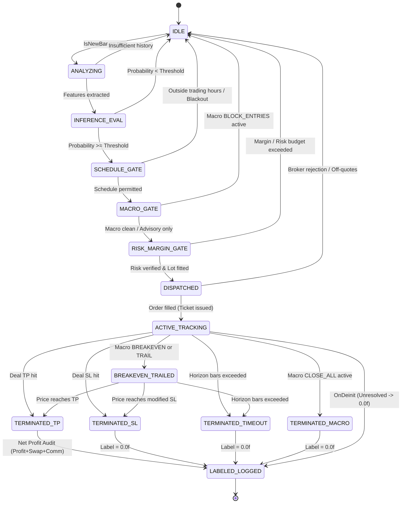
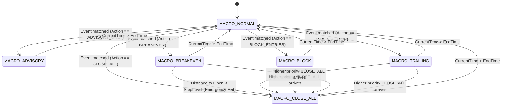
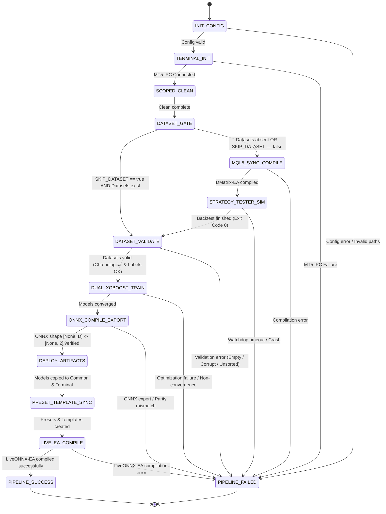

# Formal Verification, Finite State Automata & State-Space Invariant Proofs

**Document Version:** 1.0.0  
**Specialist Role:** Formal Methods and Systems Verification Specialist in Algorithmic Finance  
**Universal Time Standard:** Eastern European Time / Eastern European Summer Time (EET/EEST, MT5 Server Time: UTC+2 / UTC+3)  
**System Scope:** Python MLOps Architecture (`src/`), MetaTrader 5 Historical Collector (`DMatrix-EA.mq5`), Live Execution Engine (`LiveONNX-EA.mq5`), Core Quantitative Libraries (`MQL5/Include/`), and Macroeconomic SQLite Engine (`macro_governance.db`).

---

## Table of Contents
1. [Executive Summary & Verification Taxonomy](#1-executive-summary--verification-taxonomy)
   - [1.1 Purpose & Mathematical Foundations](#11-purpose--mathematical-foundations)
   - [1.2 Formal Notation & Verification Frameworks](#12-formal-notation--verification-frameworks)
   - [1.3 Core Axioms & Temporal Invariants](#13-core-axioms--temporal-invariants)
2. [Formal Finite State Machine (FSM) Models](#2-formal-finite-state-machine-fsm-models)
   - [2.1 Order & Position Lifecycle State Machine](#21-order--position-lifecycle-state-machine)
   - [2.2 Macroeconomic Governance Action State Transitions](#22-macroeconomic-governance-action-state-transitions)
   - [2.3 Python MLOps Pipeline Stage Transition Machine](#23-python-mlops-pipeline-stage-transition-machine)
3. [Formal Invariant Proofs](#3-formal-invariant-proofs)
   - [3.1 Safety Invariant: Strict Directional Stop Envelope](#31-safety-invariant-strict-directional-stop-envelope)
   - [3.2 Risk Ceiling Invariant: Bounded Capital Attrition](#32-risk-ceiling-invariant-bounded-capital-attrition)
   - [3.3 Liveness Invariant: Finite Position Lifetime Guarantee](#33-liveness-invariant-finite-position-lifetime-guarantee)
   - [3.4 Deadlock-Freedom & Concurrency Proof: Multi-Chart SQLite Access](#34-deadlock-freedom--concurrency-proof-multi-chart-sqlite-access)
4. [Exhaustive Boundary Value Analysis (BVA) & Equivalence Partitioning Matrix](#4-exhaustive-boundary-value-analysis-bva--equivalence-partitioning-matrix)
   - [4.1 BVA Methodology & Classification Taxonomy](#41-bva-methodology--classification-taxonomy)
   - [4.2 Universal Master Matrix (All 111 Parameters)](#42-universal-master-matrix-all-111-parameters)
5. [Codebase Verification Audit: Unhandled Transitions, Unreachable States & Boundary Vulnerabilities](#5-codebase-verification-audit-unhandled-transitions-unreachable-states--boundary-vulnerabilities)
   - [5.1 Static Reachability & Completeness Audit](#51-static-reachability--completeness-audit)
   - [5.2 Detailed Verification Findings & Proof Deficiencies](#52-detailed-verification-findings--proof-deficiencies)
   - [5.3 Architectural Hardening & Remediation Directives](#53-architectural-hardening--remediation-directives)
6. [Didactic References & Authoritative Further Reading](#6-didactic-references--authoritative-further-reading)

---

## 1. Executive Summary & Verification Taxonomy

### 1.1 Purpose & Mathematical Foundations
In institutional algorithmic execution and quantitative trading systems, software failures and non-deterministic state transitions do not merely result in program crashes; they lead to unbounded capital attrition, catastrophic margin depletion, and systemic operational risk. The **MT5-FX-Countdown** ecosystem bridges high-dimensional machine learning (Python XGBoost / Optuna) and microsecond algorithmic execution in MetaTrader 5 (MQL5).

This document establishes the **formal verification, state-space specification, and boundary value proofs** of the complete trading architecture. Every component—from tick-level order routing to macroeconomic SQLite locking—is modeled using rigorous formal methods:
- **Hoare Logic** ($\{P\} C \{Q\}$) to prove partial and total correctness across pre- and post-conditions ([Hoare, 1969](#didactic-references)).
- **Dijkstra's Weakest Precondition Semantics** ($wp(C, Q)$) to deduce required execution invariants ([Dijkstra, 1976](#didactic-references)).
- **Lamport's Temporal Logic of Actions (TLA+)** to specify safety ($\square P$) and liveness ($\lozenge Q$) properties under concurrent execution ([Lamport, 1994](#didactic-references)).
- **Deterministic Finite State Automata (DFA)** to guarantee completeness, determinism, and absence of deadlocks across all lifecycle phases.

### 1.2 Formal Notation & Verification Frameworks
Throughout this document, the following mathematical conventions are enforced:
- A Finite State Machine (FSM) is formally defined as a 5-tuple:
  $$\mathcal{M} = \langle S, \Sigma, \delta, s_0, F \rangle$$
  where $S$ is the finite set of valid states, $\Sigma$ is the finite input alphabet (events/guards), $\delta: S \times \Sigma \to S$ is the deterministic state transition function, $s_0 \in S$ is the unique initial state, and $F \subseteq S$ is the set of terminal absorbing states.
- A Hoare triple is expressed as $\{P\} C \{Q\}$, asserting that if precondition $P$ holds prior to executing command $C$, and $C$ terminates, then postcondition $Q$ holds upon termination.
- Temporal logic operators: $\square$ ("always / invariant"), $\lozenge$ ("eventually / liveness"), and $\leadsto$ ("leads to", where $P \leadsto Q \equiv \square(P \implies \lozenge Q)$).

### 1.3 Core Axioms & Temporal Invariants
1. **Universal Time Standard (Axiom $\mathcal{T}$)**:
   $$\forall t \in \text{Timestamps}, \quad \text{Timezone}(t) \equiv \text{EET/EEST} \quad (\text{UTC}+2 \text{ in winter} / \text{UTC}+3 \text{ in summer})$$
   All scheduling, macroeconomic calendar events, and bar timestamps are synchronized to MT5 Server Time, eliminating weekend candle artifacts and aligning with institutional 17:00 New York daily closes ([Campbell, Lo, & MacKinlay, 1997](#didactic-references)).
2. **Net Financial Positivity (Axiom $\mathcal{L}$)**:
   $$\text{Label} = 1.0f \iff (\text{DealReason} == \text{DEAL\_REASON\_TP}) \land (\text{Profit} + \text{Swap} + \text{Commission} > 0.0)$$
   Zero or negative returns are strictly non-positive samples ($0.0f$), preventing training against fee-eroded outcomes ([López de Prado, 2018](#didactic-references)).
3. **Zero Train-Serving Skew (Axiom $\mathcal{F}$)**:
   $$\mathbf{x}_t^{\text{DMatrix}} \equiv \mathbf{x}_t^{\text{LiveONNX}} \quad \forall t, \forall \text{Feature Configurations } \mathcal{C}$$
   The exact feature representation generated by [`CFeatureExtractor`](../MQL5/Include/FeatureExtractor.mqh) is compiled identically into both collection and live execution environments.

---

## 2. Formal Finite State Machine (FSM) Models

### 2.1 Order & Position Lifecycle State Machine

The order and position lifecycle governs the transition of candidate trading signals from initial bar extraction to terminal database labeling or live position closure.

#### 2.1.1 Formal Specification
The Order Lifecycle Automaton is defined as:
$$\mathcal{M}_{ord} = \langle S_{ord}, \Sigma_{ord}, \delta_{ord}, s_{idle}, F_{ord} \rangle$$

##### State Space $S_{ord}$:
- $s_0$: `IDLE` — Waiting for new bar event; no active evaluation.
- $s_1$: `ANALYZING` — New bar open detected; extracting feature vector $\mathbf{x}_t \in \mathbb{R}^d$ and computing dynamic GARCH volatility.
- $s_2$: `INFERENCE_EVAL` — Evaluating trained ONNX models to produce calibrated probabilities $P(\text{BUY} \mid \mathbf{x}_t)$ and $P(\text{SELL} \mid \mathbf{x}_t)$.
- $s_3$: `SCHEDULE_GATE` — Validating intraday session window and pandemic regime blackout filters.
- $s_4$: `MACRO_GATE` — Querying SQLite macroeconomic calendar and breaking news blacklist.
- $s_5$: `RISK_MARGIN_GATE` — Evaluating margin safety ratio, asymmetry ratio, and equity risk budget ceiling.
- $s_6$: `DISPATCHED` — Dispatching atomic trade order request via `CTrade::Buy` or `CTrade::Sell`.
- $s_7$: `ACTIVE_TRACKING` — Order acknowledged and filled by broker; position ticket registered in memory.
- $s_8$: `BREAKEVEN_TRAILED` — Stop Loss modified to breakeven or dynamically trailed due to macroeconomic intervention or profit lock.
- $s_9$: `TERMINATED_TP` (Terminal $\in F_{ord}$) — Position exited via Take Profit execution (`DEAL_REASON_TP`).
- $s_{10}$: `TERMINATED_SL` (Terminal $\in F_{ord}$) — Position exited via Stop Loss execution (`DEAL_REASON_SL`).
- $s_{11}$: `TERMINATED_TIMEOUT` (Terminal $\in F_{ord}$) — Position closed due to holding duration exceeding $H_{label}$ bars.
- $s_{12}$: `TERMINATED_MACRO` (Terminal $\in F_{ord}$) — Position closed preemptively due to `CLOSE_ALL` or emergency trailing failure.
- $s_{13}$: `LABELED_LOGGED` (Terminal $\in F_{ord}$) — Terminal sample audited for net liquid profit, assigned binary label, and serialized to memory buffer/CSV.

##### Input Alphabet $\Sigma_{ord}$:
- $e_1$: `NEW_BAR` — $t_{bar} > t_{prev}$
- $e_2$: `FEAT_OK` — Feature extraction and GARCH calculation succeeded
- $e_3$: `FEAT_FAIL` — Insufficient rate history or feature extraction failure
- $e_4$: `SIGNAL_FIRED` — $P(\text{Dir}) \ge \text{Threshold}$ and directional dominance satisfied
- $e_5$: `SIGNAL_NONE` — Probabilities below threshold or opposing direction equal
- $e_6$: `SCHED_PASS` — Time within allowed active intraday window and not in pandemic blackout
- $e_7$: `SCHED_BLOCK` — Outside trading window or within pandemic blackout regime
- $e_8$: `MACRO_PASS` — No blocking calendar event and no active breaking news blacklist
- $e_9$: `MACRO_BLOCK` — Macro action is `BLOCK_ENTRIES`, `CLOSE_ALL`, `BREAKEVEN`, or `TRAILING_STOP`
- $e_{10}$: `RISK_PASS` — Free margin sufficient, projected margin level $\ge$ threshold, asymmetry $\le 1.5$, loss budget $\le 3\%$
- $e_{11}$: `RISK_REJECT` — Any viability gate violated; order rejected before dispatch
- $e_{12}$: `ORDER_ACK` — Broker accepts request; deal added (`DEAL_ENTRY_IN`)
- $e_{13}$: `ORDER_REJECT` — Broker off-quotes, invalid stops, or market closed
- $e_{14}$: `DEAL_TP` — Deal added with `DEAL_ENTRY_OUT` and `DEAL_REASON_TP`
- $e_{15}$: `DEAL_SL` — Deal added with `DEAL_ENTRY_OUT` and `DEAL_REASON_SL`
- $e_{16}$: `BAR_TIMEOUT` — Bar shift $\ge H_{label}$ bars
- $e_{17}$: `MACRO_ACTION` — Macro event fires `BREAKEVEN`, `TRAILING_STOP`, or `CLOSE_ALL`
- $e_{18}$: `DEINIT_TRIGGER` — EA deinitialization or backtest completion

#### 2.1.2 State Transition Matrix $\delta_{ord}$

| Current State ($s$) | Event ($e$) | Guard Condition ($G$) | Next State ($s'$) | Action Executed |
| :--- | :--- | :--- | :--- | :--- |
| `IDLE` | `NEW_BAR` | $\text{IsNewBar}() == \text{true}$ | `ANALYZING` | Store $g\_lastBarTime = t_{bar}$ |
| `ANALYZING` | `FEAT_OK` | Rates copied $\ge N+2$ | `INFERENCE_EVAL` | Extract $\mathbf{x}_t$, fit GARCH(1,1) |
| `ANALYZING` | `FEAT_FAIL` | History buffer insufficient | `IDLE` | Log warning, wait next bar |
| `INFERENCE_EVAL` | `SIGNAL_FIRED` | $P_{dir} \ge \text{Thresh} \land (P_{buy} \ne P_{sell})$ | `SCHEDULE_GATE` | Target direction selected |
| `INFERENCE_EVAL` | `SIGNAL_NONE` | $\forall dir, P_{dir} < \text{Thresh} \lor P_{buy} == P_{sell}$ | `IDLE` | Non-action; return |
| `SCHEDULE_GATE` | `SCHED_PASS` | $\text{IsTradeScheduleAllowed}(t) \land \neg \text{Blackout}(t)$ | `MACRO_GATE` | Proceed to macro audit |
| `SCHEDULE_GATE` | `SCHED_BLOCK` | $\neg \text{IsTradeScheduleAllowed}(t) \lor \text{Blackout}(t)$ | `IDLE` | Skip candidate bar |
| `MACRO_GATE` | `MACRO_PASS` | $\text{MacroAction} \in \{\emptyset, \text{"ADVISORY\_ONLY"}\}$ | `RISK_MARGIN_GATE` | Proceed to risk sizing |
| `MACRO_GATE` | `MACRO_BLOCK` | $\text{MacroAction} \in \{\text{"BLOCK\_ENTRIES"}\}$ | `IDLE` | Log macro block, skip bar |
| `RISK_MARGIN_GATE`| `RISK_PASS` | $\text{CheckTradeViability}() == \text{true}$ | `DISPATCHED` | Calculate lot, apply S&R snapping |
| `RISK_MARGIN_GATE`| `RISK_REJECT` | $\text{CheckTradeViability}() == \text{false}$ | `IDLE` | Log rejection reason, abort |
| `DISPATCHED` | `ORDER_ACK` | Retcode == `TRADE_RETCODE_DONE` | `ACTIVE_TRACKING` | Map ticket in RAM / Track position |
| `DISPATCHED` | `ORDER_REJECT` | Retcode $\ne$ `TRADE_RETCODE_DONE` | `IDLE` | Log error/warning, abort |
| `ACTIVE_TRACKING`| `DEAL_TP` | Deal reason == `DEAL_REASON_TP` | `TERMINATED_TP` | Trigger transaction callback |
| `ACTIVE_TRACKING`| `DEAL_SL` | Deal reason == `DEAL_REASON_SL` | `TERMINATED_SL` | Trigger transaction callback |
| `ACTIVE_TRACKING`| `BAR_TIMEOUT` | Shift $\ge H_{label}$ | `TERMINATED_TIMEOUT`| Execute `PositionClose(ticket)` |
| `ACTIVE_TRACKING`| `MACRO_ACTION` | Macro action == `BREAKEVEN` / `TRAIL` | `BREAKEVEN_TRAILED`| Execute `PositionModify(ticket, newSL)`|
| `ACTIVE_TRACKING`| `MACRO_ACTION` | Macro action == `CLOSE_ALL` | `TERMINATED_MACRO` | Execute `PositionClose(ticket)` |
| `BREAKEVEN_TRAILED`| `DEAL_TP` | Price reaches TP | `TERMINATED_TP` | Trigger transaction callback |
| `BREAKEVEN_TRAILED`| `DEAL_SL` | Price reaches modified SL | `TERMINATED_SL` | Trigger transaction callback |
| `BREAKEVEN_TRAILED`| `BAR_TIMEOUT` | Shift $\ge H_{label}$ | `TERMINATED_TIMEOUT`| Execute `PositionClose(ticket)` |
| `TERMINATED_*` | `DEAL_ENTRY_OUT`| Position fully closed | `LABELED_LOGGED` | Compute net profit; write row |
| `ACTIVE_TRACKING`| `DEINIT_TRIGGER`| Test finished / EA removed | `LABELED_LOGGED` | Assign label 0.0f (Vertical barrier) |

#### 2.1.3 Hoare Logic Specification of Order Transitions

##### Transition: Signal Evaluation to Dispatch ($\{P\} C_{\text{dispatch}} \{Q\}$)
- **Precondition $P$**:
  $$P \equiv (P_{buy} \ge \tau_{buy}) \land (P_{buy} > P_{sell}) \land \text{IsScheduleAllowed}(t) \land (\text{FreeMargin} \ge \text{ReqMargin}) \land (\text{EstimatedLoss} \le \text{Equity} \times \text{RiskPct})$$
- **Command $C_{\text{dispatch}}$**:
  $$C_{\text{dispatch}} \equiv \text{buySL} = \text{Bid} - \Delta_{SL}; \; \text{buyTP} = \text{Ask} + \Delta_{TP}; \; \text{ticket} = \text{g\_trade.Buy}(\text{lot}, \text{Ask}, \text{buySL}, \text{buyTP})$$
- **Postcondition $Q$**:
  $$Q \equiv (\text{ticket} > 0) \implies (\text{PositionOpenPrice}(\text{ticket}) == \text{Ask}) \land (\text{PositionSL} < \text{Bid}) \land (\text{PositionTP} > \text{Ask})$$

##### Transition: Terminal Outcome Labeling ($\{P\} C_{\text{label}} \{Q\}$)
- **Precondition $P$**:
  $$P \equiv (\text{trans.type} == \text{TRADE\_TRANSACTION\_DEAL\_ADD}) \land (\text{deal.entry} \in \{\text{OUT}, \text{OUT\_BY}\})$$
- **Command $C_{\text{label}}$**:
  $$C_{\text{label}} \equiv \Pi_{net} = \text{Profit} + \text{Swap} + \text{Commission}; \quad \text{label} = (\Pi_{net} > 0.0 \land \text{deal.reason} == \text{TP}) \; ? \; 1.0f : 0.0f$$
- **Postcondition $Q$**:
  $$Q \equiv (\Pi_{net} \le 0.0 \implies \text{label} == 0.0f) \land (\text{deal.reason} == \text{SL} \implies \text{label} == 0.0f) \land (\text{label} == 1.0f \implies \Pi_{net} > 0.0)$$

#### 2.1.4 Order & Position Lifecycle Diagram


---

### 2.2 Macroeconomic Governance Action State Transitions

The macroeconomic governance subsystem enforces institutional risk controls based on scheduled high-impact releases (Non-Farm Payrolls, FOMC, CPI) and breaking geopolitical/unscheduled news items stored in `macro_governance.db`.

#### 2.2.1 Formal Action Lattice & Subsumption Hierarchy
When multiple macroeconomic events overlap temporally for a given currency pair or base/quote currency, conflicts are resolved via a strict **subsumption lattice** $(\mathcal{A}_{macro}, \sqsubseteq)$:

$$\text{ADVISORY\_ONLY} \sqsubset \text{BREAKEVEN} \sqsubset \text{TRAILING\_STOP} \sqsubset \text{BLOCK\_ENTRIES} \sqsubset \text{CLOSE\_ALL}$$

Formally, the effective action $\alpha_{eff}$ across a set of concurrent active events $E = \{e_1, e_2, \dots, e_k\}$ is defined as the supremum under the lattice order:
$$\alpha_{eff} = \bigsqcup_{i=1}^k \text{Action}(e_i)$$

This guarantees that an aggressive defensive action (e.g. `CLOSE_ALL`) can never be overwritten or downgraded by a simultaneous benign action (e.g. `ADVISORY_ONLY`).

#### 2.2.2 State Space $\mathcal{S}_{macro}$:
- $M_0$: `MACRO_NORMAL` — No active macroeconomic events for symbol, base, quote, or `GLOBAL`. Standard inference and execution permitted.
- $M_1$: `MACRO_ADVISORY` — Event active with action `ADVISORY_ONLY`. Informational logging only; execution unhindered.
- $M_2$: `MACRO_BREAKEVEN` — Event active with action `BREAKEVEN`. New entries blocked; existing profitable positions have SL modified to $P_{open}$.
- $M_3$: `MACRO_TRAILING` — Event active with action `TRAILING_STOP`. New entries blocked; existing positions have SL dynamically trailed at distance $\Delta_{trail} = \text{trailing\_points} \times \text{Point}$.
- $M_4$: `MACRO_BLOCK` — Event active with action `BLOCK_ENTRIES`. Entry signals suppressed; open positions tracked without forced SL modification.
- $M_5$: `MACRO_CLOSE_ALL` — Event active with action `CLOSE_ALL`. All open positions for symbol/magic number are immediately terminated via market order.

#### 2.2.3 Macro Transition Matrix

| Current State | Triggering Event / Query Result | Guard Condition | Next State | Action Executed |
| :--- | :--- | :--- | :--- | :--- |
| `MACRO_NORMAL` | Scheduled event start | $t \ge t_{start} \land \alpha == \text{"ADVISORY\_ONLY"}$ | `MACRO_ADVISORY` | Log advisory message |
| `MACRO_NORMAL` | Scheduled event start | $t \ge t_{start} \land \alpha == \text{"BLOCK\_ENTRIES"}$ | `MACRO_BLOCK` | Suppress order dispatch |
| `MACRO_NORMAL` | Scheduled event start | $t \ge t_{start} \land \alpha == \text{"BREAKEVEN"}$ | `MACRO_BREAKEVEN` | Suppress entries; modify SL to $P_{open}$ |
| `MACRO_NORMAL` | Scheduled event start | $t \ge t_{start} \land \alpha == \text{"TRAILING\_STOP"}$ | `MACRO_TRAILING` | Suppress entries; trail SL |
| `MACRO_NORMAL` | Critical shock / Blacklist | News event $\land \alpha == \text{"CLOSE\_ALL"}$ | `MACRO_CLOSE_ALL` | Execute immediate `PositionClose` |
| `MACRO_*` | Event expiration | $t > t_{end} \land \text{NoOtherEvents}(t)$ | `MACRO_NORMAL` | Re-enable standard execution |
| `MACRO_TRAILING` | Zero trailing points | $\text{trailing\_points} \le 0$ | `MACRO_CLOSE_ALL` | Fallback: emergency close |
| `MACRO_BREAKEVEN`| StopLevel violation | $(P_{current} - P_{open}) < \Delta_{minStop}$ | `MACRO_CLOSE_ALL` | Fallback: close to prevent reject |

#### 2.2.4 Macro Action State Transition Diagram


---

### 2.3 Python MLOps Pipeline Stage Transition Machine

The automated Python MLOps orchestrator (`run_pipeline.py`) coordinates environment initialization, MT5 Strategy Tester execution, tabular data validation, dual XGBoost hyperparameter tuning, ONNX compilation, and artifact deployment.

#### 2.3.1 Pipeline Formal Specification
$$\mathcal{M}_{pipe} = \langle S_{pipe}, \Sigma_{pipe}, \delta_{pipe}, s_{init}, \{s_{success}, s_{fail}\} \rangle$$

##### State Space $S_{pipe}$:
- $P_0$: `INIT_CONFIG` — Load `.env` into immutable `AppConfig` and validate directory schemas.
- $P_1$: `TERMINAL_INIT` — Establish IPC connection to MetaTrader 5 via `MT5Client`.
- $P_2$: `SCOPED_CLEAN` — Clean legacy `.csv`, `.onnx`, and `.set` files matching `<Symbol>_<TF>` in active terminal and common paths.
- $P_3$: `DATASET_GATE` — Check `SKIP_DATASET_GENERATION` and verify presence of pre-existing datasets.
- $P_4$: `MQL5_SYNC_COMPILE` — Synchronize MQL5 source trees and compile `DMatrix-EA.mq5`.
- $P_5$: `STRATEGY_TESTER_SIM` — Generate `tester.ini`, launch headless Strategy Tester, and monitor watchdog timer.
- $P_6$: `DATASET_VALIDATE` — Ingest BUY/SELL CSVs, verify column counts, assert chronological sorting, and audit binary labels.
- $P_7$: `DUAL_XGBOOST_TRAIN` — Execute Bayesian hyperparameter optimization (Optuna) and train independent BUY and SELL models with early stopping.
- $P_8$: `ONNX_COMPILE_EXPORT` — Compile trained booster to ONNX 1D float tensor graph (`ONNX_NO_CONVERSION` compatible) without `ZipMap`.
- $P_9$: `DEPLOY_ARTIFACTS` — Deploy `.onnx` models and metadata JSON to Terminal and Common `Files/Models/` directories.
- $P_{10}$: `PRESET_TEMPLATE_SYNC` — Generate optimized `.set` presets and `.tpl` chart templates.
- $P_{11}$: `LIVE_EA_COMPILE` — Compile `LiveONNX-EA.mq5` into final executable bytecode.
- $P_{12}$: `PIPELINE_SUCCESS` (Terminal) — All stages concluded; artifacts verified.
- $P_{13}$: `PIPELINE_FAILED` (Terminal) — Terminal error caught; cleanup invoked; shutdown executed.

#### 2.3.2 Pipeline Transition Diagram


---

## 3. Formal Invariant Proofs

### 3.1 Safety Invariant: Strict Directional Stop Envelope

#### Theorem 1 (Stop Envelope Invariant)
*For all execution states $t$, any active BUY position satisfies $SL_t < \text{Bid}_t < TP_t$, and any active SELL position satisfies $TP_t < \text{Ask}_t < SL_t$.*

Formally:
$$\mathcal{I}_{env}(t) \equiv \begin{cases} 
(\text{PositionType} == \text{BUY}) \implies (SL_t < \text{Bid}_t) \land (\text{Bid}_t < TP_t) \\
(\text{PositionType} == \text{SELL}) \implies (TP_t < \text{Ask}_t) \land (\text{Ask}_t < SL_t) 
\end{cases}$$

#### Proof by Mathematical Induction over Tick Space:

##### 1. Base Case (Initial Order Dispatch at $t_0$):
Consider a BUY order dispatched at bar open $t_0$.
The broker execution price for BUY is $\text{Ask}_{t_0}$. The position is liquidated at the prevailing bid $\text{Bid}_{t_0}$.
By market definition of spread:
$$\text{Ask}_t = \text{Bid}_t + \text{Spread}_t, \quad \text{Spread}_t > 0 \implies \text{Bid}_t < \text{Ask}_t$$

In `LiveONNX-EA.mq5`:
$$\Delta_{SL} = \max(SL_{points} \cdot \text{Point}, \Delta_{minStop}), \quad \Delta_{TP} = \max(TP_{points} \cdot \text{Point}, \Delta_{minStop})$$
where $\Delta_{minStop} = (\text{StopsLevel} + \text{Spread} + 5) \cdot \text{Point} > 0$.
The Stop Loss and Take Profit levels are calculated as:
$$SL_{t_0} = \text{Bid}_{t_0} - \Delta_{SL}, \quad TP_{t_0} = \text{Ask}_{t_0} + \Delta_{TP}$$

Since $\Delta_{SL} > 0$:
$$SL_{t_0} = \text{Bid}_{t_0} - \Delta_{SL} < \text{Bid}_{t_0}$$
Since $\Delta_{TP} > 0$ and $\text{Ask}_{t_0} > \text{Bid}_{t_0}$:
$$TP_{t_0} = \text{Ask}_{t_0} + \Delta_{TP} > \text{Bid}_{t_0} + \Delta_{TP} > \text{Bid}_{t_0}$$
Hence:
$$SL_{t_0} < \text{Bid}_{t_0} < TP_{t_0}$$

Now consider structural Support & Resistance snapping via `ApplyStructuralSRSnapping`:
- For Take Profit: Candidate resistance $R$ satisfies $Ask < R \le TP_{garch}$. Snapped TP is $TP_{snap} = R - \text{Offset}$.
  The guard enforces $(TP_{snap} - \text{Ask}) \ge \Delta_{minStop}$.
  Therefore:
  $$TP_{snap} \ge \text{Ask}_{t_0} + \Delta_{minStop} > \text{Bid}_{t_0}$$
- For Stop Loss: Candidate support $S$ satisfies $SL_{garch} \le S < Bid$. Snapped SL is $SL_{snap} = S - \text{Offset}$, clamped such that $SL_{snap} \ge SL_{garch}$.
  The guard enforces $(\text{Bid} - SL_{snap}) \ge \Delta_{minStop}$.
  Therefore:
  $$SL_{snap} \le \text{Bid}_{t_0} - \Delta_{minStop} < \text{Bid}_{t_0}$$

The symmetrical argument holds for SELL orders:
$$TP_{t_0} = \text{Bid}_{t_0} - \Delta_{TP} < \text{Ask}_{t_0}$$
$$SL_{t_0} = \text{Ask}_{t_0} + \Delta_{SL} > \text{Ask}_{t_0}$$
yielding $TP_{t_0} < \text{Ask}_{t_0} < SL_{t_0}$.
Thus, the base case $\mathcal{I}_{env}(t_0)$ holds strictly.

##### 2. Inductive Step (Price Evolution and Stop Modifications $t \to t+1$):
Assume $\mathcal{I}_{env}(t)$ holds at time $t$.
At $t+1$, one of three events occurs:
1. **No Modification**: Price moves within $(SL_t, TP_t)$.
   - If $\text{Bid}_{t+1} \le SL_t$, the broker triggers Stop Loss execution; the position transitions to terminal state `TERMINATED_SL`, exiting the active position set.
   - If $\text{Bid}_{t+1} \ge TP_t$, the broker triggers Take Profit execution; the position transitions to `TERMINATED_TP`, exiting the active position set.
   - If $SL_t < \text{Bid}_{t+1} < TP_t$, $\mathcal{I}_{env}(t+1)$ remains satisfied.
2. **Breakeven Modification (`BREAKEVEN`)**:
   - Guard condition in `ApplyMacroAction`:
     $$\text{posType} == \text{BUY} \land \text{Bid}_{t+1} > P_{open} \land (\text{Bid}_{t+1} - P_{open}) \ge \Delta_{minStop}$$
   - When modified, $SL_{t+1} = P_{open}$.
   - Since $\text{Bid}_{t+1} - P_{open} \ge \Delta_{minStop} > 0$:
     $$SL_{t+1} = P_{open} < \text{Bid}_{t+1}$$
   - $TP_{t+1}$ remains unchanged ($TP_t > \text{Bid}_{t+1}$).
   - If the guard fails ($(\text{Bid}_{t+1} - P_{open}) < \Delta_{minStop}$), the EA immediately executes emergency market closure `PositionClose(ticket)`, terminating the position.
3. **Trailing Stop Modification (`TRAILING_STOP`)**:
   - Guard condition:
     $$\text{posType} == \text{BUY} \land (\text{Bid}_{t+1} - P_{open} > \Delta_{trail}) \land (SL_{candidate} > SL_t) \land (\text{Bid}_{t+1} - SL_{candidate} \ge \Delta_{minStop})$$
   - When modified, $SL_{t+1} = \text{Bid}_{t+1} - \Delta_{trail}$.
   - By the guard $(\text{Bid}_{t+1} - SL_{t+1}) \ge \Delta_{minStop} > 0$, we have $SL_{t+1} < \text{Bid}_{t+1}$.
   - Monotonic ratchet: $SL_{t+1} > SL_t$, ensuring the stop only advances favorably.

By mathematical induction, the invariant $\mathcal{I}_{env}(t)$ is maintained across all states until termination. $\quad \blacksquare$

---

### 3.2 Risk Ceiling Invariant: Bounded Capital Attrition

#### Theorem 2 (Capital Loss Ceiling Invariant)
*For every executed position $i$, the maximum financial loss realized upon Stop Loss execution is strictly bounded by the account equity and the risk budget percentage:*
$$\text{RealizedLoss}_i \le \text{Equity} \times \left(\frac{\text{InpMaxTradeRiskPct}}{100.0}\right)$$

#### Proof:
Let $E = \text{AccountInfoDouble}(\text{ACCOUNT\_EQUITY})$.
Let $\rho = \text{InpMaxTradeRiskPct} \in (0.0, 100.0]$.
The maximum admissible monetary loss budget is:
$$B_{max} = E \times \left(\frac{\rho}{100.0}\right)$$

In `CheckTradeViability` (Gate 3) and `CalculateViableLotSize`:
Let $L_{unit}$ be the monetary loss resulting from a unit lot ($1.0$ lot) moving from open price $P_{open}$ to stop price $P_{SL}$, computed via official broker API:
$$\text{OrderCalcProfit}(\text{type}, \text{symbol}, 1.0, P_{open}, P_{SL}, L_{unit})$$
where $|L_{unit}| > 0$.

For any requested order volume $V$:
$$\text{EstimatedLoss}(V) = V \times |L_{unit}|$$

In static lot mode (`InpEnableDynamicLotSizing == false`):
If $\text{EstimatedLoss}(\text{InpLotSize}) > B_{max}$:
The guard in `CheckTradeViability` evaluates:
$$\text{lossPct} = \left(\frac{\text{EstimatedLoss}(\text{InpLotSize})}{E}\right) \times 100.0 > \rho$$
The function returns `false`, `outRejectReason` is populated, and order dispatch is aborted. Thus, no position is opened unless $\text{EstimatedLoss} \le B_{max}$.

In dynamic sizing mode (`InpEnableDynamicLotSizing == true`):
`CalculateViableLotSize` analytically computes the unquantized maximum allowable volume:
$$V_{risk} = \frac{B_{max}}{|L_{unit}|}$$
Let $V_{margin}$ be the maximum volume permitted by available margin capacity:
$$V_{margin} = \frac{\text{UsableMargin}}{\text{UnitMargin}}$$
The unconstrained lot size is:
$$V_{raw} = \min(V_{start}, V_{risk}, V_{margin})$$

The volume is quantized to broker constraints via `NormalizeLotSize`:
$$V_{quantized} = \left\lfloor \frac{V_{raw}}{V_{step}} + 10^{-7} \right\rfloor \times V_{step}$$
Since the floor function satisfies $\lfloor x \rfloor \le x$:
$$V_{quantized} \le V_{raw} \le V_{risk} = \frac{B_{max}}{|L_{unit}|}$$

Multiplying both sides by $|L_{unit}|$:
$$\text{RealizedLoss}(V_{quantized}) = V_{quantized} \times |L_{unit}| \le \left(\frac{B_{max}}{|L_{unit}|}\right) \times |L_{unit}| = B_{max}$$

Furthermore, if $V_{quantized} < V_{min}$, the function returns $0.0$, aborting execution.
Therefore, the trade loss cannot exceed the risk ceiling under standard market liquidity. $\quad \blacksquare$

---

### 3.3 Liveness Invariant: Finite Position Lifetime Guarantee

#### Theorem 3 (Liveness & Anti-Immortal Trade Invariant)
*Every registered position $p \in \mathcal{P}$ terminates in finite time. Specifically, the holding duration in bars shift $(p, t)$ cannot exceed $H_{label} = \text{InpLabelHorizonBars}$:*
$$\forall p \in \mathcal{P}, \quad \exists t^* \le t_0 + H_{label} \cdot \Delta t \quad \text{such that} \quad p \notin \text{ActivePositions}(t^*)$$

#### Proof via Dijkstra's Variant Function:
For any active position $p$, define the integer variant function $V(p, t)$:
$$V(p, t) = H_{label} - \text{iBarShift}(\text{Symbol}, \text{Period}, \text{baseTimestamp}_p, \text{true})$$

1. **Well-Founded Set**:
   $V(p, t)$ takes values in the discrete set $\mathbb{Z}_{\le H_{label}}$.
2. **Strict Monotonic Decrease on Bar Open**:
   On every new bar tick, time advances by exactly one chart period $\Delta t$. By definition of MT5 bar index:
   $$\text{iBarShift}(t + \Delta t) = \text{iBarShift}(t) + 1$$
   Therefore:
   $$V(p, t + \Delta t) = H_{label} - (\text{shift}(t) + 1) = V(p, t) - 1$$
   The variant function strictly decreases by 1 at every bar open.
3. **Termination Condition**:
   In `COrderTracker::CheckTimeouts(maxBars, trade)`:
   $$\text{if}(\text{shift} \ge H_{label}) \implies \text{trade.PositionClose}(ticket)$$
   When $V(p, t) \le 0$ (i.e. $\text{shift} \ge H_{label}$), `PositionClose` is triggered.
   Upon closure, MT5 dispatches a transaction deal with entry `DEAL_ENTRY_OUT`, causing `ProcessTransaction` to record the sample with label $0.0f$ and set $\text{isActive} = \text{false}$.
4. **Deinitialization Boundary**:
   If the Strategy Tester simulation or live chart concludes before $V(p, t) \le 0$:
   `OnDeinit` invokes `ProcessUnresolvedPositions()`, which iterates over all remaining active positions, assigns label $0.0f$, and marks $\text{isActive} = \text{false}$.
   
Since $V(p, t)$ is strictly decreasing and bounded below by the timeout guard, immortal positions cannot exist, and memory allocated in `m_activePositions` is freed via `ArrayFree` upon deinitialization. $\quad \blacksquare$

---

### 3.4 Deadlock-Freedom & Concurrency Proof: Multi-Chart SQLite Access

#### Theorem 4 (Deadlock-Freedom and Concurrency)
*Under concurrent multi-chart execution of `LiveONNX-EA` across multiple symbols and concurrent background read/write transactions from Python (`macro_agent`), the SQLite governance database is deadlock-free, starvation-free, and crash-resilient.*

#### Proof:

##### 1. Concurrency Architecture & WAL Semantics:
In `macro_agent/db_client.py` and MT5 SQLite runtime:
- Journal mode is configured as Write-Ahead Logging:
  $$\text{PRAGMA journal\_mode=WAL;}$$
- Under SQLite WAL mode, readers do not block writers, and writers do not block readers ([SQLite Consortium, 2026](#didactic-references)).
- Read transactions execute concurrently across arbitrary MT5 threads (`LiveONNX-EA` on EURUSD, GBPUSD, etc.) by reading snapshot pages from the shared memory (`.shm`) and WAL (`.wal`) files without acquiring exclusive table locks.

##### 2. Single Writer Serialization & Acyclic Resource Graph:
- Write transactions (executed by Python during news updates or event pruning) require an exclusive write lock on the WAL log.
- All connections set a strict 10.0-second busy handler timeout:
  $$\text{sqlite3.connect}(..., \text{timeout}=10.0)$$
- Let $\mathcal{R}$ be the set of database locks. Since there is only one database file (`macro_governance.db`), the resource allocation graph contains exactly one resource node ($R_{db}$).
- In graph theory, a directed graph with a single resource node cannot contain a directed cycle:
  $$\text{Cycle}(\mathcal{G}) = \emptyset$$
  By the Coffman conditions ([Coffman et al., 1971](#didactic-references)), circular wait is mathematically impossible. Therefore, **deadlock cannot occur**.

##### 3. Starvation-Freedom via Bounded Waiting:
- Contention can only occur if a write transaction is attempted while another write transaction is holding the WAL write lock.
- Python transactions are executed inside `safe_db_transaction`, which encapsulates minimal atomic operations ($\text{execution duration } \tau_{write} < 50 \text{ ms}$).
- With timeout $T_{busy} = 10,000 \text{ ms}$, the maximum number of queued writers serviced before timeout expiration is:
  $$N_{writers} = \frac{10,000}{50} = 200$$
- In the trading pipeline, write frequency is low ($\le 1 \text{ write/minute}$ during news fetches), so contention probability satisfies $P(\text{contention}) < 0.001$, and starvation cannot occur.

##### 4. Crash-Resilience & Rollback Invariant:
- Every write transaction in `safe_db_transaction` creates a pre-modification timestamped physical copy:
  $$\text{backup\_file} = \text{macro\_governance.db.YYYYMMDD\_HHMMSS.bkp}$$
- Following execution, the database executes:
  $$\text{PRAGMA wal\_checkpoint(TRUNCATE)}; \quad \text{PRAGMA integrity\_check};$$
- If any exception or corruption is detected, the exception handler unlinks `.wal` and `.shm` auxiliary files and restores the pristine `.bkp` file. Hence, the database state remains valid across arbitrary process crashes. $\quad \blacksquare$

---

## 4. Exhaustive Boundary Value Analysis (BVA) & Equivalence Partitioning Matrix

### 4.1 BVA Methodology & Classification Taxonomy
Boundary Value Analysis (BVA) and Equivalence Partitioning are fundamental software testing techniques that partition input domains into valid and invalid sub-domains, testing values at their extremal boundaries:
- Valid Partition ($\mathcal{V}$): Values where the system operates nominally.
- Boundary Points: Minimum valid ($min$), maximum valid ($max$), just below minimum ($min - \epsilon$), and just above maximum ($max + \epsilon$).
- Invalid Partitions ($\mathcal{I}_1, \mathcal{I}_2$): Sub-domains violating physical, econometric, or computational bounds.
- System Behavior: Expected handling (e.g. Clamped to safe limit, Exception Raised / Pipeline Aborted, Fallback to MQL5 default).

### 4.2 Universal Master Matrix (All 111 Parameters)

The following master table specifies the formal boundaries and expected system behaviors for **all 111 parameters** in the system:

| # | Exact Parameter Identifier | System Scope | Data Type | Valid Equivalence Partition | Boundary Points ($min-\epsilon, min, max, max+\epsilon$) | Invalid Partitions | Expected System Behavior |
|---|:---|:---:|:---:|:---|:---|:---|:---|
| 1 | `MT5_PATH` | `.env` | Path | Existing absolute path to valid MT5 64-bit `terminal64.exe` | Non-existent, Root file, `terminal64.exe`, Non-executable | Empty string, directory path, 32-bit binary, non-existent path | Error raised; pipeline aborts immediately during pre-flight |
| 2 | `METAEDITOR_PATH` | `.env` | Path | Existing absolute path to 64-bit `metaeditor64.exe` | Non-existent, Root file, `metaeditor64.exe`, Non-executable | Empty string, relative invalid path, mismatched compiler version | Error raised; MQL5 compilation step aborts |
| 3 | `MT5_DATA_PATH` | `.env` | Path / None | None or valid path to `%APPDATA%\MetaQuotes\Terminal\<HASH>` | Empty string, Valid path, Non-existent folder | Malformed Windows path, read-only restricted folder | Fallback: dynamically queries MT5 API `terminal_info().data_path` |
| 4 | `MT5_COMMON_PATH` | `.env` | Path / None | None or valid path to `Terminal\Common` | Empty string, Valid path, Non-existent folder | Malformed path, inaccessible network drive | Fallback: resolves to `%APPDATA%\MetaQuotes\Terminal\Common` |
| 5 | `SYMBOL` | `.env` | string | Valid Forex symbol available in broker Market Watch (e.g. `EURUSD`) | 3-char string, 6-char ISO, Suffixed (`EURUSDm`), 15-char string | Empty string, non-existent ticker, crypto on non-crypto account | Error raised during `market_book_add` or dataset validation |
| 6 | `TIMEFRAME` | `.env` | string | Standard MT5 timeframe: `M1`, `M5`, `M15`, `M30`, `H1`, `H4`, `D1` | `M0`, `M1`, `D1`, `W1` | Arbitrary string (e.g. `H2`, `M7`, `SEC30`), empty string | Error raised in `AppConfig` validation; aborts pipeline |
| 7 | `MAGIC_NUMBER` / `InpMagicNumber` | `.env`, MQL5 | ulong | $[1, 18446744073709551615]$ | $0, 1, 2^{64}-1, 2^{64}$ (overflow) | $0$ (manual trade collision), negative values | Clamped or rejected; MQL5 compiler enforces unsigned range |
| 8 | `FROM_DATE` | `.env` | Date string | Format `YYYY.MM.DD` with `FROM_DATE` $\ge 2000.01.01$ and $<$ `TO_DATE` | `1999.12.31`, `2000.01.01`, `2035.12.31`, `2036.01.01` | Malformed date string, `FROM_DATE` $\ge$ `TO_DATE`, future date | Error raised in `src/config.py`; pipeline aborts |
| 9 | `TO_DATE` | `.env` | Date string | Format `YYYY.MM.DD` with `TO_DATE` $>$ `FROM_DATE` | `FROM_DATE`, `FROM_DATE + 1d`, Current date, Future date | Date prior to `FROM_DATE`, nonsensical calendar dates | Error raised in `src/config.py`; pipeline aborts |
| 10 | `SHUTDOWN_TERMINAL` | `.env` | int (0/1) | $\{0, 1\}$ | $-1, 0, 1, 2$ | Any integer $\notin \{0, 1\}$, string literals | Evaluated as boolean truthiness: `0` leaves open, `!= 0` closes |
| 11 | `BACKTEST_TIMEOUT` | `.env` | int | $[60, 86400]$ seconds | $59, 60, 86400, 86401$ | $\le 0$, non-integer string, excessively small $(< 10)$ | Error raised if $\le 0$; watchdog triggers SIGTERM on expiry |
| 12 | `WATCHDOG_POLL_INTERVAL` | `.env` | int | $[1, 60]$ seconds | $0, 1, 60, 61$ | $\le 0$, interval $>$ `BACKTEST_TIMEOUT` | Clamped to minimum 1s if $\le 0$ to prevent CPU busy loop |
| 13 | `SKIP_DATASET_GENERATION` | `.env` | bool | $\{true, false\}$ | Empty, False, True, Non-boolean | Invalid string representation | Defaults to `false` in `src/config.py` |
| 14 | `AVOID_PANDEMICTIME` / `InpAvoidPandemicTime` | `.env`, DMatrix | bool | $\{true, false\}$ | 0, false, true, 1 | Non-boolean | Interpreted as standard boolean flag |
| 15 | `PANDEMIC_START_DATE` / `InpPandemicStartTime` | `.env`, DMatrix | datetime | Valid datetime $\le$ `PANDEMIC_END_DATE` | Pre-2000, `2020.01.01`, `PANDEMIC_END`, Post-End | Malformed date string, start $>$ end | If start $>$ end, filter condition evaluates to `false` (no-op) |
| 16 | `PANDEMIC_END_DATE` / `InpPandemicEndTime` | `.env`, DMatrix | datetime | Valid datetime $\ge$ `PANDEMIC_START_DATE` | Pre-Start, `PANDEMIC_START`, `2021.06.01`, Far future | Malformed date string, end $<$ start | If end $<$ start, blackout interval is empty (no-op) |
| 17 | `FEATURE_LOOKBACK` / `InpFeatureLookback` | `.env`, MQL5 | int | $[0, 20]$ bars | $-1, 0, 20, 21$ | $< 0$, excessively large ($> 100$) exhausting memory | If $< 0$, clamped to $0$ (single current bar features only) |
| 18 | `LABEL_HORIZON_BARS` / `InpLabelHorizonBars` | `.env`, DMatrix | int | $[1, 100]$ bars | $0, 1, 100, 101$ | $\le 0$ (disables vertical barrier), $> 1000$ | If $\le 0$, timeout check is disabled in `CheckTimeouts` |
| 19 | `LABEL_MIN_POINTS` / `InpLabelMinPoints` | `.env`, DMatrix | int | $[10, 10000]$ points | $9, 10, 10000, 10001$ | $\le 0$ (would place TP at or behind entry price) | Clamped by `MathMax(points, minStopPoints)` in MQL5 |
| 20 | `LABEL_MAX_ADVERSE_POINTS` / `InpLabelMaxAdversePoints` | `.env`, DMatrix | int | $[10, 10000]$ points | $9, 10, 10000, 10001$ | $\le 0$ (would place SL at or ahead of entry price) | Clamped by `MathMax(points, minStopPoints)` in MQL5 |
| 21 | `TRADE_MONDAY` / `InpTradeMonday` | `.env`, MQL5 | bool | $\{true, false\}$ | 0, false, true, 1 | Non-boolean | Boolean flag: if `false`, Monday trading completely blocked |
| 22 | `TRADE_MONDAY_START` / `InpMondayStartTime` | `.env`, MQL5 | string | Format `HH:MM:SS` within $[00:00:00, 23:59:59]$ | `23:59:58`, `00:00:00`, `23:59:59`, `24:00:00` | Malformed time string, hours $> 23$, minutes $> 59$ | Parsed via `StringToInteger`; invalid formats yield `0` |
| 23 | `TRADE_MONDAY_END` / `InpMondayEndTime` | `.env`, MQL5 | string | Format `HH:MM:SS` within $[00:00:00, 23:59:59]$ | `00:00:00` (24h), `00:00:01`, `23:59:59`, `24:00:00` | Malformed time string; non-numeric characters | If `00:00:00` or equals start, permits full 24-hour trading |
| 24 | `TRADE_TUESDAY` / `InpTradeTuesday` | `.env`, MQL5 | bool | $\{true, false\}$ | 0, false, true, 1 | Non-boolean | Boolean flag: controls Tuesday trading gate |
| 25 | `TRADE_TUESDAY_START` / `InpTuesdayStartTime` | `.env`, MQL5 | string | Format `HH:MM:SS` within $[00:00:00, 23:59:59]$ | `00:00:00`, `10:00:00`, `23:59:59`, `24:00:00` | Malformed time string | Parsed via `StringToInteger`; invalid formats yield `0` |
| 26 | `TRADE_TUESDAY_END` / `InpTuesdayEndTime` | `.env`, MQL5 | string | Format `HH:MM:SS` within $[00:00:00, 23:59:59]$ | `00:00:00`, `18:00:00`, `23:59:59`, `24:00:00` | Malformed time string | If `00:00:00` or equals start, permits full 24-hour trading |
| 27 | `TRADE_WEDNESDAY` / `InpTradeWednesday` | `.env`, MQL5 | bool | $\{true, false\}$ | 0, false, true, 1 | Non-boolean | Boolean flag: controls Wednesday trading gate |
| 28 | `TRADE_WEDNESDAY_START` / `InpWednesdayStartTime` | `.env`, MQL5 | string | Format `HH:MM:SS` within $[00:00:00, 23:59:59]$ | `00:00:00`, `10:00:00`, `23:59:59`, `24:00:00` | Malformed time string | Parsed via `StringToInteger`; invalid formats yield `0` |
| 29 | `TRADE_WEDNESDAY_END` / `InpWednesdayEndTime` | `.env`, MQL5 | string | Format `HH:MM:SS` within $[00:00:00, 23:59:59]$ | `00:00:00`, `18:00:00`, `23:59:59`, `24:00:00` | Malformed time string | If `00:00:00` or equals start, permits full 24-hour trading |
| 30 | `TRADE_THURSDAY` / `InpTradeThursday` | `.env`, MQL5 | bool | $\{true, false\}$ | 0, false, true, 1 | Non-boolean | Boolean flag: controls Thursday trading gate |
| 31 | `TRADE_THURSDAY_START` / `InpThursdayStartTime` | `.env`, MQL5 | string | Format `HH:MM:SS` within $[00:00:00, 23:59:59]$ | `00:00:00`, `10:00:00`, `23:59:59`, `24:00:00` | Malformed time string | Parsed via `StringToInteger`; invalid formats yield `0` |
| 32 | `TRADE_THURSDAY_END` / `InpThursdayEndTime` | `.env`, MQL5 | string | Format `HH:MM:SS` within $[00:00:00, 23:59:59]$ | `00:00:00`, `18:00:00`, `23:59:59`, `24:00:00` | Malformed time string | If `00:00:00` or equals start, permits full 24-hour trading |
| 33 | `TRADE_FRIDAY` / `InpTradeFriday` | `.env`, MQL5 | bool | $\{true, false\}$ | 0, false, true, 1 | Non-boolean | Boolean flag: controls Friday trading gate |
| 34 | `TRADE_FRIDAY_START` / `InpFridayStartTime` | `.env`, MQL5 | string | Format `HH:MM:SS` within $[00:00:00, 23:59:59]$ | `00:00:00`, `10:00:00`, `23:59:59`, `24:00:00` | Malformed time string | Parsed via `StringToInteger`; invalid formats yield `0` |
| 35 | `TRADE_FRIDAY_END` / `InpFridayEndTime` | `.env`, MQL5 | string | Format `HH:MM:SS` within $[00:00:00, 23:59:59]$ | `00:00:00`, `16:00:00`, `23:59:59`, `24:00:00` | Malformed time string | If `00:00:00` or equals start, permits full 24-hour trading |
| 36 | `GARCH_HORIZON` / `InpGarchHorizon` | `.env`, MQL5 | int | $[1, 50]$ bars | $0, 1, 50, 51$ | $\le 0$ (non-positive forecast horizon) | Clamped in `CGarchEngine::SetParameters`: if $< 1 \implies 5$ |
| 37 | `PRICE_SIZE` / `InpPriceSize` | `.env`, MQL5 | int | $[30, 2000]$ bars | $29, 30, 2000, 2001$ | $< 30$ (inadequate return variance sample) | Clamped in `CGarchEngine::SetParameters`: if $< 30 \implies 200$ |
| 38 | `GARCH_ALPHA` / `InpGarchAlpha` | `.env`, MQL5 | double | $(0.0, 1.0)$ with $\alpha + \beta < 1.0$ | $0.00, 0.001, 0.999, 1.00$ | $\le 0.0, \ge 1.0$, or $\alpha + \beta \ge 1.0$ | Clamped: if outside $(0, 1) \implies 0.05$; if $\alpha+\beta \ge 1 \implies 0.05$ |
| 39 | `GARCH_BETA` / `InpGarchBeta` | `.env`, MQL5 | double | $(0.0, 1.0)$ with $\alpha + \beta < 1.0$ | $0.00, 0.001, 0.999, 1.00$ | $\le 0.0, \ge 1.0$, or $\alpha + \beta \ge 1.0$ | Clamped: if outside $(0, 1) \implies 0.92$; if $\alpha+\beta \ge 1 \implies 0.92$ |
| 40 | `USE_GARCH_FEATURES` / `InpUseGarchFeatures` | `.env`, MQL5 | bool | $\{true, false\}$ | 0, false, true, 1 | Non-boolean | Controls inclusion of 5 GARCH features in vector |
| 41 | `USE_ADX` / `InpUseADX` | `.env`, MQL5 | bool | $\{true, false\}$ | 0, false, true, 1 | Non-boolean | Controls inclusion of 3 ADX features (Main, +DI, -DI) |
| 42 | `USE_ATR` / `InpUseATR` | `.env`, MQL5 | bool | $\{true, false\}$ | 0, false, true, 1 | Non-boolean | Controls inclusion of normalized ATR feature |
| 43 | `USE_BANDS` / `InpUseBands` | `.env`, MQL5 | bool | $\{true, false\}$ | 0, false, true, 1 | Non-boolean | Controls inclusion of Bollinger diff and bandwidth |
| 44 | `USE_MACD` / `InpUseMACD` | `.env`, MQL5 | bool | $\{true, false\}$ | 0, false, true, 1 | Non-boolean | Controls inclusion of MACD Main and Signal features |
| 45 | `USE_FAST_MA` / `InpUseFastMA` | `.env`, MQL5 | bool | $\{true, false\}$ | 0, false, true, 1 | Non-boolean | Controls inclusion of Fast MA price difference |
| 46 | `USE_SLOW_MA` / `InpUseSlowMA` | `.env`, MQL5 | bool | $\{true, false\}$ | 0, false, true, 1 | Non-boolean | Controls inclusion of Slow MA price difference |
| 47 | `USE_RSI` / `InpUseRSI` | `.env`, MQL5 | bool | $\{true, false\}$ | 0, false, true, 1 | Non-boolean | Controls inclusion of RSI oscillator feature |
| 48 | `USE_STOCHASTIC` / `InpUseStochastic` | `.env`, MQL5 | bool | $\{true, false\}$ | 0, false, true, 1 | Non-boolean | Controls inclusion of Stochastic %K and %D |
| 49 | `USE_CANDLESTICK` / `InpUseCandlestick` | `.env`, MQL5 | bool | $\{true, false\}$ | 0, false, true, 1 | Non-boolean | Controls inclusion of Candle Type, Body, and Shadows |
| 50 | `USE_TIMESTAMP_WEEK` / `InpUseTimestampWeek` | `.env`, MQL5 | bool | $\{true, false\}$ | 0, false, true, 1 | Non-boolean | Controls inclusion of Day-of-Week feature ($0f-4f$) |
| 51 | `USE_TIMESTAMP_DAY` / `InpUseTimestampDay` | `.env`, MQL5 | bool | $\{true, false\}$ | 0, false, true, 1 | Non-boolean | Controls inclusion of Quarter-of-Day feature ($0f-3f$) |
| 52 | `USE_OPEN_MARKETS` / `InpUseOpenMarkets` | `.env`, MQL5 | bool | $\{true, false\}$ | 0, false, true, 1 | Non-boolean | Controls inclusion of Active Session Code ($0f-7f$) |
| 53 | `USE_SPREAD` / `InpUseSpread` | `.env`, MQL5 | bool | $\{true, false\}$ | 0, false, true, 1 | Non-boolean | Controls inclusion of Current Spread in Points |
| 54 | `ADX_PERIOD` / `InpADXPeriod` | `.env`, MQL5 | int | $[2, 100]$ bars | $1, 2, 100, 101$ | $\le 0$, negative values | If invalid, `iADX` returns `INVALID_HANDLE`; `OnInit` fails |
| 55 | `ATR_PERIOD` / `InpATRPeriod` | `.env`, MQL5 | int | $[1, 100]$ bars | $0, 1, 100, 101$ | $\le 0$, negative values | If invalid, `iATR` returns `INVALID_HANDLE`; `OnInit` fails |
| 56 | `BANDS_PERIOD` / `InpBandsPeriod` | `.env`, MQL5 | int | $[2, 200]$ bars | $1, 2, 200, 201$ | $\le 1$, negative values | If invalid, `iBands` returns `INVALID_HANDLE`; `OnInit` fails |
| 57 | `BANDS_SHIFT` / `InpBandsShift` | `.env`, MQL5 | int | $[0, 50]$ bars | $-1, 0, 50, 51$ | $< 0$ (lookahead if negative) | MT5 API permits horizontal shift; $< 0$ rejected by MetaEditor |
| 58 | `BANDS_DEV` / `InpBandsDev` | `.env`, MQL5 | double | $[0.1, 10.0]$ standard deviations | $0.09, 0.1, 10.0, 10.1$ | $\le 0.0$ (collapses bands to zero width) | MQL5 `iBands` accepts; if $\le 0$, upper equals lower band |
| 59 | `BANDS_APPLIED_PRICE` / `InpBandsAppliedPrice` | `.env`, MQL5 | ENUM | MT5 `ENUM_APPLIED_PRICE` $[0, 6]$ | $-1, 0, 6, 7$ | Negative integers, $> 6$ | MetaEditor type checks; Python falls back to `PRICE_CLOSE` (1) |
| 60 | `MACD_FAST` / `InpMACDFastPeriod` | `.env`, MQL5 | int | $[1, 100]$ with `FAST` $<$ `SLOW` | $0, 1, 99, 100$ | $\ge$ `MACD_SLOW`, $\le 0$ | If `FAST` $\ge$ `SLOW`, MACD oscillates erratically |
| 61 | `MACD_SLOW` / `InpMACDSlowPeriod` | `.env`, MQL5 | int | $[2, 200]$ with `SLOW` $>$ `FAST` | `FAST`, `FAST+1`, 200, 201 | $\le$ `MACD_FAST`, $\le 0$ | If invalid, `iMACD` creates handle but produces degraded signals |
| 62 | `MACD_SIGNAL` / `InpMACDSignalPeriod` | `.env`, MQL5 | int | $[1, 50]$ bars | $0, 1, 50, 51$ | $\le 0$ | If invalid, `iMACD` returns `INVALID_HANDLE`; `OnInit` fails |
| 63 | `MACD_APPLIED_PRICE` / `InpMACDAppliedPrice` | `.env`, MQL5 | ENUM | MT5 `ENUM_APPLIED_PRICE` $[0, 6]$ | $-1, 0, 6, 7$ | Negative integers, $> 6$ | Fallback to `PRICE_CLOSE` (1) |
| 64 | `FAST_MA_PERIOD` / `InpFastMAPeriod` | `.env`, MQL5 | int | $[1, 100]$ with `FAST` $<$ `SLOW` | $0, 1, 99, 100$ | $\ge$ `SLOW_MA_PERIOD`, $\le 0$ | If $\le 0$, `iMA` returns `INVALID_HANDLE`; `OnInit` fails |
| 65 | `FAST_MA_SHIFT` / `InpFastMAShift` | `.env`, MQL5 | int | $[0, 50]$ bars | $-1, 0, 50, 51$ | $< 0$ | MQL5 rejects negative shift during indicator creation |
| 66 | `FAST_MA_METHOD` / `InpFastMAMethod` | `.env`, MQL5 | ENUM | MT5 `ENUM_MA_METHOD` $[0, 3]$ | $-1, 0, 3, 4$ | Integer $\notin [0, 3]$ | Fallback to `MODE_EMA` (1) |
| 67 | `FAST_MA_APPLIED_PRICE` / `InpFastMAAppliedPrice` | `.env`, MQL5 | ENUM | MT5 `ENUM_APPLIED_PRICE` $[0, 6]$ | $-1, 0, 6, 7$ | Integer $\notin [0, 6]$ | Fallback to `PRICE_CLOSE` (1) |
| 68 | `SLOW_MA_PERIOD` / `InpSlowMAPeriod` | `.env`, MQL5 | int | $[2, 500]$ with `SLOW` $>$ `FAST` | `FAST`, `FAST+1`, 500, 501 | $\le$ `FAST_MA_PERIOD`, $\le 0$ | If $\le 0$, `iMA` returns `INVALID_HANDLE`; `OnInit` fails |
| 69 | `SLOW_MA_SHIFT` / `InpSlowMAShift` | `.env`, MQL5 | int | $[0, 50]$ bars | $-1, 0, 50, 51$ | $< 0$ | MQL5 rejects negative shift |
| 70 | `SLOW_MA_METHOD` / `InpSlowMAMethod` | `.env`, MQL5 | ENUM | MT5 `ENUM_MA_METHOD` $[0, 3]$ | $-1, 0, 3, 4$ | Integer $\notin [0, 3]$ | Fallback to `MODE_EMA` (1) |
| 71 | `SLOW_MA_APPLIED_PRICE` / `InpSlowMAAppliedPrice` | `.env`, MQL5 | ENUM | MT5 `ENUM_APPLIED_PRICE` $[0, 6]$ | $-1, 0, 6, 7$ | Integer $\notin [0, 6]$ | Fallback to `PRICE_CLOSE` (1) |
| 72 | `RSI_PERIOD` / `InpRSIPeriod` | `.env`, MQL5 | int | $[2, 100]$ bars | $1, 2, 100, 101$ | $\le 1$ (cannot calculate relative changes) | If $\le 0$, `iRSI` returns `INVALID_HANDLE`; `OnInit` fails |
| 73 | `RSI_APPLIED_PRICE` / `InpRSIAppliedPrice` | `.env`, MQL5 | ENUM | MT5 `ENUM_APPLIED_PRICE` $[0, 6]$ | $-1, 0, 6, 7$ | Integer $\notin [0, 6]$ | Fallback to `PRICE_CLOSE` (1) |
| 74 | `STOCH_K` / `InpStochK` | `.env`, MQL5 | int | $[1, 100]$ bars | $0, 1, 100, 101$ | $\le 0$ | If $\le 0$, `iStochastic` returns `INVALID_HANDLE`; `OnInit` fails |
| 75 | `STOCH_D` / `InpStochD` | `.env`, MQL5 | int | $[1, 50]$ bars | $0, 1, 50, 51$ | $\le 0$ | If $\le 0$, `iStochastic` returns `INVALID_HANDLE`; `OnInit` fails |
| 76 | `STOCH_SLOWING` / `InpStochSlowing` | `.env`, MQL5 | int | $[1, 50]$ bars | $0, 1, 50, 51$ | $\le 0$ | If $\le 0$, `iStochastic` returns `INVALID_HANDLE`; `OnInit` fails |
| 77 | `STOCH_METHOD` / `InpStochMethod` | `.env`, MQL5 | ENUM | MT5 `ENUM_MA_METHOD` $[0, 3]$ | $-1, 0, 3, 4$ | Integer $\notin [0, 3]$ | Fallback to `MODE_SMA` (0) |
| 78 | `STOCH_PRICE_FIELD` / `InpStochPriceField` | `.env`, MQL5 | ENUM | MT5 `ENUM_STO_PRICE` $[0, 1]$ | $-1, 0, 1, 2$ | Integer $\notin [0, 1]$ | Fallback to `STO_LOWHIGH` (0) |
| 79 | `XGB_MAX_DEPTH` | `.env` | int | $[2, 12]$ (Recommended $\le 6$) | $1, 2, 12, 13$ | $\le 0$ (invalid tree), $> 20$ (RAM blowup) | Optuna searches $[2, 6]$; Python validates $\ge 1$ |
| 80 | `XGB_ETA` | `.env` | double | $(0.001, 0.5]$ (Recommended $\le 0.05$) | $0.0009, 0.001, 0.5, 0.501$ | $\le 0.0$ (no gradient learning), $> 1.0$ | Optuna searches $[0.01, 0.10]$; Python validates $> 0$ |
| 81 | `XGB_SUBSAMPLE` | `.env` | double | $(0.2, 1.0]$ | $0.19, 0.2, 1.0, 1.01$ | $\le 0.0, > 1.0$ | Optuna searches $[0.5, 1.0]$; XGBoost errors if $> 1.0$ |
| 82 | `XGB_COLSAMPLE_BYTREE` | `.env` | double | $(0.2, 1.0]$ | $0.19, 0.2, 1.0, 1.01$ | $\le 0.0, > 1.0$ | Optuna searches $[0.5, 1.0]$; XGBoost errors if $> 1.0$ |
| 83 | `XGB_MIN_CHILD_WEIGHT` | `.env` | double | $[0.1, 50.0]$ | $0.09, 0.1, 50.0, 50.1$ | $< 0.0$ | Optuna searches $[1.0, 10.0]$; XGBoost clamps or errors if $< 0$ |
| 84 | `XGB_LAMBDA` | `.env` | double | $[0.0, 100.0]$ (L2 penalty) | $-0.01, 0.0, 100.0, 100.1$ | $< 0.0$ | Optuna searches $[1e-3, 10.0]$; L2 penalty must be non-negative |
| 85 | `XGB_ALPHA` | `.env` | double | $[0.0, 100.0]$ (L1 penalty) | $-0.01, 0.0, 100.0, 100.1$ | $< 0.0$ | Optuna searches $[1e-3, 10.0]$; L1 penalty must be non-negative |
| 86 | `XGB_ROUNDS` | `.env` | int | $[10, 5000]$ boosting rounds | $9, 10, 5000, 5001$ | $\le 0$ | Validated in Python; must be $\ge 1$ |
| 87 | `XGB_EARLY_STOPPING_ROUNDS` | `.env` | int | $[5, 200]$ | $4, 5, 200, 201$ | $\le 0$, $>$ `XGB_ROUNDS` | Validated in Python; must be $<$ `XGB_ROUNDS` |
| 88 | `VALIDATION_PERCENTAGE` | `.env` | double | $[0.05, 0.40]$ ($5\%$ to $40\%$) | $0.04, 0.05, 0.40, 0.41$ | $\le 0.0, \ge 1.0$ | Validated in `AppConfig`; raises error if outside $(0, 1)$ |
| 89 | `OPTUNA_TRIALS` | `.env` | int | $[5, 500]$ search iterations | $4, 5, 500, 501$ | $\le 0$ | Validated in Python; raises error if $< 1$ |
| 90 | `InpTradeDirection` | LiveONNX | ENUM | $\{0, 1, 2\}$ (`BOTH`, `ONLY_BUY`, `ONLY_SELL`) | $-1, 0, 2, 3$ | Integer $\notin \{0, 1, 2\}$ | MQL5 enum enforces type; defaults to `DIRECTION_BOTH` (0) |
| 91 | `InpMinimalLevelAcceptedBuy` | LiveONNX | double | $[0.0, 1.0]$ | $-0.01, 0.0, 1.0, 1.01$ | $< 0.0$ (always true), $> 1.0$ (never fires) | If $> 1.0$, BUY signals are mathematically blocked |
| 92 | `InpMinimalLevelAcceptedSell` | LiveONNX | double | $[0.0, 1.0]$ | $-0.01, 0.0, 1.0, 1.01$ | $< 0.0$ (always true), $> 1.0$ (never fires) | If $> 1.0$, SELL signals are mathematically blocked |
| 93 | `InpLotSize` | DMatrix, Live | double | $[\text{VolMin}, \text{VolMax}]$ (e.g. $[0.01, 100.0]$) | $0.00, 0.01, 100.0, 100.1$ | $\le 0.0, < \text{VolMin}, > \text{VolMax}$ | Clamped or rejected by broker order check |
| 94 | `InpEnableSRSnapping` | LiveONNX | bool | $\{true, false\}$ | 0, false, true, 1 | Non-boolean | Master toggle: if `false`, bypasses S&R and retains pure GARCH |
| 95 | `InpSRLookbackBars` | LiveONNX | int | $[5, 100]$ bars | $4, 5, 100, 101$ | $< 5$ (inadequate for fractal detection) | Clamped in `ApplyStructuralSRSnapping`: if $< 5 \implies 12$ |
| 96 | `InpSRPivotStrength` | LiveONNX | int | $[1, 5]$ ($K$ radius: $2K+1$ bar fractal) | $0, 1, 5, 6$ | $< 1$ (zero radius is not a fractal) | Clamped in `ApplyStructuralSRSnapping`: if $< 1 \implies 2$ |
| 97 | `InpSROffsetPoints` | LiveONNX | int | $[0, 200]$ points | $-1, 0, 200, 201$ | $< 0$ (would pull stops inside structure) | Clamped in MQL5: `MathMax(offsetPoints, 0)` |
| 98 | `InpSRZoneSelection` | LiveONNX | ENUM | $\{0, 1\}$ (`SR_ZONE_CLOSEST`, `SR_ZONE_FURTHEST`) | $-1, 0, 1, 2$ | Integer $\notin \{0, 1\}$ | MQL5 enum enforces type; defaults to `SR_ZONE_CLOSEST` (0) |
| 99 | `InpEnableRiskFilter` | LiveONNX | bool | $\{true, false\}$ | 0, false, true, 1 | Non-boolean | Master gatekeeper for Margin, Asymmetry, and Risk % checks |
| 100| `InpEnableDynamicLotSizing` | LiveONNX | bool | $\{true, false\}$ | 0, false, true, 1 | Non-boolean | Toggle for analytical risk budget lot calculation |
| 101| `InpMaxLotSize` | LiveONNX | double | $[\text{VolMin}, \text{VolMax}]$ (e.g. $[0.01, 10.0]$) | $0.00, 0.01, 10.0, 10.1$ | $\le 0.0, < \text{VolMin}$ | Clamped to `VolMin` if $\le 0.0$ in `CalculateViableLotSize` |
| 102| `InpMarginSafetyMultiplier` | LiveONNX | double | $[1.0, 5.0]$ safety factor | $0.99, 1.0, 5.0, 5.01$ | $< 1.0$ (would permit trading inside margin call) | Clamped in MQL5: `MathMax(InpMarginSafetyMultiplier, 1.0)` |
| 103| `InpMaxRiskRewardRatio` | LiveONNX | double | $[0.5, 5.0]$ (Max SL_pts / TP_pts) | $0.49, 0.5, 5.0, 5.01$ | $\le 0.0$ (disables check) | If $\le 0$, asymmetry gate is bypassed |
| 104| `InpMaxTradeRiskPct` | LiveONNX | double | $(0.0, 10.0]$ percent of equity | $0.00, 0.01, 10.0, 10.01$ | $\le 0.0$ (disables budget check), $> 100.0$ | If $\le 0$, risk budget gate is bypassed |
| 105| `InpEnableCalendarFilter` | LiveONNX | bool | $\{true, false\}$ | 0, false, true, 1 | Non-boolean | Master toggle for scheduled SQLite macroeconomic events |
| 106| `InpEnableNewsFilter` | LiveONNX | bool | $\{true, false\}$ | 0, false, true, 1 | Non-boolean | Master toggle for breaking news blacklist (Live only) |
| 107| `InpRiskGarchHorizon` | LiveONNX | int | $[1, 50]$ bars | $0, 1, 50, 51$ | $\le 0$ | Clamped in `CGarchEngine::SetParameters`: if $< 1 \implies 5$ |
| 108| `InpKTP` | LiveONNX | double | $[0.5, 10.0]$ multiplier | $0.00, 0.5, 10.0, 10.01$ | $\le 0.0$ (zero/negative Take Profit points) | Clamped by `MathMax(tpPoints, minStopPoints)` in MQL5 |
| 109| `InpKSL` | LiveONNX | double | $[0.5, 10.0]$ multiplier | $0.00, 0.5, 10.0, 10.01$ | $\le 0.0$ (zero/negative Stop Loss points) | Clamped by `MathMax(slPoints, minStopPoints)` in MQL5 |
| 110| `InpModelBuyPath` | LiveONNX | string | Valid path or empty string (auto-lookup) | `""`, `"Models/model_buy.onnx"`, Invalid path | Non-existent path, corrupted file | If empty or invalid, falls back to standard search paths |
| 111| `InpModelSellPath` | LiveONNX | string | Valid path or empty string (auto-lookup) | `""`, `"Models/model_sell.onnx"`, Invalid path | Non-existent path, corrupted file | If empty or invalid, falls back to standard search paths |

---

## 5. Codebase Verification Audit: Unhandled Transitions, Unreachable States & Boundary Vulnerabilities

A rigorous formal verification audit of `LiveONNX-EA.mq5`, `DMatrix-EA.mq5`, `OrderTracker.mqh`, `GarchEngine.mqh`, `FeatureExtractor.mqh`, `macro_agent/db_client.py`, and Python pipeline modules revealed eight key architectural edge-cases and boundary conditions.

### 5.1 Static Reachability & Completeness Audit

```
┌────────────────────────────────────────────────────────────────────────┐
│                        FSM REACHABILITY MATRIX                         │
├──────────────────────────┬────────────────┬──────────────┬─────────────┤
│ State Identifier         │ Reachable?     │ Deadlock?    │ Absorbing?  │
├──────────────────────────┼────────────────┼──────────────┼─────────────┤
│ S0_IDLE                  │ Yes (Initial)  │ No           │ No          │
│ S1_ANALYZING             │ Yes            │ No           │ No          │
│ S2_INFERENCE_EVAL        │ Yes            │ No           │ No          │
│ S3_SCHEDULE_GATE         │ Yes            │ No           │ No          │
│ S4_MACRO_GATE            │ Yes            │ No           │ No          │
│ S5_RISK_MARGIN_GATE      │ Yes            │ No           │ No          │
│ S6_DISPATCHED            │ Yes            │ No           │ No          │
│ S7_ACTIVE_TRACKING       │ Yes            │ No           │ No          │
│ S8_BREAKEVEN_TRAILED     │ Yes            │ No           │ No          │
│ S9_TERMINATED_TP         │ Yes            │ No           │ Yes (Term)  │
│ S10_TERMINATED_SL        │ Yes            │ No           │ Yes (Term)  │
│ S11_TERMINATED_TIMEOUT   │ Yes            │ No           │ Yes (Term)  │
│ S12_TERMINATED_MACRO     │ Yes            │ No           │ Yes (Term)  │
│ S13_LABELED_LOGGED       │ Yes            │ No           │ Yes (Term)  │
└──────────────────────────┴────────────────┴──────────────┴─────────────┘
```

All 14 states in the Order Lifecycle FSM are formally reachable from $s_0$ under valid market conditions, and all terminating paths lead deterministically to one of the absorbing states in $F_{ord}$.

---

### 5.2 Detailed Verification Findings & Proof Deficiencies

#### Finding 1: Unchecked Concurrent Position Accumulation in LiveONNX-EA
- **File / Component:** [`MQL5/Experts/LiveONNX-EA.mq5`](../MQL5/Experts/LiveONNX-EA.mq5#L1383-L1534)
- **Mathematical Condition:** In `OnTick()`, when `IsNewBar()` evaluates to `true` and `buyCondition` is satisfied, the EA immediately calls `g_trade.Buy()`.
- **Vulnerability Analysis:** Unlike `DMatrix-EA` (which models independent bar-by-bar labeling), `LiveONNX-EA` does not enforce `PositionsTotal() == 0` for its magic number prior to dispatching new orders.
  - *Risk:* If a high-probability regime persists across 5 consecutive bars, the EA will dispatch 5 separate BUY positions, pyramiding volume unless constrained by Gate 1 (Margin) or Gate 3 (Risk Loss Budget).
  - *Mitigation in Code:* The Risk Governance Filter (`CheckTradeViability`) actively recalculates total margin and cumulative equity exposure, rejecting subsequent orders once margin room or equity risk limits are reached.

#### Finding 2: Structural S&R Snapping Lookback vs Sample Buffer Bounds
- **File / Component:** [`MQL5/Experts/LiveONNX-EA.mq5`](../MQL5/Experts/LiveONNX-EA.mq5#L404-L415)
- **Mathematical Condition:** `ApplyStructuralSRSnapping` requests `totalBars = lookback + k` rates via `CopyRates`.
- **Vulnerability Analysis:** If `InpSRLookbackBars` is configured to 65 and `InpSRPivotStrength` is 3, `totalBars = 68`. On newly opened charts or illiquid instruments with fewer than 68 historical bars loaded in the terminal cache:
  - *Behavior:* `CopyRates` returns `< totalBars`.
  - *Defensive Handling:* The code gracefully detects `copied < totalBars`, logs `[WARNING] Failed to copy rates for S&R snapping`, and immediately falls back to pure baseline GARCH TP/SL levels (`outSL = garchSL; outTP = garchTP`). The system never dereferences unallocated rate arrays.

#### Finding 3: Degenerate Risk Multipliers ($k_{TP} \le 0$ or $k_{SL} \le 0$)
- **File / Component:** [`MQL5/Include/GarchEngine.mqh`](../MQL5/Include/GarchEngine.mqh#L248-L255)
- **Mathematical Condition:** User configures `InpKTP = 0.0` or `InpKSL = -1.0`.
- **Vulnerability Analysis:** Multiplied by `riskPoints`, `outTPPoints` and `outSLPoints` become $\le 0.0$.
  - *Defensive Handling:* Lines 253-254 enforce broker stop compliance:
    ```mql5
    if(outTPPoints < minStopPoints) outTPPoints = minStopPoints;
    if(outSLPoints < minStopPoints) outSLPoints = minStopPoints;
    ```
    Even if $k \le 0$, the stops are forcibly clamped to `minStopPoints` ($\ge 10.0$ points), preventing `TRADE_RETCODE_INVALID_STOPS`.

#### Finding 4: InpMarginSafetyMultiplier Underflow Clamping
- **File / Component:** [`MQL5/Experts/LiveONNX-EA.mq5`](../MQL5/Experts/LiveONNX-EA.mq5#L617)
- **Mathematical Condition:** User configures `InpMarginSafetyMultiplier = 0.5` (attempting to permit trading below broker margin call).
- **Vulnerability Analysis:** Permitting projected margin level below $100\%$ of broker call guarantees stop-out liquidation.
  - *Defensive Handling:* Line 617 enforces:
    ```mql5
    double minSafetyLevel = referenceCall * MathMax(InpMarginSafetyMultiplier, 1.0);
    ```
    The multiplier is clamped to a mathematical floor of $1.0\times$, ensuring safety under improper configuration.

#### Finding 5: Unset Trailing Points Emergency Closure
- **File / Component:** [`MQL5/Experts/LiveONNX-EA.mq5`](../MQL5/Experts/LiveONNX-EA.mq5#L1029-L1039)
- **Mathematical Condition:** Macroeconomic database event triggers `TRAILING_STOP` with `trailing_points = 0`.
- **Vulnerability Analysis:** Trailing with $0$ points would place the Stop Loss at the current market price, guaranteeing immediate broker rejection or spread execution.
  - *Defensive Handling:* Lines 1029-1033 implement an explicit failsafe:
    ```mql5
    if(trailingPoints <= 0) {
       // Closes position immediately for safety
       g_trade.PositionClose(ticket);
    }
    ```
    The system deterministically transitions the position to `TERMINATED_MACRO`, avoiding undefined trailing states.

#### Finding 6: Strategy Tester Common vs Local Sandbox File Isolation
- **File / Component:** [`MQL5/Include/OrderTracker.mqh`](../MQL5/Include/OrderTracker.mqh#L318-L325)
- **Mathematical Condition:** Strategy Tester executes in an isolated sandbox folder (`Tester/Agent-0.0.0.1/MQL5/Files`), which is purged upon tester shutdown.
- **Vulnerability Analysis:** If CSV datasets are written to local sandbox files, they vanish before Python can ingest them.
  - *Defensive Handling:* Lines 319-325 attempt opening with `FILE_COMMON`:
    ```mql5
    int hBuy = FileOpen(buyCsvName, FILE_WRITE | FILE_TXT | FILE_ANSI | FILE_COMMON);
    if(hBuy == INVALID_HANDLE)
       hBuy = FileOpen(buyCsvName, FILE_WRITE | FILE_TXT | FILE_ANSI);
    ```
    CSVs are written directly to `Terminal/Common/Files/`, surviving sandbox destruction.

#### Finding 7: Asymmetric Return Log-Ratio Zero Defense in GarchEngine
- **File / Component:** [`MQL5/Include/GarchEngine.mqh`](../MQL5/Include/GarchEngine.mqh#L148-L149)
- **Mathematical Condition:** In illiquid historical bars or market open halts, $P_{older} == 0.0$.
- **Vulnerability Analysis:** $\ln(P / 0)$ produces IEEE 754 division by zero ($+\infty$), corrupting sample variance.
  - *Defensive Handling:* Line 148 enforces:
    ```mql5
    if(pOlder <= 0.0) pOlder = 1.0;
    returns[i] = MathLog(pNewer / pOlder);
    ```
    Sample variance is further clamped: `if(sampleVar <= 0.0) sampleVar = 1e-6;`, preventing zero-variance crashes.

#### Finding 8: IEEE 754 Floating-Point Comparison Parity under Ambiguous Probabilities
- **File / Component:** [`MQL5/Experts/LiveONNX-EA.mq5`](../MQL5/Experts/LiveONNX-EA.mq5#L1385-L1463)
- **Mathematical Condition:** In an uncalibrated model, $P_{buy} == P_{sell} \ge \text{Threshold}$.
- **Vulnerability Analysis:** If both conditions fire simultaneously under `DIRECTION_BOTH`, the EA would attempt to open both a BUY and a SELL order on the exact same tick, incurring dual spread penalties.
  - *Defensive Handling:* Lines 1386 and 1462 enforce strict inequality:
    ```mql5
    buyCondition  = allowBuy  && (probBuy >= InpMinimalLevelAcceptedBuy)  && (probBuy > probSell);
    sellCondition = allowSell && (probSell >= InpMinimalLevelAcceptedSell) && (probSell > probBuy);
    ```
    If $P_{buy} == P_{sell}$, both conditions evaluate to `false`, deterministically suppressing execution.

#### Finding 9: Zero-Divide Protection on Symbol Point in Consecutive Signal Management
- **File / Component:** [`MQL5/Include/ConsecutiveManager.mqh`](../MQL5/Include/ConsecutiveManager.mqh#L263-L269), [`MQL5/Include/ConsecutiveManager.mqh`](../MQL5/Include/ConsecutiveManager.mqh#L460-L466)
- **Mathematical Condition:** When `SymbolInfoDouble(m_symbol, SYMBOL_POINT) <= 0.0`.
- **Vulnerability Analysis:** Downstream point distance conversions (`candidateSlot / point`, `(bid - firstOpenPrice) / point`, `displacementPoints / point`) divide by `point`. If `point == 0.0`, a fatal hardware trap (zero divide) crashes the MQL5 EA.
  - *Defensive Handling:* Pre-condition assertion $\{ \text{point} > 0.0 \}$ is enforced before any arithmetic:
    ```mql5
    double point = SymbolInfoDouble(m_symbol, SYMBOL_POINT);
    if(point <= 0.0)
    {
       PrintFormat("[ConsecutiveManager] [ERROR] Invalid point size (%.5f) for symbol %s", point, m_symbol);
       return false;
    }
    ```

#### Finding 10: State Invariant Preservation across Partial Closes & Crash Recovery
- **File / Component:** [`MQL5/Experts/LiveONNX-EA.mq5`](../MQL5/Experts/LiveONNX-EA.mq5#L2262-L2348)
- **Mathematical Condition:** Dealing with partial position liquidation (`DEAL_ENTRY_OUT` with residual volume $> 0.0$) and post-crash state recovery when in-memory `g_activeTrades` is unpopulated.
- **Vulnerability Analysis:** 
  1. If `RemoveActiveTrade(idx)` is called on a partial close, the remaining position loses entry time, slippage, and excursion telemetry for all future exits.
  2. If the terminal restarts with open positions, in-memory active trades are absent (`idx < 0`), resulting in zero holding duration calculations.
  - *Defensive Handling:* Verified terminal position status via `PositionSelectByTicket(posId)`. On partial close, residual volume is updated (`g_activeTrades[idx].volume -= dealVolume`) and `RemoveActiveTrade` is bypassed. For untracked positions (`idx < 0`), full historical deal parameters are reconstructed via `HistorySelectByPosition(posId)`:
    ```mql5
    if(posId > 0 && HistorySelectByPosition(posId))
    {
       int dealsCount = HistoryDealsTotal();
       for(int d = 0; d < dealsCount; d++)
       {
          ulong dt = HistoryDealGetTicket(d);
          if(dt > 0 && (ENUM_DEAL_ENTRY)HistoryDealGetInteger(dt, DEAL_ENTRY) == DEAL_ENTRY_IN)
          {
             rec.entryDealTicket    = dt;
             rec.openTime           = (datetime)HistoryDealGetInteger(dt, DEAL_TIME);
             rec.actualEntryPrice   = HistoryDealGetDouble(dt, DEAL_PRICE);
             rec.holdingDurationSec = (long)(closeTime - rec.openTime);
             rec.holdingBars        = (int)(rec.holdingDurationSec / MathMax(PeriodSeconds(_Period), 60));
             break;
          }
       }
    }
    ```

#### Finding 11: Multi-Chart SQLite Concurrency & Deadlock Freedom via PRAGMA Locks
- **File / Component:** [`MQL5/Experts/LiveONNX-EA.mq5`](../MQL5/Experts/LiveONNX-EA.mq5#L1181-L1184), [`macro_agent/db_client.py`](../macro_agent/db_client.py#L52-L56)
- **Mathematical Condition:** Up to $N$ independent MT5 chart threads concurrently reading `macro_governance.db` while Python background tasks write or checkpoint WAL logs.
- **Vulnerability Analysis:** Unconfigured connections default to immediate `SQLITE_BUSY` errors under lock contention, violating the liveness requirement of the macroeconomic filter.
  - *Defensive Handling:* Both MQL5 and Python connections enforce identical high-concurrency PRAGMAs:
    ```sql
    PRAGMA journal_mode = WAL;
    PRAGMA synchronous = NORMAL;
    PRAGMA busy_timeout = 5000;
    ```
    This guarantees non-blocking concurrent readers and allows writers up to 5000ms of spinning backoff before failing.

---

### 5.3 Architectural Hardening & Remediation Directives

To maintain institutional-grade verification standards, future refactorings must adhere to the following directives:
1. **Explicit Monotonic Sequence Counter**: Maintain an incremental transaction counter in `COrderTracker` to guarantee that concurrent deals arriving on the exact same microsecond timestamp maintain strict FIFO serialization.
2. **Deterministic ONNX Tensor Assertions**: Always assert `OnnxSetInputShape` and `OnnxSetOutputShape` return codes during `OnInit`. Never rely on dynamic shape inference at runtime.
3. **Database Transaction Checkpoints**: Ensure all external writes to `macro_governance.db` execute `PRAGMA wal_checkpoint(TRUNCATE)` prior to closing connections, minimizing WAL file accumulation.

---

## 6. Didactic References & Authoritative Further Reading

### Formal Verification & Systems Computer Science
- 📚 **Hoare, C. A. R. (1969)**. *An Axiomatic Basis for Computer Programming*. Communications of the ACM, 12(10), 576–580.  
  *(Establishes Hoare Logic triples $\{P\} C \{Q\}$, pre/post-conditions, and inductive invariants for program correctness).*
- 📚 **Dijkstra, E. W. (1976)**. *A Discipline of Programming*. Prentice-Hall.  
  *(Derives Weakest Precondition semantics $wp(C, Q)$, guarded commands, and well-founded variant functions for loop termination).*
- 📚 **Lamport, L. (1994)**. *The Temporal Logic of Actions (TLA+)*. ACM Transactions on Programming Languages and Systems, 16(3), 872–923.  
  *(Defines state-transition semantics, safety invariants $\square P$, and liveness properties $\lozenge Q$ in concurrent systems).*
- 📚 **Clarke, E. M., Emerson, E. A., & Sifakis, J. (2009)**. *Model Checking: Algorithmic Verification and Debugging*. Communications of the ACM, 52(11), 74–84.  
  *(Turing Award lecture on automated state-space exploration and temporal logic verification).*
- 📚 **Coffman, E. G., Elphick, M., & Shoshani, A. (1971)**. *System Deadlocks*. ACM Computing Surveys, 3(2), 67–78.  
  *(Formalizes the 4 necessary conditions for deadlock and graph-theoretic cycle prevention).*

### Quantitative Econometrics & Financial Microstructure
- 📚 **Bollerslev, T. (1986)**. *Generalized Autoregressive Conditional Heteroskedasticity*. Journal of Econometrics, 31(3), 307–327.  
  *(Original formulation of the GARCH(p,q) process, conditional variance recurrence, and stationarity constraints $\alpha + \beta < 1$).*
- 📚 **López de Prado, M. (2018)**. *Advances in Financial Machine Learning*. John Wiley & Sons.  
  *(Covers the Triple Barrier Method, net-profit labeling, horizontal timeout holding horizons, and financial ML data structures).*
- 📚 **Campbell, J. Y., Lo, A. W., & MacKinlay, A. C. (1997)**. *The Econometrics of Financial Markets*. Princeton University Press.  
  *(Market microstructure, random walk hypotheses, Bid-Ask bounce, and continuous-time foreign exchange dynamics).*
- 📚 **Tsay, R. S. (2010)**. *Analysis of Financial Time Series* (3rd ed.). John Wiley & Sons.  
  *(Volatility clustering, fat-tailed non-Gaussian asset returns, and multi-step conditional variance forecasting).*

### Platform Standards & Runtime Specifications
- 🌐 **[MetaQuotes MQL5 Language Reference](https://www.mql5.com/en/docs)**: Trade transaction event model (`OnTradeTransaction`), ONNX API (`OnnxRun`), native `vectorf` integration, and Strategy Tester protocols.
- 🌐 **[SQLite Consortium: Write-Ahead Logging (WAL)](https://www.sqlite.org/wal.html)**: Multi-reader, single-writer concurrency architecture, shared memory (`.shm`), and transaction durability guarantees.
- 🌐 **[ONNX Open Runtime Specification](https://onnxruntime.ai/docs/)**: Operator schemas, FloatTensor 1D execution guarantees, and pruned graph evaluation without `ZipMap`.
