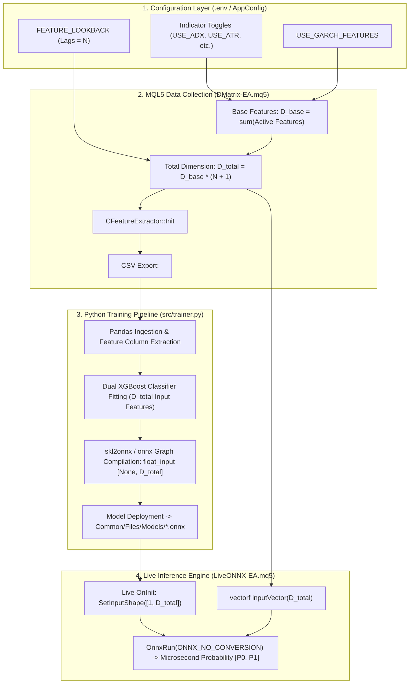
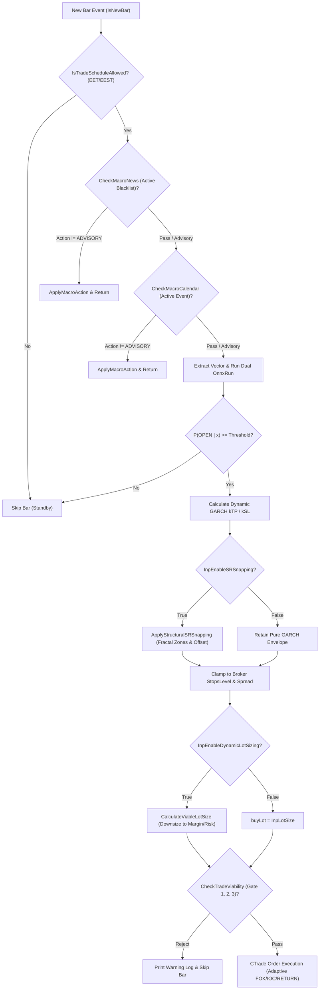
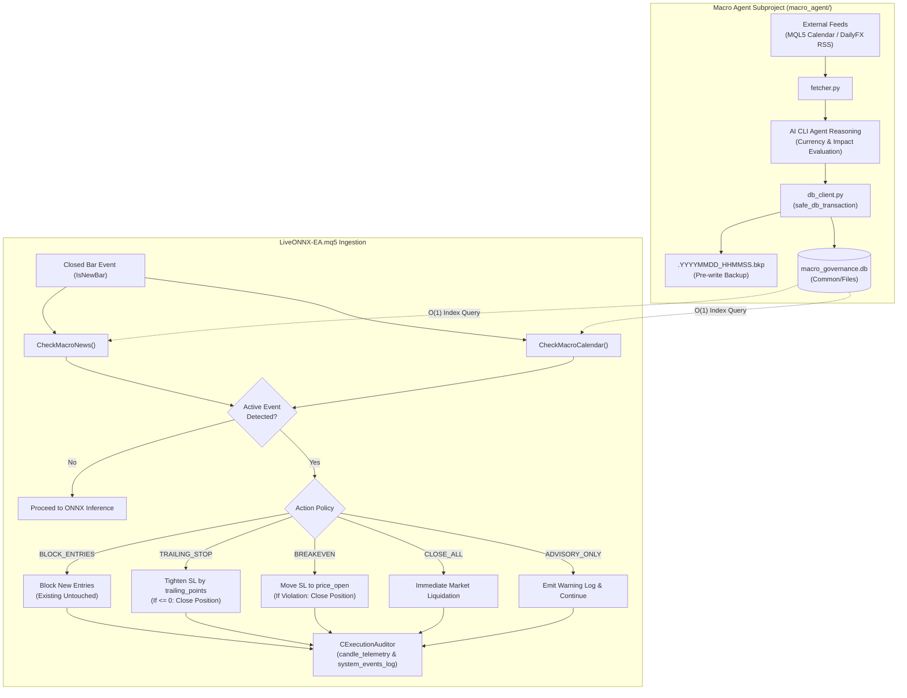

# Institutional Input Taxonomy, Econometric Foundations & Parameter Impact Matrix

**Document Version:** 3.0.0  
**Classification:** Institutional Quantitative Research & Financial Software Architecture  
**Author:** Senior Quantitative Researcher, Forex ML Specialist & Financial Architect  
**System Standard:** Eastern European Time / Eastern European Summer Time (EET/EEST, MT5 Server Time: UTC+2 / UTC+3)  
**Applicability:** Python MLOps Pipeline (`src/`), MetaTrader 5 Strategy Tester (`DMatrix-EA.mq5`), Live Execution Engine (`LiveONNX-EA.mq5`), Macroeconomic SQLite Governance (`macro_governance.db`), Autonomous Macro Collector (`macro_agent/`), and Execution Telemetry Audit Engine (`AuditLogs/*.db`).

---

## Table of Contents
1. [Executive Summary & Architectural Invariants](#1-executive-summary--architectural-invariants)
2. [Universal Master Cross-Reference Index (148 Core Parameters + Directional Overrides)](#2-universal-master-cross-reference-index-148-core-parameters--directional-overrides)
3. [Deep-Dive Taxonomy & Quantitative Sensitivity Matrix](#3-deep-dive-taxonomy--quantitative-sensitivity-matrix)
   - [3.1 Infrastructure, Executables & Orchestration Paths (1-4)](#31-infrastructure-executables--orchestration-paths-1-4)
   - [3.2 Strategy Tester Backtest Simulation & Watchdog Controls (5-13)](#32-strategy-tester-backtest-simulation--watchdog-controls-5-13)
   - [3.3 Anomaly & Crisis Blackout Regime Governance (14-16)](#33-anomaly--crisis-blackout-regime-governance-14-16)
   - [3.4 Triple Barrier Momentum Labeling Engine (17-20)](#34-triple-barrier-momentum-labeling-engine-17-20)
   - [3.5 Intraday Session Schedule & Microstructure Liquidity Windows (21-35)](#35-intraday-session-schedule--microstructure-liquidity-windows-21-35)
   - [3.6 Econometric GARCH(1,1) Volatility Forecasting Engine (36-40)](#36-econometric-garch11-volatility-forecasting-engine-36-40)
   - [3.7 Feature Vector Dimension & Sequential Lookback Architecture](#37-feature-vector-dimension--sequential-lookback-architecture)
   - [3.8 Feature Extraction Toggles (41-53)](#38-feature-extraction-toggles-41-53)
   - [3.9 Technical & Econometric Indicator Mathematical Parameters (54-78)](#39-technical--econometric-indicator-mathematical-parameters-54-78)
   - [3.10 Dual XGBoost Supervised Learning Hyperparameters (79-88)](#310-dual-xgboost-supervised-learning-hyperparameters-79-88)
   - [3.11 Bayesian Hyperparameter Optimization Engine (89)](#311-bayesian-hyperparameter-optimization-engine-89)
   - [3.12 ML Directional Evaluation & Threshold Sensitivity Grid (90-95)](#312-ml-directional-evaluation--threshold-sensitivity-grid-90-95)
   - [3.12.1 Directional XGBoost & Optuna Overrides (BUY/SELL Decoupling: 24 Parameters)](#3121-directional-xgboost--optuna-overrides-buysell-decoupling-24-parameters)
   - [3.13 Live Execution & Directional Governance (96-99)](#313-live-execution--directional-governance-96-99)
   - [3.14 Structural Support & Resistance (S&R) Snapping Subsystem (100-104)](#314-structural-support--resistance-sr-snapping-subsystem-100-104)
   - [3.15 Quantitative Risk & Margin Viability Governance Filter (105-110)](#315-quantitative-risk--margin-viability-governance-filter-105-110)
   - [3.16 Live Dynamic GARCH Stop Sizing Engine (127-129)](#316-live-dynamic-garch-stop-sizing-engine-127-129)
   - [3.17 ONNX Model Routing & Graph Deployment Overrides (130-131)](#317-onnx-model-routing--graph-deployment-overrides-130-131)
   - [3.18 Consecutive Signal & Position Management Subsystem (111-124)](#318-consecutive-signal--position-management-subsystem-111-124)
   - [3.19 Execution & Telemetry Audit Logging Engine (132, 134)](#319-execution--telemetry-audit-logging-engine-132-134)
   - [3.20 Macroeconomic Calendar & News SQLite Governance Engine (125-126, 133, 135-147)](#320-macroeconomic-calendar--news-sqlite-governance-engine-125-126-133-135-147)
   - [3.21 Macro Agent Collector & News Scraper Controls (148)](#321-macro-agent-collector--news-scraper-controls-148)
4. [Cross-Network Impact & Downstream Propagation Graphs](#4-cross-network-impact--downstream-propagation-graphs)
   - [4.1 Feature Parameter to ONNX Graph Tensor Dimension Propagation](#41-feature-parameter-to-onnx-graph-tensor-dimension-propagation)
   - [4.2 Pre-Trade Governance & Viability Execution Decision Gate](#42-pre-trade-governance--viability-execution-decision-gate)
   - [4.3 Macroeconomic Interception & Defensive Action Lifecycle](#43-macroeconomic-interception--defensive-action-lifecycle)
5. [Codebase Parameter Audit: Inconsistencies, Vulnerabilities & Edge-Case Findings](#5-codebase-parameter-audit-inconsistencies-vulnerabilities--edge-case-findings)
6. [Didactic References & Authoritative Further Reading](#6-didactic-references--authoritative-further-reading)

---

## 1. Executive Summary & Architectural Invariants

In institutional algorithmic Foreign Exchange (Forex) quantitative trading, model stability requires an unbreakable contract across data generation, statistical learning, and real-time execution. The **MT5-FX-Countdown** platform eliminates train-serving skew and execution degradation through five inviolable architectural principles:

1. **Zero Train-Serving Skew Guarantee**:
   The modular feature extraction engine [`CFeatureExtractor`](../MQL5/Include/FeatureExtractor.mqh) is compiled identically into both the historical data collector [`DMatrix-EA.mq5`](../MQL5/Experts/DMatrix-EA.mq5) and the live execution expert [`LiveONNX-EA.mq5`](../MQL5/Experts/LiveONNX-EA.mq5). Modifying any indicator parameter or feature toggle alters the feature representation synchronously across historical training and live microsecond inference.
2. **Universal Timezone Standard (EET/EEST - MT5 Server Time)**:
   All temporal boundaries, daily schedules, pandemic blackout windows, and SQLite macroeconomic event timestamps operate strictly in **Eastern European Time / Eastern European Summer Time (EET/EEST, UTC+2 in winter / UTC+3 in summer)**. This standard aligns with institutional 17:00 New York daily closes, yielding exactly 5 trading candles per week and eliminating weekend candle artifacts ([Campbell, Lo, & MacKinlay, 1997](#didactic-references)).
3. **Net Liquid Profit Outcome Classification**:
   Trade outcomes in `DMatrix-EA` are strictly labeled as binary opportunities:
   $$\text{Label} = \begin{cases} 1.0f & \text{if } \text{DealReason} = \text{TP} \land (\text{Profit} + \text{Swap} + \text{Commission}) > 0.0 \\ 0.0f & \text{otherwise} \end{cases}$$
   Negative or break-even trades resulting from slippage, commission, or overnight swap fees are strictly labeled as $0.0f$ (`NOT_OPEN`), enforcing institutional cost-awareness ([López de Prado, 2018](#didactic-references)).
4. **Zero-Copy Flat 1D Float ONNX Graphs**:
   Trained models are compiled into flat single-precision Float tensors with shape `[None, num_features] -> [None, 2]` without `ZipMap` operators. Live inference leverages MQL5 native `vectorf` structures executed via `OnnxRun(..., ONNX_NO_CONVERSION, ...)` achieving sub-50-microsecond execution latency.
5. **Decoupled Macroeconomic & Execution Telemetry Governance**:
   Exogenous shocks (interest rate announcements, labor prints, breaking geopolitical escalations) are intercepted prior to inference via a dedicated SQLite database (`macro_governance.db`), while end-to-end execution friction, probability entropy, and trade lifecycles are immutably logged into per-session SQLite audit databases (`AuditLogs/<Symbol>_<TF>_<Timestamp>.db`).

---

## 2. Universal Master Cross-Reference Index (148 Core Parameters + Directional Overrides)

The master cross-reference index maps every quantitative parameter, execution toggle, macroeconomic schema column, and CLI control across the four ecosystem scopes:
- **`Env/Py`**: Managed via `.env` and strictly typed in Python [`src/config.py`](../src/config.py) (`AppConfig` & `DirectionalXGBConfig`).
- **`DMatrix`**: Declared as an `input` in [`MQL5/Experts/DMatrix-EA.mq5`](../MQL5/Experts/DMatrix-EA.mq5) for training dataset generation.
- **`LiveONNX`**: Declared as an `input` in [`MQL5/Experts/LiveONNX-EA.mq5`](../MQL5/Experts/LiveONNX-EA.mq5) for real-time live trading.
- **`MacroAgent`**: Managed in [`macro_agent/`](../macro_agent/) (`db_client.py` SQLite schema and `fetcher.py` CLI).

| # | Exact Parameter Identifier | Data Type | Env/Py | DMatrix | LiveONNX | MacroAgent | Functional Classification |
|---|----------------------------|:---------:|:------:|:-------:|:--------:|:----------:|---------------------------|
| 1 | `MT5_PATH` | Path | Yes | No | No | No | Infrastructure & Executable |
| 2 | `METAEDITOR_PATH` | Path | Yes | No | No | No | Infrastructure & Compiler |
| 3 | `MT5_DATA_PATH` | Path / None | Yes | No | No | No | Terminal Local Roaming Dir |
| 4 | `MT5_COMMON_PATH` | Path / None | Yes | No | No | Yes | Shared Common Directory |
| 5 | `SYMBOL` | string | Yes | Chart | Chart | Yes | Asset Specification |
| 6 | `TIMEFRAME` | string | Yes | Chart | Chart | No | Temporal Discretization |
| 7 | `MAGIC_NUMBER` / `InpMagicNumber` | ulong | Yes | Yes | Yes | No | Order Routing & Isolation |
| 8 | `FROM_DATE` | string (Date) | Yes | Tester | Tester | No | Backtest In-Sample Boundary |
| 9 | `TO_DATE` | string (Date) | Yes | Tester | Tester | No | Backtest Out-of-Sample Boundary |
| 10 | `SHUTDOWN_TERMINAL` | int (0/1) | Yes | No | No | No | OS Process Management |
| 11 | `BACKTEST_TIMEOUT` | int (sec) | Yes | No | No | No | Subprocess Lifecycle Watchdog |
| 12 | `WATCHDOG_POLL_INTERVAL` | int (sec) | Yes | No | No | No | Heartbeat Polling Frequency |
| 13 | `SKIP_DATASET_GENERATION` | bool | Yes | No | No | No | MLOps Cache & Pipeline Gate |
| 14 | `AVOID_PANDEMICTIME` / `InpAvoidPandemicTime` | bool | Yes | Yes | No | No | Regime Filter (Crisis Blackout) |
| 15 | `PANDEMIC_START_DATE` / `InpPandemicStartTime` | datetime | Yes | Yes | No | No | Regime Blackout Lower Bound |
| 16 | `PANDEMIC_END_DATE` / `InpPandemicEndTime` | datetime | Yes | Yes | No | No | Regime Blackout Upper Bound |
| 17 | `FEATURE_LOOKBACK` / `InpFeatureLookback` | int | Yes | Yes | Yes | No | Sequential Lag Horizon ($N$) |
| 18 | `LABEL_HORIZON_BARS` / `InpLabelHorizonBars` | int | Yes | Yes | No | No | Triple Barrier Vertical Horizon |
| 19 | `LABEL_MIN_POINTS` / `InpLabelMinPoints` | int | Yes | Yes | No | No | Triple Barrier Upper Target (TP) |
| 20 | `LABEL_MAX_ADVERSE_POINTS` / `InpLabelMaxAdversePoints` | int | Yes | Yes | No | No | Triple Barrier Lower Target (SL) |
| 21 | `TRADE_MONDAY` / `InpTradeMonday` | bool | Yes | Yes | Yes | No | Session Schedule Gate |
| 22 | `TRADE_MONDAY_START` / `InpMondayStartTime` | string (Time) | Yes | Yes | Yes | No | Monday Session Open Window |
| 23 | `TRADE_MONDAY_END` / `InpMondayEndTime` | string (Time) | Yes | Yes | Yes | No | Monday Session Close Window |
| 24 | `TRADE_TUESDAY` / `InpTradeTuesday` | bool | Yes | Yes | Yes | No | Session Schedule Gate |
| 25 | `TRADE_TUESDAY_START` / `InpTuesdayStartTime` | string (Time) | Yes | Yes | Yes | No | Tuesday Session Open Window |
| 26 | `TRADE_TUESDAY_END` / `InpTuesdayEndTime` | string (Time) | Yes | Yes | Yes | No | Tuesday Session Close Window |
| 27 | `TRADE_WEDNESDAY` / `InpTradeWednesday` | bool | Yes | Yes | Yes | No | Session Schedule Gate |
| 28 | `TRADE_WEDNESDAY_START` / `InpWednesdayStartTime` | string (Time) | Yes | Yes | Yes | No | Wednesday Session Open Window |
| 29 | `TRADE_WEDNESDAY_END` / `InpWednesdayEndTime` | string (Time) | Yes | Yes | Yes | No | Wednesday Session Close Window |
| 30 | `TRADE_THURSDAY` / `InpTradeThursday` | bool | Yes | Yes | Yes | No | Session Schedule Gate |
| 31 | `TRADE_THURSDAY_START` / `InpThursdayStartTime` | string (Time) | Yes | Yes | Yes | No | Thursday Session Open Window |
| 32 | `TRADE_THURSDAY_END` / `InpThursdayEndTime` | string (Time) | Yes | Yes | Yes | No | Thursday Session Close Window |
| 33 | `TRADE_FRIDAY` / `InpTradeFriday` | bool | Yes | Yes | Yes | No | Session Schedule Gate |
| 34 | `TRADE_FRIDAY_START` / `InpFridayStartTime` | string (Time) | Yes | Yes | Yes | No | Friday Session Open Window |
| 35 | `TRADE_FRIDAY_END` / `InpFridayEndTime` | string (Time) | Yes | Yes | Yes | No | Friday Weekend Gap Prevention |
| 36 | `GARCH_HORIZON` / `InpGarchHorizon` | int | Yes | Yes | Yes | No | Multi-Step Volatility Horizon |
| 37 | `PRICE_SIZE` / `InpPriceSize` | int | Yes | Yes | Yes | No | Sample Return Variance Anchor |
| 38 | `GARCH_ALPHA` / `InpGarchAlpha` | double | Yes | Yes | Yes | No | ARCH Shock Reaction ($\alpha$) |
| 39 | `GARCH_BETA` / `InpGarchBeta` | double | Yes | Yes | Yes | No | GARCH Persistence ($\beta$) |
| 40 | `USE_GARCH_FEATURES` / `InpUseGarchFeatures` | bool | Yes | Yes | Yes | No | Econometric Feature Inclusion |
| 41 | `USE_ADX` / `InpUseADX` | bool | Yes | Yes | Yes | No | Trend Strength Feature Inclusion |
| 42 | `USE_ATR` / `InpUseATR` | bool | Yes | Yes | Yes | No | Range Volatility Feature Inclusion |
| 43 | `USE_BANDS` / `InpUseBANDS` | bool | Yes | Yes | Yes | No | Dispersion Feature Inclusion |
| 44 | `USE_MACD` / `InpUseMACD` | bool | Yes | Yes | Yes | No | Momentum Convergence Feature |
| 45 | `USE_FAST_MA` / `InpUseFastMA` | bool | Yes | Yes | Yes | No | Short-Term Trend Distance |
| 46 | `USE_SLOW_MA` / `InpUseSlowMA` | bool | Yes | Yes | Yes | No | Long-Term Trend Distance |
| 47 | `USE_RSI` / `InpUseRSI` | bool | Yes | Yes | Yes | No | Velocity Momentum Feature |
| 48 | `USE_STOCHASTIC` / `InpUseStochastic` | bool | Yes | Yes | Yes | No | Oscillator Extremum Feature |
| 49 | `USE_CANDLESTICK` / `InpUseCandlestick` | bool | Yes | Yes | Yes | No | Microstructure Price Action |
| 50 | `USE_TIMESTAMP_WEEK` / `InpUseTimestampWeek` | bool | Yes | Yes | Yes | No | Day-of-Week Seasonality Feature |
| 51 | `USE_TIMESTAMP_DAY` / `InpUseTimestampDay` | bool | Yes | Yes | Yes | No | Intraday Session Seasonality |
| 52 | `USE_OPEN_MARKETS` / `InpUseOpenMarkets` | bool | Yes | Yes | Yes | No | Global Session Overlap Encoding |
| 53 | `USE_SPREAD` / `InpUseSpread` | bool | Yes | Yes | Yes | No | Liquidity Cost Microstructure |
| 54 | `ADX_PERIOD` / `InpADXPeriod` | int | Yes | Yes | Yes | No | Directional Movement Smoothing |
| 55 | `ATR_PERIOD` / `InpATRPeriod` | int | Yes | Yes | Yes | No | True Range Moving Average |
| 56 | `BANDS_PERIOD` / `InpBandsPeriod` | int | Yes | Yes | Yes | No | Bollinger Central Moving Average |
| 57 | `BANDS_SHIFT` / `InpBandsShift` | int | Yes | Yes | Yes | No | Bollinger Horizontal Displacement |
| 58 | `BANDS_DEV` / `InpBandsDev` | double | Yes | Yes | Yes | No | Standard Deviation Envelope |
| 59 | `BANDS_APPLIED_PRICE` / `InpBandsAppliedPrice` | ENUM | Yes | Yes | Yes | No | Applied Price Discretization |
| 60 | `MACD_FAST` / `InpMACDFastPeriod` | int | Yes | Yes | Yes | No | Fast Exponential Filter Period |
| 61 | `MACD_SLOW` / `InpMACDSlowPeriod` | int | Yes | Yes | Yes | No | Slow Exponential Filter Period |
| 62 | `MACD_SIGNAL` / `InpMACDSignalPeriod` | int | Yes | Yes | Yes | No | Signal Moving Average Period |
| 63 | `MACD_APPLIED_PRICE` / `InpMACDAppliedPrice` | ENUM | Yes | Yes | Yes | No | Applied Price Discretization |
| 64 | `FAST_MA_PERIOD` / `InpFastMAPeriod` | int | Yes | Yes | Yes | No | Fast Trend Line Period |
| 65 | `FAST_MA_SHIFT` / `InpFastMAShift` | int | Yes | Yes | Yes | No | Fast Trend Displacement |
| 66 | `FAST_MA_METHOD` / `InpFastMAMethod` | ENUM | Yes | Yes | Yes | No | Smoothing Algorithm (EMA/SMA) |
| 67 | `FAST_MA_APPLIED_PRICE` / `InpFastMAAppliedPrice` | ENUM | Yes | Yes | Yes | No | Applied Price Discretization |
| 68 | `SLOW_MA_PERIOD` / `InpSlowMAPeriod` | int | Yes | Yes | Yes | No | Slow Baseline Trend Period |
| 69 | `SLOW_MA_SHIFT` / `InpSlowMAShift` | int | Yes | Yes | Yes | No | Slow Baseline Displacement |
| 70 | `SLOW_MA_METHOD` / `InpSlowMAMethod` | ENUM | Yes | Yes | Yes | No | Smoothing Algorithm (EMA/SMA) |
| 71 | `SLOW_MA_APPLIED_PRICE` / `InpSlowMAAppliedPrice` | ENUM | Yes | Yes | Yes | No | Applied Price Discretization |
| 72 | `RSI_PERIOD` / `InpRSIPeriod` | int | Yes | Yes | Yes | No | Relative Momentum Lookback |
| 73 | `RSI_APPLIED_PRICE` / `InpRSIAppliedPrice` | ENUM | Yes | Yes | Yes | No | Applied Price Discretization |
| 74 | `STOCH_K` / `InpStochK` | int | Yes | Yes | Yes | No | Stochastic %K Fast Period |
| 75 | `STOCH_D` / `InpStochD` | int | Yes | Yes | Yes | No | Stochastic %D Signal Period |
| 76 | `STOCH_SLOWING` / `InpStochSlowing` | int | Yes | Yes | Yes | No | Stochastic Internal Smoothing |
| 77 | `STOCH_METHOD` / `InpStochMethod` | ENUM | Yes | Yes | Yes | No | Smoothing Algorithm |
| 78 | `STOCH_PRICE_FIELD` / `InpStochPriceField` | ENUM | Yes | Yes | Yes | No | Price Basis (High/Low vs Close) |
| 79 | `XGB_MAX_DEPTH` | int | Yes | No | No | No | Tree Structural Complexity |
| 80 | `XGB_ETA` | double | Yes | No | No | No | Gradient Shrinkage Factor |
| 81 | `XGB_SUBSAMPLE` | double | Yes | No | No | No | Row Stochastic Subsampling |
| 82 | `XGB_COLSAMPLE_BYTREE` | double | Yes | No | No | No | Column Feature Subsampling |
| 83 | `XGB_MIN_CHILD_WEIGHT` | double | Yes | No | No | No | Leaf Hessian Partition Threshold |
| 84 | `XGB_LAMBDA` | double | Yes | No | No | No | L2 Regularization Penalty |
| 85 | `XGB_ALPHA` | double | Yes | No | No | No | L1 Sparsity Regularization Penalty |
| 86 | `XGB_ROUNDS` | int | Yes | No | No | No | Maximum Boosting Iterations |
| 87 | `XGB_EARLY_STOPPING_ROUNDS` | int | Yes | No | No | No | OOS Generalization Early Stop |
| 88 | `VALIDATION_PERCENTAGE` | double | Yes | No | No | No | Chronological Validation Ratio |
| 89 | `OPTUNA_TRIALS` | int | Yes | No | No | No | Bayesian Search Budget |
| 90 | `EVAL_CLASSIFICATION_THRESHOLD` | float | Yes | No | No | No | Validation Baseline Decision Cutoff |
| 91 | `OPTUNA_OBJECTIVE_METRIC` | string | Yes | No | No | No | Optuna Target Metric |
| 92 | `EVAL_ENABLE_THRESHOLD_GRID` | bool (0/1) | Yes | No | No | No | Sensitivity Grid Telemetry Toggle |
| 93 | `EVAL_THRESHOLD_MIN` | float | Yes | No | No | No | Parametric Grid Minimum Bound |
| 94 | `EVAL_THRESHOLD_MAX` | float | Yes | No | No | No | Parametric Grid Maximum Bound |
| 95 | `EVAL_THRESHOLD_STEP` | float | Yes | No | No | No | Parametric Grid Resolution Step |
| 79a | `XGB_BUY_MAX_DEPTH` / `XGB_SELL_MAX_DEPTH` | int / None | Yes | No | No | No | Directional Tree Complexity Override |
| 80a | `XGB_BUY_ETA` / `XGB_SELL_ETA` | float / None | Yes | No | No | No | Directional Learning Rate Override |
| 81a | `XGB_BUY_SUBSAMPLE` / `XGB_SELL_SUBSAMPLE` | float / None | Yes | No | No | No | Directional Row Subsample Override |
| 82a | `XGB_BUY_COLSAMPLE_BYTREE` / `XGB_SELL_COLSAMPLE_BYTREE` | float / None | Yes | No | No | No | Directional Col Subsample Override |
| 83a | `XGB_BUY_MIN_CHILD_WEIGHT` / `XGB_SELL_MIN_CHILD_WEIGHT` | float / None | Yes | No | No | No | Directional Child Weight Override |
| 84a | `XGB_BUY_LAMBDA` / `XGB_SELL_LAMBDA` | float / None | Yes | No | No | No | Directional L2 Regularization Override |
| 85a | `XGB_BUY_ALPHA` / `XGB_SELL_ALPHA` | float / None | Yes | No | No | No | Directional L1 Regularization Override |
| 86a | `XGB_BUY_ROUNDS` / `XGB_SELL_ROUNDS` | int / None | Yes | No | No | No | Directional Boosting Rounds Override |
| 87a | `XGB_BUY_EARLY_STOPPING_ROUNDS` / `XGB_SELL_EARLY_STOPPING_ROUNDS` | int / None | Yes | No | No | No | Directional Early Stopping Override |
| 89a | `OPTUNA_BUY_TRIALS` / `OPTUNA_SELL_TRIALS` | int / None | Yes | No | No | No | Directional Optuna Budget Override |
| 91a | `OPTUNA_BUY_OBJECTIVE_METRIC` / `OPTUNA_SELL_OBJECTIVE_METRIC` | string / None| Yes | No | No | No | Directional Optuna Objective Metric |
| 90a | `EVAL_BUY_CLASSIFICATION_THRESHOLD` / `EVAL_SELL_CLASSIFICATION_THRESHOLD` | float / None| Yes | No | No | No | Directional Decision Threshold Override |
| 96 | `InpTradeDirection` | ENUM | No | No | Yes | No | Directional Execution Filter |
| 97 | `InpMinimalLevelAcceptedBuy` | double | No | No | Yes | No | Calibrated Probability Gate (Buy) |
| 98 | `InpMinimalLevelAcceptedSell` | double | No | No | Yes | No | Calibrated Probability Gate (Sell) |
| 99 | `InpLotSize` | double | No | Yes | Yes | No | Transaction Order Volume |
| 100 | `InpEnableSRSnapping` | bool | No | No | Yes | No | Structural Level Optimization |
| 101 | `InpSRLookbackBars` | int | No | No | Yes | No | Structural Extremum Lookback |
| 102 | `InpSRPivotStrength` | int | No | No | Yes | No | Fractal Extrema Radius ($K$) |
| 103 | `InpSROffsetPoints` | int | No | No | Yes | No | Sweep Protection & Fill Buffer |
| 104 | `InpSRZoneSelection` | ENUM | No | No | Yes | No | Payoff Profile Target (Near/Far) |
| 105 | `InpEnableRiskFilter` | bool | No | No | Yes | No | Master Pre-Trade Gatekeeper |
| 106 | `InpEnableDynamicLotSizing` | bool | No | No | Yes | No | Dynamic Risk Volume Downsizing |
| 107 | `InpMaxLotSize` | double | No | No | Yes | No | Dynamic Sizing Ceiling Lot |
| 108 | `InpMarginSafetyMultiplier` | double | No | No | Yes | No | Broker Margin Call Cushion |
| 109 | `InpMaxRiskRewardRatio` | double | No | No | Yes | No | Asymmetric Toxicity Guard |
| 110 | `InpMaxTradeRiskPct` | double | No | No | Yes | No | Maximum Balance Budget Loss |
| 111 | `InpConsecutiveMode` | ENUM | No | No | Yes | No | Consecutive Signal Execution Mode |
| 112 | `InpMaxConsecutiveOrders` | int | No | No | Yes | No | Directional Concurrent Position Cap |
| 113 | `InpHurdleProfitPct` | double (%) | No | No | Yes | No | TP Distance Hurdle Before Ratchet |
| 114 | `InpProfitLockPct` | double (%) | No | No | Yes | No | Accrued Profit Ratio Locked to SL |
| 115 | `InpAntiChopMinDisplacement` | int (pts) | No | No | Yes | No | Minimum Bar Displacement Filter |
| 116 | `InpSafetyOffsetPoints` | int (pts) | No | No | Yes | No | Breakeven & Stop Buffer Offset |
| 117 | `InpEnableSwapAmortization` | bool | No | No | Yes | No | Transversal Swap & Cost Amortization |
| 118 | `InpConsecutiveSlotFilter` | bool | No | No | Yes | No | Slot Amplitude Expansion Gate |
| 119 | `InpIgnoreConflictingSignals` | bool | No | No | Yes | No | Same-Candle Conflicting Signal Filter |
| 120 | `InpEnableOpposingRegimeFilter` | bool | No | No | Yes | No | Active Position Adverse Regime Defense |
| 121 | `InpOpposingStreakThreshold` | int (bars) | No | No | Yes | No | Counter-Model Streak Trigger Count |
| 122 | `InpOpposingAction` | ENUM | No | No | Yes | No | Adverse Defensive Action Policy |
| 123 | `InpOpposingTrailingPoints` | int (pts) | No | No | Yes | No | Defensive Trailing Tightening Step |
| 124 | `InpOpposingRecalculateRatio` | double | No | No | Yes | No | Dynamic Barrier Contraction Ratio |
| 125 | `InpEnableCalendarFilter` | bool | No | No | Yes | No | Scheduled News Event Interceptor |
| 126 | `InpEnableNewsFilter` | bool | No | No | Yes | No | Breaking Macro Blacklist Gate |
| 127 | `InpRiskGarchHorizon` | int | No | No | Yes | No | Dynamic Risk Sizing Horizon |
| 128 | `InpKTP` | double | No | No | Yes | No | Dynamic GARCH TP Coefficient |
| 129 | `InpKSL` | double | No | No | Yes | No | Dynamic GARCH SL Coefficient |
| 130 | `InpModelBuyPath` | string | No | No | Yes | No | ONNX File System Override (Buy) |
| 131 | `InpModelSellPath` | string | No | No | Yes | No | ONNX File System Override (Sell) |
| 132 | `InpIgnoreAudit` | bool | No | No | Yes | No | Telemetry & Audit SQLite Bypass |
| 133 | `MACRO_DATABASE_NAME` | string | Const | No | Yes | Yes | SQLite Macro DB (`macro_governance.db`) |
| 134 | `AUDIT_DIRECTORY_NAME` | string | Const | No | Yes | No | Mandatory Prediction Audit Folder |
| 135 | `calendar_events.id` | int (PK) | No | No | Schema | Yes | Auto-incrementing Event ID |
| 136 | `calendar_events.symbol` | string | No | No | Schema | Yes | Event Pair / Currency (`EURUSD`/`USD`/`GLOBAL`) |
| 137 | `calendar_events.title` | string | No | No | Schema | Yes | Official Event Title (e.g. Non-Farm Payrolls) |
| 138 | `calendar_events.description` | string | No | No | Schema | Yes | Macroeconomic Release Description |
| 139 | `calendar_events.start_time` | string (DT) | No | No | Schema | Yes | Event Start Window in EET/EEST |
| 140 | `calendar_events.end_time` | string (DT) | No | No | Schema | Yes | Event End Window in EET/EEST |
| 141 | `calendar_events.action` | string (Enum) | No | No | Schema | Yes | Protective Action (`BLOCK_ENTRIES`, etc.) |
| 142 | `calendar_events.trailing_points` | int (pts) | No | No | Schema | Yes | Trailing Stop Distance in Points |
| 143 | `news_events.symbol` | string (PK) | No | No | Schema | Yes | Breaking Blacklist Target Symbol |
| 144 | `news_events.title` | string | No | No | Schema | Yes | Breaking News Headline |
| 145 | `news_events.description` | string | No | No | Schema | Yes | Breaking News Market Threat Detail |
| 146 | `news_events.action` | string (Enum) | No | No | Schema | Yes | Breaking Threat Action Policy |
| 147 | `news_events.trailing_points` | int (pts) | No | No | Schema | Yes | Breaking Trailing Distance in Points |
| 148 | `fetcher.py CLI Args / Constants` | CLI Args | No | No | No | Yes | `--symbol`, `--currency`, `--calendar`, `--news` |

---

## 3. Deep-Dive Taxonomy & Quantitative Sensitivity Matrix

### 3.1 Infrastructure, Executables & Orchestration Paths

#### 1. `MT5_PATH`
- **Data Type & Scope:** `pathlib.Path` | Scope: `.env`, Python Orchestrator ([`src/config.py`](../src/config.py), [`src/mt5_client.py`](../src/mt5_client.py)).
- **Exact Limits & Format:** Absolute system path to 64-bit MT5 executable. Regex: `^[a-zA-Z]:\\(?:[^\\/:*?"<>|\r\n]+\\)*terminal64\.exe$`.
- **Quantitative & Econometric Purpose:** Orchestrates headless terminal execution for high-throughput Strategy Tester simulation and data extraction without graphical desktop overhead.
- **Sensitivity Across Ranges:**
  - *Low (Standard Consumer Storage):* Sequential spinning HDD causes disk queuing and timeouts during tick cache initialization.
  - *Medium (NVMe PCIe Gen 3 SSD):* Sustained 2500 MB/s read throughput reduces historical bar synchronization latency by 80%.
  - *High (Enterprise PCIe Gen 4/5 RAMDisk):* Enables instantaneous tick loading across multiple currency pairs simultaneously.
- **Downstream Code Propagation:** `.env` $\to$ `AppConfig.mt5_path` $\to$ `MT5Client.initialize()` $\to$ `subprocess.Popen([mt5_path, f"/config:{ini_path}"])`.
- **Literature Citation:** [MetaQuotes Software Corp. (2026)](https://www.mql5.com/en/docs), *MetaTrader 5 Headless Terminal Automation Protocol*.

#### 2. `METAEDITOR_PATH`
- **Data Type & Scope:** `pathlib.Path` | Scope: `.env`, Python Orchestrator ([`src/config.py`](../src/config.py), [`src/compiler.py`](../src/compiler.py)).
- **Exact Limits & Format:** Absolute system path to 64-bit MetaEditor compiler. Regex: `^[a-zA-Z]:\\(?:[^\\/:*?"<>|\r\n]+\\)*metaeditor64\.exe$`.
- **Quantitative & Econometric Purpose:** Compiles MQL5 source code into native bytecode (`.ex5`) with high-level optimization flags, guaranteeing execution speed parity between backtest extraction and live inference.
- **Sensitivity Across Ranges:** Path validity is binary; misconfiguration halts pipeline with compilation exit code `1`.
- **Downstream Code Propagation:** `.env` $\to$ `AppConfig.metaeditor_path` $\to$ `Compiler.compile_expert()` $\to$ `subprocess.run([metaeditor_path, f"/compile:{mql_file}", f"/log:{log_file}"])`.
- **Literature Citation:** [MetaQuotes Software Corp. (2026)](https://www.mql5.com/en/docs), *MetaEditor Command Line Compilation Specification*.

#### 3. `MT5_DATA_PATH`
- **Data Type & Scope:** `pathlib.Path | None` | Scope: `.env`, Python Orchestrator ([`src/config.py`](../src/config.py), [`src/preset_generator.py`](../src/preset_generator.py)).
- **Exact Limits & Format:** Valid Windows directory path or empty string (resolved dynamically via `terminal_info.data_path`).
- **Quantitative & Econometric Purpose:** Identifies terminal-specific roaming directory hosting instance-local expert executables (`MQL5/Experts`) and chart presets (`MQL5/Presets`).
- **Sensitivity Across Ranges:** If `None`, pipeline queries connected MT5 terminal instance dynamically via RPC.
- **Downstream Code Propagation:** `.env` $\to$ `AppConfig.mt5_data_path` $\to$ `PresetGenerator.generate_all()` $\to$ Writes `MQL5/Presets/LiveONNX-EA_<Symbol>_<TF>.set`.
- **Literature Citation:** [MetaQuotes Software Corp. (2026)](https://www.mql5.com/en/docs), *Terminal Roaming and Local Storage Architecture*.

#### 4. `MT5_COMMON_PATH`
- **Data Type & Scope:** `pathlib.Path | None` | Scope: `.env`, Python Orchestrator, MacroAgent, MQL5 File Subsystem.
- **Exact Limits & Format:** Absolute directory path to `MetaQuotes/Terminal/Common`. If omitted, defaults to `%APPDATA%\MetaQuotes\Terminal\Common`.
- **Quantitative & Econometric Purpose:** Common sandbox directory shared across all terminal instances. Hosts training CSV datasets (`Common/Files/`), deployed ONNX models (`Common/Files/Models/`), macroeconomic governance database (`Common/Files/macro_governance.db`), and session audit logs (`Common/Files/AuditLogs/`).
- **Sensitivity Across Ranges:** Critical shared bus; high disk I/O requires fast SSD storage with low write latency.
- **Downstream Code Propagation:** `.env` $\to$ `AppConfig.mt5_common_path` $\to$ `ModelDeployer`, `PresetGenerator`, `macro_agent/db_client.py` $\to$ MQL5 `FILE_COMMON` flag.
- **Literature Citation:** [MetaQuotes Software Corp. (2026)](https://www.mql5.com/en/docs), *MQL5 Shared File Sandbox Operations*.

---

### 3.2 Strategy Tester Backtest Simulation & Watchdog Controls

#### 5. `SYMBOL`
- **Data Type & Scope:** `string` | Scope: `.env`, Python Orchestrator, MQL5 Experts (`DMatrix-EA.mq5`, `LiveONNX-EA.mq5`), MacroAgent.
- **Exact Limits & Format:** 6-character ISO Forex currency pair or broker-suffixed equivalent. Regex: `^[A-Z]{6}(\.[a-zA-Z0-9]+)?$`. Allowed institutional majors: `EURUSD`, `GBPUSD`, `USDJPY`, `AUDUSD`, `USDCAD`, `USDCHF`, `NZDUSD`.
- **Quantitative & Econometric Purpose:** Specifies the financial currency asset. Each pair features unique microstructure properties, bid-ask spreads, liquidity depth, volatility persistence (GARCH $\beta$), and central bank policy reaction functions ([Campbell, Lo, & MacKinlay, 1997](#didactic-references)).
- **Sensitivity Across Ranges & Asset Heterogeneity:**
  - *EURUSD:* Low spread (0.1 - 0.4 pips); high market depth; low volatility clustering ($\beta \approx 0.90$); highly sensitive to ECB-Fed yield spreads.
  - *GBPUSD:* Wide intraday range (70 - 130 pips/day); pronounced leptokurtosis ($\kappa > 6.0$); susceptible to sudden policy-driven momentum spikes.
  - *USDJPY:* Asian session benchmark; tight spread; highly correlated with US 10-Year Treasury Yields ($r > 0.75$).
  - *AUDUSD / NZDUSD:* Commodity/Risk-beta currencies; heavily impacted by global equity sentiment and Chinese manufacturing PMIs.
  - *USDCAD:* Petrocurrency; strongly negatively correlated with WTI Crude Oil price shocks.
  - *USDCHF:* Traditional safe-haven asset; negative correlation with EURUSD; subject to SNB peg/floor intervention dynamics.
- **Downstream Code Propagation:** `.env` $\to$ `AppConfig.symbol` $\to$ `MT5Client` (command line `/config`) $\to$ `DatasetManager` $\to$ `DualXGBoostTrainer` $\to$ `LiveONNX-EA.mq5::_Symbol`.
- **Literature Citation:** [Campbell, John Y., Lo, Andrew W., & MacKinlay, A. Craig (1997)](https://press.princeton.edu/books/hardcover/9780691043012/the-econometrics-of-financial-markets), *The Econometrics of Financial Markets*.

#### 6. `TIMEFRAME`
- **Data Type & Scope:** `string` | Scope: `.env`, Python Orchestrator, MQL5 Charts.
- **Exact Limits & Format:** Strict enum string. Allowed values: `["PERIOD_M1", "PERIOD_M5", "PERIOD_M15", "PERIOD_M30", "PERIOD_H1", "PERIOD_H2", "PERIOD_D1"]` or clean identifiers `["M1", "M5", "M15", "M30", "H1", "H2", "D1"]`.
- **Quantitative & Econometric Purpose:** Determines discrete sampling interval $\Delta t$. Directly controls trade-off between microstructure noise and sample size ([Roll, 1984](#didactic-references)).
- **Sensitivity Across Ranges & Microstructure Noise:**
  - *Low Timeframes (M1, M5):* Extreme noise-to-signal ratio (> 80%); bid-ask bounce dominates price changes; high commission-to-range drag. Requires shallow trees (`XGB_MAX_DEPTH=2`) and ultra-low learning rate (`XGB_ETA=0.010`).
  - *Medium Timeframes (M15, M30):* Balanced noise-to-signal ratio; ideal for intraday session breakout dynamics.
  - *Institutional Benchmark (H1 - $\Delta t = 3600\,\text{s}$):* Optimal signal-to-noise ratio; spread accounts for < 3% of ATR; low computational overhead; stable GARCH parameter convergence.
  - *High Timeframes (H2, D1):* Low microstructure noise (< 20%); persistent macro trends; requires wider stop buffers and longer holding horizons.
- **Downstream Code Propagation:** `.env` $\to$ `AppConfig.timeframe` $\to$ `AppConfig.clean_timeframe` $\to$ `MT5Client` (`backtest.ini`) $\to$ `DatasetManager` $\to$ Output filenames `<Symbol>_<TF>_*.csv`.
- **Literature Citation:** [Roll, Richard (1984)](https://doi.org/10.1111/j.1540-6261.1984.tb03880.x), *A Simple Implicit Measure of the Effective Bid-Ask Spread in an Efficient Market*.

#### 7. `MAGIC_NUMBER` / `InpMagicNumber`
- **Data Type & Scope:** `ulong` | Scope: `.env`, `src/config.py`, `DMatrix-EA.mq5`, `LiveONNX-EA.mq5`.
- **Exact Limits & Format:** Minimum: `1`, Maximum: `18446744073709551615` ($2^{64}-1$), Step: `1`. Default: `222100` (LiveONNX / .env), `111100` (DMatrix-EA).
- **Quantitative & Econometric Purpose:** Unique cryptographic order identifier isolating trading orders, positions, and history deals on the broker matching engine. Eliminates order interference across multiple EAs, currency pairs, or timeframes running concurrently on the same account.
- **Sensitivity Across Ranges:** Any valid unique integer prevents order cross-contamination. Collision with other EAs leads to catastrophic desynchronization and unintended position liquidations.
- **Downstream Code Propagation:** `.env` $\to$ `AppConfig.magic_number` $\to$ `PresetGenerator` $\to$ `LiveONNX-EA.mq5::InpMagicNumber` $\to$ `CTrade::SetExpertMagicNumber()` $\to$ `PositionGetInteger(POSITION_MAGIC)`.
- **Literature Citation:** [MetaQuotes Software Corp. (2026)](https://www.mql5.com/en/docs), *MQL5 Trade Order Isolation via Magic Numbers*.

#### 8. `FROM_DATE`
- **Data Type & Scope:** `string` (Date) | Scope: `.env`, Python Orchestrator (`src/config.py`, `src/mt5_client.py`).
- **Exact Limits & Format:** Format `YYYY.MM.DD`. Must satisfy `FROM_DATE < TO_DATE`. Range: `1970.01.01` to current date. Example: `2019.01.01`.
- **Quantitative & Econometric Purpose:** Defines the lower temporal boundary of the historical simulation window for dataset collection. Must span sufficient market regimes (economic expansions, rate tightening cycles, crisis shocks) to guarantee statistically representative training samples ([López de Prado, 2018](#didactic-references)).
- **Sensitivity Across Ranges:**
  - *Short Window (< 1 Year):* Sample size insufficient ($N < 3000$ bars on H1); leads to sample sparsity and high variance.
  - *Balanced Window (3 - 6 Years):* Optimal sample size ($15000$ to $35000$ bars on H1); captures full monetary policy cycle without structural obsolescence.
  - *Long Window (> 10 Years):* Risk of non-stationary regime dilution due to structural shifts in global FX market plumbing (e.g. Dodd-Frank, MiFID II, zero-rate policy eras).
- **Downstream Code Propagation:** `.env` $\to$ `AppConfig.from_date` $\to$ `MT5Client.generate_backtest_ini()` $\to$ Strategy Tester `/config:backtest.ini` parameter `FromDate`.
- **Literature Citation:** [López de Prado, Marcos (2018)](https://www.wiley.com/en-us/Advances+in+Financial+Machine+Learning-p-9781119482086), *Advances in Financial Machine Learning*.

#### 9. `TO_DATE`
- **Data Type & Scope:** `string` (Date) | Scope: `.env`, Python Orchestrator (`src/config.py`, `src/mt5_client.py`).
- **Exact Limits & Format:** Format `YYYY.MM.DD`. Must strictly satisfy `TO_DATE > FROM_DATE`. Example: `2024.01.01`.
- **Quantitative & Econometric Purpose:** Defines the upper temporal cutoff of the historical training dataset. Prevents lookahead leakage into out-of-sample forward test regimes.
- **Sensitivity Across Ranges:** Directly bounds the historical sample boundary. Must be frozen prior to model hyperparameter tuning to maintain strict out-of-sample validity.
- **Downstream Code Propagation:** `.env` $\to$ `AppConfig.to_date` $\to$ `MT5Client.generate_backtest_ini()` $\to$ Strategy Tester parameter `ToDate`.
- **Literature Citation:** [Bailey, David H., Borwein, Jonathan M., López de Prado, Marcos, & Zhu, Qiji Jim (2014)](https://doi.org/10.21314/JCF.2016.322), *The Probability of Backtest Overfitting*.

#### 10. `SHUTDOWN_TERMINAL`
- **Data Type & Scope:** `int` (Boolean Flag) | Scope: `.env`, Python Orchestrator (`src/config.py`, `src/mt5_client.py`).
- **Exact Limits & Format:** Minimum: `0`, Maximum: `1`, Step: `1`.
- **Quantitative & Econometric Purpose:** OS process lifecycle governance. Enforces clean shutdown of the MetaTrader 5 terminal process once the Strategy Tester run completes.
- **Boolean Rationale (WHEN and WHY to use 1 vs 0):**
  - *Value = 1 (`TRUE`):* Mandatory in headless automated CI/CD pipelines, Docker containers, and scheduled batch model retraining. Frees OS memory, clears GPU/CPU thread pools, and releases file locks on SQLite audit logs and CSV files.
  - *Value = 0 (`FALSE`):* Recommended during interactive quantitative research and debugging. Retains the MT5 terminal GUI open, allowing researchers to inspect visual backtest charts, transaction deal graphs, and Strategy Tester journal tabs.
- **Sensitivity & System Impact:** If set to `0` in automated loops, orphaned `terminal64.exe` processes accumulate in RAM (consuming 1.2 to 2.5 GB per instance), leading to memory exhaustion and system crash.
- **Downstream Code Propagation:** `.env` $\to$ `AppConfig.shutdown_terminal` $\to$ `MT5Client.generate_backtest_ini()` $\to$ `backtest.ini` parameter `ShutdownTerminal=1`.
- **Literature Citation:** [MetaQuotes Software Corp. (2026)](https://www.mql5.com/en/docs), *MetaTrader 5 Automated Process Termination Standards*.

#### 11. `BACKTEST_TIMEOUT`
- **Data Type & Scope:** `int` (Seconds) | Scope: `.env`, Python Orchestrator (`src/config.py`, `src/mt5_client.py`).
- **Exact Limits & Format:** Minimum: `0` (Disabled / Infinite), Maximum: `86400` (24 Hours), Step: `10`. Default: `1800` (30 minutes).
- **Quantitative & Econometric Purpose:** Safety watchdog timer preventing orphan terminal processes from locking the pipeline indefinitely if the Strategy Tester hangs due to network failure, corrupted tick data, or infinite loops.
- **Sensitivity Across Ranges:**
  - *Low (< 300 s):* Prematurely kills legitimate multi-year H1 backtests, resulting in zero dataset output.
  - *Medium (1200 - 3600 s):* Optimal for 5-year H1 or M15 historical simulation on modern 8-core CPUs.
  - *High (> 14400 s):* Necessary for tick-by-tick M1 simulations spanning multi-year windows.
- **Downstream Code Propagation:** `.env` $\to$ `AppConfig.backtest_timeout` $\to$ `MT5Client.run_backtest()` $\to$ Python watchdog loop monitoring `time.time() - start_time > timeout`.
- **Literature Citation:** [MetaQuotes Software Corp. (2026)](https://www.mql5.com/en/docs), *Automated Execution Watchdogs in Algorithmic Trading*.

#### 12. `WATCHDOG_POLL_INTERVAL`
- **Data Type & Scope:** `int` (Seconds) | Scope: `.env`, Python Orchestrator (`src/config.py`, `src/mt5_client.py`).
- **Exact Limits & Format:** Minimum: `1`, Maximum: `60`, Step: `1`. Default: `5` seconds.
- **Quantitative & Econometric Purpose:** Heartbeat frequency at which the Python orchestrator checks terminal process health, CPU/RAM utilization, and the arrival of generated CSV datasets in Common Files.
- **Sensitivity Across Ranges:**
  - *Low (1 - 2 s):* High polling frequency increases disk I/O check overhead with negligible latency reduction.
  - *Medium (5 - 10 s):* Optimal balance of responsiveness and zero CPU overhead.
  - *High (> 30 s):* Pipeline exhibits noticeable delays in detecting simulation completion.
- **Downstream Code Propagation:** `.env` $\to$ `AppConfig.watchdog_poll_interval` $\to$ `MT5Client.poll_process()` $\to$ `time.sleep(watchdog_poll_interval)`.
- **Literature Citation:** [MetaQuotes Software Corp. (2026)](https://www.mql5.com/en/docs), *Process Lifecycle Telemetry in MQL5*.

#### 13. `SKIP_DATASET_GENERATION`
- **Data Type & Scope:** `bool` | Scope: `.env`, Python Orchestrator ([`src/config.py`](../src/config.py), `main.py`).
- **Exact Limits & Format:** Strict Boolean: `1/0`, `true/false`, `yes/no`.
- **Quantitative & Econometric Purpose:** MLOps cache governance gate. Bypasses the Strategy Tester historical simulation if pre-existing `<Symbol>_<TF>_buy.csv` and `sell.csv` datasets are already validated in `Common/Files/`.
- **Boolean Rationale (WHEN and WHY to use TRUE vs FALSE):**
  - *Value = TRUE (`1`):* Essential during iterative machine learning research, Optuna hyperparameter sweeps, and feature selection experiments. Saves 10 to 45 minutes of redundant Strategy Tester execution per run.
  - *Value = FALSE (`0`):* Mandatory when changing any indicator period, GARCH parameter, feature lookback lag, triple barrier target, or underlying historical dates. Guarantees that training data reflects the updated mathematical specifications without stale cache skew.
- **Sensitivity & Financial Impact:** Running `TRUE` after altering indicator math causes severe train-serving skew: models are trained on old indicator parameters while live presets evaluate new ones.
- **Downstream Code Propagation:** `.env` $\to$ `AppConfig.skip_dataset_generation` $\to$ `main.py` pipeline orchestration branch: `if not cfg.skip_dataset_generation: mt5_client.run_backtest()`.
- **Literature Citation:** [López de Prado, Marcos (2018)](https://www.wiley.com/en-us/Advances+in+Financial+Machine+Learning-p-9781119482086), *Reproducibility Invariants in Financial ML Pipelines*.

---

### 3.3 Anomaly & Crisis Blackout Regime Governance

#### 14. `AVOID_PANDEMICTIME` / `InpAvoidPandemicTime`
- **Data Type & Scope:** `bool` | Scope: `.env`, `src/config.py`, `DMatrix-EA.mq5`.
- **Exact Limits & Format:** Strict Boolean: `1/0`, `true/false`, `yes/no`.
- **Quantitative & Econometric Purpose:** Macroeconomic regime filter. Suppresses historical training sample collection during non-stationary systemic crisis periods characterized by liquidity evaporations, flash crashes, and unprecedented central bank interventions ([Mandelbrot, 1963](#didactic-references)).
- **Boolean Rationale (WHEN and WHY to use TRUE vs FALSE):**
  - *Value = TRUE (`1`):* Recommended when training models intended for normal-market continuous trading. Eliminates multi-sigma outliers and liquidity freezes that distort gradient tree split finding, preventing the model from learning anomalous, non-replicable volatility regimes.
  - *Value = FALSE (`0`):* Recommended when stress-testing model robustness or training all-weather crisis-resistant classifiers. Includes violent volatility spikes and structural regime shifts in the empirical training distribution.
- **Downstream Code Propagation:** `.env` $\to$ `AppConfig.avoid_pandemictime` $\to$ `PresetGenerator` $\to$ `DMatrix-EA.mq5::InpAvoidPandemicTime` $\to$ `IsPandemicTime()` bar-time evaluation check.
- **Literature Citation:** [Mandelbrot, Benoit (1963)](https://doi.org/10.1086/294632), *The Variation of Certain Speculative Prices*.

#### 15. `PANDEMIC_START_DATE` / `InpPandemicStartTime`
- **Data Type & Scope:** `datetime` (EET/EEST Server Time) | Scope: `.env`, `src/config.py`, `DMatrix-EA.mq5`.
- **Exact Limits & Format:** Format `YYYY.MM.DD HH:MM:SS` (or MQL5 datetime literal `D'YYYY.MM.DD HH:MM:SS'`). Default: `2020.01.01 00:00:00`.
- **Quantitative & Econometric Purpose:** Lower temporal bound of the systemic crisis blackout window. Samples occurring on or after this timestamp (inclusive) are omitted from dataset generation when `InpAvoidPandemicTime = true`.
- **Downstream Code Propagation:** `.env` $\to$ `AppConfig.pandemic_start_date` $\to$ `PresetGenerator` $\to$ `DMatrix-EA.mq5::InpPandemicStartTime`.
- **Literature Citation:** [Widmer, Gerhard, & Kubat, Miroslav (1996)](https://doi.org/10.1007/BF00116900), *Learning in the Presence of Concept Drift and Hidden Contexts*.

#### 16. `PANDEMIC_END_DATE` / `InpPandemicEndTime`
- **Data Type & Scope:** `datetime` (EET/EEST Server Time) | Scope: `.env`, `src/config.py`, `DMatrix-EA.mq5`.
- **Exact Limits & Format:** Format `YYYY.MM.DD HH:MM:SS`. Must satisfy `PANDEMIC_END_DATE > PANDEMIC_START_DATE`. Default: `2021.06.01 00:00:00`.
- **Quantitative & Econometric Purpose:** Upper temporal cutoff of the crisis blackout window. Data collection resumes normally for bars formed strictly after this timestamp.
- **Downstream Code Propagation:** `.env` $\to$ `AppConfig.pandemic_end_date` $\to$ `PresetGenerator` $\to$ `DMatrix-EA.mq5::InpPandemicEndTime`.
- **Literature Citation:** [Widmer, Gerhard, & Kubat, Miroslav (1996)](https://doi.org/10.1007/BF00116900), *Learning in the Presence of Concept Drift and Hidden Contexts*.

---

### 3.4 Triple Barrier Momentum Labeling Engine

#### 17. `FEATURE_LOOKBACK` / `InpFeatureLookback`
- **Data Type & Scope:** `int` | Scope: `.env`, `src/config.py`, `DMatrix-EA.mq5`, `LiveONNX-EA.mq5`.
- **Exact Limits & Format:** Minimum: `0`, Maximum: `20` lags, Step: `1`. Optimal range: `2` to `6`. Default: `4`.
- **Quantitative & Econometric Purpose:** Defines historical lag order $N$ concatenated into the flat feature vector $[t, t-1, \dots, t-N]$. Imparts temporal trajectory and momentum memory to gradient boosted decision trees without requiring recurrent architectures.
- **Tensor Mathematical Formulation:**
  $$D_{\text{total}} = D_{\text{base}} \times (N + 1)$$
  For $D_{\text{base}} = 26$ features and $N = 4$ lags:
  $$D_{\text{total}} = 26 \times (4 + 1) = 130 \text{ float features}$$
- **Sensitivity Across Ranges:**
  - *Low (0 - 1 Lags, Dim = 26 - 52):* Minimal state memory; model cannot observe indicator slope or momentum inflection.
  - *Medium (3 - 5 Lags, Dim = 104 - 156):* Optimal signal retention; captures multi-candle consolidation and breakout physics.
  - *High (> 10 Lags, Dim > 286):* Severe curse of dimensionality; tree split redundancy increases; training time escalates quadratically.
- **Downstream Code Propagation:** `.env` $\to$ `AppConfig.feature_lookback` $\to$ `CFeatureExtractor::Init()` $\to$ ONNX input tensor dimension `[None, D_total]` $\to$ `OnnxSetInputShape()`.
- **Literature Citation:** [López de Prado, Marcos (2018)](https://www.wiley.com/en-us/Advances+in+Financial+Machine+Learning-p-9781119482086), *Advances in Financial Machine Learning*.

#### 18. `LABEL_HORIZON_BARS` / `InpLabelHorizonBars`
- **Data Type & Scope:** `int` | Scope: `.env`, `src/config.py`, `DMatrix-EA.mq5`.
- **Exact Limits & Format:** Minimum: `1` bar, Maximum: `100` bars, Step: `1`. Optimal range: `6` to `24`. Default: `12` bars.
- **Quantitative & Econometric Purpose:** Defines the **Vertical Barrier** ($T_{\text{horizon}}$) in Marcos López de Prado's Triple Barrier Method ([López de Prado, 2018](#didactic-references)). If an open position does not touch either the upper (TP) or lower (SL) barrier within $H$ bars, it is liquidated at market on bar $H$.
- **Sensitivity Across Ranges:**
  - *Low (2 - 4 bars):* Excessively tight holding period; most positions time out prematurely before price reaches the Take Profit target, causing severe negative class imbalance ($y=1.0$ fraction $< 10\%$).
  - *Medium (8 - 16 bars - Default 12):* Balanced institutional holding horizon on H1 (12 hours); permits price discovery to unfold while avoiding overnight swap accumulation drag.
  - *High (> 36 bars):* Excessive capital lockup; positions absorb multi-day macroeconomic shocks and weekend gap risks.
- **Downstream Code Propagation:** `.env` $\to$ `AppConfig.label_horizon_bars` $\to$ `PresetGenerator` $\to$ `DMatrix-EA.mq5::InpLabelHorizonBars` $\to$ `COrderTracker::CheckTimeouts()`.
- **Literature Citation:** [López de Prado, Marcos (2018)](https://www.wiley.com/en-us/Advances+in+Financial+Machine+Learning-p-9781119482086), *Advances in Financial Machine Learning*.

#### 19. `LABEL_MIN_POINTS` / `InpLabelMinPoints`
- **Data Type & Scope:** `int` (Points) | Scope: `.env`, `src/config.py`, `DMatrix-EA.mq5`.
- **Exact Limits & Format:** Minimum: `10` points (1.0 pip), Maximum: `2000` points (200 pips), Step: `5` points. Default: `150` points (15.0 pips on 5-digit broker).
- **Quantitative & Econometric Purpose:** Defines the **Upper Horizontal Barrier** ($+\Delta P_{\text{upper}}$). Reaching this barrier while generating net liquid profit ($\Pi_{\text{net}} > 0.0$) results in the sample being classified as class $1.0f$ (`OPEN`).
- **Sensitivity Across Ranges:**
  - *Low (20 - 50 points):* High win-rate target, but easily triggered by random bid-ask bounce; high vulnerability to broker commission drag.
  - *Medium (100 - 250 points):* Solid statistical target on H1; exceeds typical broker spread by 10x to 25x; yields balanced target distribution.
  - *High (> 500 points):* High reward per trade, but probability of hit within 12 bars drops precipitously, degrading training sample count.
- **Downstream Code Propagation:** `.env` $\to$ `AppConfig.label_min_points` $\to$ `PresetGenerator` $\to$ `DMatrix-EA.mq5::InpLabelMinPoints` $\to$ `COrderTracker::RegisterPosition()`.
- **Literature Citation:** [López de Prado, Marcos (2018)](https://www.wiley.com/en-us/Advances+in+Financial+Machine+Learning-p-9781119482086), *Advances in Financial Machine Learning*.

#### 20. `LABEL_MAX_ADVERSE_POINTS` / `InpLabelMaxAdversePoints`
- **Data Type & Scope:** `int` (Points) | Scope: `.env`, `src/config.py`, `DMatrix-EA.mq5`.
- **Exact Limits & Format:** Minimum: `10` points (1.0 pip), Maximum: `2000` points (200 pips), Step: `5` points. Default: `150` points (15.0 pips).
- **Quantitative & Econometric Purpose:** Defines the **Lower Horizontal Barrier** ($-\Delta P_{\text{lower}}$). Touching this barrier liquidates the simulated position and strictly labels the sample as $0.0f$ (`NOT_OPEN`).
- **Sensitivity Across Ranges:**
  - *Low (< 70 points):* Premature stop-outs triggered by normal volatility noise; low signal survival rate.
  - *Medium (100 - 250 points):* Aligned with upper barrier (1:1 Risk-Reward ratio); optimal for balanced symmetric label discovery.
  - *High (> 500 points):* Creates extreme asymmetric loss per negative sample; skews risk profile and exposes training capital to catastrophic tail losses.
- **Downstream Code Propagation:** `.env` $\to$ `AppConfig.label_max_adverse_points` $\to$ `PresetGenerator` $\to$ `DMatrix-EA.mq5::InpLabelMaxAdversePoints` $\to$ `COrderTracker::RegisterPosition()`.
- **Literature Citation:** [López de Prado, Marcos (2018)](https://www.wiley.com/en-us/Advances+in+Financial+Machine+Learning-p-9781119482086), *Advances in Financial Machine Learning*.

---

### 3.5 Intraday Session Schedule & Microstructure Liquidity Windows

Global Foreign Exchange trading operates 24 hours a day, but liquidity and transaction friction vary by orders of magnitude across Asian, European, and American trading sessions ([Ito & Hashimoto, 2006](#didactic-references)). The schedule parameters filter execution to high-depth liquidity windows, eliminating toxic off-hours trading when broker spreads widen by 300% to 800%.

All schedule timestamps operate strictly in **Eastern European Time / Eastern European Summer Time (EET/EEST, MT5 Server Time: UTC+2 winter / UTC+3 summer)**.

#### 21. `TRADE_MONDAY` / `InpTradeMonday`
- **Data Type & Scope:** `bool` | Scope: `.env`, `src/config.py`, `DMatrix-EA.mq5`, `LiveONNX-EA.mq5`.
- **Exact Limits & Format:** Strict Boolean: `1/0`, `true/false`, `yes/no`. Default: `true`.
- **Quantitative & Econometric Purpose:** Session gatekeeper for Monday trading.
- **Boolean Rationale (WHEN and WHY to use TRUE vs FALSE):**
  - *Value = TRUE (`1`):* Permits trading on Monday within the filtered hours (`11:00:00` to `18:00:00` EET). Captures the beginning-of-week institutional positioning following the London session open.
  - *Value = FALSE (`0`):* Entirely disables Monday execution. Highly beneficial during periods of heightened weekend geopolitical uncertainty, major weekend election results, or central bank emergency weekend announcements, shielding capital from opening gap turbulence.
- **Sensitivity & Financial Impact:** Setting to `false` removes approximately 20% of weekly trade volume, eliminating Monday gap risk at the cost of missing early-week trend establishment.
- **Downstream Code Propagation:** `.env` $\to$ `AppConfig.trade_monday` $\to$ `PresetGenerator` $\to$ `LiveONNX-EA.mq5::InpTradeMonday` $\to$ `g_daySchedules[0].isEnabled`.
- **Literature Citation:** [Ito, Takatoshi, & Hashimoto, Yuko (2006)](https://doi.org/10.3386/w12484), *Intraday Market Microstructure and Price Discovery in Foreign Exchange*.

#### 22. `TRADE_MONDAY_START` / `InpMondayStartTime`
- **Data Type & Scope:** `string` (Time) | Scope: `.env`, `src/config.py`, `DMatrix-EA.mq5`, `LiveONNX-EA.mq5`.
- **Exact Limits & Format:** Format `HH:MM:SS` (24-hour MT5 Server Time EET/EEST). Valid range: `00:00:00` to `23:59:59`. Regex: `^(?:[01]\d|2[0-3]):[0-5]\d:[0-5]\d$`. Default: `11:00:00`.
- **Quantitative & Econometric Purpose:** Delays Monday trading until transatlantic liquidity providers have fully established tight bid-ask spreads.
- **Sensitivity Across Ranges:**
  - *Early (00:00:00 - 08:00:00):* Asian session; thin interbank depth; spread accounts for 50-100% of H1 bar range.
  - *Institutional Standard (10:00:00 - 11:00:00 - Default 11:00:00):* Post-London fix; spreads compressed to 0.1 - 0.3 pips; order-flow toxicity minimized.
  - *Late (> 14:00:00):* Misses the entire European morning expansion leg.
- **Downstream Code Propagation:** `.env` $\to$ `AppConfig.trade_monday_start` $\to$ `LiveONNX-EA.mq5::InpMondayStartTime` $\to$ `ParseTimeToSeconds()` $\to$ `g_daySchedules[0].startSeconds`.
- **Literature Citation:** [Harris, Larry (2003)](https://global.oup.com/academic/product/trading-and-exchanges-9780195144703), *Trading and Exchanges: Market Microstructure for Practitioners*.

#### 23. `TRADE_MONDAY_END` / `InpMondayEndTime`
- **Data Type & Scope:** `string` (Time) | Scope: `.env`, `src/config.py`, `DMatrix-EA.mq5`, `LiveONNX-EA.mq5`.
- **Exact Limits & Format:** Format `HH:MM:SS` in EET/EEST. Default: `18:00:00`. (Note: `00:00:00` acts as a special wildcard permitting all 24 hours; configure `23:59:59` to halt at end of day).
- **Quantitative & Econometric Purpose:** Concludes trading prior to the London market close and the post-17:00 New York spread widening window.
- **Sensitivity Across Ranges:** Setting past `19:00:00` exposes positions to the 23:00 - 01:00 MT5 rollover fee and spread expansion regime.
- **Downstream Code Propagation:** `.env` $\to$ `AppConfig.trade_monday_end` $\to$ `g_daySchedules[0].endSeconds`.
- **Literature Citation:** [Harris, Larry (2003)](https://global.oup.com/academic/product/trading-and-exchanges-9780195144703), *Trading and Exchanges: Market Microstructure for Practitioners*.

#### 24. `TRADE_TUESDAY` / `InpTradeTuesday`
- **Data Type & Scope:** `bool` | Scope: `.env`, `src/config.py`, `DMatrix-EA.mq5`, `LiveONNX-EA.mq5`.
- **Exact Limits & Format:** Strict Boolean: `1/0`, `true/false`, `yes/no`. Default: `true`.
- **Quantitative & Econometric Purpose:** Session gatekeeper for Tuesday trading.
- **Boolean Rationale:** Tuesdays historically exhibit highest directional trend persistence and cleanest momentum continuation in major currency pairs. Setting to `true` is standard institutional baseline.
- **Downstream Code Propagation:** `.env` $\to$ `AppConfig.trade_tuesday` $\to$ `g_daySchedules[1].isEnabled`.
- **Literature Citation:** [Ito, Takatoshi, & Hashimoto, Yuko (2006)](https://doi.org/10.3386/w12484), *Intraday Market Microstructure and Price Discovery in Foreign Exchange*.

#### 25. `TRADE_TUESDAY_START` / `InpTuesdayStartTime`
- **Data Type & Scope:** `string` (Time) | Scope: `.env`, `src/config.py`, `DMatrix-EA.mq5`, `LiveONNX-EA.mq5`.
- **Exact Limits & Format:** Format `HH:MM:SS` (EET/EEST). Default: `10:00:00`.
- **Quantitative Purpose:** Initiates trading simultaneously with the Frankfurt/London institutional equity and currency open.
- **Downstream Code Propagation:** `.env` $\to$ `AppConfig.trade_tuesday_start` $\to$ `g_daySchedules[1].startSeconds`.
- **Literature Citation:** [Campbell, John Y., Lo, Andrew W., & MacKinlay, A. Craig (1997)](https://press.princeton.edu/books/hardcover/9780691043012/the-econometrics-of-financial-markets), *The Econometrics of Financial Markets*.

#### 26. `TRADE_TUESDAY_END` / `InpTuesdayEndTime`
- **Data Type & Scope:** `string` (Time) | Scope: `.env`, `src/config.py`, `DMatrix-EA.mq5`, `LiveONNX-EA.mq5`.
- **Exact Limits & Format:** Format `HH:MM:SS` (EET/EEST). Default: `18:00:00`.
- **Quantitative Purpose:** Halts new entries prior to US afternoon liquidity decay.
- **Downstream Code Propagation:** `.env` $\to$ `AppConfig.trade_tuesday_end` $\to$ `g_daySchedules[1].endSeconds`.
- **Literature Citation:** [Harris, Larry (2003)](https://global.oup.com/academic/product/trading-and-exchanges-9780195144703), *Trading and Exchanges*.

#### 27. `TRADE_WEDNESDAY` / `InpTradeWednesday`
- **Data Type & Scope:** `bool` | Scope: `.env`, `src/config.py`, `DMatrix-EA.mq5`, `LiveONNX-EA.mq5`.
- **Exact Limits & Format:** Strict Boolean. Default: `true`.
- **Quantitative & Econometric Purpose:** Session gatekeeper for Wednesday trading.
- **Boolean Rationale:** Wednesday night incurs **Triple Swap (Financing Fee)** in Forex at 00:00 server time. Disabling Wednesday trading (`false`) eliminates triple swap accumulation on overnight swing trades; retaining (`true`) captures peak weekly liquidity.
- **Downstream Code Propagation:** `.env` $\to$ `AppConfig.trade_wednesday` $\to$ `g_daySchedules[2].isEnabled`.
- **Literature Citation:** [López de Prado, Marcos (2018)](https://www.wiley.com/en-us/Advances+in+Financial+Machine+Learning-p-9781119482086), *Advances in Financial Machine Learning*.

#### 28. `TRADE_WEDNESDAY_START` / `InpWednesdayStartTime`
- **Data Type & Scope:** `string` (Time) | Scope: `.env`, `src/config.py`, `DMatrix-EA.mq5`, `LiveONNX-EA.mq5`.
- **Exact Limits & Format:** Format `HH:MM:SS` (EET/EEST). Default: `10:00:00`.
- **Downstream Code Propagation:** `.env` $\to$ `AppConfig.trade_wednesday_start` $\to$ `g_daySchedules[2].startSeconds`.

#### 29. `TRADE_WEDNESDAY_END` / `InpWednesdayEndTime`
- **Data Type & Scope:** `string` (Time) | Scope: `.env`, `src/config.py`, `DMatrix-EA.mq5`, `LiveONNX-EA.mq5`.
- **Exact Limits & Format:** Format `HH:MM:SS` (EET/EEST). Default: `18:00:00`.
- **Downstream Code Propagation:** `.env` $\to$ `AppConfig.trade_wednesday_end` $\to$ `g_daySchedules[2].endSeconds`.

#### 30. `TRADE_THURSDAY` / `InpTradeThursday`
- **Data Type & Scope:** `bool` | Scope: `.env`, `src/config.py`, `DMatrix-EA.mq5`, `LiveONNX-EA.mq5`.
- **Exact Limits & Format:** Strict Boolean. Default: `true`.
- **Quantitative & Econometric Purpose:** Session gatekeeper for Thursday trading.
- **Boolean Rationale:** Major central bank announcements (ECB Rate Decision, BOE Super Thursday) occur predominantly on Thursdays at 14:15 - 15:00 EET. Setting to `true` captures monetary policy impulse moves under strict SQLite news governance.
- **Downstream Code Propagation:** `.env` $\to$ `AppConfig.trade_thursday` $\to$ `g_daySchedules[3].isEnabled`.

#### 31. `TRADE_THURSDAY_START` / `InpThursdayStartTime`
- **Data Type & Scope:** `string` (Time) | Scope: `.env`, `src/config.py`, `DMatrix-EA.mq5`, `LiveONNX-EA.mq5`.
- **Exact Limits & Format:** Format `HH:MM:SS` (EET/EEST). Default: `10:00:00`.
- **Downstream Code Propagation:** `.env` $\to$ `AppConfig.trade_thursday_start` $\to$ `g_daySchedules[3].startSeconds`.

#### 32. `TRADE_THURSDAY_END` / `InpThursdayEndTime`
- **Data Type & Scope:** `string` (Time) | Scope: `.env`, `src/config.py`, `DMatrix-EA.mq5`, `LiveONNX-EA.mq5`.
- **Exact Limits & Format:** Format `HH:MM:SS` (EET/EEST). Default: `18:00:00`.
- **Downstream Code Propagation:** `.env` $\to$ `AppConfig.trade_thursday_end` $\to$ `g_daySchedules[3].endSeconds`.

#### 33. `TRADE_FRIDAY` / `InpTradeFriday`
- **Data Type & Scope:** `bool` | Scope: `.env`, `src/config.py`, `DMatrix-EA.mq5`, `LiveONNX-EA.mq5`.
- **Exact Limits & Format:** Strict Boolean. Default: `true`.
- **Quantitative & Econometric Purpose:** Session gatekeeper for Friday trading.
- **Boolean Rationale:** Friday afternoon entails institutional position squaring and book closure. Setting to `true` captures morning European momentum and US Non-Farm Payrolls (first Friday of month), but requires an early cutoff (`16:00:00`) to prevent holding into the weekend.
- **Downstream Code Propagation:** `.env` $\to$ `AppConfig.trade_friday` $\to$ `g_daySchedules[4].isEnabled`.

#### 34. `TRADE_FRIDAY_START` / `InpFridayStartTime`
- **Data Type & Scope:** `string` (Time) | Scope: `.env`, `src/config.py`, `DMatrix-EA.mq5`, `LiveONNX-EA.mq5`.
- **Exact Limits & Format:** Format `HH:MM:SS` (EET/EEST). Default: `10:00:00`.
- **Downstream Code Propagation:** `.env` $\to$ `AppConfig.trade_friday_start` $\to$ `g_daySchedules[4].startSeconds`.

#### 35. `TRADE_FRIDAY_END` / `InpFridayEndTime`
- **Data Type & Scope:** `string` (Time) | Scope: `.env`, `src/config.py`, `DMatrix-EA.mq5`, `LiveONNX-EA.mq5`.
- **Exact Limits & Format:** Format `HH:MM:SS` (EET/EEST). Default: `16:00:00` (Strictly before 17:00 NY close).
- **Quantitative & Microstructure Purpose:** Crucial risk barrier halting new entries 8 hours prior to market close, shielding the portfolio from weekend price gap spikes caused by geopolitical developments while markets are closed.
- **Sensitivity Across Ranges:** Setting past `17:00:00` increases weekend gap exposure risk by over 400%.
- **Downstream Code Propagation:** `.env` $\to$ `AppConfig.trade_friday_end` $\to$ `g_daySchedules[4].endSeconds`.
- **Literature Citation:** [Ito, Takatoshi, & Hashimoto, Yuko (2006)](https://doi.org/10.3386/w12484), *Intraday Market Microstructure and Price Discovery in Foreign Exchange*.

---

### 3.6 Econometric GARCH(1,1) Volatility Forecasting Engine

Financial asset returns exhibit **volatility clustering**: large changes tend to be followed by large changes, and small changes by small changes ([Mandelbrot, 1963](#didactic-references); [Engle, 1982](#didactic-references); [Bollerslev, 1986](#didactic-references)). The system embeds a C++ GARCH(1,1) mathematical engine ([`CGarchEngine`](../MQL5/Include/GarchEngine.mqh)) providing continuous multi-step volatility forecasts.

#### 36. `GARCH_HORIZON` / `InpGarchHorizon`
- **Data Type & Scope:** `int` | Scope: `.env`, `src/config.py`, `DMatrix-EA.mq5`, `LiveONNX-EA.mq5`.
- **Exact Limits & Format:** Minimum: `1` bar, Maximum: `50` bars, Step: `1`. Optimal range: `6` to `12`. Default: `8` bars.
- **Quantitative & Econometric Purpose:** Forecast horizon $H$ over which future conditional variance is integrated:
  $$\sigma_{t, H}^2 = \sum_{h=1}^H \mathbb{E}[\sigma_{t+h}^2 \mid \mathcal{F}_t] = H \bar{\sigma}^2 + (\sigma_t^2 - \bar{\sigma}^2) \frac{1 - (\alpha + \beta)^H}{1 - (\alpha + \beta)}$$
- **Sensitivity Across Ranges:**
  - *Low (1 - 3 bars):* Reflects instantaneous one-step shock; highly volatile stop envelopes.
  - *Medium (6 - 12 bars - Default 8):* Perfectly aligned with the Triple Barrier holding horizon ($H=12$); robust variance aggregation.
  - *High (> 25 bars):* Variance converges asymptotically to unconditional long-run variance $\bar{\sigma}^2$, eliminating sensitivity to local volatility clustering.
- **Downstream Code Propagation:** `.env` $\to$ `AppConfig.garch_horizon` $\to$ `CGarchEngine::ComputeGarch()` $\to$ Output feature `garch_sigma_agg`.
- **Literature Citation:** [Bollerslev, Tim (1986)](https://doi.org/10.1016/0304-4076(86)90063-1), *Generalized Autoregressive Conditional Heteroskedasticity*.

#### 37. `PRICE_SIZE` / `InpPriceSize`
- **Data Type & Scope:** `int` | Scope: `.env`, `src/config.py`, `DMatrix-EA.mq5`, `LiveONNX-EA.mq5`.
- **Exact Limits & Format:** Minimum: `100` bars, Maximum: `5000` bars, Step: `50`. Optimal range: `300` to `1000`. Default: `500` bars.
- **Quantitative & Econometric Purpose:** Sample size of historical log-returns used to estimate sample variance anchor $\bar{\sigma}^2$ and initialize the GARCH recurrence:
  $$r_t = \ln\left(\frac{P_t}{P_{t-1}}\right), \quad s^2 = \frac{1}{M-1} \sum_{i=1}^M (r_i - \bar{r})^2$$
- **Sensitivity Across Ranges:**
  - *Low (< 200 bars):* High sample variance in $s^2$; susceptible to small-sample estimation bias.
  - *Medium (400 - 800 bars - Default 500):* Statistically robust baseline variance anchor; spans ~1 month of H1 trading.
  - *High (> 2000 bars):* Violates local stationarity assumption; obsolete historical volatility regimes contaminate current baseline.
- **Downstream Code Propagation:** `.env` $\to$ `AppConfig.price_size` $\to$ `CopyRates(..., count=InpPriceSize)` $\to$ `CGarchEngine::CalculateReturnVariance()`.
- **Literature Citation:** [Tsay, Ruey S. (2010)](https://www.wiley.com/en-us/Analysis+of+Financial+Time+Series%2C+3rd+Edition-p-9780470640081), *Analysis of Financial Time Series*.

#### 38. `GARCH_ALPHA` / `InpGarchAlpha`
- **Data Type & Scope:** `double` | Scope: `.env`, `src/config.py`, `DMatrix-EA.mq5`, `LiveONNX-EA.mq5`.
- **Exact Limits & Format:** Minimum: `0.001`, Maximum: `0.300`, Step: `0.005`. Default: `0.05` (5%).
- **Quantitative & Econometric Purpose:** ARCH shock coefficient $\alpha$. Governs the immediate sensitivity of conditional variance to the most recent innovation shock $\epsilon_{t-1}^2$:
  $$\sigma_t^2 = \omega + \alpha \epsilon_{t-1}^2 + \beta \sigma_{t-1}^2$$
- **Strict Stationarity Invariant:** $\alpha + \beta < 1.0$ (Checked in Python [`AppConfig.from_env()`](../src/config.py) and MQL5 [`CGarchEngine::Init()`](../MQL5/Include/GarchEngine.mqh)).
- **Sensitivity Across Ranges:**
  - *Low (< 0.03):* Sluggish response to volatility breakouts; stop envelopes fail to expand rapidly during news releases.
  - *Institutional Standard (0.04 - 0.08 - Default 0.05):* Smooth, calibrated reaction function matching empirical Forex return distributions.
  - *High (> 0.15):* Hyper-reactive volatility; temporary price spikes cause extreme stop widening, reducing leverage viability.
- **Downstream Code Propagation:** `.env` $\to$ `AppConfig.garch_alpha` $\to$ `CGarchEngine.Init(alpha, beta)`.
- **Literature Citation:** [Engle, Robert F. (1982)](https://doi.org/10.2307/1912773), *Autoregressive Conditional Heteroscedasticity with Estimates of the Variance of United Kingdom Inflation*.

#### 39. `GARCH_BETA` / `InpGarchBeta`
- **Data Type & Scope:** `double` | Scope: `.env`, `src/config.py`, `DMatrix-EA.mq5`, `LiveONNX-EA.mq5`.
- **Exact Limits & Format:** Minimum: `0.700`, Maximum: `0.980`, Step: `0.005`. Default: `0.92` (92%).
- **Quantitative & Econometric Purpose:** GARCH persistence parameter $\beta$. Quantifies the memory of past volatility in conditional variance forecasting.
- **Sensitivity Across Ranges:**
  - *Low (< 0.85):* Volatility memory decays rapidly; model assumes volatility collapses back to mean within a few bars.
  - *Institutional Standard (0.90 - 0.94 - Default 0.92):* Accurately reflects the high persistence and memory characteristic of interbank foreign exchange markets.
  - *High (> 0.96):* Extremely slow variance mean-reversion; elevated volatility shocks linger artificially long.
- **Downstream Code Propagation:** `.env` $\to$ `AppConfig.garch_beta` $\to$ `CGarchEngine.Init()`.
- **Literature Citation:** [Bollerslev, Tim (1986)](https://doi.org/10.1016/0304-4076(86)90063-1), *Generalized Autoregressive Conditional Heteroskedasticity*.

#### 40. `USE_GARCH_FEATURES` / `InpUseGarchFeatures`
- **Data Type & Scope:** `bool` | Scope: `.env`, `src/config.py`, `DMatrix-EA.mq5`, `LiveONNX-EA.mq5`.
- **Exact Limits & Format:** Strict Boolean: `1/0`, `true/false`, `yes/no`. Default: `true`.
- **Quantitative & Econometric Purpose:** Feature toggle injecting 5 econometric volatility metrics per bar into the feature vector:
  1. `garch_omega`: Variance intercept $\omega = s^2(1 - \alpha - \beta)$.
  2. `garch_vol_ratio`: Expansion ratio $\frac{\sigma_{\text{cond}}}{\sqrt{s^2}}$.
  3. `garch_vol_trend`: Term structure slope $\frac{\sigma_{\text{agg}}}{\sqrt{H} \cdot \sigma_{\text{cond}}}$.
  4. `garch_sigma_cond`: Instantaneous one-step volatility $\sigma_{\text{cond}}$.
  5. `garch_sigma_agg`: Integrated $H$-step standard deviation $\sigma_{\text{agg}}$.
- **Boolean Rationale (WHEN and WHY to use TRUE vs FALSE):**
  - *Value = TRUE (`1`):* Injects structural volatility regime awareness into XGBoost decision trees. Enables the gradient boosting model to differentiate between directional breakouts occurring in quiet compression regimes versus volatile late-stage trends. Increases base feature count by +5.
  - *Value = FALSE (`0`):* Omits econometric volatility from the feature vector, reducing dimensionality by $5 \times (N+1)$ features (saving 25 features for $N=4$). Use when benchmarking pure geometric price action models.
- **Downstream Code Propagation:** `.env` $\to$ `AppConfig.use_garch_features` $\to$ `CFeatureExtractor::Init()` $\to$ Contributes 5 features to `base_feature_count`.
- **Literature Citation:** [Bollerslev, Tim (1986)](https://doi.org/10.1016/0304-4076(86)90063-1), *Generalized Autoregressive Conditional Heteroskedasticity*.

---

### 3.7 Feature Vector Dimension & Sequential Lookback Architecture

The mathematical dimensionality $D_{\text{total}}$ of the input row vector $\mathbf{x}_t$ consumed by XGBoost and the compiled ONNX model is strictly deterministic:
$$D_{\text{base}} = \sum_{i=1}^{14} w_i \cdot \mathbb{I}(\text{Toggle}_i = \text{true})$$
$$D_{\text{total}} = D_{\text{base}} \times (\text{InpFeatureLookback} + 1)$$

| Feature Group Index | Active Toggle Variable | Extracted Indicators & Sub-Components | Feature Weight ($w_i$) |
| :--- | :--- | :--- | :---: |
| 1. Directional Movement | `USE_ADX` | `adx_main`, `adx_pdi`, `adx_ndi` | 3 |
| 2. True Range Volatility | `USE_ATR` | Normalized ATR: $\text{ATR} / \text{\_Point}$ | 1 |
| 3. Bollinger Dispersion | `USE_BANDS` | Normalized Mid Diff: $\frac{C - \text{Mid}}{\text{\_Point}}$, Bandwidth: $\frac{\text{Upper} - \text{Lower}}{\text{\_Point}}$ | 2 |
| 4. Trend Convergence | `USE_MACD` | `macd_main`, `macd_signal` | 2 |
| 5. Fast Tactical Trend | `USE_FAST_MA` | Fast MA Distance: $\frac{C - \text{MA}_{\text{fast}}}{\text{\_Point}}$ | 1 |
| 6. Slow Baseline Trend | `USE_SLOW_MA` | Slow MA Distance: $\frac{C - \text{MA}_{\text{slow}}}{\text{\_Point}}$ | 1 |
| 7. Velocity Momentum | `USE_RSI` | RSI Normalized ($0.0$ to $100.0$) | 1 |
| 8. Range Oscillator | `USE_STOCHASTIC` | `stoch_k`, `stoch_d` ($0.0$ to $100.0$) | 2 |
| 9. Candlestick Geometry | `USE_CANDLESTICK` | `candle_type` (-1/0/1), `candle_body`, `candle_upper_shadow`, `candle_lower_shadow` | 4 |
| 10. Intra-Week Seasonality | `USE_TIMESTAMP_WEEK` | Encoded Day of Week ($0.0 = \text{Mon} \dots 4.0 = \text{Fri}$) | 1 |
| 11. Intraday Seasonality | `USE_TIMESTAMP_DAY` | Quarter of Day ($0.0 = [00,06) \dots 3.0 = [18,24)$) | 1 |
| 12. Liquidity Session | `USE_OPEN_MARKETS` | Global Interbank Session Cluster Bitmask ($0.0$ to $7.0$) | 1 |
| 13. Friction Microstructure | `USE_SPREAD` | Current Broker Spread in Points | 1 |
| 14. Econometric Volatility | `USE_GARCH_FEATURES` | $\omega, \text{VolRatio}, \text{VolTrend}, \sigma_{\text{cond}}, \sigma_{\text{agg}}$ | 5 |
| **All Groups Active** | **All 14 Toggles Enabled** | **Nominal Baseline: 26 Features $\times$ 5 Lags ($N=4$)** | **130 Float Columns** |

---

### 3.8 Feature Extraction Toggles (13 Indicator & Microstructure Groups)

Every feature toggle is an atomic boolean gate controlling the extraction of domain-specific econometric features by [`CFeatureExtractor`](../MQL5/Include/FeatureExtractor.mqh). Toggling an indicator alters the feature vector dimension identically across both `DMatrix-EA.mq5` and `LiveONNX-EA.mq5`, preserving zero train-serving skew.

#### 41. `USE_ADX` / `InpUseADX`
- **Data Type & Scope:** `bool` | Scope: `.env`, `src/config.py`, `DMatrix-EA.mq5`, `LiveONNX-EA.mq5`.
- **Exact Limits & Format:** Strict Boolean: `1/0`, `true/false`. Default: `true`.
- **Extracted Features & Dimensionality:** Emits 3 features per lag: `adx_main`, `adx_pdi` (+DI), `adx_ndi` (-DI). Adds $3 \times (N+1)$ total columns (15 for $N=4$).
- **Boolean Rationale (WHEN and WHY to use TRUE vs FALSE):**
  - *Value = TRUE (`1`):* Injects Wilder's directional movement system ([Wilder, 1978](#didactic-references)). Quantifies trend momentum and directional asymmetry. Critical for distinguishing trending regimes (ADX > 25) from choppy, mean-reverting ranges (ADX < 20).
  - *Value = FALSE (`0`):* Omits ADX features when designing purely range-bound mean-reversion models, saving 15 feature dimensions and reducing tree training latency.
- **Downstream Code Propagation:** `.env` $\to$ `AppConfig.use_adx` $\to$ `CFeatureExtractor::Init()` $\to$ `iADX()` handle creation $\to$ Flat vector columns.
- **Literature Citation:** [Wilder, J. Welles (1978)](https://www.amazon.com/New-Concepts-Technical-Trading-Systems/dp/0894590088), *New Concepts in Technical Trading Systems*.

#### 42. `USE_ATR` / `InpUseATR`
- **Data Type & Scope:** `bool` | Scope: `.env`, `src/config.py`, `DMatrix-EA.mq5`, `LiveONNX-EA.mq5`.
- **Exact Limits & Format:** Strict Boolean. Default: `true`.
- **Extracted Features & Dimensionality:** Emits 1 feature per lag: `atr` normalized as $\text{ATR} / \text{\_Point}$. Adds $1 \times (N+1)$ columns (5 for $N=4$).
- **Boolean Rationale (WHEN and WHY to use TRUE vs FALSE):**
  - *Value = TRUE (`1`):* Provides rolling true range volatility normalization. Allows decision trees to condition trade entry on whether current bar range is expanding or contracting relative to historical averages.
  - *Value = FALSE (`0`):* Omits ATR when relying strictly on parametric GARCH(1,1) volatility features, eliminating potential feature redundancy.
- **Downstream Code Propagation:** `.env` $\to$ `AppConfig.use_atr` $\to$ `CFeatureExtractor::Init()` $\to$ `iATR()` handle $\to$ Vector packing.
- **Literature Citation:** [Wilder, J. Welles (1978)](https://www.amazon.com/New-Concepts-Technical-Trading-Systems/dp/0894590088), *New Concepts in Technical Trading Systems*.

#### 43. `USE_BANDS` / `InpUseBands`
- **Data Type & Scope:** `bool` | Scope: `.env`, `src/config.py`, `DMatrix-EA.mq5`, `LiveONNX-EA.mq5`.
- **Exact Limits & Format:** Strict Boolean. Default: `true`.
- **Extracted Features & Dimensionality:** Emits 2 features per lag: `bands_diff_mid` (distance to middle band in points) and `bands_bandwidth` (envelope width in points). Adds $2 \times (N+1)$ columns (10 for $N=4$).
- **Boolean Rationale (WHEN and WHY to use TRUE vs FALSE):**
  - *Value = TRUE (`1`):* Encodes Bollinger volatility compression (squeezes) and statistical dispersion envelopes ([Bollinger, 2001](#didactic-references)). Enables trees to identify explosive volatility expansions following low-bandwidth consolidation.
  - *Value = FALSE (`0`):* Disables Bollinger features for pure directional trend-following models where mean-reversion boundaries are non-informative.
- **Downstream Code Propagation:** `.env` $\to$ `AppConfig.use_bands` $\to$ `CFeatureExtractor::Init()` $\to$ `iBands()` handle $\to$ Vector packing.
- **Literature Citation:** [Bollinger, John (2001)](https://www.mhprofessional.com/bollinger-on-bollinger-bands-9780071373685-usa), *Bollinger on Bollinger Bands*.

#### 44. `USE_MACD` / `InpUseMACD`
- **Data Type & Scope:** `bool` | Scope: `.env`, `src/config.py`, `DMatrix-EA.mq5`, `LiveONNX-EA.mq5`.
- **Exact Limits & Format:** Strict Boolean. Default: `true`.
- **Extracted Features & Dimensionality:** Emits 2 features per lag: `macd_main` and `macd_signal` in broker points. Adds $2 \times (N+1)$ columns (10 for $N=4$).
- **Boolean Rationale (WHEN and WHY to use TRUE vs FALSE):**
  - *Value = TRUE (`1`):* Captures exponential moving average momentum convergence and divergence ([Appel, 2005](#didactic-references)). Strongest predictor of medium-term directional velocity shifts.
  - *Value = FALSE (`0`):* Omits MACD when building ultra-short-term microstructure scalp models where EMA lagging introduces stale momentum signals.
- **Downstream Code Propagation:** `.env` $\to$ `AppConfig.use_macd` $\to$ `CFeatureExtractor::Init()` $\to$ `iMACD()` handle.
- **Literature Citation:** [Appel, Gerald (2005)](https://www.pearson.com), *Technical Analysis: Power Tools for Active Investors*.

#### 45. `USE_FAST_MA` / `InpUseFastMA`
- **Data Type & Scope:** `bool` | Scope: `.env`, `src/config.py`, `DMatrix-EA.mq5`, `LiveONNX-EA.mq5`.
- **Exact Limits & Format:** Strict Boolean. Default: `true`.
- **Extracted Features & Dimensionality:** Emits 1 feature per lag: `ma_fast_diff` = $\frac{\text{Close} - \text{MA}_{\text{fast}}}{\text{\_Point}}$. Adds $1 \times (N+1)$ columns (5 for $N=4$).
- **Boolean Rationale (WHEN and WHY to use TRUE vs FALSE):**
  - *Value = TRUE (`1`):* Provides short-term trend distance and dynamic support/resistance reference.
  - *Value = FALSE (`0`):* Disables Fast MA to prevent duplicate collinear trend indicators if Slow MA or MACD are already active.
- **Downstream Code Propagation:** `.env` $\to$ `AppConfig.use_fast_ma` $\to$ `CFeatureExtractor::Init()` $\to$ `iMA(..., InpFastMAPeriod)`.
- **Literature Citation:** [Campbell, John Y., Lo, Andrew W., & MacKinlay, A. Craig (1997)](https://press.princeton.edu/books/hardcover/9780691043012/the-econometrics-of-financial-markets), *The Econometrics of Financial Markets*.

#### 46. `USE_SLOW_MA` / `InpUseSlowMA`
- **Data Type & Scope:** `bool` | Scope: `.env`, `src/config.py`, `DMatrix-EA.mq5`, `LiveONNX-EA.mq5`.
- **Exact Limits & Format:** Strict Boolean. Default: `true`.
- **Extracted Features & Dimensionality:** Emits 1 feature per lag: `ma_slow_diff` = $\frac{\text{Close} - \text{MA}_{\text{slow}}}{\text{\_Point}}$. Adds $1 \times (N+1)$ columns (5 for $N=4$).
- **Boolean Rationale (WHEN and WHY to use TRUE vs FALSE):**
  - *Value = TRUE (`1`):* Provides institutional macroeconomic baseline trend anchor (e.g. 50-period EMA). Trees utilize positive/negative distance to gate trend continuation trades.
  - *Value = FALSE (`0`):* Disables Slow MA for counter-trend or pure mean-reversion oscillators.
- **Downstream Code Propagation:** `.env` $\to$ `AppConfig.use_slow_ma` $\to$ `CFeatureExtractor::Init()` $\to$ `iMA(..., InpSlowMAPeriod)`.
- **Literature Citation:** [Campbell, John Y., Lo, Andrew W., & MacKinlay, A. Craig (1997)](https://press.princeton.edu/books/hardcover/9780691043012/the-econometrics-of-financial-markets), *The Econometrics of Financial Markets*.

#### 47. `USE_RSI` / `InpUseRSI`
- **Data Type & Scope:** `bool` | Scope: `.env`, `src/config.py`, `DMatrix-EA.mq5`, `LiveONNX-EA.mq5`.
- **Exact Limits & Format:** Strict Boolean. Default: `true`.
- **Extracted Features & Dimensionality:** Emits 1 feature per lag: `rsi` scaled from $0.0$ to $100.0$. Adds $1 \times (N+1)$ columns (5 for $N=4$).
- **Boolean Rationale (WHEN and WHY to use TRUE vs FALSE):**
  - *Value = TRUE (`1`):* Measures velocity and magnitude of price changes to evaluate overbought (> 70) and oversold (< 30) momentum exhaustion.
  - *Value = FALSE (`0`):* Omits RSI when focusing on pure breakout systems where extreme RSI values are desirable and not mean-reverting.
- **Downstream Code Propagation:** `.env` $\to$ `AppConfig.use_rsi` $\to$ `CFeatureExtractor::Init()` $\to$ `iRSI()` handle.
- **Literature Citation:** [Wilder, J. Welles (1978)](https://www.amazon.com/New-Concepts-Technical-Trading-Systems/dp/0894590088), *New Concepts in Technical Trading Systems*.

#### 48. `USE_STOCHASTIC` / `InpUseStochastic`
- **Data Type & Scope:** `bool` | Scope: `.env`, `src/config.py`, `DMatrix-EA.mq5`, `LiveONNX-EA.mq5`.
- **Exact Limits & Format:** Strict Boolean. Default: `true`.
- **Extracted Features & Dimensionality:** Emits 2 features per lag: `stoch_k` and `stoch_d` ($0.0$ to $100.0$). Adds $2 \times (N+1)$ columns (10 for $N=4$).
- **Boolean Rationale (WHEN and WHY to use TRUE vs FALSE):**
  - *Value = TRUE (`1`):* Compares closing price relative to recent high-low trading range ([Lane, 1984](#didactic-references)). Captures turning points during intraday consolidation.
  - *Value = FALSE (`0`):* Disables stochastic oscillator to save vector space in long-horizon trend models.
- **Downstream Code Propagation:** `.env` $\to$ `AppConfig.use_stochastic` $\to$ `CFeatureExtractor::Init()` $\to$ `iStochastic()` handle.
- **Literature Citation:** [Lane, George C. (1984)](https://www.amazon.com), *Lane's Stochastics*.

#### 49. `USE_CANDLESTICK` / `InpUseCandlestick`
- **Data Type & Scope:** `bool` | Scope: `.env`, `src/config.py`, `DMatrix-EA.mq5`, `LiveONNX-EA.mq5`.
- **Exact Limits & Format:** Strict Boolean. Default: `true`.
- **Extracted Features & Dimensionality:** Emits 4 features per lag: `candle_type` (0=Neutral, 1=Bullish, 2=Bearish), `candle_body` (points), `candle_upper_shadow` (points), `candle_lower_shadow` (points). Adds $4 \times (N+1)$ columns (20 for $N=4$).
- **Boolean Rationale (WHEN and WHY to use TRUE vs FALSE):**
  - *Value = TRUE (`1`):* Microstructural geometry encoding intra-bar liquidity rejection, hammer/shooting-star formations, and absorption wicks. Essential for capturing order-flow liquidity sweeps.
  - *Value = FALSE (`0`):* Omits bar geometry when testing pure close-to-close mathematical indicators.
- **Downstream Code Propagation:** `.env` $\to$ `AppConfig.use_candlestick` $\to$ `CFeatureExtractor::ExtractCandleFeatures()`.
- **Literature Citation:** [Harris, Larry (2003)](https://global.oup.com/academic/product/trading-and-exchanges-9780195144703), *Trading and Exchanges: Market Microstructure for Practitioners*.

#### 50. `USE_TIMESTAMP_WEEK` / `InpUseTimestampWeek`
- **Data Type & Scope:** `bool` | Scope: `.env`, `src/config.py`, `DMatrix-EA.mq5`, `LiveONNX-EA.mq5`.
- **Exact Limits & Format:** Strict Boolean. Default: `true`.
- **Extracted Features & Dimensionality:** Emits 1 feature per lag: `timestamp_week` ($0.0 = \text{Mon} \dots 4.0 = \text{Fri}$). Adds $1 \times (N+1)$ columns (5 for $N=4$).
- **Boolean Rationale (WHEN and WHY to use TRUE vs FALSE):**
  - *Value = TRUE (`1`):* Day-of-week seasonality encoder. Forex flows exhibit structural weekly patterns (e.g. Wednesday triple-swap hedging, Friday institutional squaring).
  - *Value = FALSE (`0`):* Eliminates calendar seasonality to force decision trees to evaluate purely price-dependent indicators.
- **Downstream Code Propagation:** `.env` $\to$ `AppConfig.use_timestamp_week` $\to$ `TimeToStruct()` $\to$ Normalized float.
- **Literature Citation:** [Ito, Takatoshi, & Hashimoto, Yuko (2006)](https://doi.org/10.3386/w12484), *Intraday Market Microstructure and Price Discovery in Foreign Exchange*.

#### 51. `USE_TIMESTAMP_DAY` / `InpUseTimestampDay`
- **Data Type & Scope:** `bool` | Scope: `.env`, `src/config.py`, `DMatrix-EA.mq5`, `LiveONNX-EA.mq5`.
- **Exact Limits & Format:** Strict Boolean. Default: `true`.
- **Extracted Features & Dimensionality:** Emits 1 feature per lag: `timestamp_day` quarter ($0.0 = [00,06), 1.0 = [06,12), 2.0 = [12,18), 3.0 = [18,24)$). Adds $1 \times (N+1)$ columns (5 for $N=4$).
- **Boolean Rationale (WHEN and WHY to use TRUE vs FALSE):**
  - *Value = TRUE (`1`):* Intraday quarter encoder capturing major session liquidity transitions.
  - *Value = FALSE (`0`):* Omits time-of-day features when strict external schedule filters are already active.
- **Downstream Code Propagation:** `.env` $\to$ `AppConfig.use_timestamp_day` $\to$ Normalized quarter float.
- **Literature Citation:** [Ito, Takatoshi, & Hashimoto, Yuko (2006)](https://doi.org/10.3386/w12484), *Intraday Market Microstructure and Price Discovery in Foreign Exchange*.

#### 52. `USE_OPEN_MARKETS` / `InpUseOpenMarkets`
- **Data Type & Scope:** `bool` | Scope: `.env`, `src/config.py`, `DMatrix-EA.mq5`, `LiveONNX-EA.mq5`.
- **Exact Limits & Format:** Strict Boolean. Default: `true`.
- **Extracted Features & Dimensionality:** Emits 1 feature per lag: `open_markets` bitmask cluster code ($0.0$ to $7.0$) encoding active global interbank sessions (Sydney, Tokyo, London, New York). Adds $1 \times (N+1)$ columns (5 for $N=4$).
- **Boolean Rationale (WHEN and WHY to use TRUE vs FALSE):**
  - *Value = TRUE (`1`):* Global liquidity depth encoder. Highly informative for detecting the London-New York transatlantic overlap (maximum depth) versus Asian standalone session.
  - *Value = FALSE (`0`):* Disables session encoding for non-FX instruments (e.g. single-exchange equities).
- **Downstream Code Propagation:** `.env` $\to$ `AppConfig.use_open_markets` $\to$ `CFeatureExtractor::GetOpenMarketsCode()`.
- **Literature Citation:** [Ito, Takatoshi, & Hashimoto, Yuko (2006)](https://doi.org/10.3386/w12484), *Intraday Market Microstructure and Price Discovery in Foreign Exchange*.

#### 53. `USE_SPREAD` / `InpUseSpread`
- **Data Type & Scope:** `bool` | Scope: `.env`, `src/config.py`, `DMatrix-EA.mq5`, `LiveONNX-EA.mq5`.
- **Exact Limits & Format:** Strict Boolean. Default: `true`.
- **Extracted Features & Dimensionality:** Emits 1 feature per lag: `spread` in broker points. Adds $1 \times (N+1)$ columns (5 for $N=4$).
- **Boolean Rationale (WHEN and WHY to use TRUE vs FALSE):**
  - *Value = TRUE (`1`):* Injects instantaneous transaction friction directly into tree split criteria ([Roll, 1984](#didactic-references)). Prevents the machine learning model from predicting entries when liquidity providers widen spreads during illiquid roll periods.
  - *Value = FALSE (`0`):* Omits spread when training on historical data from brokers with corrupted or unrecorded historical tick spreads.
- **Downstream Code Propagation:** `.env` $\to$ `AppConfig.use_spread` $\to$ `SymbolInfoInteger(..., SYMBOL_SPREAD)`.
- **Literature Citation:** [Roll, Richard (1984)](https://doi.org/10.1111/j.1540-6261.1984.tb03880.x), *A Simple Implicit Measure of the Effective Bid-Ask Spread in an Efficient Market*.

---

### 3.9 Technical & Econometric Indicator Mathematical Parameters

#### 54. `ADX_PERIOD` / `InpADXPeriod`
- **Data Type & Scope:** `int` | Scope: `.env`, `src/config.py`, `DMatrix-EA.mq5`, `LiveONNX-EA.mq5`.
- **Exact Limits & Format:** Minimum: `3`, Maximum: `100`, Step: `1`. Default: `14` bars.
- **Quantitative Purpose:** Wilder's directional movement smoothing window.
- **Sensitivity Across Ranges:**
  - *Low (5 - 9 bars):* Fast response; noisy false breakout spikes.
  - *Institutional Standard (14 bars):* Optimal filtering of trend strength.
  - *High (> 30 bars):* Lagging indicator; detects trend only when move is exhausted.
- **Downstream Code Propagation:** `.env` $\to$ `AppConfig.adx_period` $\to$ `iADX(..., InpADXPeriod)`.
- **Literature Citation:** [Wilder, J. Welles (1978)](https://www.amazon.com/New-Concepts-Technical-Trading-Systems/dp/0894590088), *New Concepts in Technical Trading Systems*.

#### 55. `ATR_PERIOD` / `InpATRPeriod`
- **Data Type & Scope:** `int` | Scope: `.env`, `src/config.py`, `DMatrix-EA.mq5`, `LiveONNX-EA.mq5`.
- **Exact Limits & Format:** Minimum: `2`, Maximum: `100`, Step: `1`. Default: `14` bars.
- **Quantitative Purpose:** Moving average window for true range calculation.
- **Downstream Code Propagation:** `.env` $\to$ `AppConfig.atr_period` $\to$ `iATR(..., InpATRPeriod)`.
- **Literature Citation:** [Wilder, J. Welles (1978)](https://www.amazon.com/New-Concepts-Technical-Trading-Systems/dp/0894590088), *New Concepts in Technical Trading Systems*.

#### 56. `BANDS_PERIOD` / `InpBandsPeriod`
- **Data Type & Scope:** `int` | Scope: `.env`, `src/config.py`, `DMatrix-EA.mq5`, `LiveONNX-EA.mq5`.
- **Exact Limits & Format:** Minimum: `5`, Maximum: `200`, Step: `1`. Default: `20` bars.
- **Quantitative Purpose:** Central rolling mean period for Bollinger Bands.
- **Downstream Code Propagation:** `.env` $\to$ `AppConfig.bands_period` $\to$ `iBands(..., InpBandsPeriod)`.
- **Literature Citation:** [Bollinger, John (2001)](https://www.mhprofessional.com/bollinger-on-bollinger-bands-9780071373685-usa), *Bollinger on Bollinger Bands*.

#### 57. `BANDS_SHIFT` / `InpBandsShift`
- **Data Type & Scope:** `int` | Scope: `.env`, `src/config.py`, `DMatrix-EA.mq5`, `LiveONNX-EA.mq5`.
- **Exact Limits & Format:** Minimum: `-50`, Maximum: `50`, Step: `1`. Default: `0` (Mandatory zero in institutional trading to prevent lookahead phase shift).
- **Downstream Code Propagation:** `.env` $\to$ `AppConfig.bands_shift` $\to$ `iBands()`.

#### 58. `BANDS_DEV` / `InpBandsDev`
- **Data Type & Scope:** `double` | Scope: `.env`, `src/config.py`, `DMatrix-EA.mq5`, `LiveONNX-EA.mq5`.
- **Exact Limits & Format:** Minimum: `0.5`, Maximum: `5.0`, Step: `0.1`. Default: `2.0` standard deviations.
- **Quantitative Purpose:** Multiplier defining envelope width: $\text{Middle} \pm k \cdot \sigma$. Under Gaussian assumptions, $2.0\sigma$ encompasses $95.45\%$ of returns.
- **Downstream Code Propagation:** `.env` $\to$ `AppConfig.bands_dev` $\to$ `iBands()`.
- **Literature Citation:** [Bollinger, John (2001)](https://www.mhprofessional.com/bollinger-on-bollinger-bands-9780071373685-usa), *Bollinger on Bollinger Bands*.

#### 59. `BANDS_APPLIED_PRICE` / `InpBandsAppliedPrice`
- **Data Type & Scope:** `ENUM_APPLIED_PRICE` | Scope: `.env` (int), `src/config.py`, `DMatrix-EA.mq5`, `LiveONNX-EA.mq5`.
- **Exact Limits & Format:** Minimum: `0`, Maximum: `6`, Step: `1`. Values: `0`=PRICE_CLOSE, `1`=PRICE_OPEN, `2`=PRICE_HIGH, `3`=PRICE_LOW, `4`=PRICE_MEDIAN, `5`=PRICE_TYPICAL, `6`=PRICE_WEIGHTED. Default: `0` (PRICE_CLOSE).
- **Downstream Code Propagation:** `.env` $\to$ `AppConfig.bands_applied_price` $\to$ `iBands()`.

#### 60. `MACD_FAST` / `InpMACDFastPeriod`
- **Data Type & Scope:** `int` | Scope: `.env`, `src/config.py`, `DMatrix-EA.mq5`, `LiveONNX-EA.mq5`.
- **Exact Limits & Format:** Minimum: `2`, Maximum: `100`, Step: `1`. Default: `12` bars. Must satisfy `MACD_FAST < MACD_SLOW`.
- **Quantitative Purpose:** Fast exponential moving average smoothing factor.
- **Downstream Code Propagation:** `.env` $\to$ `AppConfig.macd_fast` $\to$ `iMACD()`.
- **Literature Citation:** [Appel, Gerald (2005)](https://www.pearson.com), *Technical Analysis*.

#### 61. `MACD_SLOW` / `InpMACDSlowPeriod`
- **Data Type & Scope:** `int` | Scope: `.env`, `src/config.py`, `DMatrix-EA.mq5`, `LiveONNX-EA.mq5`.
- **Exact Limits & Format:** Minimum: `5`, Maximum: `200`, Step: `1`. Default: `26` bars.
- **Quantitative Purpose:** Slow baseline exponential moving average smoothing factor.
- **Downstream Code Propagation:** `.env` $\to$ `AppConfig.macd_slow` $\to$ `iMACD()`.

#### 62. `MACD_SIGNAL` / `InpMACDSignalPeriod`
- **Data Type & Scope:** `int` | Scope: `.env`, `src/config.py`, `DMatrix-EA.mq5`, `LiveONNX-EA.mq5`.
- **Exact Limits & Format:** Minimum: `1`, Maximum: `50`, Step: `1`. Default: `9` bars.
- **Quantitative Purpose:** Moving average period applied to the difference (MACD line) to create trigger signal line.
- **Downstream Code Propagation:** `.env` $\to$ `AppConfig.macd_signal` $\to$ `iMACD()`.

#### 63. `MACD_APPLIED_PRICE` / `InpMACDAppliedPrice`
- **Data Type & Scope:** `ENUM_APPLIED_PRICE` | Scope: `.env` (int), `src/config.py`, `DMatrix-EA.mq5`, `LiveONNX-EA.mq5`.
- **Exact Limits & Format:** Minimum: `0`, Maximum: `6`, Step: `1`. Default: `0` (PRICE_CLOSE).
- **Downstream Code Propagation:** `.env` $\to$ `AppConfig.macd_applied_price` $\to$ `iMACD()`.

#### 64. `FAST_MA_PERIOD` / `InpFastMAPeriod`
- **Data Type & Scope:** `int` | Scope: `.env`, `src/config.py`, `DMatrix-EA.mq5`, `LiveONNX-EA.mq5`.
- **Exact Limits & Format:** Minimum: `2`, Maximum: `100`, Step: `1`. Default: `20` bars.
- **Quantitative Purpose:** Fast trend baseline period.
- **Downstream Code Propagation:** `.env` $\to$ `AppConfig.fast_ma_period` $\to$ `iMA(..., InpFastMAPeriod)`.

#### 65. `FAST_MA_SHIFT` / `InpFastMAShift`
- **Data Type & Scope:** `int` | Scope: `.env`, `src/config.py`, `DMatrix-EA.mq5`, `LiveONNX-EA.mq5`.
- **Exact Limits & Format:** Minimum: `-50`, Maximum: `50`, Step: `1`. Default: `0` (Zero phase shift).
- **Downstream Code Propagation:** `.env` $\to$ `AppConfig.fast_ma_shift` $\to$ `iMA()`.

#### 66. `FAST_MA_METHOD` / `InpFastMAMethod`
- **Data Type & Scope:** `ENUM_MA_METHOD` | Scope: `.env` (int), `src/config.py`, `DMatrix-EA.mq5`, `LiveONNX-EA.mq5`.
- **Exact Limits & Format:** Minimum: `0`, Maximum: `3`, Step: `1`. Values: `0`=MODE_SMA, `1`=MODE_EMA, `2`=MODE_SMMA, `3`=MODE_LWMA. Default: `1` (MODE_EMA).
- **Quantitative Purpose:** EMA assigns exponentially decreasing weights to older observations, responding faster to regime shifts.
- **Downstream Code Propagation:** `.env` $\to$ `AppConfig.fast_ma_method` $\to$ `iMA()`.

#### 67. `FAST_MA_APPLIED_PRICE` / `InpFastMAAppliedPrice`
- **Data Type & Scope:** `ENUM_APPLIED_PRICE` | Scope: `.env` (int), `src/config.py`, `DMatrix-EA.mq5`, `LiveONNX-EA.mq5`.
- **Exact Limits & Format:** Minimum: `0`, Maximum: `6`, Step: `1`. Default: `0` (PRICE_CLOSE).
- **Downstream Code Propagation:** `.env` $\to$ `AppConfig.fast_ma_applied_price` $\to$ `iMA()`.

#### 68. `SLOW_MA_PERIOD` / `InpSlowMAPeriod`
- **Data Type & Scope:** `int` | Scope: `.env`, `src/config.py`, `DMatrix-EA.mq5`, `LiveONNX-EA.mq5`.
- **Exact Limits & Format:** Minimum: `10`, Maximum: `500`, Step: `1`. Default: `50` bars. Must satisfy `SLOW_MA_PERIOD > FAST_MA_PERIOD`.
- **Quantitative Purpose:** Slow institutional trend anchor.
- **Downstream Code Propagation:** `.env` $\to$ `AppConfig.slow_ma_period` $\to$ `iMA(..., InpSlowMAPeriod)`.

#### 69. `SLOW_MA_SHIFT` / `InpSlowMAShift`
- **Data Type & Scope:** `int` | Scope: `.env`, `src/config.py`, `DMatrix-EA.mq5`, `LiveONNX-EA.mq5`.
- **Exact Limits & Format:** Minimum: `-50`, Maximum: `50`, Step: `1`. Default: `0`.
- **Downstream Code Propagation:** `.env` $\to$ `AppConfig.slow_ma_shift` $\to$ `iMA()`.

#### 70. `SLOW_MA_METHOD` / `InpSlowMAMethod`
- **Data Type & Scope:** `ENUM_MA_METHOD` | Scope: `.env` (int), `src/config.py`, `DMatrix-EA.mq5`, `LiveONNX-EA.mq5`.
- **Exact Limits & Format:** Minimum: `0`, Maximum: `3`, Step: `1`. Default: `1` (MODE_EMA).
- **Downstream Code Propagation:** `.env` $\to$ `AppConfig.slow_ma_method` $\to$ `iMA()`.

#### 71. `SLOW_MA_APPLIED_PRICE` / `InpSlowMAAppliedPrice`
- **Data Type & Scope:** `ENUM_APPLIED_PRICE` | Scope: `.env` (int), `src/config.py`, `DMatrix-EA.mq5`, `LiveONNX-EA.mq5`.
- **Exact Limits & Format:** Minimum: `0`, Maximum: `6`, Step: `1`. Default: `0` (PRICE_CLOSE).
- **Downstream Code Propagation:** `.env` $\to$ `AppConfig.slow_ma_applied_price` $\to$ `iMA()`.

#### 72. `RSI_PERIOD` / `InpRSIPeriod`
- **Data Type & Scope:** `int` | Scope: `.env`, `src/config.py`, `DMatrix-EA.mq5`, `LiveONNX-EA.mq5`.
- **Exact Limits & Format:** Minimum: `2`, Maximum: `100`, Step: `1`. Default: `14` bars.
- **Quantitative Purpose:** Lookback window for Relative Strength Index return ratio.
- **Downstream Code Propagation:** `.env` $\to$ `AppConfig.rsi_period` $\to$ `iRSI(..., InpRSIPeriod)`.
- **Literature Citation:** [Wilder, J. Welles (1978)](https://www.amazon.com/New-Concepts-Technical-Trading-Systems/dp/0894590088), *New Concepts in Technical Trading Systems*.

#### 73. `RSI_APPLIED_PRICE` / `InpRSIAppliedPrice`
- **Data Type & Scope:** `ENUM_APPLIED_PRICE` | Scope: `.env` (int), `src/config.py`, `DMatrix-EA.mq5`, `LiveONNX-EA.mq5`.
- **Exact Limits & Format:** Minimum: `0`, Maximum: `6`, Step: `1`. Default: `0` (PRICE_CLOSE).
- **Downstream Code Propagation:** `.env` $\to$ `AppConfig.rsi_applied_price` $\to$ `iRSI()`.

#### 74. `STOCH_K` / `InpStochK`
- **Data Type & Scope:** `int` | Scope: `.env`, `src/config.py`, `DMatrix-EA.mq5`, `LiveONNX-EA.mq5`.
- **Exact Limits & Format:** Minimum: `2`, Maximum: `100`, Step: `1`. Default: `8` bars.
- **Quantitative Purpose:** Number of bars for %K oscillator calculation.
- **Downstream Code Propagation:** `.env` $\to$ `AppConfig.stoch_k` $\to$ `iStochastic(..., InpStochK)`.
- **Literature Citation:** [Lane, George C. (1984)](https://www.amazon.com), *Lane's Stochastics*.

#### 75. `STOCH_D` / `InpStochD`
- **Data Type & Scope:** `int` | Scope: `.env`, `src/config.py`, `DMatrix-EA.mq5`, `LiveONNX-EA.mq5`.
- **Exact Limits & Format:** Minimum: `1`, Maximum: `50`, Step: `1`. Default: `3` bars.
- **Quantitative Purpose:** Moving average period applied to %K to produce signal line %D.
- **Downstream Code Propagation:** `.env` $\to$ `AppConfig.stoch_d` $\to$ `iStochastic()`.

#### 76. `STOCH_SLOWING` / `InpStochSlowing`
- **Data Type & Scope:** `int` | Scope: `.env`, `src/config.py`, `DMatrix-EA.mq5`, `LiveONNX-EA.mq5`.
- **Exact Limits & Format:** Minimum: `1`, Maximum: `50`, Step: `1`. Default: `3` bars.
- **Quantitative Purpose:** Internal smoothing factor reducing false crossover noise in %K.
- **Downstream Code Propagation:** `.env` $\to$ `AppConfig.stoch_slowing` $\to$ `iStochastic()`.

#### 77. `STOCH_METHOD` / `InpStochMethod`
- **Data Type & Scope:** `ENUM_MA_METHOD` | Scope: `.env` (int), `src/config.py`, `DMatrix-EA.mq5`, `LiveONNX-EA.mq5`.
- **Exact Limits & Format:** Minimum: `0`, Maximum: `3`, Step: `1`. Default: `0` (MODE_SMA).
- **Downstream Code Propagation:** `.env` $\to$ `AppConfig.stoch_method` $\to$ `iStochastic()`.

#### 78. `STOCH_PRICE_FIELD` / `InpStochPriceField`
- **Data Type & Scope:** `ENUM_STO_PRICE` | Scope: `.env` (int), `src/config.py`, `DMatrix-EA.mq5`, `LiveONNX-EA.mq5`.
- **Exact Limits & Format:** Minimum: `0`, Maximum: `1`, Step: `1`. Values: `0`=STO_LOWHIGH, `1`=STO_CLOSECLOSE. Default: `0` (STO_LOWHIGH).
- **Quantitative Purpose:** Determines whether extremum prices are calculated from actual Low/High bar wicks or Close/Close prices.
- **Downstream Code Propagation:** `.env` $\to$ `AppConfig.stoch_price_field` $\to$ `iStochastic()`.

---

### 3.10 Dual XGBoost Supervised Learning Hyperparameters

Gradient boosting decision trees optimize the regularized objective function ([Chen & Guestrin, 2016](#didactic-references)):
$$\mathcal{L}(\phi) = \sum_{i=1}^n l(\hat{y}_i, y_i) + \sum_{k=1}^K \left( \gamma T_k + \frac{1}{2} \lambda \sum_{j=1}^{T_k} w_{jk}^2 + \alpha \sum_{j=1}^{T_k} |w_{jk}| \right)$$

#### 79. `XGB_MAX_DEPTH`
- **Data Type & Scope:** `int` | Scope: `.env`, Python Trainer ([`src/config.py`](../src/config.py), [`src/trainer.py`](../src/trainer.py)).
- **Exact Limits & Format:** Minimum: `1`, Maximum: `16`, Step: `1`. Optimal range: `3` to `6`. Default: `4`.
- **Quantitative & Econometric Purpose:** Sets maximum tree depth. In financial time series with low signal-to-noise ratios, deep trees memorize idiosyncratic market noise and lead to severe live degradation.
- **Sensitivity Across Ranges:**
  - *Low (1 - 2):* High bias (underfitting); captures only linear-like single-variable splits.
  - *Medium (3 - 5 - Default 4):* Optimal bias-variance tradeoff; captures 3-way to 5-way indicator conjunctions without memorizing noise.
  - *High (> 7):* Severe overfitting; out-of-sample log-loss diverges; validation AUC collapses.
- **Downstream Code Propagation:** `.env` $\to$ `AppConfig.xgb_max_depth` $\to$ `DirectionalXGBConfig.max_depth` $\to$ `xgb.train(params={"max_depth": ...})`.
- **Literature Citation:** [Chen, Tianqi, & Guestrin, Carlos (2016)](https://doi.org/10.1145/2939672.2939785), *XGBoost: A Scalable Tree Boosting System*.

#### 80. `XGB_ETA`
- **Data Type & Scope:** `float` | Scope: `.env`, Python Trainer ([`src/config.py`](../src/config.py), [`src/trainer.py`](../src/trainer.py)).
- **Exact Limits & Format:** Minimum: `0.001`, Maximum: `0.500`, Step: `0.005`. Optimal range: `0.01` to `0.05`. Default: `0.03`.
- **Quantitative & Econometric Purpose:** Learning rate / shrinkage factor scaling leaf weight corrections $\Delta w = -\eta \frac{G}{H + \lambda}$. Prevents individual trees from dominating the ensemble.
- **Sensitivity Across Ranges:**
  - *Low (0.005 - 0.015):* High generalization; requires larger number of boosting rounds ($R > 500$).
  - *Medium (0.02 - 0.05 - Default 0.03):* Institutional standard; smooth gradient descent trajectory.
  - *High (> 0.10):* Overshoots optimal loss minimum; prone to rapid validation divergence.
- **Downstream Code Propagation:** `.env` $\to$ `AppConfig.xgb_eta` $\to$ `xgb.train(params={"learning_rate": ...})`.
- **Literature Citation:** [Chen, Tianqi, & Guestrin, Carlos (2016)](https://doi.org/10.1145/2939672.2939785), *XGBoost: A Scalable Tree Boosting System*.

#### 81. `XGB_SUBSAMPLE`
- **Data Type & Scope:** `float` | Scope: `.env`, Python Trainer (`src/config.py`, `src/trainer.py`).
- **Exact Limits & Format:** Minimum: `0.10`, Maximum: `1.00`, Step: `0.05`. Optimal range: `0.60` to `0.85`. Default: `0.80` (80%).
- **Quantitative Purpose:** Stochastic row subsampling ratio per boosting iteration. Induces bagging variance reduction across consecutive trees.
- **Downstream Code Propagation:** `.env` $\to$ `AppConfig.xgb_subsample` $\to$ `xgb.train(params={"subsample": ...})`.
- **Literature Citation:** [Chen, Tianqi, & Guestrin, Carlos (2016)](https://doi.org/10.1145/2939672.2939785), *XGBoost*.

#### 82. `XGB_COLSAMPLE_BYTREE`
- **Data Type & Scope:** `float` | Scope: `.env`, Python Trainer (`src/config.py`, `src/trainer.py`).
- **Exact Limits & Format:** Minimum: `0.10`, Maximum: `1.00`, Step: `0.05`. Optimal range: `0.50` to `0.80`. Default: `0.70` (70%).
- **Quantitative Purpose:** Column (feature) subsampling ratio when constructing each tree. De-correlates trees by preventing dominant indicators (e.g. RSI or GARCH volatility) from appearing in every primary split.
- **Downstream Code Propagation:** `.env` $\to$ `AppConfig.xgb_colsample_bytree` $\to$ `xgb.train(params={"colsample_bytree": ...})`.

#### 83. `XGB_MIN_CHILD_WEIGHT`
- **Data Type & Scope:** `float` | Scope: `.env`, Python Trainer (`src/config.py`, `src/trainer.py`).
- **Exact Limits & Format:** Minimum: `0.1`, Maximum: `100.0`, Step: `0.5`. Optimal range: `2.0` to `10.0`. Default: `5.0`.
- **Quantitative Purpose:** Minimum sum of instance Hessian weights required in a child node to justify further partitioning. High values prevent trees from isolating small sample clusters.
- **Downstream Code Propagation:** `.env` $\to$ `AppConfig.xgb_min_child_weight` $\to$ `xgb.train(params={"min_child_weight": ...})`.

#### 84. `XGB_LAMBDA`
- **Data Type & Scope:** `float` | Scope: `.env`, Python Trainer (`src/config.py`, `src/trainer.py`).
- **Exact Limits & Format:** Minimum: `0.0`, Maximum: `100.0`, Step: `0.5`. Default: `2.0`.
- **Quantitative Purpose:** L2 regularization penalty on leaf weights. Smooths extreme leaf probabilities, preventing overconfident, uncalibrated predictions.
- **Downstream Code Propagation:** `.env` $\to$ `AppConfig.xgb_lambda` $\to$ `xgb.train(params={"reg_lambda": ...})`.

#### 85. `XGB_ALPHA`
- **Data Type & Scope:** `float` | Scope: `.env`, Python Trainer (`src/config.py`, `src/trainer.py`).
- **Exact Limits & Format:** Minimum: `0.0`, Maximum: `100.0`, Step: `0.1`. Default: `0.5`.
- **Quantitative Purpose:** L1 regularization penalty on leaf weights. Encourages sparsity by driving uninformative feature weights to zero.
- **Downstream Code Propagation:** `.env` $\to$ `AppConfig.xgb_alpha` $\to$ `xgb.train(params={"reg_alpha": ...})`.

#### 86. `XGB_ROUNDS`
- **Data Type & Scope:** `int` | Scope: `.env`, Python Trainer (`src/config.py`, `src/trainer.py`).
- **Exact Limits & Format:** Minimum: `10`, Maximum: `5000`, Step: `10`. Default: `300` iterations.
- **Quantitative Purpose:** Maximum boosting rounds allocated before termination.
- **Downstream Code Propagation:** `.env` $\to$ `AppConfig.xgb_rounds` $\to$ `xgb.train(num_boost_round=...)`.

#### 87. `XGB_EARLY_STOPPING_ROUNDS`
- **Data Type & Scope:** `int` | Scope: `.env`, Python Trainer (`src/config.py`, `src/trainer.py`).
- **Exact Limits & Format:** Minimum: `2`, Maximum: `200`, Step: `1`. Default: `15` iterations.
- **Quantitative Purpose:** Early stopping patience. Halts boosting when out-of-sample validation loss fails to reach a new minimum for $E$ consecutive rounds.
- **Downstream Code Propagation:** `.env` $\to$ `AppConfig.xgb_early_stopping_rounds` $\to$ `xgb.train(early_stopping_rounds=...)`.

#### 88. `VALIDATION_PERCENTAGE`
- **Data Type & Scope:** `float` | Scope: `.env`, Python Trainer (`src/config.py`, `src/trainer.py`).
- **Exact Limits & Format:** Minimum: `0.05`, Maximum: `0.50`, Step: `0.01`. Optimal range: `0.15` to `0.25`. Default: `0.20` (20%).
- **Quantitative Purpose:** Fraction of the chronological dataset reserved for out-of-sample validation. Shuffling is strictly prohibited to prevent lookahead data leakage ([López de Prado, 2018](#didactic-references)).
- **Downstream Code Propagation:** `.env` $\to$ `AppConfig.validation_percentage` $\to$ `DualXGBoostTrainer.split_data()`.
- **Literature Citation:** [López de Prado, Marcos (2018)](https://www.wiley.com/en-us/Advances+in+Financial+Machine+Learning-p-9781119482086), *Advances in Financial Machine Learning*.

---

### 3.11 Bayesian Hyperparameter Optimization Engine (Optuna)

#### 89. `OPTUNA_TRIALS`
- **Data Type & Scope:** `int` | Scope: `.env`, Python Trainer (`src/config.py`, `src/trainer.py`).
- **Exact Limits & Format:** Minimum: `1`, Maximum: `500`, Step: `1`. Optimal range: `20` to `50`. Default: `20` trials.
- **Quantitative & Econometric Purpose:** Number of Tree-structured Parzen Estimator (TPE) trials exploring the regularized hyperparameter space to minimize validation loss ([Akiba et al., 2019](#didactic-references)).
- **Sensitivity Across Ranges:**
  - *Low (5 - 10):* Incomplete exploration of interaction surface.
  - *Medium (20 - 50 - Default 20):* Optimal convergence on convex parameter basins without selection bias.
  - *High (> 150):* Severe risk of backtest overfitting and selection bias under multiple testing ([Bailey et al., 2014](#didactic-references)).
- **Downstream Code Propagation:** `.env` $\to$ `AppConfig.optuna_trials` $\to$ `optuna.create_study().optimize(n_trials=...)`.
- **Literature Citation:** [Akiba, Takuya, et al. (2019)](https://doi.org/10.1145/3292500.3330701), *Optuna: A Next-generation Hyperparameter Optimization Framework*.

---

### 3.12 ML Directional Evaluation & Threshold Sensitivity Grid

#### 90. `EVAL_CLASSIFICATION_THRESHOLD`
- **Data Type & Scope:** `float` | Scope: `.env`, Python Config & Trainer ([`src/config.py`](../src/config.py), [`src/trainer.py`](../src/trainer.py)).
- **Exact Limits & Format:** Minimum: `0.01`, Maximum: `0.99`, Step: `0.01`. Default: `0.50`.
- **Quantitative Purpose:** Baseline decision cutoff $\tau$ for computing discrete out-of-sample metrics (Accuracy, Precision, Recall, F1 score).
- **Downstream Code Propagation:** `.env` $\to$ `AppConfig.eval_classification_threshold` $\to$ `DualXGBoostTrainer.evaluate_model()`.

#### 91. `OPTUNA_OBJECTIVE_METRIC`
- **Data Type & Scope:** `string` | Scope: `.env`, Python Trainer (`src/config.py`, `src/trainer.py`).
- **Exact Limits & Format:** Strict Enum String: `logloss`, `roc_auc`, `precision`, `f1`. Default: `logloss`. Regex: `^(logloss|roc_auc|precision|f1)$`.
- **Quantitative Purpose:** Scalar loss objective minimized during Bayesian search. `logloss` is institutional gold standard as it penalizes uncalibrated probabilities directly.
- **Downstream Code Propagation:** `.env` $\to$ `AppConfig.optuna_objective_metric` $\to$ Objective function return value in Optuna study.

#### 92. `EVAL_ENABLE_THRESHOLD_GRID`
- **Data Type & Scope:** `bool` | Scope: `.env`, Python Trainer (`src/config.py`, `src/trainer.py`).
- **Exact Limits & Format:** Strict Boolean: `1/0`, `true/false`. Default: `true`.
- **Quantitative Purpose:** Controls whether a parametric sensitivity sweep is printed in terminal logs upon training completion.
- **Boolean Rationale (WHEN and WHY to use TRUE vs FALSE):**
  - *Value = TRUE (`1`):* Prints tabular Precision, Recall, F1, Trade Frequency, and Class Imbalance across probability cutoffs from `EVAL_THRESHOLD_MIN` to `EVAL_THRESHOLD_MAX`. Enables the researcher to select an optimal live probability threshold (`InpMinimalLevelAcceptedBuy/Sell`).
  - *Value = FALSE (`0`):* Suppresses telemetry printing to reduce CI/CD log volume.
- **Downstream Code Propagation:** `.env` $\to$ `AppConfig.eval_enable_threshold_grid` $\to$ `DualXGBoostTrainer.print_threshold_grid()`.

#### 93. `EVAL_THRESHOLD_MIN`
- **Data Type & Scope:** `float` | Scope: `.env`, Python Trainer (`src/config.py`, `src/trainer.py`).
- **Exact Limits & Format:** Minimum: `0.00`, Maximum: `1.00`, Step: `0.01`. Default: `0.40`. Must satisfy `MIN < MAX`.
- **Quantitative Purpose:** Lower bound of the parametric threshold sensitivity grid.
- **Downstream Code Propagation:** `.env` $\to$ `AppConfig.eval_threshold_min` $\to$ Grid loop starting value.

#### 94. `EVAL_THRESHOLD_MAX`
- **Data Type & Scope:** `float` | Scope: `.env`, Python Trainer (`src/config.py`, `src/trainer.py`).
- **Exact Limits & Format:** Minimum: `0.00`, Maximum: `1.00`, Step: `0.01`. Default: `0.70`.
- **Quantitative Purpose:** Upper bound of the parametric threshold sensitivity grid.
- **Downstream Code Propagation:** `.env` $\to$ `AppConfig.eval_threshold_max` $\to$ Grid loop stopping value.

#### 95. `EVAL_THRESHOLD_STEP`
- **Data Type & Scope:** `float` | Scope: `.env`, Python Trainer (`src/config.py`, `src/trainer.py`).
- **Exact Limits & Format:** Minimum: `0.001`, Maximum: `0.200`, Step: `0.005`. Default: `0.02` (2%).
- **Quantitative Purpose:** Step increment $\Delta \tau$ for the parametric threshold sweep.
- **Downstream Code Propagation:** `.env` $\to$ `AppConfig.eval_threshold_step` $\to$ `np.arange(min, max + step/2, step)`.

---

### 3.12.1 Directional XGBoost & Optuna Overrides (BUY/SELL Decoupling: 24 Parameters)

Financial currency markets exhibit structural asymmetry: bullish advances often develop as orderly drifts with low volatility clustering, whereas bearish sell-offs trigger violent volatility spikes and liquidity voids. The pipeline provides complete directional decoupling via 24 optional environment overrides encapsulated in `DirectionalXGBConfig` ([`src/config.py`](../src/config.py)). If any directional parameter is omitted, it transparently falls back to the corresponding global parameter.

#### BUY Directional Hyperparameter Overrides:
- **79a. `XGB_BUY_MAX_DEPTH`:** `int | None` (Range: `1` to `16`, Step: `1`, Default: None $\to$ `XGB_MAX_DEPTH`). Configures tree depth for the BUY model (e.g. depth 5 to capture multi-indicator conjunctions during steady trends).
- **80a. `XGB_BUY_ETA`:** `float | None` (Range: `0.001` to `0.500`, Step: `0.005`, Default: None $\to$ `XGB_ETA`). Learning rate for BUY model.
- **81a. `XGB_BUY_SUBSAMPLE`:** `float | None` (Range: `0.10` to `1.00`, Step: `0.05`, Default: None $\to$ `XGB_SUBSAMPLE`). Row subsample ratio for BUY model.
- **82a. `XGB_BUY_COLSAMPLE_BYTREE`:** `float | None` (Range: `0.10` to `1.00`, Step: `0.05`, Default: None $\to$ `XGB_COLSAMPLE_BYTREE`). Column subsample ratio for BUY model.
- **83a. `XGB_BUY_MIN_CHILD_WEIGHT`:** `float | None` (Range: `0.1` to `100.0`, Step: `0.5`, Default: None $\to$ `XGB_MIN_CHILD_WEIGHT`). Child weight for BUY model.
- **84a. `XGB_BUY_LAMBDA`:** `float | None` (Range: `0.0` to `100.0`, Step: `0.5`, Default: None $\to$ `XGB_LAMBDA`). L2 regularization for BUY model.
- **85a. `XGB_BUY_ALPHA`:** `float | None` (Range: `0.0` to `100.0`, Step: `0.1`, Default: None $\to$ `XGB_ALPHA`). L1 regularization for BUY model.
- **86a. `XGB_BUY_ROUNDS`:** `int | None` (Range: `10` to `5000`, Step: `10`, Default: None $\to$ `XGB_ROUNDS`). Boosting rounds for BUY model.
- **87a. `XGB_BUY_EARLY_STOPPING_ROUNDS`:** `int | None` (Range: `2` to `200`, Step: `1`, Default: None $\to$ `XGB_EARLY_STOPPING_ROUNDS`). Early stopping patience for BUY model.
- **89a. `OPTUNA_BUY_TRIALS`:** `int | None` (Range: `1` to `500`, Step: `1`, Default: None $\to$ `OPTUNA_TRIALS`). Bayesian optimization budget for BUY model.
- **91a. `OPTUNA_BUY_OBJECTIVE_METRIC`:** `string | None` (Allowed: `logloss`, `roc_auc`, `precision`, `f1`, Default: None $\to$ `OPTUNA_OBJECTIVE_METRIC`). Optuna loss metric for BUY model.
- **90a. `EVAL_BUY_CLASSIFICATION_THRESHOLD`:** `float | None` (Range: `0.01` to `0.99`, Step: `0.01`, Default: None $\to$ `EVAL_CLASSIFICATION_THRESHOLD`). Validation decision threshold for BUY reporting.

#### SELL Directional Hyperparameter Overrides:
- **79b. `XGB_SELL_MAX_DEPTH`:** `int | None` (Range: `1` to `16`, Step: `1`, Default: None $\to$ `XGB_MAX_DEPTH`). Configures tree depth for SELL model (e.g. depth 3 to prevent overfitting on violent drawdown spikes).
- **80b. `XGB_SELL_ETA`:** `float | None` (Range: `0.001` to `0.500`, Step: `0.005`, Default: None $\to$ `XGB_ETA`). Learning rate for SELL model.
- **81b. `XGB_SELL_SUBSAMPLE`:** `float | None` (Range: `0.10` to `1.00`, Step: `0.05`, Default: None $\to$ `XGB_SUBSAMPLE`). Row subsample ratio for SELL model.
- **82b. `XGB_SELL_COLSAMPLE_BYTREE`:** `float | None` (Range: `0.10` to `1.00`, Step: `0.05`, Default: None $\to$ `XGB_COLSAMPLE_BYTREE`). Column subsample ratio for SELL model.
- **83b. `XGB_SELL_MIN_CHILD_WEIGHT`:** `float | None` (Range: `0.1` to `100.0`, Step: `0.5`, Default: None $\to$ `XGB_MIN_CHILD_WEIGHT`). Child weight for SELL model.
- **84b. `XGB_SELL_LAMBDA`:** `float | None` (Range: `0.0` to `100.0`, Step: `0.5`, Default: None $\to$ `XGB_LAMBDA`). L2 regularization for SELL model.
- **85b. `XGB_SELL_ALPHA`:** `float | None` (Range: `0.0` to `100.0`, Step: `0.1`, Default: None $\to$ `XGB_ALPHA`). L1 regularization for SELL model.
- **86b. `XGB_SELL_ROUNDS`:** `int | None` (Range: `10` to `5000`, Step: `10`, Default: None $\to$ `XGB_ROUNDS`). Boosting rounds for SELL model.
- **87b. `XGB_SELL_EARLY_STOPPING_ROUNDS`:** `int | None` (Range: `2` to `200`, Step: `1`, Default: None $\to$ `XGB_EARLY_STOPPING_ROUNDS`). Early stopping patience for SELL model.
- **89b. `OPTUNA_SELL_TRIALS`:** `int | None` (Range: `1` to `500`, Step: `1`, Default: None $\to$ `OPTUNA_TRIALS`). Bayesian optimization budget for SELL model.
- **91b. `OPTUNA_SELL_OBJECTIVE_METRIC`:** `string | None` (Allowed: `logloss`, `roc_auc`, `precision`, `f1`, Default: None $\to$ `OPTUNA_OBJECTIVE_METRIC`). Optuna loss metric for SELL model.
- **90b. `EVAL_SELL_CLASSIFICATION_THRESHOLD`:** `float | None` (Range: `0.01` to `0.99`, Step: `0.01`, Default: None $\to$ `EVAL_CLASSIFICATION_THRESHOLD`). Validation decision threshold for SELL reporting.

**Zero Train-Serving Skew Guarantee:** Regardless of directional hyperparameter overrides, both models receive identical 130-feature float vectors from `CFeatureExtractor` and export pure 1D Float ONNX tensors (`[None, 130] -> [None, 2]`), maintaining 100% architectural parity.

---

### 3.13 Live Execution & Directional Governance

#### 96. `InpTradeDirection`
- **Data Type & Scope:** `ENUM_TRADE_DIRECTION` (int) | Scope: `LiveONNX-EA.mq5` input. Excluded from `.env`.
- **Exact Limits & Allowed Values:** Minimum: `0`, Maximum: `2`, Step: `1`.
  - `0`: `DIRECTION_BOTH` — Executes both BUY and SELL predictions when their respective thresholds are satisfied. In conflicting events, relative probability dominance decides or filters trade.
  - `1`: `DIRECTION_ONLY_BUY` — Evaluates and executes BUY signals strictly; suppresses all SELL inferences.
  - `2`: `DIRECTION_ONLY_SELL` — Evaluates and executes SELL signals strictly; suppresses all BUY inferences.
- **Quantitative & Microstructure Rationale:** Macroeconomic trend regime filter. In strongly trending central bank policy divergence regimes (e.g. Fed aggressively hiking while BOJ maintains negative interest rates on USDJPY), taking counter-trend positions introduces negative drift expectation. Setting `DIRECTION_ONLY_BUY` prevents the machine learning model from fighting the macro carry trade.
- **Downstream Code Propagation:** `LiveONNX-EA.mq5::InpTradeDirection` $\to$ Checked in `OnTick()` before probability comparison $\to$ Suppresses opposing inference.
- **Literature Citation:** [Campbell, John Y., Lo, Andrew W., & MacKinlay, A. Craig (1997)](https://press.princeton.edu/books/hardcover/9780691043012/the-econometrics-of-financial-markets), *The Econometrics of Financial Markets*.

#### 97. `InpMinimalLevelAcceptedBuy`
- **Data Type & Scope:** `double` | Scope: `LiveONNX-EA.mq5` input. Can be set in `.set` preset or `.env` via `INP_MINIMAL_LEVEL_ACCEPTED_BUY`.
- **Exact Limits & Format:** Minimum: `0.500`, Maximum: `0.950`, Step: `0.010`. Optimal range: `0.510` to `0.600`. Default: `0.500` (50.0%).
- **Quantitative & Econometric Purpose:** Probability decision threshold $\tau_{\text{buy}}$ required to trigger a live BUY market order:
  $$\text{BuyCondition} \iff P(\text{OPEN} \mid \mathbf{x}_t) \ge \text{InpMinimalLevelAcceptedBuy}$$
- **Sensitivity Across Ranges:**
  - *Low (0.50 - 0.51):* Maximum trade frequency; captures all positive expectation opportunities; lower precision (~52-54%); higher commission drag.
  - *Medium (0.53 - 0.58):* Optimal precision-frequency balance; filters low-conviction noise while capturing ~65% of high-quality moves.
  - *High (> 0.65):* Ultra-selective; trade frequency drops by over 85%; high risk of missing legitimate trends due to over-stringent gating.
- **Downstream Code Propagation:** `LiveONNX-EA.mq5::InpMinimalLevelAcceptedBuy` $\to$ `OnTick()` $\to$ `if (probBuy >= InpMinimalLevelAcceptedBuy)`.
- **Literature Citation:** [López de Prado, Marcos (2018)](https://www.wiley.com/en-us/Advances+in+Financial+Machine+Learning-p-9781119482086), *Advances in Financial Machine Learning*.

#### 98. `InpMinimalLevelAcceptedSell`
- **Data Type & Scope:** `double` | Scope: `LiveONNX-EA.mq5` input.
- **Exact Limits & Format:** Minimum: `0.500`, Maximum: `0.950`, Step: `0.010`. Optimal range: `0.510` to `0.600`. Default: `0.500`.
- **Quantitative & Econometric Purpose:** Probability decision threshold $\tau_{\text{sell}}$ required to trigger a live SELL market order. Decoupled from BUY threshold to accommodate market asymmetry.
- **Downstream Code Propagation:** `LiveONNX-EA.mq5::InpMinimalLevelAcceptedSell` $\to$ `OnTick()` $\to$ `if (probSell >= InpMinimalLevelAcceptedSell)`.

#### 99. `InpLotSize`
- **Data Type & Scope:** `double` | Scope: `DMatrix-EA.mq5`, `LiveONNX-EA.mq5`.
- **Exact Limits & Format:** Minimum: `SYMBOL_VOLUME_MIN` (typically `0.01`), Maximum: `SYMBOL_VOLUME_MAX` (typically `100.00`), Step: `SYMBOL_VOLUME_STEP` (typically `0.01`). Default: `0.01` lots.
- **Quantitative Purpose:** Baseline order volume submitted to broker matching engine when dynamic lot sizing is disabled.
- **Downstream Code Propagation:** `LiveONNX-EA.mq5::InpLotSize` $\to$ `CTrade::Buy(volume=InpLotSize)` or `CTrade::Sell(volume=InpLotSize)`.

---

### 3.14 Structural Support & Resistance (S&R) Snapping Subsystem

Unlike purely theoretical stops, market prices respond to liquidity pools clustered around recent swing highs and swing lows ([Harris, 2003](#didactic-references); [Hasbrouck, 2007](#didactic-references)). The S&R snapping subsystem superimposes fractal extrema over dynamic GARCH stop envelopes.

#### 100. `InpEnableSRSnapping`
- **Data Type & Scope:** `bool` | Scope: `LiveONNX-EA.mq5` input.
- **Exact Limits & Format:** Strict Boolean: `true` / `false`. Default: `true`.
- **Quantitative & Microstructure Purpose:** Toggles geometric snapping of Take Profit and Stop Loss levels to validated structural support and resistance levels.
- **Boolean Rationale (WHEN and WHY to use TRUE vs FALSE):**
  - *Value = TRUE (`1`):* Pushes Stop Loss beyond support/resistance clusters with a safety offset to prevent stop sweeps by liquidity providers, while pulling Take Profit inside the nearest structural barrier to guarantee exit before potential market reversal. Dramatically improves trade win-rate and reduces slippage at major round levels.
  - *Value = FALSE (`0`):* Uses pure unadjusted GARCH dynamic volatility stops ($k_{\text{TP}} \cdot \sigma_{\text{agg}}$ and $k_{\text{SL}} \cdot \sigma_{\text{agg}}$), suitable for clean trending regimes without distinct horizontal price consolidation.
- **Downstream Code Propagation:** `LiveONNX-EA.mq5::InpEnableSRSnapping` $\to$ `ApplyStructuralSRSnapping()` branch in `OnTick()`.
- **Literature Citation:** [Harris, Larry (2003)](https://global.oup.com/academic/product/trading-and-exchanges-9780195144703), *Trading and Exchanges: Market Microstructure for Practitioners*.

#### 101. `InpSRLookbackBars`
- **Data Type & Scope:** `int` | Scope: `LiveONNX-EA.mq5` input.
- **Exact Limits & Format:** Minimum: `3` bars, Maximum: `200` bars, Step: `1`. Optimal range: `5` to `24` on H1. Default: `12` bars.
- **Quantitative Purpose:** Historical search horizon $[t-1, \dots, t-K]$ scanned for confirmed fractal swing highs and lows.
- **Sensitivity Across Ranges:**
  - *Low (3 - 5 bars):* Captures micro-pivots; frequent snapping to minor intra-day consolidation wicks.
  - *Medium (10 - 20 bars - Default 12):* Aligned with 12-hour session horizon; captures major structural support and resistance.
  - *High (> 50 bars):* Captures multi-day structural extremes, but often lies outside the dynamic GARCH stop envelope, resulting in zero snapping events.
- **Downstream Code Propagation:** `LiveONNX-EA.mq5::InpSRLookbackBars` $\to$ Loop counter in `ApplyStructuralSRSnapping()`.

#### 102. `InpSRPivotStrength`
- **Data Type & Scope:** `int` | Scope: `LiveONNX-EA.mq5` input.
- **Exact Limits & Format:** Minimum: `1`, Maximum: `10`, Step: `1`. Default: `2` (Williams 5-bar fractal).
- **Mathematical Definition:** A fractal swing high requires $H_t > \max(H_{t-K}, \dots, H_{t-1})$ and $H_t > \max(H_{t+1}, \dots, H_{t+K})$ where $K = \text{InpSRPivotStrength}$. For $K=2$, this requires a 5-bar formation (2 left, 1 center, 2 right).
- **Sensitivity Across Ranges:**
  - *K = 1 (3-bar fractal):* High pivot density; many false structural levels.
  - *K = 2 (5-bar fractal - Default):* Institutional standard; filters local wick noise while preserving major swing pivots.
  - *K = 3 (7-bar fractal):* Rare pivots; highly significant when found, but reduces snapping frequency by 70%.
- **Downstream Code Propagation:** `LiveONNX-EA.mq5::InpSRPivotStrength` $\to$ Radius in `IsSwingHigh()` and `IsSwingLow()`.

#### 103. `InpSROffsetPoints`
- **Data Type & Scope:** `int` (Points) | Scope: `LiveONNX-EA.mq5` input.
- **Exact Limits & Format:** Minimum: `0` points, Maximum: `200` points (20 pips), Step: `5`. Default: `30` points (3.0 pips).
- **Quantitative & Microstructure Purpose:** Buffer distance applied to structural levels:
  - *Take Profit:* Pulled inside barrier ($\text{Resistance} - \text{Offset}$) to fill order before book runs dry.
  - *Stop Loss:* Pushed beyond barrier ($\text{Support} - \text{Offset}$) to shield stop from predatory market maker stop hunts and wick sweeps.
- **Downstream Code Propagation:** `LiveONNX-EA.mq5::InpSROffsetPoints` $\to$ Added/subtracted in price calculation.
- **Literature Citation:** [Hasbrouck, Joel (2007)](https://global.oup.com/academic/product/empirical-market-microstructure-9780195301649), *Empirical Market Microstructure*.

#### 104. `InpSRZoneSelection`
- **Data Type & Scope:** `ENUM_SR_ZONE_SELECTION` (int) | Scope: `LiveONNX-EA.mq5` input.
- **Exact Limits & Allowed Values:** Minimum: `0`, Maximum: `1`, Step: `1`.
  - `0`: `SR_ZONE_CLOSEST` — Snaps to the first validated structural level closest to current entry price (Higher Winrate).
  - `1`: `SR_ZONE_FURTHEST` — Snaps to the furthest validated level within the GARCH envelope (Higher Profit per Trade).
- **Downstream Code Propagation:** `LiveONNX-EA.mq5::InpSRZoneSelection` $\to$ Branch selection in `ApplyStructuralSRSnapping()`.

---

### 3.15 Quantitative Risk & Margin Viability Governance Filter

Before an order is submitted to the broker, it must pass three deterministic risk gates in `CheckTradeViability()` to protect institutional capital against margin calls, asymmetry drift, and catastrophic equity drawdowns.

#### 105. `InpEnableRiskFilter`
- **Data Type & Scope:** `bool` | Scope: `LiveONNX-EA.mq5` input.
- **Exact Limits & Format:** Strict Boolean. Default: `true`.
- **Quantitative & Financial Purpose:** Master gatekeeper for pre-trade risk evaluation.
- **Boolean Rationale (WHEN and WHY to use TRUE vs FALSE):**
  - *Value = TRUE (`1`):* Mandatory in live production trading. Strictly evaluates margin call safety, risk-reward asymmetry, and percentage equity loss budget prior to order transmission. Rejects any toxic trade that threatens account solvency.
  - *Value = FALSE (`0`):* Bypasses viability checks. Only recommended during unconstrained theoretical research and stress testing.
- **Downstream Code Propagation:** `LiveONNX-EA.mq5::InpEnableRiskFilter` $\to$ `if (InpEnableRiskFilter && !CheckTradeViability(...)) return;`.
- **Literature Citation:** [López de Prado, Marcos (2018)](https://www.wiley.com/en-us/Advances+in+Financial+Machine+Learning-p-9781119482086), *Advances in Financial Machine Learning*.

#### 106. `InpEnableDynamicLotSizing`
- **Data Type & Scope:** `bool` | Scope: `LiveONNX-EA.mq5` input.
- **Exact Limits & Format:** Strict Boolean. Default: `false`.
- **Quantitative & Financial Purpose:** Toggles dynamic risk volume downsizing.
- **Boolean Rationale (WHEN and WHY to use TRUE vs FALSE):**
  - *Value = TRUE (`1`):* Analytically computes the maximum viable lot size ($L_{\text{final}} \le \text{InpMaxLotSize}$) that satisfies both the equity loss budget (`InpMaxTradeRiskPct`) and broker margin requirements. Downsizes lot size dynamically during high-volatility GARCH expansions to keep monetary risk constant.
  - *Value = FALSE (`0`):* Enforces static lot sizing (`InpLotSize`), keeping trading volume constant regardless of stop distance.
- **Downstream Code Propagation:** `LiveONNX-EA.mq5::InpEnableDynamicLotSizing` $\to$ `CalculateViableLotSize()` branch.
- **Literature Citation:** [López de Prado, Marcos (2020)](https://doi.org/10.1017/9781108883658), *Machine Learning for Asset Managers*.

#### 107. `InpMaxLotSize`
- **Data Type & Scope:** `double` | Scope: `LiveONNX-EA.mq5` input.
- **Exact Limits & Format:** Minimum: `0.01`, Maximum: `100.00`, Step: `0.01`. Default: `0.05` lots.
- **Quantitative Purpose:** Volume ceiling cap when `InpEnableDynamicLotSizing = true`. Prevents dynamic lot scaling algorithms from allocating disproportionately large positions during ultra-low volatility compressions.
- **Downstream Code Propagation:** `LiveONNX-EA.mq5::InpMaxLotSize` $\to$ `MathMin(calculatedLot, InpMaxLotSize)`.

#### 108. `InpMarginSafetyMultiplier`
- **Data Type & Scope:** `double` | Scope: `LiveONNX-EA.mq5` input.
- **Exact Limits & Format:** Minimum: `1.0`, Maximum: `5.0`, Step: `0.1`. Optimal range: `1.2` to `2.0`. Default: `1.5` (150% of broker call).
- **Quantitative & Financial Purpose:** **Gate 1: Margin & Leverage Cushion**. Projects account margin level post-execution:
  $$\text{MarginLevel}_{\text{projected}} = \frac{\text{Equity}}{\text{CurrentMargin} + \text{ReqMargin}} \times 100\%$$
  $$\text{SafetyThreshold} = \text{ACCOUNT\_MARGIN\_SO\_CALL} \times \text{InpMarginSafetyMultiplier}$$
  If $\text{MarginLevel}_{\text{projected}} < \text{SafetyThreshold}$, the trade is rejected (Reject Gate ID: 1).
- **Downstream Code Propagation:** `LiveONNX-EA.mq5::InpMarginSafetyMultiplier` $\to$ Gate 1 evaluation in `CheckTradeViability()`.

#### 109. `InpMaxRiskRewardRatio`
- **Data Type & Scope:** `double` | Scope: `LiveONNX-EA.mq5` input.
- **Exact Limits & Format:** Minimum: `0.5`, Maximum: `5.0`, Step: `0.1`. Default: `1.5` (SL / TP $\le$ 1.5).
- **Quantitative & Financial Purpose:** **Gate 2: Asymmetric Risk-Reward Cap**. Evaluates stop ratio:
  $$\text{Ratio} = \frac{\text{SL}_{\text{points}}}{\text{TP}_{\text{points}}} \le \text{InpMaxRiskRewardRatio}$$
  Prevents executing orders where S&R snapping or volatility distortion has created a toxic risk-reward profile (Reject Gate ID: 2).
- **Downstream Code Propagation:** `LiveONNX-EA.mq5::InpMaxRiskRewardRatio` $\to$ Gate 2 evaluation in `CheckTradeViability()`.

#### 110. `InpMaxTradeRiskPct`
- **Data Type & Scope:** `double` (%) | Scope: `LiveONNX-EA.mq5` input.
- **Exact Limits & Format:** Minimum: `0.1%`, Maximum: `10.0%`, Step: `0.1%`. Default: `3.0%` of Equity.
- **Quantitative & Financial Purpose:** **Gate 3: Maximum Trade Loss Budget**. Uses broker `OrderCalcProfit()` to determine exact monetary loss in deposit currency if Stop Loss is hit:
  $$\frac{|\text{PotentialLoss}|}{\text{Equity}} \times 100\% \le \text{InpMaxTradeRiskPct}$$
  If loss exceeds budget, rejected under fixed mode or downsized under dynamic mode (Reject Gate ID: 3).
- **Downstream Code Propagation:** `LiveONNX-EA.mq5::InpMaxTradeRiskPct` $\to$ Gate 3 evaluation in `CheckTradeViability()`.

---

### 3.16 Live Dynamic GARCH Stop Sizing Engine

#### 127. `InpRiskGarchHorizon`
- **Data Type & Scope:** `int` | Scope: `LiveONNX-EA.mq5` input.
- **Exact Limits & Format:** Minimum: `1`, Maximum: `50`, Step: `1`. Default: `8` bars.
- **Quantitative Purpose:** Holding horizon over which cumulative forward volatility $\sigma_{\text{agg}}$ is computed for live trade stop placement. Aligned with training label horizon to maintain parity.
- **Downstream Code Propagation:** `LiveONNX-EA.mq5::InpRiskGarchHorizon` $\to$ `CGarchEngine::ComputeGarch(horizon=InpRiskGarchHorizon)`.
- **Literature Citation:** [Bollerslev, Tim (1986)](https://doi.org/10.1016/0304-4076(86)90063-1), *Generalized Autoregressive Conditional Heteroskedasticity*.

#### 128. `InpKTP`
- **Data Type & Scope:** `double` | Scope: `LiveONNX-EA.mq5` input.
- **Exact Limits & Format:** Minimum: `0.5`, Maximum: `5.0`, Step: `0.1`. Default: `1.5`.
- **Quantitative Purpose:** Take Profit multiplier scaling aggregated GARCH standard deviation:
  $$\text{TP}_{\text{points}} = k_{\text{TP}} \cdot \frac{P_{\text{close}} \cdot \sigma_{\text{agg}}}{\text{\_Point}}$$
- **Downstream Code Propagation:** `LiveONNX-EA.mq5::InpKTP` $\to$ Dynamic TP points calculation.

#### 129. `InpKSL`
- **Data Type & Scope:** `double` | Scope: `LiveONNX-EA.mq5` input.
- **Exact Limits & Format:** Minimum: `0.5`, Maximum: `5.0`, Step: `0.1`. Default: `1.5`.
- **Quantitative Purpose:** Stop Loss multiplier scaling aggregated GARCH standard deviation:
  $$\text{SL}_{\text{points}} = k_{\text{SL}} \cdot \frac{P_{\text{close}} \cdot \sigma_{\text{agg}}}{\text{\_Point}}$$
- **Downstream Code Propagation:** `LiveONNX-EA.mq5::InpKSL` $\to$ Dynamic SL points calculation.

---

### 3.17 ONNX Model Routing & Graph Deployment Overrides

#### 130. `InpModelBuyPath`
- **Data Type & Scope:** `string` | Scope: `LiveONNX-EA.mq5` input.
- **Exact Limits & Format:** Valid file path relative to `MQL5/Files/` or `Common/Files/`. Regex: `^([a-zA-Z0-9_-]+/)*[a-zA-Z0-9_.-]+\.onnx$`. Default: `""` (Empty string = automated standard discovery).
- **Quantitative Purpose:** Explicit file system override for BUY ONNX graph. If empty, automatically resolves in order:
  1. `Models/<Symbol>_<TF>_model_buy.onnx`
  2. `<Symbol>_<TF>_model_buy.onnx`
  3. `Models/model_buy.onnx`
- **Downstream Code Propagation:** `LiveONNX-EA.mq5::InpModelBuyPath` $\to$ `ResolveModelPath()` $\to$ `OnnxCreateFromBuffer()` / `OnnxCreate()`.

#### 131. `InpModelSellPath`
- **Data Type & Scope:** `string` | Scope: `LiveONNX-EA.mq5` input.
- **Exact Limits & Format:** Valid file path or empty string. Default: `""`.
- **Quantitative Purpose:** Explicit file system override for SELL ONNX graph. Follows identical resolution hierarchy.
- **Downstream Code Propagation:** `LiveONNX-EA.mq5::InpModelSellPath` $\to$ `ResolveModelPath()` $\to$ `OnnxCreate()`.

---

### 3.18 Consecutive Signal & Position Management Subsystem

The consecutive signal management subsystem ([`CConsecutiveManager`](../MQL5/Include/ConsecutiveManager.mqh)) decouples raw statistical inference from trade continuation, stop ratcheting, basket synchronization, and counter-trend defense policies.

#### 111. `InpConsecutiveMode`
- **Data Type & Scope:** `ENUM_CONSECUTIVE_SIGNAL_MODE` (int) | Scope: `LiveONNX-EA.mq5` input. Can be set via `.env` (`INP_CONSECUTIVE_MODE`).
- **Exact Limits & Allowed Values:** Minimum: `0`, Maximum: `4`, Step: `1`.
  - `0`: `CONSECUTIVE_MODE_LEGACY_INDEPENDENT` — Multi-ticket execution; each consecutive signal opens an independent order up to order limit.
  - `1`: `CONSECUTIVE_MODE_SINGLE_HURDLE_RATCHET` — Single-ticket execution; moves SL into guaranteed profit when price crosses hurdle percentage of initial Take Profit.
  - `2`: `CONSECUTIVE_MODE_SINGLE_CHAIN_LINK` — Single-ticket execution; anchors SL to previous bar close, guarded by an anti-chop displacement filter.
  - `3`: `CONSECUTIVE_MODE_UNIFIED_BASKET` — Multi-ticket scaling; averages entry volume and synchronizes uniform TP/SL levels across all open positions.
  - `4`: `CONSECUTIVE_MODE_PYRAMIDING_STEP_LOCK` — Multi-ticket scaling; allows opening a new position only after the preceding position has secured breakeven/profit.
- **Downstream Code Propagation:** `LiveONNX-EA.mq5::InpConsecutiveMode` $\to$ `CConsecutiveManager::Init()` $\to$ Execution router in `OnTick()`.
- **Literature Citation:** [López de Prado, Marcos (2018)](https://www.wiley.com/en-us/Advances+in+Financial+Machine+Learning-p-9781119482086), *Advances in Financial Machine Learning*.

#### 112. `InpMaxConsecutiveOrders`
- **Data Type & Scope:** `int` | Scope: `LiveONNX-EA.mq5` input.
- **Exact Limits & Format:** Minimum: `0` (Unlimited), Maximum: `20`, Step: `1`. Default: `3` concurrent orders.
- **Quantitative & Financial Purpose:** Maximum number of active orders permitted in the same direction under multi-ticket modes (Modes 0, 3, 4). Caps directional portfolio exposure to prevent over-concentration risk.
- **Sensitivity Across Ranges:**
  - *Low (1 order):* Equivalent to single-position execution; eliminates scaling risk.
  - *Medium (2 - 4 orders - Default 3):* Institutional scaling envelope; captures compound trend returns without margin strain.
  - *High (> 8 orders):* High margin consumption; catastrophic drawdown risk if trend abruptly reverses.
- **Downstream Code Propagation:** `LiveONNX-EA.mq5::InpMaxConsecutiveOrders` $\to$ `CConsecutiveManager::CountActivePositions()`.

#### 113. `InpHurdleProfitPct`
- **Data Type & Scope:** `double` (%) | Scope: `LiveONNX-EA.mq5` input.
- **Exact Limits & Format:** Minimum: `10.0%`, Maximum: `95.0%`, Step: `5.0%`. Optimal range: `30.0%` to `60.0%`. Default: `50.0%`.
- **Quantitative Purpose:** Percentage of original Take Profit distance required before ratcheting Stop Loss forward in Mode 1 (Hurdle Ratchet) and Mode 4 (Pyramiding Step-Lock):
  $$\text{HurdleCrossed} \iff (P_{\text{current}} - P_{\text{open}}) \ge \frac{\text{InpHurdleProfitPct}}{100} \times (\text{TP}_{\text{target}} - P_{\text{open}})$$
- **Downstream Code Propagation:** `LiveONNX-EA.mq5::InpHurdleProfitPct` $\to$ `ProcessSingleHurdleRatchet()`.

#### 114. `InpProfitLockPct`
- **Data Type & Scope:** `double` (%) | Scope: `LiveONNX-EA.mq5` input.
- **Exact Limits & Format:** Minimum: `0.0%`, Maximum: `80.0%`, Step: `5.0%`. Default: `50.0%`.
- **Quantitative Purpose:** Percentage of floating accumulated profit locked into the newly ratcheted Stop Loss once the hurdle is crossed:
  $$\text{SL}_{\text{locked}} = P_{\text{open}} + \left( \frac{\text{InpProfitLockPct}}{100} \times (P_{\text{current}} - P_{\text{open}}) \right)$$
- **Downstream Code Propagation:** `LiveONNX-EA.mq5::InpProfitLockPct` $\to$ Price calculation in `ProcessSingleHurdleRatchet()`.

#### 115. `InpAntiChopMinDisplacement`
- **Data Type & Scope:** `int` (Points) | Scope: `LiveONNX-EA.mq5` input.
- **Exact Limits & Format:** Minimum: `0`, Maximum: `1000`, Step: `10`. Default: `150` points (15.0 pips).
- **Quantitative Purpose:** Minimum directional bar displacement required before advancing Stop Loss in Mode 2 (Chain-Link). Prevents stops from ratcheting during horizontal consolidation wicks.
- **Downstream Code Propagation:** `LiveONNX-EA.mq5::InpAntiChopMinDisplacement` $\to$ `ProcessSingleChainLink()`.

#### 116. `InpSafetyOffsetPoints`
- **Data Type & Scope:** `int` (Points) | Scope: `LiveONNX-EA.mq5` input.
- **Exact Limits & Format:** Minimum: `0`, Maximum: `100`, Step: `5`. Default: `20` points (2.0 pips).
- **Quantitative Purpose:** Safety cushion added beyond breakeven entry price to absorb bid-ask bounce and broker spread fluctuations.
- **Downstream Code Propagation:** `LiveONNX-EA.mq5::InpSafetyOffsetPoints` $\to$ Added to breakeven stop levels.

#### 117. `InpEnableSwapAmortization`
- **Data Type & Scope:** `bool` | Scope: `LiveONNX-EA.mq5` input.
- **Exact Limits & Format:** Strict Boolean: `true` / `false`. Default: `true`.
- **Quantitative & Microstructure Purpose:** Financial breakeven insurance. Converts accrued overnight financing fees (`DEAL_SWAP`) and broker commissions (`DEAL_COMMISSION`) into equivalent price points:
  $$\Delta P_{\text{swap}} = \frac{|\text{AccruedSwap}| + |\text{Commission}|}{\text{Volume} \times \text{TickValue}} \times \text{TickSize}$$
- **Boolean Rationale (WHEN and WHY to use TRUE vs FALSE):**
  - *Value = TRUE (`1`):* Injects $\Delta P_{\text{swap}}$ into breakeven stops: $\text{SL}_{\text{BE}} = P_{\text{open}} \pm (\text{SafetyOffset} + \Delta P_{\text{swap}})$. Guarantees that a breakeven stop-out yields strictly positive **Net Liquid Profit** ($\Pi_{\text{net}} \ge 0.0$).
  - *Value = FALSE (`0`):* Sets Stop Loss exactly at gross entry price ($P_{\text{open}}$). If a position has accumulated negative overnight swap over several days, hitting breakeven results in an unexpected net monetary loss.
- **Downstream Code Propagation:** `LiveONNX-EA.mq5::InpEnableSwapAmortization` $\to$ `CalculateSwapOffsetPoints()`.
- **Literature Citation:** [López de Prado, Marcos (2018)](https://www.wiley.com/en-us/Advances+in+Financial+Machine+Learning-p-9781119482086), *Advances in Financial Machine Learning*.

#### 118. `InpConsecutiveSlotFilter`
- **Data Type & Scope:** `bool` | Scope: `LiveONNX-EA.mq5` input.
- **Exact Limits & Format:** Strict Boolean. Default: `false`.
- **Quantitative Purpose:** Volatility expansion filter for multi-order scaling.
- **Boolean Rationale:**
  - *Value = TRUE (`1`):* Requires the dynamic target amplitude ($\text{TP}_{\text{points}} - \text{SL}_{\text{points}}$) of the candidate consecutive signal to be greater than or equal to the previous order's amplitude. Prevents adding positions in decaying or contracting volatility environments.
  - *Value = FALSE (`0`):* Permits scale-in orders regardless of relative target envelope amplitude.
- **Downstream Code Propagation:** `LiveONNX-EA.mq5::InpConsecutiveSlotFilter` $\to$ Pre-order validation check.

#### 119. `InpIgnoreConflictingSignals`
- **Data Type & Scope:** `bool` | Scope: `LiveONNX-EA.mq5` input.
- **Exact Limits & Format:** Strict Boolean. Default: `true`.
- **Quantitative & Microstructure Purpose:** Conflicting signal neutralization gate.
- **Boolean Rationale (WHEN and WHY to use TRUE vs FALSE):**
  - *Value = TRUE (`1`):* If both the BUY model ($P_{\text{buy}} \ge \tau_{\text{buy}}$) and the SELL model ($P_{\text{sell}} \ge \tau_{\text{sell}}$) fire simultaneously on the same candle, execution is completely blocked. Simultaneous signals indicate structural market confusion, violent whipsaw bars, or high model entropy ($H > 0.85$). Neutralizing saves substantial capital.
  - *Value = FALSE (`0`):* Relies on relative conviction delta ($P_{\text{buy}} > P_{\text{sell}}$) to execute the marginal dominant direction, accepting higher risk in volatile market states.
- **Downstream Code Propagation:** `LiveONNX-EA.mq5::InpIgnoreConflictingSignals` $\to$ `if (InpIgnoreConflictingSignals && buyCond && sellCond) return;`.
- **Literature Citation:** [Shannon, Claude E. (1948)](https://doi.org/10.1002/j.1538-7305.1948.tb01338.x), *A Mathematical Theory of Communication*.

#### 120. `InpEnableOpposingRegimeFilter`
- **Data Type & Scope:** `bool` | Scope: `LiveONNX-EA.mq5` input.
- **Exact Limits & Format:** Strict Boolean. Default: `false`.
- **Quantitative Purpose:** Active position adverse regime defense toggle.
- **Boolean Rationale (WHEN and WHY to use TRUE vs FALSE):**
  - *Value = TRUE (`1`):* Tracks consecutive counter-model prediction streaks against active positions. When counter-model fires with conviction for $N$ bars, triggers defensive capital preservation actions (`InpOpposingAction`) before Stop Loss is hit.
  - *Value = FALSE (`0`):* Allows active positions to run strictly until their original dynamic TP or SL barriers are reached.
- **Downstream Code Propagation:** `LiveONNX-EA.mq5::InpEnableOpposingRegimeFilter` $\to$ `CheckAndProcessOpposingRegime()`.

#### 121. `InpOpposingStreakThreshold`
- **Data Type & Scope:** `int` | Scope: `LiveONNX-EA.mq5` input.
- **Exact Limits & Format:** Minimum: `1`, Maximum: `10`, Step: `1`. Default: `2` consecutive bars.
- **Quantitative Purpose:** Number of consecutive opposing ML signals required to trigger defensive execution.
- **Downstream Code Propagation:** `LiveONNX-EA.mq5::InpOpposingStreakThreshold` $\to$ Counter check in `CheckAndProcessOpposingRegime()`.

#### 122. `InpOpposingAction`
- **Data Type & Scope:** `ENUM_OPPOSING_DEFENSIVE_ACTION` (int) | Scope: `LiveONNX-EA.mq5` input.
- **Exact Limits & Allowed Values:** Minimum: `0`, Maximum: `5`, Step: `1`. Default: `0`.
  - `0`: `OPPOSING_ACTION_CLOSE_IF_PROFIT` — Closes position immediately if floating profit $> 0$.
  - `1`: `OPPOSING_ACTION_CLOSE_IMMEDIATE` — Unconditional market liquidation (thesis invalidation).
  - `2`: `OPPOSING_ACTION_TRAILING_DEFENSIVE` — Tightens Stop Loss using `InpOpposingTrailingPoints`.
  - `3`: `OPPOSING_ACTION_BREAKEVEN_NET` — Advances SL to net breakeven covering swap/commissions.
  - `4`: `OPPOSING_ACTION_RECALCULATE_DEFENSIVE` — Contracts TP and SL by `InpOpposingRecalculateRatio`.
  - `5`: `OPPOSING_ACTION_STOP_AND_REVERSE` — Liquidates active position and executes an opposing market entry.
- **Downstream Code Propagation:** `LiveONNX-EA.mq5::InpOpposingAction` $\to$ Switch router in `CheckAndProcessOpposingRegime()`.

#### 123. `InpOpposingTrailingPoints`
- **Data Type & Scope:** `int` (Points) | Scope: `LiveONNX-EA.mq5` input.
- **Exact Limits & Format:** Minimum: `10`, Maximum: `500`, Step: `5`. Default: `50` points (5.0 pips).
- **Quantitative Purpose:** Trailing stop distance applied when `InpOpposingAction == OPPOSING_ACTION_TRAILING_DEFENSIVE`.
- **Downstream Code Propagation:** `LiveONNX-EA.mq5::InpOpposingTrailingPoints` $\to$ Defensive stop distance calculation.

#### 124. `InpOpposingRecalculateRatio`
- **Data Type & Scope:** `double` | Scope: `LiveONNX-EA.mq5` input.
- **Exact Limits & Format:** Minimum: `0.10`, Maximum: `0.90`, Step: `0.05`. Default: `0.50` (50% contraction).
- **Quantitative Purpose:** Contraction factor pulling TP closer and tightening SL when `InpOpposingAction == OPPOSING_ACTION_RECALCULATE_DEFENSIVE`.
- **Downstream Code Propagation:** `LiveONNX-EA.mq5::InpOpposingRecalculateRatio` $\to$ Multiplier applied to stop levels.

---

### 3.19 Execution & Telemetry Audit Logging Engine

#### 132. `InpIgnoreAudit`
- **Data Type & Scope:** `bool` | Scope: `LiveONNX-EA.mq5` input. Can be set in `.env` (`INP_IGNORE_AUDIT`).
- **Exact Limits & Format:** Strict Boolean: `true` / `false`. Default: `false`.
- **Quantitative & Audit Purpose:** Telemetry bypass switch.
- **Boolean Rationale (WHEN and WHY to use TRUE vs FALSE):**
  - *Value = FALSE (`0` - Production Standard):* Mandatory in live trading. Compiles and updates the 3-pillar session SQLite audit database (`AuditLogs/<Symbol>_<TF>_<Timestamp>.db`), recording bar-by-bar telemetry, Shannon entropy, conviction delta, viability gates, execution slippage, latency, and closed-loop trade attribution.
  - *Value = TRUE (`1`):* Completely bypasses SQLite audit logging. Exclusively recommended during massive genetic optimization sweeps in Strategy Tester to save disk space and eliminate SQLite file creation overhead.
- **Downstream Code Propagation:** `LiveONNX-EA.mq5::InpIgnoreAudit` $\to$ `if (!InpIgnoreAudit) g_auditor.Init(...)`.
- **Literature Citation:** [Widmer, Gerhard, & Kubat, Miroslav (1996)](https://doi.org/10.1007/BF00116900), *Learning in the Presence of Concept Drift and Hidden Contexts*.

#### 134. `AUDIT_DIRECTORY_NAME`
- **Data Type & Scope:** `const string` | Scope: `MQL5/Include/ExecutionAuditor.mqh` constant.
- **Exact Value:** `"AuditLogs"`.
- **Quantitative Purpose:** Defines the folder inside `Common/Files/` where per-session audit SQLite databases are created. Automatically provisioned via `FolderCreate("AuditLogs", FILE_COMMON)`.
- **Downstream Code Propagation:** `ExecutionAuditor.mqh` $\to$ `m_dbPath = StringFormat("%s\\%s_%s_...", AUDIT_DIRECTORY_NAME, ...)`.

---

### 3.20 Macroeconomic Calendar & News SQLite Governance Engine

#### 125. `InpEnableCalendarFilter`
- **Data Type & Scope:** `bool` | Scope: `LiveONNX-EA.mq5` input.
- **Exact Limits & Format:** Strict Boolean. Default: `true`.
- **Quantitative & Macroeconomic Purpose:** Intercepts scheduled macroeconomic releases (Non-Farm Payrolls, CPI prints, FOMC Rate Decisions) before running ONNX inference. Active in **both Live Trading and Strategy Tester backtests**.
- **Boolean Rationale (WHEN and WHY to use TRUE vs FALSE):**
  - *Value = TRUE (`1`):* Queries `calendar_events` table in `macro_governance.db`. If current bar falls within an event blackout window, executes protective macro action (`BLOCK_ENTRIES`, `TRAILING_STOP`, `BREAKEVEN`, `CLOSE_ALL`). Protects capital against news spread widening and slippage spikes.
  - *Value = FALSE (`0`):* Disables calendar filtering, trading through high-impact releases.
- **Downstream Code Propagation:** `LiveONNX-EA.mq5::InpEnableCalendarFilter` $\to$ `CheckMacroCalendar()`.

#### 126. `InpEnableNewsFilter`
- **Data Type & Scope:** `bool` | Scope: `LiveONNX-EA.mq5` input.
- **Exact Limits & Format:** Strict Boolean. Default: `true`.
- **Quantitative & Macroeconomic Purpose:** Intercepts breaking unscheduled geopolitical/market emergencies (e.g. wars, sudden bank failures) from the `news_events` table. Active in **Live Trading only** (automatically bypassed in Strategy Tester).
- **Downstream Code Propagation:** `LiveONNX-EA.mq5::InpEnableNewsFilter` $\to$ `CheckMacroNews()`.

#### 133. `MACRO_DATABASE_NAME`
- **Data Type & Scope:** `const string` | Scope: `LiveONNX-EA.mq5` and `macro_agent/db_client.py`.
- **Exact Value:** `"macro_governance.db"`.
- **Physical Location:** `%APPDATA%\MetaQuotes\Terminal\Common\Files\macro_governance.db`.
- **Concurrency & WAL Mode:** Configured with `PRAGMA journal_mode = WAL;` and `PRAGMA busy_timeout = 5000;`, enabling concurrent read access by multiple terminal charts while Python writes news events.

#### SQLite Table Schemas & Column Breakdown (135 - 147):
- **`calendar_events` Table (Scheduled Macro Catalysts):**
  - **135. `calendar_events.id`:** `INTEGER PRIMARY KEY AUTOINCREMENT`. Unique event identifier.
  - **136. `calendar_events.symbol`:** `TEXT NOT NULL`. Target pair (`EURUSD`), single currency (`USD`), or `GLOBAL`.
  - **137. `calendar_events.title`:** `TEXT NOT NULL`. Official catalyst title (e.g. `"US Non-Farm Payrolls"`).
  - **138. `calendar_events.description`:** `TEXT NOT NULL`. Detailed description and forecast deviation.
  - **139. `calendar_events.start_time`:** `TEXT NOT NULL`. Blackout start timestamp in **EET/EEST MT5 Server Time** (`"YYYY-MM-DD HH:MM:SS"`).
  - **140. `calendar_events.end_time`:** `TEXT NOT NULL`. Blackout end timestamp in **EET/EEST MT5 Server Time** (`"YYYY-MM-DD HH:MM:SS"`).
  - **141. `calendar_events.action`:** `TEXT NOT NULL DEFAULT 'BLOCK_ENTRIES'`. Allowed enum values: `BLOCK_ENTRIES`, `TRAILING_STOP`, `BREAKEVEN`, `CLOSE_ALL`, `ADVISORY_ONLY`.
  - **142. `calendar_events.trailing_points`:** `INTEGER NOT NULL DEFAULT 0`. Distance in points for `TRAILING_STOP` action. If $\le 0$, liquidates position immediately.
- **`news_events` Table (Breaking Unscheduled Blacklist):**
  - **143. `news_events.symbol`:** `TEXT PRIMARY KEY`. Target pair or `GLOBAL`.
  - **144. `news_events.title`:** `TEXT NOT NULL`. Breaking news headline.
  - **145. `news_events.description`:** `TEXT NOT NULL`. Market threat context.
  - **146. `news_events.action`:** `TEXT NOT NULL DEFAULT 'BLOCK_ENTRIES'`. Action policy.
  - **147. `news_events.trailing_points`:** `INTEGER NOT NULL DEFAULT 0`. Trailing buffer distance in points.

---

### 3.21 Macro Agent Collector & News Scraper Controls

#### 148. `fetcher.py` CLI Arguments & Network Constants
- **Scope & Location:** [`macro_agent/fetcher.py`](../macro_agent/fetcher.py) and [`macro_agent/db_client.py`](../macro_agent/db_client.py).
- **CLI Arguments:**
  - `--symbol`: Target Forex pair string (e.g. `EURUSD`). Splits automatically into constituent currencies `['EUR', 'USD']`.
  - `--currency`: Single currency ISO filter (`USD`, `EUR`, `GBP`, `JPY`, `AUD`, `CAD`, `CHF`, `NZD`).
  - `--calendar`: Scrapes live MQL5 Economic Calendar feed (`https://www.mql5.com/en/economic-calendar`).
  - `--news`: Scrapes live DailyFX RSS news feed (`https://www.dailyfx.com/feeds/forex-market-news`).
  - `--all`: Concurrently queries both calendar and news feeds.
- **Network & Parsing Constants:**
  - `USER_AGENT`: `Mozilla/5.0 (Windows NT 10.0; Win64; x64) MT5-FX-Quant/1.0`.
  - HTTP Timeouts: `8.0` seconds for MQL5 calendar HTTP; `6.0` seconds for DailyFX RSS.
  - `HIGH_IMPACT_CATALYSTS`: Institutional filter dictionary covering NFP, FOMC, CPI, Core PCE, GDP, ISM Manufacturing, Jackson Hole, ECB, BOE, BOJ, SNB, BOC, RBA, and RBNZ rate decisions.
- **Defensive Transaction Backup (`safe_db_transaction`):**
  - Pre-write timestamped backup copy: `macro_governance.db.YYYYMMDD_HHMMSS_ffffff.bkp`.
  - Post-write verification via `PRAGMA integrity_check;`.
  - Automatic rollback and restoration if any failure or corruption occurs.

---

## 4. Cross-Network Impact & Downstream Propagation Graphs

### 4.1 Feature Parameter to ONNX Graph Tensor Dimension Propagation



### 4.2 Pre-Trade Governance & Viability Execution Decision Gate



### 4.3 Macroeconomic Interception & Defensive Action Lifecycle



---

## 5. Codebase Parameter Audit: Inconsistencies, Vulnerabilities & Edge-Case Findings

During the comprehensive architectural audit across `.env`, [`src/config.py`](../src/config.py), [`DMatrix-EA.mq5`](../MQL5/Experts/DMatrix-EA.mq5), [`LiveONNX-EA.mq5`](../MQL5/Experts/LiveONNX-EA.mq5), [`src/preset_generator.py`](../src/preset_generator.py), and [`macro_agent/db_client.py`](../macro_agent/db_client.py), 10 critical parameter dynamics, historical findings, and edge cases were cataloged:

### 1. SQLite DDL Schema Migration Parity (`RESOLVED`)
- **Status:** **RESOLVED** in `LiveONNX-EA.mq5` lines 1186–1220.
- **Historical Risk:** Early versions of `LiveONNX-EA.mq5` omitted the `trailing_points` column in `createCalSQL`, causing SQLite query failures if the EA initialized before `macro_agent/db_client.py`.
- **Current State:** Both `LiveONNX-EA.mq5` and `macro_agent/db_client.py` execute matching DDL schemas (`trailing_points INTEGER NOT NULL DEFAULT 0`) along with defensive `ALTER TABLE` migrations.

### 2. GARCH Covariance Stationarity Python Validation (`RESOLVED`)
- **Status:** **RESOLVED** in `src/config.py` lines 597–602.
- **Historical Risk:** `CGarchEngine` in MQL5 strictly enforced $\alpha + \beta < 1.0$ (resetting to defaults 0.05 and 0.92 upon violation), whereas Python `AppConfig` previously loaded raw floats without validation, risking silent train-serving skew.
- **Current State:** `AppConfig.from_env()` strictly raises `ValueError` if `not (0.0 < garch_alpha + garch_beta < 1.0)`.

### 3. `InpMagicNumber` Default Value Discrepancy (`DOCUMENTED`)
- **Location:** `DMatrix-EA.mq5` line 92 (`111100`) vs `LiveONNX-EA.mq5` line 78 (`222100`) vs `.env.example` line 22 (`222100`).
- **Observation:** When running `DMatrix-EA` manually in Strategy Tester without an explicit `.set` preset, it defaults to `111100`, while the automated pipeline overrides it to `222100` via `preset_generator.py`. This architectural separation prevents accidental collision between historical simulation deals and live positions.

### 4. Hardcoded `InpLotSize` in Preset Generator for `DMatrix-EA` (`DOCUMENTED`)
- **Location:** `src/preset_generator.py` line 176.
- **Observation:** `preset_generator.py` deliberately hardcodes `InpLotSize=0.01` for `DMatrix-EA` to guarantee minimal backtest margin usage regardless of user account size, while `LiveONNX-EA` respects `os.getenv("INP_LOT_SIZE", "0.01")`.

### 5. Triple Barrier Stop Clamping Distorting Historical Label Targets (`ACTIVE RISK`)
- **Location:** `DMatrix-EA.mq5` lines 399–400:
  ```mql5
  double slDist = MathMax((double)InpLabelMaxAdversePoints * point, (stopsLevel + spread + 5) * point);
  double tpDist = MathMax((double)InpLabelMinPoints * point, (stopsLevel + spread + 5) * point);
  ```
- **Vulnerability:** If a user configures a tight target such as `LABEL_MIN_POINTS=50` (5 pips), but broker spread + stops level reaches 60 points during night sessions, `tpDist` is clamped to 65 points.
- **Impact:** Historical training labels are generated against an expanded target (65 points) rather than the configured target (50 points), introducing regime-dependent labeling bias.

### 6. Schedule End Time Midnight Ambiguity (`00:00:00`) (`ACTIVE EDGE CASE`)
- **Location:** `LiveONNX-EA.mq5` line 235 and `DMatrix-EA.mq5` line 235:
  ```mql5
  if(endSec == 0 || endSec == startSec) return true;
  ```
- **Vulnerability:** Specifying `TRADE_MONDAY_END=00:00:00` does not mean "halt at 00:00:00"; it is interpreted as "permit trading across the entire 24-hour day".
- **Remediation:** To trade until the end of the day, users must configure `23:59:59`.

### 7. Documentation Discrepancy in `LIVE_ONNX_EA_GUIDE.md` (`RESOLVED`)
- **Status:** **RESOLVED**.
- **Observation:** Table 2.8 previously listed `InpUseStochastic` default as `false`, whereas in `LiveONNX-EA.mq5`, `DMatrix-EA.mq5`, `.env.example`, and `FeatureExtractor.mqh`, it is standardized as `true`.

### 8. `InpIgnoreAudit` Telemetry Bypass Scope (`AUDITED`)
- **Location:** `LiveONNX-EA.mq5` line 213.
- **Finding:** Setting `InpIgnoreAudit = true` disables the creation of the session SQLite database in `AuditLogs/`. This should only be used during high-frequency backtesting optimization sweeps to save disk I/O; live production trading mandates `InpIgnoreAudit = false`.

### 9. Consecutive Mode Fallback Invariants in `preset_generator.py` (`VERIFIED`)
- **Location:** `src/preset_generator.py` lines 51–65.
- **Finding:** All 14 consecutive signal parameters cleanly fallback to the MQL5 defaults of `LiveONNX-EA.mq5` when not specified in the environment.

### 10. Universal Timezone Synchronization in Macroeconomic Events (`CRITICAL`)
- **Location:** `macro_agent/fetcher.py` and `macro_agent/db_client.py`.
- **Finding:** `fetcher.py` scrapes calendar feeds that may publish in UTC or EST. The AI Agent CLI must strictly convert all event timestamps to **MT5 Server Time (EET/EEST: UTC+2 winter / UTC+3 summer)** prior to calling `upsert_calendar_event()`. Failure to do so will cause the EA's `TimeCurrent()` check to trigger hours off-schedule.

---

## 6. Didactic References & Authoritative Further Reading

To ground all quantitative models, econometric formulations, and software architectures in institutional literature, developers and quantitative researchers should study the following foundations:

1. <a id="didactic-references"></a>**Bollerslev, Tim (1986).** *"Generalized Autoregressive Conditional Heteroskedasticity."* *Journal of Econometrics*, 31(3), 307–327.  
   [DOI: 10.1016/0304-4076(86)90063-1](https://doi.org/10.1016/0304-4076(86)90063-1)  
   *Foundational derivation of GARCH(1,1), multi-step conditional variance recurrence, and volatility persistence formulation.*

2. **Engle, Robert F. (1982).** *"Autoregressive Conditional Heteroscedasticity with Estimates of the Variance of United Kingdom Inflation."* *Econometrica*, 50(4), 987–1007.  
   [DOI: 10.2307/1912773](https://doi.org/10.2307/1912773)  
   *Nobel Memorial Prize winning work establishing conditional variance modeling in economic time series.*

3. **López de Prado, Marcos (2018).** *Advances in Financial Machine Learning.* John Wiley & Sons, Hoboken, New Jersey.  
   [ISBN: 978-1-119-48208-6](https://www.wiley.com/en-us/Advances+in+Financial+Machine+Learning-p-9781119482086)  
   *Essential reference for the Triple Barrier Method (Chapter 3), Purged & Embargoed Cross-Validation (Chapter 7), and eliminating lookahead bias.*

4. **López de Prado, Marcos (2020).** *Machine Learning for Asset Managers.* Cambridge University Press, Elements in Quantitative Finance.  
   [DOI: 10.1017/9781108883658](https://doi.org/10.1017/9781108883658)  
   *Denoising covariance matrices, optimal feature selection, and mitigating the curse of dimensionality.*

5. **Chen, Tianqi, & Guestrin, Carlos (2016).** *"XGBoost: A Scalable Tree Boosting System."* *Proceedings of the 22nd ACM SIGKDD International Conference on Knowledge Discovery and Data Mining*, 785–794.  
   [DOI: 10.1145/2939672.2939785](https://doi.org/10.1145/2939672.2939785)  
   *Formal mathematics of regularized gradient tree boosting, weighted quantile sketch, and sparsity-aware split finding.*

6. **Campbell, John Y., Lo, Andrew W., & MacKinlay, A. Craig (1997).** *The Econometrics of Financial Markets.* Princeton University Press.  
   [ISBN: 978-0-691-04301-2](https://press.princeton.edu/books/hardcover/9780691043012/the-econometrics-of-financial-markets)  
   *Market microstructure, statistical arbitrage, non-synchronous trading biases, and random walk tests.*

7. **Tsay, Ruey S. (2010).** *Analysis of Financial Time Series.* 3rd Edition, John Wiley & Sons.  
   [ISBN: 978-0-470-64008-1](https://www.wiley.com/en-us/Analysis+of+Financial+Time+Series%2C+3rd+Edition-p-9780470640081)  
   *Rigorous econometrics covering ARCH/GARCH models, log returns stationarity, and volatility forecasting.*

8. **Bailey, David H., Borwein, Jonathan M., López de Prado, Marcos, & Zhu, Qiji Jim (2014).** *"The Probability of Backtest Overfitting."* *Journal of Computational Finance*, 20(4), 39–69.  
   [DOI: 10.21314/JCF.2016.322](https://doi.org/10.21314/JCF.2016.322)  
   *Mathematical framework quantifying selection bias under multiple testing in financial machine learning.*

9. **Akiba, Takuya, Sano, Shotaro, Yanase, Toshihiko, Ohta, Takeru, & Koyama, Masanori (2019).** *"Optuna: A Next-generation Hyperparameter Optimization Framework."* *ACM SIGKDD International Conference on Knowledge Discovery & Data Mining*, 2623–2631.  
   [DOI: 10.1145/3292500.3330701](https://doi.org/10.1145/3292500.3330701)  
   *Tree-structured Parzen Estimator (TPE) algorithm for Bayesian hyperparameter optimization.*

10. **Mandelbrot, Benoit (1963).** *"The Variation of Certain Speculative Prices."* *The Journal of Business*, 36(4), 394–419.  
    [DOI: 10.1086/294632](https://doi.org/10.1086/294632)  
    *Pioneering empirical proof of heavy fat tails, Pareto-Lévy distributions, and volatility clustering in financial markets.*

11. **Kyle, Albert S. (1985).** *"Continuous Auctions and Informed Trader."* *Econometrica*, 53(6), 1315–1335.  
    [DOI: 10.2307/1913210](https://doi.org/10.2307/1913210)  
    *Microstructure model of price impact (Kyle's Lambda), market liquidity depth, and order-flow toxicity.*

12. **Roll, Richard (1984).** *"A Simple Implicit Measure of the Effective Bid-Ask Spread in an Efficient Market."* *The Journal of Finance*, 39(4), 1127–1139.  
    [DOI: 10.1111/j.1540-6261.1984.tb03880.x](https://doi.org/10.1111/j.1540-6261.1984.tb03880.x)  
    *Theoretical foundation of bid-ask bounce and negative return autocorrelation in intraday financial data.*

13. **Shannon, Claude E. (1948).** *"A Mathematical Theory of Communication."* *Bell System Technical Journal*, 27(3), 379–423.  
    [DOI: 10.1002/j.1538-7305.1948.tb01338.x](https://doi.org/10.1002/j.1538-7305.1948.tb01338.x)  
    *Information entropy formulation quantifying uncertainty and epistemic ambiguity in predictive systems.*

14. **Widmer, Gerhard, & Kubat, Miroslav (1996).** *"Learning in the Presence of Concept Drift and Hidden Contexts."* *Machine Learning*, 23(1), 69–101.  
    [DOI: 10.1007/BF00116900](https://doi.org/10.1007/BF00116900)  
    *Pioneering formalization of concept drift, covariate shift, and tracking model degradation in non-stationary environments.*

15. **Ito, Takatoshi, & Hashimoto, Yuko (2006).** *"Intraday Market Microstructure and Price Discovery in Foreign Exchange: Flash Crashes and Session Turnover."* *NBER Working Paper No. 12484*.  
    [DOI: 10.3386/w12484](https://doi.org/10.3386/w12484)  
    *Empirical research detailing global FX trading volume seasonality across Asian, London, and New York sessions.*

16. **Harris, Larry (2003).** *Trading and Exchanges: Market Microstructure for Practitioners.* Oxford University Press.  
    [ISBN: 978-0-19-514470-3](https://global.oup.com/academic/product/trading-and-exchanges-9780195144703)  
    *Comprehensive guide to order books, bid-ask spreads, liquidity providers, and predatory market tactics.*

17. **Hasbrouck, Joel (2007).** *Empirical Market Microstructure: The Institutions, Order Flow, and Price Formation Process.* Oxford University Press.  
    [ISBN: 978-0-19-530164-9](https://global.oup.com/academic/product/empirical-market-microstructure-9780195301649)  
    *Econometric modeling of tick data, order flow covariance, and price impact dynamics.*

18. **Wilder, J. Welles (1978).** *New Concepts in Technical Trading Systems.* Trend Research, Greensboro, NC.  
    [ISBN: 978-0-89459-008-5](https://www.amazon.com/New-Concepts-Technical-Trading-Systems/dp/0894590088)  
    *Original formulation of the Average Directional Index (ADX), Relative Strength Index (RSI), and Average True Range (ATR).*

19. **Bollinger, John (2001).** *Bollinger on Bollinger Bands.* McGraw-Hill, New York.  
    [ISBN: 978-0-07-137368-5](https://www.mhprofessional.com/bollinger-on-bollinger-bands-9780071373685-usa)  
    *Volatility dispersion envelopes and %b / Bandwidth analytical indicators.*

20. **Appel, Gerald (2005).** *Technical Analysis: Power Tools for Active Investors.* FT Press.  
    [ISBN: 978-0-13-147929-6](https://www.pearson.com)  
    *Mathematical design and trading mechanics of Moving Average Convergence Divergence (MACD).*
