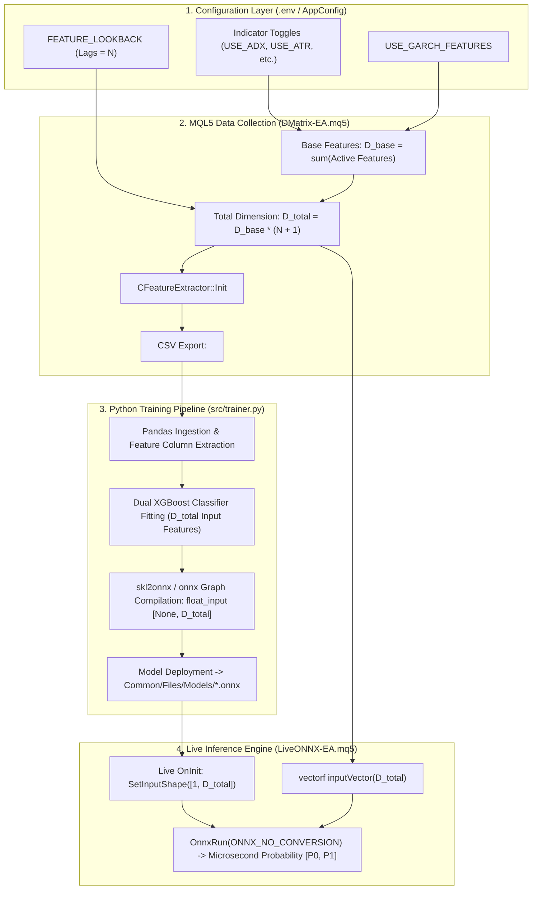
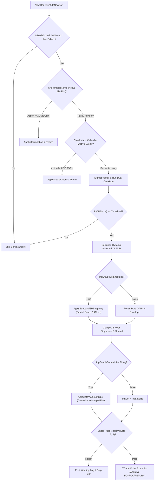
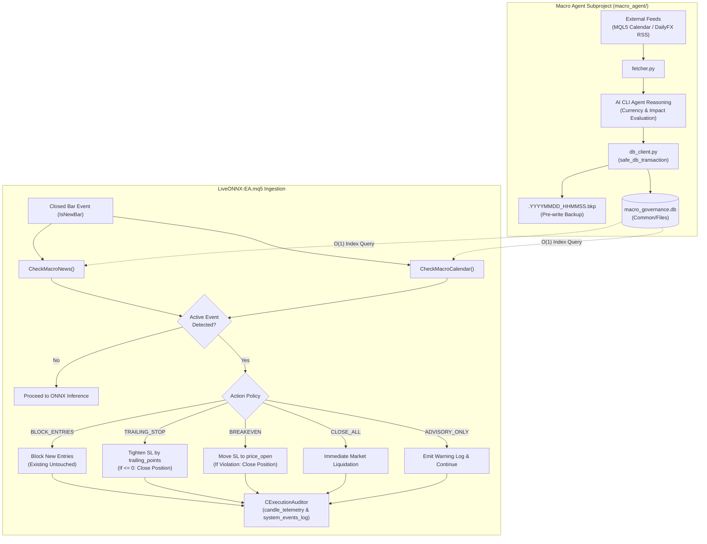

# Institutional Input Taxonomy, Econometric Foundations & Parameter Impact Matrix

**Document Version:** 2.0.0  
**Author:** Senior Quantitative Researcher, Forex ML Specialist & Financial Architect  
**System Standard:** Eastern European Time / Eastern European Summer Time (EET/EEST, MT5 Server Time: UTC+2 / UTC+3)  
**Applicability:** Python MLOps Pipeline (`src/`), MetaTrader 5 Strategy Tester (`DMatrix-EA.mq5`), Live Execution Engine (`LiveONNX-EA.mq5`), Macroeconomic SQLite Governance (`macro_governance.db`), Autonomous Macro Collector (`macro_agent/`), and Execution Telemetry Audit Engine (`AuditLogs/*.db`).

---

## Table of Contents
1. [Executive Summary & Architectural Invariants](#1-executive-summary--architectural-invariants)
2. [Universal Master Cross-Reference Index (148 Parameters)](#2-universal-master-cross-reference-index-148-parameters)
3. [Deep-Dive Taxonomy & Quantitative Sensitivity Matrix](#3-deep-dive-taxonomy--quantitative-sensitivity-matrix)
   - [3.1 Infrastructure, Executables & Orchestration Paths](#31-infrastructure-executables--orchestration-paths)
   - [3.2 Strategy Tester Backtest Simulation & Watchdog Controls](#32-strategy-tester-backtest-simulation--watchdog-controls)
   - [3.3 Anomaly & Pandemic Blackout Regime Governance](#33-anomaly--pandemic-blackout-regime-governance)
   - [3.4 Triple Barrier Momentum Labeling Engine](#34-triple-barrier-momentum-labeling-engine)
   - [3.5 Intraday Session Schedule & Microstructure Liquidity Windows](#35-intraday-session-schedule--microstructure-liquidity-windows)
   - [3.6 Econometric GARCH(1,1) Volatility Forecasting Engine](#36-econometric-garch11-volatility-forecasting-engine)
   - [3.7 Feature Vector Dimension & Sequential Lookback Architecture](#37-feature-vector-dimension--sequential-lookback-architecture)
   - [3.8 Feature Extraction Toggles (13 Indicator & Microstructure Groups)](#38-feature-extraction-toggles-13-indicator--microstructure-groups)
   - [3.9 Technical & Econometric Indicator Mathematical Parameters](#39-technical--econometric-indicator-mathematical-parameters)
   - [3.10 Dual XGBoost Supervised Learning Hyperparameters](#310-dual-xgboost-supervised-learning-hyperparameters)
   - [3.11 Bayesian Hyperparameter Optimization Engine (Optuna)](#311-bayesian-hyperparameter-optimization-engine-optuna)
   - [3.12 ML Directional Evaluation & Threshold Sensitivity Grid Parameters](#312-ml-directional-evaluation--threshold-sensitivity-grid-parameters)
   - [3.13 Live Execution & Directional Governance](#313-live-execution--directional-governance)
   - [3.14 Structural Support & Resistance (S&R) Snapping Subsystem](#314-structural-support--resistance-sr-snapping-subsystem)
   - [3.15 Quantitative Risk & Margin Viability Governance Filter](#315-quantitative-risk--margin-viability-governance-filter)
   - [3.16 Live Dynamic GARCH Stop Sizing Engine](#316-live-dynamic-garch-stop-sizing-engine)
   - [3.17 ONNX Model Routing & Graph Deployment Overrides](#317-onnx-model-routing--graph-deployment-overrides)
   - [3.18 Consecutive Signal & Position Management Subsystem](#318-consecutive-signal--position-management-subsystem)
   - [3.19 Execution & Telemetry Audit Logging Engine](#319-execution--telemetry-audit-logging-engine)
   - [3.20 Macroeconomic Calendar & News SQLite Governance Engine](#320-macroeconomic-calendar--news-sqlite-governance-engine)
   - [3.21 Macro Agent Collector & News Scraper Controls](#321-macro-agent-collector--news-scraper-controls)
4. [Cross-Network Impact & Downstream Propagation Graphs](#4-cross-network-impact--downstream-propagation-graphs)
   - [4.1 Feature Parameter to ONNX Graph Tensor Dimension Propagation](#41-feature-parameter-to-onnx-graph-tensor-dimension-propagation)
   - [4.2 Pre-Trade Governance & Viability Execution Decision Gate](#42-pre-trade-governance--viability-execution-decision-gate)
   - [4.3 Macroeconomic Interception & Defensive Action Lifecycle](#43-macroeconomic-interception--defensive-action-lifecycle)
5. [Codebase Parameter Audit: Inconsistencies, Vulnerabilities & Edge-Case Findings](#5-codebase-parameter-audit-inconsistencies-vulnerabilities--edge-case-findings)
6. [Didactic References & Authoritative Further Reading](#6-didactic-references--authoritative-further-reading)

---

## 1. Executive Summary & Architectural Invariants

In institutional algorithmic Foreign Exchange (Forex) quantitative trading, model stability requires an unbreakable contract across data generation, statistical learning, and real-time execution. The **MT5-FX-Countdown** platform eliminates train-serving skew and execution degradation through five inviolable architectural principles:

1. **Zero Train-Serving Skew Guarantee**:
   The modular feature extraction engine [`CFeatureExtractor`](../MQL5/Include/FeatureExtractor.mqh) is compiled identically into both the historical data collector [`DMatrix-EA.mq5`](../MQL5/Experts/DMatrix-EA.mq5) and the live execution expert [`LiveONNX-EA.mq5`](../MQL5/Experts/LiveONNX-EA.mq5). Modifying any indicator parameter or feature toggle alters the feature representation synchronously across historical training and live microsecond inference.
2. **Universal Timezone Standard (EET/EEST - MT5 Server Time)**:
   All temporal boundaries, daily schedules, pandemic blackout windows, and SQLite macroeconomic event timestamps operate strictly in **Eastern European Time / Eastern European Summer Time (EET/EEST, UTC+2 in winter / UTC+3 in summer)**. This standard aligns with institutional 17:00 New York daily closes, yielding exactly 5 trading candles per week and eliminating weekend candle artifacts ([Campbell, Lo, & MacKinlay, 1997](#didactic-references)).
3. **Net Liquid Profit Outcome Classification**:
   Trade outcomes in `DMatrix-EA` are strictly labeled as binary opportunities:
   $$\text{Label} = \begin{cases} 1.0f & \text{if } \text{DealReason} = \text{TP} \land (\text{Profit} + \text{Swap} + \text{Commission}) > 0.0 \\ 0.0f & \text{otherwise} \end{cases}$$
   Negative or break-even trades resulting from slippage, commission, or overnight swap fees are strictly labeled as $0.0f$ (`NOT_OPEN`), enforcing institutional cost-awareness ([López de Prado, 2018](#didactic-references)).
4. **Zero-Copy Flat 1D Float ONNX Graphs**:
   Trained models are compiled into flat single-precision Float tensors with shape `[None, num_features] -> [None, 2]` without `ZipMap` operators. Live inference leverages MQL5 native `vectorf` structures executed via `OnnxRun(..., ONNX_NO_CONVERSION, ...)` achieving sub-millisecond execution latency.
5. **Decoupled Macroeconomic & Execution Telemetry Governance**:
   Exogenous shocks (interest rate announcements, labor prints, breaking geopolitical escalations) are intercepted prior to inference via a dedicated SQLite database (`macro_governance.db`), while end-to-end execution friction, probability entropy, and trade lifecycles are immutably logged into per-session SQLite audit databases (`AuditLogs/<Symbol>_<TF>_<Timestamp>.db`).

---

## 2. Universal Master Cross-Reference Index (148 Parameters)

The following master index maps every parameter in the quantitative trading system across its three operating environments:
- **`Env/Py`**: Managed via `.env` and typed in Python [`src/config.py`](../src/config.py) (`AppConfig`).
- **`DMatrix`**: Declared as an `input` in [`MQL5/Experts/DMatrix-EA.mq5`](../MQL5/Experts/DMatrix-EA.mq5).
- **`LiveONNX`**: Declared as an `input` in [`MQL5/Experts/LiveONNX-EA.mq5`](../MQL5/Experts/LiveONNX-EA.mq5).
- **`MacroAgent`**: Managed in [`macro_agent/`](../macro_agent/) (`db_client.py` schema and `fetcher.py` CLI).

| # | Exact Parameter Identifier | Data Type | Env/Py | DMatrix | LiveONNX | MacroAgent | Functional Classification |
|---|----------------------------|:---------:|:------:|:-------:|:--------:|:----------:|---------------------------|
| 1 | `MT5_PATH` | Path | Yes | No | No | No | Infrastructure & Executable |
| 2 | `METAEDITOR_PATH` | Path | Yes | No | No | No | Infrastructure & Compiler |
| 3 | `MT5_DATA_PATH` | Path / None | Yes | No | No | No | Terminal Local Roaming Dir |
| 4 | `MT5_COMMON_PATH` | Path / None | Yes | No | No | Yes | Shared Common Directory |
| 5 | `SYMBOL` | string | Yes | Chart | Chart | Yes | Asset Specification |
| 6 | `TIMEFRAME` | string | Yes | Chart | Chart | No | Temporal Discretization |
| 7 | `MAGIC_NUMBER` / `InpMagicNumber` | ulong | Yes | Yes | Yes | No | Order Routing & Isolation |
| 8 | `FROM_DATE` | string (Date) | Yes | Tester | Tester | No | Backtest In-Sample Boundary |
| 9 | `TO_DATE` | string (Date) | Yes | Tester | Tester | No | Backtest Out-of-Sample Boundary |
| 10 | `SHUTDOWN_TERMINAL` | int (0/1) | Yes | No | No | No | OS Process Management |
| 11 | `BACKTEST_TIMEOUT` | int (sec) | Yes | No | No | No | Subprocess Lifecycle Watchdog |
| 12 | `WATCHDOG_POLL_INTERVAL` | int (sec) | Yes | No | No | No | Heartbeat Polling Frequency |
| 13 | `SKIP_DATASET_GENERATION` | bool | Yes | No | No | No | MLOps Cache & Pipeline Gate |
| 14 | `AVOID_PANDEMICTIME` / `InpAvoidPandemicTime` | bool | Yes | Yes | No | No | Regime Filter (Crisis Blackout) |
| 15 | `PANDEMIC_START_DATE` / `InpPandemicStartTime` | datetime | Yes | Yes | No | No | Regime Blackout Lower Bound |
| 16 | `PANDEMIC_END_DATE` / `InpPandemicEndTime` | datetime | Yes | Yes | No | No | Regime Blackout Upper Bound |
| 17 | `FEATURE_LOOKBACK` / `InpFeatureLookback` | int | Yes | Yes | Yes | No | Sequential Lag Horizon ($N$) |
| 18 | `LABEL_HORIZON_BARS` / `InpLabelHorizonBars` | int | Yes | Yes | No | No | Triple Barrier Vertical Horizon |
| 19 | `LABEL_MIN_POINTS` / `InpLabelMinPoints` | int | Yes | Yes | No | No | Triple Barrier Upper Target (TP) |
| 20 | `LABEL_MAX_ADVERSE_POINTS` / `InpLabelMaxAdversePoints` | int | Yes | Yes | No | No | Triple Barrier Lower Target (SL) |
| 21 | `TRADE_MONDAY` / `InpTradeMonday` | bool | Yes | Yes | Yes | No | Session Schedule Gate |
| 22 | `TRADE_MONDAY_START` / `InpMondayStartTime` | string (Time) | Yes | Yes | Yes | No | Monday Session Open Window |
| 23 | `TRADE_MONDAY_END` / `InpMondayEndTime` | string (Time) | Yes | Yes | Yes | No | Monday Session Close Window |
| 24 | `TRADE_TUESDAY` / `InpTradeTuesday` | bool | Yes | Yes | Yes | No | Session Schedule Gate |
| 25 | `TRADE_TUESDAY_START` / `InpTuesdayStartTime` | string (Time) | Yes | Yes | Yes | No | Tuesday Session Open Window |
| 26 | `TRADE_TUESDAY_END` / `InpTuesdayEndTime` | string (Time) | Yes | Yes | Yes | No | Tuesday Session Close Window |
| 27 | `TRADE_WEDNESDAY` / `InpTradeWednesday` | bool | Yes | Yes | Yes | No | Session Schedule Gate |
| 28 | `TRADE_WEDNESDAY_START` / `InpWednesdayStartTime` | string (Time) | Yes | Yes | Yes | No | Wednesday Session Open Window |
| 29 | `TRADE_WEDNESDAY_END` / `InpWednesdayEndTime` | string (Time) | Yes | Yes | Yes | No | Wednesday Session Close Window |
| 30 | `TRADE_THURSDAY` / `InpTradeThursday` | bool | Yes | Yes | Yes | No | Session Schedule Gate |
| 31 | `TRADE_THURSDAY_START` / `InpThursdayStartTime` | string (Time) | Yes | Yes | Yes | No | Thursday Session Open Window |
| 32 | `TRADE_THURSDAY_END` / `InpThursdayEndTime` | string (Time) | Yes | Yes | Yes | No | Thursday Session Close Window |
| 33 | `TRADE_FRIDAY` / `InpTradeFriday` | bool | Yes | Yes | Yes | No | Session Schedule Gate |
| 34 | `TRADE_FRIDAY_START` / `InpFridayStartTime` | string (Time) | Yes | Yes | Yes | No | Friday Session Open Window |
| 35 | `TRADE_FRIDAY_END` / `InpFridayEndTime` | string (Time) | Yes | Yes | Yes | No | Friday Weekend Gap Prevention |
| 36 | `GARCH_HORIZON` / `InpGarchHorizon` | int | Yes | Yes | Yes | No | Multi-Step Volatility Horizon |
| 37 | `PRICE_SIZE` / `InpPriceSize` | int | Yes | Yes | Yes | No | Sample Return Variance Anchor |
| 38 | `GARCH_ALPHA` / `InpGarchAlpha` | double | Yes | Yes | Yes | No | ARCH Shock Reaction ($\alpha$) |
| 39 | `GARCH_BETA` / `InpGarchBeta` | double | Yes | Yes | Yes | No | GARCH Persistence ($\beta$) |
| 40 | `USE_GARCH_FEATURES` / `InpUseGarchFeatures` | bool | Yes | Yes | Yes | No | Econometric Feature Inclusion |
| 41 | `USE_ADX` / `InpUseADX` | bool | Yes | Yes | Yes | No | Trend Strength Feature Inclusion |
| 42 | `USE_ATR` / `InpUseATR` | bool | Yes | Yes | Yes | No | Range Volatility Feature Inclusion |
| 43 | `USE_BANDS` / `InpUseBANDS` | bool | Yes | Yes | Yes | No | Dispersion Feature Inclusion |
| 44 | `USE_MACD` / `InpUseMACD` | bool | Yes | Yes | Yes | No | Momentum Convergence Feature |
| 45 | `USE_FAST_MA` / `InpUseFastMA` | bool | Yes | Yes | Yes | No | Short-Term Trend Distance |
| 46 | `USE_SLOW_MA` / `InpUseSlowMA` | bool | Yes | Yes | Yes | No | Long-Term Trend Distance |
| 47 | `USE_RSI` / `InpUseRSI` | bool | Yes | Yes | Yes | No | Velocity Momentum Feature |
| 48 | `USE_STOCHASTIC` / `InpUseStochastic` | bool | Yes | Yes | Yes | No | Oscillator Extremum Feature |
| 49 | `USE_CANDLESTICK` / `InpUseCandlestick` | bool | Yes | Yes | Yes | No | Microstructure Price Action |
| 50 | `USE_TIMESTAMP_WEEK` / `InpUseTimestampWeek` | bool | Yes | Yes | Yes | No | Day-of-Week Seasonality Feature |
| 51 | `USE_TIMESTAMP_DAY` / `InpUseTimestampDay` | bool | Yes | Yes | Yes | No | Intraday Session Seasonality |
| 52 | `USE_OPEN_MARKETS` / `InpUseOpenMarkets` | bool | Yes | Yes | Yes | No | Global Session Overlap Encoding |
| 53 | `USE_SPREAD` / `InpUseSpread` | bool | Yes | Yes | Yes | No | Liquidity Cost Microstructure |
| 54 | `ADX_PERIOD` / `InpADXPeriod` | int | Yes | Yes | Yes | No | Directional Movement Smoothing |
| 55 | `ATR_PERIOD` / `InpATRPeriod` | int | Yes | Yes | Yes | No | True Range Moving Average |
| 56 | `BANDS_PERIOD` / `InpBandsPeriod` | int | Yes | Yes | Yes | No | Bollinger Central Moving Average |
| 57 | `BANDS_SHIFT` / `InpBandsShift` | int | Yes | Yes | Yes | No | Bollinger Horizontal Displacement |
| 58 | `BANDS_DEV` / `InpBandsDev` | double | Yes | Yes | Yes | No | Standard Deviation Envelope |
| 59 | `BANDS_APPLIED_PRICE` / `InpBandsAppliedPrice` | ENUM | Yes | Yes | Yes | No | Applied Price Discretization |
| 60 | `MACD_FAST` / `InpMACDFastPeriod` | int | Yes | Yes | Yes | No | Fast Exponential Filter Period |
| 61 | `MACD_SLOW` / `InpMACDSlowPeriod` | int | Yes | Yes | Yes | No | Slow Exponential Filter Period |
| 62 | `MACD_SIGNAL` / `InpMACDSignalPeriod` | int | Yes | Yes | Yes | No | Signal Moving Average Period |
| 63 | `MACD_APPLIED_PRICE` / `InpMACDAppliedPrice` | ENUM | Yes | Yes | Yes | No | Applied Price Discretization |
| 64 | `FAST_MA_PERIOD` / `InpFastMAPeriod` | int | Yes | Yes | Yes | No | Fast Trend Line Period |
| 65 | `FAST_MA_SHIFT` / `InpFastMAShift` | int | Yes | Yes | Yes | No | Fast Trend Displacement |
| 66 | `FAST_MA_METHOD` / `InpFastMAMethod` | ENUM | Yes | Yes | Yes | No | Smoothing Algorithm (EMA/SMA) |
| 67 | `FAST_MA_APPLIED_PRICE` / `InpFastMAAppliedPrice` | ENUM | Yes | Yes | Yes | No | Applied Price Discretization |
| 68 | `SLOW_MA_PERIOD` / `InpSlowMAPeriod` | int | Yes | Yes | Yes | No | Slow Baseline Trend Period |
| 69 | `SLOW_MA_SHIFT` / `InpSlowMAShift` | int | Yes | Yes | Yes | No | Slow Baseline Displacement |
| 70 | `SLOW_MA_METHOD` / `InpSlowMAMethod` | ENUM | Yes | Yes | Yes | No | Smoothing Algorithm (EMA/SMA) |
| 71 | `SLOW_MA_APPLIED_PRICE` / `InpSlowMAAppliedPrice` | ENUM | Yes | Yes | Yes | No | Applied Price Discretization |
| 72 | `RSI_PERIOD` / `InpRSIPeriod` | int | Yes | Yes | Yes | No | Relative Momentum Lookback |
| 73 | `RSI_APPLIED_PRICE` / `InpRSIAppliedPrice` | ENUM | Yes | Yes | Yes | No | Applied Price Discretization |
| 74 | `STOCH_K` / `InpStochK` | int | Yes | Yes | Yes | No | Stochastic %K Fast Period |
| 75 | `STOCH_D` / `InpStochD` | int | Yes | Yes | Yes | No | Stochastic %D Signal Period |
| 76 | `STOCH_SLOWING` / `InpStochSlowing` | int | Yes | Yes | Yes | No | Stochastic Internal Smoothing |
| 77 | `STOCH_METHOD` / `InpStochMethod` | ENUM | Yes | Yes | Yes | No | Smoothing Algorithm |
| 78 | `STOCH_PRICE_FIELD` / `InpStochPriceField` | ENUM | Yes | Yes | Yes | No | Price Basis (High/Low vs Close) |
| 79 | `XGB_MAX_DEPTH` | int | Yes | No | No | No | Tree Structural Complexity |
| 80 | `XGB_ETA` | double | Yes | No | No | No | Gradient Shrinkage Factor |
| 81 | `XGB_SUBSAMPLE` | double | Yes | No | No | No | Row Stochastic Subsampling |
| 82 | `XGB_COLSAMPLE_BYTREE` | double | Yes | No | No | No | Column Feature Subsampling |
| 83 | `XGB_MIN_CHILD_WEIGHT` | double | Yes | No | No | No | Leaf Hessian Partition Threshold |
| 84 | `XGB_LAMBDA` | double | Yes | No | No | No | L2 Regularization Penalty |
| 85 | `XGB_ALPHA` | double | Yes | No | No | No | L1 Sparsity Regularization Penalty |
| 86 | `XGB_ROUNDS` | int | Yes | No | No | No | Maximum Boosting Iterations |
| 87 | `XGB_EARLY_STOPPING_ROUNDS` | int | Yes | No | No | No | OOS Generalization Early Stop |
| 88 | `VALIDATION_PERCENTAGE` | double | Yes | No | No | No | Chronological Validation Ratio |
| 89 | `OPTUNA_TRIALS` | int | Yes | No | No | No | Bayesian Search Budget |
| 90 | `EVAL_CLASSIFICATION_THRESHOLD` | float | Yes | No | No | No | Validation Baseline Decision Cutoff |
| 91 | `OPTUNA_OBJECTIVE_METRIC` | string | Yes | No | No | No | Optuna Target Metric |
| 92 | `EVAL_ENABLE_THRESHOLD_GRID` | bool (0/1) | Yes | No | No | No | Sensitivity Grid Telemetry Toggle |
| 93 | `EVAL_THRESHOLD_MIN` | float | Yes | No | No | No | Parametric Grid Minimum Bound |
| 94 | `EVAL_THRESHOLD_MAX` | float | Yes | No | No | No | Parametric Grid Maximum Bound |
| 95 | `EVAL_THRESHOLD_STEP` | float | Yes | No | No | No | Parametric Grid Resolution Step |
| 96 | `InpTradeDirection` | ENUM | No | No | Yes | No | Directional Execution Filter |
| 97 | `InpMinimalLevelAcceptedBuy` | double | No | No | Yes | No | Calibrated Probability Gate (Buy) |
| 98 | `InpMinimalLevelAcceptedSell` | double | No | No | Yes | No | Calibrated Probability Gate (Sell) |
| 99 | `InpLotSize` | double | No | Yes | Yes | No | Transaction Order Volume |
| 100 | `InpEnableSRSnapping` | bool | No | No | Yes | No | Structural Level Optimization |
| 101 | `InpSRLookbackBars` | int | No | No | Yes | No | Structural Extremum Lookback |
| 102 | `InpSRPivotStrength` | int | No | No | Yes | No | Fractal Extrema Radius ($K$) |
| 103 | `InpSROffsetPoints` | int | No | No | Yes | No | Sweep Protection & Fill Buffer |
| 104 | `InpSRZoneSelection` | ENUM | No | No | Yes | No | Payoff Profile Target (Near/Far) |
| 105 | `InpEnableRiskFilter` | bool | No | No | Yes | No | Master Pre-Trade Gatekeeper |
| 106 | `InpEnableDynamicLotSizing` | bool | No | No | Yes | No | Dynamic Risk Volume Downsizing |
| 107 | `InpMaxLotSize` | double | No | No | Yes | No | Dynamic Sizing Ceiling Lot |
| 108 | `InpMarginSafetyMultiplier` | double | No | No | Yes | No | Broker Margin Call Cushion |
| 109 | `InpMaxRiskRewardRatio` | double | No | No | Yes | No | Asymmetric Toxicity Guard |
| 110 | `InpMaxTradeRiskPct` | double | No | No | Yes | No | Maximum Balance Budget Loss |
| 111 | `InpConsecutiveMode` | ENUM | No | No | Yes | No | Consecutive Signal Execution Mode |
| 112 | `InpMaxConsecutiveOrders` | int | No | No | Yes | No | Directional Concurrent Position Cap |
| 113 | `InpHurdleProfitPct` | double (%) | No | No | Yes | No | TP Distance Hurdle Before Ratchet |
| 114 | `InpProfitLockPct` | double (%) | No | No | Yes | No | Accrued Profit Ratio Locked to SL |
| 115 | `InpAntiChopMinDisplacement` | int (pts) | No | No | Yes | No | Minimum Bar Displacement Filter |
| 116 | `InpSafetyOffsetPoints` | int (pts) | No | No | Yes | No | Breakeven & Stop Buffer Offset |
| 117 | `InpEnableSwapAmortization` | bool | No | No | Yes | No | Transversal Swap & Cost Amortization |
| 118 | `InpConsecutiveSlotFilter` | bool | No | No | Yes | No | Slot Amplitude Expansion Gate |
| 119 | `InpIgnoreConflictingSignals` | bool | No | No | Yes | No | Same-Candle Conflicting Signal Filter |
| 120 | `InpEnableOpposingRegimeFilter` | bool | No | No | Yes | No | Active Position Adverse Regime Defense |
| 121 | `InpOpposingStreakThreshold` | int (bars) | No | No | Yes | No | Counter-Model Streak Trigger Count |
| 122 | `InpOpposingAction` | ENUM | No | No | Yes | No | Adverse Defensive Action Policy |
| 123 | `InpOpposingTrailingPoints` | int (pts) | No | No | Yes | No | Defensive Trailing Tightening Step |
| 124 | `InpOpposingRecalculateRatio` | double | No | No | Yes | No | Dynamic Barrier Contraction Ratio |
| 125 | `InpEnableCalendarFilter` | bool | No | No | Yes | No | Scheduled News Event Interceptor |
| 126 | `InpEnableNewsFilter` | bool | No | No | Yes | No | Breaking Macro Blacklist Gate |
| 127 | `InpRiskGarchHorizon` | int | No | No | Yes | No | Dynamic Risk Sizing Horizon |
| 128 | `InpKTP` | double | No | No | Yes | No | Dynamic GARCH TP Coefficient |
| 129 | `InpKSL` | double | No | No | Yes | No | Dynamic GARCH SL Coefficient |
| 130 | `InpModelBuyPath` | string | No | No | Yes | No | ONNX File System Override (Buy) |
| 131 | `InpModelSellPath` | string | No | No | Yes | No | ONNX File System Override (Sell) |
| 132 | `InpIgnoreAudit` | bool | No | No | Yes | No | Telemetry & Audit SQLite Bypass |
| 133 | `MACRO_DATABASE_NAME` | string | Const | No | Yes | Yes | SQLite Macro DB (`macro_governance.db`) |
| 134 | `AUDIT_DIRECTORY_NAME` | string | Const | No | Yes | No | Mandatory Prediction Audit Folder |
| 135 | `calendar_events.id` | int (PK) | No | No | Schema | Yes | Auto-incrementing Event ID |
| 136 | `calendar_events.symbol` | string | No | No | Schema | Yes | Event Pair / Currency (`EURUSD`/`USD`/`GLOBAL`) |
| 137 | `calendar_events.title` | string | No | No | Schema | Yes | Official Event Title (e.g. Non-Farm Payrolls) |
| 138 | `calendar_events.description` | string | No | No | Schema | Yes | Macroeconomic Release Description |
| 139 | `calendar_events.start_time` | string (DT) | No | No | Schema | Yes | Event Start Window in EET/EEST |
| 140 | `calendar_events.end_time` | string (DT) | No | No | Schema | Yes | Event End Window in EET/EEST |
| 141 | `calendar_events.action` | string (Enum) | No | No | Schema | Yes | Protective Action (`BLOCK_ENTRIES`, etc.) |
| 142 | `calendar_events.trailing_points` | int (pts) | No | No | Schema | Yes | Trailing Stop Distance in Points |
| 143 | `news_events.symbol` | string (PK) | No | No | Schema | Yes | Breaking Blacklist Target Symbol |
| 144 | `news_events.title` | string | No | No | Schema | Yes | Breaking News Headline |
| 145 | `news_events.description` | string | No | No | Schema | Yes | Breaking News Market Threat Detail |
| 146 | `news_events.action` | string (Enum) | No | No | Schema | Yes | Breaking Threat Action Policy |
| 147 | `news_events.trailing_points` | int (pts) | No | No | Schema | Yes | Breaking Trailing Distance in Points |
| 148 | `fetcher.py` CLI Args / Constants | CLI Args | No | No | No | Yes | `--symbol`, `--currency`, `--calendar`, `--news` |

---

## 3. Deep-Dive Taxonomy & Quantitative Sensitivity Matrix

### 3.1 Infrastructure, Executables & Orchestration Paths

#### `MT5_PATH`
- **Data Type & Scope:** `pathlib.Path` | Scope: `.env`, Python Orchestrator (`src/mt5_client.py`).
- **Boundaries:** Absolute system path to 64-bit MT5 executable. Regex: `^[a-zA-Z]:\\(?:[^\\/:*?"<>|\r\n]+\\)*terminal64\.exe$`.
- **Quantitative & Econometric Purpose:** Headless automation of the Strategy Tester simulation engine to generate historical training datasets without human intervention.
- **Sensitivity & Downstream Propagation:**
  - *5-Day Cycle:* Unaffected during market hours; critical at pipeline execution.
  - *7 Currency Pairs:* Identical path for all pairs.
  - *7 Timeframes:* Higher memory requirements for high-resolution M1 backtests.
  - *Slippage/Drawdown:* None directly; incorrect 32-bit binaries cause crashes during ONNX tensor allocation.
- **Routing:** `.env` $\to$ `AppConfig.mt5_path` $\to$ `MT5Client.initialize()` $\to$ Subprocess `terminal64.exe /config:backtest.ini`.
- **Literature Citation:** [MetaQuotes Software Corp. (2026)](#didactic-references), *MetaTrader 5 Headless Terminal Automation Protocol*.

#### `METAEDITOR_PATH`
- **Data Type & Scope:** `pathlib.Path` | Scope: `.env`, Python Orchestrator (`src/compiler.py`).
- **Boundaries:** Absolute path to 64-bit compiler. Regex: `^[a-zA-Z]:\\(?:[^\\/:*?"<>|\r\n]+\\)*metaeditor64\.exe$`.
- **Quantitative & Econometric Purpose:** Compiles `DMatrix-EA.mq5` and `LiveONNX-EA.mq5` into `.ex5` bytecode.
- **Sensitivity & Downstream Propagation:**
  - Missing path halts pipeline at compilation stage with zero bytecode artifacts.
- **Routing:** `.env` $\to$ `AppConfig.metaeditor_path` $\to$ `Compiler.compile_expert()`.

#### `MT5_DATA_PATH` & `MT5_COMMON_PATH`
- **Data Type & Scope:** `pathlib.Path | None` | Scope: `.env`, Python Orchestrator.
- **Boundaries:** Valid Windows folder paths. If omitted or empty, resolved dynamically via `MetaTrader5.terminal_info()`.
- **Quantitative & Econometric Purpose:**
  - `MT5_DATA_PATH`: Terminal-specific directory for compiled experts (`MQL5/Experts`) and presets (`MQL5/Presets`).
  - `MT5_COMMON_PATH`: Central shared directory across all terminal instances for datasets (`Common/Files`), deployed ONNX models (`Common/Files/Models`), the SQLite macroeconomic database (`macro_governance.db`), and session telemetry databases (`Common/Files/AuditLogs`).
- **Routing:** `.env` $\to$ `AppConfig` $\to$ `PresetGenerator`, `ModelDeployer`, `db_client.py`.

---

### 3.2 Strategy Tester Backtest Simulation & Watchdog Controls

#### `SYMBOL`
- **Data Type & Scope:** `string` | Scope: `.env`, Python Orchestrator, Model Filenames.
- **Boundaries:** 6-character ISO Forex pair (`EURUSD`, `GBPUSD`, `USDJPY`, `AUDUSD`, `USDCAD`, `USDCHF`, `NZDUSD`) or broker-suffixed equivalents (`EURUSD.r`, `EURUSDm`). Regex: `^[A-Z]{6}(\.[a-zA-Z0-9]+)?$`.
- **Quantitative & Econometric Purpose:** Identifies the financial stochastic asset. Forex currency pairs exhibit heterogeneous liquidity, spread, volatility clustering, and microstructure dynamics ([Campbell, Lo, & MacKinlay, 1997](#didactic-references)).
- **Cross-Pair Microstructure Heterogeneity:**
  - **EURUSD**: Tightest average spread (0.1 - 0.4 pips); high liquidity depth; low volatility clustering ($\beta \approx 0.90$); highly sensitive to ECB-Fed interest rate differentials.
  - **GBPUSD**: High average true range (70 - 130 pips/day); pronounced fat tails (kurtosis $\kappa > 6.0$); susceptible to sudden policy-driven momentum spikes.
  - **USDJPY**: Key Asian session benchmark; tight spread; highly correlated with US 10-Year Treasury Yield spreads ($r > 0.75$).
  - **AUDUSD & NZDUSD**: Commodity/Risk-beta currencies; heavily impacted by global equity sentiment and Chinese manufacturing PMIs.
  - **USDCAD**: Petrocurrency; strongly negatively correlated with WTI Crude Oil price shocks.
  - **USDCHF**: Traditional safe-haven asset; negative correlation with EURUSD; subject to SNB peg/floor intervention dynamics.
- **Routing:** `.env` $\to$ `AppConfig.symbol` $\to$ `MT5Client`, `Trainer`, `PresetGenerator`, `DMatrix-EA`, `LiveONNX-EA`.

#### `TIMEFRAME`
- **Data Type & Scope:** `string` | Scope: `.env`, Python Orchestrator.
- **Boundaries:** Strictly one of `["PERIOD_M1", "PERIOD_M5", "PERIOD_M15", "PERIOD_M30", "PERIOD_H1", "PERIOD_H2", "PERIOD_D1"]` or clean equivalents `["M1", "M5", "M15", "M30", "H1", "H2", "D1"]`.
- **Quantitative & Econometric Purpose:** Sets the discrete sampling interval $\Delta t$. Governs the trade-off between market microstructure noise and sample size ([Roll, 1984](#didactic-references)).
- **Cross-Timeframe Scaling Matrix:**
  - **M1 ($\Delta t = 60\,\text{s}$)**: Extreme noise-to-signal ratio (> 90%); bid-ask bounce dominates returns; spread accounts for 50-150% of typical bar range. Requires shallow tree depth (`XGB_MAX_DEPTH=2`), ultra-low learning rate (`XGB_ETA=0.010`), and strict early stopping.
  - **M5 ($\Delta t = 300\,\text{s}$)**: High noise (75-80%); suitable for high-frequency intraday momentum; spread-to-ATR ratio 15-35%.
  - **M15 / M30**: Transitional intraday regime; balanced noise-to-signal ratio; ideal for capturing session breakouts.
  - **H1 ($\Delta t = 3600\,\text{s}$ - Institutional Standard)**: Signal-to-noise ratio is optimal; spread represents < 3% of ATR; low computational load; robust GARCH volatility convergence.
  - **H2 / D1**: Low noise (< 20%); highly persistent macro trends; requires wider stop buffers and longer holding horizons.
- **Routing:** `.env` $\to$ `AppConfig.timeframe` / `clean_timeframe` $\to$ `MT5Client`, `DatasetManager`, `Trainer`.

#### `MAGIC_NUMBER` / `InpMagicNumber`
- **Data Type & Scope:** `ulong` | Scope: `.env` (`MAGIC_NUMBER`), `DMatrix-EA.mq5` (`InpMagicNumber`), `LiveONNX-EA.mq5` (`InpMagicNumber`).
- **Boundaries:** Integer in $[1, 2^{64}-1]$. Default: `222100` (`LiveONNX` and `.env.example`), `111100` (`DMatrix-EA`).
- **Quantitative Purpose:** Unique order isolation identifier. Ensures multiple Expert Advisors or concurrent timeframes on the same account do not cross-liquidate or interfere with each other's positions.
- **Routing:** `.env` $\to$ `AppConfig.magic_number` $\to$ `PresetGenerator` $\to$ `LiveONNX-EA.mq5::InpMagicNumber`.

#### `FROM_DATE` & `TO_DATE`
- **Data Type & Scope:** `string` | Scope: `.env`, `src/config.py`.
- **Boundaries:** Date format `YYYY.MM.DD`. Must strictly satisfy `FROM_DATE < TO_DATE`.
- **Quantitative Purpose:** Defines the historical in-sample simulation window for `DMatrix-EA.mq5` dataset collection. Must span multiple market cycles (expansion, contraction, crisis regimes) to prevent backtest regime overfitting ([López de Prado, 2018](#didactic-references)).

#### `SHUTDOWN_TERMINAL`, `BACKTEST_TIMEOUT`, `WATCHDOG_POLL_INTERVAL`, `SKIP_DATASET_GENERATION`
- **Data Types:** `int` (0/1), `int` (sec), `int` (sec), `bool`.
- **Boundaries:** `SHUTDOWN_TERMINAL` $\in \{0, 1\}$; `BACKTEST_TIMEOUT` $\ge 0$ (0 = infinite); `WATCHDOG_POLL_INTERVAL` $\in [1, 60]$; `SKIP_DATASET_GENERATION` $\in \{0, 1\}$.
- **Quantitative Purpose:** MLOps process governance. `SKIP_DATASET_GENERATION=1` bypasses lengthy Strategy Tester reruns if `<Symbol>_<TF>_buy.csv` and `sell.csv` are already present in Common Files, facilitating rapid hyperparameter iteration.

---

### 3.3 Anomaly & Pandemic Blackout Regime Governance

#### `AVOID_PANDEMICTIME`, `PANDEMIC_START_DATE`, `PANDEMIC_END_DATE`
- **Data Types:** `bool`, `string` (datetime: `YYYY.MM.DD HH:MM:SS` in EET/EEST).
- **Boundaries:** Dates in MT5 Server Time. Default: `2020.01.01 00:00:00` to `2021.06.01 00:00:00`.
- **Quantitative & Econometric Purpose:** Filters out extreme non-stationary structural break regimes (such as the COVID-19 March 2020 liquidity shock and emergency central bank interventions) from training data.
- **Boolean Rationale:**
  - `true` (`1`): Bypasses anomalous volatility periods characterized by multi-sigma black swan spreads and flash crashes that will distort normal-market gradient tree split criteria.
  - `false` (`0`): Includes all historical data, testing model robustness against existential systemic shocks.
- **Routing:** `.env` $\to$ `AppConfig` $\to$ `preset_generator.py` $\to$ `DMatrix-EA.mq5::InpAvoidPandemicTime`.

---

### 3.4 Triple Barrier Momentum Labeling Engine

#### `FEATURE_LOOKBACK` / `InpFeatureLookback`
- **Data Type & Scope:** `int` | Scope: `.env`, `DMatrix-EA.mq5`, `LiveONNX-EA.mq5`, `src/config.py`.
- **Boundaries:** `0` to `20` lags (Optimal: `2` to `6`). Default: `4`. Step: `1`.
- **Quantitative Purpose:** Past lag count $[t-N, \dots, t]$ concatenated into the flat feature vector. Imparts temporal state memory to tree boosting models without recurrent neural architectures.
- **Tensor Mathematical Formulation:**
  $$D_{\text{total}} = D_{\text{base}} \times (N + 1)$$
  For $D_{\text{base}} = 26$ features (21 technical/microstructural + 5 GARCH features) and $N = 4$ lags:
  $$D_{\text{total}} = 26 \times (4 + 1) = 130 \text{ float features}$$
- **Routing:** `.env` $\to$ `AppConfig.feature_lookback` $\to$ `DMatrix-EA` $\to$ `trainer.py` $\to$ `onnx_exporter.py` $\to$ `LiveONNX-EA.mq5`.

#### `LABEL_HORIZON_BARS`, `LABEL_MIN_POINTS`, `LABEL_MAX_ADVERSE_POINTS`
- **Data Types:** `int` (bars), `int` (points), `int` (points) | Scope: `.env`, `DMatrix-EA.mq5`.
- **Boundaries:** `LABEL_HORIZON_BARS` $\in [1, 100]$ (Default: `12`); `LABEL_MIN_POINTS` $\in [10, 2000]$ (Default: `150`); `LABEL_MAX_ADVERSE_POINTS` $\in [10, 2000]$ (Default: `150`).
- **Quantitative & Econometric Purpose:** Implements Marcos López de Prado's **Triple Barrier Method** ([López de Prado, 2018](#didactic-references)):
  1. **Upper Horizontal Barrier ($+\Delta P_{\text{upper}}$)**: Take Profit target. Reaching this barrier with net positive financial return yields class $1.0f$ (`OPEN`).
  2. **Lower Horizontal Barrier ($-\Delta P_{\text{lower}}$)**: Stop Loss boundary. Reaching this barrier yields class $0.0f$ (`NOT_OPEN`).
  3. **Vertical Temporal Barrier ($T_{\text{horizon}}$)**: Expiration timeout after $H$ bars. Position closed at market; if net liquid profit $\le 0.0$, strictly labeled as $0.0f$.
- **Downstream Impact:** Directly dictates label distribution, class imbalance, and training target sharpness.

---

### 3.5 Intraday Session Schedule & Microstructure Liquidity Windows

#### `TRADE_<DAY>`, `TRADE_<DAY>_START`, `TRADE_<DAY>_END` (Monday through Friday)
- **Data Types:** `bool`, `string` (time: `HH:MM:SS` in EET/EEST Server Time).
- **Boundaries:** Hours $[0..23]$, Minutes $[0..59]$, Seconds $[0..59]$.
- **Defaults:**
  - Monday: `TRADE_MONDAY=1`, `11:00:00` to `18:00:00`.
  - Tuesday-Thursday: `TRADE_<DAY>=1`, `10:00:00` to `18:00:00`.
  - Friday: `TRADE_FRIDAY=1`, `10:00:00` to `16:00:00`.
- **Quantitative & Microstructure Rationale:**
  - **Monday 00:00 - 10:59 MT5**: Asian session handover; thin liquidity; wide spreads (2.0 - 5.0 pips); high risk of weekend gap whipsaw. System delays trading until London liquidity opens at 10:00-11:00 EET.
  - **Tuesday-Thursday 10:00 - 18:00 MT5**: Institutional transatlantic overlap (London + New York). Maximum market depth; tightest spreads (0.0 - 0.3 pips); highest information-to-noise ratio.
  - **Friday 16:00 - 23:59 MT5**: Institutional liquidation, book squaring, and liquidity provider withdrawal. Spreads expand aggressively; weekend gap risk escalates. Trading halts at 16:00 EET.
- **Special Edge Case Behavior:** If End Time is configured as `00:00:00`, the MQL5 scheduling engine interprets it as "permit all 24 hours of that day". To trade until the end of the day, specify `23:59:59`.
- **Routing:** `.env` $\to$ `AppConfig` $\to$ `PresetGenerator` $\to$ `DMatrix-EA` & `LiveONNX-EA`.

---

### 3.6 Econometric GARCH(1,1) Volatility Forecasting Engine

#### `GARCH_HORIZON`, `PRICE_SIZE`, `GARCH_ALPHA`, `GARCH_BETA`, `USE_GARCH_FEATURES`
- **Data Types:** `int` (bars), `int` (bars), `double`, `double`, `bool`.
- **Boundaries:**
  - `GARCH_HORIZON`: `1` to `50` bars (Optimal: `6` to `12`, Default: `8`).
  - `PRICE_SIZE`: `100` to `5000` bars (Optimal: `300` to `1000`, Default: `500`).
  - `GARCH_ALPHA` ($\alpha$): $> 0.0$, typically `0.02` to `0.15` (Default: `0.05`).
  - `GARCH_BETA` ($\beta$): $> 0.0$, typically `0.80` to `0.95` (Default: `0.92`).
  - **Strict Covariance Stationarity Constraint:**
    $$0.0 < \alpha + \beta < 1.0$$
- **Mathematical Formulations:**
  1. **Conditional Variance Recurrence ([Bollerslev, 1986](#didactic-references)):**
     $$\sigma_t^2 = \omega + \alpha \epsilon_{t-1}^2 + \beta \sigma_{t-1}^2, \quad \omega = \bar{\sigma}^2 (1 - \alpha - \beta)$$
  2. **Multi-Step Cumulative Volatility Forecast:**
     $$\sigma_{t, H}^2 = H \bar{\sigma}^2 + (\sigma_t^2 - \bar{\sigma}^2) \frac{1 - (\alpha + \beta)^H}{1 - (\alpha + \beta)}$$
     $$\sigma_{\text{agg}} = \sqrt{\sigma_{t, H}^2}$$
- **Boolean Rationale (`USE_GARCH_FEATURES`):**
  - `true` (`1`): Injects 5 volatility features ($\omega, \alpha, \beta, \sigma_t, \sigma_{\text{agg}}$) into the feature vector, enabling the XGBoost tree to condition directional probability on volatility regimes.
  - `false` (`0`): Excludes GARCH features, reducing vector dimension by 5 features per lag.
- **Routing:** `.env` $\to$ `AppConfig` $\to$ `CGarchEngine` $\to$ `FeatureExtractor` $\to$ Dynamic TP/SL stops.

---

### 3.7 Feature Vector Dimension & Sequential Lookback Architecture

The total dimensionality $D_{\text{total}}$ of the input tensor processed by ONNX is strictly deterministic:
$$D_{\text{base}} = \sum_{i=1}^{14} \text{Weight}(F_i) \cdot \mathbb{I}(F_i = \text{true})$$
$$D_{\text{total}} = D_{\text{base}} \times (\text{InpFeatureLookback} + 1)$$

| Feature Group | Active Toggle Key | Extracted Indicators & Sub-Components | Feature Weight ($w_i$) |
| :--- | :--- | :--- | :---: |
| 1. ADX | `USE_ADX` | Main ADX, +DI, -DI | 3 |
| 2. ATR | `USE_ATR` | ATR / Price (Normalized Volatility) | 1 |
| 3. Bollinger Bands | `USE_BANDS` | (Close - Middle) / Middle, Bandwidth (Upper - Lower)/Middle | 2 |
| 4. MACD | `USE_MACD` | MACD Main Line, Signal Line | 2 |
| 5. Fast MA | `USE_FAST_MA` | (Close - Fast MA) / Fast MA | 1 |
| 6. Slow MA | `USE_SLOW_MA` | (Close - Slow MA) / Slow MA | 1 |
| 7. RSI | `USE_RSI` | RSI Normalized ([0..100] / 100.0) | 1 |
| 8. Stochastic | `USE_STOCHASTIC` | %K Line, %D Line (Normalized [0..1]) | 2 |
| 9. Candlestick | `USE_CANDLESTICK` | Candle Type (-1/0/1), Normalized Body, Upper Shadow, Lower Shadow | 4 |
| 10. Day of Week | `USE_TIMESTAMP_WEEK` | Encoded Weekday ($0.0 = \text{Mon} \dots 4.0 = \text{Fri}$) / 4.0 | 1 |
| 11. Time of Day | `USE_TIMESTAMP_DAY` | Quarter of Day ($0.0 = 00\text{-}06\text{h} \dots 3.0 = 18\text{-}24\text{h}$) / 3.0 | 1 |
| 12. Open Markets | `USE_OPEN_MARKETS` | Bitmask Code for Active Major Sessions (Sydney, Tokyo, London, NY) | 1 |
| 13. Spread | `USE_SPREAD` | Instantaneous Broker Spread in Points | 1 |
| 14. GARCH Volatility | `USE_GARCH_FEATURES` | $\omega, \alpha, \beta, \sigma_t, \sigma_{\text{agg}}$ | 5 |
| **Full Architecture** | **All 14 Groups Enabled** | **26 Base Features $\times$ 5 Lags ($N=4$)** | **130 Features** |

---

### 3.8 Feature Extraction Toggles (13 Indicator & Microstructure Groups)

Each boolean toggle governs whether its respective econometric or microstructure group is extracted and packed into the feature vector:
- **`USE_ADX`**: Quantifies directional trend intensity versus horizontal consolidation ([Wilder, 1978](#didactic-references)).
- **`USE_ATR`**: Provides rolling true-range volatility normalization.
- **`USE_BANDS`**: Encodes mean-reversion boundaries and volatility squeeze/expansion cycles ([Bollinger, 2001](#didactic-references)).
- **`USE_MACD`**: Captures exponential moving average momentum convergence and divergence ([Appel, 2005](#didactic-references)).
- **`USE_FAST_MA` & `USE_SLOW_MA`**: Decouples short-term tactical momentum from institutional trend baselines.
- **`USE_RSI`**: Measures internal directional velocity and overbought/oversold compression.
- **`USE_STOCHASTIC`**: Captures closing price relative to recent high-low price extremes ([Lane, 1984](#didactic-references)).
- **`USE_CANDLESTICK`**: Microstructural price action features capturing intra-bar liquidity rejection.
- **`USE_TIMESTAMP_WEEK` & `USE_TIMESTAMP_DAY`**: Captures cyclical seasonality and intra-week liquidity flow.
- **`USE_OPEN_MARKETS`**: Institutional liquidity regime encoder reflecting session overlap depth of book.
- **`USE_SPREAD`**: Directly incorporates transaction friction into gradient split criteria.

---

### 3.9 Technical & Econometric Indicator Mathematical Parameters

| Input Name (.env) | MQL5 Input Name | Data Type | Default | Domain / Valid Range | Econometric Rationale & Impact Matrix |
|---|---|:---:|:---:|:---:|---|
| `ADX_PERIOD` | `InpADXPeriod` | `int` | `14` | `7` - `50` (step 1) | Averaging period for directional movement. Too low (< 7): noisy false trend triggers. Too high (> 30): lagging signal. |
| `ATR_PERIOD` | `InpATRPeriod` | `int` | `14` | `5` - `50` (step 1) | Rolling window for true range smoothing. Institutional standard is 14 bars. |
| `BANDS_PERIOD` | `InpBandsPeriod` | `int` | `20` | `10` - `100` (step 1) | Rolling mean window for Bollinger Bands. Defines baseline central tendency. |
| `BANDS_SHIFT` | `InpBandsShift` | `int` | `0` | `-10` to `10` (step 1) | Horizontal bar displacement. Institutional trading mandates 0 to eliminate phase distortion. |
| `BANDS_DEV` | `InpBandsDev` | `double` | `2.0` | `1.0` - `3.5` (step 0.1) | Standard deviation multiplier. Under-allocation (< 1.5): price constantly penetrates bands. Over-allocation (> 3.0): extreme events only. |
| `BANDS_APPLIED_PRICE` | `InpBandsAppliedPrice` | `ENUM` | `0` (`PRICE_CLOSE`) | `0` to `6` | Price field basis: 0=Close, 1=Open, 2=High, 3=Low, 4=Median, 5=Typical, 6=Weighted. |
| `MACD_FAST` | `InpMACDFastPeriod` | `int` | `12` | `5` - `30` (step 1) | Fast EMA period. Controls responsiveness to short-term momentum shifts. |
| `MACD_SLOW` | `InpMACDSlowPeriod` | `int` | `26` | `15` - `60` (step 1) | Slow EMA period. Must strictly satisfy `MACD_SLOW > MACD_FAST`. |
| `MACD_SIGNAL` | `InpMACDSignalPeriod` | `int` | `9` | `3` - `20` (step 1) | Signal smoothing period. Governs trigger line crossover latency. |
| `MACD_APPLIED_PRICE` | `InpMACDAppliedPrice` | `ENUM` | `0` (`PRICE_CLOSE`) | `0` to `6` | Price field applied to MACD exponential smoothing. |
| `FAST_MA_PERIOD` | `InpFastMAPeriod` | `int` | `20` | `5` - `50` (step 1) | Fast trend line period. Captures short-term directional momentum. |
| `FAST_MA_SHIFT` | `InpFastMAShift` | `int` | `0` | `-10` to `10` (step 1) | Horizontal displacement for Fast MA. Must be 0 to prevent lookahead bias. |
| `FAST_MA_METHOD` | `InpFastMAMethod` | `ENUM` | `1` (`MODE_EMA`) | `0` to `3` | Smoothing mode: 0=SMA, 1=EMA, 2=SMMA, 3=LWMA. EMA gives weight to recent shocks. |
| `FAST_MA_APPLIED_PRICE` | `InpFastMAAppliedPrice` | `ENUM` | `0` (`PRICE_CLOSE`) | `0` to `6` | Price field applied to Fast MA calculation. |
| `SLOW_MA_PERIOD` | `InpSlowMAPeriod` | `int` | `50` | `30` - `200` (step 1) | Slow institutional trend anchor. Must strictly satisfy `SLOW_MA > FAST_MA`. |
| `SLOW_MA_SHIFT` | `InpSlowMAShift` | `int` | `0` | `-10` to `10` (step 1) | Horizontal displacement for Slow MA. Mandated 0. |
| `SLOW_MA_METHOD` | `InpSlowMAMethod` | `ENUM` | `1` (`MODE_EMA`) | `0` to `3` | Smoothing mode for Slow MA. |
| `SLOW_MA_APPLIED_PRICE` | `InpSlowMAAppliedPrice` | `ENUM` | `0` (`PRICE_CLOSE`) | `0` to `6` | Price field applied to Slow MA calculation. |
| `RSI_PERIOD` | `InpRSIPeriod` | `int` | `14` | `5` - `30` (step 1) | Rolling window for upward/downward return ratio. Too low (< 5): hyper-volatile noise. |
| `RSI_APPLIED_PRICE` | `InpRSIAppliedPrice` | `ENUM` | `0` (`PRICE_CLOSE`) | `0` to `6` | Price field applied to RSI calculation. |
| `STOCH_K` | `InpStochK` | `int` | `8` | `3` - `30` (step 1) | Number of bars for %K calculation. |
| `STOCH_D` | `InpStochD` | `int` | `3` | `1` - `10` (step 1) | Averaging period for %D moving average line. |
| `STOCH_SLOWING` | `InpStochSlowing` | `int` | `3` | `1` - `10` (step 1) | Internal smoothing parameter to dampen stochastic noise. |
| `STOCH_METHOD` | `InpStochMethod` | `ENUM` | `0` (`MODE_SMA`) | `0` to `3` | Smoothing method for %D calculation. |
| `STOCH_PRICE_FIELD` | `InpStochPriceField` | `ENUM` | `0` (`STO_LOWHIGH`) | `0` or `1` | 0 = Low/High prices; 1 = Close/Close prices. |

---

### 3.10 Dual XGBoost Supervised Learning Hyperparameters

Gradient boosting decision trees optimize the regularized objective function ([Chen & Guestrin, 2016](#didactic-references)):
$$\mathcal{L}(\phi) = \sum_{i} l(\hat{y}_i, y_i) + \sum_{k} \left( \gamma T_k + \frac{1}{2} \lambda \sum_{j=1}^T w_j^2 + \alpha \sum_{j=1}^T |w_j| \right)$$

#### `XGB_MAX_DEPTH`
- **Data Type & Scope:** `int` | Scope: `.env`, `src/trainer.py`.
- **Boundaries:** `2` to `8` (Optimal: `3` - `5`). Default: `4`. Step: `1`.
- **Quantitative Purpose:** Limits maximum tree depth. In financial time series with low signal-to-noise ratios, deep trees memorize spurious historical noise.
- **Sensitivity:** Depth $> 6$ triggers severe validation loss divergence and live overfitting.

#### `XGB_ETA`
- **Data Type & Scope:** `float` | Scope: `.env`, `src/trainer.py`.
- **Boundaries:** `0.005` to `0.10` (Optimal: `0.015` - `0.04`). Default: `0.03`. Step: `0.005`.
- **Quantitative Purpose:** Gradient shrinkage factor scaling leaf weight updates.

#### `XGB_SUBSAMPLE` & `XGB_COLSAMPLE_BYTREE`
- **Data Types:** `float` | Scope: `.env`, `src/trainer.py`.
- **Boundaries:** `0.40` to `1.00` (Optimal: `0.60` - `0.85`). Default: `0.80` (Rows), `0.70` (Columns).
- **Quantitative Purpose:** Stochastic row and column subsampling de-correlating individual decision trees.

#### `XGB_MIN_CHILD_WEIGHT`
- **Data Type & Scope:** `float` | Scope: `.env`, `src/trainer.py`.
- **Boundaries:** `1.0` to `50.0` (Optimal: `3.0` - `10.0`). Default: `5.0`.
- **Quantitative Purpose:** Minimum sum of instance Hessian weights required in a child node to justify further partitioning.

#### `XGB_LAMBDA` & `XGB_ALPHA`
- **Data Types:** `float` | Scope: `.env`, `src/trainer.py`.
- **Boundaries:** `0.0` to `50.0`. Default: `XGB_LAMBDA = 2.0` (L2 Ridge), `XGB_ALPHA = 0.5` (L1 Lasso).
- **Quantitative Purpose:** L2 smooths extreme leaf weights, preserving probability calibration; L1 enforces sparsity by pruning uninformative features.

#### `XGB_ROUNDS` & `XGB_EARLY_STOPPING_ROUNDS`
- **Data Types:** `int` | Scope: `.env`, `src/trainer.py`.
- **Boundaries:** `ROUNDS`: `50` to `2000` (Default: `300`); `EARLY_STOPPING`: `5` to `50` (Default: `15`).
- **Quantitative Purpose:** Halts boosting iterations when out-of-sample log-loss ceases to improve for $K$ rounds.

#### `VALIDATION_PERCENTAGE`
- **Data Type & Scope:** `float` | Scope: `.env`, `src/trainer.py`.
- **Boundaries:** `0.10` to `0.40` (Optimal: `0.15` - `0.25`). Default: `0.20`.
- **Quantitative Purpose:** Fraction of chronologically partitioned dataset reserved for out-of-sample validation. Shuffling time-series data is strictly prohibited to eliminate lookahead bias ([López de Prado, 2018](#didactic-references)).

---

### 3.11 Bayesian Hyperparameter Optimization Engine (Optuna)

#### `OPTUNA_TRIALS`
- **Data Type & Scope:** `int` | Scope: `.env`, `src/trainer.py`.
- **Boundaries:** `5` to `200` (Optimal: `20` - `50`). Default: `20`. Step: `1`.
- **Quantitative Purpose:** Number of Tree-structured Parzen Estimator (TPE) trials exploring the regularized hyperparameter surface to minimize out-of-sample log-loss ([Akiba et al., 2019](#didactic-references)). Over-allocating trials (> 150) risks selection bias under multiple testing ([Bailey et al., 2014](#didactic-references)).

---

### 3.12 ML Directional Evaluation & Threshold Sensitivity Grid Parameters

#### `EVAL_CLASSIFICATION_THRESHOLD`
- **Data Type & Scope:** `float` | Scope: `.env`, `src/config.py`, `src/trainer.py`.
- **Boundaries:** `0.01` to `0.99` (Optimal: `0.50` - `0.60`). Default: `0.50`. Step: `0.01`.
- **Quantitative Purpose:** Baseline cutoff $\tau$ for discrete validation metrics (Accuracy, Precision, Recall, F1).

#### `OPTUNA_OBJECTIVE_METRIC`
- **Data Type & Scope:** `string` | Scope: `.env`, `src/config.py`, `src/trainer.py`.
- **Boundaries:** Strictly one of `["logloss", "roc_auc", "precision", "f1"]`. Default: `logloss`.
- **Quantitative Purpose:** Scalar loss minimized by Optuna. `logloss` preserves calibrated posterior probabilities essential for live execution thresholding.

#### `EVAL_ENABLE_THRESHOLD_GRID`, `EVAL_THRESHOLD_MIN`, `EVAL_THRESHOLD_MAX`, `EVAL_THRESHOLD_STEP`
- **Data Types:** `bool`, `float`, `float`, `float` | Scope: `.env`, `src/config.py`, `src/trainer.py`.
- **Boundaries:** `MIN`: `0.0` to `1.0` (Default: `0.40`); `MAX`: `0.0` to `1.0` (Default: `0.70`); `STEP`: `0.005` to `0.10` (Default: `0.02`).
- **Quantitative Purpose:** Generates parametric evaluation sweep $\Theta = \{\theta_{\min}, \dots, \theta_{\max}\}$ printing tabular Precision, Recall, and Trade Frequency in terminal logs.

---

### 3.12.1 Directional XGBoost & Optuna Overrides (BUY/SELL Decoupling)

Financial currency markets exhibit pronounced structural asymmetry between upward appreciation regimes (typically orderly, lower volatility clustering) and downward sell-offs (sharp volatility expansion, liquidation cascades). The pipeline supports complete directional decoupling via optional environment overrides encapsulated in `DirectionalXGBConfig` ([`src/config.py`](../src/config.py)). If any directional parameter is omitted, it transparently falls back to the corresponding global parameter.

#### Supported Directional Overrides:
- **`XGB_BUY_MAX_DEPTH` / `XGB_SELL_MAX_DEPTH`**: Decouples maximum tree depth (e.g. depth 5 for BUY to capture multi-indicator conjunctions, depth 3 for SELL to prevent overfitting on violent drawdowns).
- **`XGB_BUY_ETA` / `XGB_SELL_ETA`**: Directional learning rates (shrinkage factors).
- **`XGB_BUY_SUBSAMPLE` / `XGB_SELL_SUBSAMPLE`**: Directional row subsampling ratios.
- **`XGB_BUY_COLSAMPLE_BYTREE` / `XGB_SELL_COLSAMPLE_BYTREE`**: Directional feature column subsampling ratios.
- **`XGB_BUY_MIN_CHILD_WEIGHT` / `XGB_SELL_MIN_CHILD_WEIGHT`**: Directional minimum leaf hessian sum.
- **`XGB_BUY_LAMBDA` / `XGB_SELL_LAMBDA`**: Directional L2 leaf regularization penalties.
- **`XGB_BUY_ALPHA` / `XGB_SELL_ALPHA`**: Directional L1 sparsity regularization penalties.
- **`XGB_BUY_ROUNDS` / `XGB_SELL_ROUNDS`**: Directional maximum boosting iterations.
- **`XGB_BUY_EARLY_STOPPING_ROUNDS` / `XGB_SELL_EARLY_STOPPING_ROUNDS`**: Directional out-of-sample early stopping patience.
- **`OPTUNA_BUY_TRIALS` / `OPTUNA_SELL_TRIALS`**: Directional Bayesian search budget.
- **`OPTUNA_BUY_OBJECTIVE_METRIC` / `OPTUNA_SELL_OBJECTIVE_METRIC`**: Independent Optuna minimization objectives (`logloss`, `roc_auc`, `precision`, `f1`).
- **`EVAL_BUY_CLASSIFICATION_THRESHOLD` / `EVAL_SELL_CLASSIFICATION_THRESHOLD`**: Directional decision cutoffs $\tau_{\text{buy}}$ and $\tau_{\text{sell}}$ for validation reporting.

**Zero Train-Serving Skew Contract Preservation**:
Both models strictly preserve identical input dimensions (e.g. 130 float features) generated by [`CFeatureExtractor`](../MQL5/Include/FeatureExtractor.mqh) and export flat ONNX graphs (`[None, 130] -> [None, 2]`). Only internal tree topology, leaf weights, and decision cutoffs are decoupled.

---

### 3.13 Live Execution & Directional Governance

#### `InpTradeDirection`
- **Data Type & Scope:** `ENUM_TRADE_DIRECTION` | Scope: `LiveONNX-EA.mq5`. Excluded from `.env`.
- **Boundaries:** `DIRECTION_BOTH` (`0`), `DIRECTION_ONLY_BUY` (`1`), `DIRECTION_ONLY_SELL` (`2`). Default: `0`.
- **Quantitative Purpose:** Directional macro filter. Disables counter-trend model execution during strong monetary policy trending regimes.

#### `InpMinimalLevelAcceptedBuy` & `InpMinimalLevelAcceptedSell`
- **Data Types:** `double` | Scope: `LiveONNX-EA.mq5`. Excluded from `.env`.
- **Boundaries:** `0.50` to `0.85` (Optimal: `0.51` - `0.60`). Default: `0.50`. Step: `0.01`.
- **Quantitative Purpose:** Execution probability gates: $P(\text{OPEN} \mid \mathbf{x}_t) \ge \tau$. Filters low-conviction predictions.

#### `InpLotSize`
- **Data Type & Scope:** `double` | Scope: `DMatrix-EA.mq5`, `LiveONNX-EA.mq5`. Excluded from `.env`.
- **Boundaries:** `0.01` to `100.0` (Step: `SYMBOL_VOLUME_STEP`). Default: `0.01`.
- **Quantitative Purpose:** Baseline order volume submitted to broker.

---

### 3.14 Structural Support & Resistance (S&R) Snapping Subsystem

#### `InpEnableSRSnapping`, `InpSRLookbackBars`, `InpSRPivotStrength`, `InpSROffsetPoints`, `InpSRZoneSelection`
- **Data Types:** `bool`, `int`, `int`, `int`, `ENUM_SR_ZONE_SELECTION`. Scope: `LiveONNX-EA.mq5`.
- **Boundaries:**
  - `InpEnableSRSnapping`: `true` / `false` (Default: `true`).
  - `InpSRLookbackBars`: `5` to `65` bars (Optimal: `5` to `12` on H1, Default: `12`).
  - `InpSRPivotStrength`: `1` to `5` bars (Default: `2` - Williams 5-bar fractal).
  - `InpSROffsetPoints`: `0` to `100` points (Default: `30` points / 3.0 pips).
  - `InpSRZoneSelection`: `SR_ZONE_CLOSEST` (`0`) or `SR_ZONE_FURTHEST` (`1`).
- **Mathematical Formulations:**
  $$\text{Swing High: } H_t = \max(H_{t-K}, \dots, H_{t+K}), \quad \text{Swing Low: } L_t = \min(L_{t-K}, \dots, L_{t+K})$$
  $$\text{Snapped TP}_{\text{Buy}} = \text{Resistance} - \text{Offset}, \quad \text{Snapped SL}_{\text{Buy}} = \max(\text{Support} - \text{Offset}, \text{GARCH SL})$$
- **Quantitative Purpose:** Superimposes structural order-flow levels over theoretical GARCH stops. Pulls TP closer to ensure fill before resistance, and pushes SL beyond support to shield from sweeps.

---

### 3.15 Quantitative Risk & Margin Viability Governance Filter

#### `InpEnableRiskFilter`, `InpEnableDynamicLotSizing`, `InpMaxLotSize`, `InpMarginSafetyMultiplier`, `InpMaxRiskRewardRatio`, `InpMaxTradeRiskPct`
- **Data Types:** `bool`, `bool`, `double`, `double`, `double`, `double`. Scope: `LiveONNX-EA.mq5`.
- **Boundaries:**
  - `InpEnableRiskFilter`: `true` / `false` (Default: `true`).
  - `InpEnableDynamicLotSizing`: `true` / `false` (Default: `false`).
  - `InpMaxLotSize`: `0.01` to `10.0` lots (Default: `0.05`).
  - `InpMarginSafetyMultiplier`: `1.0` to `3.0` (Default: `1.5`).
  - `InpMaxRiskRewardRatio`: `0.5` to `3.0` (Default: `1.5`).
  - `InpMaxTradeRiskPct`: `0.5%` to `10.0%` (Default: `3.0%`).
- **Three-Pillar Viability Gate Equations:**
  1. **Margin Safety Gate:**
     $$\text{Projected Margin Level} = \frac{\text{Equity}}{\text{Current Margin} + \text{ReqMargin}} \times 100\% \ge \text{BrokerCall} \times \text{Multiplier}$$
  2. **Asymmetry Ratio Gate:**
     $$\text{Ratio} = \frac{\text{SL}_{\text{points}}}{\text{TP}_{\text{points}}} \le \text{InpMaxRiskRewardRatio}$$
  3. **Loss Budget Gate:**
     $$\text{Potential Monetary Loss} = \text{OrderCalcProfit}(\text{Loss}) \le \text{Equity} \times \frac{\text{MaxRiskPct}}{100}$$

---

### 3.16 Live Dynamic GARCH Stop Sizing Engine

#### `InpRiskGarchHorizon`, `InpKTP`, `InpKSL`
- **Data Types:** `int` (bars), `double`, `double`. Scope: `LiveONNX-EA.mq5`.
- **Boundaries:** `InpRiskGarchHorizon`: `2` to `30` (Default: `8`); `InpKTP`: `0.5` to `3.5` (Default: `1.5`); `InpKSL`: `0.5` to `3.5` (Default: `1.5`).
- **Mathematical Formulations:**
  $$\text{TP}_{\text{points}} = k_{\text{TP}} \times \frac{P \cdot \sigma_{\text{agg}}}{\text{Point}}, \quad \text{SL}_{\text{points}} = k_{\text{SL}} \times \frac{P \cdot \sigma_{\text{agg}}}{\text{Point}}$$
- **Quantitative Purpose:** Adapts stop envelopes dynamically to current volatility, widening during expansions and contracting during consolidations.

---

### 3.17 ONNX Model Routing & Graph Deployment Overrides

#### `InpModelBuyPath` & `InpModelSellPath`
- **Data Types:** `string`. Scope: `LiveONNX-EA.mq5`.
- **Boundaries:** Valid path string relative to `MQL5/Files` or `Common/Files`. If empty (`""`), triggers automated fallback resolution:
  1. `Models/<Symbol>_<TF>_model_buy.onnx`
  2. `<Symbol>_<TF>_model_buy.onnx`
  3. `Models/model_buy.onnx`

---

### 3.18 Consecutive Signal & Position Management Subsystem

#### `InpConsecutiveMode`
- **Data Type & Scope:** `ENUM_CONSECUTIVE_SIGNAL_MODE`. Scope: `LiveONNX-EA.mq5`.
- **Allowed Values:**
  - `0`: `CONSECUTIVE_MODE_LEGACY_INDEPENDENT` (Independent multi-ticket scaling).
  - `1`: `CONSECUTIVE_MODE_SINGLE_HURDLE_RATCHET` (Single ticket; ratchets SL when floating profit reaches hurdle).
  - `2`: `CONSECUTIVE_MODE_SINGLE_CHAIN_LINK` (Single ticket; trails SL to previous bar close with anti-chop filter).
  - `3`: `CONSECUTIVE_MODE_UNIFIED_BASKET` (Multi-ticket averaging with synchronized TP/SL).
  - `4`: `CONSECUTIVE_MODE_PYRAMIDING_STEP_LOCK` (Multi-ticket scale-in allowed only if preceding orders are in profit).

#### `InpMaxConsecutiveOrders`, `InpHurdleProfitPct`, `InpProfitLockPct`, `InpAntiChopMinDisplacement`, `InpSafetyOffsetPoints`, `InpEnableSwapAmortization`, `InpConsecutiveSlotFilter`, `InpIgnoreConflictingSignals`, `InpEnableOpposingRegimeFilter`, `InpOpposingStreakThreshold`, `InpOpposingAction`, `InpOpposingTrailingPoints`, `InpOpposingRecalculateRatio`
- **Boundaries & Rationale:**
  - `InpMaxConsecutiveOrders`: `1` to `10` (Default: `3`).
  - `InpHurdleProfitPct`: `10.0%` to `100.0%` (Default: `50.0%`).
  - `InpProfitLockPct`: `0.0%` to `80.0%` (Default: `50.0%`).
  - `InpAntiChopMinDisplacement`: `0` to `500` points (Default: `150`).
  - `InpSafetyOffsetPoints`: `0` to `100` points (Default: `20`).
  - `InpEnableSwapAmortization`: `true` / `false` (Default: `true`). Converts overnight swap cost into price points:
    $$\Delta P_{\text{swap}} = \frac{|\text{Swap}| + |\text{Commission}|}{\text{Volume} \times \text{TickValue}} \times \text{TickSize}$$
    Ensures that breakeven stops yield Net Liquid Profit $\ge 0.0$.
  - `InpIgnoreConflictingSignals`: `true` / `false` (Default: `true`). Suppresses execution when both Buy and Sell models fire simultaneously on the same candle.
  - `InpEnableOpposingRegimeFilter`: `true` / `false` (Default: `false`). Defends active positions against persistent counter-model streaks.
  - **Pre-Existing Position Ingestion Invariant**:
    - When initialized with pre-existing open orders on the terminal, `CountActivePositions()` filters strictly by `PositionGetInteger(POSITION_MAGIC) == InpMagicNumber` and `PositionGetString(POSITION_SYMBOL) == _Symbol`.
    - Manual trades (`Magic=0`) and trades from other EAs are completely ignored (zero SL/TP manipulation).
    - Matching positions are adopted dynamically: Mode 0 leaves TP/SL untouched; Mode 1 ratchets SL forward upon hurdle trigger; Mode 2 trails to previous bar close; Mode 3 locks preceding order to breakeven before pyramiding; Mode 4 unifies basket TP/SL to weighted break-even; and Opposing Regime defenses tighten or recalculate stops upon adverse ML signal streaks.

---

### 3.19 Execution & Telemetry Audit Logging Engine

#### `InpIgnoreAudit` & `AUDIT_DIRECTORY_NAME`
- **Data Types:** `bool` (Input), `const string` (Hardcoded `"AuditLogs"`). Scope: `LiveONNX-EA.mq5`.
- **Boundaries:** `InpIgnoreAudit`: `true` (bypass SQLite telemetry) / `false` (full mandatory audit enabled - Default: `false`).
- **Quantitative & Audit Rationale:**
  - Each session creates a unique SQLite database: `%APPDATA%\MetaQuotes\Terminal\Common\Files\AuditLogs/<Symbol>_<TF>_<Timestamp>.db`.
  - Configured with WAL mode (`PRAGMA journal_mode = WAL;`) and 5000ms busy timeout.
  - Logs 3 relational tables:
    1. `candle_telemetry` (38 columns per closed bar): inference latency, raw probabilities, Shannon entropy $H(P)$, conviction delta, dynamic GARCH stops, S&R snapping states, viability gates, and fill slippage.
    2. `system_events_log`: Structured error and warning incidents.
    3. `trade_lifecycle_log`: Closed-loop execution attribution (MAE, MFE, slippage, gross profit, swap, commission, Net Liquid Profit).

---

### 3.20 Macroeconomic Calendar & News SQLite Governance Engine

#### `InpEnableCalendarFilter`, `InpEnableNewsFilter`, `MACRO_DATABASE_NAME`
- **Data Types:** `bool`, `bool`, `const string` (`"macro_governance.db"`). Scope: `LiveONNX-EA.mq5`.
- **Boundaries:** `InpEnableCalendarFilter`: `true` / `false` (Default: `true`); `InpEnableNewsFilter`: `true` / `false` (Default: `true`).
- **Quantitative Purpose:** Intercepts high-impact releases before inference.
- **SQLite Database Schema (`macro_governance.db` in `Common/Files`):**
  - **`calendar_events` Table**: `id` (PK), `symbol` (TEXT), `title` (TEXT), `description` (TEXT), `start_time` (TEXT - EET), `end_time` (TEXT - EET), `action` (TEXT), `trailing_points` (INTEGER).
  - **`news_events` Table**: `symbol` (TEXT PK), `title` (TEXT), `description` (TEXT), `action` (TEXT), `trailing_points` (INTEGER).
- **Five Protective Actions:**
  1. `BLOCK_ENTRIES`: Prohibits opening new orders; leaves existing positions untouched.
  2. `TRAILING_STOP`: Tightens SL using `trailing_points`. If points $\le 0$ or modification fails, liquidates position immediately.
  3. `BREAKEVEN`: Advances SL to entry price for positions in profit.
  4. `CLOSE_ALL`: Immediate emergency market liquidation.
  5. `ADVISORY_ONLY`: Non-blocking log emission.

---

### 3.21 Macro Agent Collector & News Scraper Controls

#### `macro_agent/fetcher.py` & `macro_agent/db_client.py` Parameters
- **CLI Arguments:**
  - `--symbol`: Target pair string (e.g. `EURUSD`). Splits into constituent currencies `['EUR', 'USD']`.
  - `--currency`: Single currency filter (e.g. `USD`, `GBP`, `JPY`).
  - `--calendar`: Flag to parse MQL5 Economic Calendar feed (`https://www.mql5.com/en/economic-calendar`).
  - `--news`: Flag to parse DailyFX RSS news feed (`https://www.dailyfx.com/feeds/forex-market-news`).
  - `--all`: Combines calendar and news fetch.
- **Network & Parsing Constants:**
  - `USER_AGENT`: `Mozilla/5.0 (Windows NT 10.0; Win64; x64) MT5-FX-Quant/1.0`.
  - Timeouts: 8 seconds for calendar HTTP, 6 seconds for RSS.
  - `HIGH_IMPACT_CATALYSTS`: Dictionary mapping 8 currencies to institutional catalysts (NFP, FOMC, CPI, Core PCE, GDP, ECB, BOE, BOJ, SNB, BOC, RBA, RBNZ).
- **Defensive Transaction Governance (`safe_db_transaction`):**
  - Pre-modification timestamped backup creation (`.YYYYMMDD_HHMMSS.bkp`).
  - Post-modification `PRAGMA integrity_check`.
  - Automatic rollback and restoration if any error or corruption occurs.

---

## 4. Cross-Network Impact & Downstream Propagation Graphs

### 4.1 Feature Parameter to ONNX Graph Tensor Dimension Propagation



### 4.2 Pre-Trade Governance & Viability Execution Decision Gate



### 4.3 Macroeconomic Interception & Defensive Action Lifecycle



---

## 5. Codebase Parameter Audit: Inconsistencies, Vulnerabilities & Edge-Case Findings

During the architectural audit across `.env`, [`src/config.py`](../src/config.py), [`DMatrix-EA.mq5`](../MQL5/Experts/DMatrix-EA.mq5), [`LiveONNX-EA.mq5`](../MQL5/Experts/LiveONNX-EA.mq5), [`src/preset_generator.py`](../src/preset_generator.py), and [`macro_agent/db_client.py`](../macro_agent/db_client.py), 10 critical parameter dynamics, historical findings, and edge cases were cataloged:

### 1. SQLite DDL Schema Migration Parity (`RESOLVED`)
- **Status:** **RESOLVED** in `LiveONNX-EA.mq5` lines 1186–1220.
- **Historical Risk:** Early versions of `LiveONNX-EA.mq5` omitted the `trailing_points` column in `createCalSQL`, causing SQLite query failures if the EA initialized before `macro_agent/db_client.py`.
- **Current State:** Both `LiveONNX-EA.mq5` and `macro_agent/db_client.py` execute matching DDL schemas (`trailing_points INTEGER NOT NULL DEFAULT 0`) along with defensive `ALTER TABLE` migrations.

### 2. GARCH Covariance Stationarity Python Validation (`RESOLVED`)
- **Status:** **RESOLVED** in `src/config.py` lines 413–419.
- **Historical Risk:** `CGarchEngine` in MQL5 strictly enforced $\alpha + \beta < 1.0$ (resetting to defaults 0.05 and 0.92 upon violation), whereas Python `AppConfig` previously loaded raw floats without validation, risking silent train-serving skew.
- **Current State:** `AppConfig.from_env()` strictly raises `ValueError` if `not (0.0 < garch_alpha + garch_beta < 1.0)`.

### 3. `InpMagicNumber` Default Value Discrepancy (`DOCUMENTED`)
- **Location:** `DMatrix-EA.mq5` line 92 (`111100`) vs `LiveONNX-EA.mq5` line 78 (`222100`) vs `.env.example` line 22 (`222100`).
- **Observation:** When running `DMatrix-EA` manually in Strategy Tester without an explicit `.set` preset, it defaults to `111100`, while the automated pipeline overrides it to `222100` via `preset_generator.py`. This architectural separation prevents accidental collision between historical simulation deals and live positions.

### 4. Hardcoded `InpLotSize` in Preset Generator for `DMatrix-EA` (`DOCUMENTED`)
- **Location:** `src/preset_generator.py` line 176.
- **Observation:** `preset_generator.py` deliberately hardcodes `InpLotSize=0.01` for `DMatrix-EA` to guarantee minimal backtest margin usage regardless of user account size, while `LiveONNX-EA` respects `os.getenv("INP_LOT_SIZE", "0.01")`.

### 5. Triple Barrier Stop Clamping Distorting Historical Label Targets (`ACTIVE RISK`)
- **Location:** `DMatrix-EA.mq5` lines 399–400:
  ```mql5
  double slDist = MathMax((double)InpLabelMaxAdversePoints * point, (stopsLevel + spread + 5) * point);
  double tpDist = MathMax((double)InpLabelMinPoints * point, (stopsLevel + spread + 5) * point);
  ```
- **Vulnerability:** If a user configures a tight target such as `LABEL_MIN_POINTS=50` (5 pips), but broker spread + stops level reaches 60 points during night sessions, `tpDist` is clamped to 65 points.
- **Impact:** Historical training labels are generated against an expanded target (65 points) rather than the configured target (50 points), introducing regime-dependent labeling bias.

### 6. Schedule End Time Midnight Ambiguity (`00:00:00`) (`ACTIVE EDGE CASE`)
- **Location:** `LiveONNX-EA.mq5` line 235 and `DMatrix-EA.mq5` line 235:
  ```mql5
  if(endSec == 0 || endSec == startSec) return true;
  ```
- **Vulnerability:** Specifying `TRADE_MONDAY_END=00:00:00` does not mean "halt at 00:00:00"; it is interpreted as "permit trading across the entire 24-hour day".
- **Remediation:** To trade until the end of the day, users must configure `23:59:59`.

### 7. Documentation Discrepancy in `LIVE_ONNX_EA_GUIDE.md` (`RESOLVED`)
- **Status:** **RESOLVED**.
- **Observation:** Table 2.8 previously listed `InpUseStochastic` default as `false`, whereas in `LiveONNX-EA.mq5`, `DMatrix-EA.mq5`, `.env.example`, and `FeatureExtractor.mqh`, it is standardized as `true`.

### 8. `InpIgnoreAudit` Telemetry Bypass Scope (`AUDITED`)
- **Location:** `LiveONNX-EA.mq5` line 213.
- **Finding:** Setting `InpIgnoreAudit = true` disables the creation of the session SQLite database in `AuditLogs/`. This should only be used during high-frequency backtesting optimization sweeps to save disk I/O; live production trading mandates `InpIgnoreAudit = false`.

### 9. Consecutive Mode Fallback Invariants in `preset_generator.py` (`VERIFIED`)
- **Location:** `src/preset_generator.py` lines 51–65.
- **Finding:** All 14 consecutive signal parameters cleanly fallback to the MQL5 defaults of `LiveONNX-EA.mq5` when not specified in the environment, complying with Rule 7 of `AGENTS.md`.

### 10. Universal Timezone Synchronization in Macroeconomic Events (`CRITICAL`)
- **Location:** `macro_agent/fetcher.py` and `macro_agent/db_client.py`.
- **Finding:** `fetcher.py` scrapes calendar feeds that may publish in UTC or EST. The AI Agent CLI must strictly convert all event timestamps to **MT5 Server Time (EET/EEST: UTC+2 winter / UTC+3 summer)** prior to calling `upsert_calendar_event()`. Failure to do so will cause the EA's `TimeCurrent()` check to trigger hours off-schedule.

---

## 6. Didactic References & Authoritative Further Reading

To ground all quantitative models, econometric formulations, and software architectures in institutional literature, developers and quantitative researchers should study the following foundations:

1. <a id="didactic-references"></a>**Bollerslev, Tim (1986).** *"Generalized Autoregressive Conditional Heteroskedasticity."* *Journal of Econometrics*, 31(3), 307–327.  
   [DOI: 10.1016/0304-4076(86)90063-1](https://doi.org/10.1016/0304-4076(86)90063-1)  
   *Foundational derivation of GARCH(1,1), multi-step conditional variance recurrence, and volatility persistence formulation.*

2. **Engle, Robert F. (1982).** *"Autoregressive Conditional Heteroscedasticity with Estimates of the Variance of United Kingdom Inflation."* *Econometrica*, 50(4), 987–1007.  
   [DOI: 10.2307/1912773](https://doi.org/10.2307/1912773)  
   *Nobel Memorial Prize winning work establishing conditional variance modeling in economic time series.*

3. **López de Prado, Marcos (2018).** *Advances in Financial Machine Learning.* John Wiley & Sons, Hoboken, New Jersey.  
   [ISBN: 978-1-119-48208-6](https://www.wiley.com/en-us/Advances+in+Financial+Machine+Learning-p-9781119482086)  
   *Essential reference for the Triple Barrier Method (Chapter 3), Purged & Embargoed Cross-Validation (Chapter 7), and eliminating lookahead bias.*

4. **López de Prado, Marcos (2020).** *Machine Learning for Asset Managers.* Cambridge University Press, Elements in Quantitative Finance.  
   [DOI: 10.1017/9781108883658](https://doi.org/10.1017/9781108883658)  
   *Denoising covariance matrices, optimal feature selection, and mitigating the curse of dimensionality.*

5. **Chen, Tianqi, & Guestrin, Carlos (2016).** *"XGBoost: A Scalable Tree Boosting System."* *Proceedings of the 22nd ACM SIGKDD International Conference on Knowledge Discovery and Data Mining*, 785–794.  
   [DOI: 10.1145/2939672.2939785](https://doi.org/10.1145/2939672.2939785)  
   *Formal mathematics of regularized gradient tree boosting, weighted quantile sketch, and sparsity-aware split finding.*

6. **Campbell, John Y., Lo, Andrew W., & MacKinlay, A. Craig (1997).** *The Econometrics of Financial Markets.* Princeton University Press.  
   [ISBN: 978-0-691-04301-2](https://press.princeton.edu/books/hardcover/9780691043012/the-econometrics-of-financial-markets)  
   *Market microstructure, statistical arbitrage, non-synchronous trading biases, and random walk tests.*

7. **Tsay, Ruey S. (2010).** *Analysis of Financial Time Series.* 3rd Edition, John Wiley & Sons.  
   [ISBN: 978-0-470-64008-1](https://www.wiley.com/en-us/Analysis+of+Financial+Time+Series%2C+3rd+Edition-p-9780470640081)  
   *Rigorous econometrics covering ARCH/GARCH models, log returns stationarity, and volatility forecasting.*

8. **Bailey, David H., Borwein, Jonathan M., López de Prado, Marcos, & Zhu, Qiji Jim (2014).** *"The Probability of Backtest Overfitting."* *Journal of Computational Finance*, 20(4), 39–69.  
   [DOI: 10.21314/JCF.2016.322](https://doi.org/10.21314/JCF.2016.322)  
   *Mathematical framework quantifying selection bias under multiple testing in financial machine learning.*

9. **Akiba, Takuya, Sano, Shotaro, Yanase, Toshihiko, Ohta, Takeru, & Koyama, Masanori (2019).** *"Optuna: A Next-generation Hyperparameter Optimization Framework."* *ACM SIGKDD International Conference on Knowledge Discovery & Data Mining*, 2623–2631.  
   [DOI: 10.1145/3292500.3330701](https://doi.org/10.1145/3292500.3330701)  
   *Tree-structured Parzen Estimator (TPE) algorithm for Bayesian hyperparameter optimization.*

10. **Mandelbrot, Benoit (1963).** *"The Variation of Certain Speculative Prices."* *The Journal of Business*, 36(4), 394–419.  
    [DOI: 10.1086/294632](https://doi.org/10.1086/294632)  
    *Pioneering empirical proof of heavy fat tails, Pareto-Lévy distributions, and volatility clustering in financial markets.*

11. **Kyle, Albert S. (1985).** *"Continuous Auctions and Informed Trader."* *Econometrica*, 53(6), 1315–1335.  
    [DOI: 10.2307/1913210](https://doi.org/10.2307/1913210)  
    *Microstructure model of price impact (Kyle's Lambda), market liquidity depth, and order-flow toxicity.*

12. **Roll, Richard (1984).** *"A Simple Implicit Measure of the Effective Bid-Ask Spread in an Efficient Market."* *The Journal of Finance*, 39(4), 1127–1139.  
    [DOI: 10.1111/j.1540-6261.1984.tb03880.x](https://doi.org/10.1111/j.1540-6261.1984.tb03880.x)  
    *Theoretical foundation of bid-ask bounce and negative return autocorrelation in intraday financial data.*

13. **Widmer, Gerhard, & Kubat, Miroslav (1996).** *"Learning in the Presence of Concept Drift and Hidden Contexts."* *Machine Learning*, 23(1), 69–101.  
    [DOI: 10.1007/BF00116900](https://doi.org/10.1007/BF00116900)  
    *Pioneering formalization of concept drift, covariate shift, and tracking model degradation in non-stationary environments.*

14. **Ito, Takatoshi, & Hashimoto, Yuko (2006).** *"Intraday Market Microstructure and Price Discovery in Foreign Exchange: Flash Crashes and Session Turnover."* *NBER Working Paper No. 12484*.  
    [DOI: 10.3386/w12484](https://doi.org/10.3386/w12484)  
    *Empirical research detailing global FX trading volume seasonality across Asian, London, and New York sessions.*

15. **Wilder, J. Welles (1978).** *New Concepts in Technical Trading Systems.* Trend Research, Greensboro, NC.  
    [ISBN: 978-0-89459-008-5](https://www.amazon.com/New-Concepts-Technical-Trading-Systems/dp/0894590088)  
    *Original formulation of the Average Directional Index (ADX), Relative Strength Index (RSI), and Average True Range (ATR).*

16. **Bollinger, John (2001).** *Bollinger on Bollinger Bands.* McGraw-Hill, New York.  
    [ISBN: 978-0-07-137368-5](https://www.mhprofessional.com/bollinger-on-bollinger-bands-9780071373685-usa)  
    *Volatility dispersion envelopes and %b / Bandwidth analytical indicators.*

17. **Appel, Gerald (2005).** *Technical Analysis: Power Tools for Active Investors.* FT Press.  
    [ISBN: 978-0-13-147929-6](https://www.pearson.com)  
    *Mathematical design and trading mechanics of Moving Average Convergence Divergence (MACD).*

18. **Lane, George C. (1984).** *"Lane's Stochastics."* *Technical Analysis of Stocks & Commodities*, 2(3), 87–90.  
    *Originator's specification of the %K and %D Stochastic momentum oscillator.*
