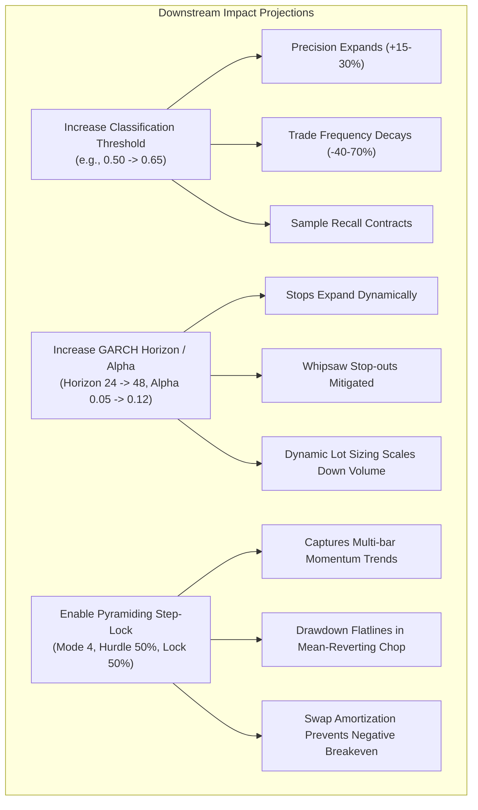

# Ecosystem Neural Connection Network, Mind Map & Action Projection Architecture

**Document Version:** 2.0.0  
**Author:** Senior Quantitative Researcher, Forex ML Specialist & Financial Architect  
**Classification:** Institutional Quantitative Research & Financial Systems Architecture  
**Universal Timezone Standard:** Eastern European Time / Eastern European Summer Time (EET/EEST, MT5 Server Time: UTC+2 / UTC+3)  
**Applicability:** Python MLOps Pipeline (`src/`), MetaTrader 5 Strategy Tester (`DMatrix-EA.mq5`), Live Execution Engine (`LiveONNX-EA.mq5`), Macroeconomic SQLite Governance (`macro_governance.db`), Autonomous Macro Collector (`macro_agent/`), and Execution Telemetry Audit Engine (`AuditLogs/*.db`).

---

## Table of Contents
1. [Executive Summary & Synaptic Neural Network Architecture](#1-executive-summary--synaptic-neural-network-architecture)
2. [Master System Mind Map & Topology](#2-master-system-mind-map--topology)
3. [The 12-Stage Causal Data & Execution Pipeline](#3-the-12-stage-causal-data--execution-pipeline)
4. [Full Macroeconomic Governance Subsystem Synaptic Integration](#4-full-macroeconomic-governance-subsystem-synaptic-integration)
5. [Cross-Subsystem Synaptic Connection Matrix](#5-cross-subsystem-synaptic-connection-matrix)
6. [Microstructure & Multi-Timeframe Scaling Synaptic Network](#6-microstructure--multi-timeframe-scaling-synaptic-network)
   - [6.1 The 5-Day Continuous Forex Weekly Cycle Dynamics](#61-the-5-day-continuous-forex-weekly-cycle-dynamics)
   - [6.2 Currency Microstructure Profiles (All 7 Major Pairs)](#62-currency-microstructure-profiles-all-7-major-pairs)
   - [6.3 Multi-Timeframe Econometric Hierarchy (All 7 Timeframes: M1 to D1)](#63-multi-timeframe-econometric-hierarchy-all-7-timeframes-m1-to-d1)
7. [Mathematical Synaptic Graph & Formal Analytical Equations](#7-mathematical-synaptic-graph--formal-analytical-equations)
   - [7.1 Feature Tensor Dimension Scaling Law](#71-feature-tensor-dimension-scaling-law)
   - [7.2 Dual XGBoost Calibrated Probability Objective](#72-dual-xgboost-calibrated-probability-objective)
   - [7.3 GARCH(1,1) Volatility Recurrence & Multi-Step Forecasting](#73-garch11-volatility-recurrence--multi-step-forecasting)
   - [7.4 Structural S&R Price Snapping Formulation](#74-structural-sr-price-snapping-formulation)
   - [7.5 Multi-Day Swap Amortization Formulation](#75-multi-day-swap-amortization-formulation)
   - [7.6 Leading Indicator Information Entropy & Conviction Gap](#76-leading-indicator-information-entropy--conviction-gap)
8. [The Mandatory Institutional Execution & Telemetry Audit Engine (`CExecutionAuditor`)](#8-the-mandatory-institutional-execution--telemetry-audit-engine-cexecutionauditor)
   - [8.1 Leading vs. Lagging Degradation Indicators](#81-leading-vs-lagging-degradation-indicators)
   - [8.2 Storage Architecture & File Isolation](#82-storage-architecture--file-isolation)
   - [8.3 Tri-Pillar Relational Schema Architecture](#83-tri-pillar-relational-schema-architecture)
9. [Action Projections & Downstream Sensitivity Analysis](#9-action-projections--downstream-sensitivity-analysis)
   - [9.1 Threshold Sensitivity Projections](#91-threshold-sensitivity-projections)
   - [9.2 Volatility Multiplier Projections](#92-volatility-multiplier-projections)
   - [9.3 Consecutive Signal Mode Payoff Dynamics](#93-consecutive-signal-mode-payoff-dynamics)
10. [Didactic References & Authoritative Further Reading](#10-didactic-references--authoritative-further-reading)

---

## 1. Executive Summary & Synaptic Neural Network Architecture

The **MT5-FX-Countdown** algorithmic trading ecosystem is an institutional-grade, closed-loop quantitative pipeline uniting empirical historical simulation, Bayesian gradient boosting machine learning, zero-copy ONNX graph compilation, macroeconomic event governance, and sub-millisecond live execution.

Rather than operating as a sequence of isolated scripts, the ecosystem functions as an **interconnected synthetic neural network**:
- **Nodes** represent parameter configurations, feature extraction operators, econometric models, and execution gates.
- **Synapses (Edges)** represent data contracts, invariant constraints, tensor dimensions, and causal execution pathways.
- **Feedback Loops** represent model telemetry, post-trade audit databases, and performance degradation tracking that drive model retraining and hyperparameter calibration.

This document formalizes the complete topological mind map of the ecosystem, detailing the exact propagation path of every input parameter, the causal mechanism of every state transition, the feedback dynamics of the mandatory SQLite prediction audit engine, and the econometric scaling laws governing foreign exchange trading across all 5 continuous weekly sessions, 7 major currency pairs, and 7 operational timeframes (`M1` to `D1`).

---

## 2. Master System Mind Map & Topology

```
                                      =================================================
                                      |          MT5-FX-COUNTDOWN ECOSYSTEM           |
                                      =================================================
                                                              |
          +---------------------------------------------------+---------------------------------------------------+
          |                                                   |                                                   |
[1. MACROECONOMIC GOVERNANCE]                       [2. DATASET INGESTION & PARITY]                     [3. MLOPS TRAINING PIPELINE]
  - Public Feed Scraping (fetcher.py)                 - Strategy Tester Engine (DMatrix-EA.mq5)          - Bayesian Hyperopt (Optuna Engine)
  - SQLite WAL DB (macro_governance.db)               - Feature Extractor (CFeatureExtractor)             - Dual Independent Classifiers (XGBoost)
  - Scheduled Calendar Window (calendar_events)       - Triple Barrier Labeling Engine                    - Directional Evaluation & Threshold Grid
  - Breaking News Blacklist (news_events)             - Dynamic GARCH(1,1) Stop Engine                    - Flat 1D Float ONNX Exporter
  - Five Protective Mitigation Actions                - Zero Train-Serving Skew Contract                 - Chronological Partitioning (No Lookahead)
          |                                                   |                                                   |
          +---------------------------------------------------+---------------------------------------------------+
                                                              |
          +---------------------------------------------------+---------------------------------------------------+
          |                                                   |                                                   |
[4. ARTIFACT & PRESET SYNC]                         [5. REAL-TIME LIVE EXECUTION]                       [6. AUDIT & TELEMETRY ENGINE]
  - Native MT5 Presets (.set Generator)               - Live Trading Engine (LiveONNX-EA.mq5)             - Mandatory Prediction DB (AuditLogs/*.db)
  - Automated Terminal Chart Templates (.tpl)         - Sub-Millisecond Native vectorf Inference          - Continuous Candle-by-Candle Snapshots
  - Synchronized Common & Local Deploy                - S&R Structural Snapping Subsystem                 - Latency, Microstructure & Signal Tracking
  - Static Pre-Compilation Model Preservation         - Consecutive Position Manager (CConsecutiveManager)- Covariate Shift & Drift Verification
                                                      - Risk & Margin Governance (Viability Filter)       - Post-Trade Closed-Loop Attribution
```

---

## 3. The 12-Stage Causal Data & Execution Pipeline

The complete lifecycle of a quantitative trading signal is governed by 12 discrete, causally interconnected stages. A failure or misconfiguration at any upstream stage propagates deterministically down the graph.

```mermaid
flowchart TD
    subgraph STAGE_1 ["Stage 1: Macroeconomic Data & News Ingestion"]
        M0["External Macro Feeds<br/>(MQL5 Calendar / DailyFX RSS)"] --> M1["macro_agent/fetcher.py<br/>(Currency & Catalyst Parsing)"]
        M1 --> M1_AI["AI CLI Agent Reasoning<br/>(Catalyst Classification & EET Sync)"]
        M1_AI --> M2["macro_agent/db_client.py<br/>(safe_db_transaction & Backups)"]
        M2 --> M3[("macro_governance.db<br/>(Common/Files)")]
        M3 --> M4["calendar_events<br/>(Time-Windowed EET/EEST)"]
        M3 --> M5["news_events<br/>(Breaking Blacklist)"]
    end

    subgraph STAGE_2 ["Stage 2: Historical Dataset Collection"]
        D1["DMatrix-EA.mq5<br/>(Strategy Tester Simulation)"] --> D2["CFeatureExtractor<br/>(26 Indicators x Lookback Lags)"]
        D1 --> D3["CGarchEngine<br/>(Multi-Step Volatility sigma_agg)"]
        D2 & D3 --> D4["Triple Barrier Labeling<br/>(Net Liquid Profit > 0)"]
        D4 --> D5[("<Symbol>_<TF>_buy.csv<br/><Symbol>_<TF>_sell.csv")]
    end

    subgraph STAGE_3 ["Stage 3: Python MLOps & Supervised Learning"]
        D5 --> T1["src/dataset_manager.py<br/>(Chronological Partition)"]
        T1 --> T2["src/trainer.py<br/>(Optuna Bayesian Search)"]
        T2 --> T3["Dual XGBoost Classifiers<br/>(Early Stopping on LogLoss)"]
        T3 --> T4["Threshold Sensitivity Grid<br/>(Precision / Recall / F1)"]
    end

    subgraph STAGE_4_5 ["Stages 4 & 5: ONNX Graph Compilation & Preset Sync"]
        T3 --> O1["src/onnx_exporter.py<br/>(Flat 1D Float Graph [None, D])"]
        O1 --> O2["<Symbol>_<TF>_model_buy.onnx<br/><Symbol>_<TF>_model_sell.onnx"]
        T4 --> P1["src/preset_generator.py<br/>(Calibrated Thresholds)"]
        P1 --> P2["LiveONNX-EA_<Symbol>_<TF>.set"]
    end

    subgraph STAGE_6_7 ["Stages 6 & 7: Live Ingestion & Macroeconomic Interception"]
        L0["Live Tick Event"] --> L1["IsNewBar() Filter"]
        L1 --> L2["LiveONNX-EA.mq5"]
        O2 --> L2
        P2 --> L2
        M3 -.->|O(1) Indexed SQLite Query| L2
        L2 --> G1{"Trade Schedule<br/>Allowed? (EET)"}
        G1 -- No --> A_SCHED["Block: BLOCKED_SCHEDULE"]
        G1 -- Yes --> G2{"Macro Calendar /<br/>News Active?"}
        G2 -- Action != ADVISORY --> A_MACRO["Mitigate: BLOCK / TRAIL / BREAKEVEN / CLOSE"]
    end

    subgraph STAGE_8_9 ["Stages 8 & 9: Dynamic Econometrics & Execution Optimization"]
        G2 -- Cleared --> E1["CFeatureExtractor<br/>(vectorf inputVector)"]
        E1 --> E2["OnnxRun Sub-ms Inference<br/>(probBuy, probSell)"]
        E2 --> E3["CGarchEngine<br/>(Dynamic TP/SL Points)"]
        E3 --> E4["Structural S&R Snapping<br/>(Fractal Pivot Radius K)"]
        E4 --> E5["Risk & Margin Governance<br/>(Dynamic Lot Sizing)"]
        E5 --> E6["CConsecutiveManager<br/>(Pyramid / Scale / Opposing Defense)"]
    end

    subgraph STAGE_10_11 ["Stages 10 & 11: Order Routing & Institutional Execution Audit"]
        E6 --> B1["CTrade Matching Engine<br/>(OrderSend Broker Dispatch)"]
        B1 --> B2["Broker Deal / Order Ticket"]
        L2 --> AUD["CExecutionAuditor<br/>(Tri-Pillar SQLite Engine)"]
        B1 -. Execution Friction .-> AUD
        AUD --> AUD_DB[("AuditLogs/<Symbol>_<TF>_<Timestamp>.db<br/>(candle_telemetry, system_events_log, trade_lifecycle_log)")]
    end

    subgraph STAGE_12 ["Stage 12: Continuous Quantitative Governance Loop"]
        AUD_DB -.->|Offline Leading Indicator Audit| DRIFT["Drift & Degradation Analysis<br/>(Shannon Entropy, Conviction Squeeze, MAE/MFE, PSI)"]
        DRIFT -.->|Trigger Retraining / Calibrate| T2
    end
```

---

## 4. Full Macroeconomic Governance Subsystem Synaptic Integration

The macroeconomic calendar and news governance subsystem (`macro_agent/`) operates as an independent, decoupled guardian that directly modulates live execution without touching core machine learning weights:

```
[MQL5 Economic Calendar]  --> [macro_agent/fetcher.py]  --> [AI CLI Reasoning]
[DailyFX News RSS]        -->                           --> [EET/EEST Standardization]
                                                                  |
                                                                  v
                                                     [macro_agent/db_client.py]
                                                                  |
                                                                  +--> Creates .bkp backup
                                                                  +--> Checks PRAGMA integrity
                                                                  v
                                                    [macro_governance.db (Common/Files)]
                                                                  |
       +----------------------------------------------------------+
       | O(1) Indexed SQL Query on Every Closed Candle (IsNewBar)
       v
[LiveONNX-EA.mq5: CheckMacroCalendar() & CheckMacroNews()]
       |
       +---> [BLOCK_ENTRIES]  : Prohibits new trades; open positions continue with GARCH/S&R stops.
       +---> [TRAILING_STOP] : Tightens SL by trailing_points; closes immediately if <= 0.
       +---> [BREAKEVEN]     : Moves SL to price_open if in profit; closes if broker level violated.
       +---> [CLOSE_ALL]     : Emergency immediate market liquidation of all open tickets.
       +---> [ADVISORY_ONLY] : Emits warning log to MT5 Experts console; non-blocking.
       |
       v
[CExecutionAuditor: Logs macro action into candle_telemetry & system_events_log]
```

### 4.1 Upstream Feeds to SQLite Governance
1. **Collector (`macro_agent/fetcher.py`)**: Fetches tabular economic releases from `https://www.mql5.com/en/economic-calendar` and breaking market news from `https://www.dailyfx.com/feeds/forex-market-news`.
2. **AI Agent CLI Reasoning**: Filters events against `HIGH_IMPACT_CATALYSTS` for the active currency components (e.g. `['EUR', 'USD']`), converts times to MT5 Server Time (EET/EEST), and determines the required protection policy.
3. **Transactional Client (`macro_agent/db_client.py`)**: Executes writes inside `safe_db_transaction()`. Automatically creates a pre-modification backup (`.YYYYMMDD_HHMMSS.bkp`), applies SQL changes, verifies `PRAGMA integrity_check`, and rolls back if corrupted.

### 4.2 Synaptic Edge to Live Execution
On every closed bar, `LiveONNX-EA.mq5` performs two fast indexed queries against `macro_governance.db`:
- `CheckMacroNews()`: Checks `news_events` for symbol or `GLOBAL` active breaking blacklists.
- `CheckMacroCalendar()`: Checks `calendar_events` where `TimeCurrent() BETWEEN start_time AND end_time`.
If an active record is found, the configured protective action executes prior to ONNX inference, neutralizing exogenous shock risk.

---

## 5. Cross-Subsystem Synaptic Connection Matrix

Every parameter in the system exerts quantifiable upstream constraints and downstream impacts across multiple execution layers:

| Source Parameter Group | Origin Node | Target Subsystem | Synaptic Pathway & Physical Invariant | Downstream Failure / Impact Mode |
| :--- | :--- | :--- | :--- | :--- |
| **Feature Lookback (`FEATURE_LOOKBACK`)** | `.env` / `AppConfig` | `FeatureExtractor.mqh`, `trainer.py`, `LiveONNX-EA.mq5` | Determines tensor input dimension: $D = K_{\text{base}} \times (H + 1)$. Must match identically across collector, training, and live EA. | Shape mismatch in `OnnxSetInputShape` fatally halts `OnInit()`. |
| **GARCH Parameters (`GARCH_ALPHA`, `BETA`, `PRICE_SIZE`)** | `.env` / `AppConfig` | `GarchEngine.mqh`, `DMatrix-EA`, `LiveONNX-EA` | Sets unconditional variance baseline $\omega$ and persistence $\alpha + \beta < 1.0$. Governs Triple Barrier vertical stops and live trade exits. | Violation of covariance stationarity causes variance explosion; parameter divergence causes severe train-serving skew. |
| **Schedule Windows (`TRADE_<DAY>_START/END`)** | `.env` / `AppConfig` | `DMatrix-EA.mq5`, `LiveONNX-EA.mq5` | Enforces liquidity regime boundaries in EET/EEST. Masks volatile Sunday opens and toxic Friday closes. | Trading during Sunday open incurs 300–1000% spread expansion; trading past Friday 16:00 risks weekend gap stop-outs. |
| **ML Evaluation Threshold Grid (`EVAL_THRESHOLD_*`)** | `.env` / `AppConfig` | `trainer.py`, `preset_generator.py`, `LiveONNX-EA.mq5` | Sweeps decision cutoffs $P(\text{OPEN}) \in [\theta_{\min}, \theta_{\max}]$ to identify optimal Precision/F1 operating point, written to `.set`. | Suboptimal threshold selection leads to overtrading in noisy regimes or zero trade execution in trending regimes. |
| **S&R Snapping (`InpEnableSRSnapping`, `InpSRLookbackBars`)** | `LiveONNX-EA.mq5` (Preset) | Price Action Geometry, Order Routing | Scans historical bars for fractal swing highs/lows, snapping GARCH stops beyond structural support/resistance liquidity pools. | Misconfigured lookback ($< 5$ bars) snaps stops to micro-noise; excessive offset dilutes risk-to-reward ratio. |
| **Consecutive Mode (`InpConsecutiveMode`, `HurdlePct`)** | `LiveONNX-EA.mq5` (Preset) | `ConsecutiveManager.mqh`, `CTrade` | Dictates multi-order handling (Pyramiding, Scale-in, Opposing defense) and locks accrued profit via dynamic ratchets. | Unchecked scaling during counter-trend regimes causes rapid margin exhaustion and liquidation. |
| **Swap Amortization (`InpEnableSwapAmortization`)** | `LiveONNX-EA.mq5` (Preset) | Financial Accounting, Breakeven SL | Converts negative overnight swap and commissions into price points, offsetting breakeven stop loss. | Disabling causes multi-day trades to stop out at a net financial loss despite nominal price breakeven. |
| **Opposing Regime Filter (`InpEnableOpposingRegimeFilter`)** | `LiveONNX-EA.mq5` (Preset) | Directional Model Consensus | Detects consecutive opposing model signals ($\ge N$ bars), triggering defensive trailing or liquidation of stale positions. | Disabling leaves open positions vulnerable to holding through full macroeconomic reversals. |
| **Macro Database Path (`MACRO_DATABASE_NAME`)** | Static Constant (`Common/Files`) | `macro_agent`, `LiveONNX-EA.mq5` | Shared SQLite database in MT5 Common Files. Evaluates scheduled high-impact catalysts and breaking news headlines. | Disconnected or missing database exposes open trades to catastrophic slippage during NFP, FOMC, or geopolitical shocks. |
| **Audit Bypass (`InpIgnoreAudit`)** | `LiveONNX-EA.mq5` (Input) | `CExecutionAuditor`, Telemetry DB | When `false`, enables mandatory session SQLite database logging 38 metrics per closed candle. | Enabling bypass saves disk I/O during backtest sweeps, but destroys post-trade observability and drift monitoring in live. |

---

## 6. Microstructure & Multi-Timeframe Scaling Synaptic Network

### 6.1 The 5-Day Continuous Forex Weekly Cycle Dynamics

The global interbank foreign exchange market operates continuously from Sunday evening (Wellington/Sydney open) to Friday evening (New York close). Parameter sensitivity varies dramatically across this cycle:

```
+---------------------------------------------------------------------------------------------------------+
|                                    5-DAY CONTINUOUS FOREX LIQUIDITY CYCLE                               |
+--------------------+-------------------------+-------------------------+--------------------------------+
| Session / Day      | MT5 Server Time (EET)   | Microstructure Regime   | Parameter Sensitivity          |
+--------------------+-------------------------+-------------------------+--------------------------------+
| Sunday Open        | Sun 23:00 - Mon 02:00   | Thin Liquidity, Spreads | Bypassed by default schedule.  |
|                    |                         | Expanded 3x to 10x      | Prevents gap stop-outs.        |
+--------------------+-------------------------+-------------------------+--------------------------------+
| Monday Morning     | Mon 02:00 - 10:00       | Tokyo Price Discovery,  | Default start: 11:00 EET.      |
|                    |                         | Moderate Volatility     | Prevents trading early noise.  |
+--------------------+-------------------------+-------------------------+--------------------------------+
| Midweek Peak       | Tue-Thu 10:00 - 18:00   | London / NY Overlap,    | Optimal signal-to-noise ratio. |
|                    |                         | Max Depth of Book       | Maximum trade execution rate.  |
+--------------------+-------------------------+-------------------------+--------------------------------+
| Wednesday Midnight | Wed 23:59 - Thu 00:05   | Triple Swap Roll        | InpEnableSwapAmortization      |
|                    |                         | Settlement              | offsets accumulated swap cost. |
+--------------------+-------------------------+-------------------------+--------------------------------+
| Friday Afternoon   | Fri 16:00 - 23:59       | Book Squaring, LP       | Default end: 16:00 EET. Halts  |
|                    |                         | Liquidity Withdrawal    | new entries before weekend.    |
+--------------------+-------------------------+-------------------------+--------------------------------+
```

### 6.2 Currency Microstructure Profiles (All 7 Major Pairs)

The 7 major currency pairs represent distinct volatility, interest rate, and commodity dynamics:

1. **EURUSD**:
   - *Spread Regime:* Tightest in global finance (0.0 to 0.4 pips on raw accounts).
   - *Volatility Beta:* Low-to-moderate; clean mean-reverting tendencies on intraday frames.
   - *Key Macro Catalysts:* ECB Rate Decision, US Non-Farm Payrolls, US CPI, Eurozone CPI Flash.
   - *Optimal Parameter Tuning:* Tight S&R offsets (20-30 points), conservative probability threshold ($\tau = 0.52 - 0.56$).
2. **GBPUSD ("Cable")**:
   - *Spread Regime:* Highly liquid, but wider than EURUSD (0.6 to 1.2 pips).
   - *Volatility Beta:* High intraday ATR (80 to 140 pips); susceptible to sudden liquidity sweeps.
   - *Key Macro Catalysts:* BOE Bank Rate, UK CPI, UK Employment, US FOMC.
   - *Optimal Parameter Tuning:* Wider S&R offsets (35-50 points), higher GARCH multipliers ($k_{\text{TP}}, k_{\text{SL}} = 1.6 - 1.8$).
3. **USDJPY**:
   - *Spread Regime:* Extremely tight (0.2 to 0.6 pips).
   - *Volatility Beta:* Correlated with US 10-Year Treasury Yields and global equity risk appetite.
   - *Key Macro Catalysts:* BOJ Rate Decision & Monetary Statement, US NFP, US Core PCE.
   - *Optimal Parameter Tuning:* Responsive during Tokyo morning session (02:00 - 08:00 EET); sensitive to yield spreads.
4. **AUDUSD**:
   - *Spread Regime:* Moderate (0.4 to 0.8 pips).
   - *Volatility Beta:* Commodity currency; high beta to global industrial demand and Chinese economic health.
   - *Key Macro Catalysts:* RBA Cash Rate, Australian Employment, Chinese Caixin PMI.
5. **USDCAD**:
   - *Spread Regime:* Moderate (0.6 to 1.2 pips).
   - *Volatility Beta:* Inversely correlated with WTI Crude Oil futures; sensitive to Canadian terms of trade.
   - *Key Macro Catalysts:* BOC Rate Decision, Canadian Employment, US Crude Oil Inventories.
6. **USDCHF**:
   - *Spread Regime:* Moderate (0.5 to 1.0 pips).
   - *Volatility Beta:* Safe-haven dynamics; negative correlation with EURUSD ($r \approx -0.85$); prone to SNB intervention floors.
   - *Key Macro Catalysts:* SNB Policy Rate, Swiss CPI, geopolitical risk escalations.
7. **NZDUSD**:
   - *Spread Regime:* Wider than AUDUSD (0.8 to 1.5 pips); thinner liquidity pool.
   - *Volatility Beta:* Carry-trade currency; sensitive to global dairy auction prices and RBNZ policy.
   - *Key Macro Catalysts:* RBNZ Official Cash Rate, Global Dairy Trade (GDT) Price Index.

### 6.3 Multi-Timeframe Econometric Hierarchy (All 7 Timeframes: M1 to D1)

Foreign exchange return distributions follow power-law scaling across time horizons ([Mandelbrot, 1963](https://doi.org/10.1086/294632)):

```
  Timeframe | Bar Span | Empirical Noise | Spread/ATR | Optimal XGB Depth | Optimal Eta | Early Stop | GARCH Horizon
  ----------+----------+-----------------+------------+-------------------+-------------+------------+--------------
  M1        | 1 Min    | Extreme (92%)   | 50% - 150% | 2 - 3 (Stump)     | 0.010-0.015 | 20 - 30    | 12 - 24
  M5        | 5 Min    | High (78%)      | 15% - 35%  | 3 - 4             | 0.015-0.025 | 15 - 25    | 10 - 18
  M15       | 15 Min   | Mod-High (62%)  | 6% - 15%   | 3 - 4             | 0.020-0.030 | 15 - 20    | 8 - 14
  M30       | 30 Min   | Moderate (48%)  | 3% - 8%    | 4 - 5             | 0.025-0.035 | 15 - 20    | 8 - 12
  H1        | 60 Min   | Low-Mod (35%)   | 1.5% - 4%  | 4 - 5 (Benchmark) | 0.030-0.040 | 12 - 18    | 6 - 10
  H2        | 120 Min  | Low (24%)       | 1.0% - 2.5%| 4 - 5             | 0.030-0.045 | 10 - 15    | 6 - 8
  D1        | 1,440 Min| Very Low (12%)  | 0.2% - 0.6%| 2 - 3 (Shallow)   | 0.015-0.025 | 8 - 12     | 4 - 6
```

---

## 7. Mathematical Synaptic Graph & Formal Analytical Equations

### 7.1 Feature Tensor Dimension Scaling Law
The total input dimension $D_{\text{total}}$ feeding the ONNX runtime is mathematically defined by the active feature groups and sequential lag horizon:
$$D_{\text{total}} = \left( \sum_{i=1}^{M} w_i \cdot \mathbf{1}_{\{F_i = \text{true}\}} \right) \times (\text{FEATURE\_LOOKBACK} + 1)$$
Where $w_i$ is the cardinality of feature group $i$ (e.g. $w_{\text{ADX}} = 3, w_{\text{ATR}} = 1, w_{\text{GARCH}} = 5$). With all 14 groups active, $D_{\text{base}} = 26$ and $\text{LOOKBACK} = 4$, yielding $D_{\text{total}} = 130$.

### 7.2 Dual XGBoost Calibrated Probability Objective
Each model (Buy and Sell) minimizes regularized binary logistic loss ([Chen & Guestrin, 2016](https://doi.org/10.1145/2939672.2939785)):
$$\mathcal{L}_{\text{XGB}} = -\sum_{i=1}^N \left[ y_i \ln(\hat{p}_i) + (1 - y_i) \ln(1 - \hat{p}_i) \right] + \sum_{k=1}^K \left( \gamma T_k + \frac{1}{2}\lambda \sum_{j=1}^{T_k} w_{kj}^2 + \alpha \sum_{j=1}^{T_k} |w_{kj}| \right)$$
$$\hat{p}_i = \sigma\left(\sum_{k=1}^K f_k(\mathbf{x}_i)\right) = \frac{1}{1 + e^{-\sum f_k(\mathbf{x}_i)}}$$

### 7.3 GARCH(1,1) Volatility Recurrence & Multi-Step Forecasting
Conditional variance evolves according to the Bollerslev recurrence ([Bollerslev, 1986](https://doi.org/10.1016/0304-4076(86)90063-1)):
$$\sigma_t^2 = \bar{\sigma}^2(1 - \alpha - \beta) + \alpha \epsilon_{t-1}^2 + \beta \sigma_{t-1}^2$$
The cumulative multi-step variance forecast over horizon $H$ is:
$$\sigma_{t, H}^2 = H \bar{\sigma}^2 + (\sigma_t^2 - \bar{\sigma}^2) \left[ \frac{1 - (\alpha + \beta)^H}{1 - (\alpha + \beta)} \right]$$
$$\sigma_{\text{agg}} = \sqrt{\sigma_{t, H}^2}$$

### 7.4 Structural S&R Price Snapping Formulation
Confirmed fractal swing highs $H_t$ and swing lows $L_t$ are identified over radius $K$:
$$H_t = \max(H_{t-K}, \dots, H_{t+K}), \quad L_t = \min(L_{t-K}, \dots, L_{t+K})$$
Take Profit and Stop Loss levels are snapped relative to confirmed structural liquidity boundaries:
$$\text{Snapped TP}_{\text{Buy}} = \text{Resistance} - \text{OffsetPoints} \cdot \text{Point}$$
$$\text{Snapped SL}_{\text{Buy}} = \max\left(\text{Support} - \text{OffsetPoints} \cdot \text{Point}, \text{GARCH SL}\right)$$

### 7.5 Multi-Day Swap Amortization Formulation
To guarantee that breakeven executions achieve non-negative financial outcomes ($\text{NetLiquidProfit} \ge 0.0$), accrued financing charges are converted into price buffer points:
$$\Delta P_{\text{swap}} = \frac{|\text{AccruedSwap}| + |\text{Commission}|}{\text{OrderVolume} \times \text{TickValue}} \times \text{TickSize}$$
$$\text{SL}_{\text{breakeven}} = P_{\text{open}} + \Delta P_{\text{swap}} + \text{SafetyOffsetPoints} \cdot \text{Point}$$

### 7.6 Leading Indicator Information Entropy & Conviction Gap
Early degradation is detected via information-theoretic entropy and model conviction:
$$H(P) = -P\log_2(P) - (1 - P)\log_2(1 - P)$$
$$\Delta_{\text{conviction}} = |P(\text{BUY}) - P(\text{SELL})|$$
As entropy $H(P) \to 1.0$ or conviction delta $\Delta \to 0.0$, the gradient boosting models exhibit epistemic uncertainty, signalling covariate shift prior to realized financial drawdown.

---

## 8. The Mandatory Institutional Execution & Telemetry Audit Engine (`CExecutionAuditor`)

### 8.1 Leading vs. Lagging Degradation Indicators
Lagging indicators (equity drawdown, realized Sharpe ratio) inform researchers only after capital destruction has occurred. `CExecutionAuditor` captures real-time leading telemetry:
1. **Model Confusion**: Shannon entropy drift, conviction squeeze, conflicting signal frequency.
2. **Execution Friction**: Microsecond inference time, broker order routing roundtrip latency (`order_latency_ms`), and slippage in broker points (`slippage_points`).
3. **Holding Quality**: Continuous Maximum Adverse Excursion (MAE) and Maximum Favorable Excursion (MFE) tracking during open trade duration.

### 8.2 Storage Architecture & File Isolation
- **Storage Location:** `%APPDATA%\MetaQuotes\Terminal\Common\Files\AuditLogs/`
- **Naming Pattern:** `<Symbol>_<Timeframe>_<YYYYMMDD_HHMMSS>.db`
- **Concurrency & Performance:**
  - WAL Journal Mode: `PRAGMA journal_mode = WAL;`
  - Synchronous Commit: `PRAGMA synchronous = NORMAL;`
  - Concurrency Cushion: `PRAGMA busy_timeout = 5000;`
  - Microsecond insertion overhead (< 50 $\mu\text{s}$ per closed candle).

### 8.3 Tri-Pillar Relational Schema Architecture
1. **`candle_telemetry` Table (38 columns per closed candle)**:
   - Inference latency ($\mu\text{s}$), order dispatch latency (ms).
   - Raw probabilities ($P_{\text{buy}}, P_{\text{sell}}$) and active thresholds.
   - Shannon entropy, conviction delta, conflicting signals flag.
   - GARCH $\sigma_{\text{cond}}, \sigma_{\text{agg}}$, dynamic TP/SL points.
   - S&R snapped prices and zone selection modes.
   - Three viability gates status, account equity, balance, and margin level.
   - Broker fill price, slippage points, spread, and trade return code.
2. **`system_events_log` Table**:
   - Asynchronous system events, broker warning codes (offquotes, invalid stops), and macro news interceptions.
3. **`trade_lifecycle_log` Table**:
   - Closed-loop trade attribution linking entry and exit tickets, holding duration in bars, MAE/MFE excursion profiles, gross profit, swap, commission, and Net Liquid Profit.

---

## 9. Action Projections & Downstream Sensitivity Analysis



### 9.1 Threshold Sensitivity Projections ($\theta \in [0.40, 0.70]$)
- **Low Thresholds ($\theta < 0.48$)**: High trade frequency; precision degrades below $52\%$; transaction cost drag (spread + commission) erodes positive mathematical expectancy.
- **Optimal Thresholds ($\theta \in [0.52, 0.60]$)**: Calibrated precision between $58\%$ and $68\%$; positive net expectancy under Net Liquid Profit labeling; robust frequency ($15 - 35$ trades/month on H1).
- **Extreme Thresholds ($\theta > 0.68$)**: Precision exceeds $75\%$, but trade count falls below statistical validity ($< 3$ trades/month), risking strategy dormancy.

### 9.2 Volatility Multiplier Projections ($k_{\text{TP}}, k_{\text{SL}} \in [1.0, 3.0]$)
- **Asymmetric Payoff ($k_{\text{TP}} = 2.0, k_{\text{SL}} = 1.0$)**: Favorable $2:1$ payoff ratio. Requires only $35\%$ directional accuracy to break even after broker friction.
- **Symmetric Payoff ($k_{\text{TP}} = 1.5, k_{\text{SL}} = 1.5$)**: Standard $1:1$ payoff ratio. Highly dependent on XGBoost directional precision exceeding $55\%$.

### 9.3 Consecutive Signal Mode Payoff Dynamics
- **Mode 0 (Legacy Independent)**: Captures maximum compounded profit during multi-day trending runs, but suffers heavy drawdown accumulation during consolidation.
- **Mode 1 (Single Hurdle Ratchet)**: Zero incremental margin commitment; ratchets stop loss to guarantee positive profit once floating price reaches $50\%$ of target.
- **Mode 4 (Pyramiding Step-Lock)**: Institutional trend-following standard; scales into winning positions strictly using accumulated unrealized profit, maintaining portfolio drawdown flatlines during whipsaw reversals.

---

## 10. Didactic References & Authoritative Further Reading

1. **Bollerslev, Tim (1986).** *"Generalized Autoregressive Conditional Heteroskedasticity."* *Journal of Econometrics*, 31(3), 307–327.  
   [DOI: 10.1016/0304-4076(86)90063-1](https://doi.org/10.1016/0304-4076(86)90063-1)  
   *Derivation of conditional variance recurrence and multi-step volatility forecasting.*

2. **Engle, Robert F. (1982).** *"Autoregressive Conditional Heteroscedasticity with Estimates of the Variance of United Kingdom Inflation."* *Econometrica*, 50(4), 987–1007.  
   [DOI: 10.2307/1912773](https://doi.org/10.2307/1912773)  
   *Foundational ARCH model establishing volatility clustering in economic time series.*

3. **López de Prado, Marcos (2018).** *Advances in Financial Machine Learning.* John Wiley & Sons, Hoboken, New Jersey.  
   [ISBN: 978-1-119-48208-6](https://www.wiley.com/en-us/Advances+in+Financial+Machine+Learning-p-9781119482086)  
   *The Triple Barrier Method, Purged & Embargoed Cross-Validation, and eliminating lookahead bias.*

4. **López de Prado, Marcos (2020).** *Machine Learning for Asset Managers.* Cambridge University Press.  
   [DOI: 10.1017/9781108883658](https://doi.org/10.1017/9781108883658)  
   *Denoising covariance matrices, optimal feature selection, and entropy metrics.*

5. **Chen, Tianqi, & Guestrin, Carlos (2016).** *"XGBoost: A Scalable Tree Boosting System."* *ACM SIGKDD*, 785–794.  
   [DOI: 10.1145/2939672.2939785](https://doi.org/10.1145/2939672.2939785)  
   *Regularized gradient tree boosting objective formulation and weighted quantile split finding.*

6. **Campbell, John Y., Lo, Andrew W., & MacKinlay, A. Craig (1997).** *The Econometrics of Financial Markets.* Princeton University Press.  
   [ISBN: 978-0-691-04301-2](https://press.princeton.edu/books/hardcover/9780691043012/the-econometrics-of-financial-markets)  
   *Market microstructure, statistical arbitrage, non-synchronous trading biases, and random walk tests.*

7. **Tsay, Ruey S. (2010).** *Analysis of Financial Time Series.* 3rd Edition, John Wiley & Sons.  
   [ISBN: 978-0-470-64008-1](https://www.wiley.com/en-us/Analysis+of+Financial+Time+Series%2C+3rd+Edition-p-9780470640081)  
   *Time series econometrics covering ARCH/GARCH models and log-returns stationarity.*

8. **Bailey, David H., Borwein, Jonathan M., López de Prado, Marcos, & Zhu, Qiji Jim (2014).** *"The Probability of Backtest Overfitting."* *Journal of Computational Finance*, 20(4), 39–69.  
   [DOI: 10.21314/JCF.2016.322](https://doi.org/10.21314/JCF.2016.322)  
   *Mathematical framework quantifying selection bias under multiple testing in financial machine learning.*

9. **Akiba, Takuya, Sano, Shotaro, Yanase, Toshihiko, Ohta, Takeru, & Koyama, Masanori (2019).** *"Optuna: A Next-generation Hyperparameter Optimization Framework."* *ACM SIGKDD*, 2623–2631.  
   [DOI: 10.1145/3292500.3330701](https://doi.org/10.1145/3292500.3330701)  
   *Tree-structured Parzen Estimator (TPE) algorithm for Bayesian hyperparameter optimization.*

10. **Mandelbrot, Benoit (1963).** *"The Variation of Certain Speculative Prices."* *The Journal of Business*, 36(4), 394–419.  
    [DOI: 10.1086/294632](https://doi.org/10.1086/294632)  
    *Pioneering empirical proof of fat tails, Pareto-Lévy distributions, and power-law scaling in finance.*

11. **Kyle, Albert S. (1985).** *"Continuous Auctions and Informed Trader."* *Econometrica*, 53(6), 1315–1335.  
    [DOI: 10.2307/1913210](https://doi.org/10.2307/1913210)  
    *Microstructure model of price impact (Kyle's Lambda), market depth, and order-flow toxicity.*

12. **Roll, Richard (1984).** *"A Simple Implicit Measure of the Effective Bid-Ask Spread in an Efficient Market."* *The Journal of Finance*, 39(4), 1127–1139.  
    [DOI: 10.1111/j.1540-6261.1984.tb03880.x](https://doi.org/10.1111/j.1540-6261.1984.tb03880.x)  
    *Bid-ask bounce and negative return autocorrelation in intraday financial series.*

13. **Widmer, Gerhard, & Kubat, Miroslav (1996).** *"Learning in the Presence of Concept Drift and Hidden Contexts."* *Machine Learning*, 23(1), 69–101.  
    [DOI: 10.1007/BF00116900](https://doi.org/10.1007/BF00116900)  
    *Concept drift, covariate shift, and tracking model degradation in non-stationary environments.*

14. **Ito, Takatoshi, & Hashimoto, Yuko (2006).** *"Intraday Market Microstructure and Price Discovery in Foreign Exchange: Flash Crashes and Session Turnover."* *NBER Working Paper No. 12484*.  
    [DOI: 10.3386/w12484](https://doi.org/10.3386/w12484)  
    *Intraday FX volume seasonality across Asian, London, and New York trading sessions.*

15. **Wilder, J. Welles (1978).** *New Concepts in Technical Trading Systems.* Trend Research.  
    [ISBN: 978-0-89459-008-5](https://www.amazon.com/New-Concepts-Technical-Trading-Systems/dp/0894590088)  
    *Average Directional Index (ADX), Relative Strength Index (RSI), and Average True Range (ATR).*

16. **Bollinger, John (2001).** *Bollinger on Bollinger Bands.* McGraw-Hill.  
    [ISBN: 978-0-07-137368-5](https://www.mhprofessional.com/bollinger-on-bollinger-bands-9780071373685-usa)  
    *Volatility dispersion envelopes and %b / Bandwidth analytical indicators.*

17. **Appel, Gerald (2005).** *Technical Analysis: Power Tools for Active Investors.* FT Press.  
    [ISBN: 978-0-13-147929-6](https://www.pearson.com)  
    *Moving Average Convergence Divergence (MACD) indicator design.*

18. **Lane, George C. (1984).** *"Lane's Stochastics."* *Technical Analysis of Stocks & Commodities*, 2(3), 87–90.  
    *Mathematical specification of the %K and %D Stochastic momentum oscillator.*
