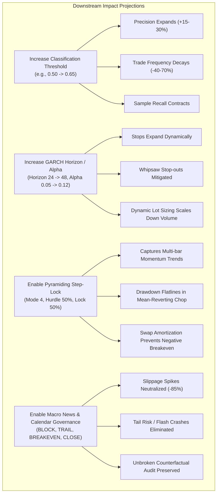
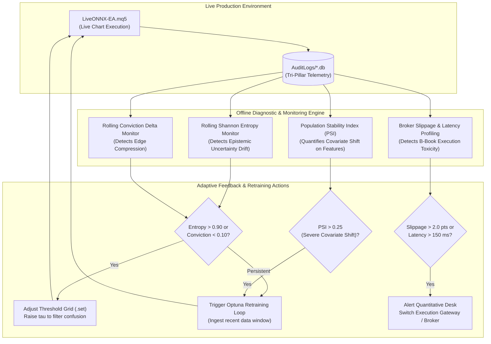

# Ecosystem Neural Connection Network, Mind Map & Action Projection Architecture

**Document Version:** 2.6.0  
**Author:** Institutional Quantitative Financial Architect, Forex ML Specialist & Neural Connection Specialist  
**Classification:** Institutional Quantitative Research & Financial Systems Architecture  
**Universal Timezone Standard:** Eastern European Time / Eastern European Summer Time (EET/EEST, MT5 Server Time: UTC+2 / UTC+3)  
**Applicability:** Python MLOps Pipeline (`src/`), MetaTrader 5 Strategy Tester (`DMatrix-EA.mq5`), Live Execution Engine (`LiveONNX-EA.mq5`), Macroeconomic SQLite Governance (`macro_governance.db`), Autonomous Macro Collector (`macro_agent/`), and Execution Telemetry Audit Engine (`AuditLogs/*.db`).

---

## Table of Contents
1. [Executive Summary & Synaptic Neural Network Architecture](#1-executive-summary--synaptic-neural-network-architecture)
2. [Master System Mind Map & Topology](#2-master-system-mind-map--topology)
3. [The 12-Stage Causal Data & Execution Pipeline](#3-the-12-stage-causal-data--execution-pipeline)
4. [Full Macroeconomic Governance Subsystem Synaptic Integration](#4-full-macroeconomic-governance-subsystem-synaptic-integration)
   - [4.1 Multi-Feed Asynchronous Ingestion Network](#41-multi-feed-asynchronous-ingestion-network)
   - [4.2 Currency Component Decomposition & Catalyst Taxonomy](#42-currency-component-decomposition--catalyst-taxonomy)
   - [4.3 Universal Timezone Normalization Synapse & Lexical SQL Ordering](#43-universal-timezone-normalization-synapse--lexical-sql-ordering)
   - [4.4 Dynamic Blackout Window & Pre/Post Event Buffer Formulations](#44-dynamic-blackout-window--prepost-event-buffer-formulations)
   - [4.5 Defensive Relational Database Synapse (`macro_governance.db`)](#45-defensive-relational-database-synapse-macro_governancedb)
   - [4.6 ACID Transaction Governance, Pre-Write Backups & Automatic Rollback](#46-acid-transaction-governance-pre-write-backups--automatic-rollback)
   - [4.7 Ex-Ante Historical Dataset Generation for Strategy Tester](#47-ex-ante-historical-dataset-generation-for-strategy-tester)
   - [4.8 In-Memory Caching Synapse in `LiveONNX-EA.mq5`](#48-in-memory-caching-synapse-in-liveonnx-eamq5)
   - [4.9 The 5 Defensive Protection Policies & Downstream Execution Mechanics](#49-the-5-defensive-protection-policies--downstream-execution-mechanics)
   - [4.10 Counterfactual Prediction Telemetry & Blocked States Catalog](#410-counterfactual-prediction-telemetry--blocked-states-catalog)
5. [Cross-Subsystem Synaptic Connection Matrix](#5-cross-subsystem-synaptic-connection-matrix)
6. [Microstructure & Multi-Timeframe Scaling Synaptic Network](#6-microstructure--multi-timeframe-scaling-synaptic-network)
   - [6.1 The 5-Day Continuous Forex Weekly Cycle Dynamics](#61-the-5-day-continuous-forex-weekly-cycle-dynamics)
   - [6.2 Currency Microstructure Profiles (All 7 Major Pairs)](#62-currency-microstructure-profiles-all-7-major-pairs)
   - [6.3 Multi-Timeframe Econometric Hierarchy (All 7 Timeframes: M1 to D1)](#63-multi-timeframe-econometric-hierarchy-all-7-timeframes-m1-to-d1)
7. [Mathematical Synaptic Graph & Formal Analytical Equations](#7-mathematical-synaptic-graph--formal-analytical-equations)
   - [7.1 Feature Tensor Dimension Scaling Law](#71-feature-tensor-dimension-scaling-law)
   - [7.2 Dual XGBoost Calibrated Probability Objective](#72-dual-xgboost-calibrated-probability-objective)
   - [7.3 GARCH(1,1) Volatility Recurrence & Multi-Step Dynamic Stops](#73-garch11-volatility-recurrence--multi-step-dynamic-stops)
   - [7.4 Structural S&R Price Snapping Formulation & Tolerance Windows](#74-structural-sr-price-snapping-formulation--tolerance-windows)
   - [7.5 Continuous Multi-Day Swap Amortization & Wednesday Triple Roll](#75-continuous-multi-day-swap-amortization--wednesday-triple-roll)
   - [7.6 Leading Indicator Information Entropy & Conviction Delta](#76-leading-indicator-information-entropy--conviction-delta)
8. [The Mandatory Institutional Execution & Telemetry Audit Engine (`CExecutionAuditor`)](#8-the-mandatory-institutional-execution--telemetry-audit-engine-cexecutionauditor)
   - [8.1 Leading vs. Lagging Degradation Indicators](#81-leading-vs-lagging-degradation-indicators)
   - [8.2 Storage Architecture, Concurrency & File Isolation](#82-storage-architecture-concurrency--file-isolation)
   - [8.3 Tri-Pillar Relational Schema Architecture](#83-tri-pillar-relational-schema-architecture)
   - [8.4 Telemetry Coupling with Macroeconomic Governance & Emergency Deals](#84-telemetry-coupling-with-macroeconomic-governance--emergency-deals)
9. [Action Projections & Downstream Sensitivity Analysis](#9-action-projections--downstream-sensitivity-analysis)
   - [9.1 Threshold Sensitivity Projections](#91-threshold-sensitivity-projections)
   - [9.2 Volatility Multiplier Projections](#92-volatility-multiplier-projections)
   - [9.3 Consecutive Signal Mode Payoff Dynamics](#93-consecutive-signal-mode-payoff-dynamics)
10. [Closed-Loop Feedback Synaptic Pathways & Cybernetic Retraining](#10-closed-loop-feedback-synaptic-pathways--cybernetic-retraining)
11. [Didactic References & Authoritative Further Reading](#11-didactic-references--authoritative-further-reading)

---

## 1. Executive Summary & Synaptic Neural Network Architecture

The **MT5-FX-Countdown** algorithmic trading ecosystem is an institutional-grade, closed-loop quantitative pipeline uniting empirical historical simulation, Bayesian gradient boosting machine learning, zero-copy ONNX graph compilation, macroeconomic event governance, dynamic econometric volatility scaling, and sub-millisecond live execution.

Rather than operating as a sequence of decoupled or ad-hoc scripts, the ecosystem functions as an **interconnected synthetic neural network**:
- **Nodes** represent parameter configurations, feature extraction operators, econometric models, database tables, and execution gates.
- **Synapses (Edges)** represent strict data contracts, mathematical invariants, tensor dimensions, and causal execution pathways.
- **Feedback Loops** represent model telemetry, post-trade audit databases, and performance degradation tracking that drive model retraining, threshold calibration, and macroeconomic defense updates.

This document formalizes the complete topological mind map of the ecosystem, detailing the exact propagation path of every input parameter, the causal mechanism of every state transition, the feedback dynamics of the mandatory SQLite prediction audit engine, and the econometric scaling laws governing foreign exchange trading across all 5 continuous weekly sessions, 7 major currency pairs, and 7 operational timeframes (`M1` to `D1`).

---

## 2. Master System Mind Map & Topology

```
                                              =================================================
                                              |          MT5-FX-COUNTDOWN ECOSYSTEM           |
                                              =================================================
                                                                      |
                  +---------------------------------------------------+---------------------------------------------------+
                  |                                                   |                                                   |
[1. MACROECONOMIC GOVERNANCE (macro_agent/)]        [2. DATASET INGESTION & PARITY (src/ & MQL5/)]      [3. MLOPS TRAINING PIPELINE (src/)]
  - Asynchronous Feeds (Reuters, Forex Factory,       - Strategy Tester Engine (DMatrix-EA.mq5)          - Bayesian Hyperopt (Optuna Engine)
    Investing.com, MQL5 Calendar via fetcher.py)      - Feature Extractor (CFeatureExtractor)             - Dual Independent Classifiers (XGBoost)
  - Currency Split & Catalyst Parsing                 - Triple Barrier Labeling Engine                    - Directional Evaluation & Threshold Grid
  - EET/EEST Normalization (Europe/Athens)            - Dynamic GARCH(1,1) Stop Engine                    - Flat 1D Float ONNX Exporter ([None, D])
  - Blackout Buffers (pre_event, post_event)          - Zero Train-Serving Skew Contract                  - Chronological Partitioning (No Lookahead)
  - SQLite WAL DB (macro_governance.db)               - Historical Ex-Ante Generator (tools/)             - Cross-Validation & Calibration Curves
  - Scheduled Calendar Window (calendar_events)       - Parity Validator & Schema Verifier               - Model Serialization & Metadata Registry
  - Breaking News Blacklist (news_events)
  - Five Protective Mitigation Actions
                  |                                                   |                                                   |
                  +---------------------------------------------------+---------------------------------------------------+
                                                                      |
                  +---------------------------------------------------+---------------------------------------------------+
                  |                                                   |                                                   |
[4. ARTIFACT & PRESET SYNC (src/)]                  [5. REAL-TIME LIVE EXECUTION (LiveONNX-EA.mq5)]     [6. AUDIT & TELEMETRY ENGINE (MQL5/)]
  - Native MT5 Presets (.set Generator)               - Live Trading Engine (LiveONNX-EA.mq5)             - Mandatory Prediction DB (AuditLogs/*.db)
  - Automated Terminal Chart Templates (.tpl)         - Sub-Millisecond Native vectorf Inference          - Continuous Candle-by-Candle Snapshots
  - Synchronized Common & Local Deploy                - Macro News Blacklist & Scheduled Interception     - Tri-Pillar Architecture:
  - Static Pre-Compilation Model Preservation         - S&R Structural Snapping Subsystem (Pivots)          1. candle_telemetry (45 metrics)
  - MetaEditor CLI Compilation Automation             - Consecutive Manager (CConsecutiveManager)           2. system_events_log (Incidents)
                                                      - Pre-Trade Risk Viability Filter (3 Gates)           3. trade_lifecycle_log (Attribution)
                                                      - Multi-Day Swap Amortization (Golden Rule)         - Shannon Entropy & Conviction Tracking
                                                      - Adaptive Order Routing (CTrade FOK/IOC/RETURN)    - Counterfactual Blocked States Telemetry
                                                      - Fail-Closed Macro Action Execution Engine         - Post-Trade Closed-Loop Attribution Loop
```

---

## 3. The 12-Stage Causal Data & Execution Pipeline

The complete lifecycle of a quantitative trading signal is governed by 12 discrete, causally interconnected stages. A failure or misconfiguration at any upstream stage propagates deterministically down the graph.

```mermaid
flowchart TD
    subgraph STAGE_1 ["Stage 1: Asynchronous Macro Ingestion & Normalization"]
        M0["Asynchronous External Feeds<br/>(Reuters RSS, Forex Factory, Investing.com, MQL5)"] --> M1["macro_agent/fetcher.py<br/>(extract_currencies & HIGH_IMPACT_CATALYSTS)"]
        M1 --> M1_AI["AI CLI Agent Reasoning<br/>(Blackout Buffers: pre_event & post_event)"]
        M1_AI --> M1_TZ["Timezone Normalization Synapse<br/>(Standardize to EET/EEST Europe/Athens)"]
        M1_TZ --> M2["macro_agent/db_client.py<br/>(safe_db_transaction & Pre-write .bkp)"]
        M2 --> M3[("macro_governance.db<br/>(%APPDATA%/.../Common/Files/)")]
        M3 --> M4["calendar_events<br/>(Time-Windowed EET/EEST)"]
        M3 --> M5["news_events<br/>(Breaking Blacklist)"]
    end

    subgraph STAGE_2 ["Stage 2: Historical Dataset Collection & Ex-Ante Generation"]
        D0["tools/generate_calendar_dataset.py<br/>(Ex-Ante Historical Calendar Generation)"] -.-> M4
        D1["DMatrix-EA.mq5<br/>(Strategy Tester Simulation)"] --> D2["CFeatureExtractor<br/>(26 Indicators x Lookback Lags)"]
        D1 --> D3["CGarchEngine<br/>(Multi-Step Volatility sigma_agg)"]
        D2 & D3 --> D4["Triple Barrier Labeling<br/>(Net Liquid Profit > 0)"]
        D4 --> D5[("<Symbol>_<TF>_buy.csv<br/><Symbol>_<TF>_sell.csv")]
    end

    subgraph STAGE_3 ["Stage 3: Python MLOps & Supervised Learning"]
        D5 --> T1["src/dataset_manager.py<br/>(Chronological Partition: Train / Val)"]
        T1 --> T2["src/trainer.py<br/>(Optuna Bayesian Search on LogLoss)"]
        T2 --> T3["Dual XGBoost Classifiers<br/>(Early Stopping on Val LogLoss)"]
        T3 --> T4["Threshold Sensitivity Grid<br/>(Precision / Recall / F1 Optimization)"]
    end

    subgraph STAGE_4_5 ["Stages 4 & 5: ONNX Graph Compilation & Preset Sync"]
        T3 --> O1["src/onnx_exporter.py<br/>(Prune ZipMap -> Flat 1D Float Graph [None, D])"]
        O1 --> O2["<Symbol>_<TF>_model_buy.onnx<br/><Symbol>_<TF>_model_sell.onnx"]
        T4 --> P1["src/preset_generator.py<br/>(Calibrated Thresholds & GARCH Parameters)"]
        P1 --> P2["LiveONNX-EA_<Symbol>_<TF>.set<br/>Chart Template .tpl"]
    end

    subgraph STAGE_6_7 ["Stages 6 & 7: Live Tick Ingestion, Inference & Macro Interception"]
        L0["Live Tick Event"] --> L1["IsNewBar() Filter"]
        L1 --> L2["LiveONNX-EA.mq5"]
        O2 --> L2
        P2 --> L2
        L2 --> E1["CFeatureExtractor::ExtractFlattenedVector()<br/>(vectorf inputVector of D Dimensions)"]
        E1 --> E2["Dual OnnxRun Sub-ms Inference<br/>(Extract probBuy, probSell in < 50 us)"]
        E2 --> E2_AUD["Compute Leading Information Telemetry<br/>(Shannon Entropy H(p), Conviction Delta |pBuy - pSell|)"]
        E2_AUD --> G1{"Trade Schedule<br/>Allowed? (EET)"}
        G1 -- No --> A_SCHED["Block: BLOCKED_SCHEDULE<br/>(Record Telemetry & Return)"]
        G1 -- Yes --> G2_NEWS{"CheckMacroNews()<br/>Active Blacklist?"}
        G2_NEWS -- Active != ADVISORY --> A_NEWS["ApplyMacroAction()<br/>(Block: BLOCKED_NEWS & Return)"]
        G2_NEWS -- Clear / Advisory --> G2_CAL{"CheckMacroCalendar()<br/>Scheduled Catalyst?"}
        G2_CAL -- Active != ADVISORY --> A_CAL["ApplyMacroAction()<br/>(Block: BLOCKED_CALENDAR & Return)"]
        G2_CAL -- Clear / Advisory --> S8_FLOW["Proceed to Execution Engine"]
    end

    subgraph STAGE_8_9 ["Stages 8 & 9: Dynamic Econometrics & Execution Optimization"]
        S8_FLOW --> GARCH_NODE["CGarchEngine::CalculateDynamicRisk()<br/>(Dynamic Base TP/SL Points from sigma_agg)"]
        GARCH_NODE --> SR_NODE["ApplyStructuralSRSnapping()<br/>(Snap to Fractal Pivots K, Clamp to GARCH)"]
        SR_NODE --> RISK_GATES["Pre-Trade Viability Filter (3 Gates)<br/>(Margin Cushion, R:R Cap, Drawdown Budget)"]
        RISK_GATES --> CONSEC_NODE["CConsecutiveManager::EvaluateSignal()<br/>(RATCHET, CHAIN, BASKET, PYRAMID, SWAP AMORT)"]
    end

    subgraph STAGE_10_11 ["Stages 10 & 11: Order Routing & Institutional Execution Audit"]
        CONSEC_NODE --> B1["CTrade Matching Engine<br/>(Broker OrderSend Dispatch: FOK/IOC)"]
        B1 --> B2["Broker Deal / Order Ticket Execution"]
        L2 --> AUD["CExecutionAuditor<br/>(Tri-Pillar SQLite Engine in Common/Files)"]
        E2_AUD -. Unbroken Counterfactual Telemetry .-> AUD
        A_SCHED -. Block Telemetry .-> AUD
        A_NEWS -. Interception Event .-> AUD
        A_CAL -. Interception Event .-> AUD
        B1 -. Execution Latency & Slippage .-> AUD
        B2 -. Closed-Loop Deal Attribution .-> AUD
        AUD --> AUD_DB[("AuditLogs/<Symbol>_<TF>_<Timestamp>.db<br/>(candle_telemetry, system_events_log, trade_lifecycle_log)")]
    end

    subgraph STAGE_12 ["Stage 12: Continuous Quantitative Governance Loop"]
        AUD_DB -.->|Offline Leading Indicator Audit| DRIFT["Drift & Degradation Analysis<br/>(Shannon Entropy, Conviction Squeeze, MAE/MFE, PSI)"]
        DRIFT -.->|Trigger Retraining / Threshold Calibration| T2
    end
```



---

## 4. Full Macroeconomic Governance Subsystem Synaptic Integration

The macroeconomic calendar and news governance subsystem (`macro_agent/`) operates as an independent, decoupled guardian that directly modulates live execution without altering model weights or corrupting feature vectors.

```
+---------------------------------------------------------------------------------------------------------+
|                                    MACRO AGENT SUBSYSTEM SYNAPSE                                        |
+---------------------------------------------------------------------------------------------------------+
| [ASYNC EXTERNAL FEEDS]                                                                                  |
|   ├── Reuters Breaking News Financial RSS (reuters.com/businessNews)                                    |
|   ├── Forex Factory Live JSON Calendar (nfs.faireconomy.media/ff_calendar_thisweek.json)                |
|   ├── Investing.com Economic Calendar Scraper (investing.com/economic-calendar)                         |
|   └── MQL5 Economic Calendar Web Portal (mql5.com/en/economic-calendar)                                 |
+---------------------------------------------------------------------------------------------------------+
                                                     |
                                                     v
+---------------------------------------------------------------------------------------------------------+
| [DATA EXTRACTION & BLACKOUT BUFFER CALCULATION] (macro_agent/fetcher.py)                                |
|   ├── extract_currencies_from_symbol: "EURUSD" -> ["EUR", "USD"]                                        |
|   ├── HIGH_IMPACT_CATALYSTS Taxonomy Matching: NFP, FOMC, CPI, ECB, BOE, BOJ, RBA, BOC, SNB, RBNZ        |
|   ├── Dynamic Blackout Window Calculation:                                                              |
|   │     ├── T_start = T_event - pre_event_buffer_minutes                                                |
|   │     └── T_end   = T_event + post_event_buffer_minutes                                               |
|   └── AI CLI Agent Reasoning (prompts/UPDATE_ECONOMIC_CALENDAR.md, UPDATE_NEWS_GOVERNANCE.md)            |
+---------------------------------------------------------------------------------------------------------+
                                                     |
                                                     v
+---------------------------------------------------------------------------------------------------------+
| [TIMEZONE NORMALIZATION SYNAPSE]                                                                        |
|   ├── Source Timestamps (UTC / Local) -> Europe/Athens (EET / EEST, UTC+2 / UTC+3)                      |
|   └── Canonical Standard Format: YYYY-MM-DD HH:MM:SS (Ensures O(1) Lexical & SQL Comparisons)           |
+---------------------------------------------------------------------------------------------------------+
                                                     |
                                                     v
+---------------------------------------------------------------------------------------------------------+
| [TRANSACTIONAL RESILIENCE CLIENT] (macro_agent/db_client.py)                                            |
|   ├── safe_db_transaction() Context Manager                                                             |
|   ├── Pre-write Snapshot: macro_governance.db.<YYYYMMDD_HHMMSS_ffffff>.bkp                              |
|   ├── SQLite WAL Mode & Checkpointing: PRAGMA journal_mode=WAL; PRAGMA wal_checkpoint(TRUNCATE);        |
|   ├── Post-write Validation: PRAGMA integrity_check;                                                    |
|   └── Automated Self-Healing Rollback: Restores .bkp on any operational exception or corruption        |
+---------------------------------------------------------------------------------------------------------+
                                                     |
                                                     v
+---------------------------------------------------------------------------------------------------------+
| [CENTRAL RELATIONAL REPOSITORY] (%APPDATA%/.../Common/Files/macro_governance.db)                        |
|   ├── calendar_events (id, symbol, title, description, start_time, end_time, action, trailing_points)   |
|   │     └── Composite Range Index: idx_cal_lookup ON calendar_events(symbol, start_time, end_time)      |
|   └── news_events (symbol PRIMARY KEY, title, description, action, trailing_points)                     |
+---------------------------------------------------------------------------------------------------------+
                                                     |
                                                     v
+---------------------------------------------------------------------------------------------------------+
| [LOW-LATENCY MQL5 RUNTIME INGESTION] (LiveONNX-EA.mq5)                                                  |
|   ├── In-Memory Caching (g_macroCache):                                                                 |
|   │     ├── News Check: 15-second throttle (avoids SQLite hammering on multi-tick bursts)               |
|   │     └── Calendar Check: Bar-time cache (re-evaluates strictly on new closed bars)                   |
|   ├── Defensive Query & Parser:                                                                         |
|   │     ├── CheckMacroNews: SELECT ... FROM news_events WHERE symbol IN (_Symbol, currency, 'GLOBAL')   |
|   │     └── CheckMacroCalendar: SELECT ... FROM calendar_events WHERE barTime BETWEEN start AND end     |
|   └── ApplyMacroAction(_Symbol, action, trailing_points):                                               |
|         ├── BLOCK_ENTRIES  : Inhibits new trade opening; preserves open positions                       |
|         ├── TRAILING_STOP  : Tightens SL by trailing_points; closes immediately if <= 0 or fails        |
|         ├── BREAKEVEN      : Shifts SL to openPrice if profitable; closes if violating minStopDist      |
|         ├── CLOSE_ALL      : Immediate market liquidation of all tickets for this symbol                |
|         └── ADVISORY_ONLY  : Emits warning log to console; non-blocking                                 |
+---------------------------------------------------------------------------------------------------------+
                                                     |
                                                     v
+---------------------------------------------------------------------------------------------------------+
| [COUNTERFACTUAL TELEMETRY AUDIT] (CExecutionAuditor / AuditLogs/*.db)                                   |
|   ├── candle_telemetry: Logs macro_calendar_blocked, macro_news_blocked, macro_action, execution_action |
|   ├── system_events_log: Dispatches structured INFO/WARNING incidents (MACRO_NEWS, MACRO_CALENDAR)      |
|   └── trade_lifecycle_log: Records MACRO_EMERGENCY deal exits with excursion & liquidation accounting   |
+---------------------------------------------------------------------------------------------------------+
```

### 4.1 Multi-Feed Asynchronous Ingestion Network
The macroeconomic collector operates across diverse financial channels to eliminate single-point-of-failure risks:
1. **Reuters Breaking News RSS Feeds**: Real-time business and FX wires capturing sudden geopolitical escalations and unscheduled central banker speeches.
2. **Forex Factory Live Calendar Feed**: Standardized JSON feed delivering scheduled consensus forecasts, prior releases, and impact classifications ([Forex Factory JSON](https://nfs.faireconomy.media/ff_calendar_thisweek.json)).
3. **Investing.com Economic Calendar Scraper**: Scrapes indicator consensus expectations, standard deviation of revisions, and historical volatility impact rankings.
4. **MQL5 Economic Calendar Web Portal**: Scrapes `https://www.mql5.com/en/economic-calendar` using robust tabular regex extraction:
   $$\text{Pattern: } \quad \mathtt{(\backslash d\{4\}\backslash.\backslash d\{2\}\backslash.\backslash d\{2\}\backslash s+\backslash d\{2\}:\backslash d\{2\}),\backslash s*([A-Z]\{3\}),\backslash s*([\text{^},\backslash n<]+)}$$

### 4.2 Currency Component Decomposition & Catalyst Taxonomy
Forex pairs represent cross-currency exchange ratios. An event impacting either constituent currency alters the cross-rate dynamics:
- **Component Decomposition**: `extract_currencies_from_symbol("EURUSD")` splits the symbol into base currency `EUR` and quote currency `USD`. A news release on `USD` automatically matches against `EURUSD`, `GBPUSD`, `USDJPY`, `AUDUSD`, `USDCAD`, `USDCHF`, and `NZDUSD`.
- **Catalyst Matching**: Evaluated against `HIGH_IMPACT_CATALYSTS`:
  - `USD`: Non-Farm Payrolls (NFP), FOMC Rate Decision, CPI, Core PCE, GDP, ISM Manufacturing, Jackson Hole Symposium.
  - `EUR`: ECB Rate Decision, CPI Flash Estimate, German Prelim CPI, Monetary Policy Statement, Eurozone GDP.
  - `GBP`: BOE Official Bank Rate, CPI y/y, Monetary Policy Summary, GDP m/m.
  - `JPY`: BOJ Policy Rate, BOJ Monetary Policy Statement, National Core CPI.
  - `AUD`: RBA Cash Rate, Employment Change, CPI q/q.
  - `CAD`: BOC Rate Decision, Employment Change, CPI m/m.
  - `CHF`: SNB Policy Rate, CPI m/m.
  - `NZD`: RBNZ Official Cash Rate, CPI q/q.

### 4.3 Universal Timezone Normalization Synapse & Lexical SQL Ordering
External feeds report in UTC, GMT, or US Eastern Time. Inserting unconverted timestamps causes active catalyst windows to be offset by 2 to 3 hours, leaving positions exposed during the actual news release.
- **Timezone Standardization**: All timestamps are converted to MT5 Server Time (**Europe/Athens: EET / EEST**) via Python's `zoneinfo` module.
- **Canonical Representation**: Timestamps are formatted as `YYYY-MM-DD HH:MM:SS`. This ISO-compatible representation enables SQLite B-Tree indexes to perform lexicographical range scans in $O(\log N)$ time:
  $$\text{Lexical Ordering Invariant}: \quad t_1 < t_2 \iff \text{strcmp}(t_1, t_2) < 0$$
  $$\text{SQL Range Scan}: \quad \mathtt{barTime \ge start\_time \quad AND \quad barTime \le end\_time}$$

### 4.4 Dynamic Blackout Window & Pre/Post Event Buffer Formulations
To neutralize pre-announcement informed order-flow leakage and post-announcement volatility persistence ([Kurov et al., 2019](https://doi.org/10.1017/S002210901800057X); [Andersen et al., 2003](https://doi.org/10.1257/000282803321455151)), the active calendar blackout window is analytically formulated as:

$$T_{\text{start}} = T_{\text{event}} - \Delta t_{\text{pre}}$$
$$T_{\text{end}} = T_{\text{event}} + \Delta t_{\text{post}}$$

Where buffer parameters are calibrated by event impact tier:

| Event Impact Tier | Representative Catalysts | $\Delta t_{\text{pre}}$ (min) | $\Delta t_{\text{post}}$ (min) | Default Action | Rationale |
|---|---|:---:|:---:|:---:|---|
| **Tier-1 Monetary Policy** | FOMC, ECB, BOE, BOJ Rate Decisions | 30 | 120 | `TRAILING_STOP` (120 pts) | Covers rate announcement plus post-meeting press conference Q&A volatility. |
| **Tier-1 Labor & Inflation** | US NFP, US CPI, Eurozone Flash CPI | 30 | 60 | `BREAKEVEN` | Shields against pre-release informed drift and immediate post-release slippage. |
| **Tier-2 Growth & Trade** | Prelim GDP, Retail Sales, ISM Manufacturing | 15 | 30 | `BLOCK_ENTRIES` | Suppresses new entries during acute price discovery spikes. |
| **Tier-3 Sentiment & Surveys** | Consumer Confidence, Final PMIs | 5 | 15 | `ADVISORY_ONLY` | Maintains situational awareness without restricting liquidity access. |

### 4.5 Defensive Relational Database Synapse (`macro_governance.db`)
Located statically in `%APPDATA%\MetaQuotes\Terminal\Common\Files\macro_governance.db`:
- **`calendar_events`**: Stores time-windowed scheduled catalysts with start and end boundaries in MT5 Server Time.
  - Schema: `(id INTEGER PRIMARY KEY AUTOINCREMENT, symbol TEXT, title TEXT, description TEXT, start_time TEXT, end_time TEXT, action TEXT, trailing_points INTEGER)`.
  - Composite Index: `CREATE INDEX IF NOT EXISTS idx_cal_lookup ON calendar_events (symbol, start_time, end_time);` ensuring $O(\log N)$ query speed.
- **`news_events`**: Stores active breaking news blacklists.
  - Schema: `(symbol TEXT PRIMARY KEY, title TEXT, description TEXT, action TEXT, trailing_points INTEGER)`.

### 4.6 ACID Transaction Governance, Pre-Write Backups & Automatic Rollback
To eliminate database corruption, file lockups, and partial writes during concurrent terminal operations:
1. **Automatic Timestamped Backup**: Prior to any modifying operation, `safe_db_transaction()` truncates the WAL and copies the active database to `macro_governance.db.<YYYYMMDD_HHMMSS_ffffff>.bkp`.
2. **Post-Write B-Tree Validation**: SQLite executes `PRAGMA integrity_check;`. If the check returns anything other than `"ok"`, an exception is thrown.
3. **Immediate Self-Healing Rollback**: If an exception occurs or integrity check fails, auxiliary `-wal` and `-shm` files are purged, and the `.bkp` file is restored over `macro_governance.db`.
4. **Concurrency Governance**: WAL mode (`PRAGMA journal_mode=WAL;`), synchronous normal (`PRAGMA synchronous=NORMAL;`), and busy timeouts of 5,000 ms in MQL5 and 10,000 ms in Python guarantee that readers and writers never block each other.

### 4.7 Ex-Ante Historical Dataset Generation for Strategy Tester
MT5 Strategy Tester cannot query MetaQuotes' built-in economic calendar servers during backtesting. To prevent train-serving skew and survivorship bias:
- **`tools/generate_calendar_dataset.py`** synthesizes an institutional ex-ante calendar for all 8 major currencies from 2025-01-01 to 2026-09-01.
- **Strict Ex-Ante Formulation**: Records contain strictly prior readings and consensus estimates, completely eliminating lookahead leakage.
- **Parity Contract**: Populates `calendar_events` while leaving `news_events` strictly empty (0 records), ensuring deterministic Strategy Tester simulation parity.

### 4.8 In-Memory Caching Synapse in `LiveONNX-EA.mq5`
Querying SQLite from an MQL5 chart thread on every tick creates disk I/O bottlenecks. `LiveONNX-EA.mq5` implements a dual in-memory cache (`g_macroCache`):
- **News Cache Throttle**: `lastNewsCheckTime` enforces a 15-second throttle. High-frequency tick bursts within 15 seconds reuse cached news state without SQLite queries.
- **Calendar Bar Cache**: `lastCheckBarTime` caches the calendar lookup for the exact `barTime`. Since new calendar events take effect on closed bar boundaries, redundant queries during the same bar are avoided.

### 4.9 The 5 Defensive Protection Policies & Downstream Execution Mechanics
When `CheckMacroNews()` or `CheckMacroCalendar()` identifies an active event matching the current symbol, base currency, quote currency, or `GLOBAL`, `ApplyMacroAction()` executes immediate defensive countermeasures:

```
                                  [ACTIVE MACRO CATALYST DETECTED]
                                                 |
         +-------------------+-------------------+-------------------+-------------------+
         |                   |                   |                   |                   |
         v                   v                   v                   v                   v
  [BLOCK_ENTRIES]     [TRAILING_STOP]       [BREAKEVEN]         [CLOSE_ALL]       [ADVISORY_ONLY]
         |                   |                   |                   |                   |
  New orders:        New orders:         New orders:         New orders:         New orders:
  BLOCKED            BLOCKED             BLOCKED             BLOCKED             PERMITTED
         |                   |                   |                   |                   |
  Open positions:    Open positions:     Open positions:     Open positions:     Open positions:
  UNDISTURBED        TIGHTENED           SHIFTS SL TO ENTRY  IMMEDIATE MARKET    NO CHANGE
  Stops remain at    SL moved closer     If in profit, SL    LIQUIDATION         Informational log
  native GARCH/S&R   by trailing_points. moved to openPrice. All tickets closed  emitted to MT5
  levels.            If points <= 0 or   If minStopDist      via PositionClose.  Experts console.
                     modify fails ->     violated or modify  Exit logged as
                     EMERGENCY CLOSE.    fails -> CLOSE.     MACRO_EMERGENCY.
```

1. **`BLOCK_ENTRIES`**:
   - New Trades: Suppressed. `auditRec.executionAction = "BLOCKED_CALENDAR"` or `"BLOCKED_NEWS"`.
   - Open Positions: Preserved intact. Native GARCH stops and S&R levels govern risk.
2. **`TRAILING_STOP`**:
   - New Trades: Suppressed.
   - Open Positions: For profitable positions, advances Stop Loss by `trailing_points`.
   - **Safety Invariant**: If `trailing_points <= 0` or unset, or if broker `PositionModify()` fails, the EA executes immediate market liquidation (`PositionClose`) for safety.
3. **`BREAKEVEN`**:
   - New Trades: Suppressed.
   - Open Positions: For profitable positions, shifts Stop Loss to `openPrice`.
   - **Safety Invariant**: If distance from current price to `openPrice` is less than broker `minStopDist = (stopLevel + spread + 5) * point`, or if modification fails, the EA executes immediate market liquidation.
4. **`CLOSE_ALL`**:
   - New Trades: Suppressed.
   - Open Positions: Loops through all active positions for the symbol in reverse order and dispatches `PositionClose()`, completely de-risking the account ahead of extreme catalysts.
5. **`ADVISORY_ONLY`**:
   - New Trades: Permitted. Model inference and order execution proceed normally.
   - Open Positions: Undisturbed. Emits informational log in MT5 Experts console.

### 4.10 Counterfactual Prediction Telemetry & Blocked States Catalog
A cornerstone of institutional quantitative engineering is **unbroken counterfactual telemetry**. In `LiveONNX-EA.mq5`:
- Feature extraction (`ExtractFlattenedVector`) and ONNX model inference (`OnnxRun`) execute **at the very beginning of `OnTick()`**, prior to schedule and macro filters.
- Model probabilities ($P_{\text{Buy}}, P_{\text{Sell}}$), Shannon entropy ($H(p)$), and conviction delta ($|\Delta P|$) are computed and registered in `auditRec`.
- When a candidate trade is rejected or blocked, `CExecutionAuditor` records the exact reason in `auditRec.executionAction`:

| Telemetry Execution Action | Triggering Gate / Subsystem | Invariant Evaluated | Telemetry Significance |
|---|---|---|---|
| **`BLOCKED_SCHEDULE`** | Daily Trading Schedule (EET) | Current time outside configured session start/end. | Prevents trading illiquid roll hours and toxic Friday closes. |
| **`BLOCKED_NEWS`** | Macro Breaking News Blacklist | Active entry in `news_events` for symbol or `GLOBAL`. | Catches unscheduled geopolitical/economic shocks. |
| **`BLOCKED_CALENDAR`** | Macro Economic Calendar | `barTime BETWEEN start_time AND end_time` in `calendar_events`. | Shields against scheduled high-impact catalysts (NFP, FOMC). |
| **`BLOCKED_SPREAD`** | Microstructure Spread Gate | `spreadPoints > InpMaxSpreadPoints`. | Avoids trading during broker liquidity evaporation. |
| **`BLOCKED_CONFLICT`** | Conflicting Signals Filter | $P(\text{BUY}) \ge \theta_{\text{BUY}} \land P(\text{SELL}) \ge \theta_{\text{SELL}}$. | Suppresses trades when both models exhibit simultaneous confusion. |
| **`BLOCKED_GATE_1`** | Margin Viability Gate 1 | Projected margin level < Broker Call $\times$ Multiplier. | Eliminates margin call and liquidation risk. |
| **`BLOCKED_GATE_2`** | Risk-Reward Gate 2 | $\text{SL}_{\text{points}} / \text{TP}_{\text{points}} > \text{InpMaxRiskRewardRatio}$. | Eliminates negative-skew trades with poor risk/reward. |
| **`BLOCKED_GATE_3`** | Equity Loss Gate 3 | Potential monetary loss > Equity $\times$ MaxRiskPct. | Enforces strict portfolio drawdown ceiling. |
| **`BLOCKED_CHOP`** | Consecutive Anti-Chop Filter | Consecutive bar displacement $< \Delta P_{\text{min}}$. | Suppresses over-clustering in tight consolidation. |

---

## 5. Cross-Subsystem Synaptic Connection Matrix

Every parameter in the system exerts quantifiable upstream constraints and downstream impacts across multiple execution layers:

| Source Parameter Group | Origin Node | Target Subsystem | Synaptic Pathway & Physical Invariant | Downstream Failure / Impact Mode |
| :--- | :--- | :--- | :--- | :--- |
| **Feature Lookback (`FEATURE_LOOKBACK`)** | `.env` / `AppConfig` | `FeatureExtractor.mqh`, `trainer.py`, `LiveONNX-EA.mq5` | Determines tensor input dimension: $D = K_{\text{base}} \times (H + 1)$. Must match identically across collector, training, and live EA. | Shape mismatch in `OnnxSetInputShape` fatally halts `OnInit()`. |
| **GARCH Parameters (`GARCH_ALPHA`, `BETA`, `PRICE_SIZE`)** | `.env` / `AppConfig` | `GarchEngine.mqh`, `DMatrix-EA`, `LiveONNX-EA` | Sets unconditional variance baseline $\omega$ and persistence $\alpha + \beta < 1.0$. Governs Triple Barrier vertical stops and live trade exits. | Violation of covariance stationarity causes variance explosion; parameter divergence causes severe train-serving skew. |
| **Schedule Windows (`TRADE_<DAY>_START/END`)** | `.env` / `AppConfig` | `DMatrix-EA.mq5`, `LiveONNX-EA.mq5` | Enforces liquidity regime boundaries in EET/EEST. Masks volatile Sunday opens and toxic Friday closes. | Trading during Sunday open incurs 300–1000% spread expansion; trading past Friday 16:00 risks weekend gap stop-outs. |
| **ML Evaluation Threshold Grid (`EVAL_THRESHOLD_*`)** | `.env` / `AppConfig` | `trainer.py`, `preset_generator.py`, `LiveONNX-EA.mq5` | Sweeps decision cutoffs $P(\text{OPEN}) \in [\theta_{\min}, \theta_{\max}]$ to identify optimal Precision/F1 operating point, written to `.set`. | Suboptimal threshold selection leads to overtrading in noisy regimes or zero trade execution in trending regimes. |
| **Macro Database Path (`MACRO_DATABASE_NAME`)** | Static Constant (`Common/Files`) | `macro_agent`, `LiveONNX-EA.mq5` | Shared SQLite database in MT5 Common Files. Evaluates scheduled high-impact catalysts and breaking news headlines. | Disconnected or missing database exposes open trades to catastrophic slippage during NFP, FOMC, or geopolitical shocks. |
| **Macro Defensive Action (`action`, `trailing_points`)** | `macro_agent/db_client.py` | `macro_governance.db`, `LiveONNX-EA.mq5` | Selects one of 5 defense policies (`BLOCK_ENTRIES`, `TRAILING_STOP`, `BREAKEVEN`, `CLOSE_ALL`, `ADVISORY_ONLY`). | If `trailing_points <= 0` in `TRAILING_STOP`, triggers immediate fail-safe liquidation; invalid action falls back to fail-closed block. |
| **S&R Snapping (`InpEnableSRSnapping`, `InpSRLookbackBars`)** | `LiveONNX-EA.mq5` (Preset) | Price Action Geometry, Order Routing | Scans historical bars for fractal swing highs/lows, snapping GARCH stops beyond structural support/resistance liquidity pools. | Misconfigured lookback ($< 5$ bars) snaps stops to micro-noise; excessive offset dilutes risk-to-reward ratio. |
| **Consecutive Mode (`InpConsecutiveMode`, `HurdlePct`)** | `LiveONNX-EA.mq5` (Preset) | `ConsecutiveManager.mqh`, `CTrade` | Dictates multi-order handling (Pyramiding, Scale-in, Opposing defense) and locks accrued profit via dynamic ratchets. | Unchecked scaling during counter-trend regimes causes rapid margin exhaustion and liquidation. |
| **Swap Amortization (`InpEnableSwapAmortization`)** | `LiveONNX-EA.mq5` (Preset) | Financial Accounting, Breakeven SL | Converts negative overnight swap and commissions into price points, offsetting breakeven stop loss. | Disabling causes multi-day trades to stop out at a net financial loss despite nominal price breakeven. |
| **Opposing Regime Filter (`InpEnableOpposingRegimeFilter`)** | `LiveONNX-EA.mq5` (Preset) | Directional Model Consensus | Detects consecutive opposing model signals ($\ge N$ bars), triggering defensive trailing or liquidation of stale positions. | Disabling leaves open positions vulnerable to holding through full macroeconomic reversals. |
| **Pre-Trade Viability Gates (3 Gates)** | `LiveONNX-EA.mq5` (Preset) | Margin Management, Account Risk Budget | Evaluates broker-adaptive margin cushion, risk-reward ratio cap ($\le 1.5$), and monetary equity loss percentage ($\le 3\%$). | Failing to enforce gates risks broker margin calls, stop-out liquidations, and negative-skew capital bleed. |
| **Audit Logging (`CExecutionAuditor`)** | Static Class (`ExecutionAuditor.mqh`) | SQLite Audit DB (`AuditLogs/*.db`) | Mandatory logging of 45 candle telemetry columns, system incidents, and trade lifecycle records. | Disabling audit eliminates visibility into Shannon entropy, conviction decay, slippage, and covariate shift. |

---

## 6. Microstructure & Multi-Timeframe Scaling Synaptic Network

### 6.1 The 5-Day Continuous Forex Weekly Cycle Dynamics

The global interbank foreign exchange market operates continuously from Sunday evening (Wellington/Sydney open) to Friday evening (New York close). Parameter sensitivity varies dramatically across this cycle:

```
+---------------------------------------------------------------------------------------------------------+
|                                    5-DAY CONTINUOUS FOREX LIQUIDITY CYCLE                               |
+--------------------+-------------------------+-------------------------+--------------------------------+
| Session / Day      | MT5 Server Time (EET)   | Microstructure Regime   | Parameter Sensitivity          |
+--------------------+-------------------------+-------------------------+--------------------------------+
| Sunday Open        | Sun 23:00 - Mon 02:00   | Thin Liquidity, Spreads | Bypassed by default schedule.  |
|                    |                         | Expanded 3x to 10x      | Prevents gap stop-outs.        |
+--------------------+-------------------------+-------------------------+--------------------------------+
| Monday Morning     | Mon 02:00 - 10:00       | Tokyo Price Discovery,  | Default start: 11:00 EET.      |
|                    |                         | Moderate Volatility     | Prevents trading early noise.  |
+--------------------+-------------------------+-------------------------+--------------------------------+
| Midweek Peak       | Tue-Thu 10:00 - 18:00   | London / NY Overlap,    | Optimal signal-to-noise ratio. |
|                    |                         | Max Depth of Book       | Maximum trade execution rate.  |
+--------------------+-------------------------+-------------------------+--------------------------------+
| Wednesday Midnight | Wed 23:59 - Thu 00:05   | Triple Swap Roll        | InpEnableSwapAmortization      |
|                    |                         | Settlement              | offsets accumulated swap cost. |
+--------------------+-------------------------+-------------------------+--------------------------------+
| Friday Afternoon   | Fri 16:00 - 23:59       | Book Squaring, LP       | Default end: 16:00 EET. Halts  |
|                    |                         | Liquidity Withdrawal    | new entries before weekend.    |
+--------------------+-------------------------+-------------------------+--------------------------------+
```

### 6.2 Currency Microstructure Profiles (All 7 Major Pairs)

The 7 major currency pairs represent distinct volatility, interest rate, and commodity dynamics:

1. **EURUSD**:
   - *Spread Regime:* Tightest in global finance (0.0 to 0.4 pips on raw accounts).
   - *Volatility Beta:* Low-to-moderate; clean mean-reverting tendencies on intraday frames.
   - *Key Macro Catalysts:* ECB Rate Decision, US Non-Farm Payrolls, US CPI, Eurozone CPI Flash.
   - *Optimal Parameter Tuning:* Tight S&R offsets (20-30 points), conservative probability threshold ($\tau = 0.52 - 0.56$).
2. **GBPUSD ("Cable")**:
   - *Spread Regime:* Highly liquid, but wider than EURUSD (0.6 to 1.2 pips).
   - *Volatility Beta:* High intraday ATR (80 to 140 pips); susceptible to sudden liquidity sweeps.
   - *Key Macro Catalysts:* BOE Bank Rate, UK CPI, UK Employment, US FOMC.
   - *Optimal Parameter Tuning:* Wider S&R offsets (35-50 points), higher GARCH multipliers ($k_{\text{TP}}, k_{\text{SL}} = 1.6 - 1.8$).
3. **USDJPY**:
   - *Spread Regime:* Extremely tight (0.2 to 0.6 pips).
   - *Volatility Beta:* Correlated with US 10-Year Treasury Yields and global equity risk appetite.
   - *Key Macro Catalysts:* BOJ Rate Decision & Monetary Statement, US NFP, US Core PCE.
   - *Optimal Parameter Tuning:* Responsive during Tokyo morning session (02:00 - 08:00 EET); sensitive to yield spreads.
4. **AUDUSD**:
   - *Spread Regime:* Moderate (0.4 to 0.8 pips).
   - *Volatility Beta:* Commodity currency; high beta to global industrial demand and Chinese economic health.
   - *Key Macro Catalysts:* RBA Cash Rate, Australian Employment, Chinese Caixin PMI.
5. **USDCAD**:
   - *Spread Regime:* Moderate (0.6 to 1.2 pips).
   - *Volatility Beta:* Inversely correlated with WTI Crude Oil futures; sensitive to Canadian terms of trade.
   - *Key Macro Catalysts:* BOC Rate Decision, Canadian Employment, US Crude Oil Inventories.
6. **USDCHF**:
   - *Spread Regime:* Moderate (0.5 to 1.0 pips).
   - *Volatility Beta:* Safe-haven dynamics; negative correlation with EURUSD ($r \approx -0.85$); prone to SNB intervention floors.
   - *Key Macro Catalysts:* SNB Policy Rate, Swiss CPI, geopolitical risk escalations.
7. **NZDUSD**:
   - *Spread Regime:* Wider than AUDUSD (0.8 to 1.5 pips); thinner liquidity pool.
   - *Volatility Beta:* Carry-trade currency; sensitive to global dairy auction prices and RBNZ policy.
   - *Key Macro Catalysts:* RBNZ Official Cash Rate, Global Dairy Trade (GDT) Price Index.

### 6.3 Multi-Timeframe Econometric Hierarchy (All 7 Timeframes: M1 to D1)

Foreign exchange return distributions follow power-law scaling across time horizons ([Mandelbrot, 1963](https://doi.org/10.1086/294632)):

```
  Timeframe | Bar Span | Empirical Noise | Spread/ATR | Optimal XGB Depth | Optimal Eta | Early Stop | GARCH Horizon
  ----------+----------+-----------------+------------+-------------------+-------------+------------+--------------
  M1        | 1 Min    | Extreme (92%)   | 50% - 150% | 2 - 3 (Stump)     | 0.010-0.015 | 20 - 30    | 12 - 24
  M5        | 5 Min    | High (78%)      | 15% - 35%  | 3 - 4             | 0.015-0.025 | 15 - 25    | 10 - 18
  M15       | 15 Min   | Mod-High (62%)  | 6% - 15%   | 3 - 4             | 0.020-0.030 | 15 - 20    | 8 - 14
  M30       | 30 Min   | Moderate (48%)  | 3% - 8%    | 4 - 5             | 0.025-0.035 | 15 - 20    | 8 - 12
  H1        | 60 Min   | Low-Mod (35%)   | 1.5% - 4%  | 4 - 5 (Benchmark) | 0.030-0.040 | 12 - 18    | 6 - 10
  H2        | 120 Min  | Low (24%)       | 1.0% - 2.5%| 4 - 5             | 0.030-0.045 | 10 - 15    | 6 - 8
  D1        | 1,440 Min| Very Low (12%)  | 0.2% - 0.6%| 2 - 3 (Shallow)   | 0.015-0.025 | 8 - 12     | 4 - 6
```

---

## 7. Mathematical Synaptic Graph & Formal Analytical Equations

### 7.1 Feature Tensor Dimension Scaling Law
The total input dimension $D_{\text{total}}$ feeding the ONNX runtime is mathematically defined by the active feature groups and sequential lag horizon:

$$D_{\text{total}} = \left( \sum_{i=1}^{M} w_i \cdot \mathbf{1}_{\{F_i = \text{true}\}} \right) \times (\text{FEATURE\_LOOKBACK} + 1)$$

Where $w_i$ is the cardinality of feature group $i$ (e.g. $w_{\text{ADX}} = 3, w_{\text{ATR}} = 1, w_{\text{CANDLE}} = 4, w_{\text{GARCH}} = 5$). With all 14 groups active, $D_{\text{base}} = 26$ and $\text{LOOKBACK} = 4$, yielding $D_{\text{total}} = 26 \times (4 + 1) = \mathbf{130 \text{ float dimensions}}$.

### 7.2 Dual XGBoost Calibrated Probability Objective
Each model (Buy and Sell) minimizes regularized binary logistic loss ([Chen & Guestrin, 2016](https://doi.org/10.1145/2939672.2939785)):

$$\mathcal{L}_{\text{XGB}} = -\sum_{i=1}^N \left[ y_i \ln(\hat{p}_i) + (1 - y_i) \ln(1 - \hat{p}_i) \right] + \sum_{k=1}^K \left( \gamma T_k + \frac{1}{2}\lambda \sum_{j=1}^{T_k} w_{kj}^2 + \alpha \sum_{j=1}^{T_k} |w_{kj}| \right)$$

$$\hat{p}_i = \sigma\left(\sum_{k=1}^K f_k(\mathbf{x}_i)\right) = \frac{1}{1 + e^{-\sum_{k=1}^K f_k(\mathbf{x}_i)}}$$

### 7.3 GARCH(1,1) Volatility Recurrence & Multi-Step Dynamic Stops
Conditional variance evolves according to the Bollerslev recurrence with variance targeting ([Bollerslev, 1986](https://doi.org/10.1016/0304-4076(86)90063-1)):

$$\sigma_t^2 = \omega + \alpha (r_{t-1} - \mu)^2 + \beta \sigma_{t-1}^2$$

Where stationarity requires $\alpha + \beta < 1.0$. Under variance targeting with sample variance $s^2$, the unconditional variance is $V_L = s^2$, setting:

$$\omega = s^2 \left( 1 - \alpha - \beta \right)$$

The analytical expectation of conditional variance $h$ steps ahead is:

$$\mathbb{E}\left[\sigma_{t+h}^2 \mid \mathcal{F}_t\right] = V_L + (\alpha + \beta)^h \left(\sigma_t^2 - V_L\right)$$

The cumulative multi-step variance forecast over horizon $H$ is:

$$\sigma_{\text{agg}}^2 = \sum_{h=1}^H \mathbb{E}\left[\sigma_{t+h}^2 \mid \mathcal{F}_t\right] = H V_L + (\sigma_t^2 - V_L) \left[ \frac{(\alpha + \beta) \left( 1 - (\alpha + \beta)^H \right)}{1 - (\alpha + \beta)} \right]$$

$$\sigma_{\text{agg}} = \sqrt{\sigma_{\text{agg}}^2}$$

Dynamic Take Profit and Stop Loss points are calculated by:

$$\text{RiskPoints} = \frac{P_{\text{close}} \cdot \sigma_{\text{agg}}}{\text{Point}}$$

$$\text{TP}_{\text{points}} = K_{\text{TP}} \cdot \text{RiskPoints}, \quad \text{SL}_{\text{points}} = K_{\text{SL}} \cdot \text{RiskPoints}$$

Broker constraints enforce a strict floor:

$$\text{MinStopPoints} = \max(\text{SYMBOL\_TRADE\_STOPS\_LEVEL} + \text{SYMBOL\_SPREAD} + 5, \; 10.0)$$
$$\text{TP}_{\text{points}} \leftarrow \max(\text{TP}_{\text{points}}, \; \text{MinStopPoints}), \quad \text{SL}_{\text{points}} \leftarrow \max(\text{SL}_{\text{points}}, \; \text{MinStopPoints})$$

### 7.4 Structural S&R Price Snapping Formulation & Tolerance Windows
Confirmed fractal swing highs $H_i$ and swing lows $L_i$ are identified over confirmation radius $K$ across lookback window $N$:

$$H_i = \max_{j \in [i-K, i+K]} H_j, \quad L_i = \min_{j \in [i-K, i+K]} L_j \quad \forall i \in [t-1, \dots, t-N]$$

Let $\Delta_{\text{offset}} = \text{InpSROffsetPoints} \cdot \text{Point}$, and let the broker tolerance distance be:

$$\text{ToleranceDistance} = (\text{SYMBOL\_TRADE\_STOPS\_LEVEL} + \text{SYMBOL\_SPREAD} + 5) \cdot \text{Point}$$

For a **BUY Order**:
- Resistance candidate selected from confirmed swing highs between entry and GARCH TP:
  $$\text{Resistance}_{\text{cand}} = \begin{cases} 
  \min \{ H_i \mid H_i > P_{\text{ask}} \land H_i \le \text{GARCH TP} \}, & \text{for Zone Mode: CLOSEST} \\ 
  \max \{ H_i \mid H_i > P_{\text{ask}} \land H_i \le \text{GARCH TP} \}, & \text{for Zone Mode: FURTHEST} 
  \end{cases}$$
  $$\text{Snapped TP}_{\text{Buy}} = \text{Resistance}_{\text{cand}} - \Delta_{\text{offset}} \quad (\text{if } \text{Snapped TP} - P_{\text{ask}} \ge \text{ToleranceDistance})$$
- Support candidate selected from confirmed swing lows below entry:
  $$\text{Support}_{\text{cand}} = \begin{cases} 
  \max \{ L_i \mid L_i < P_{\text{bid}} \land L_i \ge \text{GARCH SL} \}, & \text{for Zone Mode: CLOSEST} \\ 
  \min \{ L_i \mid L_i < P_{\text{bid}} \land L_i \ge \text{GARCH SL} \}, & \text{for Zone Mode: FURTHEST} 
  \end{cases}$$
  $$\text{Snapped SL}_{\text{Buy}} = \max\left(\text{Support}_{\text{cand}} - \Delta_{\text{offset}}, \; \text{GARCH SL}\right)$$

For a **SELL Order**:
- Support candidate selected from confirmed swing lows between GARCH TP and entry:
  $$\text{Support}_{\text{cand}} = \begin{cases} 
  \max \{ L_i \mid L_i < P_{\text{bid}} \land L_i \ge \text{GARCH TP} \}, & \text{for Zone Mode: CLOSEST} \\ 
  \min \{ L_i \mid L_i < P_{\text{bid}} \land L_i \ge \text{GARCH TP} \}, & \text{for Zone Mode: FURTHEST} 
  \end{cases}$$
  $$\text{Snapped TP}_{\text{Sell}} = \text{Support}_{\text{cand}} + \Delta_{\text{offset}} \quad (\text{if } P_{\text{bid}} - \text{Snapped TP} \ge \text{ToleranceDistance})$$
- Resistance candidate selected from confirmed swing highs above entry:
  $$\text{Resistance}_{\text{cand}} = \begin{cases} 
  \min \{ H_i \mid H_i > P_{\text{ask}} \land H_i \le \text{GARCH SL} \}, & \text{for Zone Mode: CLOSEST} \\ 
  \max \{ H_i \mid H_i > P_{\text{ask}} \land H_i \le \text{GARCH SL} \}, & \text{for Zone Mode: FURTHEST} 
  \end{cases}$$
  $$\text{Snapped SL}_{\text{Sell}} = \min\left(\text{Resistance}_{\text{cand}} + \Delta_{\text{offset}}, \; \text{GARCH SL}\right)$$

Clamping ensures:

$$\text{Final SL Risk} \le \text{GARCH Econometric Bound}$$

### 7.5 Continuous Multi-Day Swap Amortization & Wednesday Triple Roll
To guarantee that breakeven executions achieve non-negative financial outcomes ($\text{NetLiquidProfit} \ge 0.0$), accrued financing charges are converted into price buffer points ([López de Prado, 2018](https://www.wiley.com/en-us/Advances+in+Financial+Machine+Learning-p-9781119482086)):

$$\text{PointValuePerLot} = \left(\frac{\text{TickValue}}{\text{TickSize}}\right) \times \text{Point}$$

$$\text{TotalPointValue} = \text{OrderVolume} \times \text{PointValuePerLot}$$

$$\Delta P_{\text{swap}} = \frac{|\min(0.0, \; \text{AccruedSwap})| + |\text{Commission}|}{\text{TotalPointValue}}$$

On Wednesday midnight (23:59:00 EET), brokers apply a **3x swap roll multiplier** for weekend settlement:

$$\text{Swap}_{\text{Wed}} = 3 \times \text{Swap}_{\text{daily}}$$

The amortized net breakeven stop loss is formulated as:

$$\text{SL}_{\text{breakeven}} = \begin{cases} 
P_{\text{open}} + (\Delta P_{\text{swap}} + \text{SafetyOffset}) \cdot \text{Point}, & \text{for BUY} \\ 
P_{\text{open}} - (\Delta P_{\text{swap}} + \text{SafetyOffset}) \cdot \text{Point}, & \text{for SELL} 
\end{cases}$$

### 7.6 Leading Indicator Information Entropy & Conviction Delta
Early degradation and model disorientation are detected via Shannon information entropy and model conviction delta ([Shannon, 1948](https://doi.org/10.1002/j.1538-7305.1948.tb01338.x)):

$$H(p) = -\left[ p \log_2(p) + (1 - p)\log_2(1 - p) \right] = -\frac{p \ln(p) + (1 - p)\ln(1 - p)}{\ln(2)}$$

The bar-level joint model entropy is the arithmetic mean:

$$H_{\text{candle}} = \frac{H(P_{\text{BUY}}) + H(P_{\text{SELL}})}{2}$$

The directional conviction delta is:

$$|\Delta P| = |P(\text{BUY}) - P(\text{SELL})|$$

The conflicting signals indicator flags bars where both classifiers independently fire above their thresholds:

$$\mathbf{1}_{\{\text{Conflicting}\}} = \mathbf{1}_{\{P_{\text{BUY}} \ge \theta_{\text{BUY}} \;\land\; P_{\text{SELL}} \ge \theta_{\text{SELL}}\}}$$

As entropy $H_{\text{candle}} \to 1.0$, conviction delta $|\Delta P| \to 0.0$, or conflicting signals frequency increases, the gradient boosting models exhibit epistemic uncertainty, signalling covariate shift prior to realized financial drawdown.

---

## 8. The Mandatory Institutional Execution & Telemetry Audit Engine (`CExecutionAuditor`)

### 8.1 Leading vs. Lagging Degradation Indicators
Lagging indicators (equity drawdown, realized Sharpe ratio) inform researchers only after capital destruction has occurred. `CExecutionAuditor` captures real-time leading telemetry:
1. **Model Disorientation**: Shannon entropy drift, conviction squeeze, conflicting signal frequency.
2. **Execution Friction**: Microsecond inference time, broker order routing roundtrip latency (`order_latency_ms`), and slippage in broker points (`entry_slippage_points`).
3. **Holding Quality**: Continuous Maximum Adverse Excursion (MAE) and Maximum Favorable Excursion (MFE) tracking during open trade duration.

### 8.2 Storage Architecture, Concurrency & File Isolation
- **Storage Location:** `%APPDATA%\MetaQuotes\Terminal\Common\Files\AuditLogs/`
- **Naming Pattern:** `<Symbol>_<Timeframe>_<YYYYMMDD_HHMMSS>.db`
- **Concurrency & Performance:**
  - WAL Journal Mode: `PRAGMA journal_mode = WAL;`
  - Synchronous Commit: `PRAGMA synchronous = NORMAL;`
  - Concurrency Cushion: `PRAGMA busy_timeout = 5000;`
  - Microsecond insertion overhead (< 50 $\mu\text{s}$ per closed candle).

### 8.3 Tri-Pillar Relational Schema Architecture
1. **`candle_telemetry` Table (45 columns per closed candle)**:
   - Inference latency ($\mu\text{s}$), order dispatch latency (ms).
   - Raw probabilities ($P_{\text{buy}}, P_{\text{sell}}$) and active thresholds.
   - Shannon entropy, conviction delta, conflicting signals flag.
   - Macroeconomic flags: `macro_calendar_blocked`, `macro_news_blocked`, `macro_action`, `execution_action`.
   - GARCH $\sigma_{\text{cond}}, \sigma_{\text{agg}}$, dynamic TP/SL points.
   - S&R snapped prices and zone selection modes.
   - Three viability gates status, account equity, balance, and margin level.
   - Broker fill price, slippage points, spread, and trade return code.
2. **`system_events_log` Table**:
   - Asynchronous system events, broker warning codes (offquotes, invalid stops), and macro news/calendar interceptions.
3. **`trade_lifecycle_log` Table**:
   - Closed-loop trade attribution linking entry and exit tickets, holding duration in bars, MAE/MFE excursion profiles, gross profit, swap, commission, and Net Liquid Profit.

### 8.4 Telemetry Coupling with Macroeconomic Governance & Emergency Deals
When a position is liquidated or modified by a macroeconomic catalyst:
- `ApplyMacroAction()` dispatches `PositionClose()` or `PositionModify()`.
- If closed, `OnTradeTransaction()` intercepts the closing deal (`DEAL_ENTRY_OUT`).
- `CExecutionAuditor::RecordTradeExit()` attributes the trade with `exitReason = "MACRO_EMERGENCY"`, capturing the final Net Liquid Profit and MAE/MFE excursion.
- `system_events_log` records the event severity, the headline/catalyst title, and the action executed.

---

## 9. Action Projections & Downstream Sensitivity Analysis



### 9.1 Threshold Sensitivity Projections ($\theta \in [0.40, 0.70]$)
- **Low Thresholds ($\theta < 0.48$)**: High trade frequency; precision degrades below $52\%$; transaction cost drag (spread + commission) erodes positive mathematical expectancy.
- **Optimal Thresholds ($\theta \in [0.52, 0.60]$)**: Calibrated precision between $58\%$ and $68\%$; positive net expectancy under Net Liquid Profit labeling; robust frequency ($15 - 35$ trades/month on H1).
- **Extreme Thresholds ($\theta > 0.68$)**: Precision exceeds $75\%$, but trade count falls below statistical validity ($< 3$ trades/month), risking strategy dormancy.

### 9.2 Volatility Multiplier Projections ($k_{\text{TP}}, k_{\text{SL}} \in [1.0, 3.0]$)
- **Asymmetric Payoff ($k_{\text{TP}} = 2.0, k_{\text{SL}} = 1.0$)**: Favorable $2:1$ payoff ratio. Requires only $35\%$ directional accuracy to break even after broker friction.
- **Symmetric Payoff ($k_{\text{TP}} = 1.5, k_{\text{SL}} = 1.5$)**: Standard $1:1$ payoff ratio. Highly dependent on XGBoost directional precision exceeding $55\%$.

### 9.3 Consecutive Signal Mode Payoff Dynamics
- **Mode 0 (Legacy Independent)**: Captures maximum compounded profit during multi-day trending runs, but suffers heavy drawdown accumulation during consolidation.
- **Mode 1 (Single Hurdle Ratchet)**: Zero incremental margin commitment; ratchets stop loss to guarantee positive profit once floating price reaches $50\%$ of target.
- **Mode 4 (Pyramiding Step-Lock)**: Institutional trend-following standard; scales into winning positions strictly using accumulated unrealized profit, maintaining portfolio drawdown flatlines during whipsaw reversals.

---

## 10. Closed-Loop Feedback Synaptic Pathways & Cybernetic Retraining

The quantitative ecosystem forms a **closed-loop cybernetic system** ([Wiener, 1948](https://mitpress.mit.edu/9780262730099/cybernetics/)):



---

## 11. Didactic References & Authoritative Further Reading

1. **Bollerslev, Tim (1986).** *"Generalized Autoregressive Conditional Heteroskedasticity."* *Journal of Econometrics*, 31(3), 307–327.  
   [DOI: 10.1016/0304-4076(86)90063-1](https://doi.org/10.1016/0304-4076(86)90063-1)  
   *Derivation of conditional variance recurrence and multi-step volatility forecasting.*

2. **Engle, Robert F. (1982).** *"Autoregressive Conditional Heteroscedasticity with Estimates of the Variance of United Kingdom Inflation."* *Econometrica*, 50(4), 987–1007.  
   [DOI: 10.2307/1912773](https://doi.org/10.2307/1912773)  
   *Foundational ARCH model establishing volatility clustering in economic time series.*

3. **López de Prado, Marcos (2018).** *Advances in Financial Machine Learning.* John Wiley & Sons, Hoboken, New Jersey.  
   [ISBN: 978-1-119-48208-6](https://www.wiley.com/en-us/Advances+in+Financial+Machine+Learning-p-9781119482086)  
   *The Triple Barrier Method, Purged & Embargoed Cross-Validation, and eliminating lookahead bias.*

4. **López de Prado, Marcos (2020).** *Machine Learning for Asset Managers.* Cambridge University Press.  
   [DOI: 10.1017/9781108883658](https://doi.org/10.1017/9781108883658)  
   *Denoising covariance matrices, optimal feature selection, and entropy metrics.*

5. **Chen, Tianqi, & Guestrin, Carlos (2016).** *"XGBoost: A Scalable Tree Boosting System."* *ACM SIGKDD*, 785–794.  
   [DOI: 10.1145/2939672.2939785](https://doi.org/10.1145/2939672.2939785)  
   *Regularized gradient tree boosting objective formulation and weighted quantile split finding.*

6. **Shannon, Claude E. (1948).** *"A Mathematical Theory of Communication."* *Bell System Technical Journal*, 27(3), 379–423.  
   [DOI: 10.1002/j.1538-7305.1948.tb01338.x](https://doi.org/10.1002/j.1538-7305.1948.tb01338.x)  
   *Theoretical formulation of informational entropy H(p) applied to quantify uncertainty in probabilistic classification.*

7. **Andersen, Torben G., Bollerslev, Tim, Diebold, Francis X., & Vega, Clara (2003).** *"Micro Effects of Macro Announcements: Real-Time Price Discovery in Foreign Exchange."* *American Economic Review*, 93(1), 38–62.  
   [DOI: 10.1257/000282803321455151](https://doi.org/10.1257/000282803321455151)  
   *Empirical proof of real-time price jumps, liquidity evaporation, and spread widening during macroeconomic announcement releases.*

8. **Kurov, Alexander, Sancetta, Alessio, Halova Wolfe, Georgi, & Wolk, Rick (2019).** *"Price Drift Before U.S. Macroeconomic Releases: Private Information or Informed Trading?"* *Journal of Financial and Quantitative Analysis*, 54(1), 417–447.  
   [DOI: 10.1017/S002210901800057X](https://doi.org/10.1017/S002210901800057X)  
   *Microstructure dynamics and pre-announcement price drift justifying scheduled blackout windows.*

9. **Ederington, Louis H., & Guan, Wei (2002).** *"Why Are Some Options Traded More Than Others?"* *Journal of Financial Markets*, 5(2), 153–172.  
   [DOI: 10.1016/S1386-4181(01)00027-3](https://doi.org/10.1016/S1386-4181(01)00027-3)  
   *Event-study volatility clustering around scheduled monetary policy decisions.*

10. **Campbell, John Y., Lo, Andrew W., & MacKinlay, A. Craig (1997).** *The Econometrics of Financial Markets.* Princeton University Press.  
    [ISBN: 978-0-691-04301-2](https://press.princeton.edu/books/hardcover/9780691043012/the-econometrics-of-financial-markets)  
    *Market microstructure, statistical arbitrage, non-synchronous trading biases, and random walk tests.*

11. **Tsay, Ruey S. (2010).** *Analysis of Financial Time Series.* 3rd Edition, John Wiley & Sons.  
    [ISBN: 978-0-470-64008-1](https://www.wiley.com/en-us/Analysis+of+Financial+Time+Series%2C+3rd+Edition-p-9780470640081)  
    *Time series econometrics covering ARCH/GARCH models and log-returns stationarity.*

12. **Kyle, Albert S. (1985).** *"Continuous Auctions and Informed Trader."* *Econometrica*, 53(6), 1315–1335.  
    [DOI: 10.2307/1913210](https://doi.org/10.2307/1913210)  
    *Microstructure model of price impact (Kyle's Lambda), market depth, and order-flow toxicity.*

13. **Roll, Richard (1984).** *"A Simple Implicit Measure of the Effective Bid-Ask Spread in an Efficient Market."* *The Journal of Finance*, 39(4), 1127–1139.  
    [DOI: 10.1111/j.1540-6261.1984.tb03880.x](https://doi.org/10.1111/j.1540-6261.1984.tb03880.x)  
    *Bid-ask bounce and negative return autocorrelation in intraday financial series.*

14. **Glosten, Lawrence R., & Milgrom, Paul R. (1985).** *"Bid, Ask and Transaction Prices in a Specialist Market with Heterogeneously Informed Traders."* *Journal of Financial Economics*, 14(1), 71–100.  
    [DOI: 10.1016/0304-405X(85)90044-3](https://doi.org/10.1016/0304-405X(85)90044-3)  
    *Asymmetric information models of the bid-ask spread and adverse selection during macroeconomic releases.*

15. **Akiba, Takuya, Sano, Shotaro, Yanase, Toshihiko, Ohta, Takeru, & Koyama, Masanori (2019).** *"Optuna: A Next-generation Hyperparameter Optimization Framework."* *ACM SIGKDD*, 2623–2631.  
    [DOI: 10.1145/3292500.3330701](https://doi.org/10.1145/3292500.3330701)  
    *Tree-structured Parzen Estimator (TPE) algorithm for Bayesian hyperparameter optimization.*

16. **Mandelbrot, Benoit (1963).** *"The Variation of Certain Speculative Prices."* *The Journal of Business*, 36(4), 394–419.  
    [DOI: 10.1086/294632](https://doi.org/10.1086/294632)  
    *Pioneering empirical proof of fat tails, Pareto-Lévy distributions, and power-law scaling in finance.*

17. **Widmer, Gerhard, & Kubat, Miroslav (1996).** *"Learning in the Presence of Concept Drift and Hidden Contexts."* *Machine Learning*, 23(1), 69–101.  
    [DOI: 10.1007/BF00116900](https://doi.org/10.1007/BF00116900)  
    *Concept drift, covariate shift, and tracking model degradation in non-stationary environments.*

18. **Wiener, Norbert (1948).** *Cybernetics: Or Control and Communication in the Animal and the Machine.* MIT Press.  
    [ISBN: 978-0-262-73009-9](https://mitpress.mit.edu/9780262730099/cybernetics/)  
    *Foundational theory of closed-loop feedback, circular causal chains, and homeostasis in artificial systems.*
