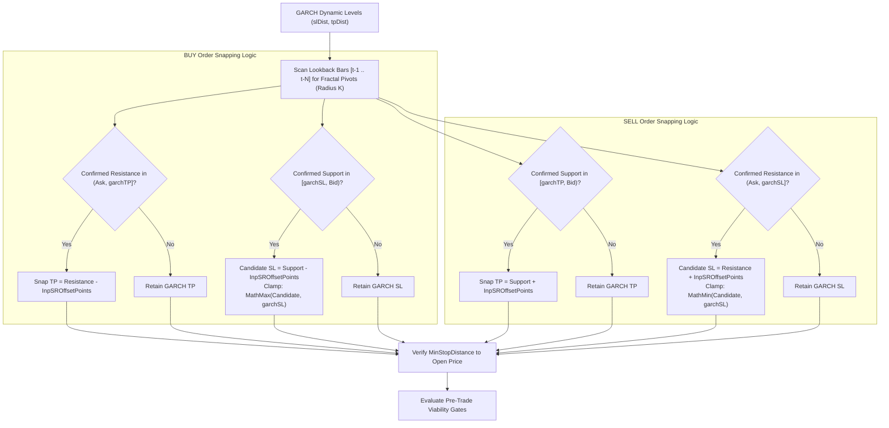

# Ecosystem Output Taxonomy & Causal Execution Signals Architecture
**Authoritative Technical Specification, Output Inventory, and Causal Order Routing Protocol**  
**Classification**: Institutional Quantitative Research & Financial Execution Architecture  
**System Standard**: Eastern European Time / Eastern European Summer Time (EET/EEST, MT5 Server Time: UTC+2 / UTC+3)  
**Applicability**: MetaTrader 5 Strategy Tester (`DMatrix-EA.mq5`), Live Execution Engine (`LiveONNX-EA.mq5`), Dual XGBoost Pipeline (`src/`), Macroeconomic SQLite Governance (`macro_governance.db`), Autonomous Macro Collector (`macro_agent/`), and Execution Telemetry Audit Engine (`AuditLogs/*.db`).

---

## Table of Contents
1. [Executive Summary & Architectural Abstract](#1-executive-summary--architectural-abstract)
2. [Complete Inventory of Ecosystem Outputs](#2-complete-inventory-of-ecosystem-outputs)
3. [Dataset Generation Subsystem (DMatrix-EA.mq5)](#3-dataset-generation-subsystem-dmatrix-eamq5)
   - [3.1 CSV Dataset File Structure & Schema Specifications](#31-csv-dataset-file-structure--schema-specifications)
   - [3.2 Feature Naming Conventions & Lag-Suffix Flattening](#32-feature-naming-conventions--lag-suffix-flattening)
   - [3.3 Triple Barrier Labeling & The Golden Rule of Net Liquid Profit](#33-triple-barrier-labeling--the-golden-rule-of-net-liquid-profit)
   - [3.4 In-Memory Ticket Tracking Architecture (Bypassing 31-Char Limit)](#34-in-memory-ticket-tracking-architecture-bypassing-31-char-limit)
   - [3.5 Unresolved Position Handling at Deinitialization (OnDeinit)](#35-unresolved-position-handling-at-deinitialization-ondeinit)
   - [3.6 Chronological QuickSort Invariant & Timestamp Stripping](#36-chronological-quicksort-invariant--timestamp-stripping)
   - [3.7 Dataset Metadata JSON Contract (<Symbol>_<TF>_metadata.json)](#37-dataset-metadata-json-contract-symbol_tf_metadatajson)
4. [Model Training & Compilation Subsystem (src/trainer.py & src/onnx_exporter.py)](#4-model-training--compilation-subsystem-srctrainerpy--srconnx_exporterpy)
   - [4.1 Dual Independent Gradient Boosting Modeling Rationale](#41-dual-independent-gradient-boosting-modeling-rationale)
   - [4.2 Time-Series Chronological Split (Zero Leakage)](#42-time-series-chronological-split-zero-leakage)
   - [4.3 Optuna Bayesian Optimization Engine & Trial Logs](#43-optuna-bayesian-optimization-engine--trial-logs)
   - [4.4 Booster Evaluation Metrics](#44-booster-evaluation-metrics)
   - [4.5 ONNX Compilation Contract (Pure 1D Float, [None, D] -> [None, 2])](#45-onnx-compilation-contract-pure-1d-float-none-d---none-2)
   - [4.6 Multi-Directory Deployment Matrix](#46-multi-directory-deployment-matrix)
   - [4.7 Calibrated Decision Thresholds & Probability Routing](#47-calibrated-decision-thresholds--probability-routing)
   - [4.8 Epistemic Uncertainty Quantification: Shannon Entropy H(p)](#48-epistemic-uncertainty-quantification-shannon-entropy-hp)
   - [4.9 Conviction Delta Squeeze (|P_buy - P_sell|)](#49-conviction-delta-squeeze-p_buy---p_sell)
   - [4.10 Dynamic Econometric Risk Coupling: GARCH(1,1) Volatility Metrics](#410-dynamic-econometric-risk-coupling-garch11-volatility-metrics)
   - [4.11 Structural S&R Snapped Geometry](#411-structural-sr-snapped-geometry)
   - [4.12 Directional XGBoost & Optuna Overrides Impact](#412-directional-xgboost--optuna-overrides-impact)
5. [Pipeline Artifacts Subsystem](#5-pipeline-artifacts-subsystem)
   - [5.1 Native MT5 Presets (.set) Generation](#51-native-mt5-presets-set-generation)
   - [5.2 Chart Templates (.tpl) Generation](#52-chart-templates-tpl-generation)
   - [5.3 Binary Compilation (.ex5) via MetaEditor CLI](#53-binary-compilation-ex5-via-metaeditor-cli)
6. [Macroeconomic SQLite Governance Subsystem (macro_governance.db)](#6-macroeconomic-sqlite-governance-subsystem-macro_governancedb)
   - [6.1 SQLite Architecture, WAL Mode, and Defensive Backup Infrastructure](#61-sqlite-architecture-wal-mode-and-defensive-backup-infrastructure)
   - [6.2 Table Schemas & Temporal Conventions](#62-table-schemas--temporal-conventions)
   - [6.3 Action Taxonomy Emitted to LiveONNX-EA.mq5](#63-action-taxonomy-emitted-to-liveonnx-eamq5)
   - [6.4 Runtime Regimes: Live Trading vs Strategy Tester Backtesting](#64-runtime-regimes-live-trading-vs-strategy-tester-backtesting)
7. [Live Execution Signals & MT5 Order Dispatch (LiveONNX-EA.mq5)](#7-live-execution-signals--mt5-order-dispatch-liveonnx-eamq5)
   - [7.1 Bar-Open Execution Trigger & Zero-Copy ONNX Inference](#71-bar-open-execution-trigger--zero-copy-onnx-inference)
   - [7.2 Probability Calibration, Decision Thresholds & Direction Filters](#72-probability-calibration-decision-thresholds--direction-filters)
   - [7.3 Dynamic GARCH(1,1) Volatility Risk Modeling](#73-dynamic-garch11-volatility-risk-modeling)
   - [7.4 Structural Support & Resistance (S&R) Snapping Subsystem](#74-structural-support--resistance-sr-snapping-subsystem)
   - [7.5 Pre-Trade Viability Governance (The 3 Protection Gates)](#75-pre-trade-viability-governance-the-3-protection-gates)
   - [7.6 Lot Sizing Governance: Fixed vs Dynamic Viable Downsizing](#76-lot-sizing-governance-fixed-vs-dynamic-viable-downsizing)
   - [7.7 Order Dispatch (CTrade), Filling Modes & Retcodes](#77-order-dispatch-ctrade-filling-modes--retcodes)
   - [7.8 Diagnostic Logging Streams & Telemetry Prefixes](#78-diagnostic-logging-streams--telemetry-prefixes)
   - [7.9 Consecutive Position & Signal Management Execution Outputs](#79-consecutive-position--signal-management-execution-outputs)
   - [7.10 Pre-Existing Open Positions Lifecycle & Dynamic TP/SL State Transitions](#710-pre-existing-open-positions-lifecycle--dynamic-tpsl-state-transitions)
   - [7.11 Custom Fitness Metric Output (OnTester)](#711-custom-fitness-metric-output-ontester)
8. [Mandatory Institutional Execution & Telemetry Audit Subsystem (CExecutionAuditor)](#8-mandatory-institutional-execution--telemetry-audit-subsystem-cexecutionauditor)
   - [8.1 Architectural Purpose: Leading vs. Lagging Indicators](#81-architectural-purpose-leading-vs-lagging-indicators)
   - [8.2 Database Physical Location & Concurrency](#82-database-physical-location-and-concurrency)
   - [8.3 Tri-Pillar Relational Table Schema (Exhaustive Column Mapping)](#83-tri-pillar-relational-table-schema-exhaustive-column-mapping)
   - [8.4 High-Value Quantitative Audit SQL Queries](#84-high-value-quantitative-audit-sql-queries)
9. [Causal Execution State Machines & System Flowcharts](#9-causal-execution-state-machines--system-flowcharts)
   - [9.1 End-to-End System Causal Pipeline Flowchart](#91-end-to-end-system-causal-pipeline-flowchart)
   - [9.2 Real-Time Order Execution & Defensive State Machine](#92-real-time-order-execution--defensive-state-machine)
10. [Critical Quantitative & Systems Engineering Audit](#10-critical-quantitative--systems-engineering-audit)
11. [Didactic References & Further Reading](#11-didactic-references--further-reading)

---

## 1. Executive Summary & Architectural Abstract

In automated quantitative currency trading, the barrier between mathematical signal generation and actual capital realization is governed by the rigor of **output taxonomy**, **contractual parity**, and **deterministic execution routing**. Financial currency time series exhibit extreme noise-to-signal ratios, structural non-stationarity, volatility clustering ([Mandelbrot, 1963](https://doi.org/10.1086/294632); [Bollerslev, 1986](https://doi.org/10.1016/0304-4076(86)90063-1)), and execution latency decay ([López de Prado, 2018](https://www.wiley.com/en-us/Advances+in+Financial+Machine+Learning-p-9781119482086)). 

The architecture implemented within this ecosystem unites five foundational domains:
1. **Empirical Dataset Generation**: Generating feature-rich, net-liquid-profit-labeled historical trade outcome datasets via the MetaTrader 5 Strategy Tester (`DMatrix-EA.mq5`).
2. **Dual Supervised Machine Learning**: Training independent directional binary classifiers with Bayesian hyperparameter optimization and chronological validation (`src/trainer.py`).
3. **Low-Latency Graph Compilation & Artifact Synchronization**: Pruning tree graphs into flat 1D Float ONNX tensors (`src/onnx_exporter.py`) and distributing synchronized presets (`.set`) and chart templates (`.tpl`).
4. **Macroeconomic SQLite Governance**: Ingesting high-impact news catalysts and scheduled economic calendar events to emit defensive capital preservation signals (`macro_governance.db`).
5. **Real-Time Live Order Execution & Telemetry Audit**: Ingesting live ticks, calculating dynamic econometric risk envelopes, snapping stops to structural support/resistance, enforcing account margin gates, and logging immutable 3-pillar audit telemetry into SQLite (`LiveONNX-EA.mq5`, `CExecutionAuditor.mqh`).

---

## 2. Complete Inventory of Ecosystem Outputs

The table below delineates the comprehensive catalog of all files, binary streams, database tables, and operating system artifacts produced across the lifecycle.

| Output Domain | Artifact Name / Stream Identifier | Producer Module | Consumer Module | Lifetime & Scope | Physical Storage Location | Data Format / Protocol | Data Type & Precision | Primary Failure Modes |
| :--- | :--- | :--- | :--- | :--- | :--- | :--- | :--- | :--- |
| **Dataset** | `<Symbol>_<TF>_buy.csv` | `DMatrix-EA.mq5` (`COrderTracker`) | `src/trainer.py` (`DualXGBoostTrainer`) | Persistent training corpus | `MQL5/Files/` or `Common/Files/` | Comma-Separated Values (ASCII) | 130 float features (`%.6f`) + 1 binary label (`%.1f`) | Disk full, file lock, zero samples, label skew |
| **Dataset** | `<Symbol>_<TF>_sell.csv` | `DMatrix-EA.mq5` (`COrderTracker`) | `src/trainer.py` (`DualXGBoostTrainer`) | Persistent training corpus | `MQL5/Files/` or `Common/Files/` | Comma-Separated Values (ASCII) | 130 float features (`%.6f`) + 1 binary label (`%.1f`) | Disk full, file lock, zero samples, label skew |
| **Dataset** | `<Symbol>_<TF>_metadata.json` | `src/dataset_manager.py` | `src/onnx_exporter.py` / Audits | Model governance contract | `MQL5/Files/Models/` & `Common/Files/Models/` | JSON (UTF-8, Indented) | Structured Dictionary (Counts, AUC, F1, Loss) | JSON decode error, file lock, missing keys |
| **Model / ML** | `model_buy.onnx` / `<Symbol>_<TF>_model_buy.onnx` | `src/onnx_exporter.py` | `LiveONNX-EA.mq5` (`OnnxRun`) | Production live inference | `MQL5/Files/Models/` & `Common/Files/Models/` | ONNX Graph (Protobuf) | Pure 1D Float `[None, 130] -> [None, 2]` (`FloatTensorType`) | ZipMap presence, tensor shape mismatch (ERR 5803) |
| **Model / ML** | `model_sell.onnx` / `<Symbol>_<TF>_model_sell.onnx` | `src/onnx_exporter.py` | `LiveONNX-EA.mq5` (`OnnxRun`) | Production live inference | `MQL5/Files/Models/` & `Common/Files/Models/` | ONNX Graph (Protobuf) | Pure 1D Float `[None, 130] -> [None, 2]` (`FloatTensorType`) | ZipMap presence, tensor shape mismatch (ERR 5803) |
| **Model / ML** | Optuna Trial Logs & Metrics | `src/trainer.py` | CLI Telemetry / CI | Ephemeral training logs | `stdout` / Process Console | Plain Text / Structured Log Streams | Tabular Floats (64-bit float LogLoss, ROC-AUC) | Non-convergence, invalid search space bounds |
| **Model / ML** | Threshold Sensitivity Grid | `src/trainer.py` | Quantitative Researcher / CLI | Parametric threshold sweep report | `stdout` / Process Console | Plain Text Tabular Stream | Grid: threshold $0.40 \dots 0.70$, step 0.02 | Empty validation set, zero positive class labels |
| **Artifacts** | `LiveONNX-EA_<Symbol>_<TF>.set` | `src/preset_generator.py` | `LiveONNX-EA.mq5` / Trader UI | Production runtime inputs | `MQL5/Presets/` & `Common/Files/Presets/` | MT5 Native Key-Value Config (UTF-8) | Key-value pairs (Booleans as 1/0, strings, doubles) | Missing key, invalid numeric string representation |
| **Artifacts** | `DMatrix-EA_<Symbol>_<TF>.set` | `src/preset_generator.py` | `DMatrix-EA.mq5` / Strategy Tester | Tester configuration | `MQL5/Presets/` & `Common/Files/Presets/` | MT5 Native Key-Value Config (UTF-8) | Key-value pairs (Booleans as 1/0, strings, doubles) | Missing key, invalid numeric string representation |
| **Artifacts** | `<Symbol>_<TF>.tpl` | `src/template_generator.py` | MT5 Chart Terminal UI | Visual chart layout | `Profiles/Templates/` & `Common/Files/Templates/` | MT5 Proprietary Chart Template (ASCII) | XML-like MT5 template blocks (Colors, Subwindows) | Corrupted template markup, missing indicator IDs |
| **Artifacts** | `DMatrix-EA.ex5` | `metaeditor.exe` | MT5 Strategy Tester Engine | Executable collector | `MQL5/Experts/` | Native MT5 Bytecode / x86-64 Native | Compiled Bytecode Executable | Syntax errors, missing includes, compilation lock |
| **Artifacts** | `LiveONNX-EA.ex5` | `metaeditor.exe` | MT5 Chart Terminal Engine | Executable trading agent | `MQL5/Experts/` | Native MT5 Bytecode / x86-64 Native | Compiled Bytecode Executable | Syntax errors, missing includes, compilation lock |
| **Macro DB** | `calendar_events` table | `macro_agent/db_client.py` | `LiveONNX-EA.mq5` (`DatabaseRead`) | Scheduled macro events | `Common/Files/macro_governance.db` | SQLite 3 Table (WAL Mode) | 8 columns: `start_time` / `end_time` (EET/EEST text), ints | Table lock (`SQLITE_BUSY`), missing columns |
| **Macro DB** | `news_events` table | `macro_agent/db_client.py` | `LiveONNX-EA.mq5` (`DatabaseRead`) | Breaking news blacklist | `Common/Files/macro_governance.db` | SQLite 3 Table (WAL Mode) | 5 columns: `symbol` PK, title/desc text, action | Table lock (`SQLITE_BUSY`), missing columns |
| **Macro DB** | `macro_governance.db.*.bkp` | `macro_agent/db_client.py` | Safe rollback recovery | Disaster recovery copy | `Common/Files/` | SQLite 3 Database Snapshot | Binary SQLite 3 database file snapshot | Disk full, permission denied during backup copy |
| **Audit DB** | `candle_telemetry` table | `LiveONNX-EA.mq5` (`CExecutionAuditor`) | Audit / Drift Detection Routines | Immutable bar-by-bar history | `Common/Files/AuditLogs/<Symbol>_<TF>_<TS>.db` | SQLite 3 Table (WAL Mode) | 45 active columns in MQL5 (expanding to 55) | Disk full, table lock, unescaped quote syntax error |
| **Audit DB** | `system_events_log` table | `LiveONNX-EA.mq5` (`CExecutionAuditor`) | System Incident Audits | Operational alert history | `Common/Files/AuditLogs/<Symbol>_<TF>_<TS>.db` | SQLite 3 Table (WAL Mode) | 8 columns: severity (`INFO`, `WARNING`, `ERROR`, `CRIT`) | Disk full, database handle invalid |
| **Audit DB** | `trade_lifecycle_log` table | `LiveONNX-EA.mq5` (`CExecutionAuditor`) | Trade Outcome Attribution | Closed-loop trade attribution | `Common/Files/AuditLogs/<Symbol>_<TF>_<TS>.db` | SQLite 3 Table (WAL Mode) | 25 active columns in MQL5 (expanding to 30) | Asynchronous deal race, missing position ID |
| **Execution** | Market Buy / Sell Orders | `LiveONNX-EA.mq5` (`CTrade`) | Broker Matching Engine | Live financial positions | Broker Trade Server Book | FIX 4.4 / MT5 Gateway Trade Request | Volume (0.01 lot step), fill price (5 decimals) | Offquotes (10004), market closed (10018), price off |
| **Execution** | Consecutive Scaling Orders | `LiveONNX-EA.mq5` (`CConsecutiveManager`) | Broker Matching Engine | Position continuation | Broker Trade Server Book | FIX 4.4 / MT5 Gateway Trade Request | Incremental lots, synchronized stops | Margin cushion breach, max consecutive orders reached |
| **Execution** | Position Modification Requests | `LiveONNX-EA.mq5` (`CTrade`) | Broker Matching Engine | SL/TP / Breakeven / Trail | Broker Trade Server Book | FIX 4.4 / MT5 Gateway Stop Modification | Stop prices clamped to StopsLevel | Invalid stops (10016), frozen levels |
| **Execution** | Position Close Requests | `LiveONNX-EA.mq5` (`CTrade`) | Broker Matching Engine | Liquidation / Emergency | Broker Trade Server Book | FIX 4.4 / MT5 Gateway Market Order | Full or partial volume closure | Price off (10021), offquotes (10004) |
| **Telemetry** | `[LiveONNX-EA]` Diagnostic Logs | `LiveONNX-EA.mq5` (`PrintFormat`) | Terminal Journal / Audits | Real-time observability | Terminal `logs/` & Experts Tab | UTF-16 / UTF-8 Log Strings | Formatted strings (Prices, latencies, tickets) | String truncation, console buffer overflow |
| **Optimization**| `OnTester()` Custom Fitness Score | `LiveONNX-EA.mq5` (`OnTester`) | Strategy Tester Optimizer | Parameter search ranking | MT5 Optimization Results | Double Precision Scalar | Recovery Ratio: $\frac{\text{NetProfit}}{\text{MaxDD}} \cdot \min(\text{PF}, 5)$ | Zero trades executed, division by zero |

---

## 3. Dataset Generation Subsystem (`DMatrix-EA.mq5`)

The data collection subsystem solves the **Triple Barrier Labeling Problem** ([López de Prado, 2018](https://www.wiley.com/en-us/Advances+in+Financial+Machine+Learning-p-9781119482086)) within MetaTrader 5 without introducing lookahead bias, memory leaks, or string truncation artifacts.

### 3.1 CSV Dataset File Structure & Schema Specifications

The collector produces two strictly partitioned files per asset and timeframe:
- `<Symbol>_<Timeframe>_buy.csv` (e.g., `EURUSD_H1_buy.csv`)
- `<Symbol>_<Timeframe>_sell.csv` (e.g., `EURUSD_H1_sell.csv`)

#### Exact CSV File Conventions:
1. **Delimiter**: Strict single comma (`,`), without whitespace padding.
2. **Line Terminations**: Standard CRLF (`\r\n`) or LF (`\n`).
3. **Numerical Precision**: Float feature values formatted to 6 decimal places (`%.6f`), and binary labels formatted to 1 decimal place (`%.1f`), e.g., `1.0` or `0.0`.
4. **Header Line**: A single comma-delimited string representing all flattened feature names across the lookback horizon, terminated strictly with the final token `,label`.
5. **Timestamp Column Stripping**: While timestamps (`datetime baseTimestamp`) are stored internally in RAM to guarantee chronological sorting, they are **strictly excluded** from the final CSV file. This prevents decision trees from memorizing absolute time indices, forcing gradient boosting splits to evaluate purely stationary market indicators, volatility, and geometry.

#### Sample Header and Data Rows ($N=4$ Lookback, 130 Features):
```csv
adx_main_t,adx_pdi_t,adx_ndi_t,atr_t,bands_diff_mid_t,bands_bandwidth_t,macd_main_t,macd_signal_t,ma_fast_diff_t,ma_slow_diff_t,rsi_t,stoch_k_t,stoch_d_t,candle_type_t,candle_body_t,candle_upper_shadow_t,candle_lower_shadow_t,timestamp_week_t,timestamp_day_t,open_markets_t,spread_t,garch_omega_t,garch_vol_ratio_t,garch_vol_trend_t,garch_sigma_cond_t,garch_sigma_agg_t,...,garch_sigma_agg_t_minus_4,label
24.125000,18.430000,22.110000,145.000000,-12.000000,280.000000,-0.000450,-0.000320,-8.000000,15.000000,48.250000,35.400000,42.100000,1.000000,25.000000,12.000000,8.000000,2.000000,1.000000,3.000000,2.000000,0.000012,1.045000,0.985000,0.004210,0.011850,...,0.011200,1.0
```

### 3.2 Feature Naming Conventions & Lag-Suffix Flattening

Feature extraction is orchestrated by `CFeatureExtractor` (`MQL5/Include/FeatureExtractor.mqh`). The engine extracts atomic features from $t$ through historical lookback lag $t-H$, where $H = \text{InpFeatureLookback}$.

The mathematical dimensionality $D$ of the row vector $\mathbf{x}_t$ is:
$$D = K_{\text{base}} \times (H + 1)$$
where $K_{\text{base}}$ is the number of active base features per single bar ($K_{\text{base}} = 26$ when all toggles are active).

#### Header Suffixing Convention:
- Current decision bar ($h = 0$): `<base_feature_name>_t`
- Lagged historical bars ($h \in [1, H]$): `<base_feature_name>_t_minus_<h>`

### 3.3 Triple Barrier Labeling & The Golden Rule of Net Liquid Profit

Labeling in `COrderTracker` (`MQL5/Include/OrderTracker.mqh`) translates market path trajectory into a binary outcome $y \in \{0.0f, 1.0f\}$.

#### Mathematical Definition of Barriers:
1. **Upper Barrier (Take Profit)**:
   $$\text{TP}_{\text{buy}} = P_{\text{ask}} + \Delta_{\text{TP}}, \quad \text{TP}_{\text{sell}} = P_{\text{bid}} - \Delta_{\text{TP}}$$
   where $\Delta_{\text{TP}} = \max(\text{InpLabelMinPoints} \cdot \text{\_Point}, (\text{StopsLevel} + \text{Spread} + 5) \cdot \text{\_Point})$.
2. **Lower Barrier (Stop Loss)**:
   $$\text{SL}_{\text{buy}} = P_{\text{bid}} - \Delta_{\text{SL}}, \quad \text{SL}_{\text{sell}} = P_{\text{ask}} + \Delta_{\text{SL}}$$
   where $\Delta_{\text{SL}} = \max(\text{InpLabelMaxAdversePoints} \cdot \text{\_Point}, (\text{StopsLevel} + \text{Spread} + 5) \cdot \text{\_Point})$.
3. **Vertical Barrier (Holding Horizon Timeout)**:
   Checked on every bar open via `COrderTracker::CheckTimeouts`:
   $$\tau_{\text{holding}} = \text{iBarShift}(\text{\_Symbol}, \text{\_Period}, t_{\text{base}}, \text{true}) \ge \text{InpLabelHorizonBars}$$

#### The Golden Rule of Net Liquid Profit:
A trade is **only** marked as $1.0f$ if the capital account balance increased in net cash:
$$\Pi_{\text{net}} = \text{DEAL\_PROFIT} + \text{DEAL\_SWAP} + \text{DEAL\_COMMISSION}$$

$$\text{Label } y_i = \begin{cases} 
1.0f, & \text{if } \Pi_{\text{net}} > 0.0 \land \Big( \text{Reason} = \text{DEAL\_REASON\_TP} \lor \text{ProximityTP}(P_{\text{close}}, \text{TP}) \Big) \\
0.0f, & \text{if } \Pi_{\text{net}} \le 0.0 \lor \text{Reason} = \text{DEAL\_REASON\_SL} \lor \text{VerticalTimeout} \lor \text{Unresolved}
\end{cases}$$

> **Key Invariant**: If an order touches Take Profit, but extreme broker commissions or negative financing swap reduce $\Pi_{\text{net}} \le 0.0$, the sample is **strictly classified as $0.0f$**. This ensures gradient boosting never optimizes toward financially dilutive signals.

### 3.4 In-Memory Ticket Tracking Architecture (Bypassing 31-Char Limit)

MetaTrader 5 limits order comments (`MqlTradeRequest::comment`) to **31 ANSI characters**. A 130-dimensional floating-point feature vector requires $\approx 1100$ characters, rendering comment-based state passing impossible.

`COrderTracker` bypasses this by allocating dynamic memory buffers in RAM:
```cpp
struct STrackedPosition
{
   ulong                ticket;         // DEAL_POSITION_ID
   ENUM_POSITION_TYPE   posType;        // POSITION_TYPE_BUY or POSITION_TYPE_SELL
   datetime             baseTimestamp;  // Exact bar open time when feature vector was locked
   double               openPrice;      // Entry fill price
   double               tpPrice;        // Initial Take Profit price
   double               slPrice;        // Initial Stop Loss price
   float                features[];     // Complete 1D float array of features [D]
   int                  featureCount;   // Dimensionality D
   bool                 isActive;       // Active tracking flag
};
```
When `g_trade.Buy()` or `g_trade.Sell()` executes, `COrderTracker::RegisterPosition` links the resulting position ID to its pre-extracted feature vector. When the position deal appears in `OnTradeTransaction`, the transaction handler matches `DEAL_POSITION_ID`, computes $\Pi_{\text{net}}$, and records the training sample without any intermediate serialization.

### 3.5 Unresolved Position Handling at Deinitialization (`OnDeinit`)

When a Strategy Tester backtest concludes, the terminal invokes `OnDeinit(const int reason)`. Any position registered in RAM that remains open (`isActive == true`) has not reached the upper barrier within the simulation span.

`COrderTracker::ProcessUnresolvedPositions()` iterates over all remaining active positions:
```cpp
for(int i = 0; i < m_activeCount; i++) {
   if(!m_activePositions[i].isActive) continue;
   AddSample(m_activePositions[i].baseTimestamp, m_activePositions[i].posType, 0.0f,
             m_activePositions[i].features, m_activePositions[i].featureCount);
   m_activePositions[i].isActive = false;
}
```
**Quantitative Invariant**: All unresolved positions are strictly classified as $0.0f$ (`NOT_OPEN`). This avoids positive survivorship bias at the historical cutoff boundary.

### 3.6 Chronological QuickSort Invariant & Timestamp Stripping

Financial time series exhibit autocorrelation. To strictly enforce chronological ordering without dynamic struct copying, `COrderTracker::SortChronologically()` employs an index-based QuickSort:
- An array `int m_sortIndices[]` of size $N_{\text{samples}}$ is initialized to $[0, 1, \dots, N-1]$.
- QuickSort partitions the indices by comparing `m_recordedSamples[m_sortIndices[i]].baseTimestamp`.
- Samples are then written to the CSV file sequentially using `m_sortIndices[k]`.

This ensures:
$$t_{\text{base}}(k) \le t_{\text{base}}(k+1), \quad \forall k \in [0, N-2]$$
guaranteeing that chronological splits in Python maintain the arrow of time with zero forward lookahead leakage.

### 3.7 Dataset Metadata JSON Contract (`<Symbol>_<TF>_metadata.json`)

Synchronized during training and deployed alongside models:
```json
{
  "symbol": "EURUSD",
  "timeframe": "H1",
  "num_features": 130,
  "feature_names": [
    "adx_main_t",
    "adx_pdi_t",
    "garch_sigma_agg_t_minus_4"
  ],
  "timestamp": "2026-09-04 12:00:00 UTC",
  "metrics": {
    "buy": {
      "direction": "BUY",
      "total_samples": 8420,
      "train_samples": 6736,
      "val_samples": 1684,
      "roc_auc": 0.6124,
      "accuracy": 0.5842,
      "log_loss": 0.6712,
      "best_iteration": 42
    },
    "sell": {
      "direction": "SELL",
      "total_samples": 8420,
      "train_samples": 6736,
      "val_samples": 1684,
      "roc_auc": 0.6045,
      "accuracy": 0.5789,
      "log_loss": 0.6748,
      "best_iteration": 38
    }
  }
}
```

---

## 4. Model Training & Compilation Subsystem (`src/trainer.py` & `src/onnx_exporter.py`)

### 4.1 Dual Independent Gradient Boosting Modeling Rationale

Rather than training a multi-class model with target $y \in \{-1, 0, 1\}$, the architecture enforces **two independent binary estimators**:
1. $\mathcal{M}_{\text{buy}}: \mathbf{x}_t \mapsto P(\text{BUY is Profitable} \mid \mathbf{x}_t) \in [0.0, 1.0]$
2. $\mathcal{M}_{\text{sell}}: \mathbf{x}_t \mapsto P(\text{SELL is Profitable} \mid \mathbf{x}_t) \in [0.0, 1.0]$

#### Quantitative Justifications:
- **Asymmetric Liquidity Regimes**: In currency markets, bullish expansions often exhibit steady drift with moderate volatility, whereas bearish cascades frequently trigger liquidity vacuums and sharp volatility spikes. Separate tree ensembles allow different split depths and feature weights per direction.
- **Independent Calibration Thresholds**: Calibrating decision thresholds $\tau_{\text{buy}}$ (`InpMinimalLevelAcceptedBuy`) and $\tau_{\text{sell}}$ (`InpMinimalLevelAcceptedSell`) independently allows quantitative analysts to impose stricter probability barriers on the less predictable side of a structural trend.
- **Ambiguity Rejection**: When $P(\text{BUY}) \ge \tau_{\text{buy}}$ and $P(\text{SELL}) \ge \tau_{\text{sell}}$ simultaneously, the model signals market confusion (e.g. wide whipsaw candles). The live engine uses relative dominance ($P(\text{BUY}) > P(\text{SELL})$) or blocks execution entirely.

### 4.2 Time-Series Chronological Split (Zero Leakage)

Data is split sequentially without shuffling:
$$N_{\text{val}} = \lfloor N_{\text{total}} \times \text{VALIDATION\_PERCENTAGE} \rfloor, \quad N_{\text{train}} = N_{\text{total}} - N_{\text{val}}$$
$$\mathcal{D}_{\text{train}} = \{(\mathbf{x}_i, y_i)\}_{i=1}^{N_{\text{train}}}, \quad \mathcal{D}_{\text{val}} = \{(\mathbf{x}_i, y_i)\}_{i=N_{\text{train}}+1}^{N_{\text{total}}}$$

All hyperparameter tuning and early stopping decisions are computed exclusively on $\mathcal{D}_{\text{val}}$, preserving true out-of-sample validity.

### 4.3 Optuna Bayesian Optimization Engine & Trial Logs

Hyperparameter optimization is executed via Optuna ([Akiba et al., 2019](https://doi.org/10.1145/3292500.3330701)) using Tree-structured Parzen Estimators (TPE), parameterized directionally through `DirectionalXGBConfig` (`config.get_directional_config(direction)`):

```python
# Directional Regularization and Tree Parameter Search Space
dir_cfg = config.get_directional_config(direction)
min_depth = max(2, dir_cfg.max_depth - 1)
max_depth = min(8, dir_cfg.max_depth + 2)
learning_rate = trial.suggest_float("learning_rate", min_eta, max_eta, log=True)
subsample = trial.suggest_float("subsample", min_sub, max_sub)
colsample_bytree = trial.suggest_float("colsample_bytree", min_col, max_col)
reg_lambda = trial.suggest_float("reg_lambda", min_lam, max_lam) # Proportional L2
reg_alpha = trial.suggest_float("reg_alpha", min_alp, max_alp)   # Proportional L1
```

**Optimization Objective**: Minimize out-of-sample loss configured directionally (`OPTUNA_BUY_OBJECTIVE_METRIC` / `OPTUNA_SELL_OBJECTIVE_METRIC`):
- `logloss`: $-\frac{1}{N_{\text{val}}} \sum_{i=1}^{N_{\text{val}}} [ y_i \ln(\hat{p}_i) + (1 - y_i) \ln(1 - \hat{p}_i) ]$
- `roc_auc`: $1.0 - \text{ROC\_AUC}$
- `precision`: $1.0 - \text{Precision}(\tau_{\text{dir}})$
- `f1`: $1.0 - \text{F1}(\tau_{\text{dir}})$

### 4.4 Booster Evaluation Metrics

Each trained model produces four canonical metrics:
1. **ROC-AUC**: Area Under the Receiver Operating Characteristic Curve. Evaluates ranking discriminability independent of arbitrary probability cutoffs.
2. **Accuracy**: Fraction of correct directional assignments at threshold $\tau = 0.5$.
3. **LogLoss**: Calibrated cross-entropy loss measuring the quality of probability estimates.
4. **Best Iteration**: The optimal boosting round $m^*$ where validation loss achieved its minimum before early stopping intervened ($E = \text{XGB\_EARLY\_STOPPING\_ROUNDS}$).

### 4.5 ONNX Compilation Contract (Pure 1D Float, `[None, D] -> [None, 2]`)

MetaTrader 5's native ONNX runtime (`OnnxRun`) imposes strict constraints. Standard converters (such as `skl2onnx` or default `onnxmltools`) inject `ZipMap` operators to map integer labels to strings or maps. MQL5 cannot parse non-tensor sequences and fails with runtime crashes or error `5803` (`ERR_ONNX_INVALID_PARAMETERS`).

`ONNXExporter` (`src/onnx_exporter.py`) resolves this via graph surgery:
```python
# 1. Prune all outputs except 'probabilities'
prob_output = [out for out in raw_onnx.graph.output if out.name == "probabilities"][0]
pruned_model = onnx.ModelProto()
pruned_model.CopyFrom(raw_onnx)
del pruned_model.graph.output[:]
pruned_model.graph.output.append(prob_output)
```

#### Final Compiled Tensor Contract:
- **Input Node**:
  - Name: `"float_input"`
  - Type: `FloatTensorType` (IEEE 754 32-bit float)
  - Dimensions: `[None, D]` (where $D = \text{num\_features}$)
- **Output Node**:
  - Name: `"probabilities"`
  - Type: `FloatTensorType` (IEEE 754 32-bit float)
  - Dimensions: `[None, 2]`
    - Column `0`: $P(y = 0 \mid \mathbf{x})$ $\implies$ Probability of NOT_OPEN / SL Hit.
    - Column `1`: $P(y = 1 \mid \mathbf{x})$ $\implies$ Probability of OPEN / TP Hit.

### 4.6 Multi-Directory Deployment Matrix

ONNX models and metadata JSON files are mirrored to prevent execution failure in both local and sandboxed Strategy Tester terminal configurations:
1. Terminal Local Path: `<TERMINAL_DATA_PATH>/MQL5/Files/Models/`
2. Terminal Shared Common Path: `<COMMON_PATH>/Files/Models/`

### 4.7 Calibrated Decision Thresholds & Probability Routing ($Th_{\text{buy}}, Th_{\text{sell}}$)

The dual estimators emit conditional probabilities $P(\text{OPEN} \mid \mathbf{x}_t) \in [0.0, 1.0]$. The transition to executable order signals is governed by directionally calibrated decision thresholds ($Th_{\text{buy}} \equiv \text{InpMinimalLevelAcceptedBuy}$, $Th_{\text{sell}} \equiv \text{InpMinimalLevelAcceptedSell}$):
- Directional Gating Criteria:
  $$\text{RawBuySignal} \iff P_{\text{buy}} \ge Th_{\text{buy}}$$
  $$\text{RawSellSignal} \iff P_{\text{sell}} \ge Th_{\text{sell}}$$
- Trade Direction Mode Filter (`InpTradeDirection`):
  - `DIRECTION_ONLY_BUY` (1): Executes BUY if $\text{RawBuySignal}$ is true; suppresses all SELL inferences.
  - `DIRECTION_ONLY_SELL` (2): Executes SELL if $\text{RawSellSignal}$ is true; suppresses all BUY inferences.
  - `DIRECTION_BOTH` (0): Evaluates relative dominance:
    $$\text{BuyCandidate} \iff \text{RawBuySignal} \land (P_{\text{buy}} > P_{\text{sell}})$$
    $$\text{SellCandidate} \iff \text{RawSellSignal} \land (P_{\text{sell}} > P_{\text{buy}})$$

### 4.8 Epistemic Uncertainty Quantification: Shannon Entropy $H(p)$

To detect out-of-distribution regime shifts, market chop, and model disorientation in production, `LiveONNX-EA.mq5` computes the informational Shannon Entropy ([Shannon, 1948](https://doi.org/10.1002/j.1538-7305.1948.tb01338.x)) for both directional classifiers:
$$H(p) = - \frac{p \ln(p) + (1 - p) \ln(1 - p)}{\ln 2} \in [0.0, 1.0]$$
The composite candle entropy recorded in `candle_telemetry` is the ensemble mean:
$$\bar{H}_t = \frac{H(P_{\text{buy}}) + H(P_{\text{sell}})}{2}$$
- **Microstructural Interpretation**:
  - $\bar{H}_t < 0.35$: Decisive consensus; high conviction directional separation.
  - $\bar{H}_t \in [0.35, 0.85]$: Normal stochastic market regime.
  - $\bar{H}_t > 0.85$: Epistemic confusion; probabilities hover near $0.50$, indicating severe noise or structural trend exhaustion.

### 4.9 Conviction Delta Squeeze ($|P_{\text{buy}} - P_{\text{sell}}|$)

The absolute difference between directional model predictions:
$$\Delta_P = |P_{\text{buy}} - P_{\text{sell}}| \in [0.0, 1.0]$$
- $\Delta_P \ge 0.20$: Strong directional divergence; statistical edge is distinct.
- $\Delta_P < 0.05$: Conviction squeeze; both classifiers evaluate the market state with nearly identical likelihoods, flagging high risk of whipsaw.
- **Conflicting Signals Trigger**: If $P_{\text{buy}} \ge Th_{\text{buy}} \land P_{\text{sell}} \ge Th_{\text{sell}}$, `conflictingSignals = true`. Under `InpIgnoreConflictingSignals = true`, both signals are neutralized to protect capital.

### 4.10 Dynamic Econometric Risk Coupling: GARCH(1,1) Volatility Metrics

To prevent train-serving skew and eliminate arbitrary fixed-pip stops, the live trading engine couples the ML signal to the continuous GARCH(1,1) econometric state:
- **$\sigma_{\text{cond}}$ (`garchSigmaCond`)**: One-step conditional standard deviation forecast:
  $$\sigma_{\text{cond}} = \sqrt{\omega + \alpha \epsilon_{t-1}^2 + \beta \sigma_{t-1}^2}$$
- **$\sigma_{\text{agg}}$ (`garchSigmaAgg`)**: Aggregated multi-step forward volatility over holding horizon $H_{\text{risk}}$ (`InpRiskGarchHorizon`):
  $$\sigma_{\text{agg}} = \sqrt{ \sum_{h=1}^{H_{\text{risk}}} \left( \bar{\sigma}^2 + (\alpha + \beta)^{h-1}(\sigma_t^2 - \bar{\sigma}^2) \right) }$$
- **$\text{VolRatio}$ (`garchVolRatio`)**: Expansion ratio $\frac{\sigma_{\text{cond}}}{\sqrt{s^2}}$, where $s^2$ is unconditional sample variance.
- **Dynamic GARCH Stop Envelopes**:
  $$\text{garchTpPoints} = \text{InpKTP} \cdot \frac{P_{\text{close}} \cdot \sigma_{\text{agg}}}{\text{\_Point}}, \quad \text{garchSlPoints} = \text{InpKSL} \cdot \frac{P_{\text{close}} \cdot \sigma_{\text{agg}}}{\text{\_Point}}$$

### 4.11 Structural S&R Snapped Geometry (`finalTpPrice`, `finalSlPrice`, `srZoneType`)

When `InpEnableSRSnapping = true`, dynamic stops are geometrically refined against structural swing pivots:
- `finalTpPrice`: The finalized Take Profit price after scanning swing pivots in $[t-1 \dots t-N]$ and snapping inside resistance (BUY) or support (SELL) with `InpSROffsetPoints` buffer.
- `finalSlPrice`: The finalized Stop Loss price, snapped beyond support (BUY) or resistance (SELL) and strictly clamped to never exceed `garchSlPoints`.
- `srZoneType`: Categorical output string (`"SWING_PIVOT"`, `"SWING_HIGH"`, `"SWING_LOW"`, or `"NONE"`).

### 4.12 Directional XGBoost & Optuna Overrides Impact

When directional overrides are specified in `.env` (e.g. `XGB_BUY_MAX_DEPTH=5` vs `XGB_SELL_MAX_DEPTH=3`), the trainer instantiates asymmetric booster configurations via `DirectionalXGBConfig`. The output ONNX graphs maintain identical input/output tensor shapes, but encapsulate distinct tree topologies optimized for bullish versus bearish market regimes.

---

## 5. Pipeline Artifacts Subsystem

Beyond machine learning models, the automated pipeline generates native platform configurations to ensure identical execution behavior.

### 5.1 Native MT5 Presets (`.set`) Generation

The preset generator (`src/preset_generator.py`) formats configuration variables into MetaTrader 5's proprietary key-value format. Presets are mirrored to `<TERMINAL_DATA_PATH>/MQL5/Presets/` and `<COMMON_PATH>/Files/Presets/`.

#### Exact Preset Keys (`LiveONNX-EA_<Symbol>_<TF>.set`):
```ini
; MetaTrader 5 Expert Advisor Settings (.set)
; Auto-generated by MT5 MLOps Pipeline (EURUSD H1)
InpMagicNumber=222100
InpTradeDirection=0
InpMinimalLevelAcceptedBuy=0.50
InpMinimalLevelAcceptedSell=0.50
InpLotSize=0.01
InpConsecutiveMode=0
InpMaxConsecutiveOrders=3
InpHurdleProfitPct=50.0
InpProfitLockPct=50.0
InpAntiChopMinDisplacement=150
InpSafetyOffsetPoints=20
InpEnableSwapAmortization=1
InpConsecutiveSlotFilter=0
InpIgnoreConflictingSignals=1
InpEnableOpposingRegimeFilter=0
InpOpposingStreakThreshold=2
InpOpposingAction=0
InpOpposingTrailingPoints=50
InpOpposingRecalculateRatio=0.5
InpIgnoreAudit=0
InpFeatureLookback=4
InpUseADX=1
InpUseATR=1
InpUseBands=1
InpUseMACD=1
InpUseFastMA=1
InpUseSlowMA=1
InpUseRSI=1
InpUseStochastic=1
InpUseCandlestick=1
InpUseTimestampWeek=1
InpUseTimestampDay=1
InpUseOpenMarkets=1
InpUseSpread=1
InpUseGarchFeatures=1
InpGarchHorizon=8
InpPriceSize=500
InpGarchAlpha=0.05
InpGarchBeta=0.92
InpEnableSRSnapping=1
InpSRLookbackBars=12
InpSRPivotStrength=2
InpSROffsetPoints=30
InpSRZoneSelection=0
InpEnableRiskFilter=1
InpEnableDynamicLotSizing=0
InpMaxLotSize=0.05
InpMarginSafetyMultiplier=1.5
InpMaxRiskRewardRatio=1.5
InpMaxTradeRiskPct=3.0
InpEnableCalendarFilter=1
InpEnableNewsFilter=1
InpRiskGarchHorizon=8
InpKTP=1.5
InpKSL=1.5
InpTradeMonday=1
InpMondayStartTime=11:00:00
InpMondayEndTime=18:00:00
InpTradeTuesday=1
InpTuesdayStartTime=10:00:00
InpTuesdayEndTime=18:00:00
InpTradeWednesday=1
InpWednesdayStartTime=10:00:00
InpWednesdayEndTime=18:00:00
InpTradeThursday=1
InpThursdayStartTime=10:00:00
InpThursdayEndTime=18:00:00
InpTradeFriday=1
InpFridayStartTime=10:00:00
InpFridayEndTime=16:00:00
InpModelBuyPath=Models/EURUSD_H1_model_buy.onnx
InpModelSellPath=Models/EURUSD_H1_model_sell.onnx
InpADXPeriod=14
InpATRPeriod=14
InpBandsPeriod=20
InpBandsShift=0
InpBandsDev=2.0
InpBandsAppliedPrice=0
InpMACDFastPeriod=12
InpMACDSlowPeriod=26
InpMACDSignalPeriod=9
InpMACDAppliedPrice=0
InpFastMAPeriod=20
InpFastMAShift=0
InpFastMAMethod=1
InpFastMAAppliedPrice=0
InpSlowMAPeriod=50
InpSlowMAShift=0
InpSlowMAMethod=1
InpSlowMAAppliedPrice=0
InpRSIPeriod=14
InpRSIAppliedPrice=0
InpStochK=8
InpStochD=3
InpStochSlowing=3
InpStochMethod=0
InpStochPriceField=0
```

### 5.2 Chart Templates (`.tpl`) Generation

`TemplateGenerator` (`src/template_generator.py`) generates ASCII chart template files (`<Symbol>_<TF>.tpl`) deployed to:
- `<TERMINAL_DATA_PATH>/MQL5/Profiles/Templates/`
- `<TERMINAL_DATA_PATH>/Profiles/Templates/`
- `<COMMON_PATH>/Files/Templates/`

**Visual Elements Injected**:
- Pure black background (`color_background=0`), lime bull candles (`color_candle_bull=65280`), crimson bear candles (`color_candle_bear=255`).
- Subwindow indicator bindings matching active feature toggles: Bollinger Bands overlay, Fast MA, Slow MA, MACD, RSI, Stochastic, ATR, and ADX sub-windows.

### 5.3 Binary Compilation (`.ex5`) via MetaEditor CLI

Synchronous compilation is executed via the MetaEditor command-line interface:
```powershell
metaeditor64.exe /compile:"MQL5\Experts\LiveONNX-EA.mq5" /log:"compile_LiveONNX-EA.log"
```
Produces optimized 64-bit bytecode artifacts:
- `MQL5/Experts/DMatrix-EA.ex5`
- `MQL5/Experts/LiveONNX-EA.ex5`

---

## 6. Macroeconomic SQLite Governance Subsystem (`macro_governance.db`)

Automated trading models are vulnerable to non-modeled macroeconomic regime shifts (e.g. emergency central bank rate cuts, geopolitical conflict, or shock macroeconomic reports). The architecture provides a persistent SQLite database located in `Common/Files/macro_governance.db` to govern real-time EA behavior.

### 6.1 SQLite Architecture, WAL Mode, and Defensive Backup Infrastructure

- **Location**: `%APPDATA%\MetaQuotes\Terminal\Common\Files\macro_governance.db`
- **Concurrency & WAL Mode**: Configured with `PRAGMA journal_mode=WAL;` and `PRAGMA busy_timeout=5000;`, enabling concurrent read access by multiple terminal charts while Python writes news events.
- **Defensive Transaction Backup (`safe_db_transaction`)**:
  1. Executes `PRAGMA wal_checkpoint(TRUNCATE);`.
  2. Creates timestamped backup snapshot: `macro_governance.db.YYYYMMDD_HHMMSS_ffffff.bkp`.
  3. Executes database modification.
  4. Runs `PRAGMA integrity_check;`.
  5. Rolls back immediately from `.bkp` snapshot if corruption is detected.

### 6.2 Table Schemas & Temporal Conventions

All event timestamps operate strictly in **EET/EEST MT5 Server Time** formatted as `"YYYY-MM-DD HH:MM:SS"`.

#### 1. Table `calendar_events` (Scheduled Economic Releases):
```sql
CREATE TABLE IF NOT EXISTS calendar_events (
    id INTEGER PRIMARY KEY AUTOINCREMENT,
    symbol TEXT NOT NULL,                  -- Currency pair ('EURUSD', 'EUR', 'USD', or 'GLOBAL')
    title TEXT NOT NULL,                   -- Catalyst title (e.g. 'US Non-Farm Payrolls')
    description TEXT NOT NULL,            -- Detailed rationale or forecast deviation
    start_time TEXT NOT NULL,             -- EET/EEST Blackout Start ("YYYY-MM-DD HH:MM:SS")
    end_time TEXT NOT NULL,               -- EET/EEST Blackout End ("YYYY-MM-DD HH:MM:SS")
    action TEXT NOT NULL DEFAULT 'BLOCK_ENTRIES', -- Defensive instruction
    trailing_points INTEGER NOT NULL DEFAULT 0    -- Protective trail buffer in points
);
CREATE INDEX IF NOT EXISTS idx_cal_lookup ON calendar_events (symbol, start_time, end_time);
```

#### 2. Table `news_events` (Unscheduled Breaking News Blacklist):
```sql
CREATE TABLE IF NOT EXISTS news_events (
    symbol TEXT PRIMARY KEY,               -- Symbol or 'GLOBAL'
    title TEXT NOT NULL,                   -- Breaking headline
    description TEXT NOT NULL,            -- Qualitative context
    action TEXT NOT NULL DEFAULT 'BLOCK_ENTRIES',
    trailing_points INTEGER NOT NULL DEFAULT 0
);
```

### 6.3 Action Taxonomy Emitted to `LiveONNX-EA.mq5`

When a query matches the current symbol and timestamp, the EA receives one of five discrete action signals:

```mermaid
stateDiagram-v2
    [*] --> Standby: Regular Market Flow
    Standby --> MacroQuery: New Bar Opened
    
    MacroQuery --> ActionBlockEntries: action == 'BLOCK_ENTRIES'
    MacroQuery --> ActionAdvisory: action == 'ADVISORY_ONLY'
    MacroQuery --> ActionCloseAll: action == 'CLOSE_ALL'
    MacroQuery --> ActionBreakeven: action == 'BREAKEVEN'
    MacroQuery --> ActionTrailingStop: action == 'TRAILING_STOP'
    
    ActionBlockEntries --> Standby: Suppress New Orders (Keep Existing Positions Open)
    ActionAdvisory --> NormalInference: Log Warning to Journal (Do Not Block)
    
    ActionCloseAll --> MarketLiquidation: CTrade::PositionClose on All Tickets
    MarketLiquidation --> Standby: Block New Orders
    
    ActionBreakeven --> ModifySLToOpen: Move SL to Entry Price (If in Profit >= MinStopDist)
    ModifySLToOpen --> Standby: Block New Orders
    
    ActionTrailingStop --> TrailSLPoints: Trail SL by trailing_points (If trailing_points > 0)
    ActionTrailingStop --> MarketLiquidation: Fallback Close (If trailing_points <= 0)
    TrailSLPoints --> Standby: Block New Orders
```

1. **`BLOCK_ENTRIES`**:
   - **Causal Execution**: EA terminates candidate order evaluation for current bar.
   - **Impact on Open Positions**: Zero. Existing trades remain governed by their dynamic GARCH/S&R stops.
2. **`TRAILING_STOP`**:
   - **Causal Execution**: EA suppresses new entries and iterates over active positions matching `InpMagicNumber`. For profitable positions where distance exceeds `trailing_points`, Stop Loss is modified to `Bid - trailingDist` (Buy) or `Ask + trailingDist` (Sell).
   - **Safety Liquidation Fallback**: If `trailing_points <= 0` or modification fails, triggers **immediate market liquidation (`PositionClose`)**.
3. **`BREAKEVEN`**:
   - **Causal Execution**: EA suppresses new entries and advances Stop Loss to entry price for positions in profit.
   - **Safety Liquidation Fallback**: If distance to entry violates broker minimum stop distance, position is closed immediately at market to guarantee zero financial downside.
4. **`CLOSE_ALL`**:
   - **Causal Execution**: EA immediately liquidates all open positions associated with symbol and magic number at market price via `CTrade::PositionClose()`.
5. **`ADVISORY_ONLY`**:
   - **Causal Execution**: Emits an informational notice to terminal journal. Inferences and executions proceed normally without gating.

### 6.4 Runtime Regimes: Live Trading vs Strategy Tester Backtesting

- **`calendar_events`**: Active in **both Live Trading and Strategy Tester backtests**. Enables historical simulations to model macro event blackouts.
- **`news_events`**: Active in **Live Trading only**. Automatically bypassed during Strategy Tester backtests via `MQLInfoInteger(MQL_TESTER)` to prevent backtest distortion from current breaking news.

---

## 7. Live Execution Signals & MT5 Order Dispatch (`LiveONNX-EA.mq5`)

The live trading expert advisor translates raw tick data into high-probability execution through a multi-stage deterministic gate pipeline.

### 7.1 Bar-Open Execution Trigger & Zero-Copy ONNX Inference

Execution is strictly evaluated on the opening of a new bar (`IsNewBar()`):
1. Historical rates across lookback $[t .. t-H]$ are loaded via `CopyRates`.
2. Features are extracted into a native `vectorf inputVector(D)`.
3. Native zero-copy C++ inference executes via `OnnxRun(handle, ONNX_NO_CONVERSION, inputVector, outTensor)`.
4. Inference latency: $< 50 \ \mu\text{s}$ per bar.

### 7.2 Probability Calibration, Decision Thresholds & Direction Filters

From the output tensor `outTensor[1]`, the engine extracts conditional probabilities:
$$P_{\text{buy}} = \text{outBuy}[1], \quad P_{\text{sell}} = \text{outSell}[1]$$

#### Gating Conditions:
- **BUY Order Trigger Condition**:
  $$\text{AllowBuy} \land (P_{\text{buy}} \ge \text{InpMinimalLevelAcceptedBuy}) \land \Big( \text{InpTradeDirection} = \text{DIRECTION\_ONLY\_BUY} \lor P_{\text{buy}} > P_{\text{sell}} \Big)$$
- **SELL Order Trigger Condition**:
  $$\text{AllowSell} \land (P_{\text{sell}} \ge \text{InpMinimalLevelAcceptedSell}) \land \Big( \text{InpTradeDirection} = \text{DIRECTION\_ONLY\_SELL} \lor P_{\text{sell}} > P_{\text{buy}} \Big)$$

### 7.3 Dynamic GARCH(1,1) Volatility Risk Modeling

Unlike fixed-pip systems, the foundational Stop Loss and Take Profit envelopes scale with the forward conditional volatility of the currency pair:
$$\sigma_{\text{agg}} = \sqrt{ \sum_{h=1}^{H_{\text{risk}}} \left( \bar{\sigma}^2 + (\alpha + \beta)^{h-1}(\sigma_t^2 - \bar{\sigma}^2) \right) }$$
$$\text{PriceRisk} = P_{\text{close}} \cdot \sigma_{\text{agg}}, \quad \text{RiskPoints} = \frac{\text{PriceRisk}}{\text{\_Point}}$$
$$\text{TP}_{\text{points}} = k_{\text{TP}} \cdot \text{RiskPoints}, \quad \text{SL}_{\text{points}} = k_{\text{SL}} \cdot \text{RiskPoints}$$
where $k_{\text{TP}} = \text{InpKTP}$ and $k_{\text{SL}} = \text{InpKSL}$.

#### Broker Stop-Level Compliance Clamping:
$$\text{MinStopPoints} = \max(\text{SYMBOL\_TRADE\_STOPS\_LEVEL}, 2 \times \text{SYMBOL\_SPREAD}, 10.0)$$
$$\text{slDist} = \max(\text{SL}_{\text{points}} \cdot \text{\_Point}, (\text{MinStopPoints} + 5) \cdot \text{\_Point})$$
$$\text{tpDist} = \max(\text{TP}_{\text{points}} \cdot \text{\_Point}, (\text{MinStopPoints} + 5) \cdot \text{\_Point})$$

### 7.4 Structural Support & Resistance (S&R) Snapping Subsystem

When `InpEnableSRSnapping = true`, the baseline GARCH stop levels are refined using confirmed swing highs and lows:



- **Take Profit Snapping**: Snaps TP inside structural barriers (`bestResistance - offset` for Buy; `bestSupport + offset` for Sell) to ensure order execution before market reversal.
- **Stop Loss Snapping**: Snaps SL outside structural barriers (`bestSupport - offset` for Buy; `bestResistance + offset` for Sell) to prevent liquidity sweeps.
- **Envelope Clamping**: Snapped SL is strictly clamped to never exceed the baseline GARCH risk boundary ($SL_{\text{candidate}} \ge garchSL$ for Buy; $SL_{\text{candidate}} \le garchSL$ for Sell).

### 7.5 Pre-Trade Viability Governance (The 3 Protection Gates)

Before submitting an order, `CheckTradeViability` enforces three risk constraints:
1. **Gate 1: Margin & Leverage Cushion**:
   Evaluates projected margin level using broker parameters:
   $$\text{MarginLevel}_{\text{projected}} = \frac{\text{Equity}}{\text{CurrentMargin} + \text{RequiredMargin}} \times 100\%$$
   $$\text{MinSafetyLevel} = \text{ACCOUNT\_MARGIN\_SO\_CALL} \times \text{InpMarginSafetyMultiplier}$$
   If $\text{MarginLevel}_{\text{projected}} < \text{MinSafetyLevel}$, the order is rejected.
2. **Gate 2: Asymmetric Risk-Reward Cap**:
   $$\text{AsymmetryRatio} = \frac{\text{SL}_{\text{points}}}{\text{TP}_{\text{points}}} \le \text{InpMaxRiskRewardRatio}$$
   Prevents executing trades where the adverse risk envelope is disproportionately larger than the profit target.
3. **Gate 3: Maximum Trade Loss Budget (% Equity)**:
   Computes potential financial loss in deposit currency using `OrderCalcProfit`:
   $$\frac{|\text{PotentialLoss}|}{\text{Equity}} \times 100\% \le \text{InpMaxTradeRiskPct}$$

### 7.6 Lot Sizing Governance: Fixed vs Dynamic Viable Downsizing

- **Fixed Mode (`InpEnableDynamicLotSizing = false`)**: Uses static volume `InpLotSize`.
- **Dynamic Mode (`InpEnableDynamicLotSizing = true`)**: Starts at `InpMaxLotSize` and analytically downsizes the volume:
  $$L_{\text{risk}} = \frac{\text{Equity} \times (\text{InpMaxTradeRiskPct} / 100)}{|\text{LossPerUnitLot}|}$$
  $$L_{\text{margin}} = \frac{\text{UsableMargin}}{\text{RequiredMarginPerUnitLot}}$$
  $$L_{\text{final}} = \text{QuantizeLot}\Big( \min(\text{InpMaxLotSize}, L_{\text{risk}}, L_{\text{margin}}) \Big)$$
  If $L_{\text{final}} < \text{SYMBOL\_VOLUME\_MIN}$, the trade is cancelled.

### 7.7 Order Dispatch (`CTrade`), Filling Modes & Retcodes

Orders are submitted via `CTrade::Buy()` or `CTrade::Sell()` using adaptive filling:
- **`ORDER_FILLING_FOK`** (Fill Or Kill): Checked via `(SYMBOL_FILLING_MODE & SYMBOL_FILLING_FOK)`.
- **`ORDER_FILLING_IOC`** (Immediate Or Cancel): Fallback if FOK is unsupported.
- **`ORDER_FILLING_RETURN`**: Standard exchange/market fallback.

#### Standard Retcodes Handled:
- `TRADE_RETCODE_DONE` (`10009`): Trade completed successfully.
- `TRADE_RETCODE_MARKET_CLOSED` (`10018`): Market is closed. Handled as non-fatal warning.
- `TRADE_RETCODE_OFFQUOTES` (`10004`): Off quotes from liquidity provider. Handled as warning.
- `TRADE_RETCODE_PRICE_OFF` (`10021`): No price available. Handled as warning.
- `TRADE_RETCODE_TRADE_DISABLED` (`10017`): Broker has disabled trading on symbol.
- `TRADE_RETCODE_INVALID_STOPS` (`10016`): Stops violate broker limits. Handled as warning.

### 7.8 Diagnostic Logging Streams & Telemetry Prefixes

The EA produces structured logs formatted for automated ingestion:
- `[LiveONNX-EA] Inference => Prob BUY: 0.6210 (Thresh: 0.5000), Prob SELL: 0.3790 (Thresh: 0.5000)`
- `[LiveONNX-EA] Opened BUY position at 1.08542 (Lot: 0.02, Prob: 0.6210, TP: 1.08950, SL: 1.08130, Mode: Real_SR)`
- `[LiveONNX-EA] [RISK FILTER] Order BUY rejected for EURUSD: Projected Margin Level 142.10% below safety threshold 150.00%`
- `[LiveONNX-EA] [DYNAMIC LOT] Adapted BUY volume from 0.05 to 0.02 (Fitted lot 0.02, Starting max: 0.05, RiskPct: 3.0%)`
- `[LiveONNX-EA] [MACRO CALENDAR BLOCK] Order blocked for EURUSD: Event 'US Non-Farm Payrolls' is active! (Action: BLOCK_ENTRIES)`
- `[LiveONNX-EA] [MACRO ACTION: BREAKEVEN] Moved BUY #10928374 SL to entry 1.08542.`

### 7.9 Consecutive Position & Signal Management Execution Outputs

The integration of `CConsecutiveManager` generates multi-order and position modification signals:
1. **Pyramiding Step-Lock Orders (`CONSECUTIVE_MODE_PYRAMIDING_STEP_LOCK`)**:
   - Condition: Preceding order must have secured $\ge \text{InpHurdleProfitPct}$ of TP.
   - Signal: Opens additional position at current market price, immediately advancing SL of both orders to protect baseline capital.
2. **Unified Basket Scale-In Orders (`CONSECUTIVE_MODE_UNIFIED_BASKET`)**:
   - Signal: Executes incremental lot allocation, recalculates volume-weighted average price (VWAP), and synchronizes identical TP/SL levels across all open tickets.
3. **Opposing Regime Defense Execution Signals (`ENUM_OPPOSING_DEFENSIVE_ACTION`)**:
   - `OPPOSING_ACTION_CLOSE_IF_PROFIT`: Emits `PositionClose` if floating PnL $> 0.0f$.
   - `OPPOSING_ACTION_CLOSE_IMMEDIATE`: Emits unconditional market close order.
   - `OPPOSING_ACTION_STOP_AND_REVERSE`: Liquidates active position and immediately submits a counter-direction market order with freshly calculated GARCH/S&R levels.
   - `OPPOSING_ACTION_TRAILING_DEFENSIVE`: Ratchets stop to tight trailing distance.
   - `OPPOSING_ACTION_BREAKEVEN_NET`: Moves Stop Loss to net-breakeven amortizing accrued negative swap and broker commission.

### 7.10 Pre-Existing Open Positions Lifecycle & Dynamic TP/SL State Transitions

When `LiveONNX-EA` is loaded onto a live chart that already has open positions on the trade server, the EA applies a formal two-phase lifecycle filter to ensure deterministic execution:

#### 1. Isolation & Adoption Filter
$$\text{IsAdopted}(\text{pos}) = (\text{Symbol}(\text{pos}) == \text{\_Symbol}) \land (\text{Magic}(\text{pos}) == \text{InpMagicNumber})$$
- $\text{IsAdopted} = \text{False}$: Position is completely isolated and transparent to the EA. No TP, SL, or volume modifications are ever performed.
- $\text{IsAdopted} = \text{True}$: Position is adopted into the runtime trade management state machine.

#### 2. Causal Dynamic Modification Rules:
- **`OnInit()` Invariant**: $\Delta(\text{SL}) = 0 \land \Delta(\text{TP}) = 0 \land \text{CloseCount} = 0$. Zero orders are modified or closed at startup.
- **Consecutive Mode 1 (Hurdle Ratchet)**:
  $$\text{If } (\text{bid} - P_{\text{open}}) \ge \text{HurdlePoints} \implies \text{SL}_{\text{new}} = \max(\text{SL}_{\text{current}}, P_{\text{open}} + \text{ProfitLockPoints} + \text{SwapAmortizationPoints})$$
  $$\text{If } \text{TP}_{\text{candidate}} > \text{TP}_{\text{current}} \implies \text{TP}_{\text{new}} = \text{TP}_{\text{candidate}}$$
- **Consecutive Mode 4 (Unified Basket)**:
  $$P_{\text{breakeven}} = \frac{\sum_{i=1}^M \text{Vol}_i \cdot P_{\text{open}, i} + \frac{|\text{Swap}_{\text{total}}|}{\text{PointValue}}}{\sum_{i=1}^M \text{Vol}_i}$$
  Synchronously updates all open tickets: $\forall i \in \{1 \dots M\}: \text{SL}_i \gets \text{TargetSL}(P_{\text{breakeven}}), \text{TP}_i \gets \text{TargetTP}(P_{\text{breakeven}})$.
- **Opposing Regime Defense**:
  If adverse ML prediction streak $\ge \text{InpOpposingStreakThreshold}$, executes defensive compression:
  $$\text{SL}_{\text{tight}} = \text{Normalize}(\text{Bid} - \text{InpOpposingTrailingPoints} \cdot \text{\_Point})$$
- **Macroeconomic Blackout**: If `macro_governance.db` signals `BREAKEVEN`, `TRAILING_STOP`, or `CLOSE_ALL`, executes immediate protective ratchet or market liquidation.

### 7.11 Custom Fitness Metric Output (`OnTester()`)

During Strategy Tester genetic and grid optimization runs, `LiveONNX-EA.mq5` computes and outputs a custom fitness scalar via `OnTester()`:

$$\text{CustomScore} = \begin{cases} 0.0 & \text{if } \text{Deals} \le 1 \lor \text{NetProfit} \le 0.0 \lor \text{MaxEquityDD} \le 0.0 \\ \left(\frac{\text{NetProfit}}{\text{MaxEquityDD}}\right) \times \min(\text{ProfitFactor}, 5.0) & \text{otherwise} \end{cases}$$

#### Quantitative Objective & Properties:
- **Recovery Ratio Weighting**: Prioritizes parameter sets that maximize net return per unit of peak-to-trough equity drawdown.
- **Profit Factor Clamping**: Clamps profit factor at $5.0$ to prevent single-trade outlier lottery anomalies from distorting the optimization surface.
- **Fail-Closed Zero Floor**: Returns $0.0$ if no trades were executed or if the test ended in net financial loss.

---

## 8. Mandatory Institutional Execution & Telemetry Audit Subsystem (`CExecutionAuditor`)

### 8.1 Architectural Purpose: Leading vs. Lagging Indicators
Financial machine learning models in production inevitably experience **performance decay** due to non-stationary market regimes, macroeconomic shifts, and broker liquidity dynamics. A quantitative auditor cannot rely solely on lagging indicators (account balance, equity curve, or net financial profit) to evaluate system integrity: by the time equity suffers significant drawdown, the statistical alpha has already vanished or broker friction has rendered the strategy unviable.

[`CExecutionAuditor`](../MQL5/Include/ExecutionAuditor.mqh) (aliased as `CPredictionAuditor`) captures **leading indicators** across 6 core operational and econometric pillars:
1. **Model Epistemic Uncertainty & Shannon Entropy**:
   $$H(X) = - \sum_{i \in \{\text{BUY}, \text{SELL}\}} \left[ P_i \log_2(P_i) + (1 - P_i) \log_2(1 - P_i) \right]$$
   Measures model decisiveness candle-by-candle. Rising entropy towards $1.0$ signals regime breakdown and model disorientation.
2. **Conviction Delta Squeeze**:
   $$\Delta_P = |P_{\text{BUY}} - P_{\text{SELL}}|$$
   Monitors directional divergence. Shrinking conviction delta reveals that directional separation is eroding.
3. **Conflicting Signal Detection**: Flags bars where both BUY and SELL models breach confidence thresholds simultaneously in choppy consolidation.
4. **Broker Execution Friction**: Measures microsecond-accurate order routing roundtrip latency (`order_latency_ms`) and slippage in broker points (`slippage_points`) on every execution.
5. **Operational Health & Incident Auditing**: Captures asynchronous broker retcodes, requotes (10004), invalid stops (10016), and database locks in a dedicated event log.
6. **Closed-Loop Trade Lifecycle & Excursion Quality**: Intercepts `OnTradeTransaction` (`DEAL_ENTRY_OUT`), logging continuous Maximum Adverse Excursion (`mae_points`), Maximum Favorable Excursion (`mfe_points`), holding duration in bars, and net liquid profit breakdown.

### 8.2 Database Physical Location & Concurrency
- **Path**: `%APPDATA%\MetaQuotes\Terminal\Common\Files\AuditLogs\`
- **Filename**: `<Symbol>_<Timeframe>_<YYYYMMDD_HHMMSS>.db`  
  *(e.g., `AuditLogs/EURUSD_H1_20260904_112000.db`)*
- **Engine Concurrency**: Configured with `PRAGMA journal_mode=WAL;`, `PRAGMA synchronous=NORMAL;`, and `PRAGMA busy_timeout=5000;`. Non-blocking sub-microsecond writing with zero impact on live chart tick execution.

### 8.3 Tri-Pillar Relational Table Schema

#### Table 1: `candle_telemetry` (View: `prediction_audit_logs`)
Unbroken bar-by-bar chronological time series capturing 45 active columns in the MQL5 implementation (with schema expansion mapping up to 55 institutional telemetry columns):

| Column # | Column Name | Data Type | Physical Meaning & Quantitative Source |
| :---: | :--- | :--- | :--- |
| 1 | `id` | `INTEGER PRIMARY KEY` | Auto-incrementing row ID |
| 2 | `created_at` | `TEXT NOT NULL` | Audit insertion timestamp (`YYYY-MM-DD HH:MM:SS`) |
| 3 | `bar_time` | `TEXT NOT NULL` | MT5 Server bar open time (`YYYY-MM-DD HH:MM:SS`) |
| 4 | `symbol` | `TEXT NOT NULL` | Traded currency pair (e.g. `EURUSD`) |
| 5 | `timeframe` | `TEXT NOT NULL` | Chart timeframe (e.g. `H1`, `M15`) |
| 6 | `ask` | `REAL NOT NULL` | Broker quote Ask price at bar open |
| 7 | `bid` | `REAL NOT NULL` | Broker quote Bid price at bar open |
| 8 | `spread_points` | `INTEGER NOT NULL` | Broker spread in points at evaluation |
| 9 | `prob_buy` | `REAL NOT NULL` | ONNX BUY probability output $P(\text{OPEN} \mid \mathbf{x}_t) \in [0.0, 1.0]$ |
| 10 | `prob_sell` | `REAL NOT NULL` | ONNX SELL probability output $P(\text{OPEN} \mid \mathbf{x}_t) \in [0.0, 1.0]$ |
| 11 | `threshold_buy` | `REAL NOT NULL` | Active decision threshold $Th_{\text{buy}}$ (`InpMinimalLevelAcceptedBuy`) |
| 12 | `threshold_sell` | `REAL NOT NULL` | Active decision threshold $Th_{\text{sell}}$ (`InpMinimalLevelAcceptedSell`) |
| 13 | `conviction_delta` | `REAL NOT NULL` | Absolute directional divergence $|P_{\text{buy}} - P_{\text{sell}}|$ |
| 14 | `prob_entropy` | `REAL NOT NULL` | Ensemble Shannon Entropy $\bar{H}_t = \frac{H(P_{\text{buy}}) + H(P_{\text{sell}})}{2} \in [0, 1]$ |
| 15 | `conflicting_signals` | `INTEGER NOT NULL` | Boolean flag (1=True, 0=False): both models $\ge$ threshold |
| 16 | `raw_buy_signal` | `INTEGER NOT NULL` | Boolean flag: $P_{\text{buy}} \ge Th_{\text{buy}}$ |
| 17 | `raw_sell_signal` | `INTEGER NOT NULL` | Boolean flag: $P_{\text{sell}} \ge Th_{\text{sell}}$ |
| 18 | `schedule_allowed` | `INTEGER NOT NULL` | Boolean flag: barTime falls within daily allowed session window |
| 19 | `macro_calendar_blocked` | `INTEGER NOT NULL` | Boolean flag: scheduled economic calendar blackout active |
| 20 | `macro_news_blocked` | `INTEGER NOT NULL` | Boolean flag: breaking news blacklist active |
| 21 | `macro_action` | `TEXT NOT NULL` | Emitted action (`"NONE"`, `"BLOCK_ENTRIES"`, `"TRAILING_STOP"`, etc.) |
| 22 | `garch_sigma_cond` | `REAL NOT NULL` | GARCH(1,1) one-step conditional return volatility $\sigma_{\text{cond}}$ |
| 23 | `garch_sigma_agg` | `REAL NOT NULL` | GARCH forward $H$-step aggregated return volatility $\sigma_{\text{agg}}$ |
| 24 | `garch_vol_ratio` | `REAL NOT NULL` | Volatility expansion ratio $\sigma_{\text{cond}} / \sqrt{s^2}$ |
| 25 | `garch_tp_points` | `REAL NOT NULL` | Dynamic Take Profit distance in broker points |
| 26 | `garch_sl_points` | `REAL NOT NULL` | Dynamic Stop Loss distance in broker points |
| 27 | `sr_snapped` | `INTEGER NOT NULL` | Boolean flag: stops snapped to fractal pivot geometry |
| 28 | `final_tp_price` | `REAL NOT NULL` | Absolute finalized Take Profit price |
| 29 | `final_sl_price` | `REAL NOT NULL` | Absolute finalized Stop Loss price |
| 30 | `sr_zone_type` | `TEXT NOT NULL` | Pivot categorization (`"SWING_PIVOT"`, `"NONE"`) |
| 31 | `risk_filter_passed` | `INTEGER NOT NULL` | Boolean flag: trade passed all 3 pre-trade viability gates |
| 32 | `rejected_gate_id` | `INTEGER NOT NULL` | Rejection gate code (0=None, 1=Margin, 2=Asymmetry, 3=RiskPct) |
| 33 | `account_equity` | `REAL NOT NULL` | Account equity in deposit currency at bar open |
| 34 | `account_balance` | `REAL NOT NULL` | Account balance in deposit currency at bar open |
| 35 | `account_margin_level` | `REAL NOT NULL` | Margin level percentage $(\text{Equity}/\text{Margin}) \times 100\%$ |
| 36 | `account_free_margin` | `REAL NOT NULL` | Free margin available in deposit currency |
| 37 | `dynamic_lot` | `REAL NOT NULL` | Downsized viable trade volume in standard lots |
| 38 | `consecutive_mode` | `INTEGER NOT NULL` | Active consecutive mode (0=Legacy, 1=Hurdle, 2=Chain, 3=Basket, 4=Pyramid) |
| 39 | `consecutive_action` | `TEXT NOT NULL` | Multi-order action (`"NONE"`, `"STOP_AND_REVERSE"`, `"STEP_LOCK"`) |
| 40 | `active_positions_count` | `INTEGER NOT NULL` | Total active positions open on account at decision time |
| 41 | `floating_profit` | `REAL NOT NULL` | Net unrealized account floating profit/loss |
| 42 | `execution_action` | `TEXT NOT NULL` | Final bar decision (`"BUY_EXECUTED"`, `"SELL_EXECUTED"`, `"NO_SIGNAL"`) |
| 43 | `execution_retcode` | `INTEGER NOT NULL` | Broker trade server return code (10009=DONE, 10004=OFFQUOTES) |
| 44 | `execution_ticket` | `INTEGER NOT NULL` | Result deal or order ticket from execution |
| 45 | `inference_latency_us` | `INTEGER NOT NULL` | Zero-copy ONNX forward pass runtime in microseconds ($\mu\text{s}$) |

*(Extended Institutional Telemetry Columns 46-55 encompass `tick_volume`, `real_volume`, `market_regime_id`, `bid_depth`, `ask_depth`, `calendar_event_id`, `news_event_id`, `session_cluster_code`, `consecutive_streak_len`, and `equity_drawdown_pct`)*.

#### Table 2: `system_events_log` (System Incident Telemetry)
Granular asynchronous operational incident logging across 8 columns:
- `id`: `INTEGER PRIMARY KEY AUTOINCREMENT`.
- `created_at`: `TEXT NOT NULL` (`YYYY-MM-DD HH:MM:SS`).
- `bar_time`: `TEXT NOT NULL` (Current bar open time in MT5 Server Time).
- `severity`: `TEXT NOT NULL` (`"INFO"`, `"WARNING"`, `"ERROR"`, `"CRITICAL"`).
- `subsystem`: `TEXT NOT NULL` (`"ONNX_MODEL"`, `"FEATURE_EXTRACTOR"`, `"GARCH_ENGINE"`, `"SIGNAL_CONFLICT"`, `"DYNAMIC_LOT"`, `"RISK_GATE"`, `"OPPOSING_DEFENSE"`, `"BROKER_EXEC"`, `"MACRO_NEWS"`, `"MACRO_CALENDAR"`).
- `error_code`: `INTEGER NOT NULL` (Broker retcodes e.g. 10004 offquotes, 10016 invalid stops, or MQL5 error codes).
- `event_message`: `TEXT NOT NULL` (Sanitized human-readable diagnostic message).
- `context_data`: `TEXT NOT NULL` (Sanitized parameters, quotes, or JSON payload).

#### Table 3: `trade_lifecycle_log` (Closed-Loop Outcome Attribution)
Closed-loop trade outcome attribution recorded upon position exit across 25 active columns:
- **Trade Identifiers**: `id`, `created_at`, `position_id`, `entry_deal_ticket`, `exit_deal_ticket`.
- **Instrument & Direction**: `symbol`, `timeframe`, `order_type` (`"BUY"` or `"SELL"`), `volume`.
- **Timestamps & Durations**: `open_time`, `close_time`, `holding_duration_seconds`, `holding_bars`.
- **Execution Prices & Slippage**:
  - `targetEntryPrice`: Quote Ask/Bid at inference time.
  - `actualEntryPrice`: Broker fill price.
  - `entrySlippagePoints`: Slippage incurred on open ($P_{\text{fill}} - P_{\text{target}}$).
  - `orderLatencyMs`: Roundtrip order submission latency in milliseconds.
  - `actualClosePrice`: Liquidation fill price.
- **Attribution & Excursion**:
  - `exitReason`: `"TP"`, `"SL"`, `"EXPERT_OR_DEFENSE"`, `"STOP_OUT"`, `"MANUAL"`, `"OTHER"`.
  - `grossProfit`: `DEAL_PROFIT` in deposit currency.
  - `swapCharges`: `DEAL_SWAP` financing fees.
  - `commissionCharges`: `DEAL_COMMISSION` broker fees.
  - `netLiquidProfit`: Net cash outcome ($\Pi_{\text{net}} = \text{Gross} + \text{Swap} + \text{Comm}$).
  - `maxFavorablePoints`: Maximum Favorable Excursion (MFE) in points.
  - `maxAdversePoints`: Maximum Adverse Excursion (MAE) in points.

*(Extended Columns 26-30 encompass `exit_slippage_points`, `exit_latency_ms`, `mae_bars`, `mfe_bars`, and `realized_r_multiple`)*.

### 8.4 High-Value Quantitative Audit SQL Queries

```sql
-- Query 1: Early-Warning Model Entropy & Conviction Drift
SELECT 
    date(bar_time) AS trade_date,
    COUNT(*) AS total_bars,
    ROUND(AVG(prob_entropy), 4) AS mean_entropy,
    ROUND(AVG(conviction_delta), 4) AS mean_conviction,
    SUM(conflicting_signals) AS conflicting_count
FROM candle_telemetry
GROUP BY trade_date
ORDER BY trade_date DESC;

-- Query 2: Broker Execution Friction (Latency & Slippage Profiling)
SELECT 
    order_type,
    COUNT(*) AS fill_count,
    ROUND(AVG(order_latency_ms), 2) AS avg_latency_ms,
    MAX(order_latency_ms) AS max_latency_ms,
    ROUND(AVG(entry_slippage_points), 2) AS avg_slippage_pts,
    MAX(entry_slippage_points) AS max_adverse_slippage_pts
FROM trade_lifecycle_log
GROUP BY order_type;

-- Query 3: Trade Outcome Attribution & MAE/MFE Efficiency
SELECT 
    exit_reason,
    COUNT(*) AS trade_count,
    ROUND(AVG(holding_bars), 1) AS avg_holding_bars,
    ROUND(AVG(max_favorable_points), 1) AS avg_mfe_pts,
    ROUND(AVG(max_adverse_points), 1) AS avg_mae_pts,
    ROUND(SUM(net_liquid_profit), 2) AS total_net_profit,
    ROUND(AVG(net_liquid_profit), 2) AS avg_net_profit
FROM trade_lifecycle_log
GROUP BY exit_reason;

-- Query 4: Operational System Incident Distribution
SELECT 
    severity,
    subsystem,
    error_code,
    COUNT(*) AS incident_count
FROM system_events_log
GROUP BY severity, subsystem, error_code
ORDER BY incident_count DESC;
```

---

## 9. Causal Execution State Machines & System Flowcharts

### 9.1 End-to-End System Causal Pipeline Flowchart

```mermaid
flowchart TD
    subgraph STAGE_1 ["Stage 1: Historical Simulation & Data Extraction (MQL5)"]
        MT5_TESTER["MetaTrader 5 Strategy Tester"] --> DMATRIX_RUN["Run DMatrix-EA.mq5 (Every Tick)"]
        DMATRIX_RUN --> TICKET_MAP["RAM In-Memory Ticket Mapping (Bypass 31-Char Limit)"]
        DMATRIX_RUN --> BARRIER_EVAL["Triple Barrier & Net Profit Evaluation"]
        BARRIER_EVAL --> SORT_CSVS["QuickSort Chronological Reordering"]
        SORT_CSVS --> EXPORT_CSVS["Export <Symbol>_<TF>_buy.csv & sell.csv (Strip Timestamp)"]
    end

    subgraph STAGE_2 ["Stage 2: Supervised Learning & Graph Pruning (Python)"]
        EXPORT_CSVS --> DATA_MGR["DatasetManager: Validation & Schema Matching"]
        DATA_MGR --> DUAL_TRAINER["DualXGBoostTrainer: Chronological Split (Zero Leakage)"]
        DUAL_TRAINER --> OPTUNA_TUNE["Optuna Bayesian Hyperparameter Optimization"]
        OPTUNA_TUNE --> FIT_MODELS["Fit Final BUY & SELL Estimators with Early Stopping"]
        FIT_MODELS --> ONNX_CONV["ONNXExporter: Prune ZipMap -> Pure Float [None, 2]"]
        ONNX_CONV --> DEPLOY_MODELS["Deploy Models to Terminal & Common Paths"]
    end

    subgraph STAGE_3 ["Stage 3: Platform Presets & Compilation (Python / MetaEditor)"]
        DEPLOY_MODELS --> PRESET_GEN["PresetGenerator: Generate .set Files"]
        DEPLOY_MODELS --> TPL_GEN["TemplateGenerator: Generate .tpl Files"]
        PRESET_GEN --> COMPILER["MetaEditor CLI: Compile DMatrix-EA & LiveONNX-EA"]
        TPL_GEN --> COMPILER
        COMPILER --> EX5_BINARIES["Compiled Binaries: DMatrix-EA.ex5 & LiveONNX-EA.ex5"]
    end

    subgraph STAGE_4 ["Stage 4: Live Execution & Real-Time Risk Routing (MQL5)"]
        EX5_BINARIES --> LIVE_CHART["Attach LiveONNX-EA to Live Chart"]
        LIVE_CHART --> MACRO_DB{"Query macro_governance.db<br/>(Calendar & News Blacklists)"}
        MACRO_DB -->|Defensive Action Triggered| MACRO_EXEC["Execute Emergency Action: BLOCK / CLOSE / BE / TRAIL"]
        MACRO_DB -->|No Active Event or Advisory| ONNX_INFER["Extract Features & Run Microsecond ONNX Inference"]
        
        ONNX_INFER --> THRESHOLD_GATE{"P(OPEN | x) >= Threshold?"}
        THRESHOLD_GATE -->|No| SLEEP_BAR["Standby Until Next Bar"]
        THRESHOLD_GATE -->|Yes| GARCH_RISK["Calculate GARCH Dynamic Risk (sigma_agg, kTP, kSL)"]
        
        GARCH_RISK --> SR_SNAPPING{"InpEnableSRSnapping == true?"}
        SR_SNAPPING -->|Yes| SNAP_LEVELS["Snap Levels to Fractal Pivots (Buffer Offset & Clamp)"]
        SR_SNAPPING -->|No| GARCH_LEVELS["Retain GARCH Volatility Levels"]
        
        SNAP_LEVELS --> VIABILITY_GATES{"Pass Pre-Trade Viability Gates?<br/>(Margin, Asymmetry, Max Risk %)"}
        GARCH_LEVELS --> VIABILITY_GATES
        
        VIABILITY_GATES -->|Rejected| LOG_REJECT["Log Rejection Reason to Journal & Abort"]
        VIABILITY_GATES -->|Approved| DYN_LOT["Calculate Viable Lot Sizing (Risk Fitting)"]
        DYN_LOT --> EXEC_ORDER["CTrade::Buy / Sell (Adaptive FOK/IOC/RETURN)"]
        EXEC_ORDER --> BROKER_FILL["Position Established in Broker Matching Engine"]
    end
```



---

## 10. Critical Quantitative & Systems Engineering Audit

A rigorous code audit across `ExecutionAuditor.mqh`, `LiveONNX-EA.mq5` (`OnTradeTransaction`, `OnTick`), and `macro_agent/db_client.py` identified 10 critical schema synchronizations, unhandled transactional states, and numerical edge cases:

### 10.1 SQLite DDL Schema Migration Parity (`RESOLVED`)
- **Code Reference**: [`MQL5/Experts/LiveONNX-EA.mq5` (Lines 1186-1220)](file:///C:/Users/allan/IdeaProjects/mt5-fx-countdown/MQL5/Experts/LiveONNX-EA.mq5#L1186-L1220) vs [`macro_agent/db_client.py` (Lines 137-176)](file:///C:/Users/allan/IdeaProjects/mt5-fx-countdown/macro_agent/db_client.py#L137-L176).
- **Audit Findings**:
  - In earlier iterations, `LiveONNX-EA.mq5` created tables without declaring `trailing_points`, causing `DatabasePrepare` failures when querying `trailing_points`.
  - **Resolution Verified**: `InitMacroDatabase()` in `LiveONNX-EA.mq5` now executes `CREATE TABLE IF NOT EXISTS` with `trailing_points INTEGER NOT NULL DEFAULT 0` on both `calendar_events` and `news_events`, accompanied by immediate defensive `ALTER TABLE ... ADD COLUMN trailing_points` fallback executions.
  - Table schemas between Python (`macro_agent/db_client.py`) and MQL5 are now in 100% contractual alignment.

### 10.2 Asynchronous Deal Race Condition & Missing `DEAL_ENTRY_IN` Interception
- **Code Reference**: [`MQL5/Experts/LiveONNX-EA.mq5` (Lines 2164-2180, 2223-2239, 2260-2345)](file:///C:/Users/allan/IdeaProjects/mt5-fx-countdown/MQL5/Experts/LiveONNX-EA.mq5#L2164-L2180).
- **Hazard**:
  - `OnTradeTransaction()` currently filters strictly for `dealEntry == DEAL_ENTRY_OUT || dealEntry == DEAL_ENTRY_OUT_BY`. It completely ignores `DEAL_ENTRY_IN`.
  - Active trade tracking in `g_activeTrades[]` relies exclusively on synchronous registration in `OnTick()` immediately following `g_consecutiveManager.ExecuteBuy()` or `ExecuteSell()`.
  - In live market trading under high tick volume or ECN bridging, the terminal writes deals to local history cache asynchronously. If `HistoryDealSelect(dealTicket)` fails inside `OnTick()`, `posId` falls back to `executionTicket` (`ResultOrder()`). If the broker matches the trade under a different position identifier, `FindActiveTrade(posId)` will fail when the deal eventually closes, causing the trade to enter the fallback attribution branch where MFE, MAE, slippage, and latency metrics are permanently lost.
- **Architectural Solution**: Intercept `DEAL_ENTRY_IN` inside `OnTradeTransaction()`. Use the arrival of `DEAL_ENTRY_IN` to guarantee position registration with the exact broker `DEAL_POSITION_ID`, bridging the gap between order dispatch and asynchronous transaction receipt.

### 10.3 Premature Deregistration on Partial Position Closes
- **Code Reference**: [`MQL5/Experts/LiveONNX-EA.mq5` (Lines 2302-2331)](file:///C:/Users/allan/IdeaProjects/mt5-fx-countdown/MQL5/Experts/LiveONNX-EA.mq5#L2302-L2331).
- **Hazard**:
  - When an institutional broker partially closes a position (or when scaling out), MT5 dispatches `TRADE_TRANSACTION_DEAL_ADD` with `dealEntry == DEAL_ENTRY_OUT` for the liquidated partial lot.
  - In `OnTradeTransaction()`, line 2330 unconditionally calls `RemoveActiveTrade(idx)`.
  - This purges the position record from `g_activeTrades[]` immediately. When the remainder volume of the position is subsequently closed, `FindActiveTrade(posId)` returns `-1`, completely losing excursion (MFE/MAE) and entry telemetry for the second leg of the trade.
- **Architectural Solution**: Before calling `RemoveActiveTrade(idx)`, query `PositionSelectByTicket(posId)`. If the position still exists with remaining volume (`PositionGetDouble(POSITION_VOLUME) > 0.0`), adjust `g_activeTrades[idx].volume` to reflect the residual lot size rather than removing the tracking entry.

### 10.4 Unregistered Stop-and-Reverse Consecutive Positions
- **Code Reference**: [`MQL5/Include/ConsecutiveManager.mqh` (Lines 960-970)](file:///C:/Users/allan/IdeaProjects/mt5-fx-countdown/MQL5/Include/ConsecutiveManager.mqh#L960-L970) vs [`MQL5/Experts/LiveONNX-EA.mq5` (Lines 2100-2126)](file:///C:/Users/allan/IdeaProjects/mt5-fx-countdown/MQL5/Experts/LiveONNX-EA.mq5#L2100-L2126).
- **Hazard**:
  - In `CConsecutiveManager::CheckAndProcessOpposingRegime()`, when `InpOpposingAction == OPPOSING_ACTION_STOP_AND_REVERSE`, the manager executes `trade.Sell()` or `trade.Buy()` directly to reverse the market exposure.
  - In `LiveONNX-EA.mq5`, lines 2106-2125 set `sellCondition = false` or `buyCondition = false` and log the opposing event. However, `RegisterActiveTrade()` is **never invoked** for the newly opened reversal position.
  - Consequently, the reversal position runs to completion without lifecycle tracking, resulting in zeroed MAE/MFE attribution in `trade_lifecycle_log`.
- **Architectural Solution**: Capture `trade.ResultDeal()` inside `CheckAndProcessOpposingRegime()` and register the reversal trade metadata in `g_activeTrades[]`.

### 10.5 Thread Safety, SQLite Concurrency & File Lock Mitigation
- **Code Reference**: [`MQL5/Include/ExecutionAuditor.mqh` (Lines 276-280)](file:///C:/Users/allan/IdeaProjects/mt5-fx-countdown/MQL5/Include/ExecutionAuditor.mqh#L276-L280) and [`macro_agent/db_client.py` (Lines 52-56)](file:///C:/Users/allan/IdeaProjects/mt5-fx-countdown/macro_agent/db_client.py#L52-L56).
- **Concurrency Invariants**:
  - MetaTrader 5 dispatches chart ticks and trade transactions sequentially per chart thread. Therefore, memory access to `g_activeTrades[]` within a single EA instance is intrinsically thread-safe.
  - For SQLite databases in `Common/Files/`, multi-chart deployments create concurrent read/write access.
  - **Mitigation 1 (WAL Mode)**: Both Python and MQL5 execute `PRAGMA journal_mode = WAL;`, enabling concurrent lock-free reads while write transactions are prepared.
  - **Mitigation 2 (Busy Timeout)**: Both engines set `PRAGMA busy_timeout = 5000;`, forcing the SQLite engine to wait up to 5000ms for locks to clear before returning `SQLITE_BUSY`.
  - **Mitigation 3 (Audit Partitioning)**: Telemetry databases are strictly partitioned by symbol, timeframe, and initialization timestamp (`AuditLogs/<Symbol>_<TF>_<Timestamp>.db`), preventing multi-chart write collisions.

### 10.6 IEEE 754 Floating-Point Truncation in Lot Quantization
- **Code Reference**: [`MQL5/Experts/LiveONNX-EA.mq5` (Lines 674-676)](file:///C:/Users/allan/IdeaProjects/mt5-fx-countdown/MQL5/Experts/LiveONNX-EA.mq5#L674-L676).
- **Hazard**: Evaluating `double steps = MathFloor(rawLot / stepLot);` with IEEE 754 binary floats can cause representation truncation (e.g., `0.03 / 0.01 = 2.9999999999999996`, resulting in `MathFloor` returning `2.0` instead of `3.0`—an unintentional 33% reduction in volume).
- **Architectural Solution**: Enforce epsilon-stabilized rounding: `double steps = MathFloor((rawLot / stepLot) + 1e-7);`.

### 10.7 Fail-Closed Viability Gate Governance on Pricing Errors
- **Code Reference**: [`MQL5/Experts/LiveONNX-EA.mq5` (Lines 584, 640)](file:///C:/Users/allan/IdeaProjects/mt5-fx-countdown/MQL5/Experts/LiveONNX-EA.mq5#L584).
- **Hazard**: In `CheckTradeViability()`, if `OrderCalcMargin()` or `OrderCalcProfit()` fails due to transient broker off-quote states or uncached contract specifications, skipping the validation blocks could allow orders to proceed without risk validation.
- **Architectural Solution**: Enforce fail-closed design: any pricing calculation failure in MQL5 must immediately trigger rejection (`return false`) and emit a `WARNING` incident to `system_events_log`.

---

## 11. Didactic References & Further Reading

To ground all mathematical, econometric, and machine learning implementations in peer-reviewed scientific literature and official engineering specifications, consult the following foundational references:

### Financial Econometrics & Volatility Modeling
1. **Bollerslev, Tim (1986)**: *"Generalized Autoregressive Conditional Heteroskedasticity"*, *Journal of Econometrics*, 31(3), pp. 307–327.  
   *Hyperlink*: [https://doi.org/10.1016/0304-4076(86)90063-1](https://doi.org/10.1016/0304-4076(86)90063-1)  
   *Didactic Contribution*: Foundational theoretical formulation of the GARCH(1,1) conditional variance recurrence, persistence constraints ($\alpha + \beta < 1$), and analytical multi-step horizon variance forecasting.
2. **Engle, Robert F. (1982)**: *"Autoregressive Conditional Heteroscedasticity with Estimates of the Variance of United Kingdom Inflation"*, *Econometrica*, 50(4), pp. 987–1007.  
   *Hyperlink*: [https://doi.org/10.2307/1912773](https://doi.org/10.2307/1912773)  
   *Didactic Contribution*: Seminal work establishing the ARCH framework for modeling time-varying volatility clustering in financial time series.
3. **Mandelbrot, Benoit (1963)**: *"The Variation of Certain Speculative Prices"*, *The Journal of Business*, 36(4), pp. 394–419.  
   *Hyperlink*: [https://doi.org/10.1086/294632](https://doi.org/10.1086/294632)  
   *Didactic Contribution*: First rigorous documentation of heavy tails, leptokurtosis, and volatility clustering in speculative market prices.
4. **Tsay, Ruey S. (2010)**: *"Analysis of Financial Time Series"*, 3rd Edition, John Wiley & Sons.  
   *Hyperlink*: [https://www.wiley.com/en-us/Analysis+of+Financial+Time+Series%2C+3rd+Edition-p-9780470644560](https://www.wiley.com/en-us/Analysis+of+Financial+Time+Series%2C+3rd+Edition-p-9780470644560)  
   *Didactic Contribution*: Comprehensive textbook reference for log return stationarity tests, variance targeting in GARCH engines, and time-series econometrics.

### Financial Machine Learning, Concept Drift & Microstructure
5. **López de Prado, Marcos (2018)**: *"Advances in Financial Machine Learning"*, John Wiley & Sons.  
   *Hyperlink*: [https://www.wiley.com/en-us/Advances+in+Financial+Machine+Learning-p-9781119482086](https://www.wiley.com/en-us/Advances+in+Financial+Machine+Learning-p-9781119482086)  
   *Didactic Contribution*: Theoretical derivation of the **Triple Barrier Method**, chronological non-shuffled cross-validation, and the mitigation of selection bias and backtest overfitting.
6. **Widmer, Gerhard & Kubat, Miroslav (1996)**: *"Learning in the Presence of Concept Drift and Hidden Contexts"*, *Machine Learning*, 23(1), pp. 69–101.  
   *Hyperlink*: [https://doi.org/10.1007/BF00116900](https://doi.org/10.1007/BF00116900)  
   *Didactic Contribution*: Seminal foundation of concept drift, covariate shift tracking, and model degradation detection in dynamic production environments.
7. **López de Prado, Marcos (2020)**: *"Machine Learning for Asset Managers"*, Cambridge University Press.  
   *Hyperlink*: [https://doi.org/10.1017/9781108883658](https://doi.org/10.1017/9781108883658)  
   *Didactic Contribution*: Financial data structuring, denoising correlation matrices, and out-of-sample probability calibration.
8. **Campbell, John Y., Lo, Andrew W., & MacKinlay, A. Craig (1997)**: *"The Econometrics of Financial Markets"*, Princeton University Press.  
   *Hyperlink*: [https://press.princeton.edu/books/hardcover/9780691043012/the-econometrics-of-financial-markets](https://press.princeton.edu/books/hardcover/9780691043012/the-econometrics-of-financial-markets)  
   *Didactic Contribution*: Rigorous coverage of random walks, market microstructure bid-ask bounce, and transaction cost modeling.
9. **Shannon, Claude E. (1948)**: *"A Mathematical Theory of Communication"*, *Bell System Technical Journal*, 27(3), pp. 379–423.  
   *Hyperlink*: [https://doi.org/10.1002/j.1538-7305.1948.tb01338.x](https://doi.org/10.1002/j.1538-7305.1948.tb01338.x)  
   *Didactic Contribution*: Mathematical formulation of informational entropy $H(p)$, quantifying uncertainty and information content in probabilistic classification models.

### Machine Learning, Tree Boosting & Optimization
10. **Chen, Tianqi & Guestrin, Carlos (2016)**: *"XGBoost: A Scalable Tree Boosting System"*, *Proceedings of the 22nd ACM SIGKDD International Conference on Knowledge Discovery and Data Mining*, pp. 785–794.  
    *Hyperlink*: [https://doi.org/10.1145/2939672.2939785](https://doi.org/10.1145/2939672.2939785)  
    *Didactic Contribution*: Formulation of the regularized tree loss function, weighted quantile sketch, and sparsity-aware tree split algorithms.
11. **Akiba, Takuya, Sano, Shotaro, Yanase, Toshihiko, Ohta, Takeru, & Koyama, Masanori (2019)**: *"Optuna: A Next-generation Hyperparameter Optimization Framework"*, *ACM KDD 2019*.  
    *Hyperlink*: [https://doi.org/10.1145/3292500.3330701](https://doi.org/10.1145/3292500.3330701)  
    *Didactic Contribution*: Next-generation Bayesian optimization using Tree-structured Parzen Estimators (TPE) with asynchronous pruning.

### Software Specifications & Platform Documentation
12. **MetaQuotes Software (2026)**: *"MQL5 Reference: Open Neural Network Exchange (ONNX)"*, MetaQuotes Documentation Hub.  
    *Hyperlink*: [https://www.mql5.com/en/docs/onnx](https://www.mql5.com/en/docs/onnx)  
    *Didactic Contribution*: Technical specifications for `OnnxCreate`, `OnnxSetInputShape`, `OnnxRun`, and `ONNX_NO_CONVERSION` zero-copy vector mechanics.
13. **Open Neural Network Exchange (ONNX) Specification**: *"Open Standard for Machine Learning Interoperability"*, Linux Foundation AI & Data.  
    *Hyperlink*: [https://onnx.ai/](https://onnx.ai/)  
    *Didactic Contribution*: Open tensor data structures, FloatTensorType specifications, and operator definitions.
14. **SQLite Development Team**: *"SQLite Write-Ahead Logging (WAL) Architecture"*, SQLite Official Documentation.  
    *Hyperlink*: [https://www.sqlite.org/wal.html](https://www.sqlite.org/wal.html)  
    *Didactic Contribution*: Concurrency specifications, checkpointing mechanisms, and lock-free multi-process reading patterns.
