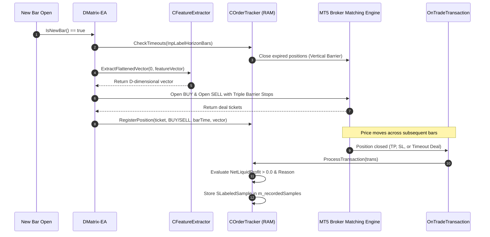
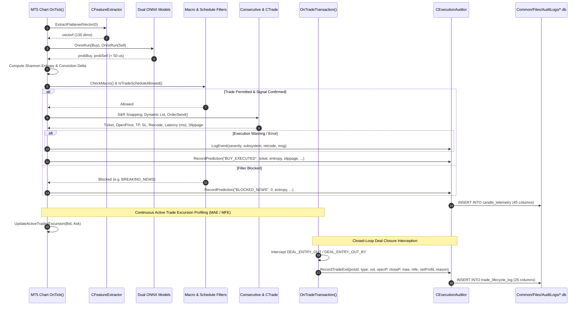
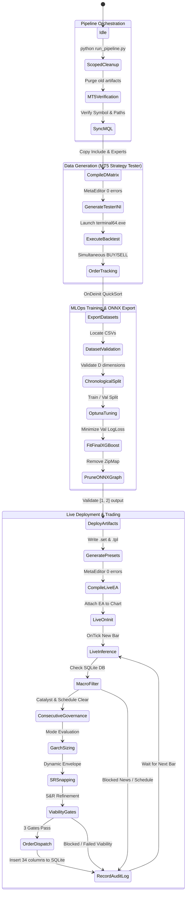

# System Ontology & Quantitative End-to-End Data Flow Architecture

**Institutional Quantitative Architecture & MLOps Pipeline Specification**  
*MetaTrader 5 (MQL5) • Dual XGBoost Gradient Boosting • GARCH(1,1) Volatility • ONNX Runtime*  
**Document Version**: 2.4.0 • **Universal Timezone**: EET/EEST (MT5 Server Time: UTC+2 / UTC+3)

---

## 1. Executive Quantitative Rationale & System Ontology

Automated quantitative trading in foreign exchange (Forex) markets presents fundamental challenges rarely encountered in classical machine learning domains:
1. **Severe Non-Stationarity & Regime Shifting**: Exchange rate returns exhibit time-varying distributions, heavy tails (leptokurtosis), and structural breaks caused by monetary policy interventions, macroeconomic releases, and shifting liquidity regimes ([Campbell, Lo, & MacKinlay, 1997](https://press.princeton.edu/books/hardcover/9780691043012/the-econometrics-of-financial-markets)).
2. **Volatility Clustering & Heteroskedasticity**: Asset return variance is conditionally autocorrelated. Large price shocks are typically followed by large shocks of either sign ([Bollerslev, 1986](https://www.sciencedirect.com/science/article/pii/0304407686900631)). Static stop-loss or take-profit barriers (e.g., fixed 20 pips) are economically irrational: they trigger premature stop-outs during high-volatility regimes and demand unachievable targets during compression regimes.
3. **Train-Serving Skew & Microstructure Execution Friction**: Models trained on synthetic or misaligned features invariably fail in live production. Discrepancies in indicator calculation, price rounding, broker spread dynamics, or asynchronous order filling destroy theoretical alpha ([López de Prado, 2018](https://www.wiley.com/en-us/Advances+in+Financial+Machine+Learning-p-9781119482086)).
4. **Sub-Millisecond Inference Constraints**: Production algorithmic execution cannot tolerate heavy scripting runtime interpreters or serialization overhead. Real-time inference must execute within native C++ chart threads with zero heap allocation.

The **MT5-FX-Countdown** architecture solves these challenges through an end-to-end quantitative MLOps pipeline bridging **MetaTrader 5** and **Python**:

```
+---------------------------------------------------------------------------------------------------+
|                                  SYSTEM ONTOLOGY TAXONOMY                                         |
+---------------------------------------------------------------------------------------------------+
|                                                                                                   |
|  [ 1. HISTORICAL DATA COLLECTION ENGINE ]                                                         |
|    - Subsystem: MQL5 Strategy Tester High-Performance Collector (DMatrix-EA.mq5)                   |
|    - Core Engines: COrderTracker, CFeatureExtractor, CGarchEngine                                  |
|    - Objective: Generate clean, chronologically ordered, net-liquid-profit labeled CSV datasets      |
|    - Labeling Philosophy: López de Prado Triple Barrier Method with Golden Rule validation        |
|                                                                                                   |
|  [ 2. PYTHON MLOps TRAINING & COMPILATION PIPELINE ]                                              |
|    - Subsystem: Python CLI Orchestrator (run_pipeline.py, src/)                                    |
|    - Core Modules: ScopedCleaner, DatasetManager, DualXGBoostTrainer, ONNXExporter, PresetGenerator|
|    - Objective: Train dual independent binary XGBoost classifiers via Optuna Bayesian tuning      |
|    - Graph Compilation: Pure 1D Float ONNX Graph ([None, D] -> [None, 2]) without ZipMap         |
|                                                                                                   |
|  [ 3. MACROECONOMIC GOVERNANCE & RESILIENCE SUBSYSTEM ]                                           |
|    - Subsystem: SQLite Governance Engine (macro_agent/db_client.py, macro_governance.db)           |
|    - Core Tables: calendar_events (Scheduled Catalysts), news_events (Breaking Blacklist)         |
|    - Defense Invariants: Safe transactions, pre-write .bkp backups, PRAGMA integrity_check        |
|    - Execution Protection: BLOCK_ENTRIES, TRAILING_STOP, BREAKEVEN, CLOSE_ALL, ADVISORY_ONLY       |
|                                                                                                   |
|  [ 4. SUB-MILLISECOND LIVE EXECUTION ENGINE ]                                                     |
|    - Subsystem: Native MQL5 Live Trading Expert Advisor (LiveONNX-EA.mq5)                         |
|    - Inference: Native vectorf single-precision tensor buffer via ONNX_NO_CONVERSION              |
|    - Dynamic Risk: Analytical GARCH(1,1) forward multi-step volatility aggregation                |
|    - Structural Optimization: S&R Fractal Pivot Snapping clamped strictly to GARCH envelopes     |
|    - Capital Viability: 3 Protection Gates (Margin Cushion, Asymmetric R:R, Equity Loss Budget)  |
|                                                                                                   |
|  [ 5. MANDATORY INSTITUTIONAL AUDITING & CONSECUTIVE POSITION GOVERNANCE ]                       |
|    - Subsystem: Execution & Prediction Auditor (ExecutionAuditor.mqh, ConsecutiveManager.mqh)    |
|    - Audit Storage: Common/Files/AuditLogs/<Symbol>_<TF>_<Timestamp>.db (SQLite 3, WAL Mode)       |
|    - Relational Schema: Tri-Pillar (candle_telemetry, system_events_log, trade_lifecycle_log)     |
|    - Early Warning Indicators: Shannon entropy, conviction delta, slippage drift, MAE/MFE profiles|
|    - Multi-Order Management: 5 consecutive modes, swap amortization, opposing regime defense       |
|                                                                                                   |
+---------------------------------------------------------------------------------------------------+
```

---

## 2. Universal Timezone Standard: EET/EEST (MT5 Server Time)

Across every subsystem—Strategy Tester simulations, Python dataset managers, SQLite macroeconomic governance, and live chart execution—the entire architecture strictly standardizes on:

$$\mathbf{T}_{\text{system}} \equiv \mathbf{T}_{\text{MT5}} = \text{Eastern European Time (EET / EEST)}$$

$$\text{EET} = \text{UTC}+2 \; (\text{Winter: late October to late March})$$
$$\text{EEST} = \text{UTC}+3 \; (\text{Summer: late March to late October})$$

### Quantitative & Microstructural Justification
1. **5 Daily Candles per Trading Week**: Institutional Forex brokers operate their servers in EET/EEST so that the daily trading bar closes at precisely **17:00 New York Time (5:00 PM EST/EDT)**, the official global Forex rollover anchor. This eliminates anomalous 1-hour "Sunday candles" produced by UTC servers, maintaining strict 5-day stationary weekly distributions.
2. **Zero Offset Desynchronization**: Applying artificial timezone transformations (`TimeCurrent() - TimeGMT()`) introduces runtime vulnerability during daylight saving transitions. Storing and evaluating schedule filters and macroeconomic calendar events directly in MT5 Server Time ensures $100\%$ temporal alignment with price quotes:
   $$\text{BarTime}_{\text{quote}} = \text{ScheduleTime}_{\text{filter}} = \text{MacroTime}_{\text{SQLite}}$$

---

## 3. Master End-to-End System Flowchart

The following diagram maps the entire quantitative lifecycle from historical tick data generation to real-time order routing:

```mermaid
flowchart TD
    %% Styling Classes
    classDef init fill:#0f172a,stroke:#38bdf8,stroke-width:2px,color:#f8fafc;
    classDef collector fill:#1e1b4b,stroke:#818cf8,stroke-width:2px,color:#f8fafc;
    classDef python fill:#064e3b,stroke:#34d399,stroke-width:2px,color:#f8fafc;
    classDef ml fill:#4a044e,stroke:#f472b6,stroke-width:2px,color:#f8fafc;
    classDef onnx fill:#451a03,stroke:#fbbf24,stroke-width:2px,color:#f8fafc;
    classDef macro fill:#1f2937,stroke:#9ca3af,stroke-width:2px,color:#f8fafc;
    classDef live fill:#14532d,stroke:#22c55e,stroke-width:2px,color:#f8fafc;

    %% ---------------------------------------------------------
    %% STAGE 1: INITIALIZATION & CLEANUP
    %% ---------------------------------------------------------
    subgraph S1 ["Stage 1: Environment Ingestion & Atomic Scoped Cleanup"]
        ENV[".env Configuration<br/>(Symbol, Timeframe, Dates, Features, GARCH, XGBoost)"]:::init
        APP_CFG["AppConfig::from_env()<br/>Immutable Dataclass & Dynamic Path Resolution"]:::python
        CLEANER["ScopedCleaner::clean()<br/>Purge *.ini, *.onnx, *.set for Symbol_TF across Paths"]:::python
        MT5_INIT["MT5Client::initialize()<br/>Attach MT5 IPC API & Verify Symbol Specs"]:::python
        SYNC_MQL["MT5Client::sync_mql5()<br/>Sync MQL5/Include & Experts to Terminal Data Path"]:::python
        
        ENV --> APP_CFG
        APP_CFG --> CLEANER
        CLEANER --> MT5_INIT
        MT5_INIT --> SYNC_MQL
    end

    %% ---------------------------------------------------------
    %% STAGE 2: DATA COLLECTION (DMatrix-EA)
    %% ---------------------------------------------------------
    subgraph S2 ["Stage 2: Strategy Tester Backtest & Data Collection (DMatrix-EA.mq5)"]
        COMP_DMAT["MT5Client::compile_ea('DMatrix-EA.mq5')<br/>MetaEditor CLI: 0 errors"]:::collector
        GEN_INI["MT5Client::generate_tester_ini()<br/>Write tester_Symbol_TF.ini ([Tester] & [TesterInputs])"]:::python
        RUN_TESTER["MT5Client::run_strategy_tester()<br/>Launch terminal64.exe /config:...ini"]:::python
        
        subgraph DMATRIX_RUNTIME ["DMatrix-EA Runtime Lifecycle"]
            D_INIT["OnInit(): Init Extractor, GarchEngine & OrderTracker"]:::collector
            D_NEWBAR{"IsNewBar()?"}:::collector
            D_SCHED{"IsTradeScheduleAllowed(barTime)<br/>& Pandemic Blackout Window?"}:::collector
            D_EXTRACT["CFeatureExtractor::ExtractFlattenedVector()<br/>Extract D = K_base * (H + 1) Features"]:::collector
            D_EXEC["Simultaneous Dual Order:<br/>Open BUY & SELL via CTrade"]:::collector
            D_MEM["COrderTracker::RegisterPosition()<br/>Map Position Ticket -> Feature Vector in RAM"]:::collector
            D_TRANS["OnTradeTransaction()<br/>Listen for DEAL_ENTRY_OUT / OUT_BY"]:::collector
            D_LABEL{"Evaluate Golden Rule:<br/>DEAL_REASON_TP & NetLiquidProfit > 0?"}:::collector
            D_LABEL_POS["Assign Label = 1.0f (OPEN)"]:::collector
            D_LABEL_NEG["Assign Label = 0.0f (NOT_OPEN)"]:::collector
            D_DEINIT["OnDeinit():<br/>1. Process Unresolved Positions (Label 0.0f)<br/>2. In-Place QuickSort by baseTimestamp<br/>3. Strip Timestamps & Export CSVs"]:::collector
        end

        SYNC_MQL --> COMP_DMAT
        COMP_DMAT --> GEN_INI
        GEN_INI --> RUN_TESTER
        RUN_TESTER --> D_INIT
        D_INIT --> D_NEWBAR
        D_NEWBAR -- Yes --> D_SCHED
        D_SCHED -- Allowed --> D_EXTRACT
        D_EXTRACT --> D_EXEC
        D_EXEC --> D_MEM
        D_MEM -. Position Closes .-> D_TRANS
        D_TRANS --> D_LABEL
        D_LABEL -- Yes --> D_LABEL_POS
        D_LABEL -- No --> D_LABEL_NEG
        D_LABEL_POS --> D_DEINIT
        D_LABEL_NEG --> D_DEINIT
    end

    %% ---------------------------------------------------------
    %% STAGE 3: DATASET DISCOVERY & SPLITTING
    %% ---------------------------------------------------------
    subgraph S3 ["Stage 3: Multi-Sandbox Dataset Discovery & Chronological Splitting"]
        DISCOVER["DatasetManager::find_and_validate_datasets()<br/>Search Terminal Files, Common Files & Agent Sandboxes"]:::python
        VALID_CSV["Parity & Schema Validation:<br/>Verify 'label' column and D dimensions"]:::python
        TS_SPLIT["Chronological Time-Series Partition:<br/>Train: Oldest (1 - Val%) | Val: Most Recent Val%<br/>(Zero Shuffle / Zero Lookahead Leakage)"]:::python
        
        D_DEINIT --> DISCOVER
        DISCOVER --> VALID_CSV
        VALID_CSV --> TS_SPLIT
    end

    %% ---------------------------------------------------------
    %% STAGE 4: DUAL XGBOOST OPTUNA TRAINING
    %% ---------------------------------------------------------
    subgraph S4 ["Stage 4: Dual XGBoost Training with Early Stopping & Optuna"]
        TRAIN_BUY["DualXGBoostTrainer::train(buy_csv, 'buy')"]:::ml
        TRAIN_SELL["DualXGBoostTrainer::train(sell_csv, 'sell')"]:::ml
        
        subgraph OPTUNA_BAYESIAN ["Optuna Bayesian Optimization Loop (Per Direction)"]
            SAMPLE_HP["Sample Hyperparameters:<br/>max_depth [2..6], learning_rate [0.001..0.05],<br/>subsample, colsample, reg_lambda, reg_alpha"]:::ml
            FIT_EARLY["Fit Estimator with Early Stopping on Val Log-Loss"]:::ml
            EVAL_LOSS["Evaluate Validation Binary Log-Loss"]:::ml
            SAMPLE_HP --> FIT_EARLY --> EVAL_LOSS
        end
        
        BEST_HP["Train Final Estimators with Optimal Parameters"]:::ml
        METRICS["Compute Validation Metrics: ROC-AUC, Accuracy, LogLoss"]:::ml
        
        TS_SPLIT --> TRAIN_BUY
        TS_SPLIT --> TRAIN_SELL
        TRAIN_BUY --> OPTUNA_BAYESIAN
        TRAIN_SELL --> OPTUNA_BAYESIAN
        OPTUNA_BAYESIAN --> BEST_HP
        BEST_HP --> METRICS
    end

    %% ---------------------------------------------------------
    %% STAGE 5: STRICT ONNX CONVERSION & VALIDATION
    %% ---------------------------------------------------------
    subgraph S5 ["Stage 5: Strict 1D Float ONNX Graph Compilation"]
        ONNX_CONV["ONNXExporter::export_and_validate()<br/>Convert XGBoost to ONNX via onnxmltools"]:::onnx
        PRUNE_ZIPMAP["Prune Graph Nodes:<br/>Remove ZipMap & Sequence operators<br/>Expose purely 2D Float Tensor 'probabilities' [None, 2]"]:::onnx
        ONNX_TEST["ONNX Runtime Session Verification:<br/>Input: 'float_input' [1, D]<br/>Output: 'probabilities' [1, 2]<br/>Constraint: Sum(Probabilities) == 1.0"]:::onnx
        DEPLOY["ONNXExporter::deploy()<br/>Deploy models to Terminal and Common Models/"]:::python
        
        METRICS --> ONNX_CONV
        ONNX_CONV --> PRUNE_ZIPMAP
        PRUNE_ZIPMAP --> ONNX_TEST
        ONNX_TEST --> DEPLOY
    end

    %% ---------------------------------------------------------
    %% STAGE 6: CONFIGURATION & PRESET SYNCHRONIZATION
    %% ---------------------------------------------------------
    subgraph S6 ["Stage 6: Preset & Template Generation & EA Compilation"]
        PRESET_GEN["PresetGenerator::generate_all()<br/>Generate LiveONNX-EA_Symbol_TF.set (100% Parity)"]:::python
        TPL_GEN["TemplateGenerator::generate_all()<br/>Generate Chart Template Symbol_TF.tpl"]:::python
        COMP_LIVE["MT5Client::compile_ea('LiveONNX-EA.mq5')<br/>MetaEditor CLI: 0 errors"]:::live
        
        DEPLOY --> PRESET_GEN
        PRESET_GEN --> TPL_GEN
        TPL_GEN --> COMP_LIVE
    end

    %% ---------------------------------------------------------
    %% STAGE 7: LIVE EXECUTION & RISK GOVERNANCE
    %% ---------------------------------------------------------
    %% STAGE 7: LIVE EXECUTION & CONSECUTIVE RISK GOVERNANCE
    %% ---------------------------------------------------------
    subgraph S7 ["Stage 7: Sub-Millisecond Live Execution & Consecutive Management (LiveONNX-EA.mq5)"]
        INIT_LIVE["OnInit(): Load Models, Init GARCH, Connect SQLite Macro & Init CExecutionAuditor"]:::live
        TICK_EVENT["OnTick(): Detect IsNewBar() & Start Latency Counter"]:::live
        
        VEC_EXT["CFeatureExtractor::ExtractFlattenedVector(0, inputVector)<br/>Populate native vectorf buffer"]:::live
        ONNX_INFER["Dual OnnxRun(hModel, ONNX_NO_CONVERSION, vectorf, outProb)<br/>Extract probBuy and probSell in < 50 microseconds"]:::live
        
        subgraph MACRO_GOV ["Macroeconomic Governance (SQLite: macro_governance.db)"]
            CHECK_NEWS["CheckMacroNews(Symbol): Breaking News Blacklist?"]:::macro
            CHECK_CAL["CheckMacroCalendar(Symbol, BarTime): Scheduled Catalyst?"]:::macro
            APPLY_ACTION["ApplyMacroAction():<br/>BLOCK_ENTRIES / TRAILING_STOP / BREAKEVEN / CLOSE_ALL"]:::macro
            CHECK_NEWS --> APPLY_ACTION
            CHECK_CAL --> APPLY_ACTION
        end
        
        SCHED_CHECK{"IsTradeScheduleAllowed(barTime)?"}:::live
        DIR_FILTER{"Evaluate Direction & Probability Thresholds:<br/>probBuy >= InpMinimalLevelBuy OR<br/>probSell >= InpMinimalLevelSell"}:::live
        
        OPPOSING_DEF{"CConsecutiveManager::CheckAndProcessOpposingRegime()<br/>Adverse Streak >= InpOpposingStreakThreshold?"}:::live
        OPPOSING_ACT["Execute Defensive Action:<br/>CLOSE_IF_PROFIT / CLOSE_IMMEDIATE / TRAILING / BREAKEVEN"]:::live
        
        CONSEC_EVAL{"CConsecutiveManager::EvaluateSignal()<br/>Mode: RATCHET / CHAIN / BASKET / PYRAMID"}:::live
        
        GARCH_RISK["CGarchEngine::CalculateDynamicRisk()<br/>Forecast Analytical sigma_agg -> Compute base TP/SL"]:::live
        SR_SNAP{"InpEnableSRSnapping?<br/>(Fractal Pivot Scanning)"}:::live
        SR_APPLY["ApplyStructuralSRSnapping():<br/>Snap TP/SL to Support/Resistance<br/>Clamp strictly inside GARCH Risk Envelope"]:::live
        
        subgraph VIABILITY_GATES ["Pre-Trade Risk & Margin Viability Filter (3 Gates)"]
            GATE_1["Gate 1: Broker-Adaptive Margin Cushion<br/>Projected Margin Level >= BrokerCall * Multiplier"]:::live
            GATE_2["Gate 2: Asymmetric Risk-Reward Cap<br/>SL_points / TP_points <= InpMaxRiskRewardRatio"]:::live
            GATE_3["Gate 3: Account Drawdown Budget<br/>Potential Monetary Loss <= Equity * MaxRiskPct"]:::live
            DYN_LOT["CalculateViableLotSize():<br/>Analytically downsize lot to fit constraints"]:::live
            
            GATE_1 --> GATE_2 --> GATE_3
        end
        
        EXEC_ORDER["CTrade Market Order Execution<br/>Adaptive Filling (FOK / IOC / RETURN)"]:::live

        COMP_LIVE --> INIT_LIVE
        INIT_LIVE --> TICK_EVENT
        TICK_EVENT --> VEC_EXT
        VEC_EXT --> ONNX_INFER
        ONNX_INFER --> CHECK_NEWS
        ONNX_INFER --> CHECK_CAL
        APPLY_ACTION --> SCHED_CHECK
        SCHED_CHECK -- Allowed --> DIR_FILTER
        DIR_FILTER -- Active Signal --> OPPOSING_DEF
        OPPOSING_DEF -- Streak Reached --> OPPOSING_ACT
        OPPOSING_DEF -- Normal --> CONSEC_EVAL
        OPPOSING_ACT --> CONSEC_EVAL
        CONSEC_EVAL -- Execute Order --> GARCH_RISK
        GARCH_RISK --> SR_SNAP
        SR_SNAP -- Yes --> SR_APPLY
        SR_SNAP -- No --> GATE_1
        SR_APPLY --> GATE_1
        GATE_1 -. Dynamic Lot .-> DYN_LOT
        DYN_LOT --> GATE_2
        GATE_3 -- Order Viable --> EXEC_ORDER
    end

    %% ---------------------------------------------------------
    %% STAGE 8: INSTITUTIONAL EXECUTION TELEMETRY & AUDIT ENGINE
    %% ---------------------------------------------------------
    subgraph S8 ["Stage 8: Tri-Pillar Execution & Prediction Audit Engine (CExecutionAuditor)"]
        AUDIT_REC["CExecutionAuditor::RecordPrediction()<br/>Log 38 Columns (Entropy, Conviction, Latency, Slippage)"]:::init
        EVENT_REC["CExecutionAuditor::LogEvent()<br/>Asynchronous Operational Incidents"]:::init
        TRADE_REC["OnTradeTransaction -> RecordTradeExit()<br/>MFE/MAE Excursions, Duration, Net Profit"]:::init
        AUDIT_DB[("Common/Files/AuditLogs/<br/><Symbol>_<TF>_<Timestamp>.db<br/>(SQLite 3, WAL Mode)")]:::init
        DRIFT_AUDIT["Quantitative Drift & Execution Audit:<br/>Shannon Entropy, Conviction Squeeze, Slippage Profiling, Brier Score, PSI"]:::python
        
        ONNX_INFER -. Every Candle .-> AUDIT_REC
        SCHED_CHECK -. Action State .-> AUDIT_REC
        APPLY_ACTION -. Action State .-> AUDIT_REC
        EXEC_ORDER -. Latency & Slippage .-> AUDIT_REC
        EXEC_ORDER -. Warnings/Errors .-> EVENT_REC
        EXEC_ORDER -. Exit Deal Add .-> TRADE_REC
        AUDIT_REC --> AUDIT_DB
        EVENT_REC --> AUDIT_DB
        TRADE_REC --> AUDIT_DB
        AUDIT_DB --> DRIFT_AUDIT
    end
```



---

## 4. Subsystem 1: Historical Data Collection Engine

The historical data collection subsystem resides in **`MQL5/Experts/DMatrix-EA.mq5`**, supported by modular classes in **`MQL5/Include/`**:
- [`CFeatureExtractor`](file:///C:/Users/allan/IdeaProjects/mt5-fx-countdown/MQL5/Include/FeatureExtractor.mqh): High-dimensional feature calculation.
- [`CGarchEngine`](file:///C:/Users/allan/IdeaProjects/mt5-fx-countdown/MQL5/Include/GarchEngine.mqh): Econometric conditional volatility engine.
- [`COrderTracker`](file:///C:/Users/allan/IdeaProjects/mt5-fx-countdown/MQL5/Include/OrderTracker.mqh): In-memory ticket mapping, López de Prado triple barrier labeling, and dataset export.

```
                    DMatrix-EA SUB-SUBSYSTEM MAP
+-------------------------------------------------------------------+
|                        DMatrix-EA.mq5                             |
|  (Strategy Tester Execution Mode: Every Tick, MQL_TESTER == true) |
+---------------------------------+---------------------------------+
                                  |
         +------------------------+------------------------+
         |                                                 |
         v                                                 v
+-----------------------+                         +------------------+
|   CFeatureExtractor   |                         |   CGarchEngine   |
| (FeatureExtractor.mqh)|                         | (GarchEngine.mqh)|
+-----------+-----------+                         +--------+---------+
            |                                              |
            +---------------------+------------------------+
                                  |
                                  v
                       +---------------------+
                       |    COrderTracker    |
                       |  (OrderTracker.mqh) |
                       +----------+----------+
                                  |
                 +----------------+----------------+
                 |                                 |
                 v                                 v
        <Symbol>_<TF>_buy.csv             <Symbol>_<TF>_sell.csv
```

### 4.1 In-Memory Ticket Mapping (Bypassing the 31-Character MT5 Limit)
MetaTrader 5 strictly enforces a **31-character limit** on order comment strings (`ORDER_COMMENT`, `DEAL_COMMENT`). Encoding a feature vector consisting of 130 float dimensions requires over 1,000 ASCII characters, rendering comment-based storage physically impossible.

`COrderTracker` resolves this via high-performance RAM state mapping:
1. When a new bar opens (`IsNewBar()`), `DMatrix-EA` opens simultaneous BUY and SELL positions.
2. The position ticket returned by `CTrade::ResultDeal()` / `DEAL_POSITION_ID` is registered as the key in an in-memory dynamic array of `STrackedPosition` structs:
   ```cpp
   struct STrackedPosition {
       ulong              ticket;         // DEAL_POSITION_ID
       ENUM_POSITION_TYPE posType;        // POSITION_TYPE_BUY or POSITION_TYPE_SELL
       datetime           baseTimestamp;  // Bar opening timestamp (sorting key)
       double             openPrice;      // Fill execution price
       double             tpPrice;        // Upper barrier
       double             slPrice;        // Lower barrier
       float              features[];     // Full high-dimensional feature vector
       int                featureCount;   // D dimensions
       bool               isActive;       // Lifecycle tracking state
   };
   ```
3. **Amortized Chunk Allocation**: To prevent memory fragmentation and high reallocation overhead during backtests spanning hundreds of thousands of ticks, `COrderTracker` allocates memory in amortized geometric chunks:
   - `m_activePositions`: Dynamically expanded in chunks of `+512` slots (`ArrayResize(m_activePositions, size + 512)`).
   - `m_recordedSamples`: Dynamically expanded in chunks of `+1024` slots (`ArrayResize(m_recordedSamples, size + 1024)`).
4. During backtesting, deal closures in `OnTradeTransaction()` perform an $O(N)$ lookup on `m_activePositions` by `positionId`, attaching the outcome label directly to the original feature vector.

### 4.2 Triple Barrier Momentum & Outcome Labeling Formulation
Dataset labeling implements the **Triple Barrier Method** ([López de Prado, 2018](https://www.wiley.com/en-us/Advances+in+Financial+Machine+Learning-p-9781119482086)):
1. **Upper Horizontal Barrier (Profit Target)**:
   $$\text{Barrier}_{\text{upper}} = \begin{cases} P_{\text{open}} + \text{InpLabelMinPoints} \cdot \text{\_Point}, & \text{BUY} \\ P_{\text{open}} - \text{InpLabelMinPoints} \cdot \text{\_Point}, & \text{SELL} \end{cases}$$
2. **Lower Horizontal Barrier (Adverse Stop)**:
   $$\text{Barrier}_{\text{lower}} = \begin{cases} P_{\text{open}} - \text{InpLabelMaxAdversePoints} \cdot \text{\_Point}, & \text{BUY} \\ P_{\text{open}} + \text{InpLabelMaxAdversePoints} \cdot \text{\_Point}, & \text{SELL} \end{cases}$$
3. **Vertical Temporal Barrier (Horizon Timeout)**:
   Evaluated on every new bar open via `COrderTracker::CheckTimeouts(InpLabelHorizonBars, g_trade)`. If the current bar shift $s = \text{iBarShift}(\dots, \text{baseTimestamp}) \ge \text{InpLabelHorizonBars}$, the position is closed at market and strictly classified as $0.0f$ (`NOT_OPEN`).



### 4.3 The Golden Rule of Net Liquid Profit
A trade that nominal touches Take Profit can still be economically unprofitable due to broker commissions, negative overnight swap (financing rates), and spread slippage. Training a gradient boosting model to predict positive outcomes on economically negative trades leads to catastrophic capital depletion.

The pipeline enforces the **Golden Rule of Net Liquid Profit**:
$$\text{NetLiquidProfit} = \text{DEAL\_PROFIT} + \text{DEAL\_SWAP} + \text{DEAL\_COMMISSION}$$

$$\text{Binary Label } y = \begin{cases} 1.0f \; (\text{OPEN}), & \text{if } (\text{DEAL\_REASON\_TP} \lor \text{Proximity TP}) \land (\text{NetLiquidProfit} > 0.0) \\ 0.0f \; (\text{NOT\_OPEN}), & \text{if } \text{DEAL\_REASON\_SL} \lor \text{Timeout} \lor (\text{NetLiquidProfit} \le 0.0) \end{cases}$$

### 4.4 Unresolved Position Handling at Deinitialization (`OnDeinit`)
When the Strategy Tester backtest concludes, any active positions remaining in RAM are finalized in `ProcessUnresolvedPositions()`:
$$y_{\text{unresolved}} \equiv 0.0f \; (\text{NOT\_OPEN})$$
Assigning $0.0f$ to incomplete trades prevents truncation bias and guarantees that incomplete time series horizons never inject false-positive optimism into the dataset.

### 4.5 In-Place Chronological Sorting & Timestamp Stripping
Because trades close out of order (a trade opened at $t_1$ may hit TP after a trade opened at $t_2$ hits SL), the raw array `m_recordedSamples` is out of chronological sequence.
1. **Index-Based QuickSort**: `SortChronologically()` builds an index array `m_sortIndices` and executes in-place QuickSort partitioned strictly on `baseTimestamp` (the bar open timestamp when the feature vector was extracted):
   $$\text{Sample}_{\text{sort}[i]}.\text{baseTimestamp} \le \text{Sample}_{\text{sort}[i+1]}.\text{baseTimestamp}$$
2. **Timestamp Stripping**: The timestamp column is used exclusively for chronological ordering and is completely stripped during CSV export (`FormatSampleRow`). This ensures XGBoost learns invariant structural and technical patterns rather than spurious temporal index artifacts.

### 4.6 Strict Directional Partition Isolation
BUY and SELL trades are isolated into separate datasets:
- BUY trade feature vectors $\to$ `<Symbol>_<TF>_buy.csv`
- SELL trade feature vectors $\to$ `<Symbol>_<TF>_sell.csv`

There is zero cross-contamination between partitions, ensuring independent conditional distributions:
$$P(\text{BUY Profitable} \mid \mathbf{x}_t) \quad \text{vs} \quad P(\text{SELL Profitable} \mid \mathbf{x}_t)$$

### 4.7 Anomaly & Pandemic Blackout Period Filter
Exogenous macroeconomic disruptions (e.g., the 2020 COVID-19 market dislocations) introduce extreme non-stationary outliers that can distort gradient boosting splits. `DMatrix-EA` includes an optional blackout filter:
$$\text{If } \text{InpAvoidPandemicTime} \land (\text{barTime} \ge T_{\text{start}}) \land (\text{barTime} < T_{\text{end}}): \quad \text{Skip trade initiation}$$
During this window, no new orders are placed and no training samples are generated, but existing open orders continue to be tracked to natural closure.

### 4.8 Native MQL5 Unit Testing & Parity Verification Framework
To guarantee institutional software reliability, algorithmic correctness, and mathematical contract parity directly inside the MetaTrader 5 execution runtime, the codebase incorporates a native MQL5 unit testing framework:
- **Assertion Engine ([`CMqlTestFramework`](file:///C:/Users/allan/IdeaProjects/mt5-fx-countdown/MQL5/Include/Tests/MqlTestFramework.mqh))**: Lightweight assertion manager and telemetry logger providing `AssertTrue`, `AssertEqualDouble`, `AssertEqualLong`, and suite summary metrics.
- **Volatility Verification ([`CTestGarchEngine`](file:///C:/Users/allan/IdeaProjects/mt5-fx-countdown/MQL5/Include/Tests/TestGarchEngine.mqh))**: Validates GARCH analytical recurrence, unconditional variance convergence, multi-step horizon variance propagation, and term structure slopes.
- **Buffer & QuickSort Verification ([`CTestOrderTracker`](file:///C:/Users/allan/IdeaProjects/mt5-fx-countdown/MQL5/Include/Tests/TestOrderTracker.mqh))**: Validates dynamic buffer expansion (+512 active positions chunk, +1024 recorded samples chunk), unresolved trade zero-labeling, chronological QuickSort stability, and Golden Rule net-profit assertions.
- **Feature & Session Parity ([`CTestFeatureExtractor`](file:///C:/Users/allan/IdeaProjects/mt5-fx-countdown/MQL5/Include/Tests/TestFeatureExtractor.mqh))**: Validates feature vector dimensions, header parity, and `GetMarketSessionCode(int hour)` across all 24 hours of EET/EEST Server Time.
- **Master Test Runner Script ([`RunAllMQL5UnitTests.mq5`](file:///C:/Users/allan/IdeaProjects/mt5-fx-countdown/MQL5/Scripts/Tests/RunAllMQL5UnitTests.mq5))**: Executes all unit test suites synchronously within the terminal, logging pass/fail diagnostics to the MT5 Experts journal.

---

## 5. Subsystem 2: Python MLOps Pipeline & Optimization Lifecycle

The Python MLOps pipeline orchestrates dataset discovery, model training, Bayesian hyperparameter tuning, ONNX compilation, preset generation, and terminal deployment.

```
                    PYTHON MLOps PIPELINE ARCHITECTURE
+-----------------------------------------------------------------------+
|                           run_pipeline.py                             |
+-----------------------------------+-----------------------------------+
                                    |
          +-------------------------+-------------------------+
          |                         |                         |
          v                         v                         v
+--------------------+    +--------------------+    +--------------------+
|    src/config.py   |    |   src/cleaner.py   |    |src/dataset_mgr.py  |
| (AppConfig / .env) |    |  (ScopedCleaner)   |    | (DatasetManager)   |
+--------------------+    +--------------------+    +--------------------+
          |                         |                         |
          +-------------------------+-------------------------+
                                    |
                                    v
                        +-----------------------+
                        |     src/trainer.py    |
                        | (DualXGBoostTrainer)  |
                        +-----------+-----------+
                                    |
          +-------------------------+-------------------------+
          |                         |                         |
          v                         v                         v
+--------------------+    +--------------------+    +--------------------+
|src/onnx_exporter.py|    |src/preset_gen.py   |    |src/template_gen.py |
|   (ONNXExporter)   |    | (PresetGenerator)  |    |(TemplateGenerator) |
+--------------------+    +--------------------+    +--------------------+
```

### 5.1 Pipeline Execution Modes
`run_pipeline.py` supports three operational modes:
1. **Full Automated Pipeline** (`python run_pipeline.py .env`):
   - Executes atomic cleanup $\to$ compile `DMatrix-EA` $\to$ generate tester INI $\to$ launch Strategy Tester with process watchdog $\to$ discover datasets $\to$ train dual XGBoost with Optuna $\to$ compile pure ONNX $\to$ generate presets/templates $\to$ compile `LiveONNX-EA`.
2. **Dataset Reuse Mode** (`python run_pipeline.py --skip-dataset`):
   - If valid `<Symbol>_<TF>_buy.csv` and `sell.csv` exist, bypasses Strategy Tester simulation and executes directly from model training onward.
3. **Compile-Only Mode** (`python run_pipeline.py --compile-only`):
   - Synchronizes MQL5 code, generates presets/templates, and compiles both EAs via MetaEditor CLI. Strictly preserves existing `.onnx` models and `.csv` datasets without modification.

### 5.2 Chronological Time-Series Validation Split
Random $K$-fold cross-validation or data shuffling destroys the temporal dependence structure of financial time series and induces **lookahead bias (data leakage)**. The pipeline enforces strict chronological splitting:

$$N_{\text{val}} = \max\left(5, \; \lfloor N_{\text{total}} \times \text{VALIDATION\_PERCENTAGE} \rfloor\right)$$
$$N_{\text{train}} = N_{\text{total}} - N_{\text{val}}$$

$$\mathcal{D}_{\text{train}} = \Big\{(\mathbf{x}_i, y_i)\Big\}_{i=1}^{N_{\text{train}}}, \quad \mathcal{D}_{\text{val}} = \Big\{(\mathbf{x}_i, y_i)\Big\}_{i=N_{\text{train}}+1}^{N_{\text{total}}}$$

All hyperparameter selection (Optuna) and early stopping decisions are computed exclusively on $\mathcal{D}_{\text{val}}$.

### 5.3 Dual XGBoost Formulation & Bayesian Optimization
Instead of a single multi-class model ($\{-1, 0, 1\}$), the pipeline fits two separate binary classifiers:
1. **BUY Classifier**: $\hat{p}_{\text{buy}}(\mathbf{x}_t) = P(y_{\text{buy}} = 1 \mid \mathbf{x}_t)$
2. **SELL Classifier**: $\hat{p}_{\text{sell}}(\mathbf{x}_t) = P(y_{\text{sell}} = 1 \mid \mathbf{x}_t)$

#### Objective Function & Regularized Tree Loss
Following [Chen & Guestrin (2016)](https://dl.acm.org/doi/10.1145/2939672.2939785), each tree minimizes the regularized objective:
$$\mathcal{L}(\phi) = \sum_{i=1}^{N} l(\hat{y}_i, y_i) + \sum_{k=1}^{K} \Omega(f_k)$$
where the binary logistic loss is:
$$l(\hat{y}_i, y_i) = y_i \ln(1 + e^{-\hat{y}_i}) + (1 - y_i) \ln(1 + e^{\hat{y}_i})$$
and the tree complexity penalization is:
$$\Omega(f_k) = \gamma T_k + \frac{1}{2} \lambda \sum_{j=1}^{T_k} w_{jk}^2 + \alpha \sum_{j=1}^{T_k} |w_{jk}|$$

#### Optuna Bayesian Search Space
Optuna optimizes the out-of-sample validation log-loss over `OPTUNA_TRIALS`:
$$\mathcal{L}_{\text{val}} = -\frac{1}{N_{\text{val}}}\sum_{i=1}^{N_{\text{val}}} \Big[ y_i \ln(\hat{p}_i) + (1 - y_i) \ln(1 - \hat{p}_i) \Big]$$

| Hyperparameter | Distribution / Bound | Financial / Mathematical Rationale |
|---|---|---|
| `max_depth` | Uniform $[2, 6]$ | Enforces shallow decision trees to prevent fitting non-stationary noise. |
| `learning_rate` | Log-Uniform $[0.001, 0.05]$ | Conservative shrinkage preventing aggressive gradient steps. |
| `subsample` | Uniform $[0.4, 0.9]$ | Row subsampling mitigating serial correlation across bars. |
| `colsample_bytree` | Uniform $[0.4, 0.9]$ | Feature subsampling reducing dominant indicator co-dependence. |
| `min_child_weight` | Uniform $[1.0, 10.0]$ | Enforces minimum Hessian sum in leaf nodes to suppress rare-event splits. |
| `reg_lambda` | Uniform $[0.1, 20.0]$ | $L_2$ leaf weight regularization shrinking extreme leaf outputs. |
| `reg_alpha` | Uniform $[0.05, 10.0]$ | $L_1$ leaf sparsity regularization performing automatic feature pruning. |
| `early_stopping_rounds` | `XGB_EARLY_STOPPING_ROUNDS` | Halts training when validation log-loss ceases to improve for $E$ rounds. |

### 5.4 Strict ONNX Compilation: Pure 1D Float Graph (No ZipMap)
Standard ONNX converters (`onnxmltools`) automatically attach a `ZipMap` operator to tree classifiers, emitting complex non-tensor sequences:
$$\text{Standard Graph Output}: \quad \text{Sequence}\Big\langle\text{Map}\big\langle\text{int64}, \; \text{float}\big\rangle\Big\rangle$$
MetaTrader 5's native C++ ONNX runtime cannot parse sequence/map containers. Passing this output causes fatal `OnnxCreate()` or `OnnxRun()` failures.

The `ONNXExporter` surgically prunes the graph output:
```python
prob_output = [out for out in raw_onnx.graph.output if out.name == "probabilities"][0]
pruned_model = onnx.ModelProto()
pruned_model.CopyFrom(raw_onnx)
del pruned_model.graph.output[:]
pruned_model.graph.output.append(prob_output)
```

The resulting flat graph satisfies the strict MT5 contract:
- **Input Node**: `float_input` $\to$ Shape: `[None, num_features]` (32-bit float).
- **Output Node**: `probabilities` $\to$ Shape: `[None, 2]` (32-bit float).
  - Index 0: $P(\text{NOT\_OPEN})$ (Loss probability).
  - Index 1: $P(\text{OPEN})$ (Profit probability).
- **Graph Invariant**: Validated via `onnxruntime` before disk write, confirming $\sum_{j} P_j = 1.0 \pm 10^{-4}$.

### 5.5 Multi-Directory Deployment Matrix
Artifacts are automatically synchronized across terminal and common storage folders:

| Artifact | Source Location | Target Path 1 (Terminal Data Path) | Target Path 2 (Common Shared Path) |
|---|---|---|---|
| **ONNX Models** | Python memory | `MQL5/Files/Models/<Symbol>_<TF>_model_*.onnx` | `Common/Files/Models/<Symbol>_<TF>_model_*.onnx` |
| **Model Metadata** | DatasetManager | `MQL5/Files/Models/<Symbol>_<TF>_metadata.json` | `Common/Files/Models/<Symbol>_<TF>_metadata.json` |
| **Native Presets** | PresetGenerator | `MQL5/Presets/LiveONNX-EA_<Symbol>_<TF>.set` | `Common/Files/Presets/LiveONNX-EA_<Symbol>_<TF>.set` |
| **Chart Templates** | TemplateGenerator | `MQL5/Profiles/Templates/<Symbol>_<TF>.tpl` | `Common/Files/Templates/<Symbol>_<TF>.tpl` |
| **Compiled EAs** | MetaEditor CLI | `MQL5/Experts/DMatrix-EA.ex5`, `LiveONNX-EA.ex5` | — |

---

## 6. Subsystem 3: Macroeconomic Governance & SQLite Resilience Subsystem

Macroeconomic announcements (e.g., US Non-Farm Payrolls, FOMC interest rate decisions, ECB monetary policy statements) inject extreme volatility cascades and slippage spikes into currency pairs. The macroeconomic governance subsystem protects live positions and filters toxic entries via an institutional SQLite database.

```
                  MACROECONOMIC GOVERNANCE ARCHITECTURE
+-----------------------------------------------------------------------+
|                    macro_agent/db_client.py                           |
+-----------------------------------+-----------------------------------+
                                    |
          +-------------------------+-------------------------+
          |                                                   |
          v                                                   v
+--------------------+                             +--------------------+
|  calendar_events   |                             |    news_events     |
| (Scheduled Catalysts)                            | (Breaking Blacklist)
+--------------------+                             +--------------------+
          |                                                   |
          +-------------------------+-------------------------+
                                    |
                                    v
+-----------------------------------------------------------------------+
|                     macro_governance.db (SQLite)                      |
|                Location: %APPDATA%/.../Common/Files/                  |
|          Features: WAL Mode, Safe Transactions, Auto-Backups          |
+-----------------------------------+-----------------------------------+
                                    |
                                    v
+-----------------------------------------------------------------------+
|                         LiveONNX-EA.mq5                               |
|        - CheckMacroCalendar(): Active in Live AND Tester              |
|        - CheckMacroNews(): Active in Live ONLY (Bypassed in Tester)   |
+-----------------------------------------------------------------------+
```

### 6.1 Database Schema & Storage Invariant
The database is located statically in MT5 Common Files:
$$\text{Path} = \text{\%APPDATA\%\textbackslash MetaQuotes\textbackslash Terminal\textbackslash Common\textbackslash Files\textbackslash macro\_governance.db}$$
Hardcoding the database name (`MACRO_DATABASE_NAME = "macro_governance.db"`) directly inside `LiveONNX-EA.mq5` eliminates input misconfigurations.

```sql
CREATE TABLE IF NOT EXISTS calendar_events (
    id INTEGER PRIMARY KEY AUTOINCREMENT,
    symbol TEXT NOT NULL,
    title TEXT NOT NULL,
    description TEXT NOT NULL,
    start_time TEXT NOT NULL,
    end_time TEXT NOT NULL,
    action TEXT NOT NULL DEFAULT 'BLOCK_ENTRIES',
    trailing_points INTEGER NOT NULL DEFAULT 0
);
CREATE INDEX IF NOT EXISTS idx_cal_lookup ON calendar_events (symbol, start_time, end_time);

CREATE TABLE IF NOT EXISTS news_events (
    symbol TEXT PRIMARY KEY,
    title TEXT NOT NULL,
    description TEXT NOT NULL,
    action TEXT NOT NULL DEFAULT 'BLOCK_ENTRIES',
    trailing_points INTEGER NOT NULL DEFAULT 0
);
```

### 6.2 Defensive Transaction Governance: Backups, Checkpoints & Rollback
To guarantee zero database corruption during concurrent terminal access:
1. **WAL Journaling & Busy Timeout**: `PRAGMA journal_mode=WAL;` enables concurrent readers without locking the database file, while `DatabaseExecute(g_hMacroDB, "PRAGMA busy_timeout = 5000;");` in `LiveONNX-EA.mq5` and `timeout=10.0` in Python `db_client.py` guarantee up to 5 and 10 seconds of automatic lock-wait backoff, eliminating `SQLITE_BUSY` errors.
2. **Pre-Write Backup**: Before any mutating query (`upsert`, `delete`, `purge`), `safe_db_transaction()` truncates the WAL (`PRAGMA wal_checkpoint(TRUNCATE)`) and creates an atomic timestamped copy:
   $$\text{Backup File} = \text{macro\_governance.db.YYYYMMDD\_HHMMSS\_ffffff.bkp}$$
3. **Integrity Validation**: Immediately following modification, `PRAGMA integrity_check;` validates B-Tree structures.
4. **Automatic Rollback & Self-Healing**: If any error or corruption is detected, the transaction terminates, auxiliary `-wal` and `-shm` files are purged, and the `.bkp` file is instantly restored.

### 6.3 Protection Actions & Execution Semantics
When an active catalyst matches the current symbol (or `GLOBAL`), `LiveONNX-EA` evaluates `ApplyMacroAction()`:

| Action Code | Entry Behavior | Existing Position Protection Behavior |
|---|---|---|
| **`BLOCK_ENTRIES`** | **Blocked**. Skips new order inference for the current bar. | Undisturbed. Existing stops remain active. |
| **`TRAILING_STOP`** | **Blocked**. | Dynamically tightens Stop Loss on profitable open positions using `trailing_points`. **Defensive Invariant**: If `trailing_points <= 0` or unset, or if broker modification fails, immediately executes market liquidation (`PositionClose`) for capital preservation. |
| **`BREAKEVEN`** | **Blocked**. | Moves Stop Loss directly to entry price (`POSITION_PRICE_OPEN`) if the trade is in floating profit. If the distance violates broker stop levels (`minStopDist`) or modification fails, immediately closes the position. |
| **`CLOSE_ALL`** | **Blocked**. | Executes immediate emergency market liquidation (`PositionClose`) on all active positions for this symbol. |
| **`ADVISORY_ONLY`**| **Permitted**. Model inference proceeds normally. | No modification. Emits high-priority informational log in MT5 Experts journal. |

---

## 7. Subsystem 4: Live Execution & Dynamic Risk Management

The live trading engine operates inside **`MQL5/Experts/LiveONNX-EA.mq5`**, executing zero-copy inference on new bar events.

```
                         LiveONNX-EA EXECUTION PIPELINE
+-----------------------------------------------------------------------+
|                           OnTick() Event                              |
+-----------------------------------+-----------------------------------+
                                    |
                                    v
+-----------------------------------------------------------------------+
| 1. Bar Validation: IsNewBar() & IsTradeScheduleAllowed(barTime)      |
+-----------------------------------+-----------------------------------+
                                    |
                                    v
+-----------------------------------------------------------------------+
| 2. Macroeconomic Governance: CheckMacroNews() & CheckMacroCalendar()  |
+-----------------------------------+-----------------------------------+
                                    |
                                    v
+-----------------------------------------------------------------------+
| 3. Zero-Copy Feature Extraction: CFeatureExtractor -> vectorf         |
+-----------------------------------+-----------------------------------+
                                    |
                                    v
+-----------------------------------------------------------------------+
| 4. Native Sub-Millisecond Inference: OnnxRun(ONNX_NO_CONVERSION)      |
+-----------------------------------+-----------------------------------+
                                    |
                                    v
+-----------------------------------------------------------------------+
| 5. Econometric Risk Sizing: CGarchEngine::CalculateDynamicRisk()      |
+-----------------------------------+-----------------------------------+
                                    |
                                    v
+-----------------------------------------------------------------------+
| 6. Market Structure: Structural Support & Resistance (S&R) Snapping   |
+-----------------------------------+-----------------------------------+
                                    |
                                    v
+-----------------------------------------------------------------------+
| 7. Viability Governance: 3 Risk Gates & Dynamic Lot Sizing            |
+-----------------------------------+-----------------------------------+
                                    |
                                    v
+-----------------------------------------------------------------------+
| 8. Order Dispatch: CTrade with Broker Adaptive Filling (FOK/IOC)      |
+-----------------------------------------------------------------------+
```

### 7.1 Zero-Copy Inference via Native `vectorf`
Standard MQL5 arrays require dynamic memory allocation and type conversion when interacting with external DLLs. `LiveONNX-EA` utilizes native `vectorf` arrays (single-precision IEEE 754 floats):
1. In `OnInit()`, fixed input and output tensor dimensions are declared:
   ```cpp
   const ulong inputShape[]  = {1, (ulong)g_featureCount};
   const ulong outputShape[] = {1, 2};
   OnnxSetInputShape(g_hModelBuy, 0, inputShape);
   OnnxSetOutputShape(g_hModelBuy, 0, outputShape);
   ```
2. In `OnTick()`, inference executes directly against the contiguous memory buffer without heap reallocation:
   ```cpp
   vectorf inputVector;
   g_featureExtractor.ExtractFlattenedVector(0, inputVector);
   
   vectorf outBuy(2);
   OnnxRun(g_hModelBuy, ONNX_NO_CONVERSION, inputVector, outBuy);
   float probBuy = outBuy[1];
   ```
   **Latency Benchmark**: Total feature extraction + dual model inference executes in under **50 microseconds**, providing institutional-grade execution speed.

### 7.2 Econometric Sizing: Native GARCH(1,1) Dynamic Risk
Stop Loss and Take Profit levels are never based on fixed pips. They are dynamically derived from current conditional volatility using the Bollerslev (1986) GARCH(1,1) model:

$$\text{Aggregated Horizon Volatility}: \quad \sigma_{\text{agg}} = \sqrt{\sum_{h=1}^{H} \mathbb{E}\big[\sigma_{t+h}^2 \mid \mathcal{F}_t\big]}$$

$$\text{Price Risk}: \quad \text{PriceRisk} = P_{\text{close}}[1] \cdot \sigma_{\text{agg}}$$
$$\text{Risk Points}: \quad \text{RiskPoints} = \frac{\text{PriceRisk}}{\text{\_Point}}$$

$$\text{TP}_{\text{points}} = k_{\text{TP}} \cdot \text{RiskPoints}, \quad \text{SL}_{\text{points}} = k_{\text{SL}} \cdot \text{RiskPoints}$$
where $k_{\text{TP}}$ (`InpKTP`) and $k_{\text{SL}}$ (`InpKSL`) default to $1.5$.

Stops are clamped against broker constraints:
$$\text{MinStopPoints} = \max(\text{SYMBOL\_TRADE\_STOPS\_LEVEL}, \; 2 \times \text{SYMBOL\_SPREAD}, \; 10.0)$$
$$\text{TP}_{\text{points}} \leftarrow \max(\text{TP}_{\text{points}}, \; \text{MinStopPoints})$$
$$\text{SL}_{\text{points}} \leftarrow \max(\text{SL}_{\text{points}}, \; \text{MinStopPoints})$$

### 7.3 Structural Support & Resistance (S&R) Snapping
Baseline GARCH volatility defines a robust mathematical envelope, but institutional market liquidity clusters around structural swing highs and lows. `ApplyStructuralSRSnapping()` refines execution levels:

```
BUY ORDER S&R SNAPPING GEOMETRY:

Resistance Zone (Swing High)  -------------------- Candidate TP = Resistance - Offset
                                 ^
                                 |  Snaps TP closer to entry (realizes profit before reversal)
GARCH Base TP ------------------------------------
                                 ^
                                 |
Entry Price (Ask) ================================
                                 |
                                 v
GARCH Base SL ------------------------------------
                                 |  Snaps SL further from entry (shields against sweeps)
                                 v  [STRICTLY CLAMPED: Never breaches GARCH envelope]
Support Zone (Swing Low)      -------------------- Candidate SL = Support - Offset
```

1. **Fractal Pivot Strength ($K$)**: Over `InpSRLookbackBars` historical bars $[t-1 \dots t-N]$, an authentic extremum requires being the highest high (or lowest low) compared to $K$ bars before and $K$ bars after (`InpSRPivotStrength = 2` requires 5-bar confirmation).
2. **Buffer Offset Padding**:
   $$\Delta_{\text{offset}} = \text{InpSROffsetPoints} \cdot \text{\_Point}$$
3. **Execution Level Snapping**:
   - **Take Profit**: Snapped to `Zone \mp \Delta_{\text{offset}}` (pulled closer to open price) guaranteeing execution before liquidity exhaustion.
   - **Stop Loss**: Snapped to `Zone \mp \Delta_{\text{offset}}` (distanciated beyond structure) shielding the position from liquidity sweeps.
4. **Strict GARCH Envelope Clamping**:
   $$\text{BUY: } \text{CandidateSL} = \max(\text{Support} - \Delta_{\text{offset}}, \; \text{garchSL})$$
   $$\text{SELL: } \text{CandidateSL} = \min(\text{Resistance} + \Delta_{\text{offset}}, \; \text{garchSL})$$
   Structural snapping can tighten or widen stops around market structure, but **never expands risk beyond the econometric GARCH limit**.

### 7.4 Pre-Trade Risk & Margin Governance (The 3 Viability Gates)
Before transmitting an order to `CTrade`, `CheckTradeViability()` evaluates three independent protection gates:

```
                   THE 3 PRE-TRADE VIABILITY GATES
+-------------------------------------------------------------------+
|                        Candidate Order                            |
+---------------------------------+---------------------------------+
                                  |
                                  v
+-------------------------------------------------------------------+
|  GATE 1: Broker-Adaptive Margin Cushion Check                     |
|  - Queries ACCOUNT_MARGIN_SO_CALL (e.g. 100%)                     |
|  - Computes projected Margin Level: Equity / (Margin + ReqMargin) |
|  - Rejects if Projected ML < BrokerCall * InpMarginSafetyMult     |
+---------------------------------+---------------------------------+
                                  | Pass
                                  v
+-------------------------------------------------------------------+
|  GATE 2: Asymmetric Risk-Reward Cap Check                         |
|  - Computes Asymmetry Ratio: SL_points / TP_points               |
|  - Rejects if Asymmetry Ratio > InpMaxRiskRewardRatio (e.g. 1.5)  |
|  - Eliminates toxic negative-skew trades                          |
+---------------------------------+---------------------------------+
                                  | Pass
                                  v
+-------------------------------------------------------------------+
|  GATE 3: Maximum Account Equity Loss Budget Check                 |
|  - Queries OrderCalcProfit() for exact currency loss at SL        |
|  - Computes Loss Percentage: (AbsLoss / Equity) * 100.0           |
|  - Rejects if Loss Percentage > InpMaxTradeRiskPct (e.g. 3.0%)    |
+---------------------------------+---------------------------------+
                                  | Pass
                                  v
+-------------------------------------------------------------------+
|                   Execute Market Order (CTrade)                   |
+-----------------------------------+-------------------------------+
```

### 7.5 Dynamic Position Sizing & Downsizing
When `InpEnableDynamicLotSizing = true`, `CalculateViableLotSize()` starts from `InpMaxLotSize` and analytically downsizes the volume to the largest valid broker lot step (`SYMBOL_VOLUME_STEP`) that satisfies both:
1. **Risk Budget Constraint**:
   $$\text{MaxLot}_{\text{risk}} = \frac{\text{Equity} \times (\text{InpMaxTradeRiskPct} / 100.0)}{\text{UnitLossPerLot}}$$
2. **Margin Capacity Constraint**:
   $$\text{MaxLot}_{\text{margin}} = \frac{\min(\text{FreeMargin}, \; \text{MarginRoom})}{\text{UnitMarginPerLot}}$$

### 7.6 Multi-Order Consecutive Exposure Governance (`CConsecutiveManager`)

In live trading, strong directional momentum often generates consecutive ML predictions above the entry threshold across sequential bars. Executing naive independent market orders on every consecutive signal rapidly leads to margin overconcentration, elevated portfolio heat, and catastrophic drawdown during sharp mean-reversions.

[`CConsecutiveManager`](file:///C:/Users/allan/IdeaProjects/mt5-fx-countdown/MQL5/Include/ConsecutiveManager.mqh) introduces modular multi-order governance governed by `InpConsecutiveMode`:

```
                CONSECUTIVE SIGNAL MANAGEMENT MODES
+-------------------------------------------------------------------+
| Mode 0: LEGACY_INDEPENDENT    -> Standalone uncoordinated trades  |
| Mode 1: SINGLE_HURDLE_RATCHET -> Single trade; ratchet SL on TP%  |
| Mode 2: SINGLE_CHAIN_LINK     -> Single trade; trail to bar close |
| Mode 3: UNIFIED_BASKET        -> Multi-order; unified TP/SL pool  |
| Mode 4: PYRAMIDING_STEP_LOCK  -> Multi-order; step-lock breakeven |
+-------------------------------------------------------------------+
```

#### 1. Dynamic Swap Amortization Formulation
Overnight financing rates (swaps) drag net liquidation value. Setting Stop Loss exactly at the entry price ($P_{\text{open}}$) guarantees a net financial loss if negative swap has accrued. `CConsecutiveManager` analytically converts accrued negative swap and trading commission into exact price points:

$$\text{Points}_{\text{swap}} = \left\lceil \frac{|\min(0.0, \; \text{Swap}_{\text{accrued}})| + |\text{Commission}|}{\text{Volume} \times \left(\frac{\text{TickValue}}{\text{TickSize}}\right) \times \text{\_Point}} \right\rceil$$

$$\text{NetBreakevenPrice} = \begin{cases} P_{\text{open}} + (\text{Points}_{\text{swap}} + \Delta_{\text{cushion}}) \cdot \text{\_Point}, & \text{BUY} \\ P_{\text{open}} - (\text{Points}_{\text{swap}} + \Delta_{\text{cushion}}) \cdot \text{\_Point}, & \text{SELL} \end{cases}$$

This mathematical contract strictly guarantees that any breakeven or trailing stop-out achieves $\text{NetLiquidProfit} \ge 0.0$, fulfilling the Golden Rule.

#### 2. Anti-Chop Displacement Filter
During tight consolidation regimes, sequential bars generate false-positive signals within a few fractional points of each other. The anti-chop filter suppresses consecutive order placement or stop displacement unless price has demonstrated genuine expansion:

$$|P_{\text{current}} - P_{\text{prev}}| \ge \text{InpAntiChopMinDisplacement} \cdot \text{\_Point}$$

#### 3. Opposing Regime Defense Filter
When active positions face persistent adverse ML predictions ($P(\text{OPPOSING} \mid \mathbf{x}_t) \ge \text{Threshold}$ for $N \ge \text{InpOpposingStreakThreshold}$ consecutive candles), `CheckAndProcessOpposingRegime()` triggers defensive countermeasures:
- `OPPOSING_ACTION_CLOSE_IF_PROFIT` (0): Closes positions if net floating profit is positive before momentum reverses.
- `OPPOSING_ACTION_CLOSE_IMMEDIATE` (1): Liquidates all positions immediately, invalidating the statistical thesis.
- `OPPOSING_ACTION_TRAILING_DEFENSIVE` (2): Tightens trailing stops to salvage capital.
- `OPPOSING_ACTION_BREAKEVEN_NET` (3): Moves SL to net breakeven incorporating swap amortization.
- `OPPOSING_ACTION_RECALCULATE_DEFENSIVE` (4): Pulls TP closer by ratio (`InpOpposingRecalculateRatio`) to force prompt exit.
- `OPPOSING_ACTION_STOP_AND_REVERSE` (5): Liquidates existing positions and dispatches an opposing entry order.

### 7.7 Pre-Existing Open Positions Ingestion & Dynamic TP/SL Governance

When `LiveONNX-EA` is loaded onto a live chart with pre-existing open orders on the MT5 terminal:
1. **Identification & Isolation Gate**:
   - Compares each trade's `Symbol` and `POSITION_MAGIC` against `_Symbol` and `InpMagicNumber`.
   - **Isolation**: Manual positions (`Magic=0`) or positions from other EAs (`Magic != InpMagicNumber`) are ignored 100%. No TP, SL, volume modification, or closing actions are ever performed.
   - **Adoption**: Positions matching `Symbol == _Symbol` and `Magic == InpMagicNumber` are adopted immediately.
2. **Startup Passivity Invariant (`OnInit`)**:
   - `OnInit()` strictly performs environmental setups, model loading, and database binding. It performs zero market modifications or liquidations at startup.
3. **Dynamic Real-Time Tick Governance (`OnTick`)**:
   - **Consecutive Trade Manager**: Evaluates open positions via `CountActivePositions()`. Depending on `InpConsecutiveMode`:
     - *Mode 0 (Legacy)*: Preserves existing TP/SL unchanged.
     - *Mode 1 (Hurdle Ratchet)*: Locks profit by advancing SL and expands TP if favorable new signals emerge.
     - *Mode 2 (Chain-Link)*: Trails SL to previous bar close if price displacement exceeds anti-chop threshold.
     - *Mode 3 (Pyramiding)*: Secures existing positions at breakeven before dispatching next scale-in order.
     - *Mode 4 (Basket)*: Recomputes weighted net break-even and synchronizes identical TP/SL across all basket tickets.
   - **Opposing Regime Defense**:
     - On adverse ML prediction streak $\ge \text{InpOpposingStreakThreshold}$, tightens SL (`OPPOSING_ACTION_TIGHTEN_SL`), moves to net-breakeven (`OPPOSING_ACTION_BREAKEVEN_NET`), recalculates compressed GARCH stops, or closes/reverses positions.
   - **Macroeconomic Blackout Signals**:
     - Applies `BREAKEVEN`, `TRAILING_STOP`, or `CLOSE_ALL` as commanded by `macro_governance.db`.
   - **Session End / Friday Liquidation**:
     - Closes all adopted positions when `InpCloseOnSessionEnd=true` outside trading hours.
4. **Telemetry & Crash Recovery**:
   - Position excursion (MAE/MFE) during offline periods is absent from RAM. Upon exit, `OnTradeTransaction` invokes `HistorySelectByPosition(posId)` to recover original entry ticket, deal price, and open timestamp directly from the MT5 permanent database, ensuring 100% closed-loop trade attribution.

---

### 7.8 Mandatory Institutional Execution Telemetry & SQLite Audit Engine (`CExecutionAuditor`)

Quantitative models deployed in live financial markets inevitably suffer from **concept drift**, **covariate shift**, and **performance decay** due to macroeconomic structural breaks, liquidity shifts, and evolving volatility dynamics ([López de Prado, 2018](https://www.wiley.com/en-us/Advances+in+Financial+Machine+Learning-p-9781119482086)). Crucially, relying on lagging indicators (account balance, equity curve, or net PnL) conceals performance degradation until significant capital loss has occurred.

To enable institutional-grade post-trade analytics, early-warning degradation detection ("between the lines"), and closed-loop trade attribution, [`CExecutionAuditor`](file:///C:/Users/allan/IdeaProjects/mt5-fx-countdown/MQL5/Include/ExecutionAuditor.mqh) (aliased as `CPredictionAuditor`) enforces a **mandatory, non-configurable execution audit engine** directly within `LiveONNX-EA.mq5`.

#### Architectural Invariants:
1. **Mandatory & Non-Configurable**: Telemetry logging cannot be disabled via user inputs or `.env` flags. It is a non-negotiable architectural invariant ensuring complete regulatory and quantitative auditability.
2. **Deterministic File Storage**: Stored exclusively in the shared MT5 filesystem:
   $$\text{Path} = \text{Common/Files/AuditLogs/}\langle\text{Symbol}\rangle\_\langle\text{TF}\rangle\_\langle\text{YYYYMMDD\_HHMMSS}\rangle\text{.db}$$
   Every terminal launch creates an isolated, timestamped SQLite 3 database, eliminating write contention across charts.
3. **High-Performance Concurrency (WAL Mode)**: Configured with `PRAGMA journal_mode=WAL;`, `PRAGMA synchronous=NORMAL;`, and `PRAGMA busy_timeout=5000;`, guaranteeing non-blocking reads and minimal transaction latency.
4. **Tri-Pillar Relational Schema**: Segregates periodic candle telemetry, asynchronous operational incidents, and transaction-driven trade lifecycle attribution into 3 specialized tables.
5. **Unbroken Temporal Prediction Stream**: In `OnTick()`, inference and logging execute on **every single closed bar** regardless of whether the daily schedule or macroeconomic news filters allow or block trading. This guarantees an unbroken time series of predictions, enabling rigorous out-of-sample calibration auditing.



#### Tri-Pillar Relational Database Schema:

```sql
-- Pillar 1: Continuous Bar Telemetry (45 columns + view alias)
CREATE TABLE IF NOT EXISTS candle_telemetry (
    id                      INTEGER PRIMARY KEY AUTOINCREMENT,
    created_at              TEXT NOT NULL,
    bar_time                TEXT NOT NULL,
    symbol                  TEXT NOT NULL,
    timeframe               TEXT NOT NULL,
    ask                     REAL NOT NULL,
    bid                     REAL NOT NULL,
    spread_points           INTEGER NOT NULL,
    prob_buy                REAL NOT NULL,
    prob_sell               REAL NOT NULL,
    threshold_buy           REAL NOT NULL,
    threshold_sell          REAL NOT NULL,
    conviction_delta        REAL NOT NULL,
    prob_entropy            REAL NOT NULL,
    conflicting_signals     INTEGER NOT NULL,
    raw_buy_signal          INTEGER NOT NULL,
    raw_sell_signal         INTEGER NOT NULL,
    schedule_allowed        INTEGER NOT NULL,
    macro_calendar_blocked  INTEGER NOT NULL,
    macro_news_blocked      INTEGER NOT NULL,
    macro_action            TEXT NOT NULL,
    garch_sigma_cond        REAL NOT NULL,
    garch_sigma_agg         REAL NOT NULL,
    garch_vol_ratio         REAL NOT NULL,
    garch_tp_points         REAL NOT NULL,
    garch_sl_points         REAL NOT NULL,
    sr_snapped              INTEGER NOT NULL,
    final_tp_price          REAL NOT NULL,
    final_sl_price          REAL NOT NULL,
    sr_zone_type            TEXT NOT NULL,
    risk_filter_passed      INTEGER NOT NULL,
    rejected_gate_id        INTEGER NOT NULL,
    account_equity          REAL NOT NULL,
    account_balance         REAL NOT NULL,
    account_margin_level    REAL NOT NULL,
    account_free_margin     REAL NOT NULL,
    dynamic_lot             REAL NOT NULL,
    consecutive_mode        INTEGER NOT NULL,
    consecutive_action      TEXT NOT NULL,
    active_positions_count  INTEGER NOT NULL,
    floating_profit         REAL NOT NULL,
    execution_action        TEXT NOT NULL,
    execution_retcode       INTEGER NOT NULL,
    execution_ticket        INTEGER NOT NULL,
    inference_latency_us    INTEGER NOT NULL
);

-- Backward Compatibility View for Legacy Pipelines
CREATE VIEW IF NOT EXISTS prediction_audit_logs AS SELECT * FROM candle_telemetry;

-- Pillar 2: Asynchronous Operational Incident & Warning Log (8 columns)
CREATE TABLE IF NOT EXISTS system_events_log (
    id                      INTEGER PRIMARY KEY AUTOINCREMENT,
    created_at              TEXT NOT NULL,
    bar_time                TEXT NOT NULL,
    severity                TEXT NOT NULL,
    subsystem               TEXT NOT NULL,
    error_code              INTEGER NOT NULL,
    event_message           TEXT NOT NULL,
    context_data            TEXT NOT NULL
);

-- Pillar 3: Closed-Loop Trade Lifecycle & Outcome Attribution (25 columns)
CREATE TABLE IF NOT EXISTS trade_lifecycle_log (
    id                      INTEGER PRIMARY KEY AUTOINCREMENT,
    created_at              TEXT NOT NULL,
    position_id             INTEGER NOT NULL,
    entry_deal_ticket       INTEGER NOT NULL,
    exit_deal_ticket        INTEGER NOT NULL,
    symbol                  TEXT NOT NULL,
    timeframe               TEXT NOT NULL,
    order_type              TEXT NOT NULL,
    volume                  REAL NOT NULL,
    open_time               TEXT NOT NULL,
    close_time              TEXT NOT NULL,
    holding_duration_seconds INTEGER NOT NULL,
    holding_bars            INTEGER NOT NULL,
    target_entry_price      REAL NOT NULL,
    actual_entry_price      REAL NOT NULL,
    entry_slippage_points   REAL NOT NULL,
    order_latency_ms        INTEGER NOT NULL,
    actual_close_price      REAL NOT NULL,
    exit_reason             TEXT NOT NULL,
    gross_profit            REAL NOT NULL,
    swap_charges            REAL NOT NULL,
    commission_charges      REAL NOT NULL,
    net_liquid_profit       REAL NOT NULL,
    max_favorable_points    REAL NOT NULL,
    max_adverse_points      REAL NOT NULL
);
```

#### Leading Indicator Quantitative Diagnostics Enabled:
1. **Shannon Entropy Drift ($H(X)$)**:
   Measures model decision uncertainty. Rising entropy over rolling windows alerts the quantitative researcher to epistemic decay before trades turn negative.
2. **Conviction Delta Squeeze ($\Delta_P = |P_{\text{BUY}} - P_{\text{SELL}}|$ )**:
   Detects loss of directional edge in non-stationary consolidation markets.
3. **Execution Friction Profiling**:
   Tracks order roundtrip latency in milliseconds (`order_latency_ms`) and slippage in points (`slippage_points`), detecting broker liquidity toxicity and B-book degradation.
4. **Excursion Quality (MAE / MFE Profiling)**:
   Evaluates whether stopped-out trades reached high favorable excursion before reversing (indicating need for tighter trailing stops or S&R targets) or suffered immediate adverse drift (indicating entry timing failure).
5. **Pre-Trade Viability Bottlenecks**:
   Tracks which protection gate rejected candidate orders (Gate 1 Margin, Gate 2 R:R Asymmetry, Gate 3 Account Loss Budget) to evaluate whether risk parameters require recalibration.

---

## 8. Tensor Dimensionality & Feature Engineering Schema

Feature extraction is executed by `CFeatureExtractor` (`FeatureExtractor.mqh`), identical across data generation and live execution to ensure **zero train-serving skew**.

```
                SEQUENTIAL HORIZON LOOKBACK FLATTENING
Current Bar (t)    Lag 1 (t-1)         Lag 2 (t-2)         Lag H (t-H)
+---------------+  +---------------+   +---------------+   +---------------+
| f_1(t)        |  | f_1(t-1)      |   | f_1(t-2)      |   | f_1(t-H)      |
| f_2(t)        |  | f_2(t-1)      |   | f_2(t-2)      |   | f_2(t-H)      |
| ...           |  | ...           |   | ...           |   | ...           |
| f_K(t)        |  | f_K(t-1)      |   | f_K(t-2)      |   | f_K(t-H)      |
+---------------+  +---------------+   +---------------+   +---------------+
       \                   \                   \                   \
        +-------------------+-------------------+-------------------+
                                    |
                                    v
   1D Flattened Vector: [f_1(t), ..., f_K(t), f_1(t-1), ..., f_K(t-H)]
              Total Tensor Dimension: D = K_base * (H + 1)
```

### 8.1 Tensor Dimensionality Formula
Let $K_{\text{base}}$ be the number of active base features extracted on a single bar, and let $H = \text{FEATURE\_LOOKBACK}$ be the historical lag horizon:

$$\mathbf{x}_t = \Big[ \mathbf{f}(t)^\top, \; \mathbf{f}(t-1)^\top, \; \mathbf{f}(t-2)^\top, \; \dots, \; \mathbf{f}(t-H)^\top \Big]^\top \in \mathbb{R}^D$$

$$\mathbf{D} = K_{\text{base}} \times (H + 1)$$

With all 14 feature groups active ($K_{\text{base}} = 26$) and default lookback $H = 4$:
$$D = 26 \times (4 + 1) = \mathbf{130 \text{ float dimensions}}$$

### 8.2 Exhaustive Feature Dictionary & Encoding Specifications

| # | Feature Group | Env Flag | Base Feature Identifier | Dim | Mathematical & Normalization Formulation | Domain Bounds |
|---|---|---|---|:---:|---|:---:|
| 1 | **ADX** | `USE_ADX` | `adx_main`<br/>`adx_pdi`<br/>`adx_ndi` | 3 | Welles Wilder Directional Movement Index (14-period). Normalized trend momentum and directional balance. | $[0.0, 100.0]$ |
| 2 | **ATR** | `USE_ATR` | `atr` | 1 | $\frac{\text{iATR}}{\text{\_Point}}$: Average True Range normalized directly into broker points. | $[0.0, \infty)$ |
| 3 | **Bollinger Bands** | `USE_BANDS` | `bands_diff_mid`<br/>`bands_bandwidth` | 2 | $\frac{P_{\text{close}} - \text{BaseLine}}{\text{\_Point}}$: Distance from 20-period moving average.<br/>$\frac{\text{UpperBand} - \text{LowerBand}}{\text{\_Point}}$: Total bandwidth in points. | $(-\infty, \infty)$<br/>$[0.0, \infty)$ |
| 4 | **MACD** | `USE_MACD` | `macd_main`<br/>`macd_signal` | 2 | $\frac{\text{MACD\_Main}}{\text{\_Point}}$: 12/26 EMA oscillator distance in points.<br/>$\frac{\text{MACD\_Signal}}{\text{\_Point}}$: 9 SMA signal line distance in points. | $(-\infty, \infty)$ |
| 5 | **Fast MA** | `USE_FAST_MA` | `ma_fast_diff` | 1 | $\frac{P_{\text{close}} - \text{EMA}_{20}}{\text{\_Point}}$: Trend distance from fast exponential moving average. | $(-\infty, \infty)$ |
| 6 | **Slow MA** | `USE_SLOW_MA` | `ma_slow_diff` | 1 | $\frac{P_{\text{close}} - \text{EMA}_{50}}{\text{\_Point}}$: Trend distance from slow exponential moving average. | $(-\infty, \infty)$ |
| 7 | **RSI** | `USE_RSI` | `rsi` | 1 | Relative Strength Index (14-period standard Wilder momentum oscillator). | $[0.0, 100.0]$ |
| 8 | **Stochastic** | `USE_STOCHASTIC` | `stoch_k`<br/>`stoch_d` | 2 | Stochastic Oscillator $\%K$ line ($8, 3, 3$).<br/>Stochastic Oscillator $\%D$ signal line. | $[0.0, 100.0]$ |
| 9 | **Candlestick** | `USE_CANDLESTICK` | `candle_type`<br/>`candle_body`<br/>`candle_upper_shadow`<br/>`candle_lower_shadow` | 4 | `candle_type`: $0.0f$ (Doji: $C = O$), $1.0f$ (Bullish: $C > O$), $2.0f$ (Bearish: $C < O$).<br/>$\frac{|C - O|}{\text{\_Point}}$: Absolute candle body in points.<br/>$\frac{H - \max(O, C)}{\text{\_Point}}$: Upper shadow in points.<br/>$\frac{\min(O, C) - L}{\text{\_Point}}$: Lower shadow in points. | $\{0.0, 1.0, 2.0\}$<br/>$[0.0, \infty)$ |
| 10 | **Weekday** | `USE_TIMESTAMP_WEEK`| `timestamp_week` | 1 | Day of week in MT5 Server Time: $0.0f$ (Mon), $1.0f$ (Tue), $2.0f$ (Wed), $3.0f$ (Thu), $4.0f$ (Fri). | $[0.0, 4.0]$ |
| 11 | **Day Quarter** | `USE_TIMESTAMP_DAY` | `timestamp_day` | 1 | Quarter of day in MT5 Server Time: $0.0f$ ($00\text{-}06\text{h}$), $1.0f$ ($06\text{-}12\text{h}$), $2.0f$ ($12\text{-}18\text{h}$), $3.0f$ ($18\text{-}24\text{h}$). | $\{0.0, 1.0, 2.0, 3.0\}$ |
| 12 | **Market Sessions**| `USE_OPEN_MARKETS` | `open_markets` | 1 | Global Forex session liquidity regime in EET/EEST:<br/>$0.0f$ (Sydney), $1.0f$ (Syd+Tokyo), $2.0f$ (Tokyo), $3.0f$ (Tokyo+London),<br/>$4.0f$ (London), $5.0f$ (London+NY Overlap), $6.0f$ (NY), $7.0f$ (NY+Sydney). | $[0.0, 7.0]$ |
| 13 | **Spread** | `USE_SPREAD` | `spread` | 1 | Current market spread in broker points (`rates[i].spread` or `SYMBOL_SPREAD`). | $[0.0, \infty)$ |
| 14 | **GARCH Volatility**| `USE_GARCH_FEATURES`| `garch_omega`<br/>`garch_vol_ratio`<br/>`garch_vol_trend`<br/>`garch_sigma_cond`<br/>`garch_sigma_agg` | 5 | $\omega$: Unconditional variance baseline anchor.<br/>$\frac{\sigma_{\text{cond}}}{\sqrt{s^2}}$: Volatility shock ratio (expansion $> 1$, compression $< 1$).<br/>$\frac{\sigma_{\text{agg}}}{\sqrt{H}\sigma_{\text{cond}}}$: Term structure slope (mean reversion $> 1$ or $< 1$).<br/>$\sigma_{\text{cond}}$: Instantaneous conditional return volatility.<br/>$\sigma_{\text{agg}}$: Multi-step cumulative horizon standard deviation. | $[0.0, \infty)$ |

### 8.3 Column Naming Convention
- Current Bar ($h = 0$): `<feature_name>_t`
- Lagged Bars ($h > 0$): `<feature_name>_t_minus_<h>`
- Target Column: `label` (last column in CSV)

---

## 9. System Runtime Handoffs, File Formats & State Machines

### 9.1 File Artifact Specification Matrix

| File Pattern | Generating Subsystem | Consuming Subsystem | Encoding / Format | Purpose |
|---|---|---|---|---|
| `tester_<Symbol>_<TF>.ini` | Python (`MT5Client`) | MT5 Terminal CLI | ASCII / Windows INI | Configures Strategy Tester simulation parameters and inputs. |
| `<Symbol>_<TF>_buy.csv` | MQL5 (`COrderTracker`) | Python (`DualXGBoostTrainer`) | ASCII CSV (Floats) | Chronologically ordered training dataset for BUY classifier. |
| `<Symbol>_<TF>_sell.csv`| MQL5 (`COrderTracker`) | Python (`DualXGBoostTrainer`) | ASCII CSV (Floats) | Chronologically ordered training dataset for SELL classifier. |
| `<Symbol>_<TF>_metadata.json` | Python (`DatasetManager`) | MT5 Terminal & Python | UTF-8 JSON | Feature names, active count, and training performance metrics. |
| `<Symbol>_<TF>_model_buy.onnx` | Python (`ONNXExporter`) | MQL5 (`LiveONNX-EA`) | Binary ONNX Proto | Pure 1D float tensor BUY model (`[None, D] -> [None, 2]`). |
| `<Symbol>_<TF>_model_sell.onnx`| Python (`ONNXExporter`) | MQL5 (`LiveONNX-EA`) | Binary ONNX Proto | Pure 1D float tensor SELL model (`[None, D] -> [None, 2]`). |
| `LiveONNX-EA_<Symbol>_<TF>.set` | Python (`PresetGenerator`) | MQL5 (`LiveONNX-EA`) | UTF-8 / Windows INI | 1-Click native preset aligning indicator and GARCH inputs. |
| `DMatrix-EA_<Symbol>_<TF>.set` | Python (`PresetGenerator`) | MQL5 (`DMatrix-EA`) | UTF-8 / Windows INI | Strategy Tester preset aligning feature extraction. |
| `<Symbol>_<TF>.tpl` | Python (`TemplateGenerator`)| MT5 Terminal Charts | ASCII MT5 Chart Template | Chart template with matching colors and indicator subwindows. |
| `macro_governance.db` | Python (`db_client.py`) | MQL5 (`LiveONNX-EA`) | SQLite 3 (WAL Mode) | Central macroeconomic catalyst and breaking news database. |
| `*.bkp` | Python (`db_client.py`) | Python (`db_client.py`) | Binary SQLite Backup | Pre-transaction backup file enabling zero-loss rollback. |
| `AuditLogs/<Symbol>_<TF>_<Timestamp>.db` | MQL5 (`CExecutionAuditor`)| Offline Analytics & Auditing | SQLite 3 (WAL Mode) | Mandatory 3-pillar relational audit database (`candle_telemetry`, `system_events_log`, `trade_lifecycle_log`). |

### 9.2 Subsystem Interaction State Machine



---

## 10. Critical Edge-Case Vulnerabilities & Architectural Risk Analysis

A deep architectural audit of the pipeline reveals several potential vulnerabilities, concurrency hazards, and edge cases that quantitative engineers must continuously monitor:

### 10.1 Ticket & Deal ID Misalignment in Asynchronous Broker Routing
In `DMatrix-EA.mq5`:
```cpp
ulong buyTicket = 0;
ulong dealTicket = g_trade.ResultDeal();
if(dealTicket > 0 && HistoryDealSelect(dealTicket))
   buyTicket = (ulong)HistoryDealGetInteger(dealTicket, DEAL_POSITION_ID);
if(buyTicket == 0)
   buyTicket = g_trade.ResultOrder();
if(buyTicket == 0)
   buyTicket = dealTicket;
g_orderTracker.RegisterPosition(buyTicket, ...);
```
- **Vulnerability**: In live trading or non-synchronized tester modes, `ResultDeal()` can return 0 if the order has been routed to the exchange book but has not yet executed. If `HistoryDealSelect` fails, the EA falls back to `ResultOrder()`. However, when the position eventually closes, `OnTradeTransaction` queries `DEAL_POSITION_ID`. If the broker assigns a `DEAL_POSITION_ID` different from `ResultOrder()`, `FindActivePosition` returns `-1`.
- **Consequence**: The trade position becomes an orphan in memory. Upon deinitialization, `ProcessUnresolvedPositions()` treats it as unclosed and assigns label $0.0f$, artificially depressing model win-rate labels.
- **Mitigation**: Always ensure testing runs in synchronous execution mode (`ExecutionMode=0` in INI), and verify that order transactions capture `TRADE_TRANSACTION_POSITION` events to update position ticket mappings.

### 10.2 Timezone Contamination in Macroeconomic Feeds
- **Vulnerability**: External calendar scrapers (`fetch_mql5_calendar` or financial RSS feeds) often emit timestamps in UTC or London time. If external timestamps are inserted directly into `macro_governance.db` without converting to MT5 Server Time (EET/EEST), the active catalyst window will be offset by 2 hours (in winter) or 3 hours (in summer).
- **Consequence**: High-impact news protection (`BLOCK_ENTRIES` or `CLOSE_ALL`) will trigger 2–3 hours early or late, leaving open positions exposed precisely during the news release shock.
- **Mitigation**: All database inserts via `macro_agent/db_client.py` must strictly adhere to the Universal Timezone Standard, standardizing all `start_time` and `end_time` strings directly in MT5 Server Time.

### 10.3 Nascent Bar Geometry vs. Lagged Indicator Alignment
In `FeatureExtractor.mqh`:
```cpp
for(int h = 0; h <= m_config.featureLookback; h++)
{
   int currentShift = baseShift + h;
   // Indicators copied from currentShift
   ...
   if(m_config.useCandlestick)
   {
      double openP  = rates[currentShift].open;
      double closeP = rates[currentShift].close;
      ...
   }
}
```
- **Subtlety**: When evaluating at the exact open of a new bar (`baseShift = 0`), at $h = 0$ the candle `rates[0]` has just opened ($O \approx C$). Thus, `candle_body` is near $0.0$, and `candle_type` is frequently $0.0f$ (Doji). In contrast, GARCH features (`ComputeGarchMetrics`) explicitly shift back to closed bars $[1 \dots N+1]$.
- **Contract Integrity**: This behavior is identical between `DMatrix-EA` and `LiveONNX-EA`, maintaining zero train-serving skew. However, quantitative researchers must note that feature $h = 0$ represents the nascent bar, while $h = 1$ represents the first fully formed closed candle.

### 10.4 Concurrency Locks on SQLite in Multi-Terminal Deployments
- **Vulnerability**: If multiple MT5 terminals attach `LiveONNX-EA` across different charts simultaneously, they open concurrent read handles to `macro_governance.db` in `Common/Files`. If the Python macro agent attempts an exclusive write transaction while SQLite WAL checkpoints are pending, Windows file locking can raise `sqlite3.OperationalError: database is locked`.
- **Mitigation**: `macro_agent/db_client.py` configures `conn.execute("PRAGMA journal_mode=WAL;")` and applies a 10-second busy timeout. Read transactions in MQL5 use read-only queries with immediate `DatabaseFinalize()` handle cleanup.

### 10.5 Unhandled `DEAL_ENTRY_IN` in Live Trade Lifecycle Attribution
- **Code Reference**: [`MQL5/Experts/LiveONNX-EA.mq5` (Lines 2164-2180, 2260-2345)](file:///C:/Users/allan/IdeaProjects/mt5-fx-countdown/MQL5/Experts/LiveONNX-EA.mq5#L2164-L2180).
- **Vulnerability**: `OnTradeTransaction()` filters strictly for `dealEntry == DEAL_ENTRY_OUT || dealEntry == DEAL_ENTRY_OUT_BY`, completely ignoring `DEAL_ENTRY_IN`. Position registration relies on synchronous execution in `OnTick()`. If `HistoryDealSelect(dealTicket)` fails in `OnTick()` due to asynchronous deal commitment latency, `posId` falls back to `orderTicket`. If the broker assigns a different `DEAL_POSITION_ID`, `FindActiveTrade(posId)` will fail upon trade closure, causing the position to enter the fallback branch where MFE, MAE, slippage, and latency metrics are permanently lost.
- **Mitigation**: Intercept `DEAL_ENTRY_IN` in `OnTradeTransaction()` to confirm or register active positions directly from the broker's transaction event stream.

### 10.6 Premature Position Deregistration on Partial Closes
- **Code Reference**: [`MQL5/Experts/LiveONNX-EA.mq5` (Lines 2302-2331)](file:///C:/Users/allan/IdeaProjects/mt5-fx-countdown/MQL5/Experts/LiveONNX-EA.mq5#L2302-L2331).
- **Vulnerability**: When an institutional broker partially closes a position, MT5 emits `DEAL_ENTRY_OUT` for the liquidated portion. Calling `RemoveActiveTrade(idx)` unconditionally purges the tracking record from memory, preventing subsequent MAE/MFE tracking for the residual volume.
- **Mitigation**: Check `PositionSelectByTicket(posId)` prior to removal; if residual volume remains, update tracked volume rather than removing the tracking entry.

### 10.7 Unregistered Consecutive Reversal Positions
- **Code Reference**: [`MQL5/Include/ConsecutiveManager.mqh` (Lines 960-970)](file:///C:/Users/allan/IdeaProjects/mt5-fx-countdown/MQL5/Include/ConsecutiveManager.mqh#L960-L970).
- **Vulnerability**: When `OPPOSING_ACTION_STOP_AND_REVERSE` is triggered, `trade.Sell()` or `trade.Buy()` executes directly inside `ConsecutiveManager`. However, `LiveONNX-EA.mq5` does not invoke `RegisterActiveTrade()` for the freshly established reversal position.
- **Mitigation**: Capture the resulting deal ticket in `ConsecutiveManager` and pass it back to `LiveONNX-EA` to register the reversal position in `g_activeTrades[]`.

### 10.8 IEEE 754 Floating-Point Truncation in Lot Quantization
- **Code Reference**: [`MQL5/Experts/LiveONNX-EA.mq5` (Lines 674-676)](file:///C:/Users/allan/IdeaProjects/mt5-fx-countdown/MQL5/Experts/LiveONNX-EA.mq5#L674-L676).
- **Vulnerability**: Evaluating `double steps = MathFloor(rawLot / stepLot);` with IEEE 754 floats can truncate numbers like `0.03 / 0.01` to `2.0` instead of `3.0`, causing an unintended 33% reduction in traded volume.
- **Mitigation**: Add an epsilon: `MathFloor((rawLot / stepLot) + 1e-7)`.

### 10.9 Fail-Closed Pre-Trade Viability Gate Governance
- **Code Reference**: [`MQL5/Experts/LiveONNX-EA.mq5` (Lines 584, 640)](file:///C:/Users/allan/IdeaProjects/mt5-fx-countdown/MQL5/Experts/LiveONNX-EA.mq5#L584).
- **Vulnerability**: In `CheckTradeViability()`, if `OrderCalcMargin()` or `OrderCalcProfit()` fails due to transient broker off-quote states, skipping validation could allow unverified orders to execute.
- **Mitigation**: Fail closed: any pricing calculation failure in MQL5 must immediately reject the candidate trade (`return false`) and log a `WARNING` incident to `system_events_log`.

---

## 11. Didactic References & Further Reading

To ground all mathematical formulations and software engineering patterns in authoritative literature, researchers and algorithmic engineers should consult the following foundational works:

1. **Econometric Volatility & GARCH Modeling**:
   - **Bollerslev, Tim (1986)**. *"Generalized Autoregressive Conditional Heteroskedasticity"*. *Journal of Econometrics*, 31(3), 307–327.  
     [DOI: 10.1016/0304-4076(86)90063-1](https://doi.org/10.1016/0304-4076(86)90063-1)  
     *Foundational paper introducing the GARCH(p, q) process, analytical conditional variance recurrence, and multi-step volatility persistence.*
   - **Engle, Robert F. (1982)**. *"Autoregressive Conditional Heteroscedasticity with Estimates of the Variance of United Kingdom Inflation"*. *Econometrica*, 50(4), 987–1007.  
     [JSTOR: 1912773](https://www.jstor.org/stable/1912773)  
     *Seminal ARCH framework establishing time-varying conditional variance in financial economics.*
   - **Mandelbrot, Benoit (1963)**. *"The Variation of Certain Speculative Prices"*. *The Journal of Business*, 36(4), 394–419.  
     [DOI: 10.1086/294632](https://doi.org/10.1086/294632)  
     *First rigorous documentation of heavy tails, leptokurtosis, and volatility clustering in speculative asset prices.*
   - **Tsay, Ruey S. (2010)**. *"Analysis of Financial Time Series"*. 3rd Edition, John Wiley & Sons.  
     [Wiley Online Library](https://www.wiley.com/en-us/Analysis+of+Financial+Time+Series%2C+3rd+Edition-p-9780470640203)  
     *Exhaustive textbook covering volatility clustering, ARCH/GARCH estimation, and financial econometric forecasting.*

2. **Financial Machine Learning & Microstructure**:
   - **López de Prado, Marcos (2018)**. *"Advances in Financial Machine Learning"*. John Wiley & Sons.  
     [Wiley Online Library](https://www.wiley.com/en-us/Advances+in+Financial+Machine+Learning-p-9781119482086)  
     *Seminal text establishing the Triple Barrier Method, purged/embargoed cross-validation, meta-labeling, and mitigation of backtest overfitting.*
   - **Widmer, Gerhard & Kubat, Miroslav (1996)**. *"Learning in the Presence of Concept Drift and Hidden Contexts"*. *Machine Learning*, 23(1), 69–101.  
     [DOI: 10.1007/BF00116900](https://doi.org/10.1007/BF00116900)  
     *Seminal foundation of concept drift, covariate shift tracking, and model degradation detection in production environments.*
   - **López de Prado, Marcos (2020)**. *"Machine Learning for Asset Managers"*. Cambridge University Press.  
     [Cambridge Core: 10.1017/9781108883658](https://doi.org/10.1017/9781108883658)  
     *Compact guide on denoising covariance matrices, feature importance clustering, and financial ML workflows.*
   - **Campbell, John Y., Lo, Andrew W., & MacKinlay, A. Craig (1997)**. *"The Econometrics of Financial Markets"*. Princeton University Press.  
     [Princeton University Press](https://press.princeton.edu/books/hardcover/9780691043012/the-econometrics-of-financial-markets)  
     *Authoritative treatise on the random walk hypothesis, market microstructure, nonsynchronous trading, and non-linear asset dynamics.*
   - **Shannon, Claude E. (1948)**. *"A Mathematical Theory of Communication"*. *Bell System Technical Journal*, 27(3), 379–423.  
     [DOI: 10.1002/j.1538-7305.1948.tb01338.x](https://doi.org/10.1002/j.1538-7305.1948.tb01338.x)  
     *Mathematical formulation of informational entropy $H(p)$ applied to quantify uncertainty and disorientation in probabilistic classification models.*

3. **Gradient Boosted Decision Trees & Machine Learning Systems**:
   - **Chen, Tianqi, & Guestrin, Carlos (2016)**. *"XGBoost: A Scalable Tree Boosting System"*. *Proceedings of the 22nd ACM SIGKDD International Conference on Knowledge Discovery and Data Mining (KDD '16)*, 785–794.  
     [ACM Digital Library / arXiv:1603.02754](https://arxiv.org/abs/1603.02754)  
     *Original publication detailing the regularized tree loss objective, sparsity-aware split finding, and weighted quantile sketch.*
   - **Friedman, Jerome H. (2001)**. *"Greedy Function Approximation: A Gradient Boosting Machine"*. *The Annals of Statistics*, 29(5), 1189–1232.  
     [JSTOR: 2699986](https://www.jstor.org/stable/2699986)  
     *Theoretical foundation of gradient boosting as numerical optimization in function space.*
   - **Akiba, Takuya, Sano, Shotaro, Yanase, Toshihiko, Ohta, Takeru, & Koyama, Masanori (2019)**. *"Optuna: A Next-generation Hyperparameter Optimization Framework"*. *KDD '19*.  
     [arXiv:1907.10902](https://arxiv.org/abs/1907.10902)  
     *Defines the define-by-run Bayesian optimization architecture and pruning strategies applied in the pipeline.*

4. **Software Engineering & Architectural Patterns**:
   - **Gamma, Erich, Helm, Richard, Johnson, Ralph, & Vlissides, John (1994)**. *"Design Patterns: Elements of Reusable Object-Oriented Software"*. Addison-Wesley.  
     *GoF design patterns informing the high-cohesion, low-coupling separation between feature extraction, risk sizing, and order routing.*
   - **Martin, Robert C. (2008)**. *"Clean Code: A Handbook of Agile Software Craftsmanship"*. Prentice Hall.  
     *Principles of defensive bounds checking, explicit naming, and single responsibility applied across MQL5 and Python codebases.*
   - **SQLite Development Team (2026)**. *"SQLite Write-Ahead Logging (WAL) Architecture"*.  
     [SQLite Documentation](https://www.sqlite.org/wal.html)  
     *Concurrency specifications, checkpointing mechanisms, and lock-free multi-process reading patterns.*

