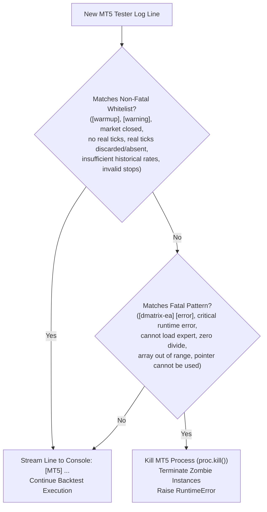

# Python MLOps & Machine Learning Engine (`src/`)

This directory contains the Python MLOps subsystem responsible for configuration loading, scoped file cleanup, MetaTrader 5 API integration, Strategy Tester watchdog orchestration, dual XGBoost Bayesian hyperparameter tuning, pure 1D Float ONNX export, and native `.set` preset generation.

---

## 📂 Module Index

| Module | Primary Class / Component | Responsibilities & Architectural Role |
|---|---|---|
| [`config.py`](config.py) | `AppConfig`, `DirectionalXGBConfig` | Strictly typed dataclass loader parsing parameters from `.env` (including Daily Schedule settings `TRADE_*`, `USE_GARCH_FEATURES`, `MAGIC_NUMBER`, pandemic blackout window `AVOID_PANDEMICTIME`, Triple Barrier labeling `LABEL_*`, Directional Evaluation settings `EVAL_*`, and Directional XGBoost overrides `XGB_BUY_*` / `XGB_SELL_*`). Enforces strict type conversion, mandatory key validation, transparent fallback to global settings, and feature count computation with zero hidden defaults. |
| [`cleaner.py`](cleaner.py) | `ScopedCleaner` | Atomic file cleaner strictly scoped to the active `<Symbol>_<Timeframe>`. Cleans previous `.ini` files, reports, logs, ONNX models, presets, and stray terminal `README.md` files, while selectively preserving dataset CSVs and metadata when `skip_dataset_generation` is enabled and protecting workspace documentation. |
| [`dataset_manager.py`](dataset_manager.py) | `DatasetManager` | Discovers, validates, and ingests historical `<Symbol>_<TF>_buy.csv` and `sell.csv` datasets across `Terminal/MQL5/Files` and `Common/Files`. Provides `has_existing_datasets()` for tester bypass and formats diagnostic logs upon backtest completion. |
| [`mt5_client.py`](mt5_client.py) | `MT5Client` | MetaTrader 5 API wrapper managing terminal initialization, symbol property verification, MQL5 code synchronization (strictly copying `.mq5`, `.mqh`, `.set`, `.mq4` and excluding docs/markdown), MetaEditor CLI compilation (`metaeditor64.exe`), institutional Strategy Tester `.ini` configuration generation (`Deposit=1000000000000000`, `Leverage=500`, `Model=4`, `ProfitInPips=0`, Triple Barrier inputs, pandemic blackout inputs), real-time live log streaming, and instant error interception with non-fatal warning tolerance (`invalid stops`, warmup, tick absence). |
| [`trainer.py`](trainer.py) | `DualXGBoostTrainer` | Trains two independent XGBoost classifiers (BUY and SELL) parameterized directionally via `DirectionalXGBConfig`, using strict chronological time-series splitting (`VALIDATION_PERCENTAGE`), Optuna Bayesian hyperparameter search optimizing directional metrics (`OPTUNA_OBJECTIVE_METRIC`), out-of-sample directional validation (ROC-AUC, LogLoss, Accuracy, Precision, Recall, F1, signal count/participation), parametric threshold sensitivity grid (`EVAL_THRESHOLD_*`), and detailed execution telemetry. |
| [`onnx_exporter.py`](onnx_exporter.py) | `ONNXExporter` | Converts trained XGBoost models to pure 1D float tensor graphs (`[None, num_features] -> [None, 2]`), eliminates `ZipMap` non-tensor operators, validates batch inference via `onnxruntime`, and deploys models across terminal and shared folders. |
| [`preset_generator.py`](preset_generator.py) | `PresetGenerator` | Generates native MT5 Expert Advisor `.set` configuration files for `LiveONNX-EA` and `DMatrix-EA` (including `InpMagicNumber`, `InpRiskGarchHorizon`, pandemic blackout window, Triple Barrier parameters, consecutive signal management, conflicting signals suppression, opposing regime defense inputs with MQL5 fallbacks, and GARCH risk settings), guaranteeing 100% parameter parity and zero train-serving skew. |
| [`template_generator.py`](template_generator.py) | `TemplateGenerator` | Programmatically generates MT5 chart template files (`.tpl`) styled with dark themes and pre-configured indicator overlays matching active feature toggles. |
| [`tools/macro_calendar.py`](tools/macro_calendar.py) | `MacroeconomicCalendar` | Macroeconomic & economic calendar diagnostic utility querying open financial feeds for high-impact FX events to cross-reference with Strategy Tester drawdowns and market volatility shocks. |
| [`tools/mt5_mcp_server.py`](tools/mt5_mcp_server.py) | `LocalMT5Client` | Native Model Context Protocol (MCP) server exposing 9 local MT5 diagnostic tools over Stdio JSON-RPC 2.0 (terminal/account state, symbol specifications, OHLCV rates, real-time ticks, open positions, pending orders, closed deals, and margin/risk viability checks). |

---

## 📡 Live Log Streaming & Error Interception Subsystem (`mt5_client.py`)

`MT5Client` features a robust real-time log streaming and error interception architecture that monitors the MetaTrader 5 Strategy Tester during dataset generation:

### 1. Incremental File Offset Tailing & Encoding Auto-Detection
- **Offset Tracking**: Scans `Tester/logs` and agent log directories, initializing byte offsets (`file_offsets`) to read exclusively newly produced log chunks on each 0.5s poll cycle.
- **Encoding Auto-Detection**: MT5 Strategy Tester writes logs in either UTF-16 (little-endian containing null byte `\x00` delimiters) or UTF-8. The streaming engine dynamically checks for `b"\x00"` in raw bytes:
  - If null bytes are present: attempts `utf-16` decoding with fallback to `utf-8`.
  - If null bytes are absent: attempts `utf-8` decoding with fallback to `utf-16`.
- **Fault Tolerance**: Encoding decoding errors (`errors="ignore"`) are safely suppressed to prevent stream crashes.

### 2. Non-Fatal Warning & Warmup Whitelist vs. Fatal Error Guard



| Classification | Pattern Filter | Pipeline Action |
|---|---|---|
| **Non-Fatal Whitelist** | `[warmup]`, `[warning]`, `market closed`, `no real ticks`, `real ticks discarded`, `real ticks absent`, `insufficient historical rates`, `waiting for history buffer`, `insufficient rates`, `invalid stops` | Streamed directly to stdout (`[MT5] <line>`). The backtest proceeds normally without triggering fatal aborts on spread spike rejections. |
| **Fatal Interception** | `[dmatrix-ea] [error]`, `critical runtime error`, `cannot load expert`, `zero divide`, `array out of range`, `pointer cannot be used` | Strategy Tester process is killed immediately (`proc.kill()`, `_terminate_running_mt5()`) and a `RuntimeError` is raised with full log context. |

---

## ⏱️ Training Execution Telemetry & Directional Evaluation Subsystem (`trainer.py`)

`DualXGBoostTrainer` features institutional-grade telemetry and mathematical evaluation specifically calibrated for Forex directional prediction:

1. **Start & Completion Timestamps**:
   - Emits ISO timestamps and formatted elapsed execution duration (`HH:MM:SS`):
     ```
     [*] Training started at: [YYYY-MM-DD HH:MM:SS]
     [*] Training completed at: [YYYY-MM-DD HH:MM:SS] (Elapsed: HH:MM:SS)
     ```

2. **Dataset Class Balance Distribution (Separated by `[BUY]` and `[SELL]`)**:
   - Reports sample counts and percentages for directional setups ($y=1$) and neutral/adverse setups ($y=0$) across both training and chronological validation partitions.

3. **Directional Validation Metrics (at directional cutoff or global `EVAL_CLASSIFICATION_THRESHOLD`)**:
   - **ROC-AUC & LogLoss**: Probability ranking quality and calibration loss.
   - **Directional Precision (Win Rate)**: $\frac{TP}{TP + FP}$ — exact proportion of emitted trade signals that hit profit target.
   - **Momentum Recall**: $\frac{TP}{TP + FN}$ — proportion of actual market runs captured.
   - **F1-Score**: Harmonic mean between precision and recall.
   - **Active Signals Count & Frequency**: Number of executed signals and bar participation percentage.

4. **Parametric Directional Sensitivity Grid**:
   - When `EVAL_ENABLE_THRESHOLD_GRID=1`, prints a formatted ASCII sensitivity table iterating through `EVAL_THRESHOLD_MIN` to `EVAL_THRESHOLD_MAX` in `EVAL_THRESHOLD_STEP` increments.
   - Enables traders to empirically select the optimal acceptance threshold (`InpMinimalLevelAcceptedBuy` / `InpMinimalLevelAcceptedSell`) balancing trade frequency against win rate.

5. **Directional XGBoost Decoupling (`DirectionalXGBConfig`)**:
   - Supports independent tree architectures (`XGB_BUY_*` / `XGB_SELL_*`), search budgets (`OPTUNA_BUY_TRIALS` / `OPTUNA_SELL_TRIALS`), and objective metrics (`OPTUNA_BUY_OBJECTIVE_METRIC` / `OPTUNA_SELL_OBJECTIVE_METRIC`) while preserving 100% zero train-serving feature parity (130 features).

---

## 📐 Design Principles & Coding Standards

1. **Strict Type Safety & Immutability**: All configuration parameters are strongly typed via Python `@dataclass(frozen=True)` and checked with zero implicit fallbacks.
2. **SOLID & High Cohesion**: Each module encapsulates a single domain responsibility (cleaner, compiler, trainer, exporter).
3. **No Lookahead Bias / Leakage**: Training strictly respects temporal chronological splitting without shuffling.
4. **Flake8 & SonarQube Cleanliness**: Formatted with PEP 8 compliance, descriptive naming, explicit docstrings, and $< 120$ character line lengths.

